## 第 8 章　Stack

### 適用範圍

本章介紹 Stack 的資料模型，以及如何用「最近加入、尚未完成」的狀態理解括號匹配、Undo、運算式、DFS 與 Monotonic Stack。

Stack 的基本動作不複雜，但真正影響演算法正確性的問題通常是：

- Stack 中每個元素代表什麼未完成工作。
- 為什麼只需要查看最上方元素。
- 哪些條件會 Push，哪些條件會 Pop。
- Pop 時是否已能確定該元素的最終答案。
- Stack 應保存 值、索引、節點，還是完整 狀態。
- 空 Stack 時是否仍呼叫 `top()` 或 `pop()`。
- 巢狀迴圈為何仍可能是 O(n)，而不是 O(n²)。

當工作必須依照「後加入者先完成」的順序處理時，Stack 通常很合適。最後建立的未完成工作，通常最先被完成。例如：

- 最內層括號最先配對。
- 最近一次修改最先 Undo。
- DFS 最近發現的 節點 最先展開。
- 尚未找到答案的最近 索引，可能先被目前元素解決。

本章會建立一套固定流程：

1. 先定義 Stack 元素 的語意。
2. 寫出 Push、查看 Top 與 Pop 的條件。
3. 確認空 Stack 是否具有特殊意義。
4. 使用 不變條件 描述 Stack 對已處理 前綴 的代表關係。
5. Pop 前確認答案或狀態已可確定。
6. 根據輸出需求選擇保存 值、索引 或完整 狀態。
7. 分析每個元素總共 Push 與 Pop 幾次。
8. 使用空輸入、單一元素、完全巢狀、重複值與無答案案例測試。

### 適用讀者

- 會使用 `push`、`top` 與 `pop`，但不理解 Stack 狀態 語意的讀者。
- 需要學習括號匹配、運算式 與 Next Greater Element 的讀者。
- 看到雙層 `while` 就直接判定 O(n²) 的讀者。
- 不確定 Stack 應保存 值 還是 索引 的讀者。
- 經常在空 Stack 上呼叫 `top()` 或 `pop()` 的讀者。
- 容易混淆嚴格遞增、非遞減與其他單調條件的讀者。
- 想理解遞迴 DFS 與自行管理的 Stack 關係的讀者。
- 同時使用 C++ 與 C，需要自行管理固定容量 Stack 的讀者。

### 快速導覽

- [Stack 到底保存什麼](#81-stack-到底保存什麼)：建立 LIFO 與未完成狀態模型。
- [第一步：定義 Stack 元素](#82-第一步定義-stack-element)：決定保存 值、索引 或完整 狀態。
- [第二步：安全使用 Stack 介面](#83-第二步安全使用-stack-介面)：整理空 Stack 與 Top 的前置條件。
- [完整案例：括號匹配](#84-完整案例括號匹配)：使用 Stack 保存尚未配對的開括號。
- [第三步：將遞迴改成自行管理的 Stack](#85-第三步將遞迴改成自行管理的-stack)：理解 DFS 與 呼叫堆疊（call stack）。
- [第四步：使用 Stack 處理 運算式](#86-第四步使用-stack-處理-運算式)：區分 運算元、運算子 與解析規格。
- [完整案例：計算後序運算式](#87-完整案例計算後序運算式)：依序取出最近 運算元。
- [第五步：理解 Monotonic Stack](#88-第五步理解-monotonic-stack)：保存仍有可能成為答案的候選。
- [完整案例：右側第一個嚴格更大值](#89-完整案例右側第一個嚴格更大值)：以 索引 Stack 決定答案。
- [第六步：處理重複值與單調語意](#810-第六步處理重複值與單調語意)：區分 `<`、`<=` 與候選保留規則。
- [第七步：分析攤銷複雜度](#811-第七步分析攤銷複雜度)：使用 Push 與 Pop 總次數計算 O(n)。
- [第八步：使用 Stack 支援 Undo](#812-第八步使用-stack-支援-undo)：保存歷史 狀態 或反向動作。
- [C 語言中的 Stack](#813-c-語言中的-stack)：使用 Array、Top 索引 與容量檢查。
- [建立自己的 Stack 分析表](#814-建立自己的-stack-分析表)：形成固定檢查流程。
- [常見問題與判讀](#815-常見問題與判讀)：整理常見錯誤與排查方向。
- [本章檢查表](#816-本章檢查表)：確認必要觀念是否完整。
- [本章重點](#817-本章重點)：回顧核心方法。

### 本章名詞約定

本章保留 C++ 介面名稱與常見英文術語，但第一次出現時會附上正體中文說明。後文的用字統一如下：

- **堆疊（Stack）**：後進先出（Last In, First Out，LIFO）的資料結構。
- **推入（push）**：把新元素放到堆疊頂端。`push` 是 C++ 介面名稱，因此程式說明中保留英文。
- **頂端元素（top）**：目前最後推入、下一個會被移除的元素。`top()` 只讀取，不會移除。
- **彈出（pop）**：移除頂端元素。C++ 的 `pop()` 不會回傳被移除的值。
- **值（value）**：資料本身，例如數字 `7` 或字元 `'('`。
- **索引（index）**：元素在陣列或字串中的位置，用於回寫答案或計算距離。
- **節點（node）**：樹或圖中的一個資料單位。
- **呼叫框架（frame）**：一次函式呼叫所需保存的參數、區域變數與執行進度。
- **狀態（state）**：演算法在某一時刻必須記住的資訊。它不是特定 C++ 型別。
- **自行管理的 Stack**：由程式碼明確建立並維護的 `std::stack` 或自製容器。本文統一稱為「自行管理的 Stack」。
- **呼叫堆疊（call stack）**：程式執行遞迴函式時，由執行環境維護的函式呼叫紀錄。
- **單調 Stack（monotonic stack）**：使堆疊內對應值維持指定單調次序，用來保存尚未確定答案的候選位置。
- **不變條件（invariant）**：在迴圈每一輪的指定時間點都必須成立的敘述，用來檢查與說明演算法正確性。

> 「自行管理的 Stack」與「呼叫堆疊」的差異在於由誰保存資料。前者由程式設計者決定元素內容與推入、彈出時機；後者由執行環境保存函式呼叫資訊。

### 8.1 Stack 到底保存什麼

Stack 採用後進先出（Last In, First Out，LIFO）規則。最後推入的元素位於頂端，因此會最先被讀取或彈出。

在 C++ 中：

- `push(value)`：把元素推入頂端。
- `top()`：讀取頂端元素，但不移除。
- `pop()`：移除頂端元素，但不回傳被移除的值。

```text
Push 4
Push 7
Push 2

Top
 ↓
[2]
[7]
[4]
```

接著 Pop 一次會移除 2，新的 Top 變成 7。

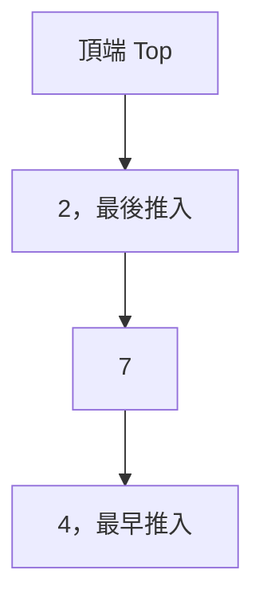

Pop 之後：

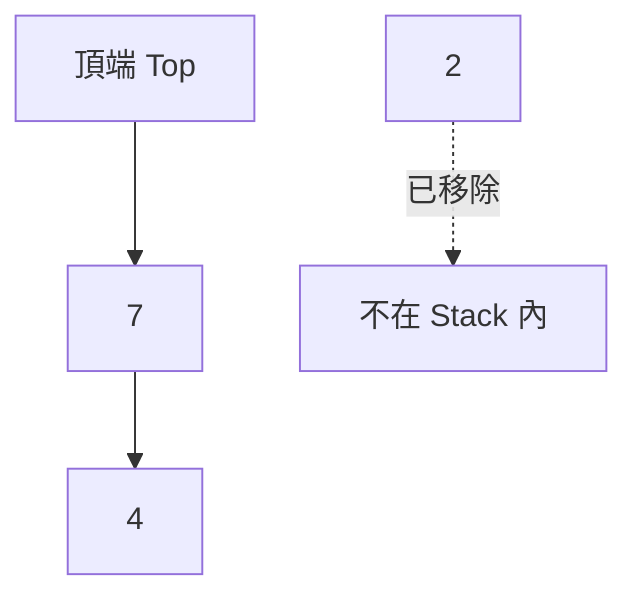

圖形由上到下表示 Stack 由 Top 到 Bottom，不代表元素位於 Linked List。

#### Stack 的核心不是反向資料

Stack 讀取與移除元素的順序，和元素加入順序相反。不過，真正重要的不是「反向」，而是以下規則：

> 最後加入且仍未完成的工作，會最先被處理。

例如：

<table>
<tr><th>問題</th><th>Stack 元素 代表的未完成狀態</th></tr>
<tr><td>括號匹配</td><td>尚未遇到右括號的開括號</td></tr>
<tr><td>運算式</td><td>尚未被 運算子 使用的 運算元，或尚待執行的 運算子</td></tr>
<tr><td>DFS</td><td>已發現但尚未完整處理的 節點 或 呼叫框架</td></tr>
<tr><td>Next Greater Element</td><td>尚未找到右側更大值的 索引</td></tr>
<tr><td>Undo</td><td>可被回復的最近歷史 狀態 或反向動作</td></tr>
</table>

#### 為什麼只看 Top

如果問題具備巢狀或最近優先的結構，下一個可完成的工作必定是最近加入者。

以括號為例：

```text
([{}])
```

讀到 `}` 時，必須先和最近的 `{` 配對，而不能越過它去配對更早的 `(` 或 `[`。因此只需檢查 Stack Top。

#### Stack 與其他容器的差異

- Stack 只允許從同一端加入與移除。
- Queue 從一端加入、另一端移除，符合 First In, First Out。
- Dynamic Array 雖然也能在尾端 `push_back` 與 `pop_back`，但提供更多隨機存取能力。

選擇 Stack 表示演算法只需要最近未完成狀態，不需要任意查看中間元素。

### 8.2 第一步：定義 Stack 元素

開始寫程式前，先用一句話完成：

> Stack 中每個元素代表＿＿＿＿。

如果這句話不清楚，Push 與 Pop 條件通常也不會清楚。

#### 保存值（Value）

若答案只取決於元素內容，可以保存 值。

括號匹配：

```cpp
std::stack<char> openings;
```

每個元素代表尚未配對的開括號種類。

#### 保存索引（Index）

如果需要計算位置、距離，或之後回到原輸入取 值，通常保存 索引。

```cpp
std::stack<int> indices;
```

例如 Next Greater Element 若要回傳距離：

```text
distance = currentIndex - previousIndex
```

只保存 值 無法得知位置差。

#### 保存節點（Node）

DFS 可保存下一個要展開的 節點：

```cpp
std::stack<TreeNode*> pending;
```

若只需走訪 節點，指標 可能足夠；若遞迴函式還保存深度、返回階段或部分答案，自行管理的 Stack 也需要保存相同 狀態。

#### 保存完整呼叫框架（Frame）

```cpp
struct 呼叫框架
{
    TreeNode* node;
    int depth;
    bool expanded;
};
```

每個 呼叫框架 可能代表一次尚未完成的函式呼叫。從遞迴改寫為迭代時，不能只保存 節點，還要確認原 呼叫堆疊（call stack） 中有哪些區域變數與執行階段。

#### Value 與 Index 的選擇問題

遇到 Stack 題目時，可以依序問：

- 之後是否需要知道原位置？
- 是否需要計算距離或區間長度？
- 輸入 值 是否可能重複？
- 是否需要由 索引 重新讀取目前 值？
- 一個 值 是否足以區分不同候選？

如果任何答案需要位置，保存 索引 往往較合適。

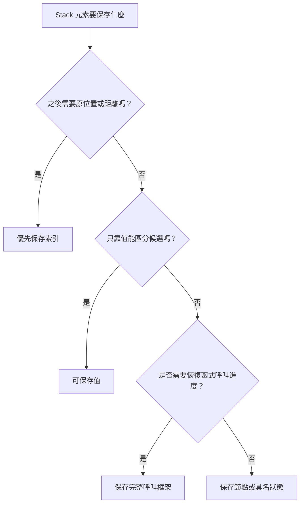

這是選擇 狀態 的檢查流程，不是固定規則。實際型別仍以 後置條件 與後續更新需求為準。

### 8.3 第二步：安全使用 Stack 介面

C++ 的 `std::stack` 常用介面：

```cpp
stack.empty()
stack.size()
stack.top()
stack.push(value)
stack.pop()
```

#### `top()` 與 `pop()` 的前置條件

呼叫 `top()` 或 `pop()` 前，Stack 必須非空：

```cpp
if (!values.empty())
{
    int value = values.top();
    values.pop();
}
```

在空 Stack 上呼叫它們會造成未定義行為。

#### `pop()` 不回傳元素

C++ `std::stack::pop()` 只移除 Top，不回傳被移除值。若需要 值，應先讀取：

```cpp
int value = values.top();
values.pop();
```

順序不能顛倒。Pop 後再讀 Top，取得的是下一個元素，而且 Stack 可能已空。

#### 檢查順序

錯誤條件：

```cpp
if (values.top() == target && !values.empty())
```

程式會先呼叫 `top()`，然後才檢查是否為空。

正確順序：

```cpp
if (!values.empty() && values.top() == target)
```

`&&` 由左至右進行 Short-circuit。Stack 為空時不會執行右側 `top()`。

#### 空 Stack 的演算法語意

空 Stack 不一定表示錯誤。它可能代表：

- 尚未出現開括號。
- 所有工作都已完成。
- 目前沒有未解決候選。
- DFS 尚未開始或已經結束。

應由演算法規格決定何時空 Stack 合法，何時表示輸入不合法。

### 8.4 完整案例：括號匹配

#### 問題規格

給定包含一般字元和三種括號的字串：

```text
() [] {}
```

判斷所有括號是否正確配對並符合巢狀順序。一般字元忽略。

```text
"a{b[c](d)}" -> true
"([)]"       -> false
"(()"        -> false
```

#### 前置條件（Precondition）

本案例逐 Byte 處理 ASCII 括號。其他 Byte 一律忽略。

#### 後置條件（Postcondition）

回傳 `true`，若且唯若：

- 每個右括號都有同類型的開括號。
- 配對符合正確巢狀順序。
- 每個開括號最終都有右括號配對。

#### 輔助函式

```cpp
bool matches(char open, char close)
{
    return (open == '(' && close == ')') ||
           (open == '[' && close == ']') ||
           (open == '{' && close == '}');
}
```

#### C++ 解法

```cpp
#include <stack>
#include <string_view>

bool isValidParentheses(std::string_view text)
{
    std::stack<char> openings;

    for (char ch : text)
    {
        if (ch == '(' || ch == '[' || ch == '{')
        {
            openings.push(ch);
            continue;
        }

        if (ch != ')' && ch != ']' && ch != '}')
        {
            continue;
        }

        if (openings.empty())
        {
            return false;
        }

        const char open = openings.top();
        openings.pop();

        if (!matches(open, ch))
        {
            return false;
        }
    }

    return openings.empty();
}
```

#### Stack 元素 語意

> Stack 由下到上保存目前已處理 前綴 中，尚未配對的開括號。

順序同時代表巢狀結構。Top 是下一個右括號唯一可以合法配對的開括號。

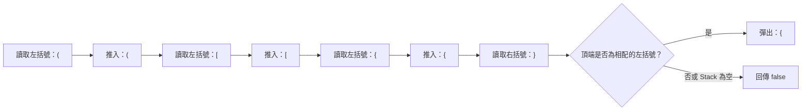

讀到右括號時不能搜尋 Stack 中間位置。若 Top 不相配，就表示巢狀順序已經錯誤。

#### 迴圈不變條件（Loop Invariant）

每輪開始前：

1. Stack 保存已處理 前綴 中尚未配對的所有開括號。
2. Stack 順序和這些開括號的巢狀順序一致。
3. 已從 Stack Pop 的開括號都已和合法右括號配對。
4. 若尚未回傳 `false`，已處理 前綴 沒有括號次序錯誤。

#### Initialization

開始時已處理 前綴 為空，沒有尚未配對的開括號，因此空 Stack 正確表示目前狀態。

#### Maintenance

- 遇到開括號：它成為最近尚未完成的括號，Push 到 Top。
- 遇到一般字元：不影響括號 狀態。
- 遇到右括號且 Stack 為空：沒有可配對開括號，立即失敗。
- 遇到右括號且類型不同：巢狀順序被破壞，立即失敗。
- 類型相同：Top 的開括號完成配對並 Pop。

#### Termination

完整走訪後仍需檢查 Stack 是否為空。

如果直接回傳 `true`，輸入 `"(("` 會被誤判。此時沒有錯誤右括號，但仍有開括號未完成。

#### 逐輪執行

輸入：`{[()]}`

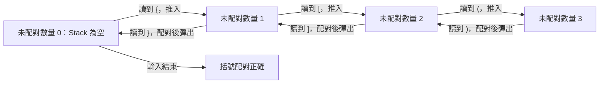

狀態名稱表示目前未配對括號數量。實際 Stack 內容仍由下方逐輪表格呈現。

<table>
<tr><th>目前 Byte</th><th>動作</th><th>Stack 由底到頂</th></tr>
<tr><td>{</td><td>Push</td><td>{</td></tr>
<tr><td>[</td><td>Push</td><td>{ [</td></tr>
<tr><td>(</td><td>Push</td><td>{ [ (</td></tr>
<tr><td>)</td><td>配對並 Pop</td><td>{ [</td></tr>
<tr><td>]</td><td>配對並 Pop</td><td>{</td></tr>
<tr><td>}</td><td>配對並 Pop</td><td>空</td></tr>
</table>

#### 邊界案例

<table>
<tr><th>輸入</th><th>答案</th><th>目的</th></tr>
<tr><td>空字串</td><td>true</td><td>沒有未配對括號</td></tr>
<tr><td>abc</td><td>true</td><td>一般字元全部忽略</td></tr>
<tr><td>(</td><td>false</td><td>剩餘開括號</td></tr>
<tr><td>)</td><td>false</td><td>右括號無可配對元素</td></tr>
<tr><td>()[]</td><td>true</td><td>連續區段</td></tr>
<tr><td>([])</td><td>true</td><td>巢狀結構</td></tr>
<tr><td>([)]</td><td>false</td><td>數量相同但巢狀順序錯誤</td></tr>
</table>

#### 複雜度

每個 Byte 最多 Push 或 Pop 一次：

- 時間複雜度：O(n)。
- 額外空間：最差 O(n)，例如全部都是開括號。

### 8.5 第三步：將遞迴改成自行管理的 Stack

函式遞迴時，執行環境會使用 呼叫堆疊（call stack） 保存每層呼叫的資訊，例如：

- 參數。
- 區域變數。
- 返回位置。
- 尚未執行的後續步驟。

因此，許多遞迴可以改寫為自行管理的 Stack，但必須保存足以恢復每層工作的 狀態。

#### Tree DFS

先序走訪順序為：

```text
節點 → Left → Right
```

自行管理的 Stack 版本：

```cpp
#include <stack>
#include <vector>

std::vector<int> preorder(TreeNode* root)
{
    std::vector<int> result;

    if (root == nullptr)
    {
        return result;
    }

    std::stack<TreeNode*> pending;
    pending.push(root);

    while (!pending.empty())
    {
        TreeNode* node = pending.top();
        pending.pop();

        result.push_back(node->value);

        if (node->right != nullptr)
        {
            pending.push(node->right);
        }

        if (node->left != nullptr)
        {
            pending.push(node->left);
        }
    }

    return result;
}
```

#### 為什麼先 Push Right

Stack 是 LIFO。若希望下一個先處理 Left，必須先 Push Right，再 Push Left。Left 位於 Top，會先被 Pop。

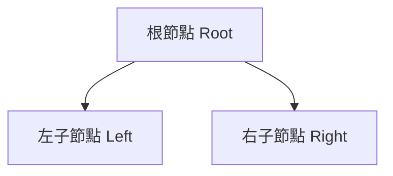

處理 Root 後的 Push 順序：

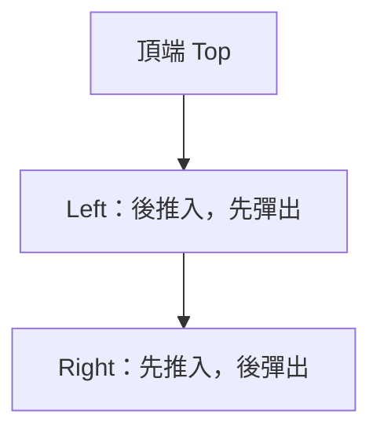

因此實際走訪順序是 Root、Left、Right。若先 Push Left，下一個被處理的反而會是 Right。

#### Stack 元素 語意

> Stack 保存已發現但尚未走訪的 Tree 節點，Top 是下一個處理對象。

#### 不是所有遞迴只保存 節點 就夠

後序走訪、運算式 Evaluation 或 Backtracking 可能需要記錄：

- 子節點 是否已處理。
- 目前正在處理哪個分支。
- 目前累積答案。
- 返回後接著執行哪一步。

如果原遞迴在呼叫返回後還有工作，自行管理的 Stack 通常需要 呼叫框架 或額外標記，而不只是 節點 指標。

### 8.6 第四步：使用 Stack 處理 運算式

運算式 題目需要先定義語法，而不是看到運算子便直接 Push 或 Pop。

至少確認：

- 運算式 是 Infix、前綴 還是 Postfix。
- Token 是單一字元還是可能有多位數。
- 是否允許空白。
- 支援哪些 運算子。
- 運算子 的優先順序與結合方向。
- 是否允許一元運算子。
- 除以 0 如何處理。
- Overflow 如何回報。
- 輸入不合法時如何表示。

#### 三種常見表示

```text
Infix：   3 + 4
前綴：  + 3 4
Postfix： 3 4 +
```

Postfix 不需要括號或優先順序即可直接由左向右求值。遇到 運算元 就 Push；遇到 Binary 運算子 就 Pop 兩個 運算元，計算後再 Push 結果。

#### 運算元 順序不能顛倒

對 Postfix：

```text
8 3 -
```

第一次 Pop 得到右 運算元 3，第二次 Pop 得到左 運算元 8：

```cpp
right = top(); pop();
left = top(); pop();
result = left - right;
```

若寫成 `right - left`，加法與乘法可能看不出錯誤，但減法與除法會失敗。

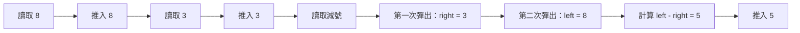

Binary 運算子 的 運算元 順序由 Postfix 語法決定，不能依 Pop 順序直接寫成第一個減第二個。

### 8.7 完整案例：計算後序運算式

#### 問題規格

輸入已切分的 Token，支援整數與 `+`、`-`、`*` 三種 Binary 運算子。若 運算式 不合法，回傳 `std::nullopt`。

```text
["2", "3", "+", "4", "*"]
= (2 + 3) * 4
= 20
```

#### C++ 解法

```cpp
#include <charconv>
#include <optional>
#include <stack>
#include <string>
#include <vector>

std::optional<long long> parseInteger(
    const std::string& token)
{
    long long value = 0;
    const char* begin = token.data();
    const char* end = begin + token.size();

    const auto result = std::from_chars(begin, end, value);

    if (result.ec != std::errc{} || result.ptr != end)
    {
        return std::nullopt;
    }

    return value;
}

std::optional<long long> evaluatePostfix(
    const std::vector<std::string>& tokens)
{
    std::stack<long long> operands;

    for (const std::string& token : tokens)
    {
        const bool isOperator =
            token == "+" || token == "-" || token == "*";

        if (!isOperator)
        {
            auto value = parseInteger(token);
            if (!value.has_value())
            {
                return std::nullopt;
            }

            operands.push(*value);
            continue;
        }

        if (operands.size() < 2)
        {
            return std::nullopt;
        }

        const long long right = operands.top();
        operands.pop();

        const long long left = operands.top();
        operands.pop();

        if (token == "+")
        {
            operands.push(left + right);
        }
        else if (token == "-")
        {
            operands.push(left - right);
        }
        else
        {
            operands.push(left * right);
        }
    }

    if (operands.size() != 1)
    {
        return std::nullopt;
    }

    return operands.top();
}
```

#### Stack 元素 語意

> Stack 保存已解析完成，但尚未被後續 運算子 使用的運算結果。

這些結果可能來自單一 運算元，也可能來自已完成的子運算式。

#### 迴圈不變條件（Loop Invariant）

每輪開始前：

1. Stack 中每個元素都對應已處理 Token 前綴 中一個完整子運算式的結果。
2. Stack 順序和這些尚未被使用的結果在 Postfix 運算式 中的出現順序一致。
3. 尚未遇到足夠 運算元 的 運算子 會被判定為非法。

#### 最後為何必須恰好一個結果

若 Stack 為空，表示沒有完整答案。若有兩個以上元素，例如：

```text
2 3
```

代表有多個 運算元 沒有被 運算子 合併，也不是完整 運算式。

合法的完整 Postfix 運算式 最後應留下恰好一個結果。

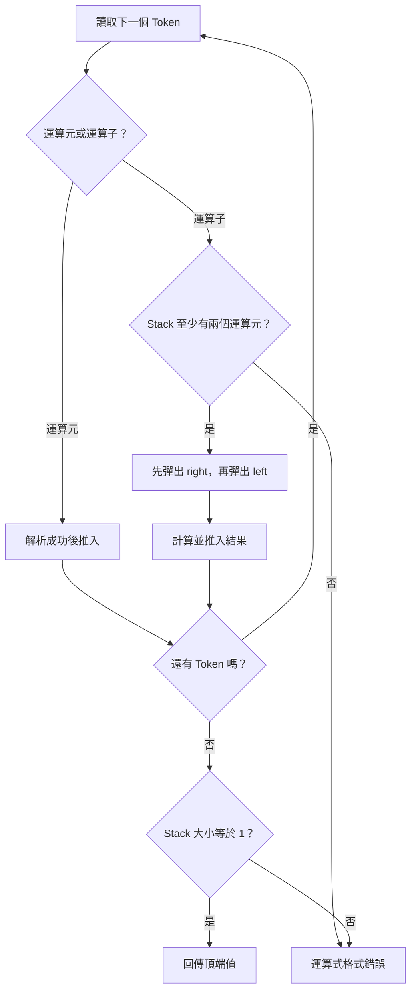

此流程把 運算元 不足與最後殘留多個結果視為兩類不同的格式錯誤。

#### 算術 Overflow

此範例著重 Stack 結構，尚未檢查 `long long` 加法、減法與乘法 Overflow。若題目限制沒有保證結果範圍，應在運算前檢查，或使用能表達更大範圍的數值型別。

#### 邊界案例

<table>
<tr><th>Tokens</th><th>結果</th><th>目的</th></tr>
<tr><td>[]</td><td>非法</td><td>沒有結果</td></tr>
<tr><td>["7"]</td><td>7</td><td>單一 運算元</td></tr>
<tr><td>["+"]</td><td>非法</td><td>運算元 不足</td></tr>
<tr><td>["8", "3", "-"]</td><td>5</td><td>確認左右 運算元 順序</td></tr>
<tr><td>["2", "3"]</td><td>非法</td><td>最後殘留多個結果</td></tr>
<tr><td>["2", "x", "+"]</td><td>非法</td><td>無法解析 Token</td></tr>
</table>

### 8.8 第五步：理解 Monotonic Stack

Monotonic Stack 讓 Stack 中對應的 值 維持某種單調關係，例如：

- 由底到頂嚴格遞增。
- 由底到頂非遞減。
- 由底到頂嚴格遞減。
- 由底到頂非遞增。

它常用於尋找：

- Next Greater Element。
- Next Smaller Element。
- Previous Greater Element。
- Previous Smaller Element。
- 每日溫度下一個更高日的距離。
- Histogram 最大矩形。

#### Stack 保存的是尚未確定答案的候選

以右側第一個嚴格更大值為例：

> Stack 保存目前已走訪，但尚未找到右側第一個嚴格更大值的 索引。

當新值比 Top 對應 值 更大時，Top 的答案就能確定。

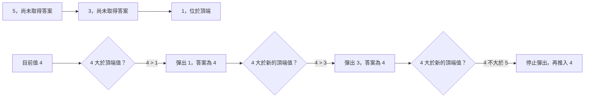

目前值可以一次解決多個候選，但遇到不小於目前值的 Top 時必須停止。

#### 為什麼可以 Pop

若 索引 `j` 位於目前 索引 `i` 左側，而且：

```text
nums[i] > nums[j]
```

又因為 `j` 從加入 Stack 到現在都沒有遇到更大值，所以 `i` 正是它遇到的第一個右側更大位置。答案確定後，`j` 不再需要保留。

#### 單調性是結果，不是目的

維持單調 Stack 的目的，是保留仍有可能被未來元素解決的候選，並移除答案已確定或被支配的候選。不能只記住「遇到較大就 Pop」，還要能說明 Pop 後為何不再需要該元素。

### 8.9 完整案例：右側第一個嚴格更大值

#### 問題規格

對每個位置，找出其右側第一個嚴格大於目前值的元素；若不存在，答案為 `-1`。

```text
輸入：[2, 1, 2, 4, 3]
輸出：[4, 2, 4, -1, -1]
```

注意 索引 0 的值為 2。索引 2 的值也是 2，不是嚴格更大，因此答案是後面的 4。

#### C++ 解法

```cpp
#include <stack>
#include <vector>

std::vector<int> nextGreater(
    const std::vector<int>& nums)
{
    std::vector<int> answer(nums.size(), -1);
    std::stack<int> indices;

    for (int i = 0;
         i < static_cast<int>(nums.size());
         ++i)
    {
        while (!indices.empty() &&
               nums[indices.top()] < nums[i])
        {
            answer[indices.top()] = nums[i];
            indices.pop();
        }

        indices.push(i);
    }

    return answer;
}
```

#### 為什麼保存 索引

雖然輸出是 值，仍需知道要把答案寫回哪個位置：

```cpp
answer[indices.top()] = nums[i];
```

若只保存未解決 值，重複值會讓程式不知道它屬於哪個輸出位置。

#### Stack 元素 語意

> Stack 保存已處理 前綴 中，尚未找到右側第一個嚴格更大值的 索引。

Stack 中對應的 值 由底到頂為非遞增：

```text
nums[index0] >= nums[index1] >= ...
```

相同值可同時保留，因為相同值不是嚴格更大。

#### 迴圈不變條件（Loop Invariant）

每輪開始前：

1. Stack 中的每個 索引 都小於目前 `i`。
2. 這些 索引 尚未在已走訪範圍內找到右側嚴格更大值。
3. Stack 中 索引 依加入順序排列。
4. 對應 值 由底到頂非遞增。
5. 已 Pop 的 索引 已取得正確且最靠左的右側嚴格更大值。

#### Pop 正確性

若目前 `nums[i]` 大於 Stack Top 對應 值：

- `i` 位於 Top 的右側。
- Top 在進入 Stack 後到 `i - 1` 都未遇到更大值，否則早已 Pop。
- `nums[i]` 嚴格更大。

因此 `nums[i]` 是 Top 的右側第一個嚴格更大值。

#### 為什麼使用 `while`

一個新值可能同時解決多個較小候選：

```text
Stack 對應值：5, 3, 1
目前值：4
```

4 會解決 1 與 3，但不能解決 5。因此要持續 Pop，直到 Stack 空，或 Top 不小於目前值。

#### 剩餘 索引 的答案

完整走訪後仍留在 Stack 的 索引，表示右側沒有嚴格更大值。`answer` 已預設為 `-1`，因此不需額外處理。

#### 逐輪執行

輸入：`[2, 1, 2, 4, 3]`

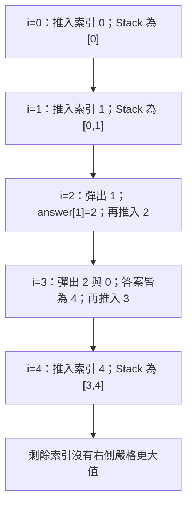

狀態轉移顯示一個目前值可能連續 Pop 多個 索引。

<table>
<tr><th>i</th><th>nums[i]</th><th>被 Pop 的 索引</th><th>確定答案</th><th>Stack 索引</th></tr>
<tr><td>0</td><td>2</td><td>無</td><td>無</td><td>0</td></tr>
<tr><td>1</td><td>1</td><td>無</td><td>無</td><td>0, 1</td></tr>
<tr><td>2</td><td>2</td><td>1</td><td>answer[1] = 2</td><td>0, 2</td></tr>
<tr><td>3</td><td>4</td><td>2, 0</td><td>answer[2] = 4，answer[0] = 4</td><td>3</td></tr>
<tr><td>4</td><td>3</td><td>無</td><td>無</td><td>3, 4</td></tr>
</table>

#### 距離版本

若題目要求距離，而不是更大值：

```cpp
answer[index] = i - index;
```

這再次說明保存 索引 的必要性。

### 8.10 第六步：處理重複值與單調語意

比較條件決定答案語意，也決定 Stack 是否保留重複值。

#### 找嚴格更大值

要在目前值嚴格大於候選時 Pop：

```cpp
nums[stack.top()] < nums[i]
```

相同值不會互相解決，因此 Stack 值 可呈非遞增。

#### 找大於等於值

若題目要求右側第一個大於等於目前值，條件可能改成：

```cpp
nums[stack.top()] <= nums[i]
```

相同值會解決之前候選，Stack 中通常不保留相同 值 的舊候選。

#### 單調名稱要和方向一起寫

只寫「遞增 Stack」容易產生歧義，應說明：

- 是由底到頂還是由頂到底。
- 是嚴格遞增，還是非遞減。
- Stack 保存 值 還是 索引 對應的 值。

例如本文的 Next Greater Stack：

> 索引 由底到頂依出現順序排列，對應 值 由底到頂非遞增。

#### 重複值測試

至少應測試：

```text
[2, 2]
[2, 2, 3]
[3, 2, 2]
[2, 3, 2, 3]
```

並逐一確認題目要的是嚴格更大，還是大於等於。

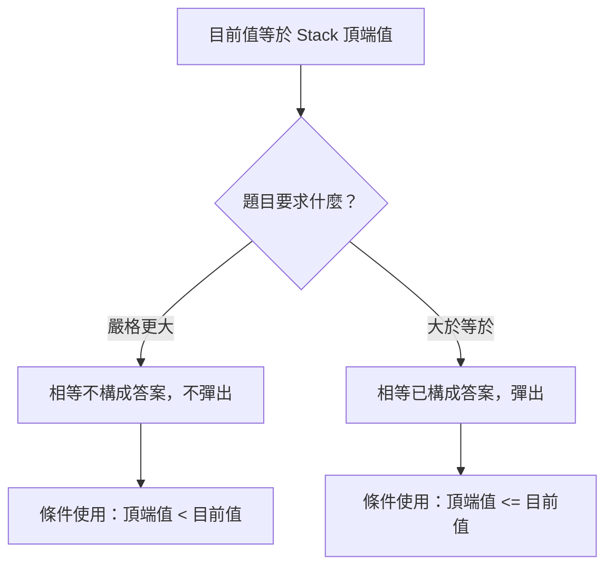

比較符號不是寫法偏好，而是 後置條件 的直接反映。

### 8.11 第七步：分析攤銷複雜度

Monotonic Stack 常包含巢狀迴圈：

```cpp
for (...)
{
    while (...)
    {
        stack.pop();
    }
    stack.push(...);
}
```

不能只看到 `for` 內有 `while` 就判定 O(n²)。需要計算所有元素在整段執行中能被處理多少次。

#### 聚合分析

每個 索引：

- 恰好 Push 一次。
- 最多 Pop 一次。

共有 n 個 索引，因此：

```text
總 Push 次數 = n
總 Pop 次數 <= n
```

Stack 相關動作總量為 O(n)。即使某一輪 Pop 很多元素，這些元素之後不會再次進入 Stack。

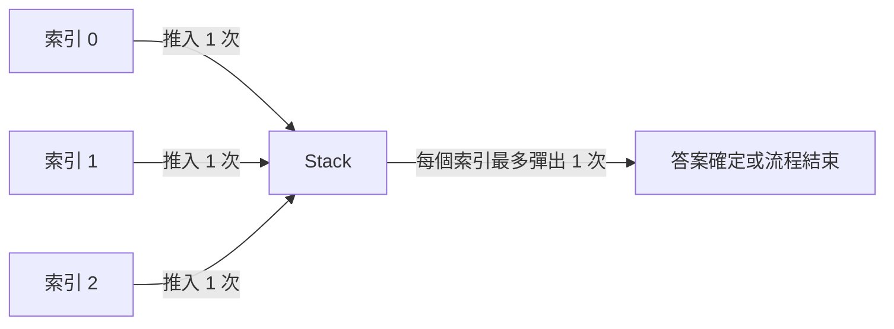

聚合計算為：

```text
n 次 Push + 最多 n 次 Pop = O(n)
```

巢狀 `while` 的單輪成本可能很高，但同一個 索引 不會被重複 Pop。

#### 最差單輪與總時間不同

某一輪可能 Pop O(n) 個元素，例如嚴格遞增輸入最後出現很大值。但先前的多輪幾乎沒有 Pop。分析完整執行總工作量後，仍是 O(n)。

#### 空間複雜度

若沒有元素能被 Pop，例如嚴格遞減輸入，所有 索引 都留在 Stack：

```text
[n, n-1, ..., 1]
```

最差額外空間為 O(n)。

#### 何時真的可能是 O(n²)

若元素被 Pop 後又重新 Push 多次，或內層每次都重新走訪 Stack 全部內容而不移除，則需要重新分析。O(n) 來自「每個元素只進出固定次數」，不是來自使用 Stack 這個名稱。

### 8.12 第八步：使用 Stack 支援 Undo

Undo 的核心也是 LIFO：最近完成的修改最先被取消。

#### 保存完整舊 狀態

```cpp
std::stack<DocumentState> history;

history.push(currentState);
applyChange(currentState, change);
```

Undo 時：

```cpp
currentState = history.top();
history.pop();
```

這種方式容易理解，但完整 狀態 很大時，複製成本可能較高。

#### 保存反向動作

也可以保存如何撤銷：

```text
原動作：在 索引 5 插入 "abc"
Undo：從 索引 5 移除 3 個字元
```

此方式可能較省空間，但需要每種修改都有正確反向動作。

#### Redo

若支援 Redo，常使用兩個 Stack：

- Undo Stack：已完成且可撤銷的動作。
- Redo Stack：已撤銷且可重做的動作。

執行新修改時，通常需要清空 Redo Stack，因為歷史分支已改變。這項行為屬於產品規格，應明確定義。

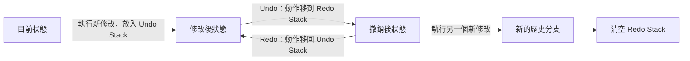

Undo 與 Redo 的 Stack 元素 可以是完整舊 狀態，也可以是具備正向與反向方法的 Command。

#### 所有權（Ownership）與資源

若 Stack 元素 保存大型物件、指標 或資源 控制代碼，需要另外確認：

- Push 是複製還是移轉 所有權。
- Pop 後資料何時銷毀。
- 歷史上限如何控制。
- 清空歷史是否正確釋放資源。

### 8.13 C 語言中的 Stack

C 標準函式庫沒有直接對應 `std::stack` 的容器。若最大容量已知，可使用 Array 與元素數量實作。

#### 固定容量 Stack

```c
#include <stdbool.h>
#include <stddef.h>

struct IntStack
{
    int *data;
    size_t size;
    size_t capacity;
};
```

不變條件：

- `0 <= size <= capacity`。
- 有效元素位於 `[0, size)`。
- 若非空，Top 位於 `data[size - 1]`。

#### Push

```c
bool stack_push(
    struct IntStack *stack,
    int value)
{
    if (stack == NULL ||
        stack->data == NULL ||
        stack->size >= stack->capacity)
    {
        return false;
    }

    stack->data[stack->size] = value;
    ++stack->size;
    return true;
}
```

#### Top

```c
bool stack_top(
    const struct IntStack *stack,
    int *result)
{
    if (stack == NULL ||
        result == NULL ||
        stack->size == 0)
    {
        return false;
    }

    *result = stack->data[stack->size - 1];
    return true;
}
```

#### Pop

```c
bool stack_pop(
    struct IntStack *stack,
    int *result)
{
    if (stack == NULL ||
        result == NULL ||
        stack->size == 0)
    {
        return false;
    }

    --stack->size;
    *result = stack->data[stack->size];
    return true;
}
```

先減少 `size` 後，新的 `size` 正好是原 Top 索引。

#### Overflow 與 Underflow

- Push 時 `size == capacity` 稱為 Stack Overflow，此處指容器容量不足，不是整數 Overflow。
- Pop 或 Top 時 `size == 0` 稱為 Stack Underflow。

介面以 `bool` 回報成功或失敗，呼叫端不應在失敗時讀取輸出參數。

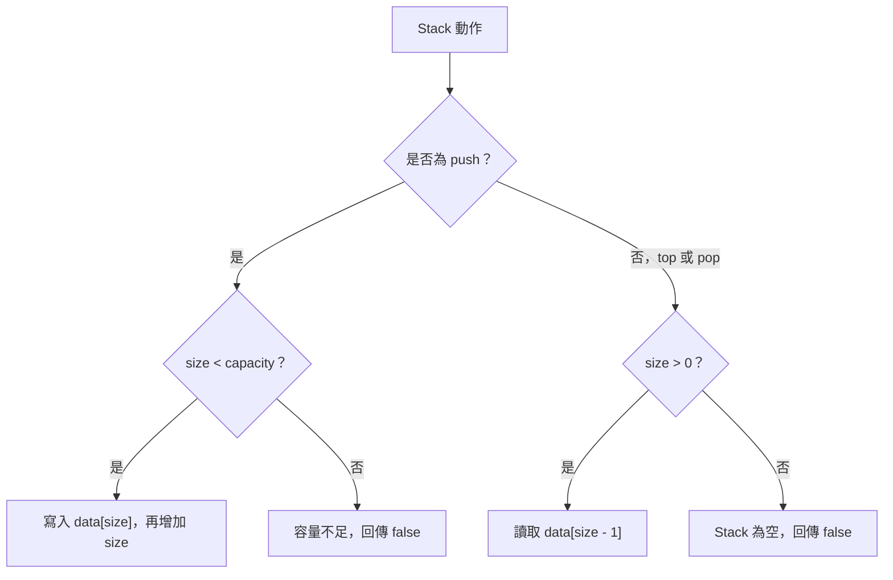

固定容量 Stack 的核心 不變條件 是 `0 <= size <= capacity`，有效資料位於 `[0, size)`。

#### 動態成長

若需要 Dynamic Stack，可使用 `realloc` 擴大 緩衝區，但必須處理：

- 新容量計算 Overflow。
- `realloc` 失敗時保留原 指標。
- 元素型別與資源生命週期。
- 誰負責最終 `free`。

演算法 Stack 狀態 和 緩衝區 所有權 仍應分開分析。

### 8.14 建立自己的 Stack 分析表

<table>
<tr><th>欄位</th><th>要回答的問題</th></tr>
<tr><td>未完成工作</td><td>Stack 中每個元素代表哪一種尚未完成狀態？</td></tr>
<tr><td>Element 型別</td><td>應保存 值、索引、節點 指標，還是完整 呼叫框架？</td></tr>
<tr><td>Push 條件</td><td>什麼事件會建立新的未完成工作？</td></tr>
<tr><td>Top 語意</td><td>為什麼下一個需要處理的一定是最近加入者？</td></tr>
<tr><td>Pop 條件</td><td>什麼時候該狀態已完成或不再可能成為答案？</td></tr>
<tr><td>Pop 結果</td><td>Pop 時是否已能確定最終答案？</td></tr>
<tr><td>空 Stack</td><td>代表合法完成、尚未開始，還是輸入錯誤？</td></tr>
<tr><td>不變條件</td><td>Stack 如何代表目前已處理 前綴？</td></tr>
<tr><td>單調方向</td><td>由底到頂是嚴格遞增、非遞減、嚴格遞減或非遞增？</td></tr>
<tr><td>重複值</td><td>相同值是否應互相解決？比較使用 `<` 還是 `<=`？</td></tr>
<tr><td>終止性</td><td>每輪是否會消耗輸入、Pop 狀態或建立有限工作？</td></tr>
<tr><td>複雜度</td><td>每個元素在完整流程中最多 Push 與 Pop 幾次？</td></tr>
<tr><td>錯誤輸入</td><td>運算元 不足、括號錯配或容量不足如何回報？</td></tr>
<tr><td>所有權</td><td>Stack 元素 是否擁有 指標 或大型資源？</td></tr>
<tr><td>邊界案例</td><td>空、單一元素、完全巢狀、全部不 Pop 與一次 Pop 多個如何處理？</td></tr>
</table>

### 8.15 常見問題與判讀

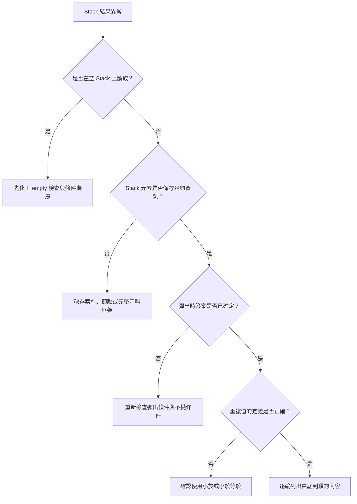

這個排查流程適合先找第一個被破壞的 Stack 狀態，再檢查最終輸出。

<table>
<tr><th>現象</th><th>可能原因</th><th>第一輪檢查</th></tr>
<tr><td>空 Stack Crash</td><td>未檢查便呼叫 `top()` 或 `pop()`</td><td>確認前置條件與 `empty()` 檢查順序</td></tr>
<tr><td>Pop 後取得錯誤元素</td><td>先 Pop 才讀取 Top</td><td>需要 值 時先 `top()` 再 `pop()`</td></tr>
<tr><td>括號數量相同仍判定錯誤</td><td>只計數，未檢查巢狀種類</td><td>Stack Top 是否為唯一合法配對開括號</td></tr>
<tr><td>剩餘開括號未被發現</td><td>走訪結束後直接回傳 true</td><td>最後是否檢查 Stack 為空</td></tr>
<tr><td>Postfix 減法結果顛倒</td><td>左右 運算元 Pop 順序錯誤</td><td>第一次 Pop 是 Right 運算元</td></tr>
<tr><td>非法 運算式 被接受</td><td>最後沒有檢查 Stack 大小</td><td>完整結果是否恰好剩一個</td></tr>
<tr><td>DFS 順序相反</td><td>子節點 Push 順序未考慮 LIFO</td><td>希望先走訪的 子節點 應較晚 Push</td></tr>
<tr><td>迭代 DFS 無法模擬遞迴</td><td>Stack 只存 節點，缺少呼叫階段</td><td>原 Call 呼叫框架 是否還有其他 狀態</td></tr>
<tr><td>距離無法計算</td><td>Stack 只保存 值</td><td>是否應保存 索引</td></tr>
<tr><td>重複值答案錯誤</td><td>`<` 與 `<=` 不符合題意</td><td>要求嚴格更大還是大於等於</td></tr>
<tr><td>Stack 不再單調</td><td>Pop 條件或 Push 時機錯誤</td><td>逐輪列出由底到頂的對應 值</td></tr>
<tr><td>Next Greater 不是第一個</td><td>Pop 正確性未和走訪順序連結</td><td>確認候選此前未遇到更大值</td></tr>
<tr><td>複雜度被判成 O(n²)</td><td>只看巢狀語法</td><td>計算每個 索引 的總 Push 與 Pop 次數</td></tr>
<tr><td>C Stack 寫出 緩衝區</td><td>Push 前未檢查 Capacity</td><td>確認 `size < capacity`</td></tr>
<tr><td>C Stack Pop 發生 Underflow</td><td>空 Stack 時仍減少 Size</td><td>先確認 `size > 0`</td></tr>
<tr><td>Undo 後資源失效</td><td>歷史 狀態 的 所有權 不清楚</td><td>檢查複製、移轉與銷毀責任</td></tr>
</table>

### 8.16 本章檢查表

- 我能用一句話說明 Stack 元素 代表的未完成狀態。
- 我知道 LIFO 適合最近建立、最先完成的工作。
- 我能根據輸出需求選擇保存 值、索引、節點 或完整 呼叫框架。
- 我會在 `top()` 與 `pop()` 前確認 Stack 非空。
- 我知道 C++ `std::stack::pop()` 不回傳被移除值。
- 我會先讀取 Top，再執行 Pop。
- 我能說明空 Stack 在目前演算法中的語意。
- 我能為括號匹配寫出 Stack 不變條件。
- 我知道遇到右括號時必須和最近未配對開括號比較。
- 我會在括號走訪結束後確認沒有剩餘開括號。
- 我知道自行管理的 Stack 是在保存原 呼叫堆疊（call stack） 的必要 狀態。
- 我會依 LIFO 特性安排 DFS 子節點 的 Push 順序。
- 我知道有些遞迴改寫需要保存執行階段，而不只是 節點。
- 我能正確區分 Postfix 的 Left 運算元 與 Right 運算元。
- 我會檢查 運算式 的 運算元 數量與最後 Stack 大小。
- 我能說明 Monotonic Stack 中哪些 索引 尚未取得答案。
- 我能證明 Pop 時目前元素是第一個符合條件的答案。
- 我知道需要位置或距離時通常應保存 索引。
- 我會明確寫出單調方向與嚴格或非嚴格關係。
- 我能依題意選擇 `<` 或 `<=`。
- 我能使用重複值測試單調語意。
- 我能用每個元素最多 Push 一次、Pop 一次說明 O(n)。
- 我知道單輪 O(n) 不代表整體一定 O(n²)。
- 我會另外分析 Stack 最差 O(n) 的空間需求。
- 我能區分 Undo 保存完整 狀態 與保存反向動作。
- 我知道 C 固定容量 Stack 需要同時檢查 Overflow 與 Underflow。

### 8.17 本章重點

- Stack 是 LIFO 結構，適合管理最近加入而尚未完成的狀態。
- 使用 Stack 前，應先定義每個元素代表什麼，而不是先寫 Push 與 Pop。
- 是否保存 值、索引、節點 或 呼叫框架，取決於答案和後續處理需要哪些資訊。
- `top()` 與 `pop()` 的前置條件都是 Stack 非空。
- 括號匹配依賴巢狀順序，右括號只能和最近尚未配對的開括號配對。
- 走訪結束後 Stack 必須為空，才能確認沒有剩餘開括號。
- 自行管理的 Stack 可模擬遞迴 呼叫堆疊（call stack），但必須保存原呼叫所需的完整 狀態。
- DFS 子節點 的 Push 順序和實際走訪順序相反，因為後 Push 者先處理。
- Postfix 運算式 遇到 Binary 運算子 時，第一次 Pop 是 Right 運算元，第二次才是 Left 運算元。
- Monotonic Stack 保存尚未確定答案，而且仍可能被未來元素解決的候選。
- Pop 候選前，必須能說明目前元素為何已確定它的最終答案。
- Next Greater 題目若需要寫回位置或計算距離，通常應保存 索引。
- `<` 與 `<=` 分別對應不同的嚴格或非嚴格答案語意，也會影響重複值保留方式。
- 單調方向應明確寫成由底到頂的嚴格遞增、非遞減、嚴格遞減或非遞增。
- Monotonic Stack 雖有巢狀 `while`，但每個元素最多 Push 與 Pop 一次，因此總時間可為 O(n)。
- Undo 也使用 LIFO，但必須另外定義歷史 狀態、Redo 規則與資源 所有權。
- C 中可使用 Array、Size 與 Capacity 建立 Stack，並以回傳狀態處理 Overflow 與 Underflow。
