## 第 9 章　Queue 與 Deque

### 適用範圍

本章介紹 Queue、Deque 與它們在 BFS、Multi-source BFS、Circular Queue、工作排程及 Sliding Window Maximum 中的使用方式。

Queue 的介面不複雜，但要正確使用，必須先回答幾個問題：

- Queue 中每個元素代表哪一個尚待處理的狀態。
- 為什麼較早加入的狀態應先處理。
- 何時標記 Visited，才能避免重複入列。
- BFS 第一次發現 Node 為何能得到最少 Edge 數。
- Deque Front 與 Back 分別負責移除哪一類元素。
- Sliding Window 中為何應保存 Index，而不只保存 Value。
- 普通 Queue、Deque 與 Priority Queue 的順序規則有何差異。

本章會建立一套固定流程：

1. 先定義 Queue Element 的 State 語意。
2. 確認處理順序是 FIFO、兩端更新，還是依 Priority。
3. 為 BFS 定義 Distance 與 Visited 的更新時機。
4. 用 Layer Invariant 說明最短步數。
5. 使用 Multi-source BFS 前，同時加入所有距離為 0 的 Source。
6. 使用 Deque 時，分開定義 Front 過期與 Back 支配條件。
7. 分析每個元素總共入列與離列幾次。
8. 從空輸入、重複 Edge、無法到達與窗口邊界建立測試。

### 適用讀者

- 需要理解 BFS 最短步數理由的讀者。
- 知道 Queue 是 FIFO，但不清楚 Queue State 的讀者。
- 常在 Node 出列後才標記 Visited，造成大量重複入列的讀者。
- 需要同時從多個起點擴張的讀者。
- 容易混淆 Queue、Deque 與 Priority Queue 的讀者。
- 需要處理 Sliding Window Maximum 的讀者。
- 不清楚 Monotonic Queue 為何保存 Index 的讀者。
- 同時使用 C++ 與 C，需要自行管理 Circular Queue 的讀者。

### 快速導覽

- [Queue 到底保存什麼](#91-queue-到底保存什麼)
- [安全使用 Queue 介面](#92-安全使用-queue-介面)
- [完整案例：BFS 最短距離](#93-完整案例bfs-最短距離)
- [BFS Layer 與最短路徑理由](#94-bfs-layer-與最短路徑理由)
- [Multi-source BFS](#95-multi-source-bfs)
- [Circular Queue](#96-circular-queue)
- [Deque 與兩端更新](#97-deque-與兩端更新)
- [完整案例：Sliding Window Maximum](#98-完整案例sliding-window-maximum)
- [Monotonic Queue 的正確性與複雜度](#99-monotonic-queue-的正確性與複雜度)
- [Queue、Deque 與 Priority Queue 的選擇](#910-queuedeque-與-priority-queue-的選擇)
- [C 語言中的 Circular Queue](#911-c-語言中的-circular-queue)
- [建立自己的 Queue 分析表](#912-建立自己的-queue-分析表)
- [常見問題與判讀](#913-常見問題與判讀)
- [本章檢查表](#914-本章檢查表)
- [本章重點](#915-本章重點)

### 9.1 Queue 到底保存什麼

Queue 是 First In, First Out，縮寫為 FIFO。較早加入的元素會先被處理。

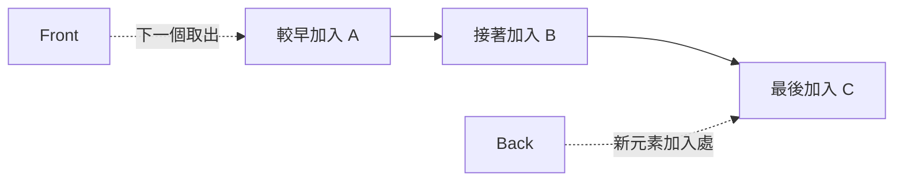

Queue 常保存「已經發現、等待依序處理」的狀態：

| 問題 | Queue Element 的語意 |
|---|---|
| BFS | 已發現但尚未展開鄰居的 Node |
| 工作排程 | 等待執行的工作 |
| 事件系統 | 依到達順序等待處理的事件 |
| Multi-source BFS | 從任一 Source 發現、等待擴張的 Node |

Stack 處理最近加入者，Queue 處理最早加入者。若問題的正確性依賴距離層級或到達順序，Queue 通常比 Stack 合適。

### 9.2 安全使用 Queue 介面

C++ `std::queue` 常用介面：

```cpp
q.empty();
q.size();
q.front();
q.back();
q.push(value);
q.pop();
```

`front()`、`back()` 與 `pop()` 的前置條件都是 Queue 非空：

```cpp
if (!q.empty())
{
    int value = q.front();
    q.pop();
}
```

`pop()` 不會回傳被移除元素，因此需要先讀取 `front()`。

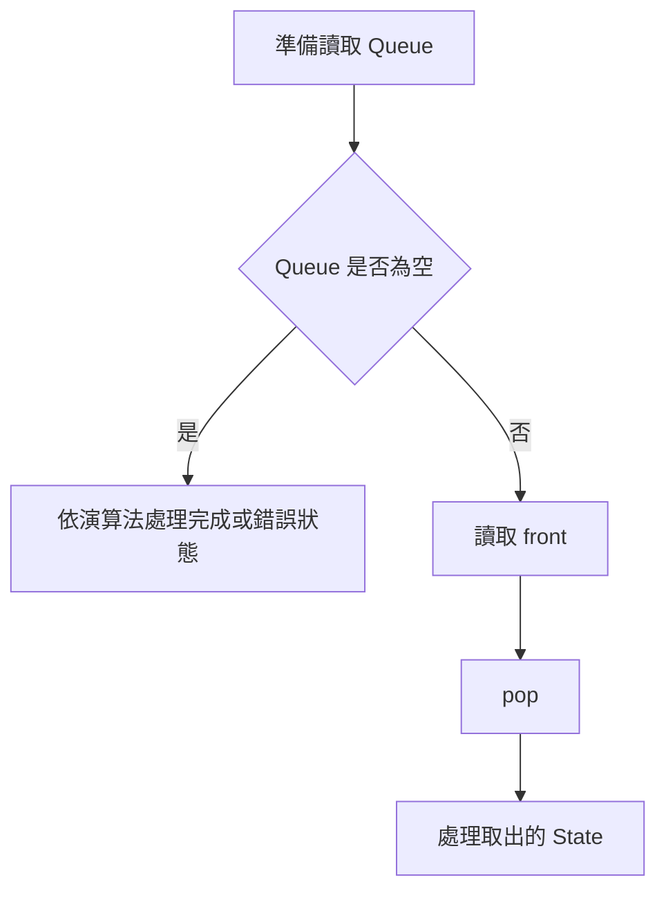

Queue Element 應保存完整處理所需資訊。BFS 若要記錄深度，可以把 Distance 放在外部 Array，也可以把 Node 與 Depth 一起加入 Queue。兩種方式都可，但 State 語意必須一致。

### 9.3 完整案例：BFS 最短距離

#### 問題規格

給定無權 Graph 與 Source，回傳 Source 到每個 Node 的最少 Edge 數。無法到達的 Node 回傳 `-1`。

#### Precondition

- `source` 是合法 Node Index。
- 每個 Adjacency List 中的 Node Index 都合法。
- 每條 Edge 的成本相同，可視為 1。

#### C++ 解法

```cpp
#include <queue>
#include <vector>

std::vector<int> bfsDistances(
    const std::vector<std::vector<int>>& graph,
    int source)
{
    std::vector<int> distance(graph.size(), -1);
    std::queue<int> pending;

    distance[source] = 0;
    pending.push(source);

    while (!pending.empty())
    {
        const int node = pending.front();
        pending.pop();

        for (int next : graph[node])
        {
            if (distance[next] != -1)
            {
                continue;
            }

            distance[next] = distance[node] + 1;
            pending.push(next);
        }
    }

    return distance;
}
```

#### State 語意

- `distance[node] == -1`：尚未發現。
- `distance[node] >= 0`：已發現，且已確定最少 Edge 數。
- Queue：已發現但鄰居尚未全部展開的 Node。

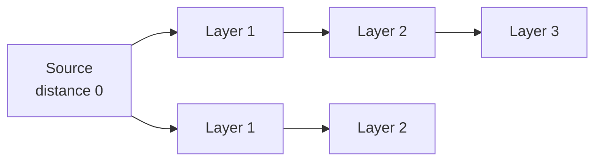

#### 為什麼在入列時標記

若等到出列才標記，同一 Node 可能被多個已處理 Node 重複加入。

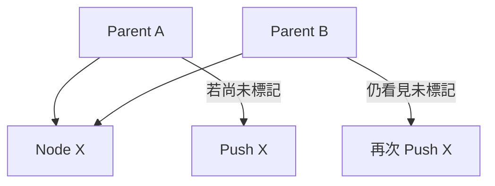

在第一次 Push 前設定 `distance[next]`，後續父節點便會略過同一 Node。這使每個 Node 最多入列一次。

#### Loop Invariant

每輪開始前：

1. Queue 中的 Node 都已發現，但尚未完整展開。
2. 所有已發現 Node 的 `distance` 都是 Source 到該 Node 的最少 Edge 數。
3. Queue 由前到後的 Distance 非遞減。
4. 尚未發現 Node 的 Distance 仍為 `-1`。

#### 複雜度

使用 Adjacency List 時，每個 Node 最多入列、出列一次，每條 Edge 被檢查固定次數：

- 時間複雜度：O(V + E)。
- 額外空間：O(V)。

### 9.4 BFS Layer 與最短路徑理由

BFS 的 FIFO 順序會先完整處理較小 Distance 的 Node，再處理較大 Distance 的 Node。

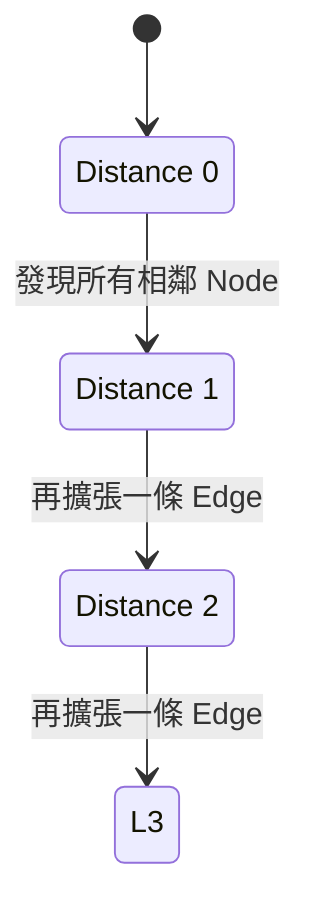

若 `node` 的最短 Distance 為 `d`，由它第一次發現的鄰居，其候選 Distance 為 `d + 1`。Queue 中不會有 Distance 大於 `d + 1` 的 Node 越過它先處理。

因此 Node 第一次被發現時，不可能存在更短但尚未處理的路徑。

這個理由依賴所有 Edge 成本相同。若 Edge Weight 不同，較少 Edge 不代表較小總成本，普通 BFS 通常不適用。

### 9.5 Multi-source BFS

若題目要求每個 Node 到最近 Source 的距離，可以把所有 Source 同時視為 Layer 0。

```cpp
std::queue<int> pending;
std::vector<int> distance(graph.size(), -1);

for (int source : sources)
{
    if (distance[source] == -1)
    {
        distance[source] = 0;
        pending.push(source);
    }
}
```

後續 BFS 和單一 Source 相同。

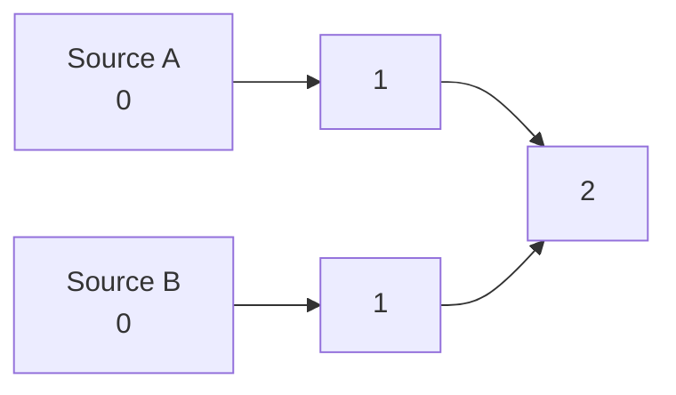

第一次發現某 Node 的 Source，即提供到所有 Source 集合的最短距離。若 Source 清單可能重複，初始化時也應避免重複入列。

常見應用包括：

- 每個格子到最近出口的距離。
- 多個感染起點同時擴散。
- 多個建築物同時向外計算層級。

### 9.6 Circular Queue

固定大小 Array 若每次 Pop Front 都搬移元素，成本會是 O(n)。Circular Queue 讓 Head 與 Tail 在 Array 中循環移動，不需要搬移既有元素。

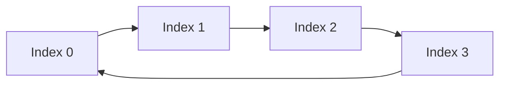

常見 State：

- `head`：下一個出列位置。
- `tail`：下一個入列位置。
- `size`：目前元素數量。
- `capacity`：Buffer 容量。

位置更新：

```text
next = (index + 1) % capacity
```

使用 `size` 可以清楚區分空 Queue 與滿 Queue：

```text
空：size == 0
滿：size == capacity
```

若只保存 Head 與 Tail，也能用保留一格或額外旗標區分空與滿，但介面語意要明確。

### 9.7 Deque 與兩端更新

Deque 是 Double-ended Queue，支援：

- Front Push。
- Front Pop。
- Back Push。
- Back Pop。

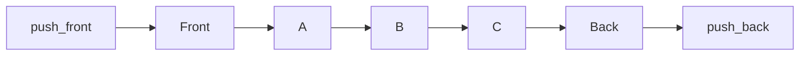

Deque 適合兩端各自具有不同移除規則的問題。Sliding Window Maximum 中：

- Front 移除已離開 Window 的 Index。
- Back 移除被新值支配的候選。

這兩種 Pop 的原因不同，不能合併成同一條模糊規則。

### 9.8 完整案例：Sliding Window Maximum

#### 問題規格

給定 `nums` 與窗口長度 `k`，回傳每個長度為 `k` 的連續窗口最大值。

```text
nums = [1, 3, -1, -3, 5, 3, 6, 7]
k = 3
答案 = [3, 3, 5, 5, 6, 7]
```

#### Precondition

- `1 <= k <= nums.size()`。

#### C++ 解法

```cpp
#include <deque>
#include <vector>

std::vector<int> maxSlidingWindow(
    const std::vector<int>& nums,
    int k)
{
    std::deque<int> candidates;
    std::vector<int> answer;

    for (int right = 0;
         right < static_cast<int>(nums.size());
         ++right)
    {
        while (!candidates.empty() &&
               candidates.front() <= right - k)
        {
            candidates.pop_front();
        }

        while (!candidates.empty() &&
               nums[candidates.back()] <= nums[right])
        {
            candidates.pop_back();
        }

        candidates.push_back(right);

        if (right + 1 >= k)
        {
            answer.push_back(nums[candidates.front()]);
        }
    }

    return answer;
}
```

#### Deque Element 語意

> Deque 保存目前 Window 內，仍可能成為現在或未來窗口最大值的 Index。

Index 由 Front 到 Back 遞增；對應 Value 由 Front 到 Back 嚴格遞減。

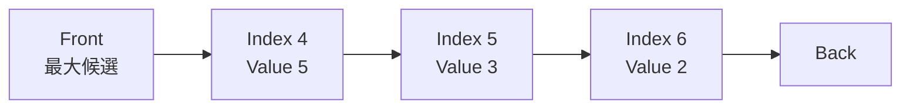

#### Front 移除過期 Index

目前窗口為：

```text
[right - k + 1, right]
```

所以：

```cpp
candidates.front() <= right - k
```

表示 Index 已在窗口左邊界之外。

#### Back 移除被支配候選

若新值大於或等於 Back 對應 Value：

- 新 Index 更靠右，能留在未來 Window 更久。
- 新 Value 不小於舊 Value。

所以舊候選不可能再成為最大值，可以從 Back 移除。

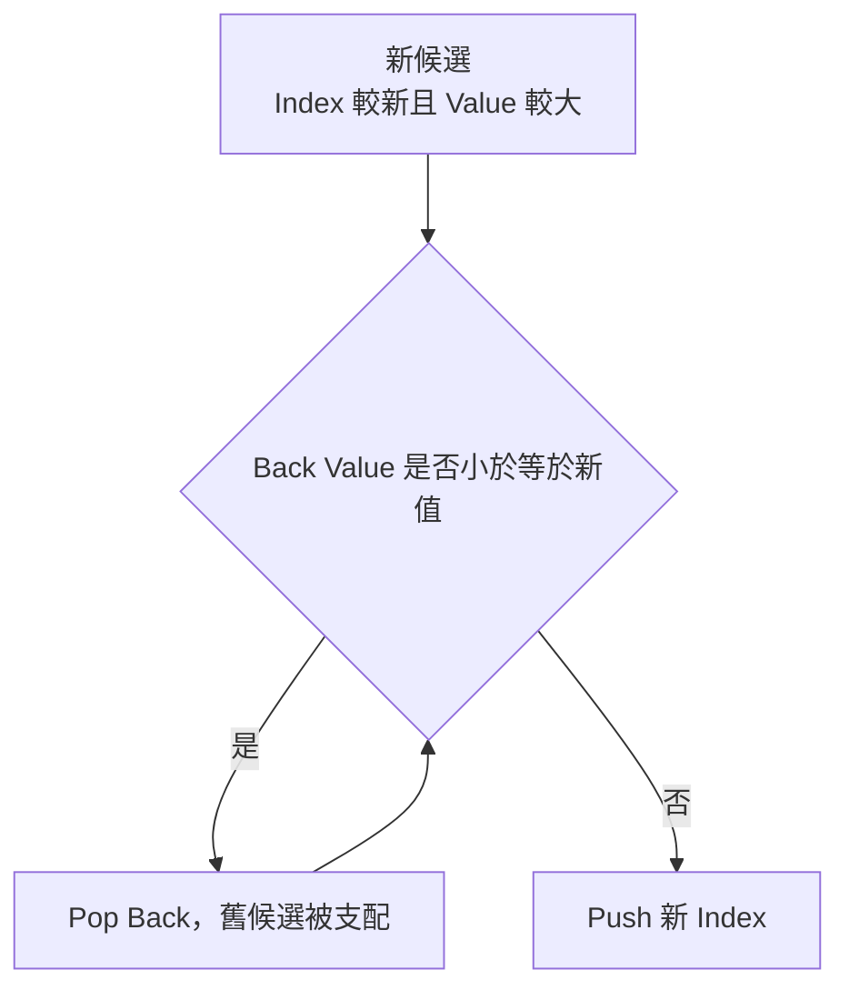

#### 為什麼 Front 是最大值

Deque 對應 Value 由 Front 到 Back 遞減，而且所有 Index 都在目前 Window 內，因此 Front 就是窗口最大值。

#### 複雜度

每個 Index：

- Push Back 一次。
- 最多因過期 Pop Front 一次。
- 或因被支配 Pop Back 一次。

每個 Index 離開 Deque 後不會再次加入，因此總時間為 O(n)，額外空間最差 O(k)。

### 9.9 Monotonic Queue 的正確性與複雜度

Monotonic Queue 和 Monotonic Stack 都會移除被支配候選，但 Deque 還必須處理窗口過期。

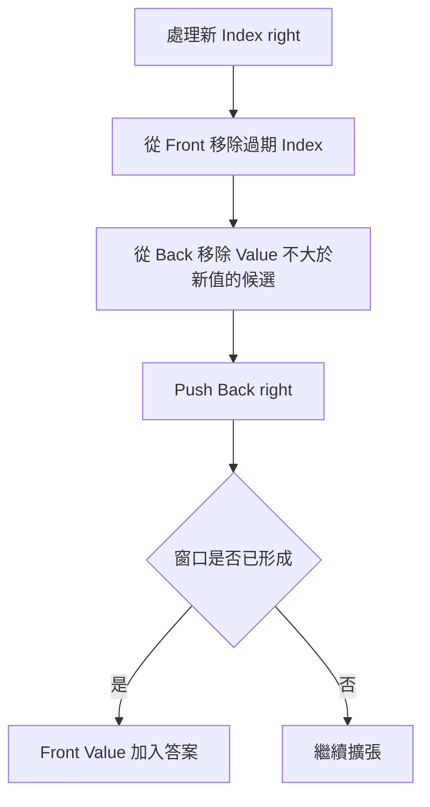

Invariant：

1. Deque 中所有 Index 都位於目前窗口。
2. Index 由 Front 到 Back 遞增。
3. 對應 Value 由 Front 到 Back嚴格遞減。
4. 被移除的候選不可能成為任何後續有效窗口的最大值。
5. 窗口形成後，Front 對應目前最大值。

`<` 或 `<=` 會影響相同值保留較舊還是較新 Index。使用 `<=` 會移除較舊相同值，保留能存活更久的新 Index。

### 9.10 Queue、Deque 與 Priority Queue 的選擇

| 需求 | 常見結構 | 取出規則 |
|---|---|---|
| 依到達順序處理 | Queue | 最早加入者 |
| 兩端都有更新 | Deque | Front 或 Back |
| 依最小或最大 Priority | Priority Queue | Priority 最佳者 |
| 最近加入者先處理 | Stack | 最晚加入者 |

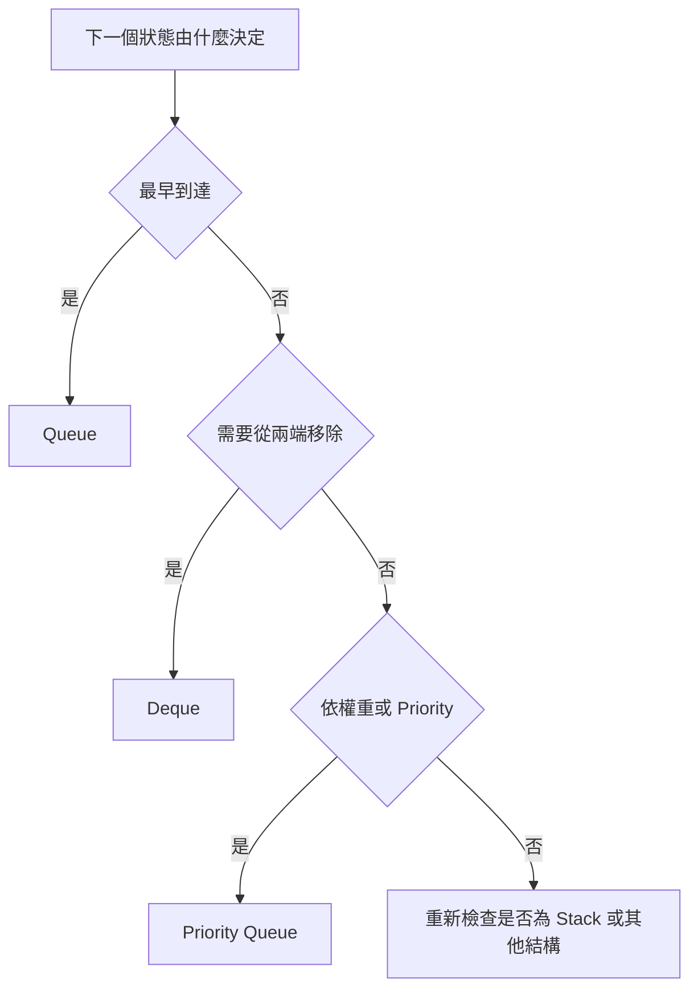

普通 BFS 適用於相同 Edge 成本。若 Graph 有不同非負權重，通常需要 Dijkstra 與 Priority Queue。若權重只有 0 與 1，可進一步考慮 0-1 BFS 與 Deque。

### 9.11 C 語言中的 Circular Queue

```c
#include <stdbool.h>
#include <stddef.h>

struct IntQueue
{
    int *data;
    size_t capacity;
    size_t head;
    size_t tail;
    size_t size;
};
```

#### Push

```c
bool queue_push(
    struct IntQueue *queue,
    int value)
{
    if (queue == NULL ||
        queue->data == NULL ||
        queue->capacity == 0 ||
        queue->size == queue->capacity)
    {
        return false;
    }

    queue->data[queue->tail] = value;
    queue->tail =
        (queue->tail + 1) % queue->capacity;
    ++queue->size;
    return true;
}
```

#### Pop

```c
bool queue_pop(
    struct IntQueue *queue,
    int *result)
{
    if (queue == NULL ||
        result == NULL ||
        queue->size == 0)
    {
        return false;
    }

    *result = queue->data[queue->head];
    queue->head =
        (queue->head + 1) % queue->capacity;
    --queue->size;
    return true;
}
```

Invariant：

- `0 <= size <= capacity`。
- `head` 是下一個 Pop 位置。
- `tail` 是下一個 Push 位置。
- 有效元素依 FIFO 順序分布於 Circular Buffer。

### 9.12 建立自己的 Queue 分析表

| 欄位 | 要回答的問題 |
|---|---|
| Element State | Queue 中每個元素代表什麼待處理狀態？ |
| 順序規則 | FIFO、兩端更新，還是 Priority？ |
| 發現時機 | Node 何時視為已發現？ |
| Visited | 入列時標記，還是其他明確時機？ |
| Distance | 保存於外部 Array，還是 Queue Element？ |
| Layer | Queue 順序是否和 Distance 非遞減一致？ |
| Source | 單一 Source 還是 Multi-source？ |
| Front 規則 | 哪些元素因過期或完成而移除？ |
| Back 規則 | 哪些候選因被支配而移除？ |
| Index | 是否需要位置、距離或窗口邊界？ |
| 複雜度 | 每個元素最多入列與離列幾次？ |
| 邊界 | 空輸入、無法到達、重複 Source、k=1 如何處理？ |

### 9.13 常見問題與判讀

| 現象 | 可能原因 | 第一輪檢查 |
|---|---|---|
| BFS 重複大量 Node | Visited 樱記太晚 | 是否在第一次入列時標記 |
| BFS 距離比預期長 | Queue 順序或 Distance 更新錯誤 | 是否由父節點加 1 |
| 有權 Graph 距離錯誤 | 使用普通 BFS | Edge 成本是否全部相同 |
| Multi-source 結果偏向單一起點 | Source 依序各跑一次 | 是否將全部 Source 同時放入 Layer 0 |
| Queue 空時失敗 | 直接呼叫 `front()` 或 `pop()` | 先檢查 `empty()` |
| Circular Queue 分不清空與滿 | 只看 Head 與 Tail | 使用 Size、保留一格或額外 Flag |
| Window 最大值已過期 | 未從 Front 移除 | Index 是否小於窗口左邊界 |
| 最大候選不正確 | Back 比較方向錯誤 | Value 單調性是否成立 |
| 重複值行為錯誤 | `<` 與 `<=` 語意不符 | 要保留舊 Index 還是新 Index |
| 複雜度誤判 O(n²) | 只看巢狀 `while` | 每個 Index 最多離開 Deque 一次 |

### 9.14 本章檢查表

- 我能說明 Queue Element 代表的待處理 State。
- 我知道 FIFO 和 LIFO 的使用情境不同。
- 我會在 `front()`、`back()` 與 `pop()` 前檢查 Queue 非空。
- 我知道 `pop()` 不回傳被移除元素。
- 我能說明 BFS Queue 由前到後的 Distance 非遞減。
- 我能解釋 Node 第一次被發現時為何得到最少 Edge 數。
- 我知道普通 BFS 依賴所有 Edge 成本相同。
- 我會在 Node 入列時標記已發現。
- 我能使用 Multi-source BFS 同時初始化所有 Source。
- 我能區分 Circular Queue 的 Head、Tail、Size 與 Capacity。
- 我知道 Deque Front 與 Back 可以有不同移除理由。
- 我能為 Sliding Window Maximum 定義 Deque Invariant。
- 我知道為何 Monotonic Queue 應保存 Index。
- 我能證明 Back 被移除的候選已被新值支配。
- 我能說明 Front 為何是目前窗口最大值。
- 我能用每個 Index 最多進出一次說明 O(n)。
- 我能依處理順序選擇 Queue、Deque 或 Priority Queue。

### 9.15 本章重點

- Queue 是 FIFO 結構，適合依發現或到達順序處理 State。
- BFS Queue 保存已發現但尚未展開的 Node。
- 在相同 Edge 成本下，BFS 依 Distance Layer 擴張，第一次發現即為最少 Edge 數。
- 入列時標記 Visited 可避免同一 Node 被重複加入。
- Multi-source BFS 將所有 Source 同時放入 Distance 0。
- Circular Queue 使用循環 Index 避免每次 Pop Front 搬移資料。
- Deque 支援兩端更新，適合同時處理過期與支配條件。
- Sliding Window Maximum 的 Front 移除過期 Index，Back 移除被新值支配的候選。
- Monotonic Queue 保存 Index，才能檢查窗口邊界並寫回位置或距離。
- 每個 Index 最多加入與移除固定次數，因此總時間可為 O(n)。
- Queue、Deque 與 Priority Queue 的差異在於下一個 State 的選擇規則。
