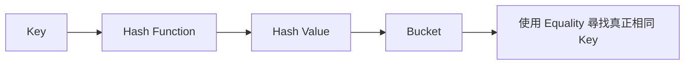
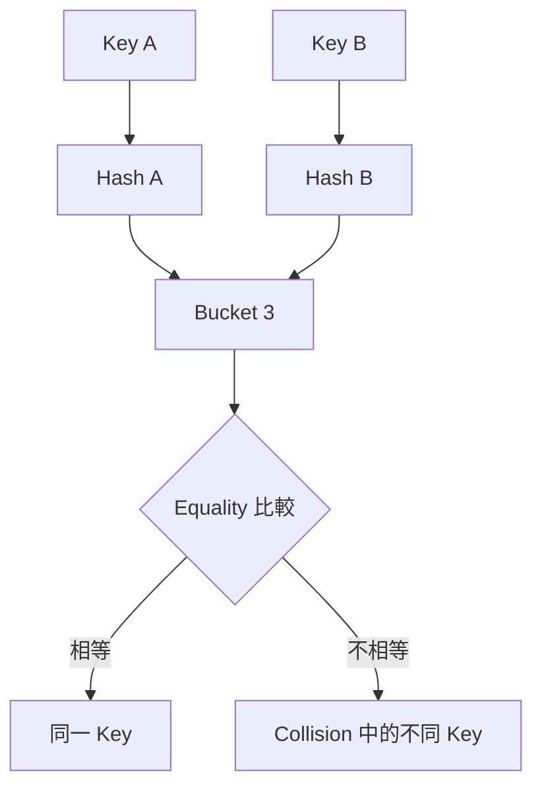
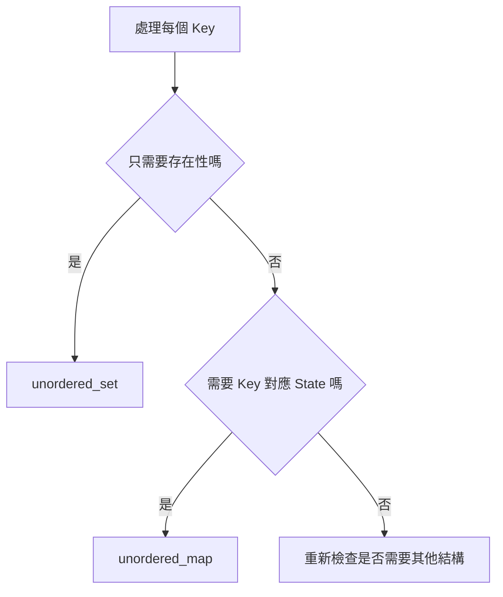
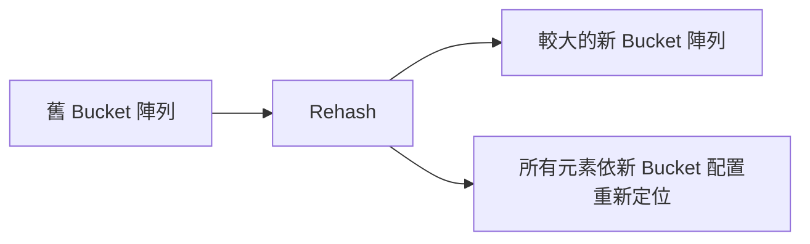
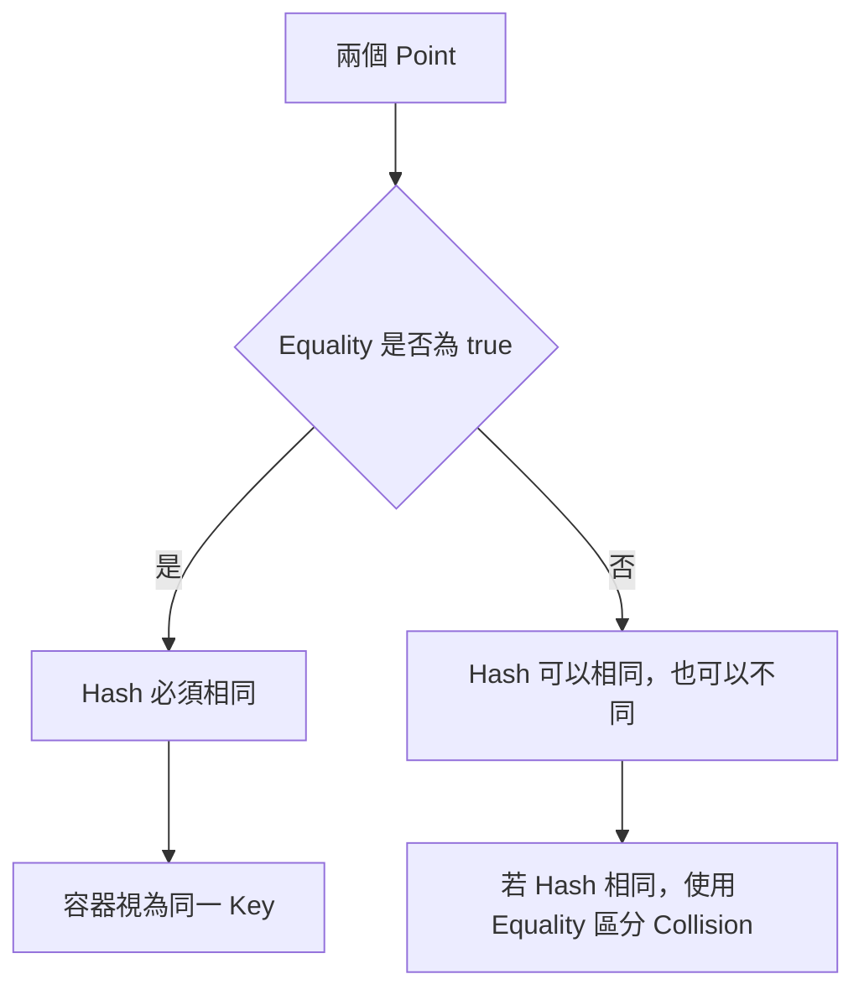
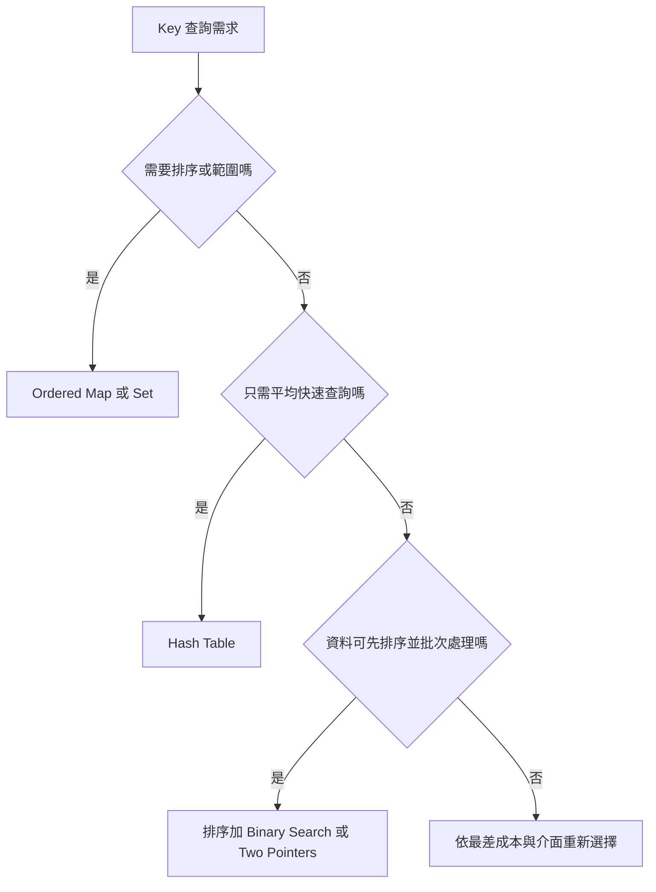
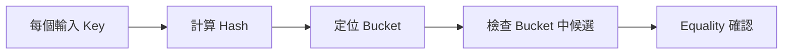
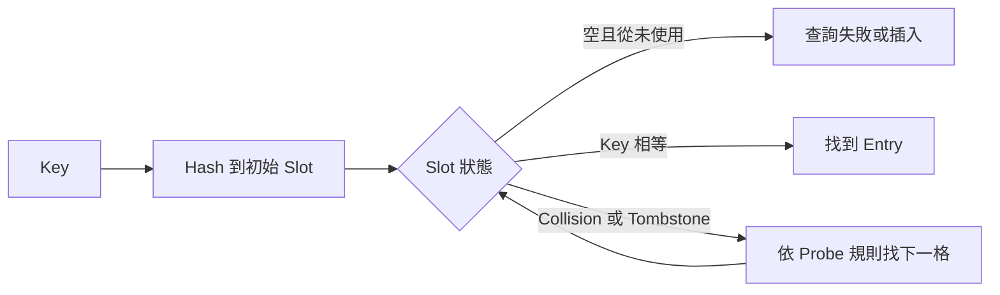

## 第 10 章　Hash Table、Set 與 Map

### 適用範圍

本章介紹 Hash Table 的資料模型，以及 Key、Value、Hash Function、Equality、Collision、Bucket、Load Factor 與 Rehash 如何共同影響正確性和效能。

Hash Table 常用於 Membership、Frequency 與 Value-to-State Mapping，但「使用 Hash Map」不是完整解法。真正需要先定義的是：

- Key 代表什麼等價類別。
- Value 保存哪一項問題 State。
- 查詢不存在 Key 時應發生什麼。
- 是否允許查詢動作改變容器。
- 是否需要排序、最小 Key、最大 Key 或範圍查詢。
- 平均 O(1) 是否符合題目對最差成本的要求。
- Rehash 是否會使目前持有的 Iterator 失效。
- 自訂 Key 的 Hash 與 Equality 是否一致。

本章會建立一套固定流程：

1. 先定義 Key 與 Value 的語意。
2. 判斷只需 Membership，還是需要 Key-to-State Mapping。
3. 選擇查詢介面，避免無意間插入預設值。
4. 使用直接案例確認重複 Key 的更新規則。
5. 區分平均複雜度與最差複雜度。
6. 在大量插入前評估 `reserve` 與 Rehash。
7. 自訂 Key 時同步設計 Equality 與 Hash。
8. 若需要排序或範圍語意，改用 Ordered Container 或排序。

### 適用讀者

- 需要處理 Membership、Frequency 與 Value-to-State Mapping 的讀者。
- 容易把 Set 與 Map 混在一起的讀者。
- 使用 `operator[]` 查詢後發現容器多出 Key 的讀者。
- 不清楚 Map Value 應保存 Frequency、Index 還是最佳 State 的讀者。
- 容易把平均 O(1) 當成最差保證的讀者。
- 在插入期間保存 Iterator，卻忽略 Rehash 的讀者。
- 需要建立自訂 Struct Key 的讀者。
- 需要在 Hash Table、Ordered Map 與排序之間選擇的讀者。

### 快速導覽

- [Hash Table 到底保存什麼](#101-hash-table-到底保存什麼)
- [Hash、Bucket、Collision 與 Equality](#102-hashbucketcollision-與-equality)
- [Set 與 Map 的選擇](#103-set-與-map-的選擇)
- [安全查詢與 operator[]](#104-安全查詢與-operator)
- [完整案例：Frequency](#105-完整案例frequency)
- [完整案例：Two Sum](#106-完整案例two-sum)
- [Load Factor、Reserve 與 Rehash](#107-load-factorreserve-與-rehash)
- [自訂 Key](#108-自訂-key)
- [Hash 與 Ordered Container 的選擇](#109-hash-與-ordered-container-的選擇)
- [正確性與複雜度](#1010-正確性與複雜度)
- [C 語言中的 Hash Table](#1011-c-語言中的-hash-table)
- [建立自己的 Hash Table 分析表](#1012-建立自己的-hash-table-分析表)
- [常見問題與判讀](#1013-常見問題與判讀)
- [本章檢查表](#1014-本章檢查表)
- [本章重點](#1015-本章重點)

### 10.1 Hash Table 到底保存什麼

Hash Table 將 Key 經過 Hash Function 轉成 Hash Value，再由容器定位 Bucket。



Hash Value 相同不代表 Key 相同。不同 Key 可能 Collision，因此仍需 Equality 判斷。

Hash Table 的核心優勢是能以 Key 快速定位候選 Bucket，而不是保證每個 Key 都取得唯一 Hash Value。

### 10.2 Hash、Bucket、Collision 與 Equality

假設 Bucket 數量為 8，容器可能使用 Hash Value 的某種轉換定位 Bucket。兩個不同 Key 可能進入同一 Bucket：



容器必須同時依賴：

- Hash：快速縮小搜尋範圍。
- Equality：確認是否為同一 Key。

若 `a == b`，必須保證：

```text
hash(a) == hash(b)
```

反方向不成立。Hash 相同的兩個 Key 可以不相等。

### 10.3 Set 與 Map 的選擇

#### Set

只需要判斷 Key 是否存在：

```cpp
std::unordered_set<int> seen;
```

常見 State：

- 已看過哪些值。
- 哪些 Node 已訪問。
- 哪些設定已出現。

#### Map

需要保存 Key 對應的額外 State：

```cpp
std::unordered_map<int, int> state;
```

Value 可能代表：

- Frequency。
- First Index。
- Last Index。
- 最佳結果。
- Parent。
- Distance。
- 狀態旗標。



「用了 Map」仍不夠。應能用一句話說明：

> `map[key]` 保存＿＿＿＿。

### 10.4 安全查詢與 operator[]

`unordered_map::operator[]` 在 Key 不存在時，會插入預設建構的 Value。

```cpp
std::unordered_map<int, int> count;
int value = count[7];
```

執行後，Key 7 會存在，Value 通常為 0。

這適合 Frequency：

```cpp
++count[key];
```

但若只想查詢，不應無意間改變容器。

```cpp
if (auto it = count.find(key); it != count.end())
{
    use(it->second);
}
```

C++20 Set 或 Map 也可使用：

```cpp
if (count.contains(key))
{
    // Key 存在
}
```

```mermaid
flowchart TD
    A[準備存取某 Key] --> B{不存在時是否應插入預設值}
    B -->|是| C[可使用 operator[]]
    B -->|否| D{只需存在性嗎}
    D -->|是| E[contains]
    D -->|否，需要 Value| F[find]
```

`at(key)` 不會插入，但 Key 不存在時會丟出 `std::out_of_range`。使用何種介面取決於錯誤處理規格。

### 10.5 完整案例：Frequency

#### 問題規格

計算整數 Array 中每個 Value 出現次數。

#### C++ 解法

```cpp
#include <unordered_map>
#include <vector>

std::unordered_map<int, int> countFrequency(
    const std::vector<int>& nums)
{
    std::unordered_map<int, int> frequency;

    for (int value : nums)
    {
        ++frequency[value];
    }

    return frequency;
}
```

#### Key 與 Value 語意

```text
Key   = 輸入中的整數 Value
Value = 該整數在已處理 Prefix 中出現的次數
```

#### Loop Invariant

每輪開始前，對所有已出現在 Prefix 中的 Key：

```text
frequency[key] 等於 key 在已處理 Prefix 的出現次數
```

本輪看到 `value` 時，只需將對應次數增加 1。

```mermaid
flowchart LR
    I[讀取 Value 4] --> Q{Key 4 已存在嗎}
    Q -->|否| Z[operator[] 插入 0]
    Q -->|是| V[取得目前次數]
    Z --> A[增加為 1]
    V --> B[增加 1]
```

#### 固定值域時不一定需要 Hash Table

若輸入保證只在 0 到 100，可使用固定 Array。資料結構選擇應考慮 Key 值域，而不是看到 Frequency 就固定使用 Hash Map。

### 10.6 完整案例：Two Sum

#### 問題規格

給定整數 Array 與 Target，找出兩個不同 Index，使對應 Value 總和等於 Target。若無答案，回傳空結果。

#### State 定義

```text
Key   = 已處理過的 Value
Value = 該 Value 的某個先前 Index
```

#### C++ 解法

```cpp
#include <optional>
#include <unordered_map>
#include <utility>
#include <vector>

std::optional<std::pair<int, int>> twoSum(
    const std::vector<int>& nums,
    int target)
{
    std::unordered_map<int, int> previousIndex;

    for (int i = 0;
         i < static_cast<int>(nums.size());
         ++i)
    {
        const int needed = target - nums[i];

        if (auto it = previousIndex.find(needed);
            it != previousIndex.end())
        {
            return std::pair{it->second, i};
        }

        previousIndex[nums[i]] = i;
    }

    return std::nullopt;
}
```

#### 為什麼先查再插

若先插入目前值，在 `target == 2 * nums[i]` 時，可能使用同一 Index 配對自己。

```mermaid
flowchart TD
    A[目前 Index i] --> B[計算 needed]
    B --> C{先前 Map 是否包含 needed}
    C -->|是| D[回傳先前 Index 與 i]
    C -->|否| E[插入 nums[i] 對應 i]
    E --> F[處理下一個 Index]
```

Map 只保存先前 Index，因此查到的 Index 一定和目前 `i` 不同。

#### Loop Invariant

每輪開始前：

1. Map 只包含 Index 小於 `i` 的元素。
2. 每個 Key 對應某個先前出現位置。
3. 若尚未回傳答案，已檢查的所有 Pair 都不符合 Target。

#### Overflow

`target - nums[i]` 可能發生整數 Overflow。若題目值域無法保證安全，可先轉成較寬型別，並讓 Hash Map Key 使用相同型別。

### 10.7 Load Factor、Reserve 與 Rehash

Load Factor 大致表示：

```text
元素數量 / Bucket 數量
```

當 Load Factor 過高時，容器可能增加 Bucket 並重新配置元素，這稱為 Rehash。



Rehash 可能使 Iterator 失效。若插入期間保存 Iterator，後續插入可能讓它不能再使用。

已知大約元素數量時，可先：

```cpp
map.reserve(expectedCount);
```

這可以降低成長過程中的 Rehash 次數，但不是邏輯正確性的必要條件，也不保證永遠不再 Rehash。插入數量超過預估時仍可能重新配置。

#### Reference 與 Pointer

標準容器對不同操作的失效保證有細節差異。撰寫一般演算法時，較安全的做法是：

- 不在可能 Rehash 的插入流程中長期保存 Iterator。
- 插入後重新使用 `find` 取得位置。
- 若要降低 Rehash，事先 `reserve`。

### 10.8 自訂 Key

假設要以座標作為 Key：

```cpp
struct Point
{
    int row;
    int column;

    bool operator==(const Point&) const = default;
};
```

Hash Function 必須讓相等 Point 產生相同 Hash：

```cpp
struct PointHash
{
    std::size_t operator()(const Point& point) const
    {
        const std::size_t first =
            std::hash<int>{}(point.row);
        const std::size_t second =
            std::hash<int>{}(point.column);

        return first ^ (second << 1);
    }
};
```

使用方式：

```cpp
std::unordered_set<Point, PointHash> visited;
```



#### 不一致的危險

若 Equality 忽略某欄位，但 Hash 包含該欄位，兩個被視為相等的 Key 可能進入不同 Bucket，破壞容器查詢假設。

#### Key 不應任意修改

Key 放入 Hash Table 後，其影響 Hash 或 Equality 的欄位不應被修改。否則元素可能仍位於舊 Bucket，但新的 Hash 已指向其他位置，造成無法正常找到。

### 10.9 Hash 與 Ordered Container 的選擇

| 需求 | 常見選擇 |
|---|---|
| 快速 Membership 或 Frequency | `unordered_set` / `unordered_map` |
| 依 Key 排序走訪 | `set` / `map` |
| 找最小或最大 Key | Ordered Container |
| 範圍查詢、Lower Bound | Ordered Container |
| 批次處理後才需排序輸出 | Hash 後另外排序，或直接排序輸入 |
| 需要較穩定最差界線 | Tree-based Container 或排序方法 |



Hash Table 不提供固定迭代順序。若輸出需排序，不應依賴觀察到的 Bucket 順序。

### 10.10 正確性與複雜度

`unordered_map` 與 `unordered_set` 的查找、插入及刪除通常描述為平均 O(1)，但最差情況可能退化。

複雜度說明應寫清楚：

- 平均或攤銷條件。
- 最差可能受 Collision、Rehash 與實作影響。
- 是否另有排序輸出成本。
- 自訂 Hash 的計算成本。



若所有 Key 大量 Collision，Bucket 內候選增加，查詢不再接近常數時間。

正確性方面，應確認：

1. Key 完整表達問題中的等價條件。
2. Value 保存足以完成答案的 State。
3. 查詢與插入順序符合 Index、時間或資料依賴。
4. 重複 Key 的覆寫、累加或保留規則明確。

### 10.11 C 語言中的 Hash Table

C 標準函式庫沒有通用 Hash Table。專案可使用既有 Library，或依需求自行建立。

一個簡化 Entry 可能包含：

```c
struct Entry
{
    int key;
    int value;
    bool occupied;
};
```

Open Addressing 還需要區分：

- 從未使用的 Slot。
- 目前有元素的 Slot。
- 曾使用但已刪除的 Tombstone。



自行撰寫時必須定義：

- Hash Function。
- Equality。
- Collision Resolution。
- Capacity 與 Load Factor。
- Resize 失敗處理。
- 刪除語意。
- Ownership 與最終釋放。

除非題目要求，正式專案通常應優先使用成熟 Library，而不是臨時建立缺少完整測試的 Hash Table。

### 10.12 建立自己的 Hash Table 分析表

| 欄位 | 要回答的問題 |
|---|---|
| Key | 哪些輸入應被視為同一 Key？ |
| Value | 每個 Key 對應 Frequency、Index 還是其他 State？ |
| 容器 | 只需 Set，還是需要 Map？ |
| 查詢 | 不存在時應插入、回傳空，還是回報錯誤？ |
| 重複 Key | 累加、覆寫、保留第一個，還是保留最佳結果？ |
| 順序 | 是否需要排序、最小 Key 或範圍查詢？ |
| 複雜度 | 平均 O(1) 是否足夠？ |
| 規模 | 是否可先 `reserve`？ |
| Iterator | 插入是否可能 Rehash？ |
| 自訂 Key | Equality 與 Hash 是否一致？ |
| 可變性 | Key 欄位在插入後是否保持不變？ |
| 邊界 | 空輸入、重複值、極端 Key 與 Collision 如何測試？ |

### 10.13 常見問題與判讀

| 現象 | 可能原因 | 第一輪檢查 |
|---|---|---|
| 查詢後容器多出 Key | 使用 `operator[]` | 改用 `find` 或 `contains` |
| Frequency 少算或多算 | Key 或更新規則錯誤 | Value 是否代表已處理 Prefix 次數 |
| Two Sum 使用同一 Index | 先插入再查詢 | 改成先查再插 |
| 重複 Key 保留錯誤 Index | 覆寫規則未定義 | 要保留第一個、最後一個或任意位置 |
| Iterator 突然失效 | 插入造成 Rehash | 插入後重新 `find`，或預先 `reserve` |
| 輸出順序不固定 | Hash Table 不排序 | 改用 Ordered Container 或另外排序 |
| 自訂 Key 找不到 | Hash 與 Equality 不一致 | 相等 Key 是否必定有相同 Hash |
| 修改 Key 後無法查詢 | 影響 Hash 的欄位被改變 | Key 插入後保持不變 |
| 複雜度描述錯誤 | 混淆平均與最差 | 明確寫出容器保證與 Collision 風險 |
| 記憶體使用超出預期 | Bucket、Load Factor 與 Node 開銷 | 評估值域、元素數與替代結構 |

### 10.14 本章檢查表

- 我能說明 Hash、Bucket、Collision 與 Equality 的關係。
- 我知道 Hash 相同不代表 Key 相等。
- 我知道相等 Key 必須產生相同 Hash。
- 我能區分 Set 的 Membership 與 Map 的 Key-to-State Mapping。
- 我能明確說出 Map Key 與 Value 的語意。
- 我知道 `operator[]` 在 Key 不存在時可能插入預設值。
- 我會依查詢需求選擇 `contains`、`find`、`at` 或 `operator[]`。
- 我能為 Frequency 寫出 Prefix Invariant。
- 我知道 Two Sum 為何要先查再插。
- 我會確認算術補數是否可能 Overflow。
- 我知道 Load Factor 和 Bucket 數量有關。
- 我知道 Rehash 可能使 Iterator 失效。
- 我能使用 `reserve` 降低已知規模下的 Rehash 次數。
- 我不會依賴 Hash Table 的迭代順序。
- 我能依排序與範圍需求選擇 Ordered Container。
- 我能區分平均 O(1) 與最差情況。
- 我知道自訂 Key 插入後不應修改影響 Hash 的欄位。
- 我能為自訂 Key 同步設計 Equality 與 Hash。

### 10.15 本章重點

- Hash Table 使用 Hash 縮小候選 Bucket，再用 Equality 確認真正相同的 Key。
- Collision 是正常情況，不同 Key 可以擁有相同 Hash。
- Set 保存 Membership；Map 保存 Key 對應的 State。
- Map Value 應由問題需求定義，例如 Frequency、Index、Distance 或最佳結果。
- `operator[]` 適合需要插入預設值的流程，只查詢時應考慮 `find` 或 `contains`。
- Frequency 的核心 Invariant 是 Map 保存已處理 Prefix 的正確次數。
- Two Sum 的 Map 保存先前 Value 到 Index，先查再插可避免同一 Index 配對自己。
- Load Factor 過高可能觸發 Rehash，影響實際成本與 Iterator 有效性。
- `reserve` 可以降低 Rehash 次數，但不會改變 Key、Value 的邏輯語意。
- 自訂 Key 必須滿足相等 Key 具有相同 Hash，且插入後不得改變影響 Hash 的欄位。
- Hash Table 不提供排序語意；需要排序、最小 Key 或範圍查詢時應考慮 Ordered Container。
- Hash 查找通常為平均 O(1)，最差成本仍受 Collision 與實作影響。
