## 第 11 章　Enumeration 與 Brute Force

### 適用範圍

本章介紹 Enumeration 與 Brute Force 的核心模型，說明如何完整列出元素、Pair、連續區間、Subset、Combination 與 Permutation，並進一步建立搜尋樹、剪枝、去重及測試 Oracle。

Brute Force 常被翻譯為暴力解法或窮舉法。它不代表缺乏思考，而是先直接依照問題定義列出所有候選，再逐一驗證。這種方法具有幾個重要用途：

- 確認自己是否正確理解候選答案。
- 建立第一個容易驗證的解法。
- 計算搜尋空間，判斷直接解法是否可行。
- 找出不同候選之間的重複工作。
- 作為最佳化解法的測試 Oracle。
- 為 Backtracking、Dynamic Programming 與其他搜尋方法建立基礎。

本章會建立一套固定流程：

1. 先定義一個完整候選由哪些決策構成。
2. 判斷候選是元素、Pair、區間、Subset、Combination 或 Permutation。
3. 定義每一層搜尋樹正在做的選擇。
4. 確認是否完整涵蓋所有候選，而且沒有不必要的重複。
5. 計算候選數量與每個候選的檢查成本。
6. 分開處理 Index Identity 與 Value 去重。
7. 只有在能排除整個 Subtree 時才進行剪枝。
8. 保留小型直接解法，作為對拍與 Regression Test 的基準。

### 適用讀者

- 不知道如何建立第一個正確解法的讀者。
- 看到題目後直接嘗試最佳化，但無法說明漏掉哪些候選的讀者。
- 需要理解 Backtracking 前置概念的讀者。
- 容易混淆 Subset、Combination 與 Permutation 的讀者。
- 枚舉 Pair 時重複處理 `(i, j)` 與 `(j, i)` 的讀者。
- 使用 Bitmask 枚舉時容易遇到位移或型別範圍問題的讀者。
- 加入剪枝後產生漏解，但不清楚剪枝成立條件的讀者。
- 需要建立可靠測試 Oracle 的讀者。

### 快速導覽

- [Enumeration 到底在列出什麼](#111-enumeration-到底在列出什麼)
- [第一步：定義候選空間](#112-第一步定義候選空間)
- [枚舉單一元素與 Pair](#113-枚舉單一元素與-pair)
- [完整案例：Pair 與 Two Sum](#114-完整案例pair-與-two-sum)
- [枚舉連續區間](#115-枚舉連續區間)
- [Subset 與 Bitmask](#116-subset-與-bitmask)
- [使用搜尋樹理解 Subset](#117-使用搜尋樹理解-subset)
- [Combination 與 Permutation](#118-combination-與-permutation)
- [完整案例：產生固定長度 Combination](#119-完整案例產生固定長度-combination)
- [重複值與去重層級](#1110-重複值與去重層級)
- [剪枝的正確性](#1111-剪枝的正確性)
- [複雜度與輸出大小](#1112-複雜度與輸出大小)
- [直接解法作為測試 Oracle](#1113-直接解法作為測試-oracle)
- [C 語言中的枚舉](#1114-c-語言中的枚舉)
- [建立自己的 Enumeration 分析表](#1115-建立自己的-enumeration-分析表)
- [常見問題與判讀](#1116-常見問題與判讀)
- [本章檢查表](#1117-本章檢查表)
- [本章重點](#1118-本章重點)

### 11.1 Enumeration 到底在列出什麼

Enumeration 的核心問題不是「要寫幾層迴圈」，而是：

> 所有可能答案由哪些決策組成？

例如給定 `n` 個元素：

| 問題 | 一個候選的定義 |
|---|---|
| 找最大值 | 選一個元素 |
| Two Sum | 選兩個不同 Index |
| 最大連續區間和 | 選一組連續邊界 |
| Subset Sum | 每個元素選或不選 |
| 選出 k 個元素 | 選 k 個不同 Index，通常不考慮順序 |
| 排列所有元素 | 決定每一個位置放哪個尚未使用元素 |

候選定義不同，搜尋空間也不同。

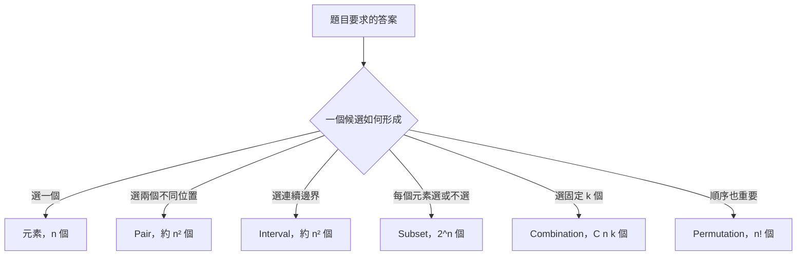

在寫程式前先說清楚候選空間，可以直接檢查：

- 是否漏掉合法候選。
- 是否重複列出同一候選。
- 哪些輸入限制會讓直接解法不可行。

### 11.2 第一步：定義候選空間

可以使用以下問題整理候選：

1. 一個候選需要選多少個元素？
2. 選取後是否必須連續？
3. 是否必須保留原始順序？
4. 相同元素的不同排列是否算不同答案？
5. 相同 Value 但不同 Index 是否視為不同候選？
6. 空集合是否為合法候選？
7. 候選產生後，還需要花多少時間驗證？

#### 候選數量和總成本不同

假設共有 O(n²) 個連續區間：

- 若每個區間可在 O(1) 取得總和，總時間是 O(n²)。
- 若每個區間重新走訪元素求和，單一檢查最差 O(n)，總時間可能是 O(n³)。

因此整體複雜度通常要拆成：

```text
候選數量 × 每個候選的處理成本
```

#### 空候選

Subset 通常包含空集合，因此 n 個元素有 `2^n` 個 Subset。若題目要求非空 Subset，需要在產生階段跳過空集合，或在驗證階段排除。

連續區間題則要確認是否允許空區間。最大 Subarray 題若允許空區間，全部負數時答案語意會和只允許非空區間不同。

### 11.3 枚舉單一元素與 Pair

#### 單一元素

```cpp
for (int i = 0; i < n; ++i)
{
    check(i);
}
```

共有 n 個候選，若 `check` 是 O(1)，總時間為 O(n)。

#### 無順序 Pair

若需要選兩個不同 Index，而且 `(i, j)` 與 `(j, i)` 代表同一組：

```cpp
for (int i = 0; i < n; ++i)
{
    for (int j = i + 1; j < n; ++j)
    {
        check(i, j);
    }
}
```

每組 Pair 滿足：

```text
0 <= i < j < n
```

因此：

- 不會選到相同 Index。
- 不會同時列出 `(i, j)` 與 `(j, i)`。
- 每組不同 Index Pair 恰好出現一次。

Pair 數量為：

```text
n(n - 1) / 2
```

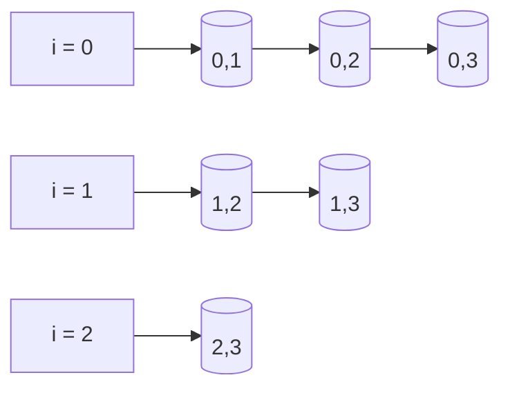

#### 有順序 Pair

若 `(i, j)` 與 `(j, i)` 的語意不同，例如從 Node `i` 指向 Node `j`，則需要枚舉有序 Pair：

```cpp
for (int i = 0; i < n; ++i)
{
    for (int j = 0; j < n; ++j)
    {
        if (i != j)
        {
            check(i, j);
        }
    }
}
```

候選定義決定迴圈範圍，不能固定使用 `j = i + 1`。

### 11.4 完整案例：Pair 與 Two Sum

#### 問題規格

給定整數 Array 與 Target，找出任意兩個不同 Index，使其 Value 總和等於 Target。

#### C++ 直接解法

```cpp
#include <optional>
#include <utility>
#include <vector>

std::optional<std::pair<int, int>> twoSumBruteForce(
    const std::vector<int>& nums,
    int target)
{
    for (int i = 0;
         i < static_cast<int>(nums.size());
         ++i)
    {
        for (int j = i + 1;
             j < static_cast<int>(nums.size());
             ++j)
        {
            const long long sum =
                static_cast<long long>(nums[i]) + nums[j];

            if (sum == target)
            {
                return std::pair{i, j};
            }
        }
    }

    return std::nullopt;
}
```

#### Loop Invariant

外層每輪開始前：

> 所有第一個 Index 小於 `i` 的合法 Pair 都已檢查，而且沒有符合 Target 的 Pair。

內層每輪開始前：

> 對目前 `i`，所有第二個 Index 位於 `[i + 1, j)` 的 Pair 都已檢查。

#### 完整性

任意兩個不同 Index 都可以唯一寫成 `i < j`。兩層迴圈完整列出所有這類 Pair，因此若沒有回傳答案，就能推出不存在合法 Pair。

#### 複雜度

- Pair 數量為 O(n²)。
- 每組 Pair 檢查為 O(1)。
- 總時間為 O(n²)。
- 額外空間為 O(1)。

這個版本很適合在小型隨機資料上作為 Hash Map 版本的 Oracle。

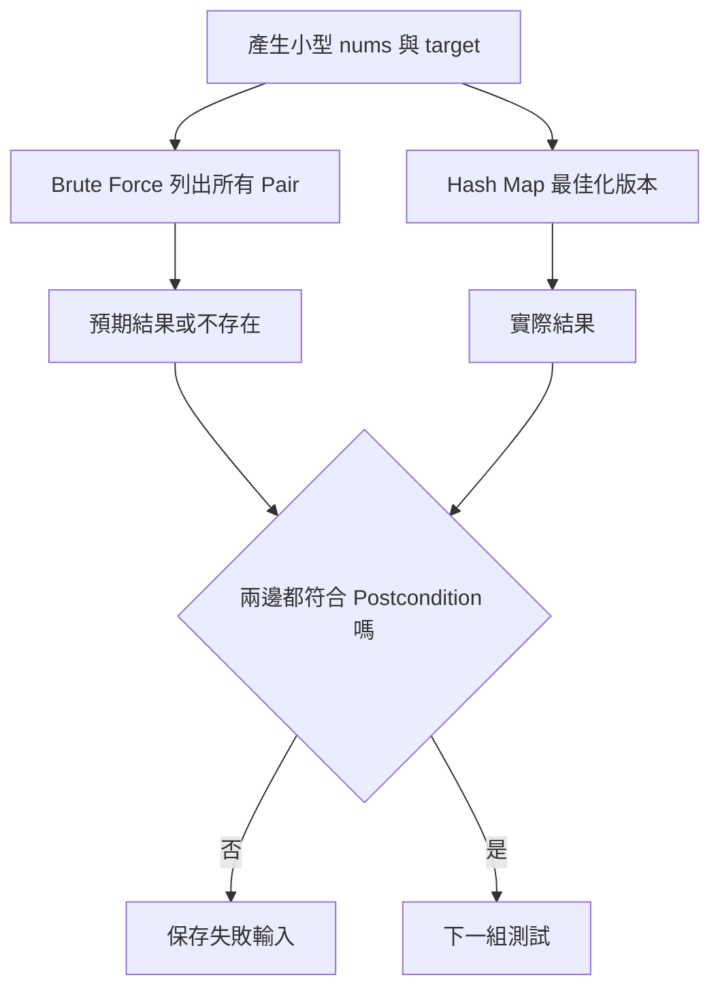

多答案情況不一定要求兩個版本回傳完全相同 Pair，而應檢查 Index 合法、彼此不同且總和等於 Target。

### 11.5 枚舉連續區間

對長度 n 的 Array，非空 Half-open Interval 可表示為：

```text
[left, right)
0 <= left < right <= n
```

枚舉方式：

```cpp
for (int left = 0; left < n; ++left)
{
    for (int right = left + 1; right <= n; ++right)
    {
        check(left, right);
    }
}
```

非空連續區間數為：

```text
n(n + 1) / 2
```

```mermaid
flowchart LR
    L0[left 0] --> A01[[0,1)] --> A02[[0,2)] --> A03[[0,3)]
    L1[left 1] --> A12[[1,2)] --> A13[[1,3)]
    L2[left 2] --> A23[[2,3)]
```

#### 每次重新求和

```cpp
for (int left = 0; left < n; ++left)
{
    for (int right = left + 1; right <= n; ++right)
    {
        long long sum = 0;
        for (int i = left; i < right; ++i)
        {
            sum += nums[i];
        }
    }
}
```

候選有 O(n²) 個，每個候選最多再走訪 O(n)，所以總時間 O(n³)。

#### 固定 Left 累積

```cpp
for (int left = 0; left < n; ++left)
{
    long long sum = 0;

    for (int right = left; right < n; ++right)
    {
        sum += nums[right];
        check(left, right + 1, sum);
    }
}
```

相鄰區間共用前一個 Sum，將總時間降為 O(n²)。這個改善直接來自辨識重複工作。

### 11.6 Subset 與 Bitmask

n 個元素的每個位置都有兩種決策：

- 不選。
- 選。

因此共有：

```text
2 × 2 × ... × 2 = 2^n
```

個 Subset。

#### Bitmask 表示

以第 `i` 個 Bit 表示是否選取 Index `i`：

```cpp
for (std::uint64_t mask = 0;
     mask < (std::uint64_t{1} << n);
     ++mask)
{
    for (int i = 0; i < n; ++i)
    {
        if ((mask & (std::uint64_t{1} << i)) != 0)
        {
            select(i);
        }
    }
}
```

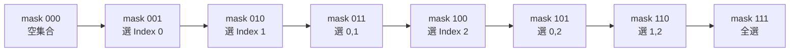

#### 位移前置條件

`std::uint64_t{1} << n` 要求 `n` 小於型別 Bit 數。若 `n >= 64`，位移不合法，而且 `2^n` 的候選數本身通常也已不可行。

不能只把 `1` 改成 `1LL` 就忽略 n 的範圍。型別寬度與演算法可行性都需要確認。

#### 複雜度

若每個 Mask 都掃描 n 個位置：

```text
O(n × 2^n)
```

若只計算 Subset 數量是 `2^n`，不代表輸出每個 Subset 的成本也是 O(1)。

### 11.7 使用搜尋樹理解 Subset

Subset 也可以用遞迴搜尋樹表示。第 `index` 層決定是否選取目前元素。

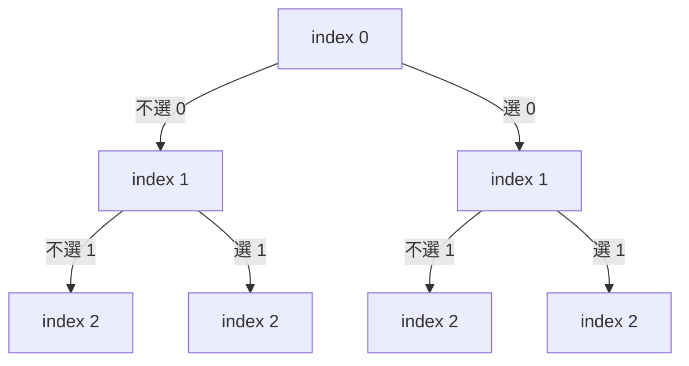

#### C++ 版本

```cpp
void enumerateSubsets(
    const std::vector<int>& nums,
    int index,
    std::vector<int>& current,
    std::vector<std::vector<int>>& result)
{
    if (index == static_cast<int>(nums.size()))
    {
        result.push_back(current);
        return;
    }

    enumerateSubsets(nums, index + 1, current, result);

    current.push_back(nums[index]);
    enumerateSubsets(nums, index + 1, current, result);
    current.pop_back();
}
```

#### State 語意

- `index`：下一個尚未決定的輸入位置。
- `current`：對 `[0, index)` 已完成選或不選後形成的 Subset。
- `result`：已完整產生的 Subset。

#### 為什麼需要回復 State

選取分支結束後：

```cpp
current.pop_back();
```

將 `current` 回復到進入本層前的狀態，讓其他分支不受影響。這是 Backtracking 的基本結構。

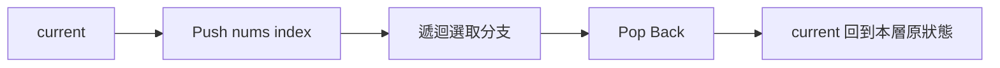

### 11.8 Combination 與 Permutation

#### Combination

從 n 個不同位置中選 k 個，通常不關心選取順序。

```text
{A, B} 和 {B, A} 是同一個 Combination
```

數量為：

```text
C(n, k)
```

#### Permutation

排列關心位置順序：

```text
[A, B] 和 [B, A] 是不同 Permutation
```

將 n 個不同元素全部排列共有：

```text
n!
```

#### 搜尋樹決策不同

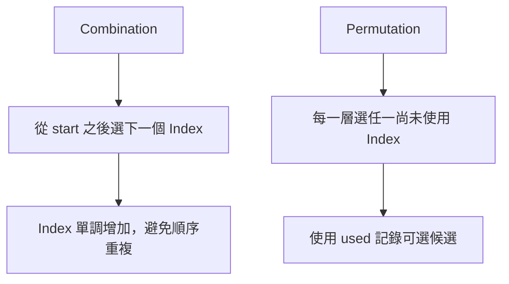

Combination 透過 `start` 限制後續只能向右選。Permutation 每層則可選任一未使用元素。

### 11.9 完整案例：產生固定長度 Combination

#### 問題規格

從 `[1, n]` 中選出 k 個不同整數，列出所有 Combination。

#### C++ 解法

```cpp
#include <vector>

void generateCombinations(
    int n,
    int k,
    int start,
    std::vector<int>& current,
    std::vector<std::vector<int>>& result)
{
    if (static_cast<int>(current.size()) == k)
    {
        result.push_back(current);
        return;
    }

    for (int value = start; value <= n; ++value)
    {
        current.push_back(value);
        generateCombinations(
            n, k, value + 1, current, result);
        current.pop_back();
    }
}
```

#### State 語意

- `current`：目前已選取且嚴格遞增的值。
- `start`：下一個值的最小候選。
- `current.size()`：已完成的選擇數量。

#### Invariant

每次函式開始時：

1. `current` 中所有值來自 `[1, n]`。
2. `current` 嚴格遞增，因此沒有重複值。
3. 所有小於 `start` 且未在 `current` 中的值，不再屬於本 Subtree 的候選。
4. 每個完成 Combination 會以唯一遞增順序產生。

#### 剩餘數量剪枝

若還需要：

```text
needed = k - current.size()
```

個元素，而從 `value` 到 n 的候選數不足 `needed`，就不必繼續。

可將迴圈上界改成：

```cpp
const int needed = k - static_cast<int>(current.size());

for (int value = start;
     value <= n - needed + 1;
     ++value)
{
    // 選取 value
}
```

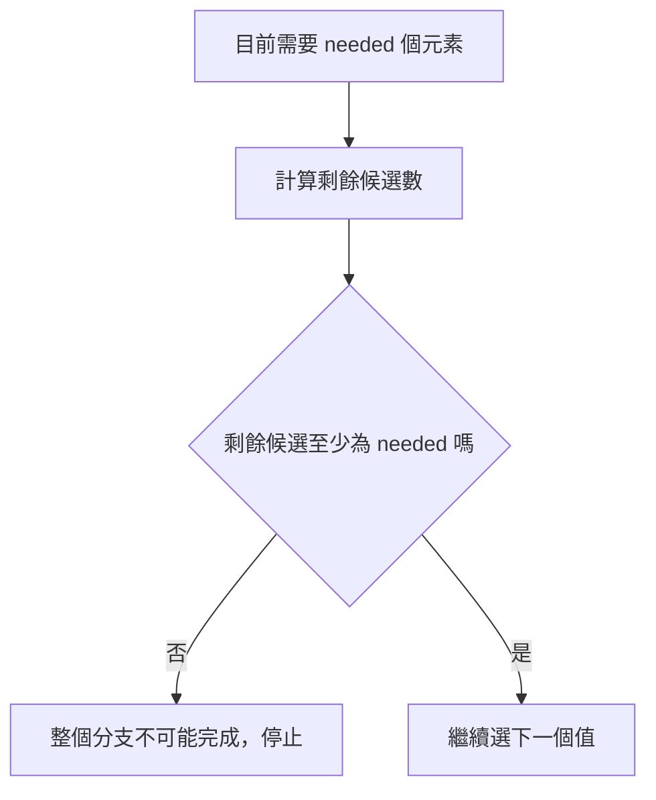

這項剪枝只排除無法湊滿 k 個元素的分支，不會排除任何合法 Combination。

### 11.10 重複值與去重層級

若輸入有重複 Value，需要先決定答案按 Index 還是按 Value 區分。

輸入：

```text
[2A, 2B, 3]
```

其中 `2A` 與 `2B` Value 相同，但 Index 不同。

#### 按 Index 區分

選 `2A` 和選 `2B` 是不同候選。此時不應依 Value 去重。

#### 按 Value 去重

若輸出只關心 Value，`[2A, 3]` 與 `[2B, 3]` 應只保留一份 `[2, 3]`。

常見方式是先排序，再在同一搜尋層略過重複 Value：

```cpp
for (int i = start; i < n; ++i)
{
    if (i > start && nums[i] == nums[i - 1])
    {
        continue;
    }

    // 選擇 nums[i]
}
```

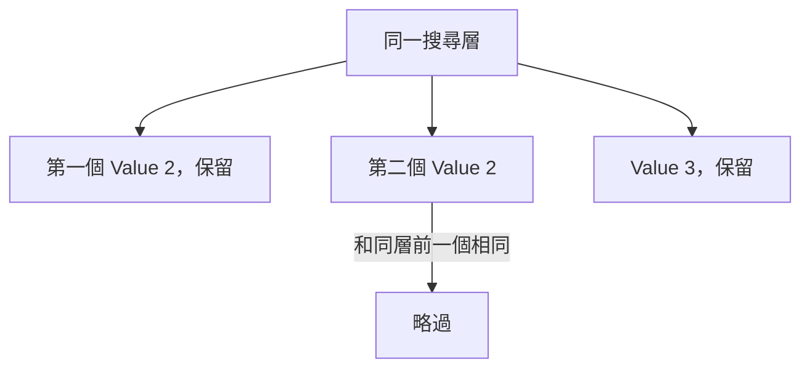

#### 同層與跨層不同

同層去重避免在同一決策位置選相同 Value 起始的重複分支。但在不同層，重複 Value 可能仍是合法答案的一部分，例如輸入有兩個 2，答案允許 `[2, 2]`。

因此去重條件通常是：

```cpp
i > start && nums[i] == nums[i - 1]
```

而不是只要相鄰相同就全部略過。

### 11.11 剪枝的正確性

剪枝表示：

> 根據目前部分 State，可以證明此節點下的整個 Subtree 都不會產生需要的答案。

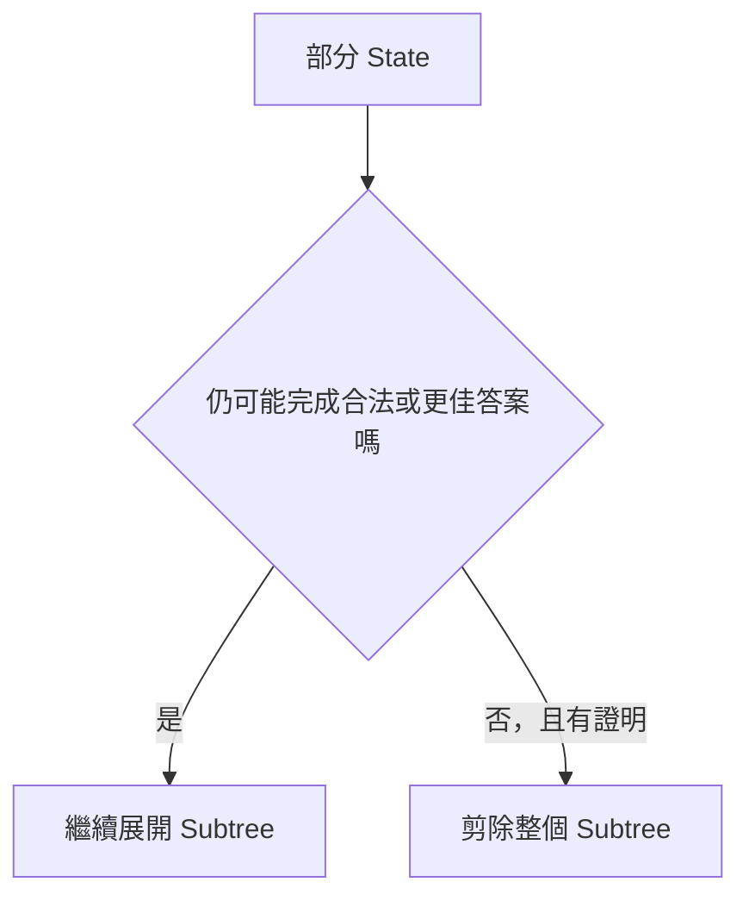

#### 非負數 Sum 剪枝

要求 Subset Sum 等於 Target，且所有候選數都非負：

```text
currentSum > target
```

後續再加入數值只會讓 Sum 不變或增加，所以不可能回到 Target，可以剪枝。

若允許負數，後續加入負值可能讓 Sum 降低，此剪枝便不成立。

#### 最佳化上界剪枝

最大化問題可計算目前分支能達到的樂觀上界。若上界仍不超過目前最佳答案，整個分支不可能改善答案。

這類剪枝必須保證上界真的不低估任何可能答案。錯誤上界會排除原本可形成最佳答案的分支。

#### 剪枝檢查表

每項剪枝都應回答：

1. 剪枝依賴哪些 Precondition？
2. 它排除的是單一候選，還是整個 Subtree？
3. 為什麼 Subtree 中每個完成候選都不合法或不可能更佳？
4. 若加入負數、重複值或不同排序，推理是否仍成立？
5. 能否使用未剪枝版本進行小型對拍？

### 11.12 複雜度與輸出大小

常見搜尋空間：

| 候選類型 | 候選數量 |
|---|---:|
| 元素 | n |
| 無順序 Pair | n(n - 1) / 2 |
| 非空連續區間 | n(n + 1) / 2 |
| Subset | 2^n |
| 選 k 個 Combination | C(n, k) |
| 全排列 | n! |

#### 不能快過輸出大小

若題目要求輸出所有 `2^n` 個 Subset，光是產生所有答案就需要指數級工作。最佳化只能降低每個答案的額外成本，不能把完整輸出變成多項式數量。

如果每個 Subset 平均還需複製 O(n) 個元素，輸出與複製成本可達 O(n × 2^n)。

#### 搜尋樹節點數

複雜度不只看葉節點。遞迴還會經過中間 State，但在典型二元 Subset Tree 中，總節點數仍和 `2^n` 同階。

#### Factorial 成長

Permutation 的 `n!` 成長很快：

```text
8!  = 40,320
10! = 3,628,800
12! = 479,001,600
```

需要根據實際 n 限制判斷是否可行，而不是只看程式碼簡短。

### 11.13 直接解法作為測試 Oracle

Brute Force 的重要用途是驗證較複雜的最佳化解法。

#### Oracle 特性

- 只處理小型輸入。
- 完整列出候選空間。
- 每一步容易人工確認。
- 儘量不和最佳化版本共用複雜邏輯。

#### 對拍流程

```cpp
for (int test = 0; test < 10000; ++test)
{
    auto input = generateSmallInput();
    auto expected = bruteForce(input);
    auto actual = optimized(input);

    if (!equivalent(expected, actual, input))
    {
        printFailure(input, expected, actual);
        break;
    }
}
```

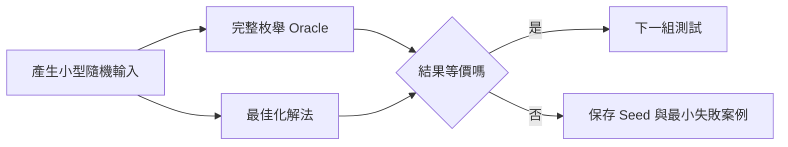

#### Oracle 也要驗證

直接解法仍可能因候選空間不完整而出錯。應先使用手動小案例檢查：

- 空輸入。
- 一個元素。
- 兩個元素。
- 所有答案都合法。
- 完全沒有答案。
- 多個不同合法答案。

多答案問題應使用 Postcondition 判斷等價，不一定比較完全相同的輸出順序。

### 11.14 C 語言中的枚舉

C 的迴圈與 Bitmask 核心相同，但需要自行管理結果 Buffer 與長度。

#### Pair

```c
#include <stddef.h>

void enumerate_pairs(
    const int values[],
    size_t length)
{
    for (size_t i = 0; i < length; ++i)
    {
        for (size_t j = i + 1; j < length; ++j)
        {
            check_pair(values[i], values[j]);
        }
    }
}
```

#### Subset 遞迴 State

```c
void enumerate_subsets(
    const int values[],
    size_t length,
    size_t index,
    int current[],
    size_t current_length)
{
    if (index == length)
    {
        output_subset(current, current_length);
        return;
    }

    enumerate_subsets(
        values, length, index + 1,
        current, current_length);

    current[current_length] = values[index];
    enumerate_subsets(
        values, length, index + 1,
        current, current_length + 1);
}
```

Precondition 是 `current` 至少可容納 `length` 個元素。若結果需要長期保存，不能只保存指向同一個可變 Buffer 的 Pointer，而要複製當下內容或由呼叫端立即處理。

### 11.15 建立自己的 Enumeration 分析表

| 欄位 | 要回答的問題 |
|---|---|
| 候選定義 | 一個完整答案由哪些選擇構成？ |
| 候選類型 | 元素、Pair、Interval、Subset、Combination 或 Permutation？ |
| 連續性 | 是否必須連續？ |
| 順序 | 順序不同是否算不同答案？ |
| Identity | 相同 Value 的不同 Index 是否區分？ |
| 空候選 | 空集合或空區間是否合法？ |
| 唯一表示 | 如何確保每個候選恰好列出一次？ |
| 搜尋 State | 每層正決定哪個位置或選擇？ |
| Base Case | 何時形成完整候選？ |
| 回復 State | 遞迴返回後需要復原哪些內容？ |
| 去重 | 是同層去重，還是其他等價規則？ |
| 剪枝 | 哪項 Precondition 能排除整個 Subtree？ |
| 候選數量 | n、n²、2^n、C(n,k) 還是 n!？ |
| 檢查成本 | 每個候選需要 O(1)、O(n) 或其他成本？ |
| Oracle | 是否能保留小型直接解法驗證最佳化版本？ |

### 11.16 常見問題與判讀

| 現象 | 可能原因 | 第一輪檢查 |
|---|---|---|
| 重複 Pair | 同時枚舉 `(i,j)` 與 `(j,i)` | 無順序 Pair 是否使用 `j = i + 1` |
| 漏掉 Pair | 迴圈上界或起點錯誤 | 是否完整涵蓋 `0 <= i < j < n` |
| 區間少一個元素 | Inclusive 與 Half-open 混用 | 明確使用 `[left,right)` |
| 區間解法變成 O(n³) | 每個區間重新走訪求和 | 固定 Left 時累積 Sum |
| Subset 數量不對 | 忘記空集合或重複 Mask | 是否包含 `mask = 0` |
| Bitmask 位移錯誤 | 型別寬度不足或 n 過大 | 位移量是否小於型別 Bit 數 |
| Combination 出現順序重複 | 後續仍可選較小 Index | 使用遞增 `start` |
| Permutation 少解 | 過早限制只能向右選 | 每層應選任一未使用 Index |
| 重複答案 | 去重層級錯誤 | 按 Index 還是按 Value；同層還是跨層 |
| Backtracking 分支互相污染 | 遞迴後未回復 State | Push 後是否對應 Pop |
| 剪枝後漏解 | 剪枝 Precondition 不成立 | 負數、排序、單調性與上界推理 |
| 暴力版也錯 | 候選空間不完整 | 用更小資料手動列出全部候選 |
| 複雜度估計過低 | 只計候選數，忽略輸出或檢查成本 | 候選數乘上每個候選成本 |
| Oracle 對拍誤判 | 多答案只比較完全相同輸出 | 改驗證 Postcondition |

### 11.17 本章檢查表

- 我能先定義完整候選，而不是直接決定迴圈數量。
- 我能區分元素、Pair、Interval、Subset、Combination 與 Permutation。
- 我知道無順序 Pair 可用 `i < j` 建立唯一表示。
- 我能計算 Pair 與非空連續區間數量。
- 我會區分候選數量與每個候選的檢查成本。
- 我知道每個區間重新求和可能形成 O(n³)。
- 我能使用固定 Left 累積 Sum 降低重複工作。
- 我知道 n 個元素共有 `2^n` 個 Subset，包含空集合。
- 我會檢查 Bitmask 型別寬度與位移範圍。
- 我能用搜尋樹說明每層的選或不選。
- 我能在遞迴返回後回復可變 State。
- 我能區分 Combination 不重視順序，Permutation 重視順序。
- 我知道 Combination 使用 `start` 避免順序重複。
- 我能區分按 Index 與按 Value 去重。
- 我知道同層去重不代表所有層都略過相同 Value。
- 我能為每項剪枝說明所依賴的 Precondition。
- 我能證明剪枝排除的是整個不可能 Subtree。
- 我知道輸出所有 Subset 或 Permutation 本身就需要大量時間。
- 我會保留小型直接解法作為 Oracle。
- 我知道多答案對拍應檢查 Postcondition。

### 11.18 本章重點

- Enumeration 的第一步是定義候選空間，不是直接寫巢狀迴圈。
- 完整枚舉能協助驗證題意、建立正確解法、找出重複工作並作為測試 Oracle。
- 無順序 Pair 可用 `i < j` 讓每組不同 Index 恰好出現一次。
- 非空連續區間共有 `n(n + 1) / 2` 個，但每個區間的處理成本仍需另外計算。
- n 個元素共有 `2^n` 個 Subset，Bitmask 與二元搜尋樹是兩種常見表示。
- Combination 通常不關心順序；Permutation 將不同順序視為不同答案。
- Backtracking 需要在離開分支後回復 State，避免不同 Subtree 互相影響。
- 重複值問題必須先定義按 Index 還是按 Value 區分。
- 同層去重用於避免相同決策位置產生等價分支，不能任意擴大到所有層。
- 剪枝必須有正確性依據，能證明整個 Subtree 不可能產生合法或更佳答案。
- 若剪枝依賴非負、排序或單調性，輸入不符合條件時就不能使用。
- 複雜度應同時考慮候選數量、每個候選的檢查成本與輸出大小。
- 小型 Brute Force 適合作為 Greedy、DP、Hash、Two Pointers 等最佳化解法的 Oracle。
