## 第 12 章　Two Pointers

### 適用範圍

本章介紹 Two Pointers 的共同模型，以及相向 Pointer、同方向 Read/Write Pointer、排序 Pair、Partition、去重與 Linked List 快慢指標。

Two Pointers 的重點不是程式中剛好出現兩個 Index，而是每次移動其中一個 Pointer 時，都能根據已知性質安全排除一批候選，而且不必回頭重新檢查。

因此，開始套用 Two Pointers 前，需要先回答：

- 兩個 Pointer 各自代表什麼位置或區域邊界。
- Pointer 之間的範圍是候選、已處理資料，還是目前 Window。
- 輸入的排序、單調性或鏈結結構提供了什麼保證。
- 每次移動排除了哪些候選。
- 為什麼被排除候選不可能包含答案。
- Pointer 是否在每輪嚴格前進，讓演算法一定終止。
- 排序是否會破壞原始 Index 或穩定順序需求。

本章會建立一套固定流程：

1. 定義 Left、Right、Read、Write 或 Slow、Fast 的語意。
2. 寫出 Pointer 所切分的區域 Invariant。
3. 找出允許排除候選的排序或單調性。
4. 為每一種比較結果寫出唯一合理的移動方向。
5. 說明移動後排除了哪些候選。
6. 確認 Pointer 不會停住、倒退或越界。
7. 另外處理重複值、原始 Index 與算術 Overflow。
8. 使用小型資料逐輪記錄移動與排除理由。

### 適用讀者

- 看到兩個 Index 便稱為 Two Pointers，但無法說明成立條件的讀者。
- 需要處理排序 Pair、去重、壓縮與 Partition 的讀者。
- 容易在 Sum 太大或太小時移動錯誤 Pointer 的讀者。
- 排序後找得到答案，但回傳原始 Index 錯誤的讀者。
- 不清楚 Read/Write Pointer 各區段代表什麼的讀者。
- 容易混淆 Two Pointers 與 Sliding Window 的讀者。
- 需要理解 Linked List 快慢指標共同本質的讀者。
- 想為 Pointer 移動建立正確性證明與 Debug 表的讀者。

### 快速導覽

- [Two Pointers 到底是什麼](#121-two-pointers-到底是什麼)
- [第一步：定義 Pointer 與候選區域](#122-第一步定義-pointer-與候選區域)
- [相向 Pointer 與排序單調性](#123-相向-pointer-與排序單調性)
- [完整案例：排序 Two Sum](#124-完整案例排序-two-sum)
- [保留原始 Index](#125-保留原始-index)
- [重複值與唯一答案](#126-重複值與唯一答案)
- [同方向 Read/Write Pointer](#127-同方向-readwrite-pointer)
- [完整案例：移除指定值](#128-完整案例移除指定值)
- [Partition 的區域模型](#129-partition-的區域模型)
- [完整案例：將符合條件的元素穩定移至前方（非完整分區）](#1210-完整案例將符合條件的元素穩定移至前方非完整分區)
- [快慢指標](#1211-快慢指標)
- [Two Pointers 與 Sliding Window](#1212-two-pointers-與-sliding-window)
- [不適用情境](#1213-不適用情境)
- [複雜度與終止性](#1214-複雜度與終止性)
- [C 語言中的 Two Pointers](#1215-c-語言中的-two-pointers)
- [建立自己的 Two Pointers 分析表](#1216-建立自己的-two-pointers-分析表)
- [常見問題與判讀](#1217-常見問題與判讀)
- [本章檢查表](#1218-本章檢查表)
- [本章重點](#1219-本章重點)

### 12.1 Two Pointers 到底是什麼

Two Pointers 是用兩個位置共同描述候選範圍、已處理區域或移動速度的模式。

常見形式：

| 類型 | Pointer | 常見用途 |
|---|---|---|
| 相向 | Left、Right | 排序 Pair、回文、容器兩端比較 |
| 同方向 | Read、Write | 去除、壓縮、原地整理 |
| Partition | Boundary、Scan，或 Left、Right | 可透過 Read/Write 穩定提取，或相向 Swap 分區 |
| 不同速度 | Slow、Fast | Linked List 中點、Cycle Detection |
| 連續窗口 | Left、Right | Sliding Window 與區間 State |

本章會先討論奠基在「區域切割」上的相向 Pointer、Read/Write Pointer 與 Partition。Partition 不是單一寫法，可透過 Read/Write 穩定提取 Prefix，也可透過相向 Swap 做不穩定分區，詳見 12.9 與 12.10。不同速度的 Slow/Fast 主要依賴節點距離差；連續窗口雖然也常使用 Left/Right，但核心是維護 `[left, right)` 內的聚合 State，例如 Sum、Frequency 或 Validity，後續會在 12.11 與 12.12 分別展開。

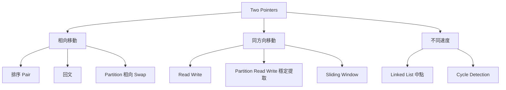

圖中的 Partition 分成兩個入口：相向 Swap 通常是不穩定分區；Read/Write 則常用於穩定提取符合條件的 Prefix。兩者都屬於 Partition 題型，但 Postcondition 與穩定性保證不同。

共同本質是：

> Pointer 移動後，某些候選或狀態已被證明不再需要考慮。

若只能說「這題看起來可以左右夾」，卻無法說明排除理由，方法可能依賴尚未確認的假設。

### 12.2 第一步：定義 Pointer 與候選區域

以相向 Pointer 為例：

```text
[0, left)       已排除的左側位置
[left, right]   尚未排除的候選範圍
(right, n)      已排除的右側位置
```


以 Read/Write Pointer 為例：

```text
[0, write)      已整理結果
[write, read)   已讀取但不需保留的舊內容
[read, n)       尚未處理
```

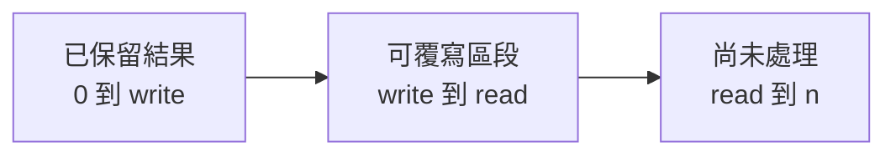

Pointer 名稱不是證明。必須明確寫出每個區間代表什麼，才能判斷 Swap、覆寫與移動是否安全。

本節展示的區域模型主要用於「相向」與「同向讀寫」兩類。若 Pointer 是不同速度，例如 Slow/Fast，狀態通常不是候選區域，而是兩個節點之間的距離差；若用於連續區間，也就是 Sliding Window，則會以 `[left, right)` 內的聚合 State 為核心。這些變形仍可放在 Two Pointers 的大分類下，但正確性證明的重點不同。

### 12.3 相向 Pointer 與排序單調性

排序 Array 提供 Value 單調性：

```text
nums[left] <= ... <= nums[right]
```

若固定 Right，Left 越往右，Sum 不會變小。若固定 Left，Right 越往左，Sum 不會變大。

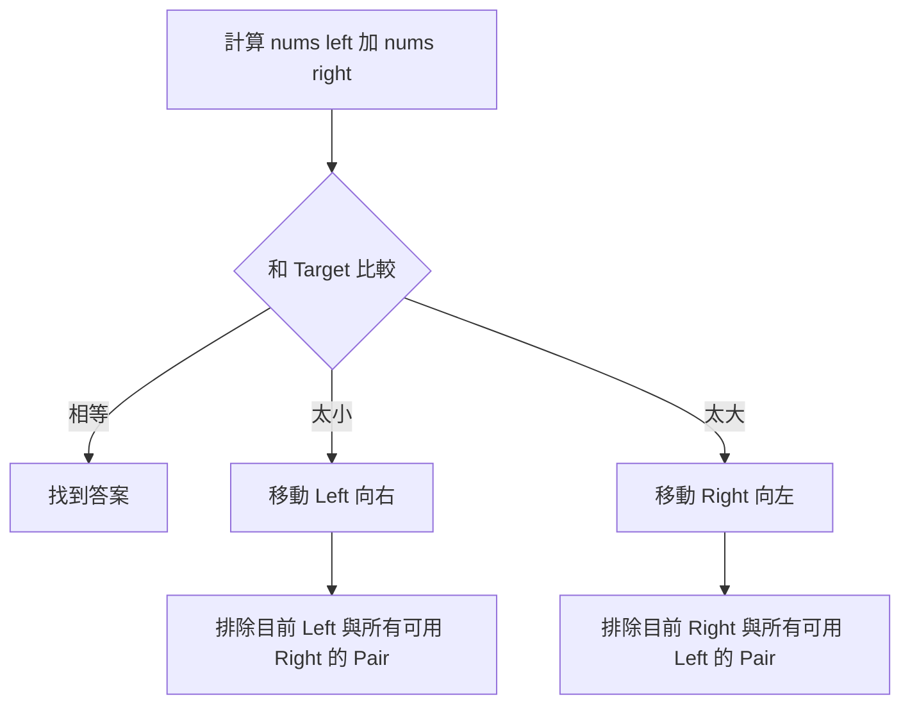

沒有排序時，Value 大小與 Index 移動之間沒有可靠關係。Sum 太小不代表增加 Left 會讓 Sum 變大，因此不能直接套用相向 Pointer。

### 12.4 完整案例：排序 Two Sum

#### 問題規格

給定已依非遞減順序排列的整數 Array，判斷是否存在兩個不同 Index，使 Value 總和等於 Target。

#### Precondition

- `nums` 已排序。
- Pair 必須使用不同 Index。

#### C++ 解法

```cpp
#include <vector>

bool hasPairWithSum(
    const std::vector<int>& nums,
    int target)
{
    int left = 0;
    int right = static_cast<int>(nums.size()) - 1;

    while (left < right)
    {
        const long long sum =
            static_cast<long long>(nums[left]) + nums[right];

        if (sum == target)
        {
            return true;
        }

        if (sum < target)
        {
            ++left;
        }
        else
        {
            --right;
        }
    }

    return false;
}
```

空 Array 時 `right == -1`，`left < right` 立即為 false，不會存取元素。

#### Loop Invariant

每輪開始前：

> 若合法 Pair 存在，至少有一組答案的兩個 Index 都位於 `[left, right]`。

也就是所有候選區間外的 Pair 都已被安全排除。

#### Sum 太小時為何移動 Left

目前：

```text
nums[left] + nums[right] < target
```

`right` 已是候選區間中最大的 Value。對任何 `j <= right`：

```text
nums[left] + nums[j]
<= nums[left] + nums[right]
< target
```

因此目前 `left` 不可能和候選區間內任何位置形成答案，可以排除它並執行 `++left`。

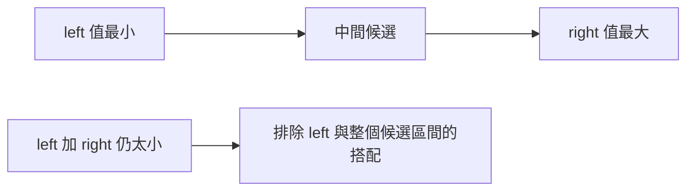

#### Sum 太大時為何移動 Right

目前：

```text
nums[left] + nums[right] > target
```

`left` 已是候選區間中最小的 Value。對任何 `i >= left`：

```text
nums[i] + nums[right]
>= nums[left] + nums[right]
> target
```

所以目前 `right` 不可能和候選區間內任何位置形成答案，可以執行 `--right`。

#### Termination

每輪不是回傳，就是讓 `left` 增加 1 或 `right` 減少 1。候選區間長度嚴格縮小，因此演算法一定終止。

#### 逐輪案例

```text
nums = [1, 2, 4, 7, 11]
target = 9
```

| Left | Right | Values | Sum | 動作 | 排除理由 |
|---:|---:|---|---:|---|---|
| 0 | 4 | 1, 11 | 12 | Right 左移 | 11 與任何候選 Left 相加都太大 |
| 0 | 3 | 1, 7 | 8 | Left 右移 | 1 與任何候選 Right 相加都太小 |
| 1 | 3 | 2, 7 | 9 | 找到 | 符合 Target |

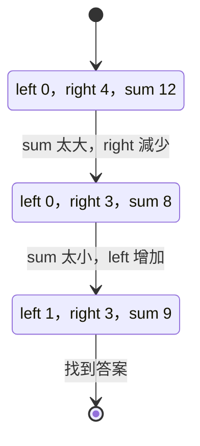

#### 複雜度

- 時間複雜度：O(n)。
- 額外空間：O(1)。

這建立在輸入已排序。若必須先排序，完整時間通常是 O(n log n)。

### 12.5 保留原始 Index

若輸入未排序，而題目要求回傳原始 Index，可以建立 `(value, originalIndex)`：

```cpp
struct Item
{
    int value;
    int index;
};
```

排序 Item 後用 Value 執行 Two Pointers，找到答案時回傳保存的原 Index。

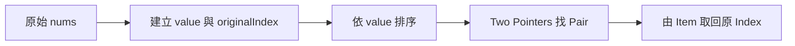

需要另外確認：

- 排序是否允許額外 O(n) 空間。
- 重複 Value 是否仍能辨識不同 Index。
- 輸出 Index 是否需要特定順序。
- 若僅需存在性，是否不必保存 Index。

排序會改變原順序。如果題目要求原 Array 中的相對位置關係，必須確認排序後的排除推理仍符合答案語意。

### 12.6 重複值與唯一答案

若題目要列出所有唯一 Value Pair，找到答案後通常需要跳過相同 Value。

```cpp
const int leftValue = nums[left];
const int rightValue = nums[right];

while (left < right && nums[left] == leftValue)
{
    ++left;
}

while (left < right && nums[right] == rightValue)
{
    --right;
}
```

跳過時機應在記錄答案後，否則可能漏掉合法 Pair。

注意：當 `leftValue == rightValue` 時，例如 `[2, 2, 2]` 且 Target 為 4，第一個 `while` 可能會將 `left` 移動到 `right`，使第二個 `while` 的條件 `left < right` 直接為 false。此時第二個迴圈不會執行，因此不會越界，也不會漏掉唯一 Value Pair，因為該 Pair 已經在跳過前記錄完成。

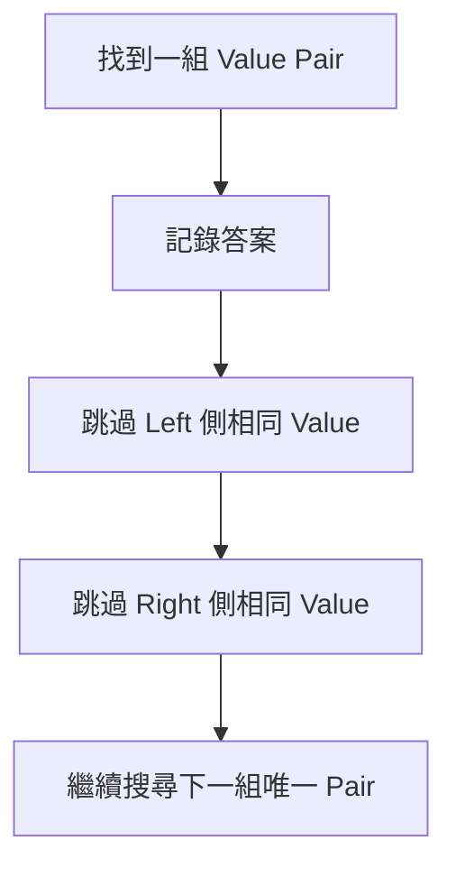

題目若按 Index 區分答案，就不能任意跳過相同 Value，因為不同 Index Pair 可能都需輸出。去重規則必須回到 Postcondition。

### 12.7 同方向 Read/Write Pointer

Read/Write Pointer 適合從左到右讀取，並將需要保留的元素寫回前方。

典型區域：

```text
[0, write)      已完成結果
[write, read)   已處理但可被覆寫
[read, n)       尚未處理
```

Read 每輪前進；只有在保留目前元素時，Write 才前進。

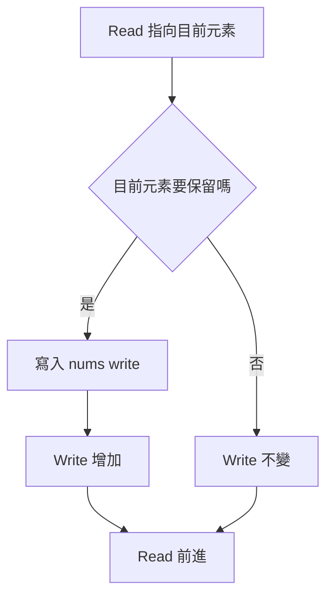

核心安全條件通常是：

```text
write <= read
```

因此寫入位置不會越過尚未讀取資料。當 `write == read` 時，賦值 `nums[write] = nums[read]` 的右側會先讀取目前 `read` 指向的元素，因此不會遺失尚未讀取的資料；這正是 `write <= read` 保證寫入位置不會超前讀取位置的關鍵。

### 12.8 完整案例：移除指定值

#### 問題規格

原地移除所有等於 Target 的元素，將保留元素依原順序放到 Array 前方，回傳新長度。

#### C++ 解法

```cpp
#include <vector>

int removeValue(
    std::vector<int>& nums,
    int target)
{
    int write = 0;

    for (int read = 0;
         read < static_cast<int>(nums.size());
         ++read)
    {
        if (nums[read] != target)
        {
            nums[write] = nums[read];
            ++write;
        }
    }

    return write;
}
```

#### Postcondition

令回傳值為 `k`：

- `[0, k)` 恰好包含原輸入中不等於 Target 的元素。
- 保留元素的相對順序不變。
- `k` 之後的內容不屬於結果規格。

#### Loop Invariant

每輪開始前：

1. `[0, write)` 是原輸入 `[0, read)` 中應保留元素的穩定結果。
2. `write <= read`。
3. `[read, n)` 尚未處理。

#### 逐輪案例

```text
nums = [3, 2, 2, 4]
target = 2
```

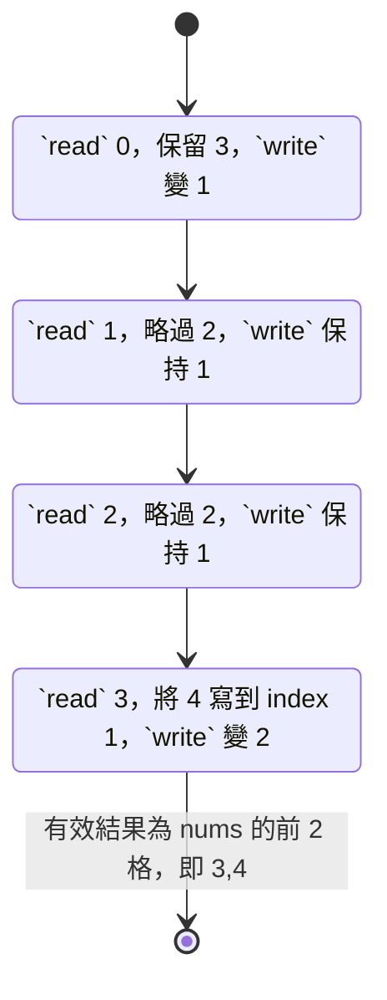

#### 為什麼保持穩定順序

Read 依原順序由左到右掃描，每個保留元素也依相同順序寫入下一個 Write 位置，因此相對順序不變。

#### 複雜度

- 時間複雜度：O(n)。
- 額外空間：O(1)。

### 12.9 Partition 的區域模型

Partition 將元素依 Predicate 分到不同區域，例如：

- 偶數在前、奇數在後。
- 小於 Pivot 在左、大於等於 Pivot 在右。
- 符合條件者移到 Prefix。

Partition 不只一種形式。先決定是否要求穩定順序，再選更新方式。

#### 穩定 Prefix 提取與真正穩定 Partition

Read/Write 可將符合 Predicate 的元素穩定放到前方，這只保證 Prefix 中符合條件者的相對順序。若 Postcondition 還要求不符合 Predicate 的元素也完整保留，且各自維持原來相對順序，才是完整的穩定 Partition。完整穩定 Partition 通常需要額外 Buffer，或使用更複雜的搬移策略。

#### 不穩定相向 Partition

Left 找錯放在左側的元素，Right 找錯放在右側的元素，再 Swap。注意：Swap 會破壞兩側元素的原始相對順序，因此這種 Partition 是不穩定的。若題目要求保留原始順序，請改用穩定 Prefix 提取、額外 Buffer，或其他能維持順序的搬移方法。

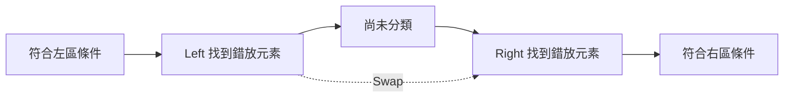

每段區域的語意必須在 Swap 前後保持成立。

### 12.10 完整案例：將符合條件的元素穩定移至前方（非完整分區）

將所有偶數依原相對順序移到前方，回傳偶數數量。這個版本可稱為「穩定提取前置」或「條件保留」，在其他教材或題解中也常被稱為 In-place Filter 或 Conditional Compaction。它只保證 Prefix 為偶數的穩定結果，並不保證後方完整保存所有奇數，也不保證奇數的相對順序。

因此，本節標題刻意不稱為完整穩定分區。若題目要求「偶數與奇數都各自保持原順序，並完整排列於 Array 兩側」，這個覆寫版本的 Postcondition 不足，需要額外 Buffer 或其他搬移策略。

```cpp
#include <vector>

int keepEvensInPrefix(std::vector<int>& nums)
{
    int write = 0;

    for (int read = 0;
         read < static_cast<int>(nums.size());
         ++read)
    {
        if (nums[read] % 2 == 0)
        {
            nums[write] = nums[read];
            ++write;
        }
    }

    return write;
}
```

Invariant：

> `[0, write)` 是已處理 Prefix 中所有偶數的穩定結果。

Postcondition：

- 回傳值 `write` 是偶數數量。
- `[0, write)` 依序包含原輸入中的所有偶數。
- `[write, n)` 不屬於此函式保證的有效結果，不能把它解讀為穩定排列後的奇數區。

這個案例的重點是展示 Read/Write Pointer 的最小約束：只要題目只需要保留符合條件的 Prefix，覆寫是安全且簡潔的；若題目要求真正的穩定 Partition，必須重新定義 Postcondition 與資料搬移方式。

### 12.11 快慢指標

Linked List 快慢指標也屬於 Two Pointers：

- Slow 每輪前進一步。
- Fast 每輪前進兩步。

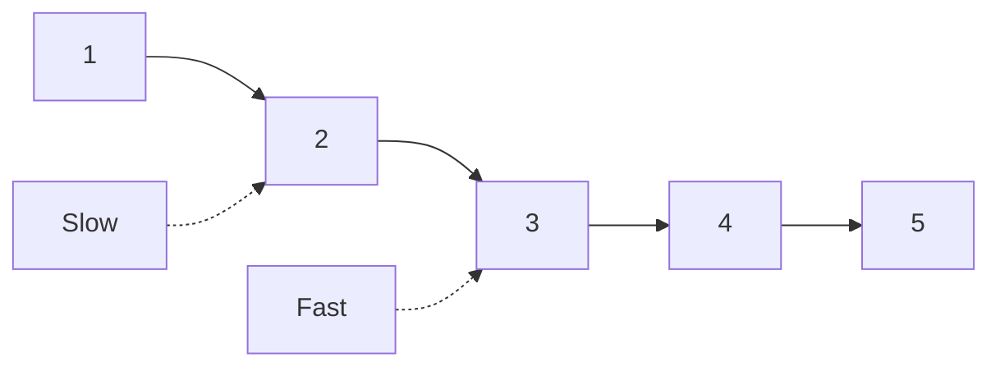

它和排序 Pair 的排除方式不同，核心是利用速度差建立位置關係：

- Fast 到尾端時，Slow 到中點附近。
- 進入 Cycle 後，Fast 相對 Slow 每輪多前進一步，最終會相遇。

因此 Two Pointers 是較大的模式分類，不是所有變形都依賴排序 Value。

實作快慢指標時，終止條件必須先保護空指標。以 Linked List Cycle Detection 為例，常見條件是：

```cpp
while (fast != nullptr && fast->next != nullptr)
{
    slow = slow->next;
    fast = fast->next->next;
}
```

若鏈結是空或只有一個節點，`fast == nullptr` 或 `fast->next == nullptr` 會讓迴圈直接停止，避免存取空指標。

完整 Cycle Detection 範例如下：

```cpp
struct ListNode
{
    int value;
    ListNode* next;
};

bool hasCycle(ListNode* head)
{
    ListNode* slow = head;
    ListNode* fast = head;

    while (fast != nullptr && fast->next != nullptr)
    {
        slow = slow->next;
        fast = fast->next->next;

        if (slow == fast)
        {
            return true;
        }
    }

    return false;
}
```

這段函式的 Invariant 是：若存在 Cycle，`fast` 進入 Cycle 後會以每輪多一步的速度逐漸追上 `slow`；若不存在 Cycle，`fast` 會先抵達尾端並結束迴圈。

### 12.12 Two Pointers 與 Sliding Window

Sliding Window 通常使用同方向 Left、Right，並維護連續區間 `[left, right)` 的 State。

| 比較項目 | 一般 Two Pointers | Sliding Window |
|---|---|---|
| 常見用途 | 排序 Pair、去重、Partition、Linked List | 最長、最短或計數連續區間 |
| State | 候選邊界或已整理區域 | Window 內 Frequency、Sum 或 Validity |
| 移動依據 | 排除候選或整理元素 | 擴張與收縮 Window |
| 是否必為連續區間 | 不一定 | 通常是 |

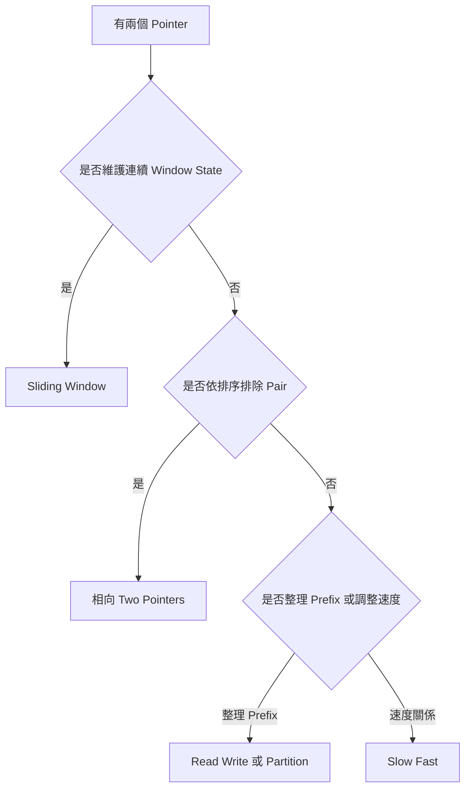

不能只因為有 Left 與 Right，就把所有方法稱為 Sliding Window。

### 12.13 不適用情境

#### 無序資料卻依 Value 大小移動

Sum 太小時增加 Left 的推理依賴排序。若資料無序，移動後可能跳過答案。

#### 排序破壞答案語意

若題目要求：

- 原始 Index。
- 原始相對順序。
- 原 Array 中的連續區間。

直接排序可能改變問題。需要保存原 Index，或選擇不需排序的方法。

#### 無法說明排除理由

若 Pointer 移動只因「通常這樣寫」，但無法證明被略過候選不可能是答案，應回到直接枚舉尋找單調性。

#### Window State 不單調

某些 Sum Window 方法依賴加入元素只會讓 Sum 增加。資料含負數後，擴張與收縮的效果可能不再單調，普通 Sliding Window 可能漏解。

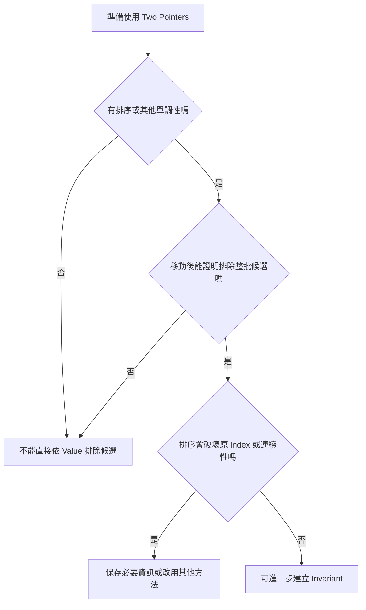

### 12.14 複雜度與終止性

Two Pointers 常包含 `while`，但若每個 Pointer 只單向移動，總移動次數通常是 O(n)。

相向 Pointer：

```text
Left 最多增加 n 次
Right 最多減少 n 次
```

Read/Write Pointer：

```text
Read 走訪 n 次
Write 最多增加 n 次
```

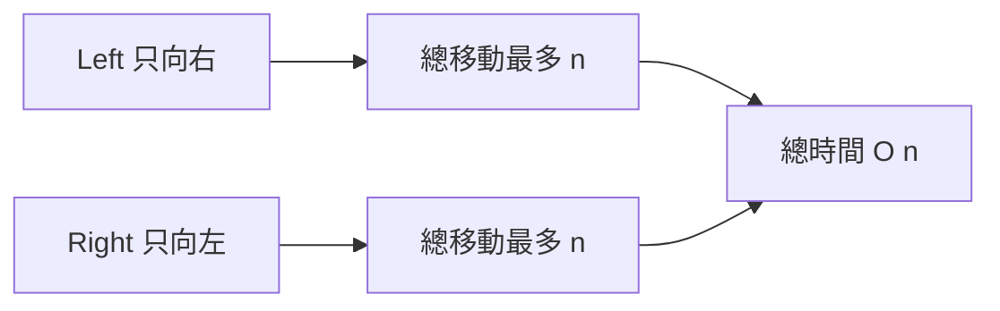

O(n) 來自每個 Pointer 不回頭，而不是因為 Pointer 數量固定。若某個 Pointer 在每輪重新掃描大量區間，仍可能是 O(n²)。

終止性應指出一個嚴格縮小量，例如：

- `right - left`。
- `n - read`。
- 尚未處理 Node 數量。

### 12.15 C 語言中的 Two Pointers

C 的演算法核心相同，但 Array 需要另外傳入長度。

C 語言通常使用 `size_t` 作為索引型別，因此需先檢查 `length < 2`，避免在計算 `length - 1` 時發生 Unsigned Underflow。前面的 C++ 範例使用 `int` 作為指標索引，空 Array 時可讓 `right = -1`，再由 `left < right` 阻止存取；C 版本不能依賴同樣寫法。

```c
#include <stdbool.h>
#include <stddef.h>

bool has_pair_with_sum(
    const int values[],
    size_t length,
    long long target)
{
    if (values == NULL || length < 2)
    {
        return false;
    }

    size_t left = 0;
    size_t right = length - 1;

    while (left < right)
    {
        const long long sum =
            (long long)values[left] + values[right];

        if (sum == target)
        {
            return true;
        }

        if (sum < target)
        {
            ++left;
        }
        else
        {
            --right;
        }
    }

    return false;
}
```

先檢查 `length < 2`，才能安全執行 `length - 1`，避免 Unsigned Underflow。

Read/Write 版本通常接收可修改 Array，並回傳新長度：

```c
size_t remove_value(
    int values[],
    size_t length,
    int target)
{
    size_t write = 0;

    for (size_t read = 0; read < length; ++read)
    {
        if (values[read] != target)
        {
            values[write] = values[read];
            ++write;
        }
    }

    return write;
}
```

呼叫端只能把 `[0, write)` 視為有效結果。

### 12.16 建立自己的 Two Pointers 分析表

| 欄位 | 要回答的問題 |
|---|---|
| Pointer | Left、Right、Read、Write、Slow、Fast 各代表什麼？ |
| 區域 | 每對 Pointer 切分出的區段代表什麼？ |
| Precondition | 排序、非負、鏈結或其他單調性是否成立？ |
| Postcondition | 演算法結束時，Pointer 或回傳值代表什麼？哪些區域屬於有效結果？ |
| 比較結果 | 每種條件下移動哪個 Pointer？ |
| 排除候選 | 本次移動排除了哪些候選？ |
| 排除理由 | 為什麼這些候選不可能是答案？ |
| 終止性 | 哪個距離或未處理數量嚴格縮小？ |
| Index | 是否需要保留原始 Index？ |
| 重複值 | 按 Value 去重，還是按 Index 區分？ |
| Overflow | Sum、差值與型別轉換是否安全？ |
| 穩定性 | 是否要求保留相對順序？ |
| 複雜度 | 每個 Pointer 最多移動幾次？ |
| 邊界 | 空、單一元素、兩元素、全部相同如何處理？ |

### 12.17 常見問題與判讀

| 現象 | 可能原因 | 第一輪檢查 |
|---|---|---|
| 漏掉 Pair | Pointer 移動方向錯誤 | 寫出排序關係與排除證明 |
| 無序資料結果不穩定 | 使用了排序 Two Pointers 推理 | 輸入是否已排序 |
| 原始 Index 錯誤 | 排序後未保存 Index | 使用 `(value, originalIndex)` |
| 使用同一 Index 兩次 | 終止條件允許 `left == right` | Pair 應使用 `left < right` |
| Sum 在大數時錯誤 | 加法先以 `int` 計算 | 在加法前轉成較寬型別 |
| 重複答案 | 跳過重複值時機錯誤 | 記錄答案後再跳過 |
| Read/Write 覆寫未讀資料 | `write <= read` 不成立 | 重新定義區域 Invariant |
| 結果順序改變 | 使用 Swap Partition | 是否要求穩定順序 |
| Partition 區域混亂 | 沒有先定義每段語意 | 畫出已分類與未分類區段 |
| Pointer 無法終止 | 某分支沒有移動 | 每輪至少一個 Pointer 嚴格前進 |
| Sliding Window 漏解 | State 不具有所需單調性 | 是否含負數或不可逆更新 |
| 複雜度誤判 | Pointer 可能回頭重掃 | 計算每個 Pointer 的總移動次數 |

### 12.18 本章檢查表

- 我知道 Two Pointers 的核心是安全排除候選，而不是剛好有兩個 Index。
- 我能明確定義每個 Pointer 的角色。
- 我能畫出 Pointer 切分的各段區域。
- 我能寫出演算法結束時的 Postcondition，包含哪些區域屬於有效結果。
- 我會確認排序或其他單調性是否為必要 Precondition。
- 我能說明 Sum 太小時為何移動 Left。
- 我能說明 Sum 太大時為何移動 Right。
- 我知道排序 Two Sum 使用 `left < right` 避免同一 Index 配對自己。
- 我會在加法前轉成足夠寬的型別。
- 我知道排序可能破壞原始 Index 與連續區間語意。
- 我能使用 `(value, originalIndex)` 保存位置。
- 我會依 Postcondition 決定是否跳過重複 Value。
- 我能定義 Read/Write 的 `[0, write)` 結果區域。
- 我能證明 `write <= read`，不會破壞尚未讀取資料。
- 我知道穩定提取 Prefix 不等於完整穩定 Partition，Prefix 正確不代表後半部也符合特定排列。
- 我會先定義 Partition 是否要求穩定，並知道 Swap Partition 會破壞相對順序。
- 我能區分一般 Two Pointers 與 Sliding Window。
- 我知道快慢指標利用速度差，而不是排序 Value，並會用 `fast != nullptr && fast->next != nullptr` 保護空指標。
- 我能寫出 Cycle Detection 中 `slow`、`fast` 移動與相遇檢查的完整流程。
- 我能指出每輪嚴格縮小的量，說明終止性。
- 我能用 Pointer 總移動次數說明 O(n)。
- 若無法填寫排除理由，我會回到直接枚舉重新檢查方法。

### 12.19 本章重點

- Two Pointers 的共同本質是 Pointer 移動後能安全排除候選或完成一段 State。
- 相向 Pointer 常依賴排序提供的 Value 單調性。
- 排序 Two Sum 中，Sum 太小可排除目前 Left，Sum 太大可排除目前 Right。
- Pointer 移動方向必須由完整不等式推導，不能只記憶模板。
- 若題目要求原始 Index，排序前應將 Value 與 Index 綁定。
- 重複值是否略過，取決於答案按 Value 還是按 Index 區分。
- Read/Write Pointer 將 Array 分成已整理、可覆寫與尚未處理區域；`write == read` 時右側先讀取目前元素，因此覆寫安全。
- `write <= read` 是原地覆寫通常不會破壞未讀資料的關鍵條件。
- Partition 前應先定義各區域及穩定性需求；Swap Partition 不穩定，穩定 Prefix 提取與完整穩定 Partition 的 Postcondition 也不同。
- Slow/Fast Pointer 透過速度差建立位置關係，也是 Two Pointers 的一種；實作時需先保護空鏈結與單一節點。
- Sliding Window 是維護連續區間 State 的同方向 Two Pointers，但不是所有 Two Pointers 都是 Window。
- 無序資料、非單調 State 或排序會破壞答案語意時，不能直接套用此模式。
- 每個 Pointer 只單向移動時，總時間通常為 O(n)，但仍需檢查是否存在重掃。
- Debug 時應記錄 Pointer、Value、條件、移動方向與排除理由。
