## 第 13 章　Sliding Window

### 適用範圍

本章介紹 Sliding Window 的核心模型，以及固定長度窗口、可變長度窗口、Window State、Validity、Expand、Shrink、答案更新時機與方法成立所需的單調性。

Sliding Window 通常使用同方向移動的 `left` 與 `right`，維護一段連續 Subarray 或 Substring。相鄰窗口共享大部分元素，因此不必為每個區間重新掃描全部內容，只需處理：

- 哪個元素進入窗口。
- 哪個元素離開窗口。
- Window State 如何更新。
- 目前窗口是否合法或是否已滿足要求。
- 何時記錄答案。

Sliding Window 不是「看到連續區間就套用」的模板。可變長度窗口尤其需要證明：`left` 一旦向右移動，就不必回頭，而且被捨棄的窗口不可能在未來成為必要答案。

本章使用以下固定流程：

1. 定義窗口邊界與長度公式。
2. 定義 Window State。
3. 定義元素進入與離開時的更新方式。
4. 定義 Validity 或滿足條件。
5. 決定何時 Expand、何時 Shrink。
6. 決定答案在 Shrink 前、Shrink 內或 Shrink 後更新。
7. 證明 `left` 只向前移動仍不會漏解。
8. 分析每個元素進入與離開的次數。
9. 使用最小案例驗證 Off-by-one、State 與答案更新時機。

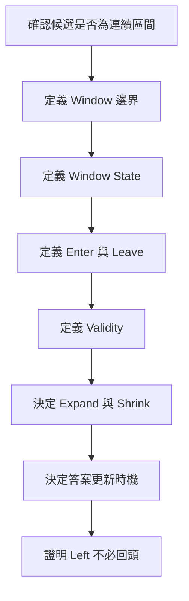

### 適用讀者

- 會背 Sliding Window 模板，但不清楚 `left` 為何移動的讀者。
- 容易混用 Inclusive 與 Half-open Window 的讀者。
- 容易忘記在元素離開時撤銷 Sum 或 Frequency 的讀者。
- 經常混淆最長合法窗口與最短滿足窗口更新時機的讀者。
- 看到連續區間就直接套 Sliding Window 的讀者。
- 不清楚正數、非負數與負數如何影響 Sum Window 的讀者。
- 需要處理固定長度 Sum、最短滿足條件區間與最長無重複字串的讀者。
- 想區分 Sliding Window、一般 Two Pointers 與 Prefix Sum 的讀者。

### 快速導覽

- [13.1 Sliding Window 到底維護什麼](#131-sliding-window-到底維護什麼)
- [13.2 五個必要組件](#132-五個必要組件)
- [13.3 Window 邊界與長度](#133-window-邊界與長度)
- [13.4 固定長度 Window](#134-固定長度-window)
- [13.5 完整案例：固定長度最大總和](#135-完整案例固定長度最大總和)
- [13.6 可變長度 Window 與單調性](#136-可變長度-window-與單調性)
- [13.7 完整案例：Sum 至少為 Target 的最短區間](#137-完整案例sum-至少為-target-的最短區間)
- [13.8 最長合法與最短滿足](#138-最長合法與最短滿足)
- [13.9 完整案例：最長無重複 Byte Substring](#139-完整案例最長無重複-byte-substring)
- [13.10 Frequency、Distinct Count 與其他 State](#1310-frequencydistinct-count-與其他-state)
- [13.11 含負數時為何普通 Sum Window 可能失效](#1311-含負數時為何普通-sum-window-可能失效)
- [13.12 Sliding Window 與其他方法](#1312-sliding-window-與其他方法)
- [13.13 複雜度與終止性](#1313-複雜度與終止性)
- [13.14 系統化 Debug](#1314-系統化-debug)
- [13.15 C 語言中的固定長度 Window](#1315-c-語言中的固定長度-window)
- [13.16 Sliding Window 分析表](#1316-sliding-window-分析表)
- [13.17 常見問題與判讀](#1317-常見問題與判讀)
- [13.18 本章檢查表](#1318-本章檢查表)
- [13.19 本章重點](#1319-本章重點)

### 13.1 Sliding Window 到底維護什麼

Sliding Window 維護的是一段連續區間及其摘要資訊。

```text
已離開窗口 | left ... right | 尚未處理
             目前 Window
```


它的效能來自相鄰窗口共享大部分內容。例如固定長度 Sum 從：

```text
[a, b, c]
```

移動成：

```text
[b, c, d]
```

不需要重新加總 `b + c + d`，只需：

```text
新 Sum = 舊 Sum - a + d
```

因此，Sliding Window 是否適合一題，通常取決於：

1. 候選答案是否為連續區間。
2. Window State 是否能在元素進入與離開時有效更新。
3. 可變長度窗口是否具有足夠單調性，讓兩個邊界都只向前移動。

若題目允許任意跳過元素，候選較可能是 Subsequence、Subset 或其他模型，而不是 Sliding Window。

### 13.2 五個必要組件

完整的 Sliding Window 解法至少要定義五項內容。

#### 1. Boundary

`left` 與 `right` 各指向哪裡？窗口是：

```text
[left, right]
```

還是：

```text
[left, right)
```

#### 2. State

窗口內需要保存什麼摘要？例如：

- Sum。
- Frequency。
- Distinct Count。
- 不符合條件的元素數量。
- Monotonic Deque 中的最大值候選。

#### 3. Enter 與 Leave

元素進入和離開時，State 如何更新？

```text
enter(value): 將 value 加入 State
leave(value): 從 State 撤銷 value
```

若 `leave` 無法正確更新，可能需要其他資料結構。

#### 4. Validity

什麼條件表示窗口合法、非法或已滿足要求？

- 無重複 Byte：所有 Frequency 不超過 1。
- 最多 `k` 種不同值：`distinct <= k`。
- Sum 至少為 Target：`sum >= target`。
- 固定長度：`right - left + 1 == k`。

#### 5. Answer Timing

答案在什麼時候更新？

- 固定長度：窗口長度等於 `k` 時更新。
- 最長合法：先 Shrink 到合法，再更新最大長度。
- 最短滿足：條件成立時先更新，再繼續 Shrink。

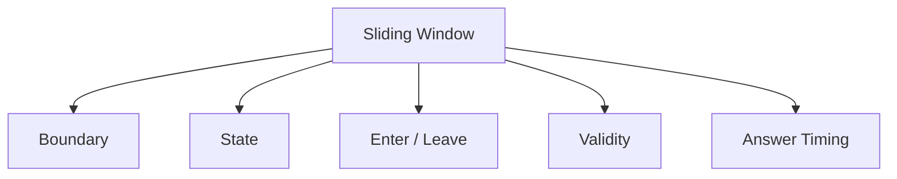

只記得雙迴圈外形，而沒有定義這五項，通常不足以判斷程式是否正確。

### 13.3 Window 邊界與長度

#### Inclusive Window

```text
[left, right]
length = right - left + 1
```

`left` 與 `right` 都位於窗口內。當 `right` 是本輪新加入的元素時，這種表示方式很適合搭配 `for` 迴圈。

空窗口可用：

```text
left > right
```

表示。

#### Half-open Window

```text
[left, right)
length = right - left
```

`left` 位於窗口內，`right` 指向第一個尚未加入的位置。空窗口可自然表示為：

```text
[x, x)
```

C++ Iterator 區間與多數 STL 介面也採用 Half-open 語意。

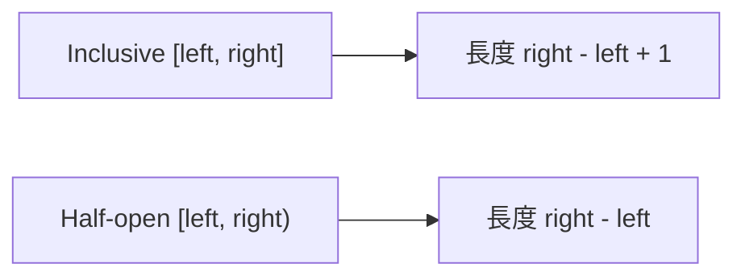

Off-by-one Error 通常不是公式本身錯誤，而是文字定義、迴圈條件、元素加入時機與答案長度混用了不同區間表示。

本章的主要 C++ 範例使用 Inclusive Window `[left, right]`。

### 13.4 固定長度 Window

固定長度 Window 不需要依靠 Sum 的單調性，因為 `left` 的移動完全由長度決定。

Inclusive Window 的常見流程：

1. 讓 `right` 指向新元素。
2. 將新元素加入 State。
3. 若窗口長度超過 `k`，移除 `left` 並令 `left` 前進。
4. 當窗口長度等於 `k` 時更新答案。

也可以先建立第一個完整窗口，之後每輪固定加入一個並移除一個。

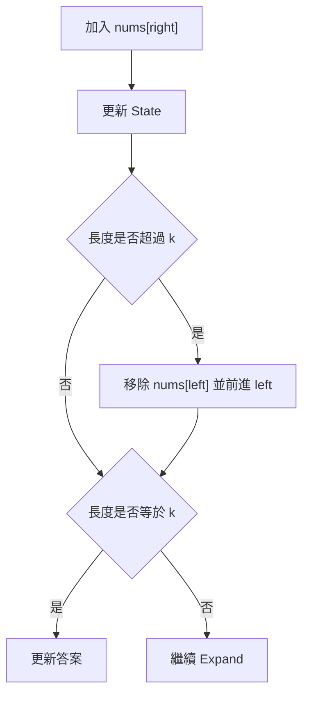

即使輸入包含負數，固定長度 Sum 仍可使用 Sliding Window，因為每個候選窗口都會依固定步幅被檢查。

### 13.5 完整案例：固定長度最大總和

#### 問題規格

給定整數 Array `nums` 與整數 `k`，找出所有長度恰好為 `k` 的連續區間中，最大的 Sum。

若 `k <= 0` 或 `k > nums.size()`，回傳空結果。

#### C++ 解法

```cpp
#include <algorithm>
#include <optional>
#include <vector>

std::optional<long long> maximumWindowSum(
    const std::vector<int>& nums,
    int k) {

    const int n = static_cast<int>(nums.size());

    if (k <= 0 || k > n) {
        return std::nullopt;
    }

    long long currentSum = 0;

    for (int i = 0; i < k; ++i) {
        currentSum += nums[i];
    }

    long long answer = currentSum;

    for (int right = k; right < n; ++right) {
        currentSum += nums[right];
        currentSum -= nums[right - k];
        answer = std::max(answer, currentSum);
    }

    return answer;
}
```

#### State Invariant

第一個迴圈結束後：

```text
currentSum = nums[0] + ... + nums[k - 1]
```

第二個迴圈每輪更新完成後：

```text
currentSum = nums[right - k + 1] + ... + nums[right]
```

#### 更新順序

加入 `nums[right]` 後，暫時有 `k + 1` 個元素；接著移除舊窗口最左端的 `nums[right - k]`，就得到新的長度 `k` 窗口。

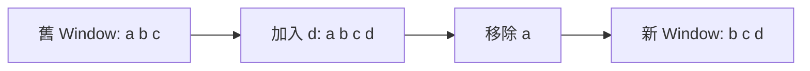

也可以先減後加。關鍵不是先後順序，而是更新答案前，State 必須正好對應新窗口。

#### 邊界案例

| 輸入條件 | 結果 |
|---|---|
| `k <= 0` | 無效，回傳空結果 |
| `k > n` | 無效，回傳空結果 |
| `k == 1` | 最大單一元素 |
| `k == n` | 整個 Array 的 Sum |
| 全部為負數 | 仍回傳最大的固定長度 Sum |

#### 複雜度

- 時間複雜度：O(n)。
- 額外空間：O(1)。

### 13.6 可變長度 Window 與單調性

可變長度 Window 通常讓 `right` 持續 Expand，再依 Validity 移動 `left`。

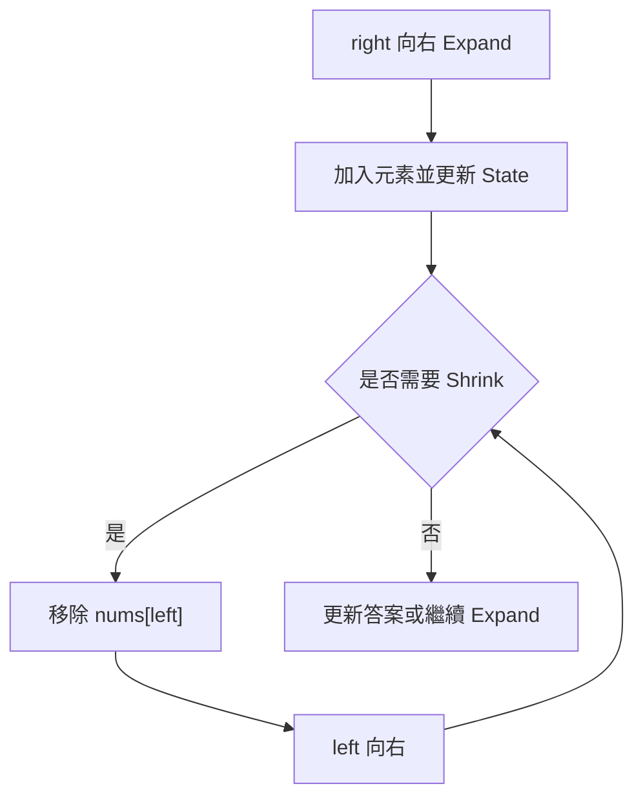

真正需要證明的是：

```text
為什麼 left 向右移動後，不需要在未來把它移回來？
```

這通常依賴某種單調性。例如輸入全部為正數時：

- Expand 只會讓 Sum 增加。
- Shrink 只會讓 Sum 減少。

因此在求 Sum 至少為 Target 的最短窗口時：

- 已滿足條件，可以持續 Shrink 尋找更短答案。
- 一旦不滿足，繼續 Shrink 只會更不滿足，應停止並等待 Expand。

沒有這項性質時，相同的 `while` 邏輯可能漏解。

### 13.7 完整案例：Sum 至少為 Target 的最短區間

#### 問題規格

給定全部為正整數的 Array `nums`，以及正整數 `target`，找出 Sum 至少為 `target` 的最短非空連續區間長度。若不存在，回傳 0。

#### Precondition

- `nums[i] > 0`。
- `target > 0`。
- 只考慮非空區間。

把 `target > 0` 寫入規格，可避免空區間是否已滿足 `sum >= target` 的歧義。

#### C++ 解法

```cpp
#include <algorithm>
#include <vector>

int minimumLengthAtLeastTarget(
    const std::vector<int>& nums,
    long long target) {

    if (target <= 0) {
        return 0;
    }

    const int n = static_cast<int>(nums.size());
    int left = 0;
    int answer = n + 1;
    long long windowSum = 0;

    for (int right = 0; right < n; ++right) {
        windowSum += nums[right];

        while (windowSum >= target) {
            answer = std::min(answer, right - left + 1);
            windowSum -= nums[left];
            ++left;
        }
    }

    return answer == n + 1 ? 0 : answer;
}
```

#### Window State

```text
windowSum = nums[left] + ... + nums[right]
```

#### 為什麼在 `while` 內先更新答案

題目要求最短區間。當 `windowSum >= target` 時，目前窗口已是合法候選，但移除左端後可能仍然合法，而且更短。因此順序必須是：

1. 記錄目前合法窗口。
2. 移除左端元素。
3. 前進 `left`。
4. 再次檢查是否仍然合法。

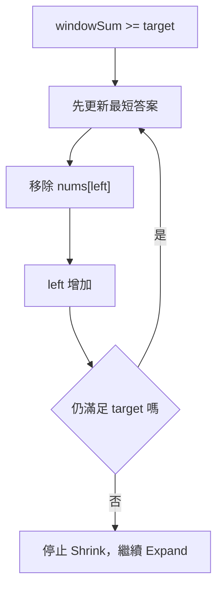

#### Loop Invariant

每次外層迴圈結束後：

1. `windowSum` 正確表示 `[left, right]` 的 Sum；若 `left == right + 1`，窗口為空且 Sum 為 0。
2. 目前窗口不滿足 `windowSum >= target`。
3. 所有右端不大於 `right` 的合法窗口，都已在 Shrink 過程中被考慮。
4. `answer` 是目前已考慮合法窗口的最短長度。

#### 逐輪案例

```text
nums = [2, 3, 1, 2, 4, 3]
target = 7
```

| `right` | Expand 後 Sum | Shrink 過程 | 目前最短 |
|---:|---:|---|---:|
| 0 | 2 | 不 Shrink | 尚無 |
| 1 | 5 | 不 Shrink | 尚無 |
| 2 | 6 | 不 Shrink | 尚無 |
| 3 | 8 | 記錄長度 4，移除 2 | 4 |
| 4 | 10 | 記錄 4，移除 3；記錄 3，移除 1 | 3 |
| 5 | 9 | 記錄 3，移除 2；記錄 2，移除 4 | 2 |

最短區間為 `[4, 3]`，長度為 2。

#### 正數與非負數的差異

若元素是非負數，Sum 仍不會因 Expand 而下降，也不會因 Shrink 而上升，因此主要單調推理仍可成立。不過 0 可能讓 Shrink 後 Sum 不變。證明時應使用「不增加」與「不減少」，而不是「嚴格增加」與「嚴格減少」。

本案例使用正數，使敘述與終止推理更直接。

### 13.8 最長合法與最短滿足

這兩類問題的 Validity 與答案更新時機不同。

#### 最長合法 Window

目標是讓窗口保持合法，並最大化長度。

典型順序：

1. Expand。
2. 窗口不合法時持續 Shrink。
3. 恢復合法後更新最大長度。

```cpp
for (int right = 0; right < n; ++right) {
    enter(data[right]);

    while (!isValid()) {
        leave(data[left]);
        ++left;
    }

    answer = std::max(answer, right - left + 1);
}
```

#### 最短滿足條件 Window

目標是窗口滿足要求時盡量縮短。

典型順序：

1. Expand。
2. 條件成立時先更新最短長度。
3. 持續 Shrink，直到不再滿足。

```cpp
for (int right = 0; right < n; ++right) {
    enter(data[right]);

    while (meetsRequirement()) {
        answer = std::min(answer, right - left + 1);
        leave(data[left]);
        ++left;
    }
}
```

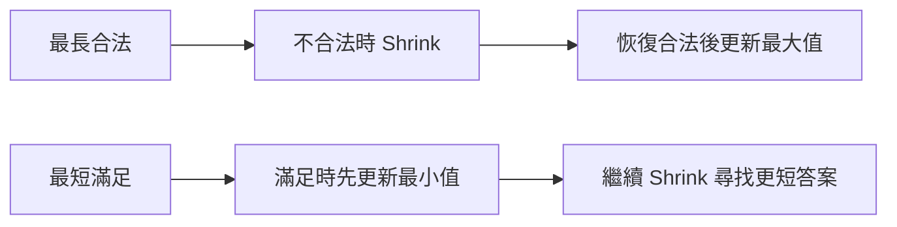

不要只記憶答案在 `while` 內或外。應先問：目前窗口在哪個時間點符合答案的 Postcondition？

### 13.9 完整案例：最長無重複 Byte Substring

#### 問題規格

找出沒有重複 Byte 的最長連續 Substring 長度。

本案例刻意按 Byte 處理，不是完整的 Unicode Code Point 或 Grapheme Cluster 解法。

#### C++ 解法

```cpp
#include <algorithm>
#include <array>
#include <string_view>

int longestUniqueByteSubstring(std::string_view text) {
    std::array<int, 256> frequency{};
    int left = 0;
    int answer = 0;

    for (int right = 0;
         right < static_cast<int>(text.size());
         ++right) {

        const unsigned char entering =
            static_cast<unsigned char>(text[right]);

        ++frequency[entering];

        while (frequency[entering] > 1) {
            const unsigned char leaving =
                static_cast<unsigned char>(text[left]);

            --frequency[leaving];
            ++left;
        }

        answer = std::max(answer, right - left + 1);
    }

    return answer;
}
```

#### Validity

```text
Window 內每個 Byte 的 Frequency 都不超過 1
```

加入新 Byte 前，舊窗口已合法。因此加入後若窗口變得不合法，重複項目一定是本輪加入的 `entering`，所以只需檢查：

```cpp
frequency[entering] > 1
```

#### Loop Invariant

每次更新答案前：

1. Frequency 完整描述 `[left, right]`。
2. 窗口內沒有重複 Byte。
3. 對目前 `right` 而言，`left` 已完成必要的 Shrink。
4. `answer` 保存先前所有合法窗口的最大長度。

#### 為什麼 Leave 必須撤銷 State

若 `left` 前進時只移動邊界，卻沒有降低離開 Byte 的 Frequency，State 仍會包含窗口外的資料，後續窗口便可能被錯誤判定為不合法。

#### `unsigned char` 的理由

`char` 是否為 signed 由執行環境決定。若直接用可能為負值的 `char` 當作長度 256 Array 的 Index，可能越界。先轉成 `unsigned char`，可讓 Index 落在 0 到 255。

#### Unicode 限制

`std::string` 是 Byte 序列。UTF-8 的一個 Code Point 可能由多個 Bytes 組成，而一個使用者看到的 Grapheme 也可能由多個 Code Points 組成。因此，本函式名稱明確寫成 `longestUniqueByteSubstring`。

若需求是「無重複 Unicode 字元」或「無重複可見字形」，應先決定計數單位，再使用合適的 Unicode 解碼與分段工具。

### 13.10 Frequency、Distinct Count 與其他 State

Window State 應支援元素加入與離開。

#### Frequency

```cpp
++frequency[entering];
--frequency[leaving];
```

#### Distinct Count

加入後 Frequency 從 0 變成 1，表示新增一種值：

```cpp
if (++frequency[value] == 1) {
    ++distinct;
}
```

移除後 Frequency 變成 0，表示一種值離開窗口：

```cpp
if (--frequency[value] == 0) {
    --distinct;
}
```

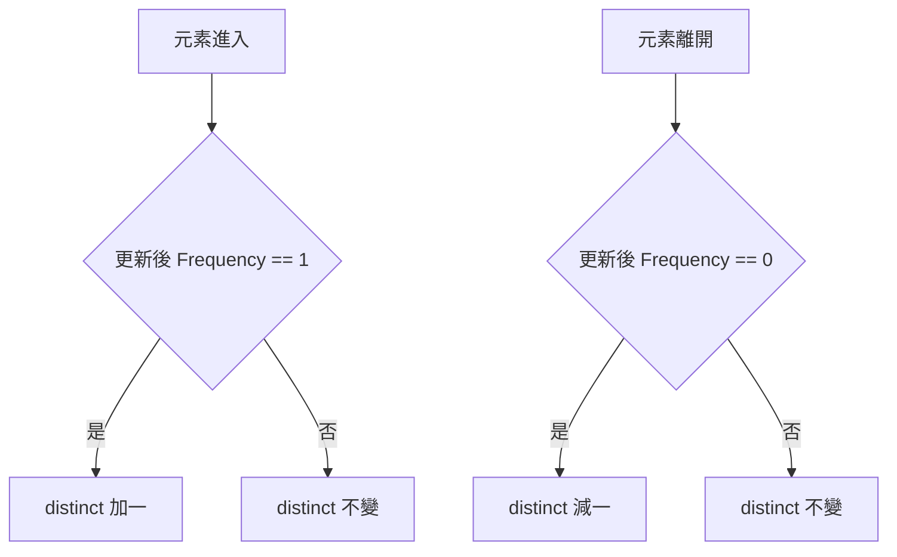

#### 不符合條件的元素數量

有些題目允許窗口內最多出現 `k` 個不符合條件的元素。此時可以只維護 Invalid Count，不必保存完整窗口內容。

#### Maximum / Minimum

若 State 只保存單一 Maximum，當最大元素離開窗口時，無法由剩餘資訊得知新的 Maximum。常見選擇包括：

- Monotonic Deque：維護可能成為最大值的候選，整體可達 O(n)。
- Multiset：加入與移除通常為 O(log n)。
- Heap 搭配 Lazy Deletion：依介面需求管理過期元素。

資料結構的角色是讓 State 能正確支援 Enter、Leave 與 Query，不是額外裝飾。

### 13.11 含負數時為何普通 Sum Window 可能失效

考慮「Sum 至少為 Target 的最短區間」。若輸入含負數：

- Expand 可能讓 Sum 降低。
- Shrink 移除負數可能讓 Sum提高。

因此，以下推理不再可靠：

```text
目前不合法，只能等待 right 擴張
目前合法，可以依 Sum 大小安全地持續 Shrink
```

例如：

```text
nums = [3, -2, 5]
target = 5
```

掃到 `right = 0` 時窗口 `[3]` 不合法。如果只等待 Expand：

- 加入 `-2` 後 Sum 變成 1。
- 再加入 `5` 後 Sum 變成 6。

此時移除左端 `3`，Sum 變成 3，窗口不合法，普通流程會停止。但若再移除 `-2`，Sum 反而變成 5，可得到合法且更短的 `[5]`。這表示「不合法時停止 Shrink」不再安全。

這類問題可能需要：

- Prefix Sum。
- Monotonic Deque。
- Balanced Tree。
- Hash Map。
- 依題目限制另行推導的方法。

含負數不代表所有 Sliding Window 都失效：

- 固定長度窗口仍可使用，因為邊界由長度決定。
- Frequency 或 Distinct 條件不一定受數值正負影響。
- 失效的是依賴 Sum 單調性的特定可變窗口推理。

### 13.12 Sliding Window 與其他方法

#### Sliding Window 與 Two Pointers

Sliding Window 是同方向 Two Pointers 的常見子類，但它特別維護連續區間的 State 與 Validity。

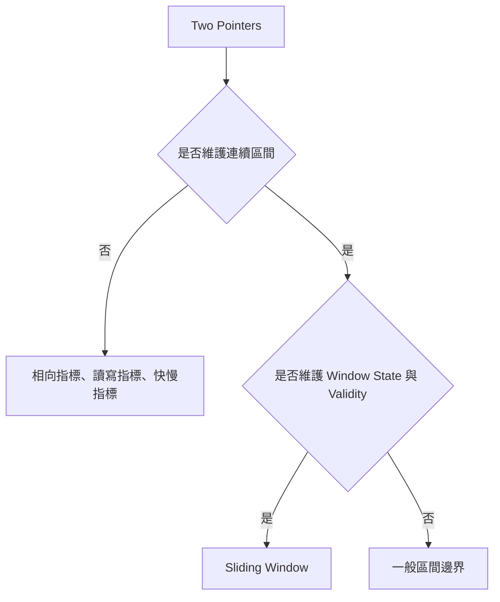

一般 Two Pointers 常著重候選排除、原地整理或兩序列同步走訪；Sliding Window 則著重：

- 区間內容。
- Enter 與 Leave。
- Validity。
- Expand 與 Shrink。

#### Sliding Window 與 Prefix Sum

- Sliding Window 適合相鄰窗口可增量更新，而且邊界具有可前進規則的情況。
- Prefix Sum 適合大量區間 Sum 查詢，或搭配 Hash Map 處理任意前綴關係。
- 含負數的最短 Sum 至少 Target，常需要 Prefix Sum 加 Monotonic Deque，而不是普通 Sum Window。

#### Sliding Window 與 Binary Search

若能判斷「是否存在長度為 `k` 的合法窗口」，且這個 Predicate 對 `k` 具有單調性，可以考慮 Binary Search on Answer。此時 Sliding Window 可能只負責驗證固定長度 `k` 是否可行。

### 13.13 複雜度與終止性

可變窗口常包含巢狀 `while`：

```cpp
for (int right = 0; right < n; ++right) {
    enter(data[right]);

    while (needShrink()) {
        leave(data[left]);
        ++left;
    }
}
```

不能只看到巢狀結構就判斷 O(n²)。

- `right` 從 0 移到 `n - 1`，共前進 `n` 次。
- `left` 只向右，最多也前進 `n` 次。
- 每個元素最多進入窗口一次、離開窗口一次。

若 Enter、Leave 與 Validity Query 都是 O(1)，總時間通常為 O(n)。

若使用 Multiset 等 O(log n) 結構，總時間可能是 O(n log n)。若每次 Shrink 都重新掃描窗口，則不能再用「每個元素進出一次」直接推出 O(n)。

終止性來自：

1. 外層 `right` 有限次前進。
2. 每次 Shrink 都讓 `left` 嚴格增加。
3. `left` 不會向後移動。

### 13.14 系統化 Debug

不要只看最後答案。應尋找第一個 Window State 與實際區間不一致的位置。

#### 每輪記錄欄位

```text
right
entering value
left before shrink
state after enter
validity after enter
每次 leaving value
state after leave
left after shrink
answer update timing
```

#### 排查流程

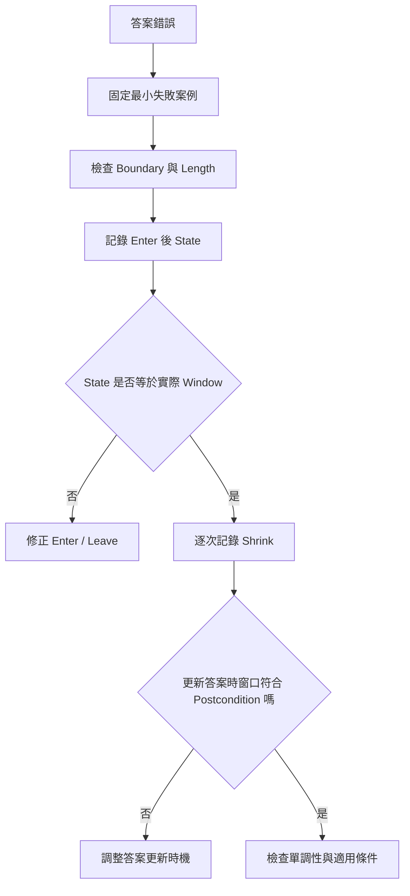

#### 最小測試

- 空輸入。
- 單一元素。
- `k = 1`。
- `k = n`。
- `k <= 0` 或 `k > n`。
- 全部元素相同。
- 答案位於最左端或最右端。
- 一次 Expand 後需要 Shrink 多次。
- Shrink 一次就恢復合法。
- 全部負數的固定長度窗口。
- 含負數而破壞 Sum 單調性的可變窗口。
- 字串含非 ASCII UTF-8 資料。

### 13.15 C 語言中的固定長度 Window

C 沒有 `std::optional`，可以使用 `bool` 表示是否成功，再透過輸出參數回傳結果。

```c
#include <stdbool.h>
#include <stddef.h>

bool maximum_window_sum(
    const int values[],
    size_t length,
    size_t k,
    long long *result) {

    if (values == NULL ||
        result == NULL ||
        k == 0 ||
        k > length) {
        return false;
    }

    long long current_sum = 0;

    for (size_t i = 0; i < k; ++i) {
        current_sum += values[i];
    }

    long long answer = current_sum;

    for (size_t right = k; right < length; ++right) {
        current_sum += values[right];
        current_sum -= values[right - k];

        if (current_sum > answer) {
            answer = current_sum;
        }
    }

    *result = answer;
    return true;
}
```

介面約定：

- `values` 與 `result` 不可為 `NULL`。
- `k` 必須介於 1 與 `length` 之間。
- 成功時才會寫入 `*result`。

若 Frequency Window 按任意 Byte 處理，可以使用長度 256 的 Array，並把資料轉成 `unsigned char` 後再作為 Index。

### 13.16 Sliding Window 分析表

| 欄位 | 要回答的問題 |
|---|---|
| Candidate | 答案是否必須是連續 Subarray 或 Substring？ |
| Boundary | 使用 `[left, right]` 還是 `[left, right)`？ |
| Length | 正確長度公式是什麼？ |
| State | 保存 Sum、Frequency、Distinct 還是其他資訊？ |
| Enter | `right` 加入時如何更新 State？ |
| Leave | `left` 離開時如何撤銷 State？ |
| Validity | 何時合法、非法或滿足要求？ |
| Expand | `right` 在什麼時候前進？ |
| Shrink | 什麼條件下移動 `left`？ |
| Monotonicity | 為什麼 `left` 不需要回頭？ |
| Answer | 在 Expand 後、Shrink 前、Shrink 內還是 Shrink 後更新？ |
| Goal | 固定長度、最長合法或最短滿足？ |
| Empty | 空窗口與空輸入如何定義？ |
| Numeric Type | Sum、Count 或乘積是否可能 Overflow？ |
| Text Unit | String 按 Byte、Code Point 還是 Grapheme 處理？ |
| Complexity | 每個元素進入與離開幾次？每次更新成本是多少？ |

### 13.17 常見問題與判讀

| 現象 | 可能原因 | 第一輪檢查 |
|---|---|---|
| 結果差一 | Window Length 公式錯誤 | Inclusive 是否需要 `+1` |
| 固定窗口少算第一組 | 初始化後未記錄答案 | 第一個完整窗口是否已處理 |
| State 愈來愈不準 | Shrink 時未撤銷元素 | Leave 是否更新 Frequency 或 Sum |
| 已合法仍持續收縮 | Validity 或 `while` 條件相反 | 寫出完整布林條件 |
| 求最長卻記錄非法窗口 | 在恢復合法前更新答案 | 先 Shrink 到合法，再更新 |
| 求最短卻錯過更短窗口 | 只在 `while` 外更新 | 滿足時在 `while` 內先更新 |
| 含負數時漏解 | Sum 不再具有需要的單調性 | 檢查是否需 Prefix Sum 或其他方法 |
| 最大值離開後 State 錯誤 | 只保存單一 Maximum | 使用 Monotonic Deque 或 Multiset |
| 重複字元一直存在 | Leave 時 Frequency 未減少 | State 是否等於實際窗口 |
| 非 ASCII 字串長度異常 | 按 Byte 處理 UTF-8 | 確認題目要求的文字單位 |
| 複雜度誤判為 O(n²) | 只看巢狀 `while` | 計算 `left`、`right` 總移動次數 |
| `while` 無法結束 | Shrink 分支未讓 `left` 前進 | 每輪是否嚴格縮小窗口 |
| `target <= 0` 行為不一致 | 未定義空區間與非空限制 | 將 Precondition 寫入規格 |
| 使用 `char` 當 Frequency Index 越界 | `char` 可能為 signed | 先轉成 `unsigned char` |

### 13.18 本章檢查表

- 我知道 Sliding Window 維護的是連續區間。
- 我能明確定義 Inclusive 或 Half-open Window。
- 我能寫出正確的 Window Length 公式。
- 我能說明 Window State 保存什麼。
- 我知道元素進入與離開時如何更新 State。
- 我能定義窗口的 Validity 或滿足條件。
- 我能說明 `left` 移動後為何不需回頭。
- 我知道固定長度 Window 不依賴 Sum 的正負單調性。
- 我能處理 `k <= 0`、`k > n`、`k = 1` 與 `k = n`。
- 我能說明最長合法窗口應在恢復合法後更新。
- 我能說明最短滿足窗口應在 `while` 內先更新。
- 我知道正數與非負數對 Sum 單調性的差異。
- 我知道含負數時，普通可變長度 Sum Window 可能漏解。
- 我能為無重複 Byte Substring 維護 Frequency。
- 我會在元素離開窗口時撤銷 State。
- 我知道 `std::string` 版本可能只按 Byte 處理。
- 我知道 `char` 作為 Array Index 前可能需要轉成 `unsigned char`。
- 我能判斷單一 Maximum 是否能在元素離開時直接更新。
- 我能區分 Sliding Window、一般 Two Pointers 與 Prefix Sum。
- 我能用兩個邊界的總移動次數分析複雜度。
- 我會逐輪記錄第一個錯誤 Window State。

### 13.19 本章重點

- Sliding Window 是維護連續區間 State 的同方向 Two Pointers 模型。
- 完整解法需要 Boundary、State、Enter / Leave、Validity 與 Answer Timing。
- Inclusive Window 長度為 `right - left + 1`，Half-open Window 長度為 `right - left`。
- 固定長度窗口由長度決定邊界移動，不依賴 Sum 單調性。
- Window State 必須支援元素進入與離開時的正確更新。
- 最長合法窗口通常先 Shrink 到合法，再更新最大長度。
- 最短滿足窗口通常在條件成立時先更新，再繼續 Shrink。
- 方法成立的關鍵不是模板外形，而是 `left` 不需回頭的證明。
- 正數與非負數可為某些 Sum Window 提供所需單調性，但敘述中的嚴格性不同。
- 含負數時，加入元素可能降低 Sum，移除元素可能提高 Sum，普通可變 Sum Window 可能漏解。
- Frequency Window 必須在元素離開時撤銷 State。
- Byte、Code Point 與 Grapheme 是不同的文字計數單位。
- 當 Maximum 離開後無法由單一數值更新時，需要 Monotonic Deque 等資料結構。
- 若兩個邊界都只向前，而且每次 State 更新為 O(1)，總時間通常為 O(n)。
- Debug 時應同步記錄 Boundary、State、Validity、Enter、Leave 與答案更新位置。
