## 第 13 章　Sliding Window

### 適用範圍

本章介紹 Sliding Window 的核心模型，以及固定長度、可變長度、Expand、Shrink、Window State、Validity、答案更新時機與單調性限制。

Sliding Window 通常使用同方向的 Left 與 Right 維護一段連續區間。它能把「每個區間都重新計算」改成「元素進入時加入、離開時撤銷」，但不是所有連續區間題都能套用。

真正需要確認的是：

- Window 使用 `[left, right]` 還是 `[left, right)`。
- Window State 保存 Sum、Frequency、不同值數量，還是其他資訊。
- 元素進入與離開時，State 如何增量更新。
- 什麼條件表示 Window 合法或已滿足要求。
- Right 擴張後，何時需要移動 Left。
- 求最長、最短或固定長度答案時，更新答案的位置為何不同。
- 什麼單調性保證 Left 不需回頭。
- 含負數、Unicode 或不可逆 State 時，方法是否仍成立。

本章會建立一套固定流程：

1. 定義 Window 邊界與長度公式。
2. 定義 Window State。
3. 寫出元素進入與離開時的更新方式。
4. 定義 Validity 或滿足條件。
5. 決定何時 Expand、何時 Shrink。
6. 決定答案在 Shrink 前、Shrink 後，還是每次固定窗口形成時更新。
7. 證明 Left 只向前移動仍不會漏掉答案。
8. 使用空輸入、`k = 1`、整段答案、重複值與負數案例測試。

### 適用讀者

- 會背 Sliding Window 模板，但不清楚 Left 為何移動的讀者。
- 容易混淆 Inclusive 與 Half-open Window 的讀者。
- 容易忘記元素離開時撤銷 Frequency 或 Sum 的讀者。
- 求最長與最短區間時，答案更新位置經常錯誤的讀者。
- 看到連續區間就直接套 Sliding Window 的讀者。
- 不清楚正數、非負數與含負數對 Sum Window 有何影響的讀者。
- 需要處理固定長度 Sum、最短滿足條件區間與最長無重複字串的讀者。
- 想理解 Sliding Window 和一般 Two Pointers 差異的讀者。

### 快速導覽

- [Sliding Window 到底是什麼](#131-sliding-window-到底是什麼)
- [四個必要組件](#132-四個必要組件)
- [Window 邊界與長度](#133-window-邊界與長度)
- [固定長度 Window](#134-固定長度-window)
- [完整案例：固定長度最大總和](#135-完整案例固定長度最大總和)
- [可變長度 Window](#136-可變長度-window)
- [完整案例：Sum 至少 Target 的最短區間](#137-完整案例sum-至少-target-的最短區間)
- [最長合法與最短滿足條件](#138-最長合法與最短滿足條件)
- [完整案例：最長無重複 Substring](#139-完整案例最長無重複-substring)
- [Frequency、Distinct Count 與其他 State](#1310-frequencydistinct-count-與其他-state)
- [含負數時為何可能失效](#1311-含負數時為何可能失效)
- [Sliding Window 與 Two Pointers](#1312-sliding-window-與-two-pointers)
- [複雜度與終止性](#1313-複雜度與終止性)
- [系統化 Debug Window](#1314-系統化-debug-window)
- [C 語言中的 Sliding Window](#1315-c-語言中的-sliding-window)
- [建立自己的 Sliding Window 分析表](#1316-建立自己的-sliding-window-分析表)
- [常見問題與判讀](#1317-常見問題與判讀)
- [本章檢查表](#1318-本章檢查表)
- [本章重點](#1319-本章重點)

### 13.1 Sliding Window 到底是什麼

Sliding Window 使用兩個邊界表示一段連續資料，並隨輸入向右移動。


Window 的主要價值是共用相鄰區間的大部分內容。從 `[left, right)` 移到下一個區間時，不必重新掃描全部元素，只需處理：

- 哪個元素進入。
- 哪個元素離開。
- State 如何改變。

例如固定長度 Sum：

```text
舊 Sum
- 離開的左端元素
+ 新加入的右端元素
= 新 Sum
```

Sliding Window 的候選通常是連續 Subarray 或 Substring。若題目允許跳過元素，它較可能是 Subsequence、Subset 或其他模型。

### 13.2 四個必要組件

每個 Sliding Window 解法至少應定義四項內容。

#### Boundary

Window 的 Left 與 Right 各指向哪裡？本文主要使用：

```text
[left, right]
```

作為程式迴圈中的目前窗口，長度為：

```text
right - left + 1
```

也可使用 `[left, right)`，但整段推理必須一致。

#### State

Window 內需要保存什麼資訊，例如：

- Sum。
- 每個 Byte 的 Frequency。
- 不同 Value 數量。
- 不符合條件的元素數量。
- 目前最大值候選 Deque。

#### Validity

什麼條件代表 Window 合法或已滿足要求？

- 無重複字元：每個 Frequency 不超過 1。
- 最多 k 種不同值：`distinct <= k`。
- Sum 至少 Target：`sum >= target`。
- 固定長度：`right - left + 1 == k`。

#### 答案更新時機

- 固定長度：Window 形成時更新。
- 最長合法：先 Shrink 到合法，再更新最大長度。
- 最短滿足條件：條件成立時，在 `while` 內先更新，再繼續 Shrink。

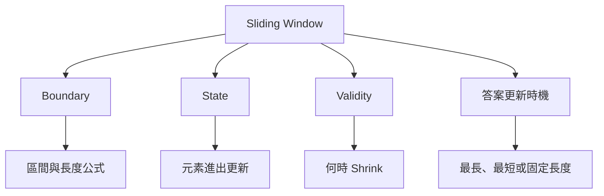

缺少任何一項，只記憶迴圈模板都容易產生錯誤。

### 13.3 Window 邊界與長度

#### Inclusive Window

```text
[left, right]
length = right - left + 1
```

當 Right 是當前新加入的元素時，這種寫法常見於 `for` 迴圈。

#### Half-open Window

```text
[left, right)
length = right - left
```

Right 指向下一個尚未加入的位置，適合和 C++ Iterator 或一般區間語意配合。

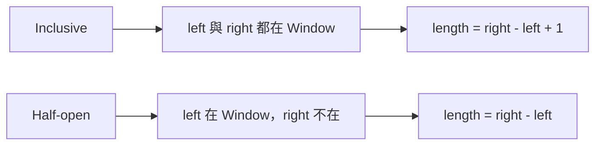

常見 Off-by-one 問題不是公式本身，而是文字、迴圈和答案更新混用了不同區間表示。

#### 空 Window

Half-open Window 可自然用 `[x, x)` 表示空區間。Inclusive Window 通常用 `left > right` 表示尚未形成窗口。

### 13.4 固定長度 Window

固定長度 Window 的 Left 可由 Right 推導：

```text
left = right - k + 1
```

或在 Half-open 表示中：

```text
left = right - k
```

處理流程通常是：

1. 加入新元素。
2. 若長度超過 k，移除最左元素。
3. 當長度等於 k 時更新答案。

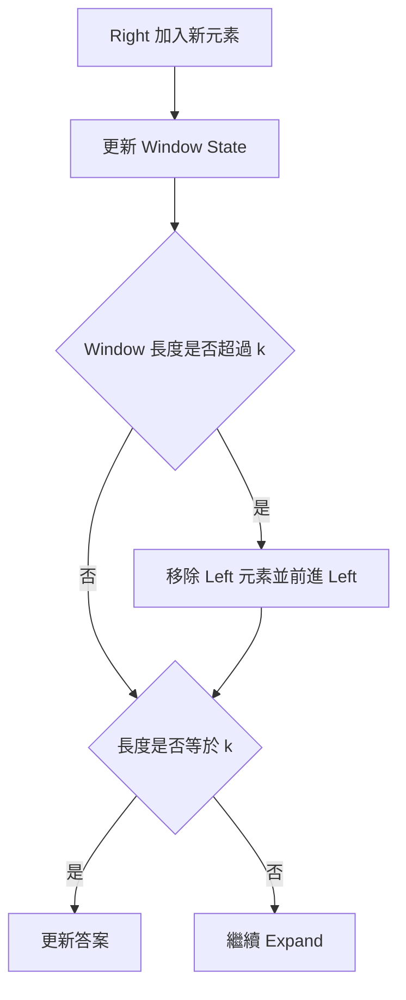

固定長度不需要利用 Sum 的正負單調性。因為 Left 何時移動完全由窗口長度決定。

### 13.5 完整案例：固定長度最大總和

#### 問題規格

給定整數 Array 與 `k`，找出所有長度恰好為 k 的連續區間中，最大的 Sum。若 k 不合法，回傳空結果。

#### C++ 解法

```cpp
#include <algorithm>
#include <optional>
#include <vector>

std::optional<long long> maximumWindowSum(
    const std::vector<int>& nums,
    int k)
{
    if (k <= 0 ||
        k > static_cast<int>(nums.size()))
    {
        return std::nullopt;
    }

    long long current = 0;

    for (int i = 0; i < k; ++i)
    {
        current += nums[i];
    }

    long long answer = current;

    for (int right = k;
         right < static_cast<int>(nums.size());
         ++right)
    {
        current += nums[right];
        current -= nums[right - k];
        answer = std::max(answer, current);
    }

    return answer;
}
```

#### State 語意

在第二個迴圈每輪更新完成後：

> `current` 等於 `[right - k + 1, right]` 的 Sum。

#### 為什麼先加再減仍正確

本輪加入 `nums[right]`，並移除前一個窗口最左方的 `nums[right - k]`。兩次更新後，State 正好對應新的長度 k Window。

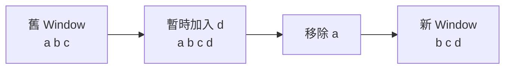

#### 邊界案例

| 輸入條件 | 結果 |
|---|---|
| `k <= 0` | 無效 |
| `k > n` | 無效 |
| `k == 1` | 最大單一元素 |
| `k == n` | 整個 Array Sum |
| 全部負數 | 仍應選最大的固定長度 Sum |

#### 複雜度

每個元素最多加入一次、移除一次：

- 時間複雜度：O(n)。
- 額外空間：O(1)。

### 13.6 可變長度 Window

可變長度 Window 通常由 Right 擴張，再依條件移動 Left。

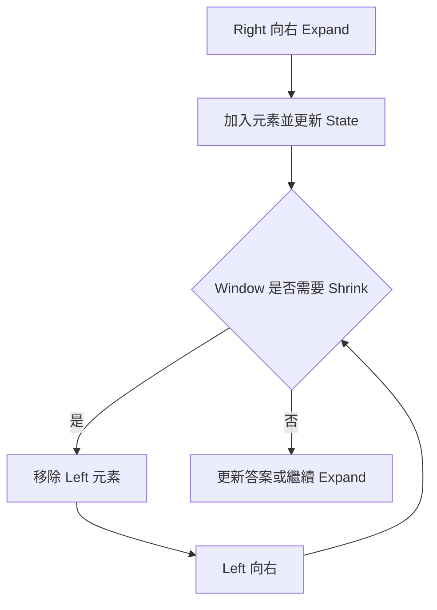

關鍵問題不是「何時進入 while」，而是：

> 為什麼移動 Left 後，不需要在未來把它移回來？

這通常依賴 Validity 對 Expand 或 Shrink 的單調性。

### 13.7 完整案例：Sum 至少 Target 的最短區間

#### 問題規格

給定全部為正整數的 Array，找出 Sum 至少為 Target 的最短非空連續區間長度。若不存在，回傳 0。

#### Precondition

- 所有元素皆為正數。
- Target 的語意與空區間規格已確認。本文只考慮非空區間。

#### C++ 解法

```cpp
#include <algorithm>
#include <vector>

int minimumLengthAtLeastTarget(
    const std::vector<int>& nums,
    long long target)
{
    int left = 0;
    int answer = static_cast<int>(nums.size()) + 1;
    long long sum = 0;

    for (int right = 0;
         right < static_cast<int>(nums.size());
         ++right)
    {
        sum += nums[right];

        while (sum >= target)
        {
            answer = std::min(
                answer,
                right - left + 1);

            sum -= nums[left];
            ++left;
        }
    }

    if (answer == static_cast<int>(nums.size()) + 1)
    {
        return 0;
    }

    return answer;
}
```

#### Window State

```text
sum = nums[left] + ... + nums[right]
```

#### 為什麼條件成立時持續 Shrink

題目要求最短區間。當 `sum >= target`，目前 Window 已是候選答案，但可能還能移除左端後繼續滿足條件，因此需要：

1. 先記錄目前長度。
2. 移除左端。
3. 繼續檢查更短 Window。

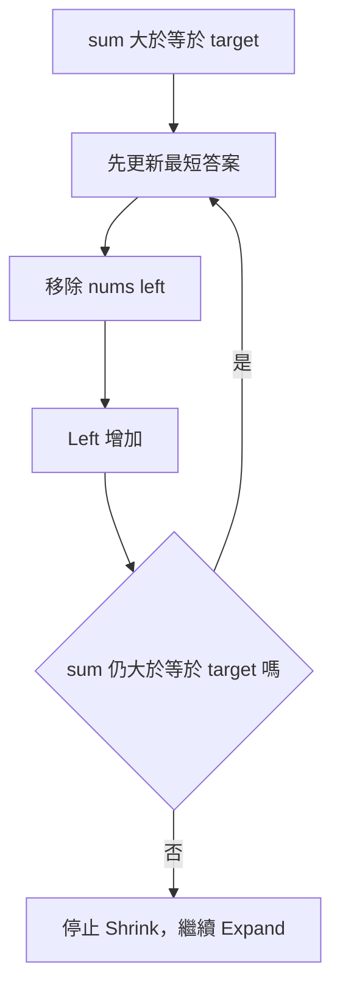

#### 正數條件提供的單調性

- Expand 加入正數，Sum 只會增加。
- Shrink 移除正數，Sum 只會減少。

當 Window 已不滿足 Target 時，繼續 Shrink 只會讓 Sum 更小，因此應停止並等待 Right Expand。

#### Loop Invariant

每次外層迴圈結束後：

1. `sum` 正確表示目前 `[left, right]`。
2. 目前 Window 不滿足 `sum >= target`。
3. 所有右端不大於 `right` 的滿足條件 Window，都已在 Shrink 過程中被考慮。
4. `answer` 是目前已看過合法 Window 的最短長度。

#### 逐輪案例

```text
nums = [2, 3, 1, 2, 4, 3]
target = 7
```

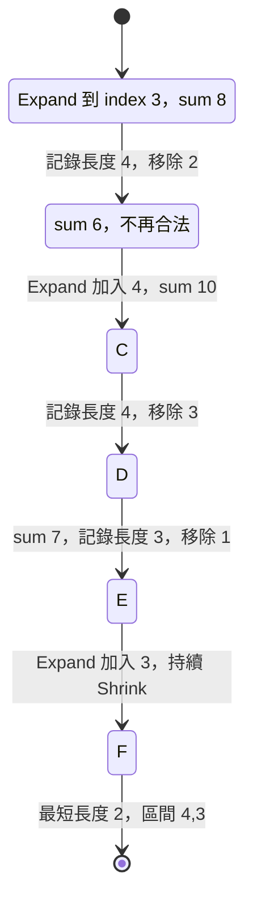

### 13.8 最長合法與最短滿足條件

這兩類問題的更新時機不同。

#### 最長合法 Window

目標：保持 Window 合法並最大化長度。

典型順序：

1. Expand。
2. 若不合法，持續 Shrink。
3. 恢復合法後，更新最大長度。

#### 最短滿足條件 Window

目標：Window 滿足要求時盡量縮短。

典型順序：

1. Expand。
2. 條件成立時，先更新最短長度。
3. 持續 Shrink，直到不再滿足。

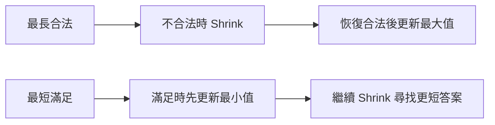

不能只記憶「答案寫在 while 內或外」。應從目前 Window 在哪個時間點符合 Postcondition 推導。

### 13.9 完整案例：最長無重複 Substring

#### 問題規格

找出沒有重複 Byte 的最長連續 Substring 長度。

本案例按 Byte 處理，不是完整 Unicode Grapheme Cluster 解法。

#### C++ 解法

```cpp
#include <algorithm>
#include <array>
#include <string_view>

int longestUniqueSubstring(std::string_view text)
{
    std::array<int, 256> frequency{};
    int left = 0;
    int answer = 0;

    for (int right = 0;
         right < static_cast<int>(text.size());
         ++right)
    {
        const unsigned char entering =
            static_cast<unsigned char>(text[right]);
        ++frequency[entering];

        while (frequency[entering] > 1)
        {
            const unsigned char leaving =
                static_cast<unsigned char>(text[left]);
            --frequency[leaving];
            ++left;
        }

        answer = std::max(
            answer,
            right - left + 1);
    }

    return answer;
}
```

#### Validity

Window 合法條件：

```text
每個 Byte 的 Frequency <= 1
```

加入新 Byte 前，舊 Window 已合法，因此若加入後出現重複，造成問題的只可能是新加入的 Byte。可以檢查 `frequency[entering] > 1`。

#### Loop Invariant

每次更新答案前：

1. Frequency 完整描述 `[left, right]`。
2. Window 沒有重複 Byte。
3. 對目前 Right，Left 是收縮後可形成合法 Window 的位置。
4. `answer` 保存先前合法 Window 的最大長度。

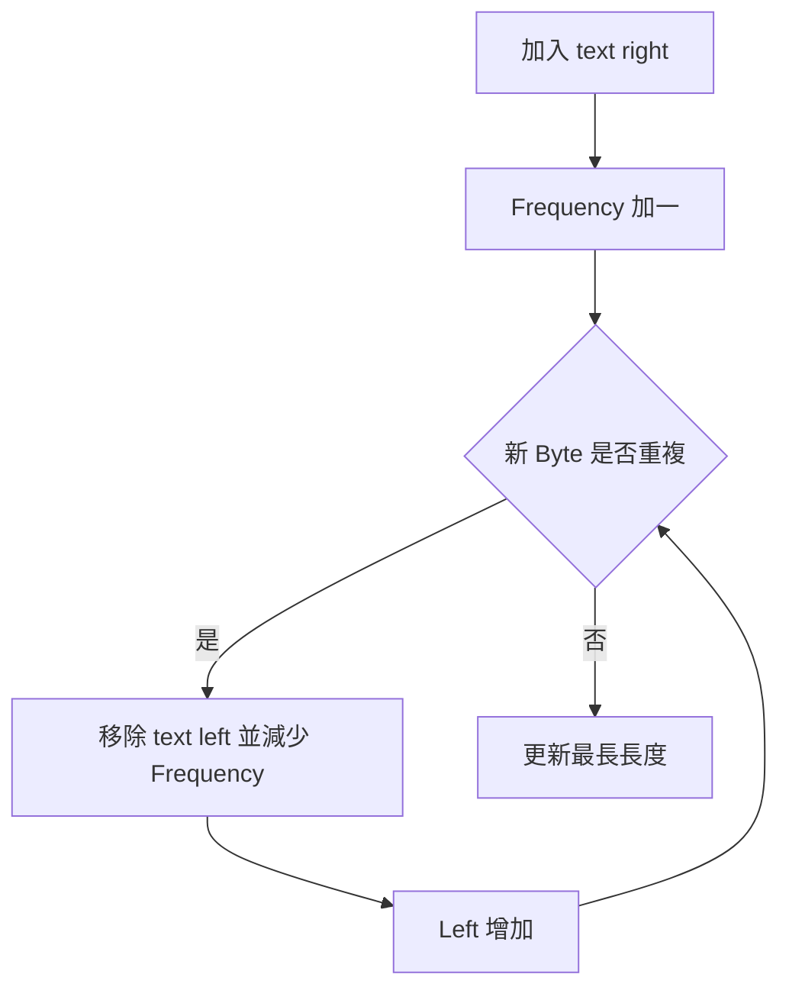

#### 為什麼元素離開時必須撤銷 State

若只增加 Frequency，卻未在 Left 前進時減少，State 會包含已離開 Window 的 Byte，導致後續 Window 被錯誤判定不合法。

#### Unicode 限制

`std::string` 是 Byte 序列。UTF-8 的一個可見字元可能由多個 Bytes 組成，因此此版本計算的是無重複 Byte Substring。若需求是 Unicode Code Point 或可見字形，需要先使用適合的 Unicode 分段方式。

### 13.10 Frequency、Distinct Count 與其他 State

Window State 應支援元素進出時可靠更新。

#### Frequency

```cpp
++frequency[entering];
--frequency[leaving];
```

#### Distinct Count

加入前 Frequency 為 0，加入後不同值數增加：

```cpp
if (++frequency[value] == 1)
{
    ++distinct;
}
```

移除後 Frequency 變 0，不同值數減少：

```cpp
if (--frequency[value] == 0)
{
    --distinct;
}
```

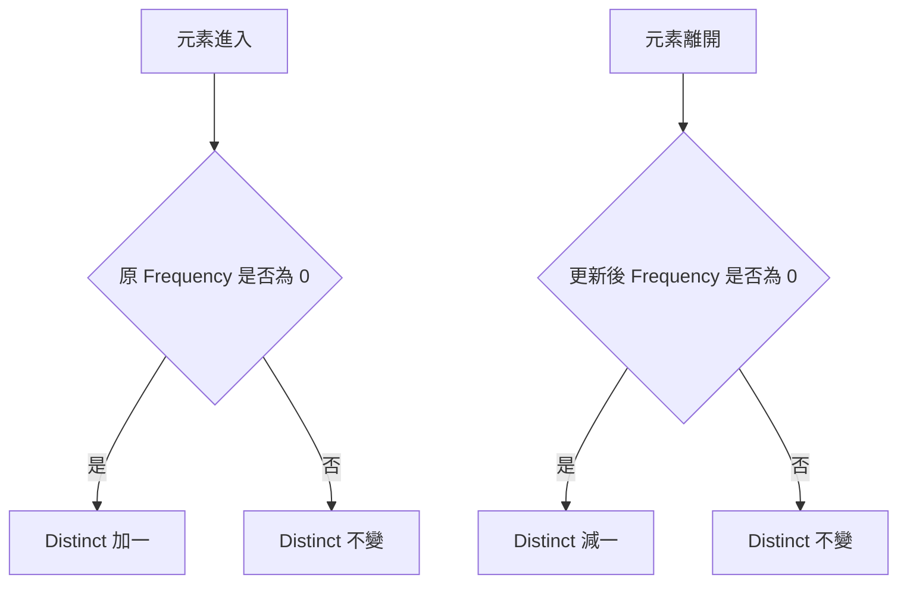

#### 不易撤銷的 State

Sum 與 Frequency 容易增量更新。一般最大值若只保存單一數值，最大元素離開時無法知道下一個最大值，通常需要 Monotonic Deque、Multiset 或其他結構。

資料結構不是額外裝飾，而是為了讓 State 支援元素加入與離開。

### 13.11 含負數時為何可能失效

考慮最短 Sum 至少 Target。若含負數：

- Expand 可能讓 Sum 下降。
- Shrink 移除負數可能讓 Sum 上升。

因此「不合法時只能等 Right 擴張」與「合法時可安全持續 Shrink」的單調推理可能失效。

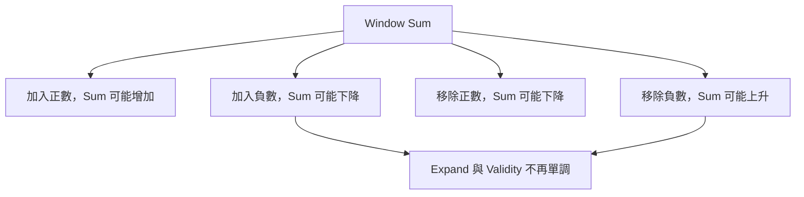

例如：

```text
nums = [2, -1, 2]
target = 3
```

不能只根據當前 Sum 的大小決定所有後續 Left 移動。

這類問題可能需要：

- Prefix Sum。
- Monotonic Deque。
- Balanced Tree。
- Hash Map。
- 其他依限制條件推導的方法。

含負數不代表所有 Sliding Window 都失效。固定長度 Window 仍可正常更新，因為 Left 移動由長度決定，而不是 Sum 單調性。

### 13.12 Sliding Window 與 Two Pointers

Sliding Window 是同方向 Two Pointers 的一類，但額外維護連續區間 State。

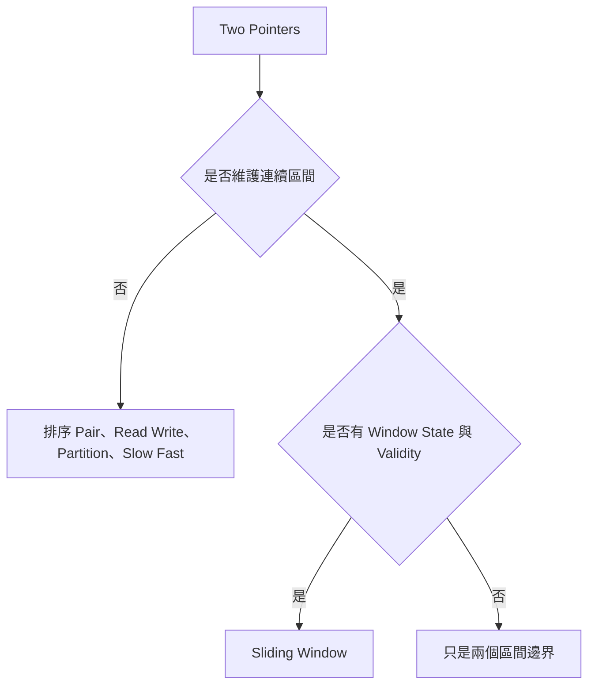

一般 Two Pointers 關注候選排除或區域整理；Sliding Window 關注：

- 區間內容。
- 元素進出。
- Validity。
- Expand 與 Shrink。

### 13.13 複雜度與終止性

可變 Window 常有巢狀 `while`：

```cpp
for (right = 0; right < n; ++right)
{
    while (needShrink())
    {
        ++left;
    }
}
```

不能只看巢狀語法判定 O(n²)。

- Right 從 0 到 n - 1，共移動 n 次。
- Left 只向右，最多也移動 n 次。

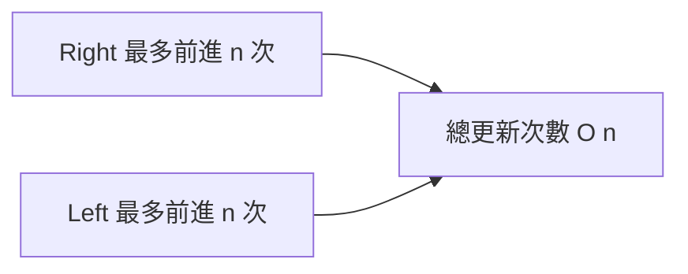

每個元素最多：

- 進入 Window 一次。
- 離開 Window 一次。

因此 State 更新若為 O(1)，總時間通常是 O(n)。若 State 更新使用 O(log n) 結構，總時間可能是 O(n log n)。

終止性來自 Right 有限次前進，而且 Shrink 時 Left 嚴格增加。

### 13.14 系統化 Debug Window

建議逐輪記錄：

```text
right
entering value
left before shrink
state after expand
validity
每次 leaving value
state after shrink
left after shrink
answer update
```

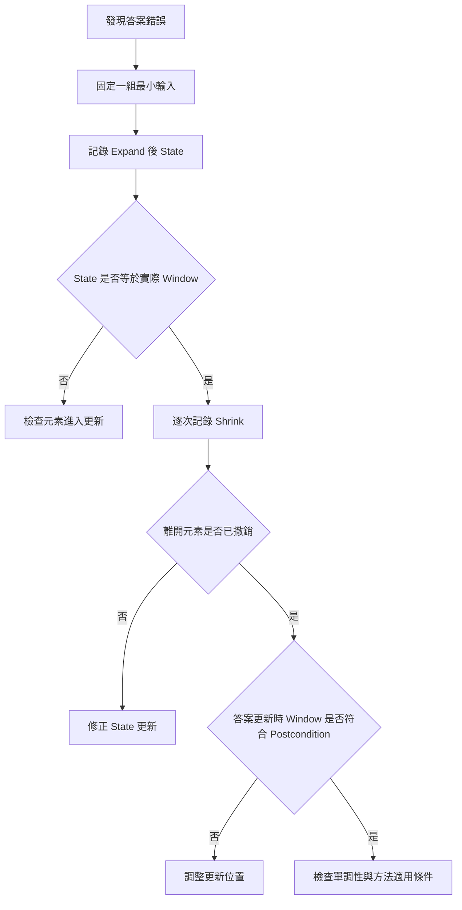

最小案例可優先使用：

- 空輸入。
- 單一元素。
- `k = 1`。
- `k = n`。
- 全部相同。
- 答案位於最左或最右。
- 一次需要 Shrink 多次。
- 加入負數後破壞原推理。

### 13.15 C 語言中的 Sliding Window

固定長度 Sum：

```c
#include <stdbool.h>
#include <stddef.h>

bool maximum_window_sum(
    const int values[],
    size_t length,
    size_t k,
    long long *result)
{
    if (values == NULL ||
        result == NULL ||
        k == 0 ||
        k > length)
    {
        return false;
    }

    long long current = 0;

    for (size_t i = 0; i < k; ++i)
    {
        current += values[i];
    }

    long long answer = current;

    for (size_t right = k; right < length; ++right)
    {
        current += values[right];
        current -= values[right - k];

        if (current > answer)
        {
            answer = current;
        }
    }

    *result = answer;
    return true;
}
```

C 版本需要另外傳入 Length 與輸出參數。Frequency Window 若處理任意 Byte，可使用長度 256 的 Array，並以 `unsigned char` 作為 Index。

### 13.16 建立自己的 Sliding Window 分析表

| 欄位 | 要回答的問題 |
|---|---|
| Window | 使用 `[left,right]` 還是 `[left,right)`？ |
| 長度 | 正確公式是什麼？ |
| 候選 | 是否必須為連續 Subarray 或 Substring？ |
| State | Sum、Frequency、Distinct 還是其他資訊？ |
| Enter | Right 加入時如何更新 State？ |
| Leave | Left 離開時如何撤銷 State？ |
| Validity | 何時合法、非法或滿足要求？ |
| Expand | Right 為何可以前進？ |
| Shrink | 什麼條件下移動 Left？ |
| 單調性 | 為什麼 Left 不需要回頭？ |
| 答案 | 在 Expand 後、Shrink 前、Shrink 內還是 Shrink 後更新？ |
| 目標 | 固定長度、最長合法或最短滿足？ |
| 型別 | Sum 與 Frequency 是否可能 Overflow？ |
| 編碼 | String 是按 Byte、Code Point 還是 Grapheme？ |
| 複雜度 | 每個元素進入與離開幾次？ |

### 13.17 常見問題與判讀

| 現象 | 可能原因 | 第一輪檢查 |
|---|---|---|
| 結果差一 | Window 長度公式錯誤 | Inclusive 是否需要 `+1` |
| 固定窗口少算第一組 | 初始化後未更新答案 | 第一個完整 Window 是否已記錄 |
| State 愈來愈錯 | Shrink 時未撤銷元素 | Leaving Value 是否更新 Frequency 或 Sum |
| Window 已合法仍持續收縮 | Validity 或 while 條件相反 | 寫出合法條件的完整布林式 |
| 求最長卻得到非法窗口 | 在恢復合法前更新答案 | 先 Shrink 到合法，再更新 |
| 求最短卻得到較長答案 | 只在 while 外更新 | 滿足時在 while 內先更新 |
| 含負數漏解 | Sum 不具單調性 | 改用 Prefix Sum 或其他方法 |
| 最大值離開後 State 錯誤 | 只保存單一 Maximum | 使用 Monotonic Deque 或其他結構 |
| 重複字元一直存在 | 離開時 Frequency 未減少 | State 是否等於實際 Window |
| Unicode 長度錯誤 | 按 Byte 處理 UTF-8 | 確認題目要求的文字單位 |
| 複雜度誤判 O(n²) | 只看巢狀 while | Left 與 Right 是否都只向前 |
| Left 無法終止 | Shrink 分支未移動 Left | 每輪是否嚴格前進 |

### 13.18 本章檢查表

- 我知道 Sliding Window 維護的是連續區間。
- 我能明確定義 Inclusive 或 Half-open Window。
- 我能寫出正確的 Window Length 公式。
- 我能說明 Window State 保存什麼。
- 我知道元素進入與離開時如何更新 State。
- 我能定義 Window 的 Validity 或滿足條件。
- 我能說明 Left 移動後為何不需回頭。
- 我知道固定長度 Window 不依賴 Sum 正負單調性。
- 我能正確處理 `k <= 0`、`k > n`、`k = 1` 與 `k = n`。
- 我能說明最長合法 Window 應在恢復合法後更新。
- 我能說明最短滿足條件 Window 應在 while 內先更新。
- 我知道正數條件為 Sum Window 提供什麼單調性。
- 我知道含負數時 Expand 與 Shrink 對 Sum 不再單調。
- 我能為無重複 Substring 維護 Frequency。
- 我會在 Byte 離開 Window 時降低 Frequency。
- 我知道 `std::string` 版本可能只按 Byte 處理。
- 我能判斷單一 Maximum 是否能在元素離開時直接更新。
- 我能區分 Sliding Window 與其他 Two Pointers。
- 我能用 Left、Right 的總移動次數說明 O(n)。
- 我會使用逐輪 Debug 表找出第一個錯誤 Window State。

### 13.19 本章重點

- Sliding Window 是維護連續區間 State 的同方向 Two Pointers。
- 一個完整 Window 解法需要 Boundary、State、Validity 與答案更新時機。
- Inclusive Window 長度為 `right - left + 1`，Half-open Window 長度為 `right - left`。
- 固定長度 Window 由長度決定 Left 移動，不依賴 Sum 單調性。
- State 應支援元素進入與離開時的增量更新。
- 最長合法 Window 通常先 Shrink 到合法，再更新最大長度。
- 最短滿足條件 Window 通常在條件成立時先更新，再繼續 Shrink。
- 正數或非負條件可能讓 Sum 對 Expand、Shrink 具有所需單調性。
- 含負數時，加入元素可能降低 Sum，移除元素可能提高 Sum，普通 Sum Window 可能漏解。
- Frequency Window 必須在元素離開時撤銷 State。
- 無重複字串的 Byte 版本不等於完整 Unicode 可見字形解法。
- 若最大值離開後無法由單一 State 得知新最大值，需要 Monotonic Deque 等資料結構。
- Left 與 Right 都只向前時，每個元素最多進入與離開一次，總時間通常為 O(n)。
- Debug 時應同步記錄 Boundary、State、Validity、Enter、Leave 與答案更新位置。
