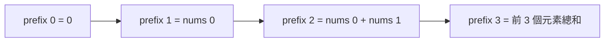
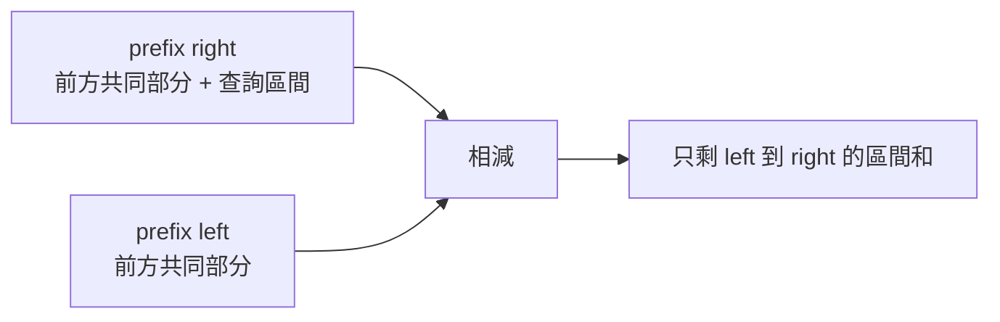
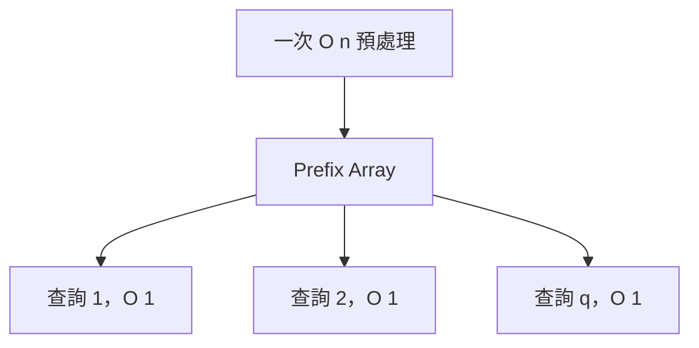
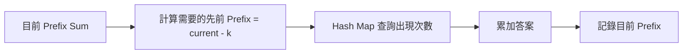
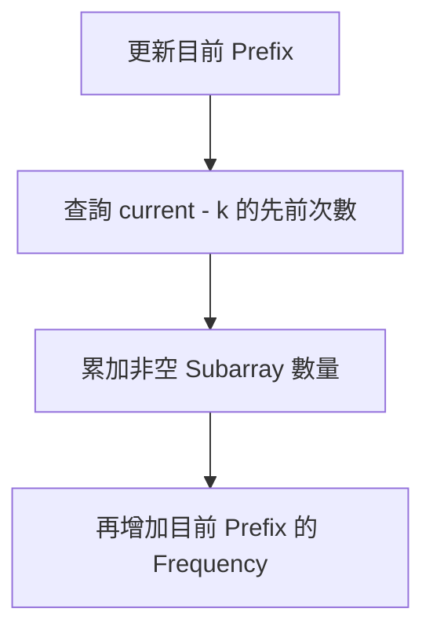
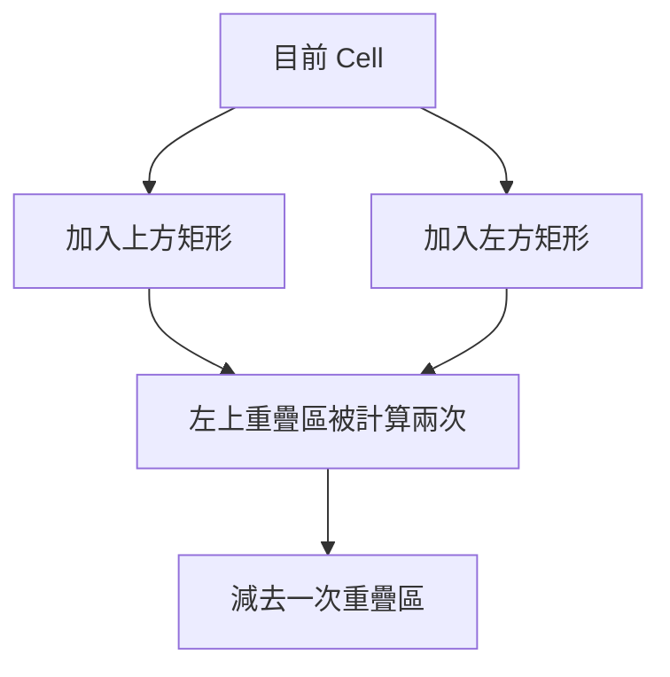
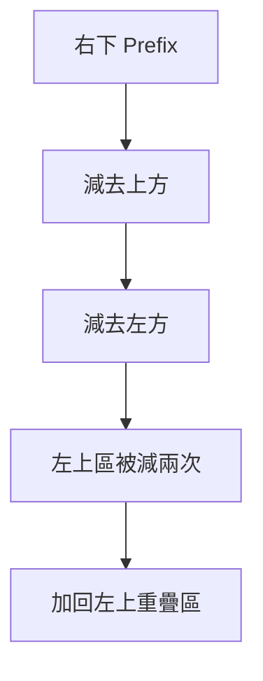
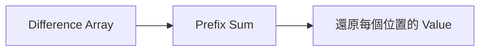
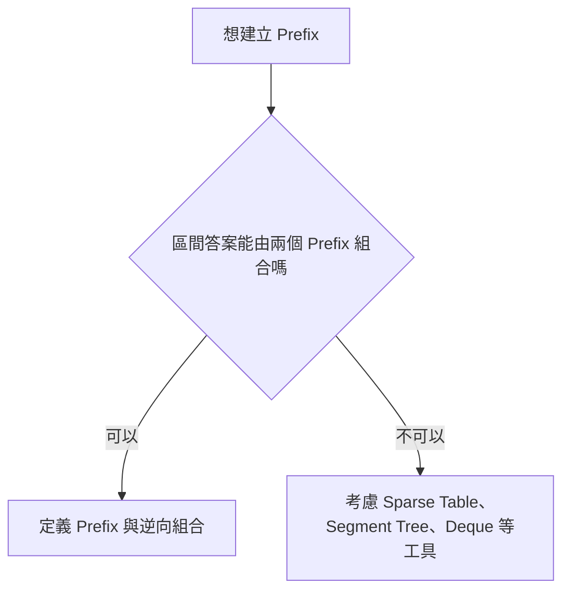
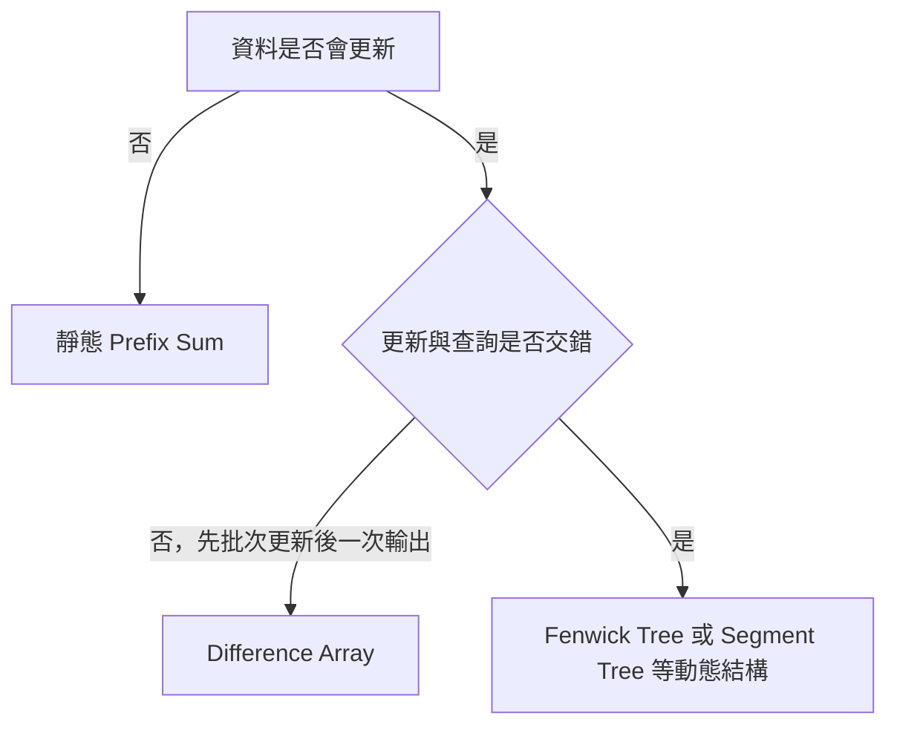

## 第 14 章　Prefix Sum 與 Difference Array

### 適用範圍

本章介紹一維與二維 Prefix Sum、區間查詢、Prefix Sum 搭配 Hash Table、Difference Array，以及靜態查詢與動態更新的差異。

Prefix Sum 的核心不是背誦 `prefix[right] - prefix[left]`，而是先定義 Prefix 代表的範圍，再利用兩個 Prefix 抵消不需要的部分。Difference Array 則從另一個方向處理問題，將多次區間更新記錄為邊界變化，最後一次還原完整結果。

本章會建立一套固定流程：

1. 定義 `prefix[i]` 的精確語意。
2. 統一使用 Half-open Interval `[left, right)`。
3. 從 Prefix 定義推導區間公式。
4. 分開計算預處理、單次查詢與總查詢成本。
5. 使用較寬型別保存累積值。
6. Prefix 搭配 Hash 時，定義 Map Key 與 Value。
7. 二維查詢使用 Inclusion-Exclusion，確認重複扣除區域。
8. Difference Array 明確定義更新區間是 Inclusive 還是 Half-open。
9. 若更新與查詢交錯，重新評估是否需要動態資料結構。

### 適用讀者

- 面對大量區間和查詢，仍逐段重新加總的讀者。
- 容易混淆 Inclusive 與 Half-open Interval 的讀者。
- 不理解為何 Prefix Array 通常比輸入多一格的讀者。
- Prefix Sum 搭配 Hash 時，容易弄錯查詢與插入順序的讀者。
- 二維 Prefix Sum 經常少加或多減一塊矩形的讀者。
- 需要處理大量區間加值的讀者。
- 使用靜態 Prefix 處理交錯更新與查詢，導致結果過期的讀者。

### 快速導覽

- [Prefix Sum 到底保存什麼](#141-prefix-sum-到底保存什麼)
- [第一步：定義 Prefix](#142-第一步定義-prefix)
- [完整案例：一維區間和](#143-完整案例一維區間和)
- [查詢成本與型別範圍](#144-查詢成本與型別範圍)
- [Prefix Sum 搭配 Hash](#145-prefix-sum-搭配-hash)
- [完整案例：Sum 等於 k 的 Subarray 數量](#146-完整案例sum-等於-k-的-subarray-數量)
- [二維 Prefix Sum](#147-二維-prefix-sum)
- [完整案例：矩形區域和](#148-完整案例矩形區域和)
- [Difference Array](#149-difference-array)
- [完整案例：批次區間加值](#1410-完整案例批次區間加值)
- [Prefix 的一般化與限制](#1411-prefix-的一般化與限制)
- [靜態與動態問題](#1412-靜態與動態問題)
- [C 語言中的 Prefix Sum](#1413-c-語言中的-prefix-sum)
- [建立自己的 Prefix 分析表](#1414-建立自己的-prefix-分析表)
- [常見問題與判讀](#1415-常見問題與判讀)
- [本章檢查表](#1416-本章檢查表)
- [本章重點](#1417-本章重點)

### 14.1 Prefix Sum 到底保存什麼

Prefix Sum 將原 Array 前方累積結果預先保存。

本文定義：

```text
prefix[i] = nums 的前 i 個元素總和
          = nums[0] + ... + nums[i - 1]
```

因此：

```text
prefix[0] = 0
prefix[i + 1] = prefix[i] + nums[i]
```



`prefix[i]` 的 Index 表示元素數量，不是原 Array 的最後一個 Index。這使 `[0, i)` 和 Prefix 定義自然一致。

### 14.2 第一步：定義 Prefix

#### C++ 建立方式

```cpp
#include <vector>

std::vector<long long> buildPrefixSum(
    const std::vector<int>& nums)
{
    std::vector<long long> prefix(nums.size() + 1, 0);

    for (std::size_t i = 0; i < nums.size(); ++i)
    {
        prefix[i + 1] = prefix[i] + nums[i];
    }

    return prefix;
}
```

#### Loop Invariant

每輪開始前：

> 對所有 `j <= i`，`prefix[j]` 等於 `nums[0, j)` 的總和。

本輪將 `nums[i]` 加到前 i 個元素總和，便得到前 `i + 1` 個元素總和。

#### 為何多一格

長度 n 的輸入建立長度 `n + 1` 的 Prefix：

- `prefix[0]` 表示空 Prefix。
- `prefix[n]` 表示整個 Array。
- 從 Index 0 開始的區間不需特殊分支。
- 空區間 `[x, x)` 的 Sum 自然為 0。

### 14.3 完整案例：一維區間和

#### 問題規格

多次查詢 Half-open Interval `[left, right)` 的 Sum。

#### Precondition

```text
0 <= left <= right <= nums.size()
```

#### 公式推導

`prefix[right]` 包含：

```text
nums[0, left) + nums[left, right)
```

`prefix[left]` 包含：

```text
nums[0, left)
```

兩者相減後，前方共同部分抵消：

```text
sum(left, right) = prefix[right] - prefix[left]
```



#### C++ 查詢

```cpp
long long rangeSum(
    const std::vector<long long>& prefix,
    std::size_t left,
    std::size_t right)
{
    return prefix[right] - prefix[left];
}
```

#### 範例

```text
nums   = [3, 1, 4, 2]
prefix = [0, 3, 4, 8, 10]
```

查詢 `[1, 4)`：

```text
prefix[4] - prefix[1] = 10 - 3 = 7
```

對應 `1 + 4 + 2`。

### 14.4 查詢成本與型別範圍

建立 Prefix 需要 O(n)，每次區間查詢為 O(1)。若有 q 次查詢：

```text
總時間 = O(n + q)
```

直接逐段加總最差可能是 O(nq)。



#### Overflow

即使每個元素是 `int`，累積 n 個元素後可能超過 `int`。型別選擇應根據：

```text
最大元素絕對值 × 最大元素數量
```

Prefix 的更新中，轉成較寬型別必須發生在可能 Overflow 的運算之前。

### 14.5 Prefix Sum 搭配 Hash

Prefix Sum 不只用於靜態查詢，也能將 Subarray 條件改寫成兩個 Prefix 的關係。

對 Subarray `[left, right)`：

```text
prefix[right] - prefix[left] = k
```

移項：

```text
prefix[left] = prefix[right] - k
```

當 Right 由左到右前進時，只需知道前方出現過多少次 `prefix[right] - k`。



Map State：

```text
Key   = 某個先前 Prefix Sum
Value = 該 Prefix Sum 在目前位置之前出現的次數
```

### 14.6 完整案例：Sum 等於 k 的 Subarray 數量

```cpp
#include <unordered_map>
#include <vector>

long long countSubarraysWithSum(
    const std::vector<int>& nums,
    long long k)
{
    std::unordered_map<long long, long long> frequency;
    frequency[0] = 1;

    long long prefix = 0;
    long long answer = 0;

    for (int value : nums)
    {
        prefix += value;

        if (auto it = frequency.find(prefix - k);
            it != frequency.end())
        {
            answer += it->second;
        }

        ++frequency[prefix];
    }

    return answer;
}
```

#### 為何 `frequency[0] = 1`

它代表元素開始前的空 Prefix。若從 Index 0 開始的 Subarray Sum 為 k，當前 `prefix - k == 0`，就能找到這個合法左邊界。

#### 為何先查再插

目前 Prefix 只能作為未來 Subarray 的左邊界。若先插入再查，在 `k == 0` 時可能把同一個 Prefix 和自己配對，誤計空長度區間。



#### Loop Invariant

每輪開始前：

- `prefix` 是已處理 Prefix 的 Sum。
- Map 保存所有可用左邊界 Prefix 的出現次數。
- `answer` 是完全位於已處理範圍內的合法 Subarray 數量。

此方法允許負數，因為它不依賴 Window Sum 的單調性。

### 14.7 二維 Prefix Sum

對 `rows × columns` Matrix，建立大小 `(rows + 1) × (columns + 1)` 的 Prefix。

定義：

```text
prefix[r][c] = 原矩陣 [0, r) × [0, c) 的總和
```

建立公式：

```text
prefix[r + 1][c + 1]
= value[r][c]
+ prefix[r][c + 1]
+ prefix[r + 1][c]
- prefix[r][c]
```

最後一項用來補回左上區域，因為它在上方與左方 Prefix 中被重複計算。



### 14.8 完整案例：矩形區域和

查詢 Half-open Rectangle：

```text
[top, bottom) × [left, right)
```

公式：

```text
prefix[bottom][right]
- prefix[top][right]
- prefix[bottom][left]
+ prefix[top][left]
```



#### C++ 查詢

```cpp
long long rectangleSum(
    const std::vector<std::vector<long long>>& prefix,
    int top,
    int left,
    int bottom,
    int right)
{
    return prefix[bottom][right]
         - prefix[top][right]
         - prefix[bottom][left]
         + prefix[top][left];
}
```

統一 Half-open Rectangle 可讓空矩形、從 Row 0 或 Column 0 開始的查詢不需額外分支。

### 14.9 Difference Array

Difference Array 保存相鄰值的變化，而不是每個位置的最終值。

對原 Array：

```text
diff[0] = values[0]
diff[i] = values[i] - values[i - 1]
```

對 Diff 做 Prefix Sum，可還原原 Array。



Difference Array 適合：

- 有大量區間加值。
- 所有更新完成後，再一次取得最終 Array。

### 14.10 完整案例：批次區間加值

對 Inclusive Interval `[left, right]` 全部加上 `delta`：

```text
diff[left] += delta
diff[right + 1] -= delta
```

第二行只在 `right + 1` 仍位於範圍內時執行。

較一致的方式是讓 Diff 長度為 `n + 1`，並以 Half-open 更新 `[left, right)`：

```text
diff[left] += delta
diff[right] -= delta
```


#### C++ 批次更新

```cpp
#include <vector>

void addRange(
    std::vector<long long>& diff,
    int left,
    int right,
    long long delta)
{
    diff[left] += delta;
    diff[right] -= delta;
}

std::vector<long long> restore(
    const std::vector<long long>& diff)
{
    std::vector<long long> values(diff.size() - 1, 0);
    long long current = 0;

    for (std::size_t i = 0; i < values.size(); ++i)
    {
        current += diff[i];
        values[i] = current;
    }

    return values;
}
```

Precondition：

```text
0 <= left <= right <= n
```

#### 正確性

`delta` 從 Left 開始加入 Running Sum，在 Right 位置被減回，因此只影響 `[left, right)`。

每次更新 O(1)，完成 u 次更新後還原 O(n)，總時間 O(u + n)。

### 14.11 Prefix 的一般化與限制

Prefix 技巧需要一個可合併，而且能由兩個 Prefix 取出區間結果的運算。

| State | 區間組合方式 |
|---|---|
| Sum | 相減 |
| XOR | 再 XOR |
| Frequency Vector | 每一欄相減 |
| Product | 需處理 0、Overflow 與除法合法性 |
| Minimum / Maximum | 通常不能由兩個 Prefix 直接抵消 |



Prefix Minimum 只能回答前方最小值，通常不能用兩個 Prefix Min 取得任意中間區間 Min，因為 Min 沒有像 Sum 相減那樣的抵消方式。

### 14.12 靜態與動態問題

Prefix Sum 建立後，若原 Array 修改，後方所有 Prefix 都可能過期。



- 靜態多查詢：Prefix Sum。
- 批次區間更新後一次還原：Difference Array。
- Point Update 與 Range Query 交錯：可考慮 Fenwick Tree。
- 更一般的區間更新與查詢：可考慮 Segment Tree。

資料結構選擇取決於更新與查詢的時間順序，不只取決於是否出現「區間」兩個字。

### 14.13 C 語言中的 Prefix Sum

```c
#include <stdbool.h>
#include <stddef.h>

bool build_prefix_sum(
    const int values[],
    size_t length,
    long long prefix[],
    size_t prefix_capacity)
{
    if (prefix == NULL ||
        prefix_capacity < length + 1 ||
        (length > 0 && values == NULL))
    {
        return false;
    }

    prefix[0] = 0;

    for (size_t i = 0; i < length; ++i)
    {
        prefix[i + 1] = prefix[i] + values[i];
    }

    return true;
}
```

查詢函式需要確認：

```text
left <= right <= 原始 length
```

C 介面沒有自動攜帶 Array 長度，因此 Prefix Capacity 與原始 Length 都應由介面明確管理。

### 14.14 建立自己的 Prefix 分析表

| 欄位 | 要回答的問題 |
|---|---|
| Prefix 定義 | `prefix[i]` 代表前 i 個，還是到 Index i？ |
| 區間 | 使用 `[left,right)` 還是 Inclusive？ |
| 空 Prefix | 是否有 `prefix[0] = identity`？ |
| State | Sum、XOR、Frequency Vector 或其他？ |
| 組合方式 | 如何由兩個 Prefix 得到區間結果？ |
| 型別 | 最大累積值是否超出 `int`？ |
| 查詢數量 | 預處理是否值得？ |
| Hash State | Key 與 Frequency 各代表什麼？ |
| 查插順序 | 目前 Prefix 何時可成為左邊界？ |
| 二維區域 | 哪些區域被重複扣除？ |
| Difference | 更新是 Inclusive 還是 Half-open？ |
| 動態性 | 更新與查詢是否交錯？ |
| 邊界 | 空區間、從 0 開始與整段查詢如何處理？ |

### 14.15 常見問題與判讀

| 現象 | 可能原因 | 第一輪檢查 |
|---|---|---|
| 區間差一格 | Inclusive 與 Half-open 混用 | 統一 `[left,right)` |
| 從 0 開始的區間漏算 | 缺少空 Prefix | 使用 `prefix[0]=0` |
| 整段查詢越界 | Prefix 長度只有 n | 建立 n+1 格 |
| 大數 Sum 錯誤 | Prefix 使用 `int` | 根據最大累積值改用 `long long` |
| Prefix Hash 少算從 0 開始的區間 | 未放入空 Prefix | `frequency[0]=1` |
| Prefix Hash 多算空區間 | 先插入目前 Prefix | 先查再插 |
| 二維查詢結果偏小 | 左上重疊區未加回 | 檢查 Inclusion-Exclusion |
| Difference 多更新一格 | Inclusive 與 Half-open 邊界混用 | 明確定義效果結束位置 |
| 原 Array 更新後查詢錯誤 | Prefix 已過期 | 改用動態結構或重建 |
| Min 區間公式無法成立 | Min 無法靠相減抵消 | 改用其他 Range Query 結構 |

### 14.16 本章檢查表

- 我能精確說明 `prefix[i]` 的範圍語意。
- 我知道 Prefix 長度通常是 n+1。
- 我能從定義推導 `prefix[right]-prefix[left]`。
- 我能一致使用 Half-open Interval。
- 我知道空 Prefix 可處理從 0 開始與空區間。
- 我會根據最大累積值選擇型別。
- 我能分開計算預處理與查詢成本。
- 我能說明 Prefix Hash 的 Key 與 Value。
- 我知道 `frequency[0]=1` 的意義。
- 我知道 Prefix Hash 為何先查再插。
- 我能使用 Inclusion-Exclusion 推導二維矩形和。
- 我會加回被重複扣除的左上區域。
- 我能使用 Difference Array 記錄區間效果的開始與結束。
- 我知道 Difference Array 適合批次更新後一次還原。
- 我能區分靜態 Prefix 與動態更新需求。
- 我知道 Min 或 Max 通常無法由兩個 Prefix 直接取得任意區間答案。

### 14.17 本章重點

- Prefix Sum 預先保存前方累積結果，將重複區間計算轉成 O(1) 查詢。
- 定義 `prefix[i]` 為前 i 個元素，可自然配合 `[left,right)`。
- 多出的 `prefix[0]` 表示空 Prefix，消除從 0 開始查詢的特殊分支。
- 一維區間和由兩個 Prefix 的共同前段抵消而得。
- Prefix Hash 將 Subarray 條件改寫成先前 Prefix 的查詢問題。
- `frequency[0]=1` 代表位於輸入開始前的空 Prefix。
- 先查再插可避免目前 Prefix 和自己形成空長度區間。
- 二維 Prefix 使用 Inclusion-Exclusion，左上重疊區需要加回。
- Difference Array 以邊界變化記錄大量區間加值，再用 Prefix Sum 還原。
- Prefix Sum 適合靜態多查詢，Difference Array 適合批次更新後一次輸出。
- 更新與查詢交錯時，通常需要 Fenwick Tree、Segment Tree 或其他動態結構。
- Prefix 技巧能否使用，取決於區間答案是否可由 Prefix State 合併或抵消。
