## 第 15 章　Binary Search

### 適用範圍

本章介紹 Exact Search、Lower Bound、Upper Bound、First True、Last True、Binary Search on Answer，以及 Closed 與 Half-open Interval 的差異。

Binary Search 的核心不是計算 Mid，而是利用有序或單調性，證明某一半候選不可能包含需要的答案，並讓搜尋區間在每輪嚴格縮小。

本章會建立一套固定流程：

1. 定義候選空間與搜尋區間。
2. 定義真正要找的邊界或 Predicate。
3. 確認 Predicate 呈單調分界。
4. 明確選擇 Closed 或 Half-open Interval。
5. 推導 Mid 是否保留在新候選區間。
6. 每輪說明排除哪一半，以及排除理由。
7. 確認新區間嚴格縮小。
8. 結束時以 Postcondition 解讀回傳位置。
9. 使用空輸入、一元素、兩元素、重複值與不存在案例測試。

### 適用讀者

- 會背 `left`、`right`、`mid`，但不理解更新理由的讀者。
- 常遇到死迴圈或邊界差一的讀者。
- Exact Search 能找到值，但無法找到第一個或最後一個位置的讀者。
- 混用 Closed 與 Half-open 更新規則的讀者。
- 把回傳 n 的插入位置當成合法元素 Index 的讀者。
- 想使用 Binary Search on Answer，但尚未證明 Predicate 單調的讀者。
- 搜尋上界很大，容易發生 Mid 或倍增 Overflow 的讀者。

### 快速導覽

- [Binary Search 到底在排除什麼](#151-binary-search-到底在排除什麼)
- [必要條件：有序與單調性](#152-必要條件有序與單調性)
- [Closed 與 Half-open Interval](#153-closed-與-half-open-interval)
- [完整案例：Exact Search](#154-完整案例exact-search)
- [Lower Bound](#155-lower-bound)
- [完整案例：第一個不小於 Target](#156-完整案例第一個不小於-target)
- [Upper Bound 與重複值範圍](#157-upper-bound-與重複值範圍)
- [First True 與 Last True](#158-first-true-與-last-true)
- [Binary Search on Answer](#159-binary-search-on-answer)
- [完整案例：最小可行容量](#1510-完整案例最小可行容量)
- [答案不存在與搜尋邊界](#1511-答案不存在與搜尋邊界)
- [Mid、Overflow 與上界倍增](#1512-midoverflow-與上界倍增)
- [複雜度與終止性](#1513-複雜度與終止性)
- [系統化 Debug](#1514-系統化-debug)
- [C 語言中的 Binary Search](#1515-c-語言中的-binary-search)
- [建立自己的 Binary Search 分析表](#1516-建立自己的-binary-search-分析表)
- [常見問題與判讀](#1517-常見問題與判讀)
- [本章檢查表](#1518-本章檢查表)
- [本章重點](#1519-本章重點)

### 15.1 Binary Search 到底在排除什麼

Binary Search 每輪選擇 Mid，根據比較結果排除一段不可能包含答案的候選。

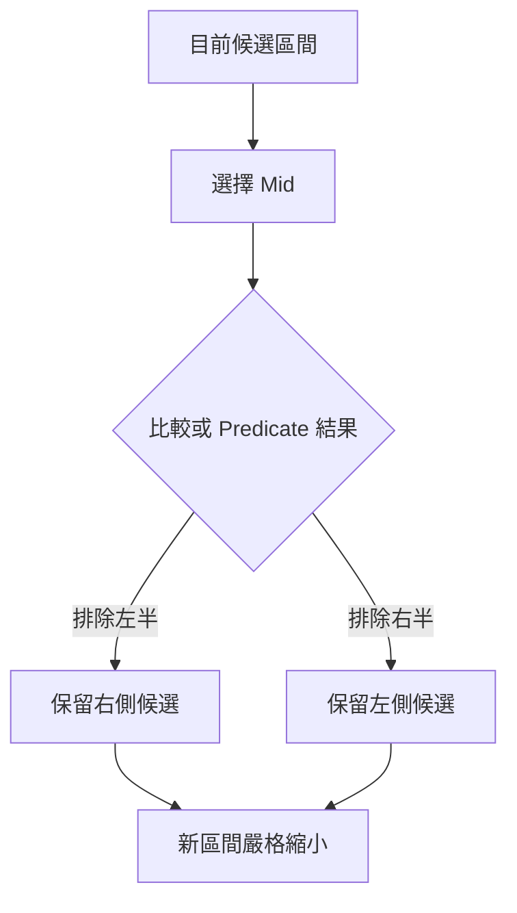

若無法說明被排除的一半為何不可能含答案，就尚未建立 Binary Search 的正確性。

### 15.2 必要條件：有序與單調性

#### 有序資料

Exact Search、Lower Bound 與 Upper Bound 通常依賴 Array 排序。

#### 單調 Predicate

答案搜尋常把每個候選 x 映射成 Boolean：

```text
false false false true true true
```

此時可找第一個 True。

或：

```text
true true true false false false
```

此時可找最後一個 True。

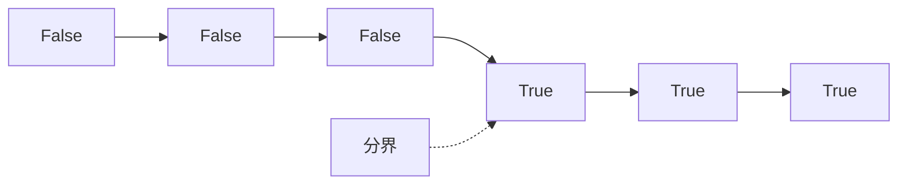

若結果為：

```text
false true false true
```

就沒有單一分界，不能直接套用一般 Binary Search。

#### 嚴格縮小

每輪新區間必須比舊區間短。若寫成 `left = mid`，而 Mid 可能等於 Left，兩元素區間就可能永遠不變。

### 15.3 Closed 與 Half-open Interval

#### Closed Interval

```text
[left, right]
```

- Left 與 Right 都是候選。
- 非空條件通常是 `left <= right`。
- 排除 Mid 與右側可寫 `right = mid - 1`。
- 排除 Mid 與左側可寫 `left = mid + 1`。

#### Half-open Interval

```text
[left, right)
```

- Left 是候選，Right 不包含。
- 非空條件是 `left < right`。
- 保留 Mid 可寫 `right = mid`。
- 排除 Mid 可寫 `left = mid + 1`。

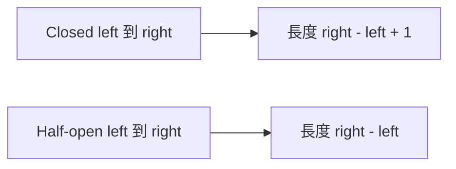

不能把 Half-open 的 `right = mid` 與 Closed 的 `left <= right` 任意混搭。每一行都要由候選區間語意推導。

### 15.4 完整案例：Exact Search

以下使用 Closed Interval，搜尋任意一個等於 Target 的位置。

```cpp
#include <vector>

int binarySearchExact(
    const std::vector<int>& nums,
    int target)
{
    int left = 0;
    int right = static_cast<int>(nums.size()) - 1;

    while (left <= right)
    {
        const int mid = left + (right - left) / 2;

        if (nums[mid] == target)
        {
            return mid;
        }

        if (nums[mid] < target)
        {
            left = mid + 1;
        }
        else
        {
            right = mid - 1;
        }
    }

    return -1;
}
```

#### Loop Invariant

每輪開始前：

> 若 Target 存在，至少有一個符合位置位於 `[left, right]`。

若 `nums[mid] < target`，排序保證所有 `i <= mid` 的 Value 都小於 Target，因此可排除 `[left, mid]`。

若 `nums[mid] > target`，可排除 `[mid, right]`。

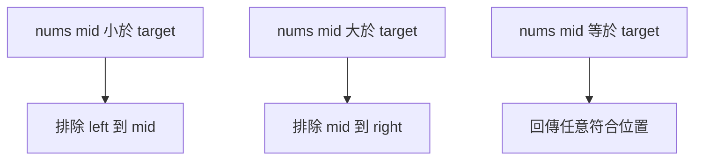

Exact Search 不保證重複值中的第一個或最後一個位置。需要邊界時應使用 Lower Bound 或 Upper Bound。

### 15.5 Lower Bound

Lower Bound 定義為：

> 第一個 Value 不小於 Target 的位置。

它是插入位置，範圍為 `[0, n]`。回傳 n 表示所有元素都小於 Target。

```cpp
int lowerBound(
    const std::vector<int>& nums,
    int target)
{
    int left = 0;
    int right = static_cast<int>(nums.size());

    while (left < right)
    {
        const int mid = left + (right - left) / 2;

        if (nums[mid] < target)
        {
            left = mid + 1;
        }
        else
        {
            right = mid;
        }
    }

    return left;
}
```

此版本使用 Half-open Interval `[left, right)`。

### 15.6 完整案例：第一個不小於 Target

將每個位置分類：

```text
nums[i] < target       False
nums[i] >= target      True
```

排序後形成：

```text
False ... False True ... True
```

Lower Bound 就是第一個 True。

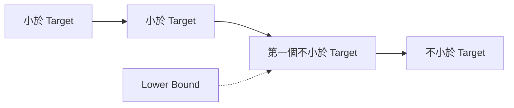

#### Invariant

每輪開始前：

- `[0, left)` 全部小於 Target。
- `[right, n)` 全部不小於 Target。
- 邊界答案位於 `[left, right]` 的 Position 空間。

#### 更新理由

若 `nums[mid] < target`，Mid 一定在 Lower Bound 左方，可以排除到 Mid：

```cpp
left = mid + 1;
```

若 `nums[mid] >= target`，Mid 可能就是第一個合法位置，必須保留：

```cpp
right = mid;
```

#### 逐輪追蹤

```text
nums = [1, 3, 3, 5]
target = 3
```

| Left | Mid | Right | Value | 更新 |
|---:|---:|---:|---:|---|
| 0 | 2 | 4 | 3 | `right = 2` |
| 0 | 1 | 2 | 3 | `right = 1` |
| 0 | 0 | 1 | 1 | `left = 1` |

結束時 `left == right == 1`。

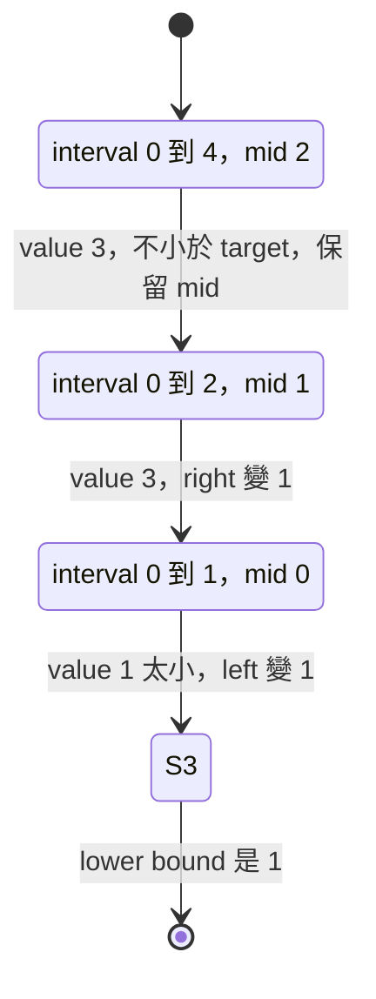

### 15.7 Upper Bound 與重複值範圍

Upper Bound 定義為：

> 第一個 Value 嚴格大於 Target 的位置。

```cpp
int upperBound(
    const std::vector<int>& nums,
    int target)
{
    int left = 0;
    int right = static_cast<int>(nums.size());

    while (left < right)
    {
        const int mid = left + (right - left) / 2;

        if (nums[mid] <= target)
        {
            left = mid + 1;
        }
        else
        {
            right = mid;
        }
    }

    return left;
}
```

Lower Bound 與 Upper Bound 的差別只在等號屬於哪一側：

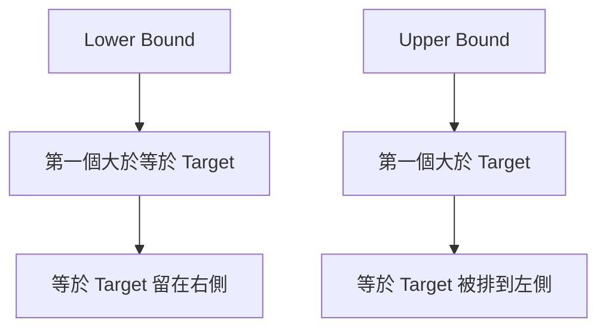

Target 的出現範圍是：

```text
[lowerBound, upperBound)
```

出現次數：

```text
upperBound - lowerBound
```

若 Target 不存在，兩者會相等，次數為 0。

### 15.8 First True 與 Last True

#### First True

對：

```text
False False True True
```

可使用 Half-open Boundary Search：

```cpp
template <class Predicate>
long long firstTrue(
    long long left,
    long long right,
    Predicate predicate)
{
    while (left < right)
    {
        const long long mid =
            left + (right - left) / 2;

        if (predicate(mid))
        {
            right = mid;
        }
        else
        {
            left = mid + 1;
        }
    }

    return left;
}
```

#### Last True

對：

```text
True True False False
```

可轉換成找第一個 False，再減一，或使用與區間定義一致的另一套模板。

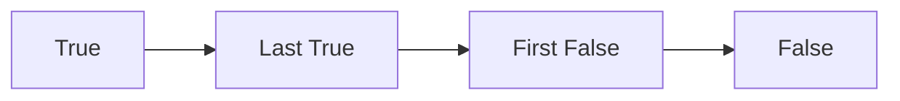

比起記住多套模板，較穩定的方法是先把題目改寫成 First True 或 Lower Bound 類型。

### 15.9 Binary Search on Answer

Binary Search on Answer 不一定在 Array 上搜尋，而是在可能答案範圍中搜尋最小或最大可行值。

流程：

1. 定義候選答案 x。
2. 寫出 `feasible(x)`。
3. 證明 Feasibility 單調。
4. 找到明確包含答案的搜尋邊界。
5. 使用 First True 或 Last True。

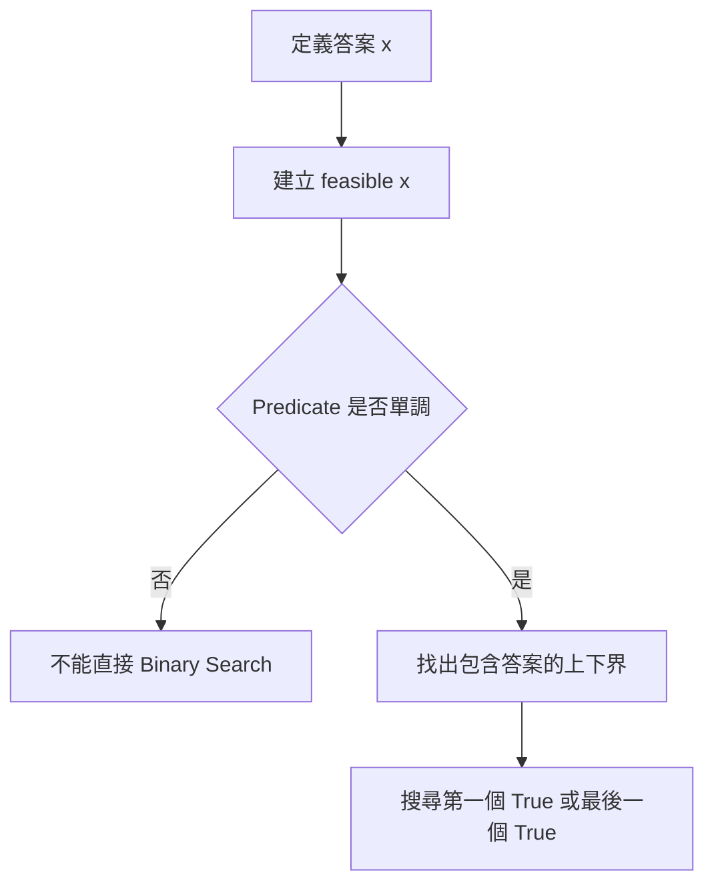

### 15.10 完整案例：最小可行容量

#### 問題規格

有一串正整數工作量，必須依原順序分配到不超過 d 天。每天可處理總量不超過 Capacity。求最小可行 Capacity。

#### 搜尋範圍

最小容量至少是單一工作量最大值：

```text
left = max(workloads)
```

最大容量可取全部工作量總和：

```text
right = sum(workloads)
```

#### Predicate

`feasible(capacity)`：能否在不超過 d 天內依序完成。

容量增加不會讓問題由可行變不可行，因此 Truth Table 為：

```text
False ... False True ... True
```


#### C++ 核心

```cpp
bool feasible(
    const std::vector<int>& workloads,
    int days,
    long long capacity)
{
    int usedDays = 1;
    long long current = 0;

    for (int workload : workloads)
    {
        if (workload > capacity)
        {
            return false;
        }

        if (current + workload > capacity)
        {
            ++usedDays;
            current = 0;
        }

        current += workload;
    }

    return usedDays <= days;
}
```

外層使用 First True 搜尋最小可行 Capacity。

#### 正確性重點

- Search Range 必須涵蓋答案。
- Predicate 必須以相同限制檢查所有 Capacity。
- Capacity 越大時，可沿用原本分配方式，因此可行性不會下降。
- 若輸入或 Days 本身可能無效，需要另外定義政策。

### 15.11 答案不存在與搜尋邊界

Lower Bound 回傳的是 Position，可等於 n。呼叫端若要取得元素，必須再檢查：

```cpp
const int position = lowerBound(nums, target);

if (position < static_cast<int>(nums.size()) &&
    nums[position] == target)
{
    // Target 存在
}
```

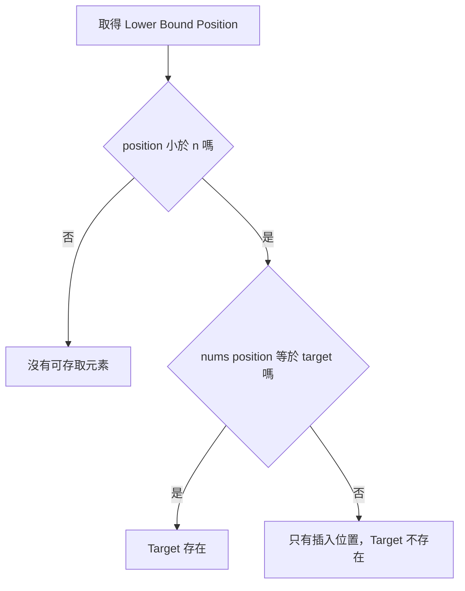

答案搜尋也要定義：

- 保證一定有 True。
- 若可能沒有 True，搜尋範圍是否含 Sentinel。
- 找不到時回傳空結果、特定值，還是先檢查端點。

### 15.12 Mid、Overflow 與上界倍增

Mid 常寫成：

```cpp
mid = left + (right - left) / 2;
```

比 `(left + right) / 2` 更能避免加法 Overflow，但仍需確保 `right - left` 合法，通常建立在 `left <= right`。

#### 上界倍增

不知道答案上界時，可從某個值開始倍增，直到 Predicate 為 True：

```text
1, 2, 4, 8, 16, ...
```

倍增前要檢查：

- 是否會 Overflow。
- Predicate 是否真的存在 True。
- 最大允許範圍是什麼。

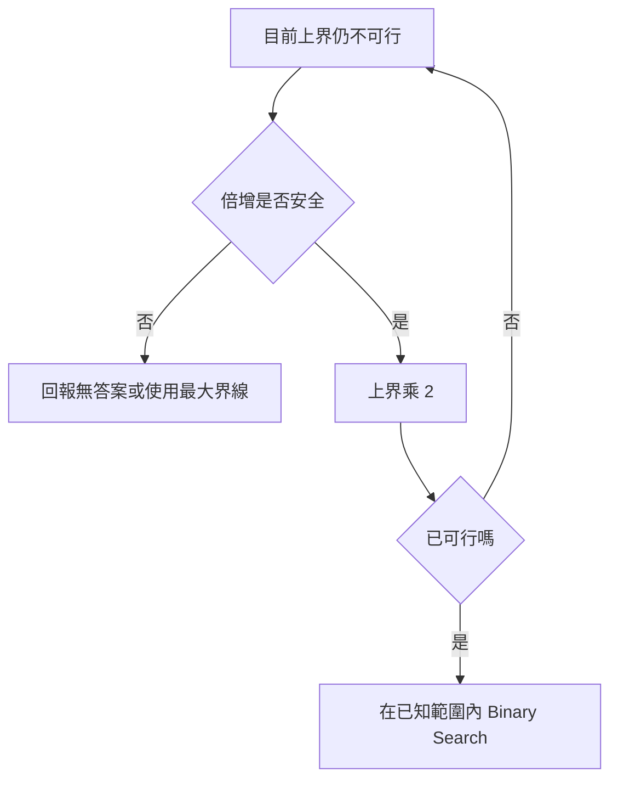

### 15.13 複雜度與終止性

每輪候選長度大約減半。若初始候選數量為 n：

```text
經過 t 輪後約剩 n / 2^t
```

因此輪數為 O(log n)。

Binary Search on Answer 的總成本為：

```text
O(log R × Predicate Cost)
```

其中 R 是答案範圍大小。


終止性必須檢查：

- Mid 位於目前候選區間。
- 每個分支都讓新區間嚴格縮小。
- 兩元素與單元素案例不會停住。

### 15.14 系統化 Debug

逐輪記錄：

```text
left
mid
right
mid value 或 predicate(mid)
新區間
被排除範圍
排除理由
```

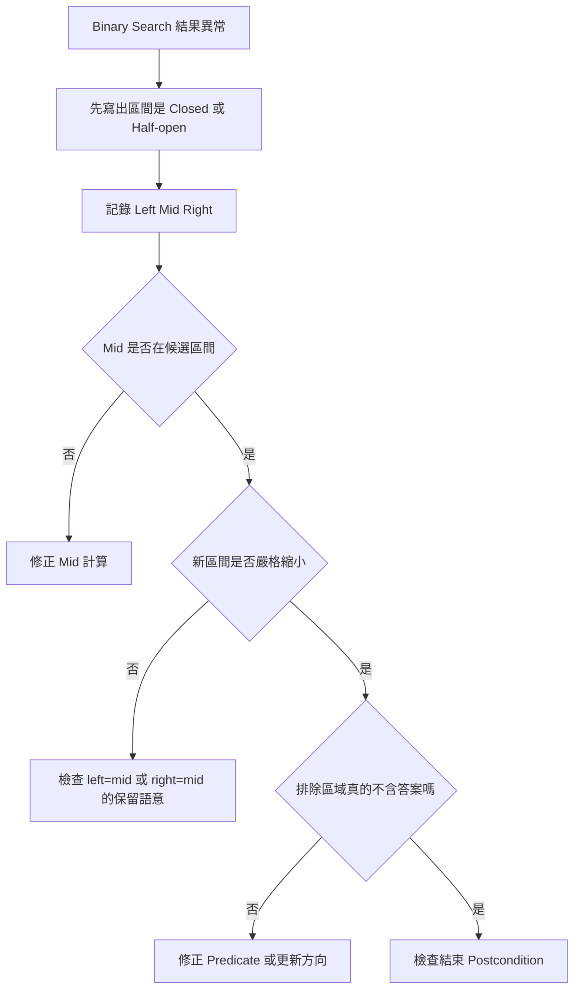

最重要的測試：

- 空 Array。
- 一個元素，找到與找不到。
- 兩個元素，答案在左或右。
- 全部相同。
- Target 小於全部元素。
- Target 大於全部元素。
- 重複值的第一個與最後一個位置。
- Predicate 全 False 或全 True。

### 15.15 C 語言中的 Binary Search

Lower Bound：

```c
#include <stddef.h>

size_t lower_bound_int(
    const int values[],
    size_t length,
    int target)
{
    size_t left = 0;
    size_t right = length;

    while (left < right)
    {
        const size_t mid =
            left + (right - left) / 2;

        if (values[mid] < target)
        {
            left = mid + 1;
        }
        else
        {
            right = mid;
        }
    }

    return left;
}
```

回傳值範圍是 `[0, length]`。呼叫端在讀取 `values[position]` 前，必須先檢查 `position < length`。

若 `length > 0`，`values` 必須指向至少 Length 個有效元素。空 Array 時不會進入迴圈，也不會解參考 Pointer。

### 15.16 建立自己的 Binary Search 分析表

| 欄位 | 要回答的問題 |
|---|---|
| 候選空間 | 搜尋的是 Index、Position 還是數值答案？ |
| 單調性 | 比較結果或 Predicate 如何形成分界？ |
| 目標 | Exact、Lower Bound、Upper Bound、First True 或 Last True？ |
| 區間 | Closed 還是 Half-open？ |
| Invariant | 區間外兩側分別已知什麼？ |
| Mid | 使用下中位數還是上中位數？ |
| True 分支 | Mid 要保留還是排除？ |
| False 分支 | Mid 要保留還是排除？ |
| 終止 | 何時區間為空或收斂成一個 Position？ |
| 回傳 | 回傳 Position、Element Index 或空結果？ |
| 無答案 | n、-1、Optional，還是 Sentinel？ |
| Overflow | Mid、答案範圍與倍增是否安全？ |
| Predicate Cost | 每次可行性檢查的成本是多少？ |
| 邊界 | 空、一元素、兩元素、全 True、全 False 如何處理？ |

### 15.17 常見問題與判讀

| 現象 | 可能原因 | 第一輪檢查 |
|---|---|---|
| 兩元素死迴圈 | 更新後區間未縮小 | Mid 是否等於 Left，卻又寫 `left=mid` |
| 找到錯的重複值 | Exact Search 不保證邊界 | 使用 Lower 或 Upper Bound |
| 第一個重複值漏掉 | Predicate 等號分到錯側 | Lower Bound 應找第一個 `>=` |
| Upper Bound 停在最後一個相等值 | 定義混淆 | Upper Bound 是第一個 `>` |
| 回傳 n 後越界 | 把 Position 當元素 Index | 先檢查 `position < n` |
| 空 Array 產生負 Index | Closed Right 初始化未處理 | 使用安全型別或 Half-open Range |
| Answer Search 結果錯誤 | Predicate 不單調 | 列出 Truth Table |
| 找不到答案 | Search Range 未涵蓋分界 | 檢查上下界與端點 Feasibility |
| Mid 發生 Overflow | 使用 `(left+right)/2` | 改用 `left+(right-left)/2` |
| 上界倍增溢位 | 未檢查最大界線 | 倍增前確認範圍 |
| Closed 與 Half-open 混用 | 迴圈和更新規則來自不同模板 | 從區間定義重新推導每一行 |
| 複雜度低估 | 忽略 Predicate Cost | 寫成 `log 範圍 × 單次檢查成本` |

### 15.18 本章檢查表

- 我知道 Binary Search 的核心是安全排除候選，而不是計算 Mid。
- 我會先確認資料有序或 Predicate 單調。
- 我能畫出 False/True 的分界。
- 我能明確選擇 Closed 或 Half-open Interval。
- 我不會混用兩種區間的迴圈與更新規則。
- 我能說明每個分支排除哪一半。
- 我能確認 Mid 是否應保留在候選區間。
- 我會檢查每輪新區間嚴格縮小。
- 我能區分 Exact Search、Lower Bound 與 Upper Bound。
- 我知道 Lower Bound 回傳第一個 `>= Target` 的 Position。
- 我知道 Upper Bound 回傳第一個 `> Target` 的 Position。
- 我知道回傳 n 可以是合法 Position，但不是合法元素 Index。
- 我能使用 Upper Bound 減 Lower Bound 計算出現次數。
- 我能將答案搜尋改寫為 First True 或 Last True。
- 我會證明 `feasible(x)` 的單調性。
- 我會確認答案搜尋上下界涵蓋答案。
- 我能處理全 True、全 False 與答案不存在政策。
- 我會使用安全 Mid 公式並檢查倍增 Overflow。
- 我會用一元素與兩元素案例檢查終止性。
- 我能計算 `O(log Range × Predicate Cost)`。

### 15.19 本章重點

- Binary Search 依賴有序候選或單調 Predicate，利用分界安全排除一半候選。
- 區間定義決定非空條件、Mid 是否保留及更新公式。
- Closed Interval 與 Half-open Interval 都可使用，但不能混搭。
- Exact Search 只需任意相等位置，不保證重複值邊界。
- Lower Bound 是第一個不小於 Target 的 Position，Upper Bound 是第一個大於 Target 的 Position。
- 回傳 n 代表插入位置位於尾端，讀取元素前必須另外檢查。
- Lower Bound 與 Upper Bound 的差異在於等於 Target 的位置被分到哪一側。
- First True 與 Last True 是邊界搜尋的一般化形式。
- Binary Search on Answer 必須先定義 Feasibility，並證明其單調性。
- 搜尋範圍必須涵蓋答案，沒有答案時也要有明確政策。
- Mid 公式應降低 Overflow 風險，上界倍增也需要檢查型別範圍。
- 每輪新區間必須嚴格縮小，兩元素案例是檢查死迴圈的重要測試。
- Answer Search 的總成本是搜尋輪數乘上單次 Predicate 成本。
- Debug 時應同步記錄區間、Mid、Predicate、新區間與排除理由。
