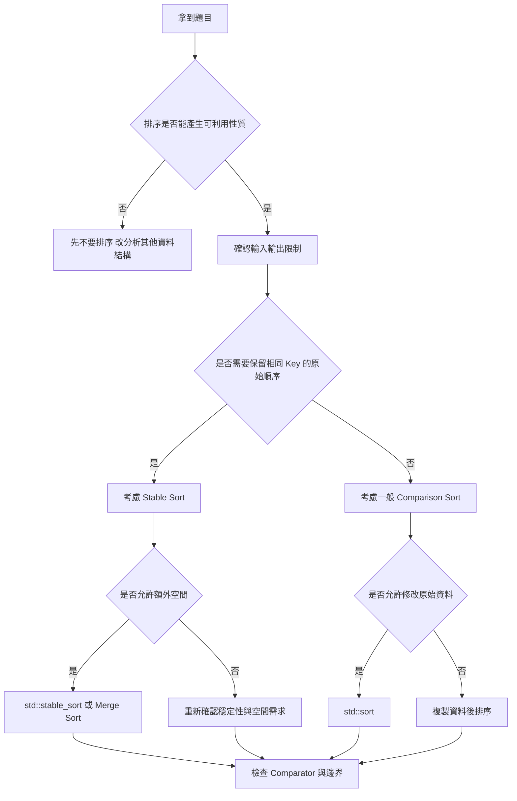
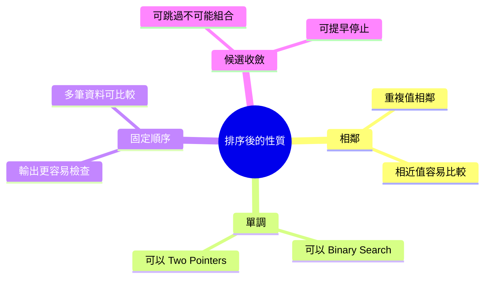
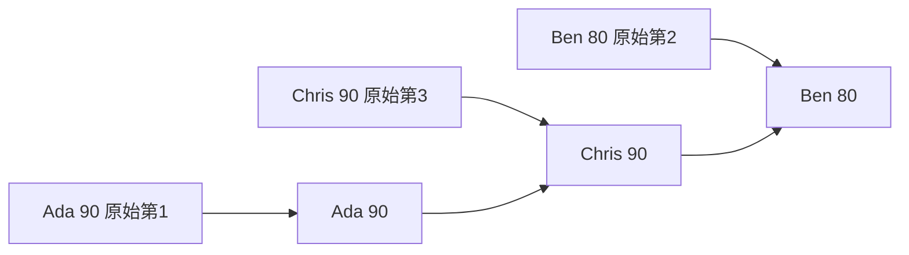
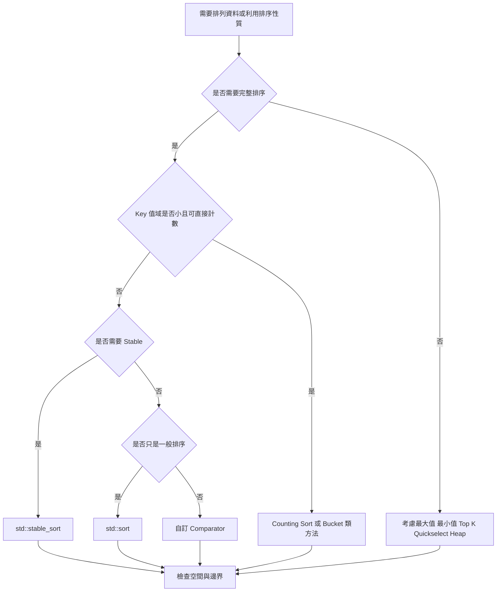

## 第 16 章　排序的基本概念

### 適用範圍

本章說明排序在演算法題與程式設計中解決哪些問題，以及在選擇排序方法前應該先完成哪些分析。

很多人看到「排序」兩個字，會直接想到 `std::sort`，但排序不只是把資料由小排到大。排序常用來建立下列性質：

- 讓相同或相近的資料聚在一起。
- 讓資料具備單調性，方便 Binary Search 或 Two Pointers。
- 將原本分散的候選答案整理成可掃描的順序。
- 在輸出要求中產生固定、可比較的順序。

本章會建立一套固定判斷流程：

- 先確認題目是否真的需要排序。
- 整理輸入、輸出、資料大小與值域。
- 判斷排序後會得到哪些性質。
- 確認是否允許修改原始資料。
- 確認是否需要 Stable Sort。
- 確認是否需要 In-place Sort。
- 檢查 Comparator 是否符合規則。
- 再選擇 `std::sort`、`std::stable_sort` 或其他方法。



### 適用讀者

- 看到排序題時，會直接套 `std::sort`，但不確定原因的讀者。
- 知道 Quick Sort、Merge Sort、Heap Sort 名稱，但不清楚如何選擇的讀者。
- 常因 Stable Sort、Comparator、原始 Index 或修改輸入限制而出錯的讀者。
- 想知道排序後可以搭配 Binary Search、Two Pointers 或相鄰比較的讀者。
- 同時使用 C++ 與 C，需要先理解排序核心，再處理語言差異的讀者。

### 快速導覽

- [16.1 排序前到底要分析什麼](#161-排序前到底要分析什麼)：建立排序問題的分析流程。
- [16.2 排序解決什麼問題](#162-排序解決什麼問題)：理解排序提供的性質。
- [16.3 Comparison Sort](#163-comparison-sort)：只靠比較大小完成排序。
- [16.4 Stable Sort](#164-stable-sort)：相同 Key 的元素保留原始相對順序。
- [16.5 In-place Sort](#165-in-place-sort)：排序時是否大量使用額外空間。
- [16.6 Adaptive Sort](#166-adaptive-sort)：輸入接近排序完成時能否更快。
- [16.7 排序 Key 與 Comparator](#167-排序-key-與-comparator)：定義排序依據與比較規則。
- [16.8 多欄位排序](#168-多欄位排序)：依序比較多個欄位。
- [16.9 排序後可以獲得什麼性質](#169-排序後可以獲得什麼性質)：相鄰、單調與可排除候選。
- [16.10 排序的複雜度下界](#1610-排序的複雜度下界)：理解 O(n log n) 的來源。
- [16.11 如何選擇排序方法](#1611-如何選擇排序方法)：整理實務判斷流程。
- [16.12 常見問題與判讀](#1612-常見問題與判讀)：排序題常見錯誤。
- [16.13 本章檢查表](#1613-本章檢查表)：確認是否完成必要分析。
- [16.14 本章重點](#1614-本章重點)：回顧本章核心。

### 16.1 排序前到底要分析什麼

假設題目如下：

給定一組整數，判斷是否存在重複值。

一種方法是使用 Hash Set。另一種方法是先排序，再檢查相鄰元素是否相同。

排序解法不是因為題目出現「重複」就自動成立，而是因為排序後有一個明確性質：

相同數值在排序後一定會相鄰。

可以先整理成以下欄位：

<table>
<tr><th>分析項目</th><th>本題內容</th></tr>
<tr><td>輸入</td><td>一組整數</td></tr>
<tr><td>輸出</td><td>true 或 false</td></tr>
<tr><td>要找的現象</td><td>任意兩個不同位置具有相同數值</td></tr>
<tr><td>排序後可利用性質</td><td>相同值會相鄰</td></tr>
<tr><td>是否需要原始順序</td><td>不需要</td></tr>
<tr><td>是否允許修改輸入</td><td>依題目而定</td></tr>
<tr><td>空輸入結果</td><td>false</td></tr>
<tr><td>單一元素結果</td><td>false</td></tr>
</table>

這張表會直接影響程式：

- 若允許修改輸入，可以直接排序原本的 `vector`。
- 若不允許修改輸入，需要先複製一份資料。
- 因為只需判斷是否存在重複，找到第一組相鄰相同元素就能回傳 true。

#### C++ 排序後檢查重複值

```cpp
#include <algorithm>
#include <vector>

bool containsDuplicateBySorting(std::vector<int> nums)
{
    // nums 以傳值方式接收，因此排序不會修改呼叫端原本的資料。
    std::sort(nums.begin(), nums.end());

    for (int i = 1; i < static_cast<int>(nums.size()); ++i)
    {
        if (nums[i - 1] == nums[i])
        {
            return true;
        }
    }
    return false;
}
```

#### 複雜度

- 排序需要 O(n log n) 時間。
- 相鄰掃描需要 O(n) 時間。
- 總時間複雜度為 O(n log n)。
- 這個版本使用傳值參數，會複製一份資料，因此額外空間至少 O(n)。

### 16.2 排序解決什麼問題

排序的直接結果是「資料順序改變」。但在解題時，更重要的是排序後產生的性質。



#### 常見用途

<table>
<tr><th>排序後性質</th><th>常見用途</th><th>例子</th></tr>
<tr><td>相同值相鄰</td><td>檢查重複值、統計連續群組</td><td>Contains Duplicate</td></tr>
<tr><td>數值具備單調性</td><td>Binary Search、Two Pointers</td><td>Two Sum sorted version</td></tr>
<tr><td>區間端點有順序</td><td>合併區間、會議室問題</td><td>Merge Intervals</td></tr>
<tr><td>輸出順序固定</td><td>要求字典序或遞增輸出</td><td>列出排序後結果</td></tr>
</table>

#### 排序也有成本

排序通常會帶來幾個代價：

- 時間成本多半是 O(n log n)。
- 可能改變原始資料順序。
- 如果不能修改輸入，需要複製資料。
- 如果題目要求原始 Index，需要額外保存 Index。

因此，排序不是看到資料就先做，而是要確認排序後產生的性質能否抵消排序成本。

### 16.3 Comparison Sort

Comparison Sort 是只透過「兩個元素誰應該排前面」來決定順序的排序方法。

常見的 Comparison Sort 包含：

- Bubble Sort
- Selection Sort
- Insertion Sort
- Merge Sort
- Quick Sort
- Heap Sort
- C++ `std::sort`
- C++ `std::stable_sort`

#### Comparator 的角色

若排序整數由小到大，Comparator 可以理解成：

```cpp
bool cmp(int a, int b)
{
    return a < b;
}
```

`cmp(a, b)` 回傳 true，表示 `a` 應該排在 `b` 前面。

#### Comparison Sort 的限制

只靠比較的排序方法，在一般情況下無法保證優於 O(n log n)。原因可以從「可能排列數量」理解：

- n 個不同元素共有 n! 種可能排列。
- 每一次比較最多只能把可能性分成兩類。
- 要辨識出正確排列，需要足夠多次比較。

這也是為什麼 `std::sort` 的典型時間複雜度會以 O(n log n) 作為主要期待。

#### 非 Comparison Sort

如果 Key 的值域很小，或資料符合特定型態，可以考慮非比較排序，例如 Counting Sort。

例如所有分數都在 0 到 100，可以統計每個分數出現幾次，再依序輸出。

```cpp
#include <array>
#include <vector>

std::vector<int> countingSortScores(const std::vector<int>& scores)
{
    std::array<int, 101> count{};

    for (int score : scores)
    {
        ++count[score];
    }

    std::vector<int> result;
    result.reserve(scores.size());

    for (int score = 0; score <= 100; ++score)
    {
        for (int k = 0; k < count[score]; ++k)
        {
            result.push_back(score);
        }
    }

    return result;
}
```

這個方法的前置條件很明確：所有分數都必須介於 0 到 100。若值域很大或有負數，就需要重新設計對應方式。

### 16.4 Stable Sort

Stable Sort 指的是：如果兩個元素的排序 Key 相同，排序後仍保留它們在原輸入中的相對順序。

例如有三筆資料：

<table>
<tr><th>原始順序</th><th>姓名</th><th>分數</th></tr>
<tr><td>1</td><td>Ada</td><td>90</td></tr>
<tr><td>2</td><td>Ben</td><td>80</td></tr>
<tr><td>3</td><td>Chris</td><td>90</td></tr>
</table>

如果依分數由高到低排序，Ada 和 Chris 的分數相同。Stable Sort 會讓 Ada 仍排在 Chris 前面。



#### 什麼時候需要 Stable Sort

Stable Sort 常在「多階段排序」中出現。

假設要先依姓名排序，再依分數排序，而且希望同分者維持姓名順序：

```cpp
#include <algorithm>
#include <string>
#include <vector>

struct Student
{
    std::string name;
    int score;
};

void sortStudents(std::vector<Student>& students)
{
    std::stable_sort(
        students.begin(),
        students.end(),
        [](const Student& a, const Student& b)
        {
            return a.name < b.name;
        });

    std::stable_sort(
        students.begin(),
        students.end(),
        [](const Student& a, const Student& b)
        {
            return a.score > b.score;
        });
}
```

第二次排序依分數由高到低。因為使用 Stable Sort，相同分數內會保留第一次姓名排序的結果。

#### 不需要 Stable Sort 的情況

如果排序 Key 不會重複，Stable Sort 與不穩定排序的輸出相同。

如果題目只要求「排序後數字由小到大」，且不在乎相同值的原始順序，通常不需要特別使用 Stable Sort。

### 16.5 In-place Sort

In-place Sort 通常表示排序過程不需要建立另一份和輸入同樣大小的資料。也就是說，額外空間通常是 O(1) 或 O(log n)。

#### 為什麼要關心 In-place

在資料量很大時，額外複製一份陣列可能會造成記憶體壓力。

<table>
<tr><th>資料量</th><th>int 約略空間</th><th>複製一份後</th></tr>
<tr><td>1,000</td><td>約 4 KB</td><td>約 8 KB</td></tr>
<tr><td>1,000,000</td><td>約 4 MB</td><td>約 8 MB</td></tr>
<tr><td>100,000,000</td><td>約 400 MB</td><td>約 800 MB</td></tr>
</table>

#### 修改輸入與 In-place 是不同問題

「允許修改輸入」和「是否 In-place」容易混在一起，但兩者不同：

- 允許修改輸入：排序可以直接改原本的陣列。
- In-place：排序過程不使用大量額外空間。

如果題目不允許修改輸入，即使使用 In-place Sort，也要先複製資料，整體仍會使用 O(n) 額外空間。

### 16.6 Adaptive Sort

Adaptive Sort 指的是排序方法會利用輸入原本的順序。如果資料已經接近排序完成，可能比一般情況更快。

Insertion Sort 是常見例子。若資料幾乎已排序，每個元素只需要移動很少距離，速度可能很好。

#### Insertion Sort 範例

```cpp
#include <vector>

void insertionSort(std::vector<int>& nums)
{
    for (int i = 1; i < static_cast<int>(nums.size()); ++i)
    {
        int value = nums[i];
        int j = i - 1;

        while (j >= 0 && nums[j] > value)
        {
            nums[j + 1] = nums[j];
            --j;
        }

        nums[j + 1] = value;
    }
}
```

#### 複雜度

- 最差情況：O(n²)，例如反向排序。
- 已排序或接近排序完成：可能接近 O(n)。
- 額外空間：O(1)。

這也是為什麼某些標準函式或實務排序策略會在小區間中搭配 Insertion Sort。

### 16.7 排序 Key 與 Comparator

排序 Key 是用來決定順序的欄位或計算結果。

例如學生資料中，可以依不同 Key 排序：

- 依分數排序。
- 依姓名排序。
- 依年齡排序。
- 依分數，再依姓名排序。

#### Comparator 必須表示一致的順序

C++ 的 Comparator 應符合嚴格弱序關係。初學時可先記住幾個檢查點：

- `cmp(a, a)` 應該是 false。
- 如果 `cmp(a, b)` 是 true，`cmp(b, a)` 就不應該也是 true。
- 不要讓 Comparator 依賴排序過程中會改變的外部狀態。

#### 常見錯誤：使用小於等於

```cpp
std::sort(nums.begin(), nums.end(), [](int a, int b)
{
    return a <= b; // 錯誤：a == b 時也回傳 true
});
```

當 `a == b` 時，`a <= b` 與 `b <= a` 都是 true，這不符合比較規則。

正確寫法：

```cpp
std::sort(nums.begin(), nums.end(), [](int a, int b)
{
    return a < b;
});
```

### 16.8 多欄位排序

多欄位排序的概念是：先比較第一個欄位，若相同，再比較第二個欄位。

例如：

- 分數高的排前面。
- 分數相同時，姓名字典序小的排前面。

```cpp
#include <algorithm>
#include <string>
#include <vector>

struct Student
{
    std::string name;
    int score;
};

void sortByScoreThenName(std::vector<Student>& students)
{
    std::sort(
        students.begin(),
        students.end(),
        [](const Student& a, const Student& b)
        {
            if (a.score != b.score)
            {
                return a.score > b.score;
            }
            return a.name < b.name;
        });
}
```

也可以使用 `std::tie` 處理同方向排序。但若某些欄位要遞增、某些欄位要遞減，明確寫出比較流程通常較容易閱讀。

### 16.9 排序後可以獲得什麼性質

排序常用來把原本不容易檢查的候選空間變成可線性掃描。

#### 重複值相鄰

排序前：

```text
[4, 2, 7, 2]
```

排序後：

```text
[2, 2, 4, 7]
```

只要檢查相鄰元素即可。

#### Two Pointers

若資料已排序，可以從最小與最大兩端開始調整。

```mermaid
flowchart TD
    A[已排序陣列] --> B[left 指向最小值]
    A --> C[right 指向最大值]
    B --> D{nums[left] + nums[right] 與 target 比較}
    C --> D
    D -->|太小| E[left 向右]
    D -->|太大| F[right 向左]
    D -->|相等| G[找到答案]
    E --> D
    F --> D
```

這個方法成立的原因是排序後具有單調性。若總和太小，移動 left 可以讓總和有機會變大；若總和太大，移動 right 可以讓總和有機會變小。

#### Binary Search

排序後可以用 Binary Search，是因為候選答案可以被安全排除一半。

如果資料沒有排序，或判斷條件不是單調分界，就不能直接使用一般 Binary Search。

### 16.10 排序的複雜度下界

Comparison Sort 一般需要 O(n log n) 次比較。這不是某個特定排序方法的限制，而是只靠比較決定完整順序時的共同限制。

可以用決策樹理解：

- 每次比較只有幾種結果，常見情況可視為二分。
- n 個不同元素有 n! 種可能排列。
- 決策樹至少要有 n! 個葉節點，才能分辨所有排列。
- 因此樹高需要接近 log(n!)，也就是 O(n log n)。

不過，如果題目不是要完整排序，或資料有特殊值域，可能可以避開這個限制。

例如：

- 只找最大值：O(n)。
- 只找第 k 大：可用選擇演算法，不一定要完整排序。
- 值域很小：Counting Sort 可接近 O(n + K)。

### 16.11 如何選擇排序方法

可以用以下流程判斷：



#### 常見選擇

<table>
<tr><th>需求</th><th>常見方法</th><th>注意事項</th></tr>
<tr><td>一般 C++ 排序</td><td>std::sort</td><td>不保證 Stable</td></tr>
<tr><td>需要保留相同 Key 的相對順序</td><td>std::stable_sort</td><td>通常需要較多額外空間</td></tr>
<tr><td>小值域整數</td><td>Counting Sort</td><td>需確認值域與負數處理</td></tr>
<tr><td>資料幾乎已排序且規模小</td><td>Insertion Sort</td><td>最差 O(n²)</td></tr>
<tr><td>只需要前 k 大</td><td>Heap 或 Quickselect</td><td>不一定要完整排序</td></tr>
</table>

### 16.12 常見問題與判讀

<table>
<tr><th>現象</th><th>可能原因</th><th>第一輪檢查</th></tr>
<tr><td>排序後答案位置錯誤</td><td>排序改變原始 Index</td><td>是否需要保存原始 Index</td></tr>
<tr><td>同分資料順序與預期不同</td><td>使用了不保證 Stable 的排序</td><td>是否需要 std::stable_sort</td></tr>
<tr><td>Comparator 結果不穩定</td><td>比較規則不符合嚴格弱序</td><td>檢查是否使用 <= 或 >=</td></tr>
<tr><td>記憶體超出限制</td><td>複製資料或使用非 In-place 方法</td><td>確認是否允許修改輸入與額外空間</td></tr>
<tr><td>排序後仍無法降低複雜度</td><td>排序沒有產生可用性質</td><td>重新檢查相鄰、單調或候選排除是否成立</td></tr>
<tr><td>Counting Sort 失敗</td><td>值域或負數未處理</td><td>確認 Key 範圍與 Index 對應方式</td></tr>
<tr><td>Two Pointers 漏解</td><td>資料未排序或移動規則不成立</td><td>確認單調性與指標移動理由</td></tr>
</table>

### 16.13 本章檢查表

- 我能說明排序後會得到哪一個可利用性質。
- 我不會只因為資料是 Array 就先排序。
- 我能判斷題目是否需要保留原始 Index。
- 我能判斷題目是否允許修改輸入。
- 我能區分 Stable Sort 與一般排序。
- 我能區分 In-place 與是否修改輸入。
- 我能寫出符合規則的 Comparator。
- 我知道 Comparator 不應使用 `<=` 取代 `<`。
- 我能處理多欄位排序。
- 我知道 Comparison Sort 一般有 O(n log n) 下界。
- 我知道值域小時可以考慮 Counting Sort。
- 我知道只找 Top K 或最大最小值時，不一定要完整排序。
- 我會使用空陣列、單一元素、重複值、已排序與反向排序測試。

### 16.14 本章重點

- 排序不只是改變順序，而是建立相鄰、單調與固定輸出的性質。
- 使用排序前，要先確認排序後能否減少工作量。
- Comparison Sort 只靠比較決定順序，一般完整排序需要 O(n log n)。
- Stable Sort 會保留相同 Key 元素的原始相對順序。
- In-place Sort 關注的是額外空間，不等同於是否修改輸入。
- Adaptive Sort 能利用輸入原本接近排序完成的狀態。
- Comparator 是排序正確性的核心，必須表示一致且不矛盾的順序。
- 多欄位排序應明確定義第一順位、第二順位與方向。
- 排序後常能搭配相鄰比較、Binary Search 或 Two Pointers。
- 若題目只需要部分資訊，完整排序不一定是最合適的方法。
