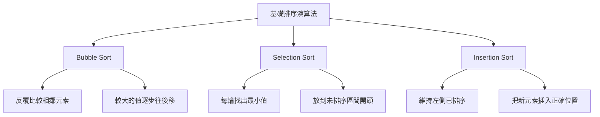
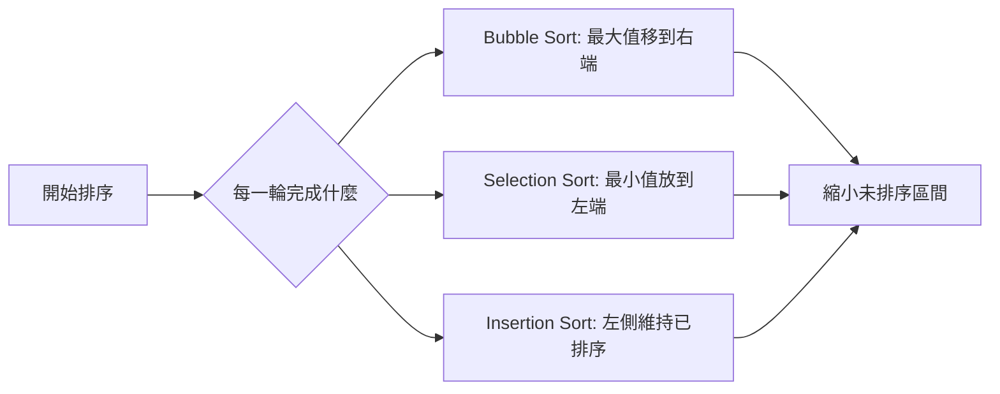
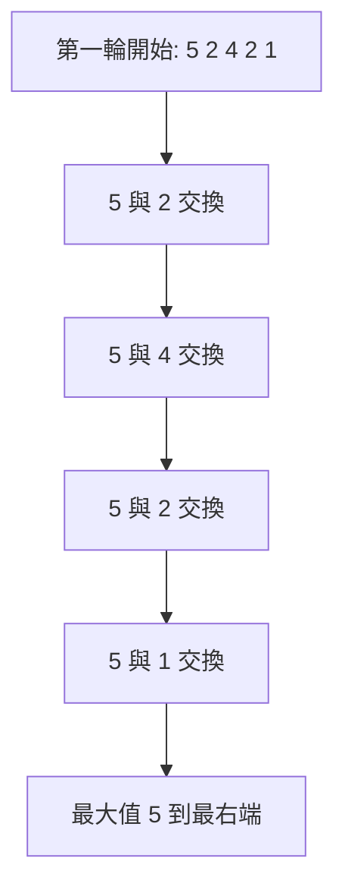
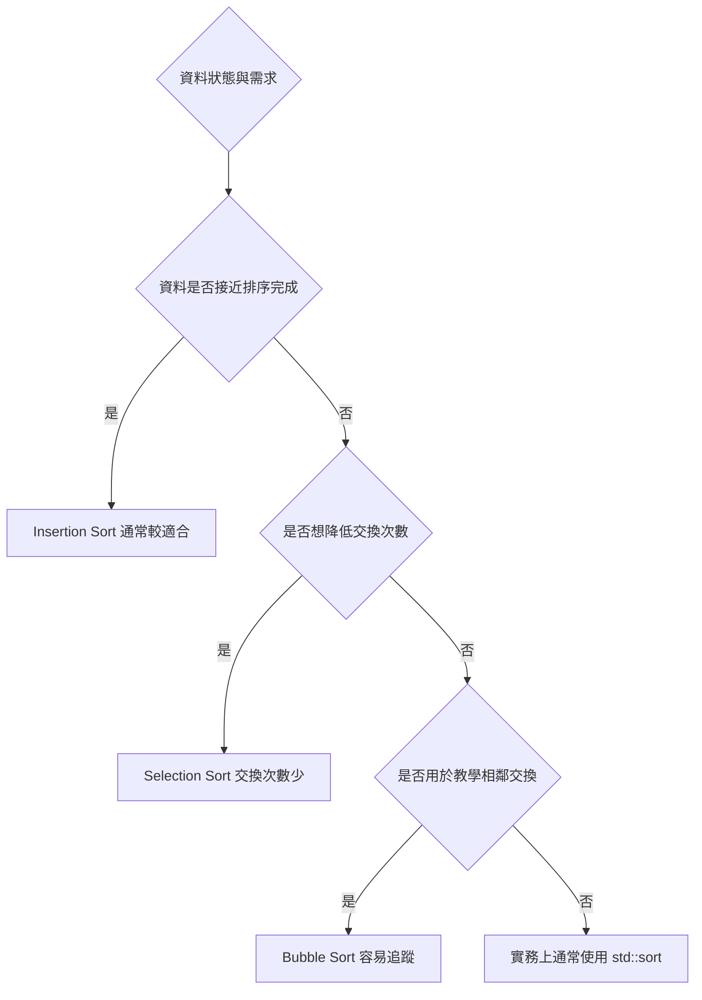
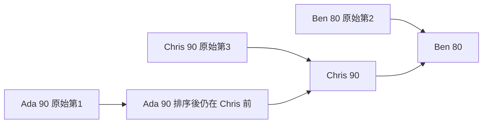

## 第 17 章　基礎排序演算法

### 適用範圍

本章說明三個最基本的排序演算法：Bubble Sort、Selection Sort 與 Insertion Sort。

這三種排序在實務上通常不是大資料排序的首選，因為它們多半需要 O(n²) 時間。不過，它們仍然很適合用來建立排序的核心觀念：

- 如何透過相鄰交換讓元素逐步移動到正確位置。
- 如何每一輪選出目前最小或最大值。
- 如何維持一段已排序區間，再把新元素插入正確位置。
- 如何分析交換次數、比較次數、穩定性與額外空間。

本章的重點不是背三段程式，而是看懂每一種排序「正在維護什麼狀態」。只要能說清楚每一輪結束後已經完成哪一部分，排序演算法就會變得容易追蹤。



### 適用讀者

- 第一次學排序，想從可手動追蹤的方法開始的讀者。
- 會使用 `std::sort`，但想理解排序過程的讀者。
- 對時間複雜度、額外空間、穩定性仍不熟悉的讀者。
- 常在雙層迴圈的範圍、交換位置或終止條件出錯的讀者。
- 想知道為什麼 Insertion Sort 對 Nearly Sorted Data 特別有利的讀者。

### 快速導覽

- [17.1 基礎排序前要先看什麼](#171-基礎排序前要先看什麼)：建立排序分析表。
- [17.2 Bubble Sort](#172-bubble-sort)：透過相鄰比較與交換，把大元素往後推。
- [17.3 Selection Sort](#173-selection-sort)：每輪選出未排序區間的最小值。
- [17.4 Insertion Sort](#174-insertion-sort)：把新元素插入左側已排序區間。
- [17.5 三種基礎排序的比較](#175-三種基礎排序的比較)：整理時間、空間與穩定性。
- [17.6 Nearly Sorted Data](#176-nearly-sorted-data)：接近排序完成的資料對 Insertion Sort 的影響。
- [17.7 Stable 與 Unstable 的實際影響](#177-stable-與-unstable-的實際影響)：相同 Key 的順序是否被保留。
- [17.8 基礎排序的用途](#178-基礎排序的用途)：何時仍值得學或使用。
- [17.9 常見實作錯誤](#179-常見實作錯誤)：整理容易出錯的地方。
- [17.10 本章檢查表](#1710-本章檢查表)：確認是否掌握核心概念。
- [17.11 本章重點](#1711-本章重點)：回顧本章核心。

### 17.1 基礎排序前要先看什麼

假設要將以下資料由小到大排序：

```text
[5, 2, 4, 2, 1]
```

在寫程式之前，可以先整理成以下欄位：

<table>
<tr><th>分析項目</th><th>本題內容</th></tr>
<tr><td>輸入</td><td>一組整數</td></tr>
<tr><td>輸出</td><td>由小到大排列的整數序列</td></tr>
<tr><td>是否允許修改輸入</td><td>本章範例預設允許</td></tr>
<tr><td>是否需要 Stable</td><td>整數排序通常看不出差異，但物件排序時可能需要</td></tr>
<tr><td>額外空間限制</td><td>三種基礎排序都可做到 O(1)</td></tr>
<tr><td>資料是否接近排序完成</td><td>會影響 Insertion Sort 與最佳化 Bubble Sort</td></tr>
<tr><td>空輸入</td><td>排序後仍是空</td></tr>
<tr><td>單一元素</td><td>排序後不變</td></tr>
</table>

基礎排序都可以用同一個角度觀察：

- 哪一段已經排序完成？
- 哪一段還沒有排序完成？
- 每一輪會讓哪個元素或區間確定下來？
- 交換或搬移是否會改變相同 Key 的相對順序？



### 17.2 Bubble Sort

Bubble Sort 的核心想法是：反覆比較相鄰元素，如果順序錯誤就交換。

由小到大排序時，每一輪會讓目前未排序區間中的最大值逐步往右移，最後停在正確位置。

#### 手動追蹤

輸入：

```text
[5, 2, 4, 2, 1]
```

第一輪相鄰比較：

<table>
<tr><th>比較位置</th><th>比較內容</th><th>動作</th><th>結果</th></tr>
<tr><td>0, 1</td><td>5 和 2</td><td>交換</td><td>[2, 5, 4, 2, 1]</td></tr>
<tr><td>1, 2</td><td>5 和 4</td><td>交換</td><td>[2, 4, 5, 2, 1]</td></tr>
<tr><td>2, 3</td><td>5 和 2</td><td>交換</td><td>[2, 4, 2, 5, 1]</td></tr>
<tr><td>3, 4</td><td>5 和 1</td><td>交換</td><td>[2, 4, 2, 1, 5]</td></tr>
</table>

第一輪結束後，最大值 5 已經在最右邊。



#### C++ 實作

```cpp
#include <vector>
#include <utility>

void bubbleSort(std::vector<int>& nums)
{
    int n = static_cast<int>(nums.size());

    for (int pass = 0; pass < n - 1; ++pass)
    {
        for (int i = 0; i < n - 1 - pass; ++i)
        {
            if (nums[i] > nums[i + 1])
            {
                std::swap(nums[i], nums[i + 1]);
            }
        }
    }
}
```

#### 加上提前停止

如果某一輪完全沒有交換，表示資料已經排序完成，可以提早結束。

```cpp
#include <vector>
#include <utility>

void bubbleSortWithEarlyStop(std::vector<int>& nums)
{
    int n = static_cast<int>(nums.size());

    for (int pass = 0; pass < n - 1; ++pass)
    {
        bool swapped = false;

        for (int i = 0; i < n - 1 - pass; ++i)
        {
            if (nums[i] > nums[i + 1])
            {
                std::swap(nums[i], nums[i + 1]);
                swapped = true;
            }
        }

        if (!swapped)
        {
            break;
        }
    }
}
```

#### 複雜度

- 最差時間複雜度：O(n²)。
- 平均時間複雜度：O(n²)。
- 已排序且有提前停止：O(n)。
- 額外空間：O(1)。
- 穩定性：穩定。因為只有 `nums[i] > nums[i + 1]` 才交換，相同值不會互換。

### 17.3 Selection Sort

Selection Sort 的核心想法是：每一輪從未排序區間中找出最小值，放到未排序區間的最前面。

與 Bubble Sort 不同，Selection Sort 每一輪通常只做一次交換。

#### 手動追蹤

輸入：

```text
[5, 2, 4, 2, 1]
```

<table>
<tr><th>輪次</th><th>未排序區間</th><th>最小值</th><th>交換後</th></tr>
<tr><td>1</td><td>[5, 2, 4, 2, 1]</td><td>1</td><td>[1, 2, 4, 2, 5]</td></tr>
<tr><td>2</td><td>[2, 4, 2, 5]</td><td>2</td><td>[1, 2, 4, 2, 5]</td></tr>
<tr><td>3</td><td>[4, 2, 5]</td><td>2</td><td>[1, 2, 2, 4, 5]</td></tr>
<tr><td>4</td><td>[4, 5]</td><td>4</td><td>[1, 2, 2, 4, 5]</td></tr>
</table>

每一輪結束後，左側已排序區間會增加一個元素。


#### C++ 實作

```cpp
#include <vector>
#include <utility>

void selectionSort(std::vector<int>& nums)
{
    int n = static_cast<int>(nums.size());

    for (int start = 0; start < n - 1; ++start)
    {
        int minIndex = start;

        for (int i = start + 1; i < n; ++i)
        {
            if (nums[i] < nums[minIndex])
            {
                minIndex = i;
            }
        }

        std::swap(nums[start], nums[minIndex]);
    }
}
```

#### 複雜度

Selection Sort 不管資料是否已排序，仍然會掃描未排序區間找最小值。

- 最差時間複雜度：O(n²)。
- 平均時間複雜度：O(n²)。
- 已排序資料：仍是 O(n²)。
- 額外空間：O(1)。
- 穩定性：一般交換版本不穩定。

#### 為什麼一般 Selection Sort 不穩定

考慮資料中有相同 Key，但帶有不同原始順序：

```text
[2A, 2B, 1]
```

第一輪會找到 1，並和 2A 交換：

```text
[1, 2B, 2A]
```

此時 2A 和 2B 的相對順序改變了，所以這個交換版本不是 Stable Sort。

### 17.4 Insertion Sort

Insertion Sort 的核心想法是：左側維持已排序，右側逐一取出新元素，插入左側正確位置。

這很像整理手上的紙牌：每拿到一張新牌，就把它放進手中已排序牌堆的正確位置。

#### 手動追蹤

輸入：

```text
[5, 2, 4, 2, 1]
```

<table>
<tr><th>輪次</th><th>取出 value</th><th>插入前</th><th>插入後</th></tr>
<tr><td>1</td><td>2</td><td>[5 | 2, 4, 2, 1]</td><td>[2, 5 | 4, 2, 1]</td></tr>
<tr><td>2</td><td>4</td><td>[2, 5 | 4, 2, 1]</td><td>[2, 4, 5 | 2, 1]</td></tr>
<tr><td>3</td><td>2</td><td>[2, 4, 5 | 2, 1]</td><td>[2, 2, 4, 5 | 1]</td></tr>
<tr><td>4</td><td>1</td><td>[2, 2, 4, 5 | 1]</td><td>[1, 2, 2, 4, 5]</td></tr>
</table>

直線左邊表示已排序區間，右邊表示尚未處理的資料。

```mermaid
flowchart TD
    A[取出 nums[i] 作為 value] --> B[從已排序區間右端往左比較]
    B --> C{前一個元素是否大於 value}
    C -->|是| D[元素往右移一格]
    D --> B
    C -->|否| E[把 value 放入空位]
    E --> F[已排序區間增加一格]
```

#### C++ 實作

```cpp
#include <vector>

void insertionSort(std::vector<int>& nums)
{
    int n = static_cast<int>(nums.size());

    for (int i = 1; i < n; ++i)
    {
        int value = nums[i];
        int j = i - 1;

        while (j >= 0 && nums[j] > value)
        {
            nums[j + 1] = nums[j];
            --j;
        }

        nums[j + 1] = value;
    }
}
```

#### 為什麼使用 `>` 而不是 `>=`

若使用 `nums[j] > value`，相同值不會被往右搬移，因此原本較早出現的相同 Key 會留在前面。

這讓 Insertion Sort 成為 Stable Sort。

若改成 `nums[j] >= value`，相同值也會被往右搬，穩定性就會被破壞。

#### 複雜度

- 最差時間複雜度：O(n²)，例如反向排序。
- 平均時間複雜度：O(n²)。
- 已排序資料：O(n)。
- 接近排序完成資料：通常很有效率。
- 額外空間：O(1)。
- 穩定性：穩定。

### 17.5 三種基礎排序的比較

三種排序都可以做到 O(1) 額外空間，但它們每一輪完成的事情不同。

<table>
<tr><th>排序方法</th><th>每一輪做什麼</th><th>最佳時間</th><th>平均時間</th><th>最差時間</th><th>額外空間</th><th>穩定性</th></tr>
<tr><td>Bubble Sort</td><td>把目前最大值往右推</td><td>O(n)，需提前停止</td><td>O(n²)</td><td>O(n²)</td><td>O(1)</td><td>穩定</td></tr>
<tr><td>Selection Sort</td><td>找出目前最小值放左邊</td><td>O(n²)</td><td>O(n²)</td><td>O(n²)</td><td>O(1)</td><td>一般交換版不穩定</td></tr>
<tr><td>Insertion Sort</td><td>把新元素插入左側已排序區間</td><td>O(n)</td><td>O(n²)</td><td>O(n²)</td><td>O(1)</td><td>穩定</td></tr>
</table>



#### 比較次數與交換次數

Bubble Sort 和 Selection Sort 都有雙層迴圈，但成本型態不同：

- Bubble Sort 可能交換很多次。
- Selection Sort 每一輪最多交換一次。
- Insertion Sort 主要成本是元素搬移，接近排序完成時搬移會變少。

### 17.6 Nearly Sorted Data

Nearly Sorted Data 指的是資料已經接近排序完成，只有少數元素在錯的位置。

例如：

```text
[1, 2, 3, 5, 4, 6, 7]
```

這種資料對 Insertion Sort 很友善，因為每個元素只需往左移動很少距離。

#### Insertion Sort 在接近排序完成資料上的追蹤

輸入：

```text
[1, 2, 3, 5, 4, 6, 7]
```

當走到 value = 4 時，只需把 5 往右移一格，再放入 4：

```text
[1, 2, 3, 4, 5, 6, 7]
```

其他元素幾乎不需要移動。

#### 為什麼 Bubble Sort 也可能提早結束

若 Bubble Sort 加上 `swapped` 檢查，當某一輪沒有交換時就能停止。對已排序資料，它只需要掃描一輪。

但是對接近排序完成的資料，Insertion Sort 通常更直接，因為它的成本接近「元素需要往左移動的距離總和」。

### 17.7 Stable 與 Unstable 的實際影響

排序整數時，穩定性看起來不明顯，因為兩個 2 排序前後仍然都是 2。

但排序物件時，穩定性會影響輸出。

假設資料如下：

<table>
<tr><th>原始順序</th><th>姓名</th><th>分數</th></tr>
<tr><td>1</td><td>Ada</td><td>90</td></tr>
<tr><td>2</td><td>Ben</td><td>80</td></tr>
<tr><td>3</td><td>Chris</td><td>90</td></tr>
</table>

依分數由高到低排序時，Ada 與 Chris 分數相同。如果排序穩定，Ada 仍會在 Chris 前面。



#### 三種基礎排序的穩定性

- Bubble Sort：若只在左邊大於右邊時交換，穩定。
- Selection Sort：一般交換版本不穩定。
- Insertion Sort：若只搬移大於 value 的元素，穩定。

### 17.8 基礎排序的用途

基礎排序不一定適合大資料，但仍有明確用途。

#### 教學用途

它們能幫助理解：

- 雙層迴圈如何逐步縮小未排序區間。
- 如何用 Loop Invariant 說明正確性。
- 什麼是 O(n²)。
- 什麼是 Stable Sort 與 In-place Sort。

#### 小資料用途

當資料量很小時，簡單排序的成本可以接受，而且程式容易檢查。

例如某些混合排序策略中，小區間可能使用 Insertion Sort，以降低遞迴或管理成本。

#### 不適合的情況

若資料量可能到十萬或百萬，O(n²) 通常不可接受。

例如 n = 100,000 時，n² 是 10,000,000,000，代表可能需要接近百億級別的比較或搬移。

這時通常應優先考慮 `std::sort`、`std::stable_sort` 或其他 O(n log n) 方法。

### 17.9 常見實作錯誤

<table>
<tr><th>現象</th><th>可能原因</th><th>第一輪檢查</th></tr>
<tr><td>Bubble Sort 讀取越界</td><td>內層迴圈跑到 i + 1 超出範圍</td><td>條件應讓 i + 1 小於 n</td></tr>
<tr><td>Bubble Sort 多做無用比較</td><td>未排除右側已排序區間</td><td>內層上限可使用 n - 1 - pass</td></tr>
<tr><td>Selection Sort 結果錯誤</td><td>minIndex 沒有每輪重設</td><td>每輪開始應設定 minIndex = start</td></tr>
<tr><td>Selection Sort 不穩定</td><td>最小值與 start 直接交換</td><td>若需要 Stable，要改用搬移方式或其他排序</td></tr>
<tr><td>Insertion Sort 遺失 value</td><td>搬移前沒有先保存 nums[i]</td><td>先用變數 value 保存新元素</td></tr>
<tr><td>Insertion Sort 讀取負 Index</td><td>while 條件順序錯誤</td><td>先檢查 j >= 0，再讀 nums[j]</td></tr>
<tr><td>Insertion Sort 破壞穩定性</td><td>使用 >= 搬移相同 Key</td><td>穩定版本應使用 > 移動元素</td></tr>
<tr><td>空陣列出錯</td><td>使用 unsigned size 後做 n - 1</td><td>小心 size_t underflow，或轉成 int 後處理</td></tr>
</table>

#### Insertion Sort 條件順序

以下寫法有風險：

```cpp
while (nums[j] > value && j >= 0)
{
    nums[j + 1] = nums[j];
    --j;
}
```

如果 `j` 已經變成 -1，先讀 `nums[j]` 會越界。

應改成：

```cpp
while (j >= 0 && nums[j] > value)
{
    nums[j + 1] = nums[j];
    --j;
}
```

### 17.10 本章檢查表

- 我能說明 Bubble Sort 每一輪會讓哪個元素到定位。
- 我能說明 Selection Sort 每一輪如何選出最小值。
- 我能說明 Insertion Sort 如何維持左側已排序區間。
- 我能手動追蹤 `[5, 2, 4, 2, 1]` 的排序過程。
- 我知道三種基礎排序的最差時間複雜度都是 O(n²)。
- 我知道 Bubble Sort 加上提前停止後，已排序資料可達 O(n)。
- 我知道 Selection Sort 即使資料已排序，仍然通常需要 O(n²) 比較。
- 我知道 Insertion Sort 對接近排序完成的資料很有效率。
- 我能區分比較、交換與搬移。
- 我能判斷三種排序是否穩定。
- 我能避免內層迴圈越界。
- 我會使用空陣列、單一元素、已排序、反向排序、全部相同與含重複值資料測試。

### 17.11 本章重點

- Bubble Sort 透過相鄰比較與交換，讓最大值逐輪移到右端。
- Selection Sort 每輪找出未排序區間的最小值，放到左側已排序區間後面。
- Insertion Sort 維持左側已排序區間，再把新元素插入正確位置。
- 三種基礎排序的最差時間複雜度都是 O(n²)。
- Bubble Sort 與 Insertion Sort 在特定條件下可對已排序資料接近 O(n)。
- Selection Sort 的比較次數不太受輸入順序影響，但交換次數少。
- Bubble Sort 和 Insertion Sort 可以寫成 Stable Sort。
- 一般交換版 Selection Sort 不穩定。
- 基礎排序適合建立觀念、小資料處理與理解排序性質。
- 大資料排序通常應優先考慮 `std::sort` 或其他 O(n log n) 方法。
