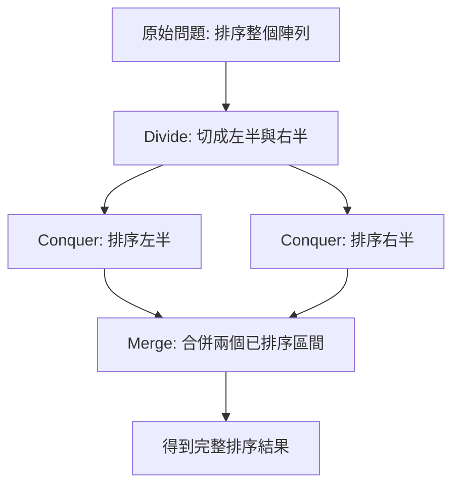
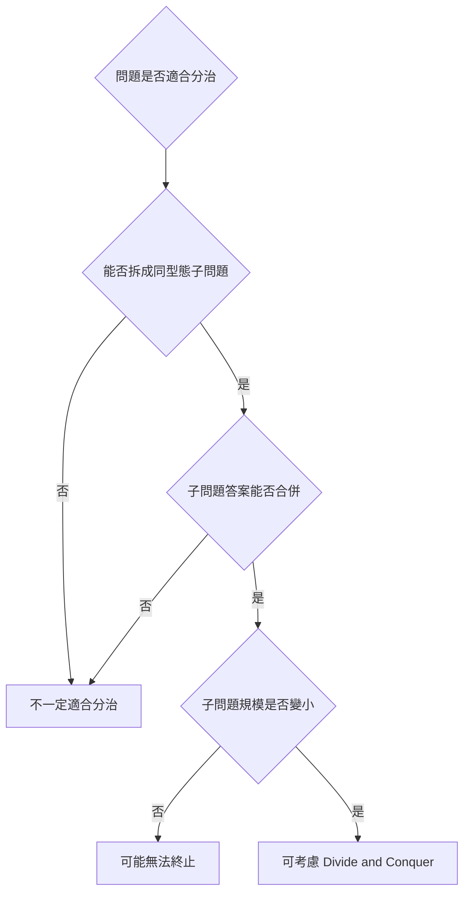
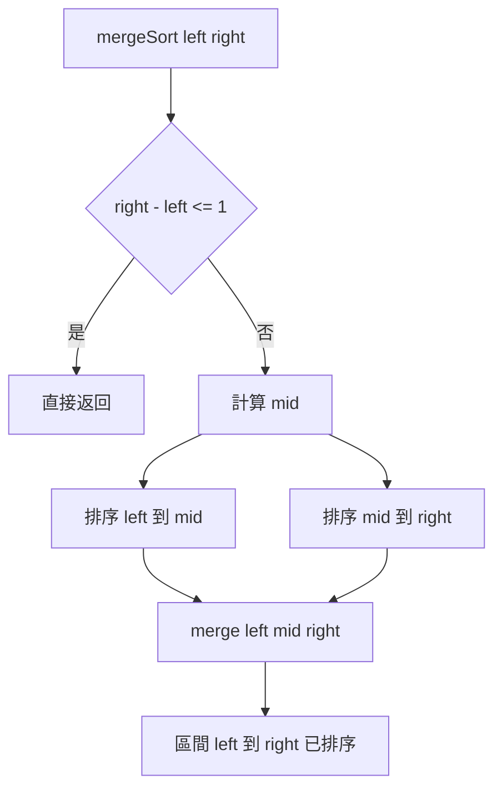
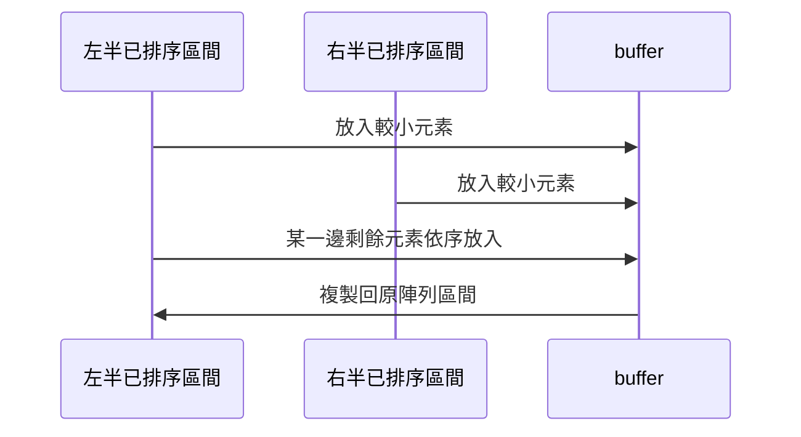
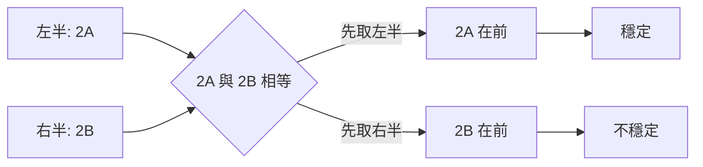
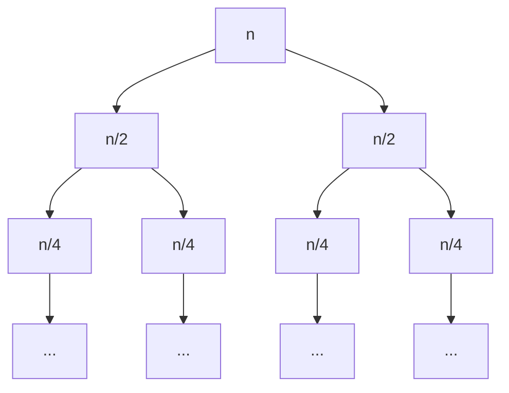

## 第 18 章　Merge Sort 與 Divide and Conquer

### 適用範圍

本章說明 Divide and Conquer 的核心想法，以及它如何用在 Merge Sort。

Merge Sort 是學習分治法時很適合的範例，因為它的流程非常清楚：

- 將大問題切成兩個較小的子問題。
- 分別排序左半部與右半部。
- 將兩個已排序序列合併成一個已排序序列。

本章的重點不是只記住 Merge Sort 的程式，而是看懂「遞迴如何縮小問題」與「合併如何產生答案」。只要能描述每一層遞迴正在處理哪個區間，Merge Sort 的正確性與複雜度就會變得容易分析。



### 適用讀者

- 已理解 Bubble Sort、Selection Sort、Insertion Sort，想學習 O(n log n) 排序的讀者。
- 對遞迴區間、遞迴終止條件與合併流程不熟悉的讀者。
- 想知道 Merge Sort 為什麼穩定、為什麼需要額外空間的讀者。
- 想從 Merge Sort 延伸理解 Counting Inversions 的讀者。
- 想初步理解遞迴樹與 Master Theorem 的讀者。

### 快速導覽

- [18.1 Divide and Conquer 是什麼](#181-divide-and-conquer-是什麼)：建立分治法的基本流程。
- [18.2 分割、解子問題與合併](#182-分割解子問題與合併)：拆解分治法三個階段。
- [18.3 Merge Sort](#183-merge-sort)：用分治法完成排序。
- [18.4 Merge 過程](#184-merge-過程)：合併兩個已排序區間。
- [18.5 Merge Sort 的穩定性](#185-merge-sort-的穩定性)：相同 Key 如何保留順序。
- [18.6 額外空間成本](#186-額外空間成本)：為什麼 Merge Sort 需要暫存空間。
- [18.7 Counting Inversions](#187-counting-inversions)：在合併時順便計算逆序對。
- [18.8 Divide and Conquer 的遞迴樹](#188-divide-and-conquer-的遞迴樹)：觀察每一層工作量。
- [18.9 Master Theorem 初步概念](#189-master-theorem-初步概念)：用公式快速判斷常見遞迴式。
- [18.10 常見錯誤](#1810-常見錯誤)：整理區間、mid 與 merge 的常見問題。
- [18.11 本章檢查表](#1811-本章檢查表)：確認是否掌握核心概念。
- [18.12 本章重點](#1812-本章重點)：回顧本章核心。

### 18.1 Divide and Conquer 是什麼

Divide and Conquer 可以拆成三個步驟：

<table>
<tr><th>階段</th><th>意思</th><th>Merge Sort 中的對應</th></tr>
<tr><td>Divide</td><td>把大問題切成較小問題</td><td>把陣列切成左半與右半</td></tr>
<tr><td>Conquer</td><td>解決子問題</td><td>遞迴排序左半與右半</td></tr>
<tr><td>Combine</td><td>把子問題答案合併</td><td>合併兩個已排序區間</td></tr>
</table>

以排序為例，若要排序：

```text
[5, 2, 4, 1]
```

可以先拆成：

```text
[5, 2] 和 [4, 1]
```

再把每一半排序：

```text
[2, 5] 和 [1, 4]
```

最後合併：

```text
[1, 2, 4, 5]
```

#### 分治法與一般遞迴的差異

不是所有遞迴都適合稱為分治法。分治法通常有幾個特徵：

- 子問題和原問題有相同型態。
- 子問題規模比原問題小。
- 子問題答案可以合併成原問題答案。
- 合併過程有明確規則。



### 18.2 分割、解子問題與合併

分治法的難點通常不在「切開」，而在「合併」。

以 Merge Sort 為例：

- 分割很單純：取中點，把區間切成兩半。
- 解子問題靠遞迴：左半排序、右半排序。
- 合併最重要：兩邊各自排序完成後，如何產生完整排序結果。

#### 區間表示方式

本章使用 Half-open Interval：`[left, right)`。

意思是：

- 包含 `left`。
- 不包含 `right`。
- 區間長度是 `right - left`。

例如：

```text
nums = [5, 2, 4, 1]
區間 [0, 4) 表示整個陣列
區間 [0, 2) 表示 [5, 2]
區間 [2, 4) 表示 [4, 1]
```

使用 Half-open Interval 的好處是切割後左右區間可以自然接起來：

```text
[left, mid) 和 [mid, right)
```

不會重疊，也不會漏掉元素。

#### 終止條件

當區間長度小於等於 1 時，該區間已經排序完成，不需要再切。

```cpp
if (right - left <= 1)
{
    return;
}
```

這個條件同時處理：

- 空區間。
- 單一元素區間。

### 18.3 Merge Sort

Merge Sort 的核心流程是：

1. 若區間長度小於等於 1，直接返回。
2. 找出中點 `mid`。
3. 遞迴排序 `[left, mid)`。
4. 遞迴排序 `[mid, right)`。
5. 合併兩個已排序區間。



#### C++ 完整實作

```cpp
#include <iostream>
#include <vector>

void mergeRange(
    std::vector<int>& nums,
    std::vector<int>& buffer,
    int left,
    int mid,
    int right)
{
    int i = left;
    int j = mid;
    int k = left;

    while (i < mid && j < right)
    {
        if (nums[i] <= nums[j])
        {
            buffer[k] = nums[i];
            ++i;
        }
        else
        {
            buffer[k] = nums[j];
            ++j;
        }
        ++k;
    }

    while (i < mid)
    {
        buffer[k] = nums[i];
        ++i;
        ++k;
    }

    while (j < right)
    {
        buffer[k] = nums[j];
        ++j;
        ++k;
    }

    for (int p = left; p < right; ++p)
    {
        nums[p] = buffer[p];
    }
}

void mergeSortRecursive(
    std::vector<int>& nums,
    std::vector<int>& buffer,
    int left,
    int right)
{
    if (right - left <= 1)
    {
        return;
    }

    int mid = left + (right - left) / 2;

    mergeSortRecursive(nums, buffer, left, mid);
    mergeSortRecursive(nums, buffer, mid, right);
    mergeRange(nums, buffer, left, mid, right);
}

void mergeSort(std::vector<int>& nums)
{
    std::vector<int> buffer(nums.size());
    mergeSortRecursive(nums, buffer, 0, static_cast<int>(nums.size()));
}

int main()
{
    std::vector<int> nums{5, 2, 4, 2, 1};

    mergeSort(nums);

    for (int value : nums)
    {
        std::cout << value << ' ';
    }
    std::cout << '\n';
}
```

輸出：

```text
1 2 2 4 5
```

### 18.4 Merge 過程

Merge 過程的前置條件是：左右兩個區間都已經排序完成。

例如：

```text
左半：[2, 5]
右半：[1, 4]
```

合併時使用兩個指標：

- `i` 指向左半目前尚未合併的第一個元素。
- `j` 指向右半目前尚未合併的第一個元素。

每次比較 `nums[i]` 與 `nums[j]`，把較小者放入暫存區。

<table>
<tr><th>步驟</th><th>左指標</th><th>右指標</th><th>放入</th><th>暫存結果</th></tr>
<tr><td>1</td><td>2</td><td>1</td><td>1</td><td>[1]</td></tr>
<tr><td>2</td><td>2</td><td>4</td><td>2</td><td>[1, 2]</td></tr>
<tr><td>3</td><td>5</td><td>4</td><td>4</td><td>[1, 2, 4]</td></tr>
<tr><td>4</td><td>5</td><td>右半用完</td><td>5</td><td>[1, 2, 4, 5]</td></tr>
</table>



#### Merge 的正確性觀察

因為左右兩邊都已排序，所以目前兩邊的第一個未處理元素，就是各自區間中最小的剩餘元素。

因此，每次從 `nums[i]` 和 `nums[j]` 中選較小者，都能保證它是整個剩餘元素中的最小者。

### 18.5 Merge Sort 的穩定性

Merge Sort 可以是 Stable Sort，但關鍵在 merge 時如何處理相同 Key。

若左半與右半目前元素相同，應該先放左半元素：

```cpp
if (nums[i] <= nums[j])
{
    buffer[k] = nums[i];
    ++i;
}
else
{
    buffer[k] = nums[j];
    ++j;
}
```

使用 `<=` 的原因是：

- 相同值時，左半元素在原始陣列中通常較早出現。
- 先放左半元素，就能保留相同 Key 的原始相對順序。

若改成 `<`，當兩者相等時會先放右半元素，穩定性可能被破壞。

#### 穩定性範例

```text
原始資料：[2A, 1, 2B]
排序結果應為：[1, 2A, 2B]
```

若 merge 時相同 Key 先取左半，2A 會保留在 2B 前面。



### 18.6 額外空間成本

Merge Sort 典型實作需要一個暫存陣列，大小與原陣列相同。

原因是合併兩個已排序區間時，若直接在原陣列中插入或搬移，會讓元素大量移動，程式也更複雜。

使用 `buffer` 可以讓 merge 過程保持簡單：

1. 從原陣列讀左右區間。
2. 將合併結果寫入 `buffer`。
3. 再把 `buffer` 對應區間複製回原陣列。

#### 空間複雜度

- 暫存陣列：O(n)。
- 遞迴呼叫堆疊：O(log n)。
- 總額外空間通常記為 O(n)。

#### 為什麼不要每次遞迴都建立新 buffer

若每次 merge 都建立新的暫存陣列，會增加配置成本，也讓空間使用較不容易管理。

較常見的做法是：

- 在最外層建立一次 `buffer`。
- 每次 merge 重複使用同一個 `buffer` 的對應區間。

### 18.7 Counting Inversions

Inversion 指的是一組 index pair `(i, j)`，其中：

```text
i < j 且 nums[i] > nums[j]
```

例如：

```text
[2, 4, 1, 3]
```

逆序對包含：

- `(2, 1)`
- `(4, 1)`
- `(4, 3)`

共 3 組。

#### 為什麼 Merge Sort 能計算 Inversions

在 merge 時，左半與右半都已排序。

如果 `nums[i] > nums[j]`，表示右半的 `nums[j]` 比左半目前元素還小。因為左半已排序，所以從 `i` 到 `mid - 1` 的所有元素都大於 `nums[j]`。

因此一次可以增加：

```text
mid - i
```

組逆序對。

```mermaid
flowchart LR
    A[左半已排序] --> B[nums[i] > nums[j]]
    C[右半已排序] --> B
    B --> D[左半 i 到 mid-1 都大於 nums[j]]
    D --> E[逆序對增加 mid - i]
```

#### C++ 計算逆序對

```cpp
#include <vector>

long long mergeAndCount(
    std::vector<int>& nums,
    std::vector<int>& buffer,
    int left,
    int mid,
    int right)
{
    int i = left;
    int j = mid;
    int k = left;
    long long inversions = 0;

    while (i < mid && j < right)
    {
        if (nums[i] <= nums[j])
        {
            buffer[k++] = nums[i++];
        }
        else
        {
            buffer[k++] = nums[j++];
            inversions += mid - i;
        }
    }

    while (i < mid)
    {
        buffer[k++] = nums[i++];
    }

    while (j < right)
    {
        buffer[k++] = nums[j++];
    }

    for (int p = left; p < right; ++p)
    {
        nums[p] = buffer[p];
    }

    return inversions;
}

long long sortAndCount(
    std::vector<int>& nums,
    std::vector<int>& buffer,
    int left,
    int right)
{
    if (right - left <= 1)
    {
        return 0;
    }

    int mid = left + (right - left) / 2;

    long long count = 0;
    count += sortAndCount(nums, buffer, left, mid);
    count += sortAndCount(nums, buffer, mid, right);
    count += mergeAndCount(nums, buffer, left, mid, right);

    return count;
}

long long countInversions(std::vector<int> nums)
{
    std::vector<int> buffer(nums.size());
    return sortAndCount(nums, buffer, 0, static_cast<int>(nums.size()));
}
```

這裡使用 `long long`，因為逆序對數量最多可接近 `n * (n - 1) / 2`。

### 18.8 Divide and Conquer 的遞迴樹

Merge Sort 的遞迴式可以寫成：

```text
T(n) = 2T(n / 2) + O(n)
```

意思是：

- `2T(n / 2)`：把問題分成兩個大小約為 n / 2 的子問題。
- `O(n)`：合併兩個已排序區間需要線性時間。

遞迴樹可以這樣看：



每一層的總合併成本約為 O(n)：

<table>
<tr><th>層級</th><th>子問題數量</th><th>每個子問題大小</th><th>該層總工作量</th></tr>
<tr><td>0</td><td>1</td><td>n</td><td>O(n)</td></tr>
<tr><td>1</td><td>2</td><td>n / 2</td><td>O(n)</td></tr>
<tr><td>2</td><td>4</td><td>n / 4</td><td>O(n)</td></tr>
<tr><td>...</td><td>...</td><td>...</td><td>O(n)</td></tr>
</table>

總共有約 `log n` 層，因此總時間為：

```text
O(n log n)
```

### 18.9 Master Theorem 初步概念

Master Theorem 用來快速分析某些常見分治遞迴式。

常見形式是：

```text
T(n) = aT(n / b) + f(n)
```

其中：

<table>
<tr><th>符號</th><th>意思</th><th>Merge Sort 中的值</th></tr>
<tr><td>a</td><td>子問題數量</td><td>2</td></tr>
<tr><td>b</td><td>每個子問題縮小倍率</td><td>2</td></tr>
<tr><td>f(n)</td><td>分割與合併成本</td><td>O(n)</td></tr>
</table>

Merge Sort：

```text
T(n) = 2T(n / 2) + O(n)
```

每一層總工作量是 O(n)，層數是 O(log n)，所以結果是 O(n log n)。

本章只需要先掌握這個直覺。更完整的 Master Theorem 會處理 `f(n)` 比子問題成本大很多、差不多或小很多等情況。

### 18.10 常見錯誤

<table>
<tr><th>現象</th><th>可能原因</th><th>第一輪檢查</th></tr>
<tr><td>遞迴停不下來</td><td>終止條件錯誤或區間沒有縮小</td><td>檢查 `right - left <= 1` 與 mid 計算</td></tr>
<tr><td>漏掉元素</td><td>左右區間端點不一致</td><td>統一使用 `[left, right)`</td></tr>
<tr><td>元素重複或消失</td><td>merge 後沒有正確複製回原陣列</td><td>檢查 `for (p = left; p < right; ++p)`</td></tr>
<tr><td>排序結果不穩定</td><td>相等時先取右半</td><td>穩定版本應使用 `<=` 先取左半</td></tr>
<tr><td>讀取越界</td><td>while 條件或剩餘元素處理錯誤</td><td>確認 `i < mid`、`j < right`</td></tr>
<tr><td>逆序對數量溢位</td><td>使用 int 保存答案</td><td>改用 `long long`</td></tr>
<tr><td>配置成本過高</td><td>每次 merge 都建立新 vector</td><td>最外層建立一次 buffer 並重複使用</td></tr>
</table>

#### mid 的安全寫法

```cpp
int mid = left + (right - left) / 2;
```

這種寫法比 `(left + right) / 2` 更安全，因為可以降低 `left + right` 在極大數值時溢位的風險。

### 18.11 本章檢查表

- 我能說明 Divide and Conquer 的 Divide、Conquer、Combine 三個階段。
- 我能使用 `[left, right)` 表示遞迴區間。
- 我能說明 Merge Sort 的遞迴終止條件。
- 我能手動追蹤 `[5, 2, 4, 1]` 的分割與合併流程。
- 我能寫出 merge 兩個已排序區間的流程。
- 我知道 Merge Sort 的時間複雜度是 O(n log n)。
- 我知道 Merge Sort 典型實作需要 O(n) 額外空間。
- 我能說明 Merge Sort 如何保持穩定性。
- 我知道相等時先取左半元素可以保留原始相對順序。
- 我能說明 Counting Inversions 為什麼可以在 merge 時完成。
- 我知道逆序對數量應使用 `long long`。
- 我能用遞迴樹說明每層 O(n)、共 O(log n) 層。
- 我能避免區間端點、mid 與 buffer 複製錯誤。

### 18.12 本章重點

- Divide and Conquer 透過分割、解子問題、合併來解決問題。
- Merge Sort 是分治法的典型排序演算法。
- Merge Sort 將陣列切成兩半，分別排序後再合併。
- Merge 的前置條件是左右兩半都已排序。
- Merge 過程每次選出左右目前最小的剩餘元素。
- 使用 `[left, right)` 可以讓區間切分更一致。
- Merge Sort 的時間複雜度是 O(n log n)。
- Merge Sort 典型實作需要 O(n) 額外空間。
- 相同 Key 時先取左半元素，可以讓 Merge Sort 保持穩定。
- Counting Inversions 可以利用 merge 時左右區間已排序的性質。
- 遞迴樹能幫助理解為什麼 Merge Sort 每層 O(n)、共有 O(log n) 層。
