## 第 19 章　Quick Sort 與 Quick Select

### 適用範圍

本章介紹 Partition、Lomuto Partition、Hoare Partition、Three-way Partition、Quick Sort、Randomized Quick Sort 與 Quick Select，重點放在區間定義、Pivot 語意、Partition Postcondition、遞迴範圍及平均與最差複雜度。

Quick Sort 與 Quick Select 都利用 Partition 重新排列資料，但兩者目的不同：

- Quick Sort 需要繼續處理 Pivot 兩側，最後讓整個區間排序完成。
- Quick Select 只需保留包含目標排名的一側，不必完成全部排序。

這類演算法最常見的問題不是 Swap 本身，而是不同 Partition 版本具有不同回傳語意。如果把 Lomuto 的回傳位置套進 Hoare 的遞迴範圍，或混用 Inclusive 與 Half-open Interval，可能出現漏排、越界或無窮遞迴。

本章會建立一套固定流程：

1. 明確定義處理區間。
2. 定義 Pivot Value 與 Pivot Node 是否需要位於最終位置。
3. 寫出 Partition 完成後各區域的 Postcondition。
4. 根據回傳值語意推導遞迴或迭代範圍。
5. 確認每次遞迴處理嚴格較小的區間。
6. 分析分割是否平衡，以及遞迴深度。
7. 對大量重複值評估 Three-way Partition。
8. Quick Select 只保留包含 Target Index 的一側。
9. 使用空、單一元素、全部相同、已排序與反向排序資料測試。

### 適用讀者

- 能背 Quick Sort 程式，但不清楚 Partition Postcondition 的讀者。
- 容易混用 Lomuto 與 Hoare 遞迴邊界的讀者。
- 在已排序或全部相同資料上遇到深遞迴的讀者。
- 不清楚 Pivot 選擇為何影響複雜度的讀者。
- 需要找第 K 小或第 K 大，但不需要完整排序的讀者。
- 想理解 Average O(n log n) 與 Worst-case O(n²) 的讀者。
- 需要區分 Stable Sort、In-place 與額外 Stack 空間的讀者。

### 快速導覽

- [Partition 到底保證什麼](#191-partition-到底保證什麼)
- [第一步：定義區間與 Pivot](#192-第一步定義區間與-pivot)
- [Lomuto Partition](#193-lomuto-partition)
- [完整案例：Lomuto 逐輪追蹤](#194-完整案例lomuto-逐輪追蹤)
- [Hoare Partition](#195-hoare-partition)
- [Lomuto 與 Hoare 的差異](#196-lomuto-與-hoare-的差異)
- [Quick Sort](#197-quick-sort)
- [正確性與終止性](#198-正確性與終止性)
- [Pivot 的選擇](#199-pivot-的選擇)
- [平均與最差情況](#1910-平均與最差情況)
- [Randomized Quick Sort](#1911-randomized-quick-sort)
- [Three-way Partition](#1912-three-way-partition)
- [Quick Select](#1913-quick-select)
- [完整案例：第 K 小](#1914-完整案例第-k-小)
- [第 K 大與 Index 轉換](#1915-第-k-大與-index-轉換)
- [實務排序選擇](#1916-實務排序選擇)
- [C 語言中的實作](#1917-c-語言中的實作)
- [系統化 Debug](#1918-系統化-debug)
- [常見問題與判讀](#1919-常見問題與判讀)
- [本章檢查表](#1920-本章檢查表)
- [本章重點](#1921-本章重點)

### 19.1 Partition 到底保證什麼

Partition 接收一段資料與 Pivot Value，重新排列元素，使資料依照和 Pivot 的關係分區。

常見 Postcondition：

```text
左區元素 <= Pivot
右區元素 >= Pivot
```

或 Three-way Partition：

```text
左區 < Pivot
中區 == Pivot
右區 > Pivot
```

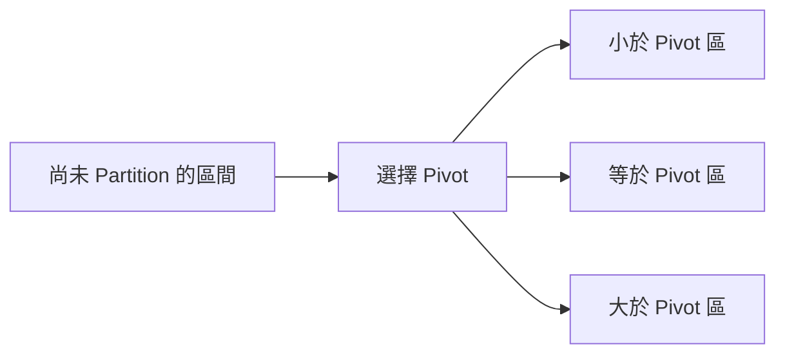

Partition 不一定完成排序。左區內部與右區內部仍可能無序。它只建立後續遞迴或選擇所需的區域關係。

#### Pivot Value 與 Pivot 位置

需要區分：

- Pivot Value：用來比較的數值。
- Pivot Element：原輸入中被選為 Pivot 的那一個元素。
- Partition Boundary：回傳後兩區的分界。
- Final Pivot Index：該 Pivot Element 最終排序位置。

Lomuto 通常把 Pivot Element 放到最終位置並回傳該 Index。Hoare 通常回傳分界，不保證某一個 Pivot Element 位於回傳位置。

### 19.2 第一步：定義區間與 Pivot

本章主要以 Inclusive Interval `[low, high]` 示範：

```text
有效元素：low, low + 1, ..., high
區間長度：high - low + 1
空區間：low > high
```

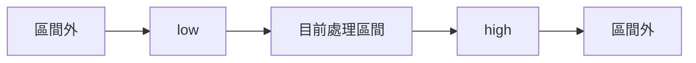

開始寫 Partition 前，應先寫出：

- Pivot 從哪個位置取得。
- 掃描 Index 的範圍。
- 已分類區域有哪些。
- 尚未分類區域有哪些。
- 回傳值是 Pivot Final Index 還是 Boundary。

### 19.3 Lomuto Partition

Lomuto Partition 常選擇 `values[high]` 作為 Pivot，並用 `store` 表示下一個小於等於 Pivot 的元素應放置的位置。

```cpp
#include <utility>
#include <vector>

int lomutoPartition(
    std::vector<int>& values,
    int low,
    int high)
{
    const int pivot = values[high];
    int store = low;

    for (int scan = low; scan < high; ++scan)
    {
        if (values[scan] <= pivot)
        {
            std::swap(values[store], values[scan]);
            ++store;
        }
    }

    std::swap(values[store], values[high]);
    return store;
}
```

#### 區域 Invariant

每輪開始前：

```text
[low, store)    <= Pivot
[store, scan)   > Pivot
[scan, high)    尚未分類
high            Pivot Element
```

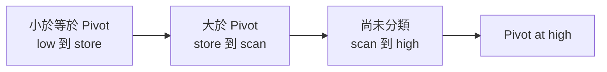

若 `values[scan] <= pivot`，便把它交換到 `store`，再增加 `store`。否則它自然擴充大於 Pivot 的區域。

最後把 Pivot Element 交換到 `store`：

```text
[low, store)     <= Pivot
store            Pivot Element
(store, high]    > Pivot
```

回傳值 `store` 是 Pivot Final Index。

### 19.4 完整案例：Lomuto 逐輪追蹤

輸入：

```text
[5, 2, 4, 2, 1]
Pivot = 1
```

由於沒有元素小於等於 1，`store` 保持在 0，最後交換 Index 0 與 4：

```text
[1, 2, 4, 2, 5]
```

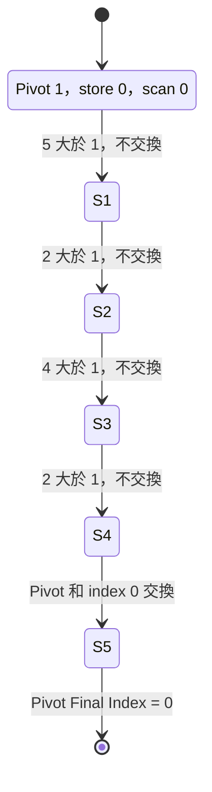

另一案例：

```text
[3, 1, 4, 2, 5, 2]
Pivot = 2
```

| Scan Value | 動作 | Store |
|---:|---|---:|
| 3 | 不交換 | 0 |
| 1 | 與 Store 交換 | 1 |
| 4 | 不交換 | 1 |
| 2 | 與 Store 交換 | 2 |
| 5 | 不交換 | 2 |

最後 Pivot 放到 Index 2，左側皆 `<= 2`，右側皆 `> 2`。

#### `<=` 與 `<` 的差異

若使用 `<=`，相等元素被放到左區。全部相同資料會產生極度不平衡分割。改用 `<` 只會讓相等元素集中到另一側，仍不會根本解決大量重複值問題。Three-way Partition 更適合處理相等區。

### 19.5 Hoare Partition

Hoare Partition 使用左右掃描 Pointer，尋找放錯區域的元素並交換。

```cpp
int hoarePartition(
    std::vector<int>& values,
    int low,
    int high)
{
    const int pivot = values[low + (high - low) / 2];
    int left = low - 1;
    int right = high + 1;

    while (true)
    {
        do
        {
            ++left;
        }
        while (values[left] < pivot);

        do
        {
            --right;
        }
        while (values[right] > pivot);

        if (left >= right)
        {
            return right;
        }

        std::swap(values[left], values[right]);
    }
}
```

#### 回傳 Postcondition

回傳 `boundary` 後：

```text
[low, boundary]      <= Pivot
[boundary + 1, high] >= Pivot
```

但 `boundary` 不一定是某一個 Pivot Element 的最終排序位置。

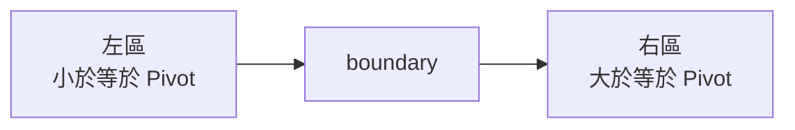

#### 遞迴範圍

Hoare Quick Sort 應使用：

```text
[low, boundary]
[boundary + 1, high]
```

不能直接套用 Lomuto 的 `boundary - 1` 與 `boundary + 1`，因為回傳語意不同。

#### 為何相等時停止掃描

左右掃描分別在 `>= Pivot` 與 `<= Pivot` 的位置停止。即使兩個值都等於 Pivot，也可以交換並讓 Pointer 繼續前進，避免全部相同元素時掃描停住。

### 19.6 Lomuto 與 Hoare 的差異

| 比較項目 | Lomuto | Hoare |
|---|---|---|
| 常見 Pivot | 最右元素 | 中間值或某個區間值 |
| 回傳語意 | Pivot Final Index | 兩區 Boundary |
| 遞迴範圍 | `[low,p-1]`、`[p+1,high]` | `[low,p]`、`[p+1,high]` |
| Swap 次數 | 通常較多 | 通常較少 |
| 推理難度 | 區域較直觀 | Pointer 邊界較容易混淆 |

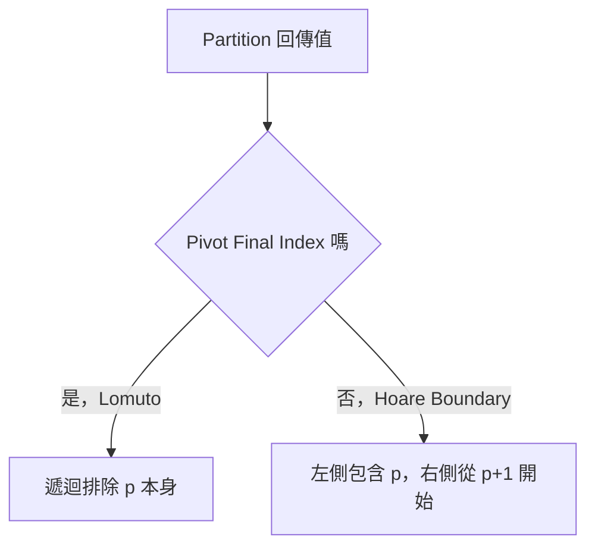

選擇哪一版本不是只看程式長度。必須讓 Partition、回傳語意與遞迴範圍保持同一套規格。

### 19.7 Quick Sort

#### Lomuto 版本

```cpp
void quickSort(
    std::vector<int>& values,
    int low,
    int high)
{
    if (low >= high)
    {
        return;
    }

    const int pivotIndex =
        lomutoPartition(values, low, high);

    quickSort(values, low, pivotIndex - 1);
    quickSort(values, pivotIndex + 1, high);
}
```

呼叫入口：

```cpp
if (!values.empty())
{
    quickSort(
        values,
        0,
        static_cast<int>(values.size()) - 1);
}
```

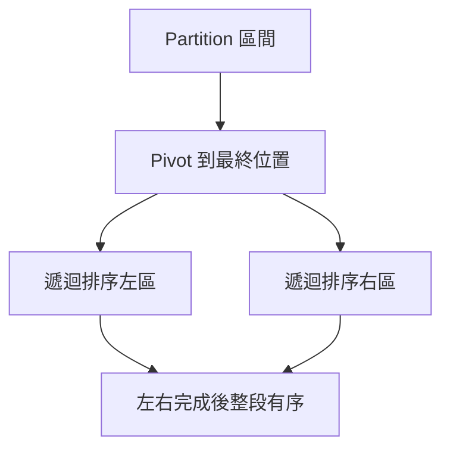

Quick Sort 不需要 Merge。Partition 直接在原 Array 中建立兩個子問題。

### 19.8 正確性與終止性

#### Base Case

`low >= high` 表示區間有 0 或 1 個元素，已自然排序。

#### Partition 正確性

Lomuto 完成後：

- Pivot 左側元素皆不大於 Pivot。
- Pivot 位於最終排序位置。
- Pivot 右側元素皆大於 Pivot。

#### 遞迴組合

假設左右嚴格較小區間都能正確排序。左區所有元素不大於 Pivot，右區所有元素大於 Pivot，所以：

```text
排序左區 + Pivot + 排序右區
```

形成完整排序區間。

#### 終止性

Lomuto 的 Pivot Index 位於 `[low, high]`，遞迴排除 Pivot 本身：

```text
左區長度 < 原區間長度
右區長度 < 原區間長度
```

因此最終會到達 0 或 1 個元素。

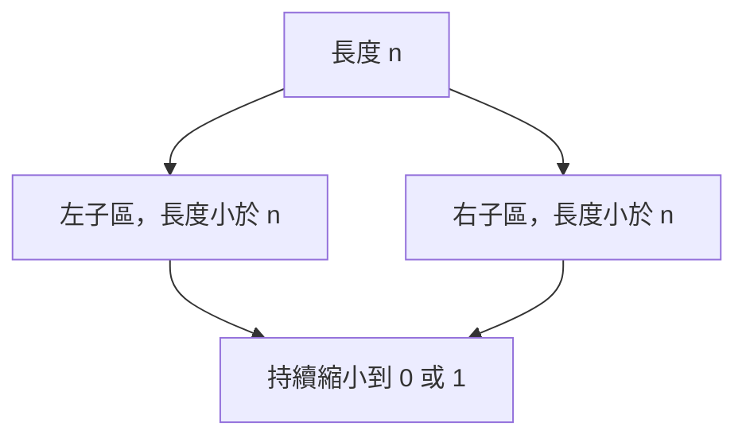

### 19.9 Pivot 的選擇

常見策略：

- 第一個元素。
- 最後一個元素。
- 中間位置元素。
- 隨機元素。
- Median-of-three。

Pivot 目標不是找出真正中位數，而是避免長期產生極端不平衡分割。

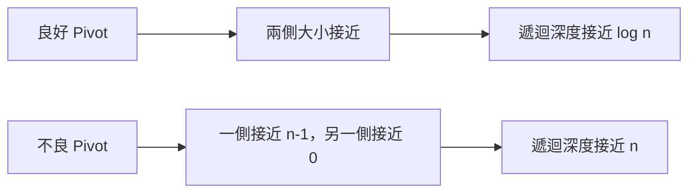

固定選第一個或最後一個元素時，已排序資料可能觸發最差分割。隨機 Pivot 降低特定輸入排列持續觸發最差情況的機率，但不消除理論最差情況。

### 19.10 平均與最差情況

#### 平衡分割

每層總共處理 O(n) 個元素，深度約 O(log n)：

```text
T(n) = 2T(n/2) + O(n)
     = O(n log n)
```

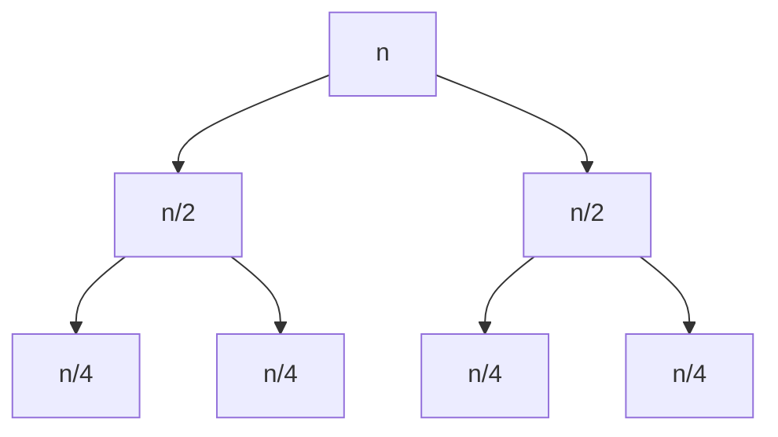

#### 極端不平衡

每次只確定一個元素：

```text
T(n) = T(n - 1) + O(n)
     = O(n²)
```

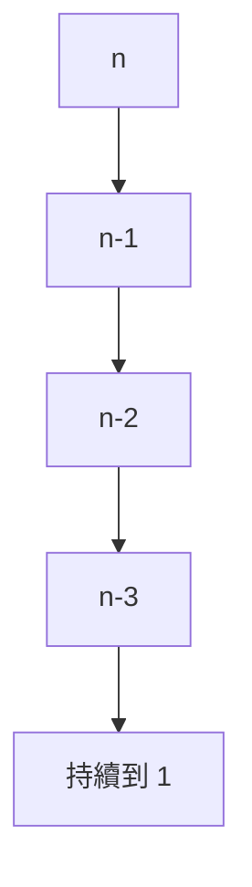

#### 空間複雜度

Partition 本身可為 O(1) 額外空間，但遞迴 Call Stack：

- 平均或平衡情況 O(log n)。
- 最差情況 O(n)。

因此稱 Quick Sort 為 In-place 時，通常指不建立 O(n) 輔助 Array，不代表完全沒有遞迴 Stack。

### 19.11 Randomized Quick Sort

Randomized Quick Sort 在每次 Partition 前隨機選 Pivot，交換到 Partition 預期位置。

```cpp
#include <random>

int randomizedPartition(
    std::vector<int>& values,
    int low,
    int high,
    std::mt19937& generator)
{
    std::uniform_int_distribution<int> distribution(low, high);
    const int pivotIndex = distribution(generator);
    std::swap(values[pivotIndex], values[high]);
    return lomutoPartition(values, low, high);
}
```

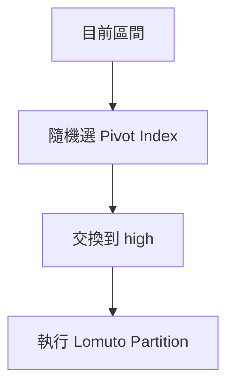

#### 測試重現

隨機演算法的失敗案例應保存：

- 完整輸入。
- Random Seed。
- Pivot 選擇序列，或可重現 Seed。

Randomized 不表示結果順序不同。排序結果仍應相同，差異在執行路徑與複雜度分布。

### 19.12 Three-way Partition

大量重複值時，可將區間分成：

```text
[low, less)          < Pivot
[less, scan)         == Pivot
[scan, greater]      尚未處理
(greater, high]      > Pivot
```

```cpp
#include <utility>

std::pair<int, int> threeWayPartition(
    std::vector<int>& values,
    int low,
    int high,
    int pivot)
{
    int less = low;
    int scan = low;
    int greater = high;

    while (scan <= greater)
    {
        if (values[scan] < pivot)
        {
            std::swap(values[less], values[scan]);
            ++less;
            ++scan;
        }
        else if (values[scan] > pivot)
        {
            std::swap(values[scan], values[greater]);
            --greater;
        }
        else
        {
            ++scan;
        }
    }

    return {less, greater};
}
```

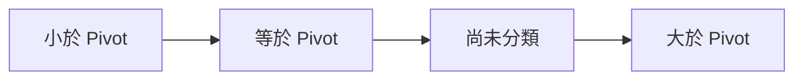

#### 為何交換右側後不增加 Scan

從 `greater` 交換回來的元素尚未分類，必須留在 `scan` 再檢查。若立即增加 Scan，可能漏掉它。

Partition 完成後，只需遞迴：

```text
[low, less - 1]
[greater + 1, high]
```

等於 Pivot 的整段不需再處理。全部相同資料可一次完成 Partition，避免形成長鏈遞迴。

### 19.13 Quick Select

Quick Select 找排序後 Target Index 的元素，但不需要完整排序。

Lomuto Partition 完成後：

- 若 `pivotIndex == target`，答案確定。
- 若 `target < pivotIndex`，只搜尋左側。
- 若 `target > pivotIndex`，只搜尋右側。

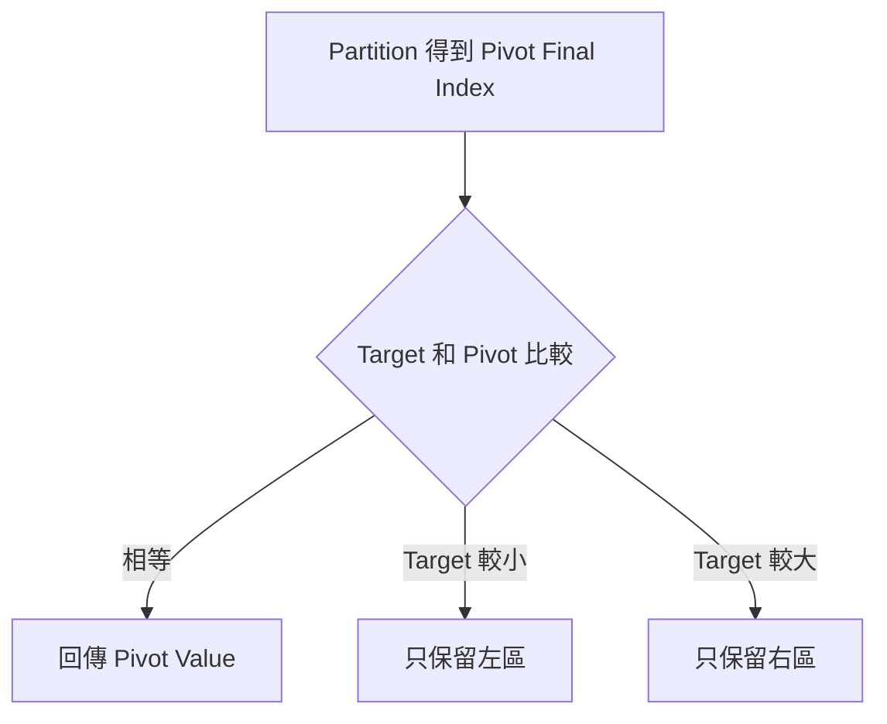

Quick Sort 處理兩側，Quick Select 每輪只處理一側。

### 19.14 完整案例：第 K 小

題目中的第 K 小通常使用 1-based K：

```text
第 1 小 → Sorted Index 0
第 K 小 → Sorted Index k - 1
```

```cpp
#include <optional>
#include <vector>

std::optional<int> quickSelectKthSmallest(
    std::vector<int> values,
    int k)
{
    if (k <= 0 ||
        k > static_cast<int>(values.size()))
    {
        return std::nullopt;
    }

    const int target = k - 1;
    int low = 0;
    int high = static_cast<int>(values.size()) - 1;

    while (low <= high)
    {
        const int pivotIndex =
            lomutoPartition(values, low, high);

        if (pivotIndex == target)
        {
            return values[pivotIndex];
        }

        if (target < pivotIndex)
        {
            high = pivotIndex - 1;
        }
        else
        {
            low = pivotIndex + 1;
        }
    }

    return std::nullopt;
}
```

此介面按值接收 `values`，因此不修改呼叫端資料。若輸入很大且允許修改，可改為 Reference 以避免完整複製。

#### Loop Invariant

每輪開始前：

> 排序後 Target Index 對應的元素仍位於 `[low, high]`。

Partition 後 Pivot 已位於最終 Index。若 Target 在一側，另一側全部 Index 都不可能是答案，可以安全排除。

#### 複雜度

- 平均時間 O(n)。
- 最差時間 O(n²)。
- Iterative 版本額外控制空間 O(1)，不含輸入副本。

平均 O(n) 的直覺是每輪只保留一側，平均候選數快速縮小：

```text
n + n/2 + n/4 + ... = O(n)
```

### 19.15 第 K 大與 Index 轉換

排序升冪後：

```text
第 K 大的 Index = n - k
```

例如 n = 5：

```text
第 1 大 → Index 4
第 2 大 → Index 3
第 5 大 → Index 0
```

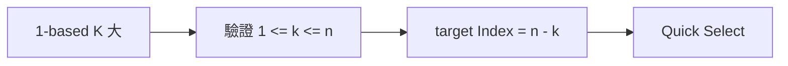

必須先驗證 K，否則 `n - k` 可能落在區間外。若題目把重複元素分別計入排名，Quick Select 可直接使用。若要求第 K 個不同值，必須先定義去重語意，問題已不同。

### 19.16 實務排序選擇

手寫 Quick Sort 適合學習 Partition 與選擇演算法，但一般 C++ 專案通常優先使用標準函式庫。

| 需求 | 常見選擇 |
|---|---|
| 一般排序，不要求穩定 | `std::sort` |
| 相同 Key 保留原順序 | `std::stable_sort` |
| 只需第 K 個位置正確 | `std::nth_element` |
| 只需前一段有序 | `std::partial_sort` |

`std::sort` 不應被假設為單純 Quick Sort。標準規範重點在介面與複雜度要求，具體實作可採混合策略。

Comparator 必須符合 Strict Weak Ordering。錯誤 Comparator 可能破壞排序演算法假設：

```cpp
// 不應使用 <= 作為一般升冪 Comparator。
return a < b;
```

Quick Sort 一般不穩定，因為跨區交換可能改變相同 Key 元素的相對順序。

### 19.17 C 語言中的實作

```c
#include <stddef.h>

static void swap_int(int *a, int *b)
{
    int temporary = *a;
    *a = *b;
    *b = temporary;
}

static size_t lomuto_partition(
    int values[],
    size_t low,
    size_t high)
{
    int pivot = values[high];
    size_t store = low;

    for (size_t scan = low; scan < high; ++scan)
    {
        if (values[scan] <= pivot)
        {
            swap_int(&values[store], &values[scan]);
            ++store;
        }
    }

    swap_int(&values[store], &values[high]);
    return store;
}
```

使用 `size_t` 時要特別注意 `pivotIndex - 1` 的 Underflow。遞迴前應先檢查 Pivot 是否大於 Low，或改用能安全表示空 Closed Interval 的 Signed Index。

```c
if (pivot_index > low)
{
    quick_sort(values, low, pivot_index - 1);
}
```

C 函式還需要明確傳入 Array Length，並確認輸入 Pointer 與區間合法。

### 19.18 系統化 Debug

Partition 每輪建議記錄：

```text
low
high
pivot value
scan / left / right
store 或 boundary
交換前 Value
交換後各區域
Partition Postcondition
```

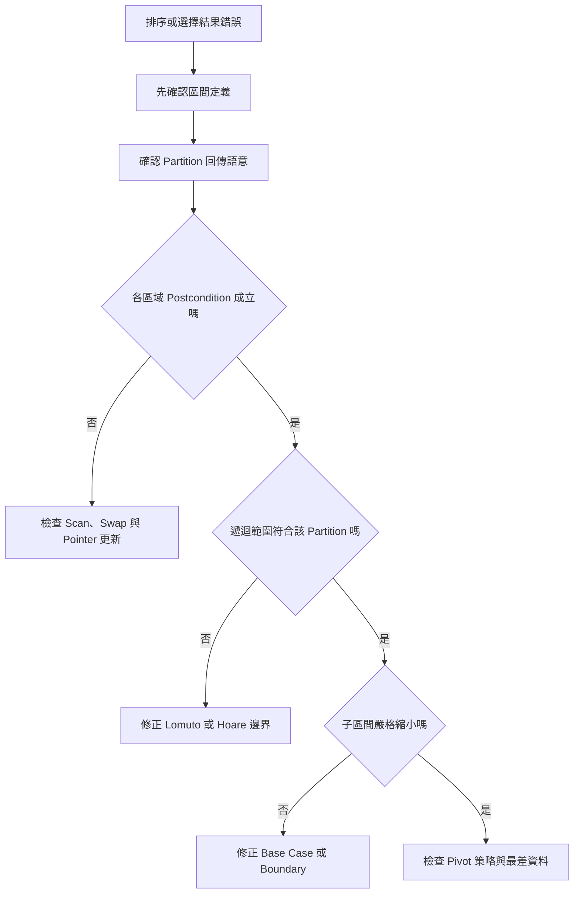

重要測試：

- 空 Array。
- 單一元素。
- 兩個元素，升冪與降冪。
- 已排序。
- 反向排序。
- 全部相同。
- 大量重複值。
- 負數、0、`INT_MIN`、`INT_MAX`。
- Pivot 每次成為最小或最大值的資料。
- Quick Select 的 `k = 1` 與 `k = n`。

### 19.19 常見問題與判讀

| 現象 | 可能原因 | 第一輪檢查 |
|---|---|---|
| Partition 後 Pivot 位置判斷錯 | 把 Hoare Boundary 當 Final Index |確認回傳語意 |
| Quick Sort 漏排一段 | 遞迴邊界混用 | Lomuto 與 Hoare 範圍是否一致 |
| 無窮遞迴 | 子區間未嚴格縮小 | Base Case 與 Boundary 是否正確 |
| 已排序資料很慢 | 固定端點 Pivot 產生壞分割 | 隨機 Pivot 或混合策略 |
| 全部相同資料很慢 | 相等元素集中單側 | Three-way Partition |
| Three-way 漏分類 | 從右側交換後仍增加 Scan | 新交換值尚未檢查 |
| Quick Select 回傳錯排名 | 1-based K 未轉成 Index | 第 K 小為 `k-1` |
| 第 K 大轉換錯誤 | 使用 `n-k+1` 當 Index | 升冪 Index 應為 `n-k` |
| 大資料 Stack Overflow | 最差遞迴深度 O(n) | Pivot、尾遞迴消除或迭代策略 |
| 相同 Key 順序改變 | Quick Sort 不穩定 | 是否需要 `stable_sort` |
| C 版本出現巨大 Index | Unsigned 的 `p-1` Underflow | 遞迴前先檢查 `p > low` |
| 隨機失敗無法重現 | 未保存 Seed | 記錄 Seed 與 Pivot 路徑 |

### 19.20 本章檢查表

- 我能說明 Partition 只建立區域關係，不一定完成排序。
- 我能區分 Pivot Value、Pivot Element、Boundary 與 Final Index。
- 我會先定義 Inclusive 或 Half-open Interval。
- 我能寫出 Lomuto 的四段 Invariant。
- 我知道 Lomuto 回傳 Pivot Final Index。
- 我知道 Hoare 回傳兩區 Boundary。
- 我不會混用 Lomuto 與 Hoare 的遞迴範圍。
- 我能說明 Quick Sort 的 Base Case、遞迴正確性與終止性。
- 我知道平衡分割產生 O(n log n)，極端分割產生 O(n²)。
- 我知道 In-place 不代表沒有遞迴 Stack。
- 我能說明隨機 Pivot 降低特定壞輸入的風險，但不消除理論最差情況。
- 我會保存 Random Seed 以重現失敗。
- 我能定義 Three-way Partition 的四個區域。
- 我知道從 Greater 側交換後為何不能立即增加 Scan。
- 我能說明 Quick Select 為何只保留一側。
- 我能把第 K 小轉成 `k-1`，第 K 大轉成 `n-k`。
- 我會驗證 K 位於 `[1,n]`。
- 我知道 Quick Select 平均 O(n)、最差 O(n²)。
- 我能依穩定性與需求選擇 `sort`、`stable_sort` 或 `nth_element`。
- 我會以 Partition Postcondition 與遞迴範圍進行 Debug。

### 19.21 本章重點

- Partition 的核心是建立 Pivot 左右的區域關係，不等於完成排序。
- Lomuto 通常回傳 Pivot Final Index，Hoare 通常回傳兩區 Boundary。
- Partition 回傳語意決定 Quick Sort 的遞迴範圍，兩套規則不能混用。
- Quick Sort 對 Pivot 兩側遞迴；Quick Select 只保留含 Target Index 的一側。
- 平衡分割使 Quick Sort 接近 O(n log n)，極端分割會退化為 O(n²)。
- Pivot 策略影響分割品質與遞迴深度。
- Randomized Pivot 改變最差輸入持續出現的機率，測試時應保存 Seed。
- 大量重複值適合 Three-way Partition，等於 Pivot 的區段不必再處理。
- Quick Select 找第 K 小時使用 `k-1`，找第 K 大時使用 `n-k`。
- Quick Select 平均只需線性時間，但仍有 O(n²) 最差情況。
- Quick Sort 一般不穩定，且 In-place 描述通常不包含遞迴 Stack。
- 正確實作應從區間、Invariant、Partition Postcondition 與回傳語意推導，而不是拼接模板。
- 實務 C++ 排序通常優先使用標準函式庫，手寫版本主要用於學習、特殊需求或受控環境。
