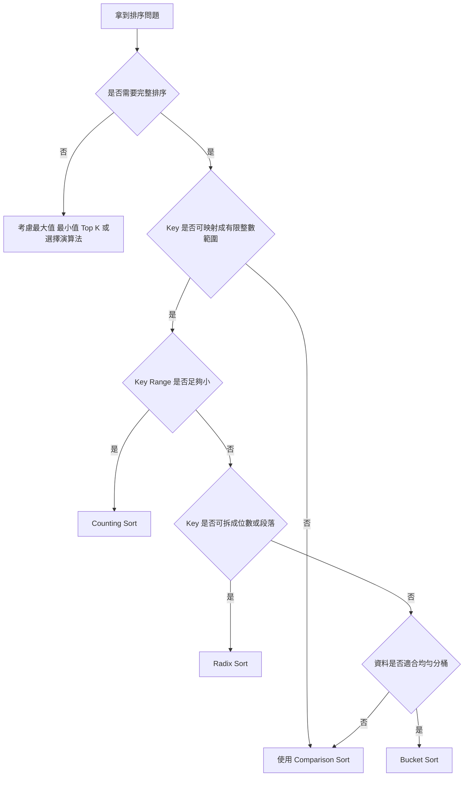
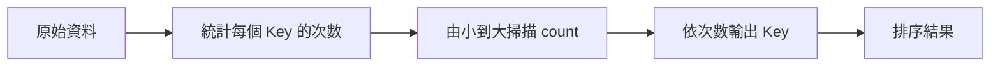
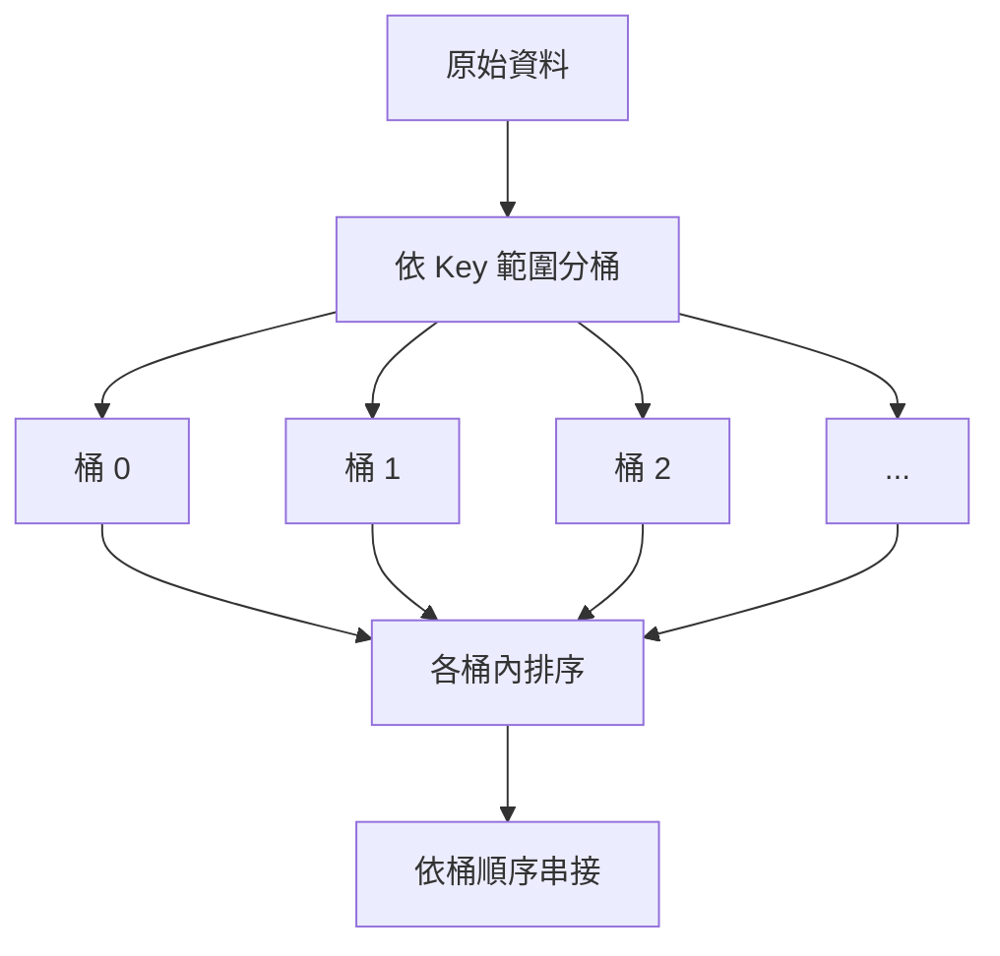
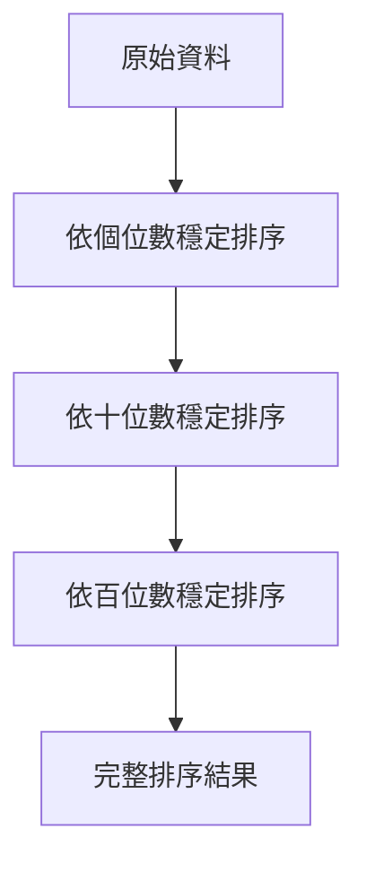
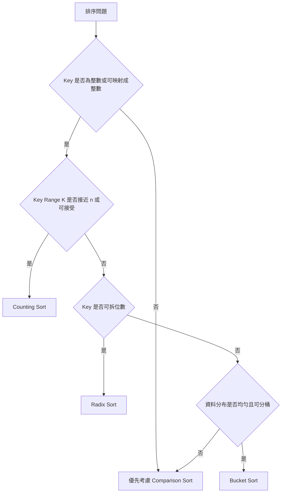

## 第 20 章　非比較排序

### 適用範圍

本章說明不只靠兩兩比較大小的排序方法，也就是 Non-comparison Sorting。

前面章節提到，Comparison Sort 在一般情況下需要 O(n log n) 時間。這個限制來自於排序時只能透過「兩個元素誰在前」來逐步縮小可能排列。如果資料有額外條件，例如 Key 是有限範圍的整數、位數固定，或資料大致均勻分布，就可以不完全依賴比較，而改用計數、分桶或逐位處理。

本章會建立一套固定判斷流程：

- 先確認題目是否真的需要完整排序。
- 確認 Key 是否為整數或可轉成整數。
- 確認 Key Range 是否足夠小。
- 確認是否需要 Stable Sort。
- 確認資料分布是否適合 Bucket Sort。
- 確認 Radix Sort 的每一輪是否使用 Stable Sort。
- 評估時間成本與額外空間成本。



### 適用讀者

- 已理解 `std::sort`、Merge Sort 與 Quick Sort，但想知道何時能低於 O(n log n) 的讀者。
- 遇到小範圍整數排序、分數排序、字元排序，想使用 Counting Sort 的讀者。
- 想理解 Bucket Sort 為什麼依賴資料分布的讀者。
- 想理解 Radix Sort 為什麼需要穩定排序作為子程序的讀者。
- 常因 Key Range、負數、Index 對應或額外空間出錯的讀者。

### 快速導覽

- [20.1 Comparison Sort 的限制](#201-comparison-sort-的限制)：理解 O(n log n) 下界的適用範圍。
- [20.2 Counting Sort](#202-counting-sort)：利用 Key 出現次數排序。
- [20.3 Bucket Sort](#203-bucket-sort)：把資料分配到多個桶中再排序。
- [20.4 Radix Sort](#204-radix-sort)：從低位到高位逐位排序。
- [20.5 Key Range 與額外空間](#205-key-range-與額外空間)：判斷值域是否適合非比較排序。
- [20.6 Stable Counting Sort](#206-stable-counting-sort)：保留相同 Key 的原始相對順序。
- [20.7 適用條件](#207-適用條件)：整理三種非比較排序的使用時機。
- [20.8 常見錯誤](#208-常見錯誤)：整理 Index、負數、穩定性與空間問題。
- [20.9 本章檢查表](#209-本章檢查表)：確認是否完成必要分析。
- [20.10 本章重點](#2010-本章重點)：回顧本章核心。

### 20.1 Comparison Sort 的限制

Comparison Sort 只透過比較兩個元素的先後順序來排序。

例如：

```cpp
return a < b;
```

這類排序方法包含：

- Bubble Sort
- Selection Sort
- Insertion Sort
- Merge Sort
- Quick Sort
- Heap Sort
- `std::sort`
- `std::stable_sort`

在一般完整排序問題中，Comparison Sort 需要 O(n log n) 次比較。原因是 n 個不同元素共有 n! 種可能排列，而每一次比較只能排除一部分可能性。

```mermaid
flowchart TD
    A[n 個元素] --> B[n! 種可能排列]
    B --> C[每次比較只能取得有限資訊]
    C --> D[需要足夠比較次數分辨排列]
    D --> E[一般下界為 O(n log n)]
```

但這個限制只適用於「只靠比較」的排序。如果資料有其他可利用條件，例如每個 Key 都是 0 到 100 的整數，就可以用計數方式直接整理順序。

#### 什麼時候可能避開 O(n log n)

<table>
<tr><th>條件</th><th>可能方法</th><th>原因</th></tr>
<tr><td>Key 範圍很小</td><td>Counting Sort</td><td>直接統計每個 Key 出現次數</td></tr>
<tr><td>Key 可拆成固定位數</td><td>Radix Sort</td><td>逐位排序，不直接比較完整 Key</td></tr>
<tr><td>資料大致均勻分布</td><td>Bucket Sort</td><td>分桶後每桶資料量較小</td></tr>
</table>

### 20.2 Counting Sort

Counting Sort 的核心想法是：

不要比較元素彼此大小，而是統計每個 Key 出現幾次。

如果所有分數都介於 0 到 5：

```text
[5, 2, 4, 2, 1]
```

可以建立 `count[0..5]`：

<table>
<tr><th>Key</th><th>出現次數</th></tr>
<tr><td>0</td><td>0</td></tr>
<tr><td>1</td><td>1</td></tr>
<tr><td>2</td><td>2</td></tr>
<tr><td>3</td><td>0</td></tr>
<tr><td>4</td><td>1</td></tr>
<tr><td>5</td><td>1</td></tr>
</table>

再依照 Key 由小到大輸出：

```text
[1, 2, 2, 4, 5]
```



#### C++ 範例：非負整數 Counting Sort

```cpp
#include <vector>

std::vector<int> countingSortNonNegative(
    const std::vector<int>& nums,
    int maxValue)
{
    std::vector<int> count(maxValue + 1, 0);

    for (int value : nums)
    {
        ++count[value];
    }

    std::vector<int> result;
    result.reserve(nums.size());

    for (int value = 0; value <= maxValue; ++value)
    {
        for (int k = 0; k < count[value]; ++k)
        {
            result.push_back(value);
        }
    }

    return result;
}
```

#### 前置條件

這個版本假設：

- 所有值都是非負整數。
- 所有值都小於等於 `maxValue`。
- `maxValue + 1` 的空間可以接受。

若值含負數，需要做 Index 位移。若值域太大，Counting Sort 可能不合適。

#### 複雜度

令：

- n 是資料數量。
- K 是 Key Range 大小。

Counting Sort 的時間複雜度為：

```text
O(n + K)
```

額外空間複雜度為：

```text
O(K) 或 O(n + K)
```

是否需要 O(n) 額外空間，取決於是否要建立輸出陣列，或是否只輸出 Key 本身。

### 20.3 Bucket Sort

Bucket Sort 的核心想法是：

先把資料依照範圍分到不同桶中，再分別處理每個桶，最後依桶順序串接結果。

例如資料落在 0 到 99，可以建立 10 個桶：

- 0 到 9
- 10 到 19
- 20 到 29
- ...
- 90 到 99



#### Bucket Sort 與 Counting Sort 的差異

<table>
<tr><th>項目</th><th>Counting Sort</th><th>Bucket Sort</th></tr>
<tr><td>基本單位</td><td>每個 Key 一格 count</td><td>一段範圍一個 bucket</td></tr>
<tr><td>適合資料</td><td>整數 Key 且值域不大</td><td>資料分布相對均勻</td></tr>
<tr><td>桶內是否還要排序</td><td>通常不用</td><td>通常需要</td></tr>
<tr><td>風險</td><td>值域太大會浪費空間</td><td>資料集中在少數桶會退化</td></tr>
</table>

#### C++ 範例：0 到 99 的整數 Bucket Sort

```cpp
#include <algorithm>
#include <vector>

std::vector<int> bucketSort0To99(const std::vector<int>& nums)
{
    const int bucketCount = 10;
    std::vector<std::vector<int>> buckets(bucketCount);

    for (int value : nums)
    {
        int index = value / 10;
        buckets[index].push_back(value);
    }

    std::vector<int> result;
    result.reserve(nums.size());

    for (auto& bucket : buckets)
    {
        std::sort(bucket.begin(), bucket.end());

        for (int value : bucket)
        {
            result.push_back(value);
        }
    }

    return result;
}
```

這個範例有明確前置條件：所有值必須介於 0 到 99。若值可能為 100，`value / 10` 會得到 10，超出 `buckets[0..9]` 的範圍。

#### 複雜度

Bucket Sort 的效率依賴資料分布。

- 若資料均勻分布，各桶很小，接近線性時間。
- 若大量資料落在同一個桶，桶內排序成本可能接近一般排序。
- 額外空間通常為 O(n + bucketCount)。

### 20.4 Radix Sort

Radix Sort 的核心想法是：

不要一次比較完整數字，而是依照位數逐輪排序。

以十進位整數為例，可以先依個位數排序，再依十位數排序，再依百位數排序。

例如：

```text
[170, 45, 75, 90, 802, 24, 2, 66]
```

LSD Radix Sort 從最低位數開始：

1. 依個位數排序。
2. 依十位數排序。
3. 依百位數排序。

每一輪排序都必須是 Stable Sort，這樣前一輪建立的低位順序才會被保留下來。



#### 為什麼需要 Stable Sort

假設兩個數字在十位數相同，排序十位數時不能破壞它們在個位數排序後的相對順序。

LSD Radix Sort 的每一輪都只看目前位數。如果每一輪不穩定，低位資訊可能會被打亂，最後結果就可能錯誤。

#### C++ 範例：非負整數 Radix Sort

```cpp
#include <vector>

void countingSortByDigit(std::vector<int>& nums, int exp)
{
    const int base = 10;
    std::vector<int> count(base, 0);
    std::vector<int> output(nums.size());

    for (int value : nums)
    {
        int digit = (value / exp) % base;
        ++count[digit];
    }

    for (int i = 1; i < base; ++i)
    {
        count[i] += count[i - 1];
    }

    for (int i = static_cast<int>(nums.size()) - 1; i >= 0; --i)
    {
        int digit = (nums[i] / exp) % base;
        int pos = count[digit] - 1;
        output[pos] = nums[i];
        --count[digit];
    }

    nums = output;
}

void radixSortNonNegative(std::vector<int>& nums)
{
    if (nums.empty())
    {
        return;
    }

    int maxValue = nums[0];
    for (int value : nums)
    {
        if (value > maxValue)
        {
            maxValue = value;
        }
    }

    for (int exp = 1; maxValue / exp > 0; exp *= 10)
    {
        countingSortByDigit(nums, exp);
    }
}
```

#### 複雜度

令：

- n 是資料數量。
- d 是位數。
- b 是進位基底，例如十進位 b = 10。

Radix Sort 的時間複雜度通常寫成：

```text
O(d * (n + b))
```

若 b 固定且 d 不大，可以接近線性時間。

額外空間通常為：

```text
O(n + b)
```

### 20.5 Key Range 與額外空間

非比較排序常見的限制不是比較次數，而是 Key Range 與額外空間。

假設資料數量 n = 1000，但 Key 範圍是 0 到 1,000,000,000。

Counting Sort 需要建立十億級別的 count 陣列，這通常不合理。

<table>
<tr><th>n</th><th>Key Range K</th><th>Counting Sort 是否合適</th></tr>
<tr><td>100000</td><td>101</td><td>通常合適，例如分數 0 到 100</td></tr>
<tr><td>100000</td><td>100000</td><td>可能合適，需看記憶體限制</td></tr>
<tr><td>1000</td><td>1000000000</td><td>通常不合適</td></tr>
</table>

#### 負數如何處理

若值可能為負數，可以用位移方式轉成非負 Index。

例如值域是 -3 到 4：

```text
value: -3 -2 -1 0 1 2 3 4
index:  0  1  2 3 4 5 6 7
```

轉換公式：

```text
index = value - minValue
```

#### C++ 範例：支援負數的 Counting Sort

```cpp
#include <vector>

std::vector<int> countingSortWithNegative(const std::vector<int>& nums)
{
    if (nums.empty())
    {
        return {};
    }

    int minValue = nums[0];
    int maxValue = nums[0];

    for (int value : nums)
    {
        if (value < minValue)
        {
            minValue = value;
        }
        if (value > maxValue)
        {
            maxValue = value;
        }
    }

    int range = maxValue - minValue + 1;
    std::vector<int> count(range, 0);

    for (int value : nums)
    {
        int index = value - minValue;
        ++count[index];
    }

    std::vector<int> result;
    result.reserve(nums.size());

    for (int index = 0; index < range; ++index)
    {
        int value = index + minValue;
        for (int k = 0; k < count[index]; ++k)
        {
            result.push_back(value);
        }
    }

    return result;
}
```

這個版本仍需確認 `range` 是否合理。如果 `minValue` 很小、`maxValue` 很大，空間仍可能過高。

### 20.6 Stable Counting Sort

Stable Counting Sort 不只是輸出排序後的 Key，它還能保留相同 Key 元素的原始相對順序。

穩定版本常用在 Radix Sort 中，也常用於排序物件。

#### 核心流程

1. 統計每個 Key 出現次數。
2. 將 count 轉成 prefix count，表示每個 Key 的結束位置。
3. 從右往左掃描原資料。
4. 將元素放到它的最後可用位置。
5. 放入後，該 Key 的位置往前移一格。

```mermaid
flowchart TD
    A[統計 count] --> B[轉成 prefix count]
    B --> C[從右往左掃描原資料]
    C --> D[依 Key 找到輸出位置]
    D --> E[放入 output]
    E --> F[count[key] 減 1]
    F --> C
```

#### 為什麼要從右往左

如果從右往左處理，相同 Key 中較晚出現的元素會先被放到該 Key 的最後位置，較早出現的元素會放在前面，因此能保留原始相對順序。

#### C++ 範例：依分數穩定排序學生

```cpp
#include <string>
#include <vector>

struct Student
{
    std::string name;
    int score;
};

std::vector<Student> stableCountingSortByScore(
    const std::vector<Student>& students)
{
    const int maxScore = 100;
    std::vector<int> count(maxScore + 1, 0);

    for (const Student& student : students)
    {
        ++count[student.score];
    }

    for (int score = 1; score <= maxScore; ++score)
    {
        count[score] += count[score - 1];
    }

    std::vector<Student> output(students.size());

    for (int i = static_cast<int>(students.size()) - 1; i >= 0; --i)
    {
        int score = students[i].score;
        int pos = count[score] - 1;
        output[pos] = students[i];
        --count[score];
    }

    return output;
}
```

前置條件是分數在 0 到 100。若分數可能超出範圍，需要先檢查或改用其他方法。

### 20.7 適用條件

非比較排序不是「一定比 Comparison Sort 快」，而是當輸入條件符合時，能用不同成本模型解決排序問題。

<table>
<tr><th>方法</th><th>適用條件</th><th>主要成本</th><th>主要風險</th></tr>
<tr><td>Counting Sort</td><td>整數 Key，值域小</td><td>O(n + K)</td><td>K 太大造成空間浪費</td></tr>
<tr><td>Bucket Sort</td><td>資料分布接近均勻</td><td>分桶與桶內排序</td><td>資料集中在少數桶會退化</td></tr>
<tr><td>Radix Sort</td><td>Key 可拆成固定位數</td><td>O(d * (n + b))</td><td>每輪必須穩定排序</td></tr>
</table>

#### 選擇流程



### 20.8 常見錯誤

<table>
<tr><th>現象</th><th>可能原因</th><th>第一輪檢查</th></tr>
<tr><td>Counting Sort 讀取越界</td><td>Key 超出 count 範圍</td><td>確認 minValue、maxValue 與 index 轉換</td></tr>
<tr><td>負數造成錯誤</td><td>直接把 value 當作 index</td><td>使用 `index = value - minValue`</td></tr>
<tr><td>記憶體過高</td><td>Key Range 遠大於 n</td><td>檢查 K 是否合理</td></tr>
<tr><td>Stable Counting Sort 不穩定</td><td>掃描方向或 prefix count 使用錯誤</td><td>通常從右往左放入 output</td></tr>
<tr><td>Radix Sort 結果錯誤</td><td>每一輪排序不是 Stable</td><td>使用 Stable Counting Sort 作為子程序</td></tr>
<tr><td>Radix Sort 遇到負數錯誤</td><td>位數取法只支援非負整數</td><td>需另外處理負數或改用其他方法</td></tr>
<tr><td>Bucket Sort 退化</td><td>資料集中在少數桶</td><td>檢查資料分布與桶數設計</td></tr>
<tr><td>桶 Index 超出範圍</td><td>最大值落在 bucketCount 之外</td><td>處理邊界值，例如 value == maxValue</td></tr>
</table>

#### Bucket Index 邊界

若使用公式：

```text
index = value / bucketSize
```

要特別注意最大值可能產生等於 `bucketCount` 的 index。常見處理方式是：

```cpp
if (index >= bucketCount)
{
    index = bucketCount - 1;
}
```

### 20.9 本章檢查表

- 我能說明 Comparison Sort 的 O(n log n) 限制適用於只靠比較的完整排序。
- 我能說明 Counting Sort 為什麼需要 Key Range。
- 我能判斷 K 遠大於 n 時，Counting Sort 可能不合適。
- 我能處理 Counting Sort 中的負數 Index 位移。
- 我能說明 Stable Counting Sort 的 prefix count 用途。
- 我知道 Stable Counting Sort 通常從右往左掃描原資料。
- 我能說明 Radix Sort 每一輪為什麼需要穩定排序。
- 我能判斷 Bucket Sort 是否依賴資料分布。
- 我能區分 Counting Sort、Bucket Sort 與 Radix Sort 的適用條件。
- 我會測試空輸入、單一元素、全部相同、含負數、最大最小值與值域很大的資料。

### 20.10 本章重點

- 非比較排序利用 Key 的額外性質，不只靠元素兩兩比較。
- Counting Sort 適合整數 Key 且值域不大的資料。
- Counting Sort 的時間複雜度是 O(n + K)，其中 K 是 Key Range。
- 若 Key Range 遠大於資料數量，Counting Sort 可能浪費大量空間。
- 支援負數時，需將 value 轉成非負 Index。
- Stable Counting Sort 透過 prefix count 與從右往左放入 output 保留相同 Key 的相對順序。
- Bucket Sort 適合資料分布相對均勻的情況。
- Bucket Sort 若資料集中在少數桶，可能退化。
- Radix Sort 逐位排序，每一輪通常使用 Stable Counting Sort。
- 非比較排序是否合適，取決於 Key 型態、值域、位數、資料分布與額外空間限制。
