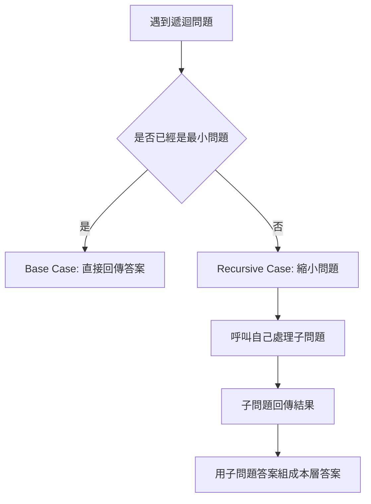
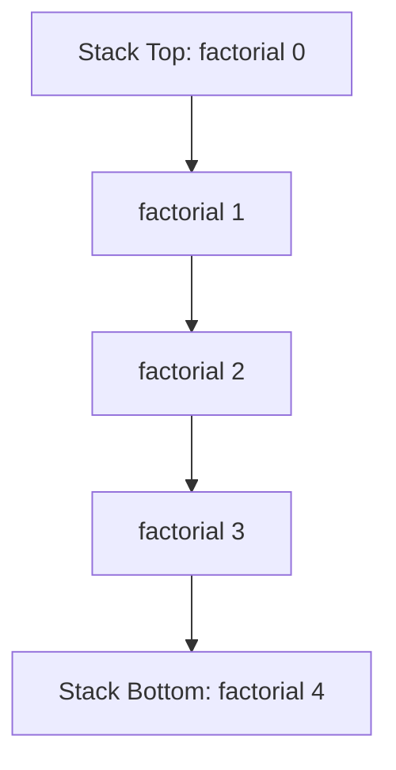
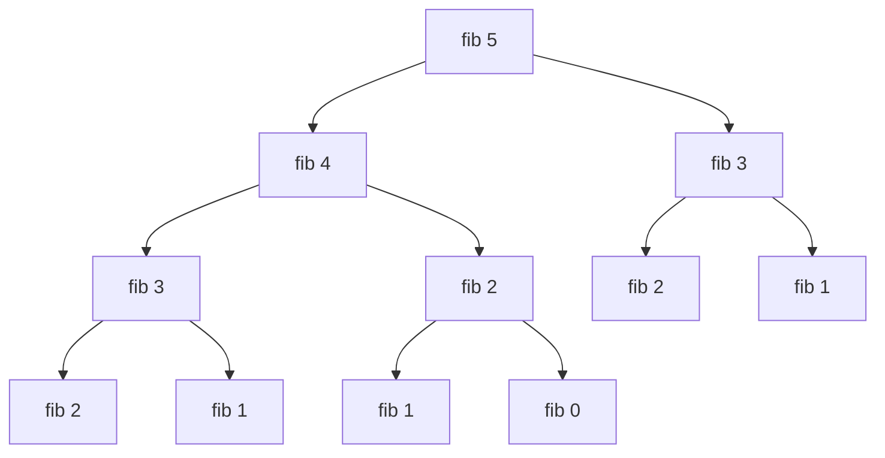

## 第 21 章　Recursion

### 適用範圍

本章說明 Recursion，也就是「函式呼叫自己」的解題方式。

遞迴常用在問題本身可以被拆成較小、但型態相同的子問題時。例如：

- 計算階乘。
- 走訪 Tree。
- 處理巢狀資料。
- 分治法中的排序與搜尋。
- Backtracking 中的決策樹走訪。

學遞迴時，最重要的不是記住語法，而是能回答三個問題：

- 什麼情況可以直接得到答案？這是 Base Case。
- 如果還不能直接得到答案，要把問題縮小成什麼子問題？這是 Recursive Case。
- 每次呼叫會保存哪些還沒做完的事情？這會形成 Call Stack。



### 適用讀者

- 看到函式呼叫自己時，能看懂語法但不容易追蹤流程的讀者。
- 不確定 Base Case 與 Recursive Case 要怎麼寫的讀者。
- 常遇到遞迴停不下來、Stack Overflow 或 Index 錯誤的讀者。
- 想理解 Recursion、Loop、Divide and Conquer 與 Backtracking 差異的讀者。
- 想用 Call Stack 與遞迴樹分析時間與空間複雜度的讀者。

### 快速導覽

- [21.1 遞迴前到底要分析什麼](#211-遞迴前到底要分析什麼)：先確認問題是否能縮小。
- [21.2 Base Case 與 Recursive Case](#212-base-case-與-recursive-case)：建立遞迴的兩個核心。
- [21.3 Call Stack](#213-call-stack)：理解每一層函式呼叫保存什麼。
- [21.4 遞迴樹](#214-遞迴樹)：觀察分支型遞迴的呼叫數量。
- [21.5 遞迴與迴圈](#215-遞迴與迴圈)：比較兩種重複處理方式。
- [21.6 Tail Recursion](#216-tail-recursion)：了解尾端遞迴的型態。
- [21.7 Stack Overflow](#217-stack-overflow)：遞迴深度過大時的風險。
- [21.8 遞迴除錯](#218-遞迴除錯)：用輸入規模、縮排與追蹤表檢查。
- [21.9 常見問題與判讀](#219-常見問題與判讀)：整理遞迴常見錯誤。
- [21.10 本章檢查表](#2110-本章檢查表)：確認是否掌握核心概念。
- [21.11 本章重點](#2111-本章重點)：回顧本章核心。

### 21.1 遞迴前到底要分析什麼

假設題目如下：

給定整數 `n`，計算 `1 + 2 + ... + n`。

看到這題時，可以先整理成分析表：

<table>
<tr><th>分析項目</th><th>本題內容</th></tr>
<tr><td>輸入</td><td>整數 n</td></tr>
<tr><td>輸出</td><td>1 到 n 的總和</td></tr>
<tr><td>最小問題</td><td>n == 0 時，總和為 0</td></tr>
<tr><td>如何縮小問題</td><td>sum(n) 可以改成 n + sum(n - 1)</td></tr>
<tr><td>是否會停止</td><td>每次 n 減 1，最後會到 0</td></tr>
<tr><td>遞迴深度</td><td>約 n 層</td></tr>
</table>

這張表會直接影響程式：

- 因為 `n == 0` 有直接答案，所以它可以當 Base Case。
- 因為 `sum(n)` 依賴 `sum(n - 1)`，所以 Recursive Case 可以把問題縮小。
- 因為每一層都讓 n 變小，所以遞迴能停止。

#### C++ 範例

```cpp
int sumToN(int n)
{
    if (n == 0)
    {
        return 0;
    }
    return n + sumToN(n - 1);
}
```

### 21.2 Base Case 與 Recursive Case

遞迴至少需要兩個部分。

<table>
<tr><th>部分</th><th>用途</th><th>範例</th></tr>
<tr><td>Base Case</td><td>停止遞迴，直接給答案</td><td>`n == 0` 時回傳 0</td></tr>
<tr><td>Recursive Case</td><td>把問題變成更小的同型態問題</td><td>`n + sumToN(n - 1)`</td></tr>
</table>

#### 階乘範例

階乘定義：

```text
0! = 1
n! = n * (n - 1)!
```

對應到程式：

```cpp
long long factorial(int n)
{
    if (n == 0)
    {
        return 1;
    }
    return n * factorial(n - 1);
}
```

#### 手動追蹤

呼叫 `factorial(4)`：

<table>
<tr><th>呼叫</th><th>等待的事情</th></tr>
<tr><td>factorial(4)</td><td>等待 4 * factorial(3)</td></tr>
<tr><td>factorial(3)</td><td>等待 3 * factorial(2)</td></tr>
<tr><td>factorial(2)</td><td>等待 2 * factorial(1)</td></tr>
<tr><td>factorial(1)</td><td>等待 1 * factorial(0)</td></tr>
<tr><td>factorial(0)</td><td>回傳 1</td></tr>
</table>

回傳時：

```text
factorial(0) = 1
factorial(1) = 1 * 1 = 1
factorial(2) = 2 * 1 = 2
factorial(3) = 3 * 2 = 6
factorial(4) = 4 * 6 = 24
```


### 21.3 Call Stack

Call Stack 是函式呼叫尚未完成時，系統保存每一層資訊的地方。

以 `factorial(4)` 為例，在到達 `factorial(0)` 之前，前面的呼叫都還沒完成。每一層都要記住：

- 目前的參數 n。
- 回到哪一行繼續執行。
- 本層還要把子問題答案乘上多少。



當 Base Case 回傳後，Call Stack 會一層一層退出。

#### 空間複雜度

如果遞迴深度是 n，每一層保存固定資訊，Call Stack 空間為：

```text
O(n)
```

這也是為什麼遞迴不只要分析時間，也要分析空間。

### 21.4 遞迴樹

有些遞迴每一層只呼叫自己一次，例如階乘。有些遞迴每一層會呼叫自己多次，例如 Fibonacci。

Fibonacci 定義：

```text
fib(0) = 0
fib(1) = 1
fib(n) = fib(n - 1) + fib(n - 2)
```

直接遞迴版本：

```cpp
long long fib(int n)
{
    if (n == 0)
    {
        return 0;
    }
    if (n == 1)
    {
        return 1;
    }
    return fib(n - 1) + fib(n - 2);
}
```

呼叫 `fib(5)` 的遞迴樹：



這棵樹中有許多重複計算，例如 `fib(3)`、`fib(2)` 被重複呼叫多次。

#### 直接 Fibonacci 的問題

直接遞迴 Fibonacci 的時間複雜度接近指數級，因為每一層會展開成多個分支。

若要改善，可以使用 Memoization，也就是把算過的答案保存起來。這會在後續 Dynamic Programming 章節更完整說明。

### 21.5 遞迴與迴圈

遞迴與迴圈都能處理重複工作，但思考方式不同。

<table>
<tr><th>項目</th><th>迴圈</th><th>遞迴</th></tr>
<tr><td>核心想法</td><td>重複更新變數</td><td>把問題交給較小子問題</td></tr>
<tr><td>停止方式</td><td>迴圈條件不成立</td><td>遇到 Base Case</td></tr>
<tr><td>狀態保存</td><td>由變數保存</td><td>由 Call Stack 保存</td></tr>
<tr><td>適合情境</td><td>線性重複流程</td><td>樹狀、巢狀、分治問題</td></tr>
</table>

#### sumToN 的迴圈版本

```cpp
int sumToNLoop(int n)
{
    int sum = 0;
    for (int i = 1; i <= n; ++i)
    {
        sum += i;
    }
    return sum;
}
```

#### sumToN 的遞迴版本

```cpp
int sumToNRecursive(int n)
{
    if (n == 0)
    {
        return 0;
    }
    return n + sumToNRecursive(n - 1);
}
```

兩者時間都是 O(n)，但遞迴版本額外使用 O(n) Call Stack 空間。

### 21.6 Tail Recursion

Tail Recursion 指的是遞迴呼叫是函式最後一步，呼叫後不需要再做額外計算。

例如：

```cpp
int sumTail(int n, int acc)
{
    if (n == 0)
    {
        return acc;
    }
    return sumTail(n - 1, acc + n);
}
```

這裡 `sumTail(n - 1, acc + n)` 回傳後，本層沒有其他工作。

與一般版本比較：

```cpp
return n + sumToNRecursive(n - 1);
```

一般版本在子問題回傳後，還要加上 n，因此不是 Tail Recursion。

在某些語言或編譯器中，Tail Recursion 可能被轉成類似迴圈的形式。但 C++ 不應假設一定會做這種最佳化，所以仍要注意遞迴深度。

### 21.7 Stack Overflow

Stack Overflow 指的是 Call Stack 使用超過系統可承受範圍。

可能原因包含：

- Base Case 寫錯，遞迴無法停止。
- 每次遞迴沒有讓問題變小。
- 輸入太大，雖然會停止，但層數太深。

#### 錯誤範例

```cpp
int badSum(int n)
{
    if (n == 0)
    {
        return 0;
    }
    return n + badSum(n); // n 沒有變小
}
```

這個函式永遠不會靠近 `n == 0`，因此會一直呼叫自己。

#### 修正方向

```cpp
int goodSum(int n)
{
    if (n == 0)
    {
        return 0;
    }
    return n + goodSum(n - 1);
}
```

修正後，每次 n 都會減 1，最後會到達 Base Case。

### 21.8 遞迴除錯

遞迴除錯可以先不要看整個執行流程，而是固定檢查三件事：

1. Base Case 是否能正確回答最小問題。
2. Recursive Case 是否真的把問題變小。
3. 假設子問題答案正確，本層是否能組出正確答案。

#### 使用縮排印出呼叫層級

```cpp
#include <iostream>
#include <string>

int factorialDebug(int n, int depth)
{
    std::cout << std::string(depth * 2, ' ')
              << "enter factorial(" << n << ")\n";

    if (n == 0)
    {
        std::cout << std::string(depth * 2, ' ')
                  << "return 1\n";
        return 1;
    }

    int result = n * factorialDebug(n - 1, depth + 1);

    std::cout << std::string(depth * 2, ' ')
              << "return " << result << "\n";

    return result;
}
```

這種輸出可以看出每一層何時進入、何時返回。

### 21.9 常見問題與判讀

<table>
<tr><th>現象</th><th>可能原因</th><th>第一輪檢查</th></tr>
<tr><td>遞迴停不下來</td><td>沒有靠近 Base Case</td><td>確認參數是否變小</td></tr>
<tr><td>最小輸入出錯</td><td>Base Case 不完整</td><td>測試 0、1、空集合</td></tr>
<tr><td>結果少算一個元素</td><td>區間端點定義不一致</td><td>統一使用 inclusive 或 half-open</td></tr>
<tr><td>空間複雜度漏算</td><td>忽略 Call Stack</td><td>遞迴深度也要列入空間</td></tr>
<tr><td>Fibonacci 很慢</td><td>重複計算大量子問題</td><td>畫遞迴樹檢查重複節點</td></tr>
<tr><td>輸入大時崩潰</td><td>遞迴深度過深</td><td>考慮改用迴圈或顯式 Stack</td></tr>
</table>

### 21.10 本章檢查表

- 我能說明什麼是 Base Case。
- 我能說明什麼是 Recursive Case。
- 我能確認每次遞迴是否讓問題變小。
- 我能用 Call Stack 追蹤 `factorial(4)`。
- 我能畫出簡單 Fibonacci 的遞迴樹。
- 我能區分單一路徑遞迴與分支型遞迴。
- 我知道遞迴的空間複雜度要包含 Call Stack。
- 我能比較遞迴與迴圈的差異。
- 我知道 Tail Recursion 不代表 C++ 一定不會使用 Stack。
- 我能用縮排輸出追蹤遞迴流程。
- 我會測試空輸入、最小合法輸入、單一元素與較大輸入。

### 21.11 本章重點

- 遞迴是函式呼叫自己，用較小子問題處理原問題。
- Base Case 負責停止遞迴。
- Recursive Case 負責把問題縮小。
- Call Stack 會保存尚未完成的函式呼叫。
- 遞迴空間複雜度通常與最大遞迴深度有關。
- 遞迴樹可以幫助分析分支型遞迴的呼叫數量。
- 不是所有遞迴都比迴圈好，應依問題結構選擇。
- Stack Overflow 常來自 Base Case 錯誤、問題未縮小或輸入過大。
- 除錯時可先檢查 Base Case、問題縮小與本層組合答案是否正確。
