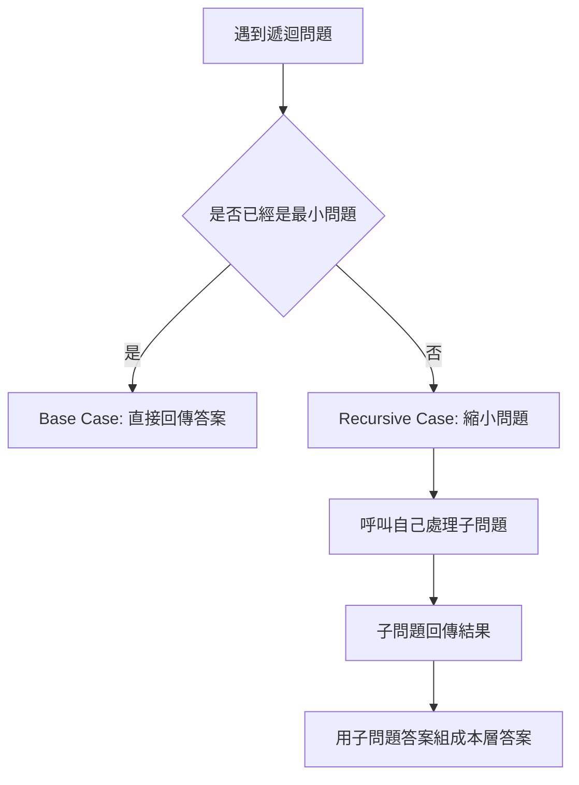
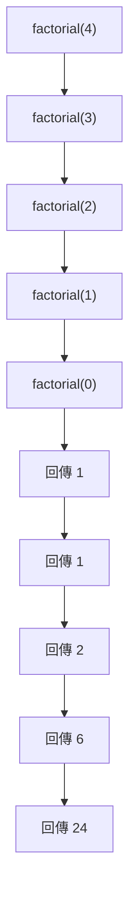
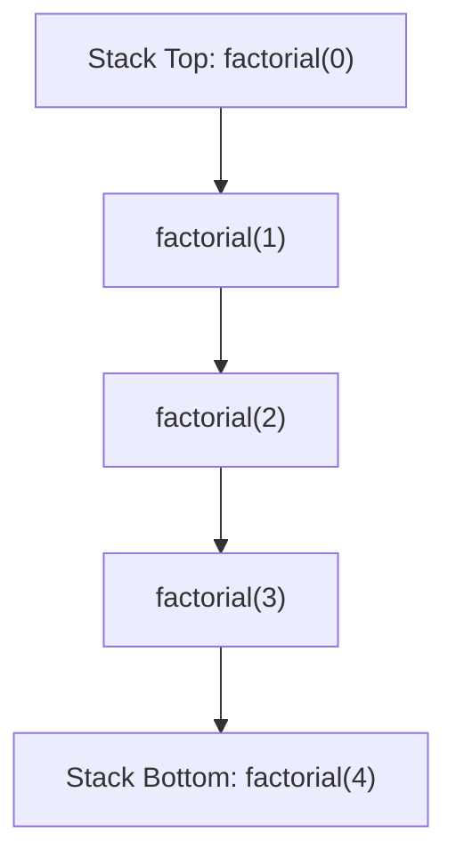
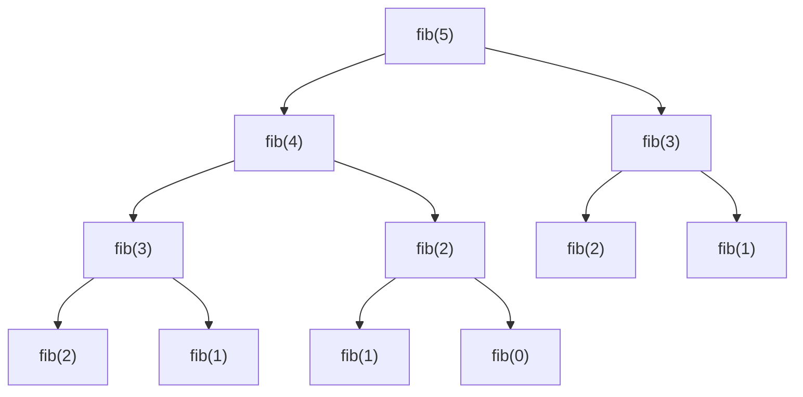

## 第 21 章　Recursion

### 適用範圍

本章說明 Recursion，也就是「函式呼叫自己」的解題方式。遞迴常用在問題本身可以被拆成較小、但型態相同的子問題時，例如計算階乘、走訪 Tree、處理巢狀資料、分治法排序與搜尋，以及 Backtracking 中的決策樹走訪。原始章節也指出，學遞迴時最重要的不是語法，而是能回答 Base Case、Recursive Case 與 Call Stack 三個問題。citeturn44search1

本章會用更完整的新手流程整理遞迴：

- 先判斷問題是否能拆成較小的同型態問題。
- 找出可以直接回答的最小問題，也就是 Base Case。
- 找出如何縮小問題，也就是 Recursive Case。
- 說明每一層呼叫在等待什麼。
- 用 Call Stack 和遞迴樹理解時間與空間。
- 比較 Recursion、Loop、Divide and Conquer、Backtracking。
- 建立 Debug 與測試清單。



### 適用讀者

- 看到函式呼叫自己時，能看懂語法但不容易追蹤流程的讀者。
- 不確定 Base Case 與 Recursive Case 要怎麼寫的讀者。
- 常遇到遞迴停不下來、Stack Overflow 或 Index 錯誤的讀者。
- 想理解 Recursion、Loop、Divide and Conquer 與 Backtracking 差異的讀者。
- 想用 Call Stack 與遞迴樹分析時間與空間複雜度的讀者。

### 快速導覽

- [21.1 遞迴前到底要分析什麼](#211-遞迴前到底要分析什麼)
- [21.2 Base Case 與 Recursive Case](#212-base-case-與-recursive-case)
- [21.3 Call Stack](#213-call-stack)
- [21.4 遞迴樹](#214-遞迴樹)
- [21.5 遞迴與迴圈](#215-遞迴與迴圈)
- [21.6 Tail Recursion](#216-tail-recursion)
- [21.7 Stack Overflow](#217-stack-overflow)
- [21.8 遞迴除錯](#218-遞迴除錯)
- [21.9 遞迴、分治與 Backtracking](#219-遞迴分治與-backtracking)
- [21.10 遞迴複雜度分析](#2110-遞迴複雜度分析)
- [21.11 常見問題與判讀](#2111-常見問題與判讀)
- [21.12 遞迴分析模板](#2112-遞迴分析模板)
- [21.13 本章檢查表](#2113-本章檢查表)
- [21.14 本章重點](#2114-本章重點)

### 21.1 遞迴前到底要分析什麼

假設題目如下：

```text
給定整數 n，計算 1 + 2 + ... + n。
```

看到這題時，可以先整理成分析表：

| 分析項目 | 本題內容 |
|---|---|
| 輸入 | 整數 n |
| 輸出 | 1 到 n 的總和 |
| 最小問題 | n == 0 時，總和為 0 |
| 如何縮小問題 | sum(n) 可以改成 n + sum(n - 1) |
| 是否會停止 | 每次 n 減 1，最後會到 0 |
| 遞迴深度 | 約 n 層 |

這張表會直接影響程式：

- 因為 `n == 0` 有直接答案，所以它可以當 Base Case。
- 因為 `sum(n)` 依賴 `sum(n - 1)`，所以 Recursive Case 可以把問題縮小。
- 因為每一層都讓 n 變小，所以遞迴能停止。

原始章節也用 `sumToN` 這個例子說明，遞迴前要先確認最小問題、縮小方式與是否會停止。citeturn44search1

#### C++ 範例

```cpp
int sumToN(int n)
{
    if (n == 0)
    {
        return 0;
    }

    return n + sumToN(n - 1);
}
```

#### 遞迴前的三個問題

每次想用遞迴前，先問：

```text
1. 什麼輸入可以直接回答？
2. 若不能直接回答，要如何縮小？
3. 縮小後的問題是否和原問題同型態？
```

如果第三點不成立，可能不適合用簡單遞迴，或需要重新定義函式語意。

### 21.2 Base Case 與 Recursive Case

遞迴至少需要兩個部分。

| 部分 | 用途 | 範例 |
|---|---|---|
| Base Case | 停止遞迴，直接給答案 | `n == 0` 時回傳 0 |
| Recursive Case | 把問題變成更小的同型態問題 | `n + sumToN(n - 1)` |

原始章節也以這兩個部分作為遞迴的核心。citeturn44search1

#### 階乘範例

階乘定義：

```text
0! = 1
n! = n * (n - 1)!
```

對應到程式：

```cpp
long long factorial(int n)
{
    if (n == 0)
    {
        return 1;
    }

    return n * factorial(n - 1);
}
```

#### 手動追蹤

呼叫 `factorial(4)`：

| 呼叫 | 等待的事情 |
|---|---|
| `factorial(4)` | 等待 `4 * factorial(3)` |
| `factorial(3)` | 等待 `3 * factorial(2)` |
| `factorial(2)` | 等待 `2 * factorial(1)` |
| `factorial(1)` | 等待 `1 * factorial(0)` |
| `factorial(0)` | 回傳 1 |

回傳時：

```text
factorial(0) = 1
factorial(1) = 1 * 1 = 1
factorial(2) = 2 * 1 = 2
factorial(3) = 3 * 2 = 6
factorial(4) = 4 * 6 = 24
```



原始章節也以 `factorial(4)` 追蹤每一層正在等待什麼。citeturn44search1

#### Base Case 不一定只有一個

例如 Fibonacci 有兩個 Base Case：

```cpp
if (n == 0)
{
    return 0;
}

if (n == 1)
{
    return 1;
}
```

Tree 題中也常見 `node == nullptr` 與 Leaf 兩種情況。有些題只需要空節點作為 Base Case，有些題則需要額外處理 Leaf。

### 21.3 Call Stack

Call Stack 是函式呼叫尚未完成時，系統保存每一層資訊的地方。

以 `factorial(4)` 為例，在到達 `factorial(0)` 之前，前面的呼叫都還沒完成。每一層都要記住：

- 目前的參數 `n`。
- 回到哪一行繼續執行。
- 本層還要把子問題答案乘上多少。



當 Base Case 回傳後，Call Stack 會一層一層退出。

原始章節也指出，Call Stack 會保存尚未完成的函式呼叫，因此遞迴不只要分析時間，也要分析空間。citeturn44search1

#### 空間複雜度

如果遞迴深度是 n，每一層保存固定資訊，Call Stack 空間為：

```text
O(n)
```

若遞迴深度是 Tree Height h，Call Stack 空間通常是：

```text
O(h)
```

平衡 Tree 的 h 可能是 O(log n)，但鏈狀 Tree 的 h 可能是 O(n)。

#### Call Stack 中保存的不是全部資料

Call Stack 保存的是每一層尚未完成的狀態，例如參數、區域變數、返回位置。它不會自動保存所有已處理過的輸入。若需要記憶已算過的子問題，必須另外使用 Memoization 或 DP Table。

### 21.4 遞迴樹

有些遞迴每一層只呼叫自己一次，例如階乘。有些遞迴每一層會呼叫自己多次，例如 Fibonacci。

Fibonacci 定義：

```text
fib(0) = 0
fib(1) = 1
fib(n) = fib(n - 1) + fib(n - 2)
```

直接遞迴版本：

```cpp
long long fib(int n)
{
    if (n == 0)
    {
        return 0;
    }

    if (n == 1)
    {
        return 1;
    }

    return fib(n - 1) + fib(n - 2);
}
```

呼叫 `fib(5)` 的遞迴樹：



這棵樹中有許多重複計算，例如 `fib(3)`、`fib(2)` 被重複呼叫多次。原始章節也用 Fibonacci 遞迴樹說明分支型遞迴的重複計算。citeturn44search1

#### 直接 Fibonacci 的問題

直接遞迴 Fibonacci 的時間複雜度接近指數級，因為每一層會展開成多個分支。

若要改善，可以使用 Memoization，也就是把算過的答案保存起來。

```cpp
long long fibMemo(int n, std::vector<long long>& memo)
{
    if (n == 0)
    {
        return 0;
    }

    if (n == 1)
    {
        return 1;
    }

    if (memo[n] != -1)
    {
        return memo[n];
    }

    memo[n] = fibMemo(n - 1, memo) + fibMemo(n - 2, memo);
    return memo[n];
}
```

Memoization 將每個 `fib(i)` 最多計算一次，時間可降為 O(n)，額外空間 O(n)。

### 21.5 遞迴與迴圈

遞迴與迴圈都能處理重複工作，但思考方式不同。

| 項目 | 迴圈 | 遞迴 |
|---|---|---|
| 核心想法 | 重複更新變數 | 把問題交給較小子問題 |
| 停止方式 | 迴圈條件不成立 | 遇到 Base Case |
| 狀態保存 | 由變數保存 | 由 Call Stack 保存 |
| 適合情境 | 線性重複流程 | 樹狀、巢狀、分治問題 |

原始章節也以 `sumToN` 比較迴圈與遞迴，兩者時間都是 O(n)，但遞迴版本額外使用 O(n) Call Stack 空間。citeturn44search1

#### sumToN 的迴圈版本

```cpp
int sumToNLoop(int n)
{
    int sum = 0;

    for (int i = 1; i <= n; ++i)
    {
        sum += i;
    }

    return sum;
}
```

#### sumToN 的遞迴版本

```cpp
int sumToNRecursive(int n)
{
    if (n == 0)
    {
        return 0;
    }

    return n + sumToNRecursive(n - 1);
}
```

#### 何時偏向遞迴

遞迴特別適合：

- Tree 或 Graph 的深度走訪。
- 巢狀資料，例如巢狀括號、巢狀清單。
- Divide and Conquer，例如 Merge Sort。
- Backtracking，例如排列、組合、N-Queens。

若問題只是單純從 1 加到 n，迴圈通常更直接。

### 21.6 Tail Recursion

Tail Recursion 指的是遞迴呼叫是函式最後一步，呼叫後不需要再做額外計算。

例如：

```cpp
int sumTail(int n, int acc)
{
    if (n == 0)
    {
        return acc;
    }

    return sumTail(n - 1, acc + n);
}
```

這裡 `sumTail(n - 1, acc + n)` 回傳後，本層沒有其他工作。

與一般版本比較：

```cpp
return n + sumToNRecursive(n - 1);
```

一般版本在子問題回傳後，還要加上 n，因此不是 Tail Recursion。

原始章節也提醒，在某些語言或編譯器中，Tail Recursion 可能被轉成類似迴圈的形式，但 C++ 不應假設一定會做這種最佳化，所以仍要注意遞迴深度。citeturn44search1

#### Tail Recursion 的狀態放在哪裡

Tail Recursion 通常會把累積結果放到參數中，例如 `acc`。

```text
sumTail(5, 0)
sumTail(4, 5)
sumTail(3, 9)
sumTail(2, 12)
sumTail(1, 14)
sumTail(0, 15)
```

最後直接回傳 `15`。

### 21.7 Stack Overflow

Stack Overflow 指的是 Call Stack 使用超過系統可承受範圍。

可能原因包含：

- Base Case 寫錯，遞迴無法停止。
- 每次遞迴沒有讓問題變小。
- 輸入太大，雖然會停止，但層數太深。

原始章節也列出這些 Stack Overflow 常見原因。citeturn44search1

#### 錯誤範例

```cpp
int badSum(int n)
{
    if (n == 0)
    {
        return 0;
    }

    return n + badSum(n); // n 沒有變小
}
```

這個函式永遠不會靠近 `n == 0`，因此會一直呼叫自己。

#### 修正方向

```cpp
int goodSum(int n)
{
    if (n == 0)
    {
        return 0;
    }

    return n + goodSum(n - 1);
}
```

修正後，每次 n 都會減 1，最後會到達 Base Case。

#### 另一種風險：輸入太深

即使遞迴會停止，也可能因深度太大而崩潰。例如：

- 長度為 1,000,000 的鏈狀 Tree。
- 深度很大的 DFS。
- `sumToN(10^7)`。

這時可考慮改用迴圈或顯式 Stack。

### 21.8 遞迴除錯

遞迴除錯可以先不要看整個執行流程，而是固定檢查三件事：

1. Base Case 是否能正確回答最小問題。
2. Recursive Case 是否真的把問題變小。
3. 假設子問題答案正確，本層是否能組出正確答案。

原始章節也用這三點作為遞迴除錯的核心。citeturn44search1

#### 使用縮排印出呼叫層級

```cpp
#include <iostream>
#include <string>

int factorialDebug(int n, int depth)
{
    std::cout << std::string(depth * 2, ' ')
              << "enter factorial(" << n << ")\n";

    if (n == 0)
    {
        std::cout << std::string(depth * 2, ' ')
                  << "return 1\n";
        return 1;
    }

    int result = n * factorialDebug(n - 1, depth + 1);

    std::cout << std::string(depth * 2, ' ')
              << "return " << result << "\n";

    return result;
}
```

這種輸出可以看出每一層何時進入、何時返回。原始章節也提供類似的縮排 Debug 程式。citeturn44search1

#### Debug 表格

| 檢查點 | 要問的問題 |
|---|---|
| 進入函式 | 目前參數是什麼？ |
| Base Case | 是否已是最小問題？ |
| Recursive Case | 下一層參數是否更接近 Base Case？ |
| 子問題回傳 | 子問題答案代表什麼？ |
| Combine | 本層如何使用子問題答案？ |
| 返回 | 回傳值是否符合函式語意？ |

### 21.9 遞迴、分治與 Backtracking

遞迴是一種程式結構；Divide and Conquer 與 Backtracking 是常使用遞迴的解題模式。

| 類型 | 核心概念 | 常見例子 |
|---|---|---|
| 一般遞迴 | 用較小同型態問題回答目前問題 | 階乘、Tree Height |
| Divide and Conquer | 切成多個子問題，解完再合併 | Merge Sort、Binary Search |
| Backtracking | 嘗試一個選擇，深入後撤銷選擇 | 排列、組合、N-Queens |

#### Divide and Conquer

Merge Sort 的遞迴語意：

```text
sort(l, r)：排序區間 [l, r)
```

流程：

1. 若區間長度小於等於 1，直接完成。
2. 切成左右兩半。
3. 遞迴排序左右半。
4. 合併兩個已排序區間。

#### Backtracking

Backtracking 會在返回前還原狀態：

```cpp
path.push_back(value);
backtrack(...);
path.pop_back();
```

這和一般 Tree DFS 的 `visited` 不一定相同。Graph DFS 常常標記後不取消；Backtracking 依題意可能需要還原，讓其他分支能使用該選擇。

### 21.10 遞迴複雜度分析

分析遞迴複雜度時，要先分清楚：

- 每層有幾個子問題？
- 子問題大小如何變化？
- 每層除了遞迴，還做多少額外工作？
- 是否有重複子問題？
- 最大遞迴深度是多少？

#### 單一路徑遞迴

例如 `sumToN(n)`：

```text
T(n) = T(n - 1) + O(1)
```

時間 O(n)，Call Stack O(n)。

#### 二分遞迴

例如 Binary Search：

```text
T(n) = T(n / 2) + O(1)
```

時間 O(log n)，Call Stack O(log n)。

#### 分治排序

例如 Merge Sort：

```text
T(n) = 2T(n / 2) + O(n)
```

時間 O(n log n)。遞迴深度 O(log n)，但 Merge 需要額外空間 O(n)。

#### 重複子問題

例如直接 Fibonacci：

```text
T(n) = T(n - 1) + T(n - 2) + O(1)
```

會重複計算大量子問題，時間接近指數級。可用 Memoization 改善。

### 21.11 常見問題與判讀

原始章節已整理常見問題，例如遞迴停不下來、最小輸入出錯、結果少算一個元素、空間複雜度漏算、Fibonacci 很慢、輸入大時崩潰等。citeturn44search1

| 現象 | 可能原因 | 第一輪檢查 |
|---|---|---|
| 遞迴停不下來 | 沒有靠近 Base Case | 確認參數是否變小 |
| 最小輸入出錯 | Base Case 不完整 | 測試 0、1、空集合 |
| 結果少算一個元素 | 區間端點定義不一致 | 統一使用 inclusive 或 half-open |
| 空間複雜度漏算 | 忽略 Call Stack | 遞迴深度也要列入空間 |
| Fibonacci 很慢 | 重複計算大量子問題 | 畫遞迴樹檢查重複節點 |
| 輸入大時崩潰 | 遞迴深度過深 | 考慮改用迴圈或顯式 Stack |
| 子問題答案對但本層錯 | Combine 公式錯 | 假設子問題正確，檢查本層如何組合 |
| Tree 題高度差一 | Base Case 與 Height 定義混用 | 空 Tree 與 Leaf 的定義要一致 |
| Backtracking 漏答案 | 狀態沒有還原或過度標記 | 檢查 push / pop、used true / false |

### 21.12 遞迴分析模板

```markdown
# 遞迴分析模板

## 1. 函式語意
- 函式名稱：
- 輸入參數代表什麼：
- 回傳值代表什麼：

## 2. Base Case
- 最小問題是什麼：
- 直接答案是什麼：
- 是否涵蓋空輸入、0、1、Leaf：

## 3. Recursive Case
- 如何把問題縮小：
- 下一層參數是什麼：
- 是否一定更接近 Base Case：

## 4. Combine
- 子問題回傳什麼：
- 本層如何組合子問題答案：
- 是否有額外狀態：

## 5. Call Stack
- 最大遞迴深度：
- 每層保存哪些資訊：
- 是否可能 Stack Overflow：

## 6. 複雜度
- 遞迴式：
- 時間：
- 空間：

## 7. 測試
- 最小輸入：
- 一般輸入：
- 邊界輸入：
- 大輸入：
```

### 21.13 本章檢查表

- 我能說明什麼是 Base Case。
- 我能說明什麼是 Recursive Case。
- 我能確認每次遞迴是否讓問題變小。
- 我能用 Call Stack 追蹤 `factorial(4)`。
- 我能畫出簡單 Fibonacci 的遞迴樹。
- 我能區分單一路徑遞迴與分支型遞迴。
- 我知道遞迴的空間複雜度要包含 Call Stack。
- 我能比較遞迴與迴圈的差異。
- 我知道 Tail Recursion 不代表 C++ 一定不會使用 Stack。
- 我能用縮排輸出追蹤遞迴流程。
- 我能區分一般遞迴、分治與 Backtracking。
- 我會測試空輸入、最小合法輸入、單一元素與較大輸入。

### 21.14 本章重點

- 遞迴是函式呼叫自己，用較小子問題處理原問題。
- Base Case 負責停止遞迴。
- Recursive Case 負責把問題縮小。
- 每次遞迴都應更接近 Base Case。
- Call Stack 會保存尚未完成的函式呼叫。
- 遞迴空間複雜度通常與最大遞迴深度有關。
- 遞迴樹可以幫助分析分支型遞迴的呼叫數量。
- 不是所有遞迴都比迴圈好，應依問題結構選擇。
- Tail Recursion 在 C++ 中仍不應假設一定會被最佳化。
- Stack Overflow 常來自 Base Case 錯誤、問題未縮小或輸入過大。
- 除錯時可先檢查 Base Case、問題縮小與本層組合答案是否正確。

### 21.15 練習題方向

#### 基礎題

- 計算 `1 + 2 + ... + n`。
- 計算階乘。
- 反轉字串。
- 計算 Array 中所有元素總和。

練習重點：先寫出函式語意與 Base Case，再寫 Recursive Case。

#### Tree 類題

- 計算 Binary Tree 的 Node 數量。
- 計算 Tree Height。
- 判斷兩棵 Tree 是否相同。
- 收集所有 Root-to-Leaf Path。

練習重點：明確定義空 Tree 回傳什麼，以及目前 Node 如何組合 Child Result。

#### 分支型遞迴題

- Fibonacci。
- 爬樓梯。
- 簡單組合列舉。

練習重點：畫出遞迴樹，確認是否出現大量重複子問題。若有重複子問題，再考慮 Memoization。

#### Backtracking 入門題

- 列出所有 subset。
- 列出所有排列。
- 列出所有符合限制的 path。

練習重點：每次選擇後進入下一層，返回前將狀態還原。

### 21.16 迷你對照：遞迴函式語意範例

| 函式 | 建議語意 |
|---|---|
| `sum(n)` | 回傳 `1..n` 的總和 |
| `factorial(n)` | 回傳 `n!` |
| `height(node)` | 回傳以 `node` 為 Root 的 Subtree 高度 |
| `count(node)` | 回傳以 `node` 為 Root 的 Subtree Node 數量 |
| `dfs(node)` | 走訪從 `node` 可到達且尚未處理的區域 |
| `backtrack(index)` | 已處理前 `index` 個位置，繼續嘗試後續選擇 |

好的遞迴函式語意應該能用一句話說完。如果函式語意說不清楚，Base Case、Recursive Case 與 Combine 通常也會跟著混亂。
