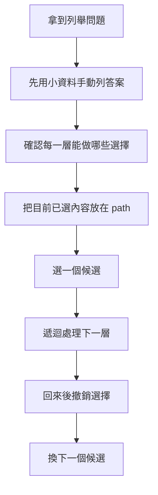
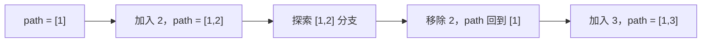
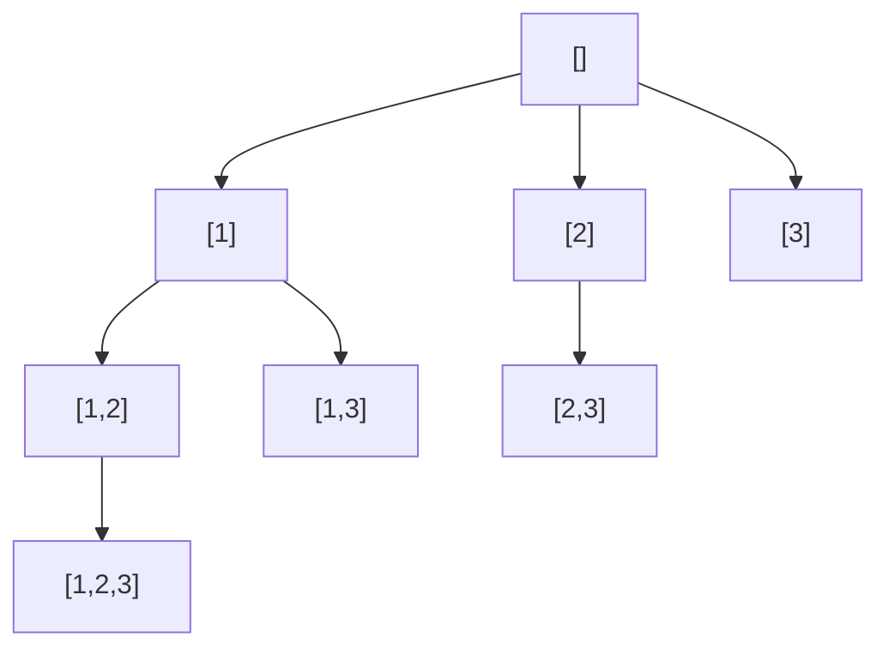
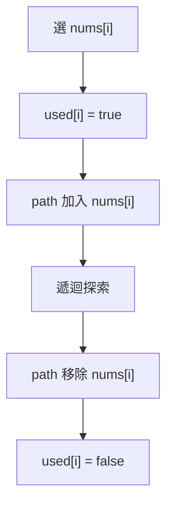
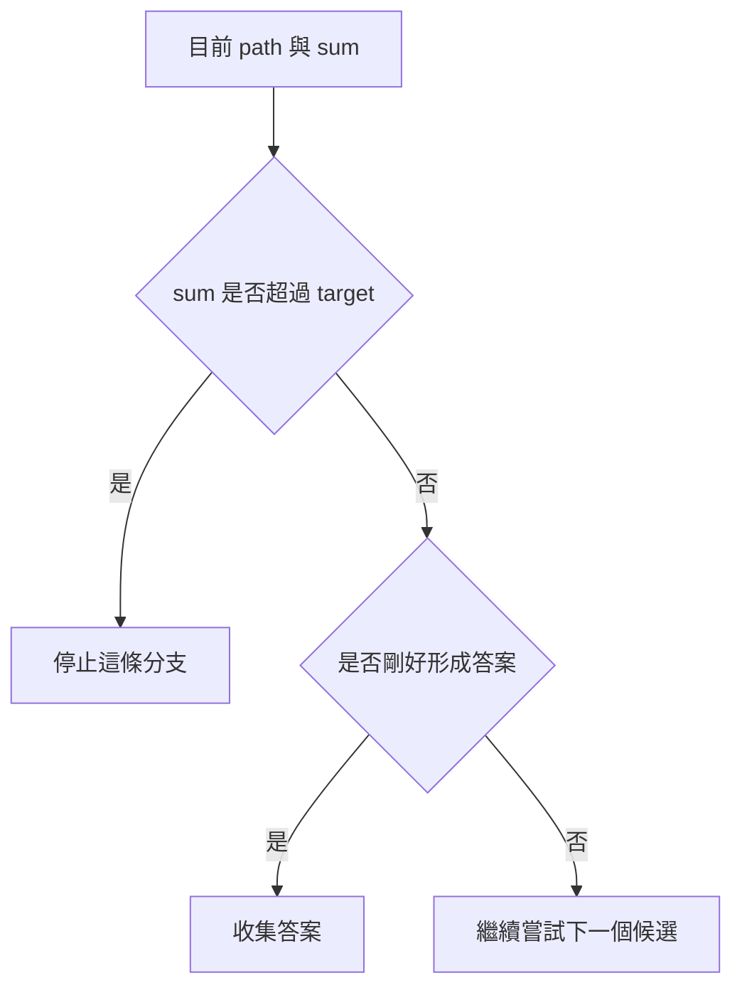

## 第 22 章　Backtracking

### 適用範圍

本章說明 Backtracking，也就是在很多可能選項中，一條一條試出答案的方法。

很多人第一次看到 Backtracking 會卡在三個地方：

- 程式一直呼叫自己，看不出目前走到哪裡。
- `path.push_back()` 和 `path.pop_back()` 看起來像是先加入答案又刪掉答案。
- Subset、Combination、Permutation 都像是在列東西，但程式寫法又不一樣。

這些困難通常不是不會寫 C++，而是還沒有把問題整理成「目前選了什麼」、「接下來還能選什麼」以及「什麼時候算是一個答案」。

本章會建立一套固定流程：

- 先確認題目要列出的是哪一種答案。
- 使用小型資料手動列出答案。
- 找出每一步可以做哪些選擇。
- 用 `path` 表示目前已經選到的內容。
- 用 `startIndex` 或 `used` 表示接下來還能選什麼。
- 每次選完往下走，回來後還原狀態。
- 再加入去重與剪枝。



Backtracking 的重點不是背模板，而是能說明每一層正在試哪個選擇，以及為什麼回來後要把狀態還原。

### 適用讀者

- 已經學過 Recursion，但看到 Backtracking 仍然不容易追蹤流程的讀者。
- 能看懂 `push_back` 和 `pop_back`，但不理解為什麼要成對出現的讀者。
- 容易混淆 Subset、Combination、Permutation 的讀者。
- 寫程式時常漏掉 `startIndex`、`used` 或狀態還原的讀者。
- 想先理解問題，再慢慢寫出 C++ 程式的讀者。

### 快速導覽

- [22.1 Backtracking 前到底要分析什麼](#221-backtracking-前到底要分析什麼)：先整理輸入、輸出與選擇空間。
- [22.2 先不要寫程式：用手列出 Subset](#222-先不要寫程式用手列出-subset)：建立直覺。
- [22.3 Path 是什麼](#223-path-是什麼)：目前已經選到的內容。
- [22.4 為什麼需要撤銷選擇](#224-為什麼需要撤銷選擇)：理解 `pop_back` 的用途。
- [22.5 Decision Tree](#225-decision-tree)：把所有選擇看成一棵樹。
- [22.6 Subset](#226-subset)：每個中間狀態都是答案。
- [22.7 Combination](#227-combination)：選固定數量，順序不重要。
- [22.8 Permutation](#228-permutation)：順序重要，需記錄哪些元素已使用。
- [22.9 startIndex 與 used 的差異](#229-startindex-與-used-的差異)：判斷要用哪一種狀態。
- [22.10 去除重複](#2210-去除重複)：避免產生相同答案。
- [22.11 Constraint 與 Pruning](#2211-constraint-與-pruning)：提前停止不可能成功的分支。
- [22.12 常見問題與判讀](#2212-常見問題與判讀)：整理新手常見錯誤。
- [22.13 本章檢查表](#2213-本章檢查表)：確認是否掌握核心概念。
- [22.14 本章重點](#2214-本章重點)：回顧本章核心。

### 22.1 Backtracking 前到底要分析什麼

假設題目如下：

給定 `[1, 2, 3]`，列出所有 Subset。

很多人看到後會立刻想：

我要用幾層 for？
我要怎麼遞迴？
`path` 是什麼？
`startIndex` 又是什麼？

但這些不是第一個問題。

第一步應該先把題目整理成幾個明確欄位：

<table>
<tr><th>分析項目</th><th>本題內容</th></tr>
<tr><td>輸入</td><td>一組整數 `[1, 2, 3]`</td></tr>
<tr><td>輸出</td><td>所有 Subset</td></tr>
<tr><td>答案是否需要固定長度</td><td>不需要，長度可以是 0 到 n</td></tr>
<tr><td>每個元素能用幾次</td><td>最多一次</td></tr>
<tr><td>順序是否重要</td><td>不重要，`[1, 2]` 和 `[2, 1]` 視為同一組</td></tr>
<tr><td>是否有重複值</td><td>本例沒有</td></tr>
<tr><td>目前選到的內容</td><td>使用 `path` 保存</td></tr>
<tr><td>下一層從哪裡開始選</td><td>使用 `startIndex` 保存</td></tr>
</table>

這張表會直接影響程式：

- 因為順序不重要，所以不需要產生 `[2, 1]` 這種和 `[1, 2]` 重複的結果。
- 因為每個元素最多用一次，選了 index `i` 之後，下一層應該從 `i + 1` 開始。
- 因為 Subset 長度不固定，所以每個中間 `path` 都是一個答案。

Backtracking 不是一開始就寫模板，而是先釐清「目前答案長什麼樣子」和「下一步還能選什麼」。

### 22.2 先不要寫程式：用手列出 Subset

對 `[1, 2, 3]` 來說，Subset 是從原資料中任意選一些元素。

可以選 0 個：

```text
[]
```

可以選 1 個：

```text
[1]
[2]
[3]
```

可以選 2 個：

```text
[1, 2]
[1, 3]
[2, 3]
```

可以選 3 個：

```text
[1, 2, 3]
```

所以全部答案是：

```text
[]
[1]
[1, 2]
[1, 2, 3]
[1, 3]
[2]
[2, 3]
[3]
```

這個順序不是唯一的。Backtracking 常見的輸出順序是沿著一條路先走到底，再回來換下一條路。

#### 人類列答案時其實也在 Backtracking

可以把 `[1, 2, 3]` 想成桌上的三張牌。

一開始手上沒有牌：

```text
path = []
```

先拿 1：

```text
path = [1]
```

再拿 2：

```text
path = [1, 2]
```

再拿 3：

```text
path = [1, 2, 3]
```

這條路走完後，回到上一層，把 3 放回去：

```text
path = [1, 2]
```

再回到上一層，把 2 放回去：

```text
path = [1]
```

這時才能改拿 3：

```text
path = [1, 3]
```

這就是 Backtracking 的核心：

```text
拿一張牌
往下試
試完放回去
改拿下一張牌
```

### 22.3 Path 是什麼

`path` 表示目前這條路上已經選了哪些元素。

它不是最後答案本身，而是「目前正在組合中的答案」。

例如走到不同位置時：

<table>
<tr><th>目前狀態</th><th>path 內容</th><th>意思</th></tr>
<tr><td>一開始</td><td>`[]`</td><td>什麼都還沒選</td></tr>
<tr><td>選了 1</td><td>`[1]`</td><td>目前這條路包含 1</td></tr>
<tr><td>選了 1 和 2</td><td>`[1, 2]`</td><td>目前這條路包含 1、2</td></tr>
<tr><td>選了 1、2、3</td><td>`[1, 2, 3]`</td><td>目前這條路包含全部元素</td></tr>
</table>

在 Subset 題中，每一個 `path` 都是一個合法答案。

因此只要進入一層函式，就可以先把目前 `path` 放入 `result`。

```cpp
result.push_back(path);
```

這一行的意思不是「遞迴結束了」，而是：

目前這個選法本身就是一個 Subset，所以先記錄下來。

### 22.4 為什麼需要撤銷選擇

Backtracking 最容易卡住的地方是這三行：

```cpp
path.push_back(nums[i]);
backtrack(...);
path.pop_back();
```

可以把它翻成白話：

```text
先把 nums[i] 拿到手上
接著用目前手上的牌繼續往下找答案
找完後，把 nums[i] 放回去
```

為什麼要放回去？

因為下一個分支要從同一個起點重新嘗試。如果不放回去，上一個分支留下的元素會影響下一個分支。

#### 錯誤情況

假設目前：

```text
path = [1]
```

選 2 後：

```text
path = [1, 2]
```

探索完 `[1, 2]` 這條路後，如果沒有把 2 拿掉，接著選 3 時會變成：

```text
path = [1, 2, 3]
```

但如果我們原本想走的是 `[1, 3]`，就會出錯。

所以探索完 2 的分支後，要先：

```cpp
path.pop_back();
```

讓狀態回到：

```text
path = [1]
```

再去選 3。



`push_back` 和 `pop_back` 必須成對出現。前者進入分支，後者離開分支。

### 22.5 Decision Tree

Backtracking 可以看成走訪一棵 Decision Tree。

每個節點代表一個目前的 `path`。

每條邊代表「多選一個元素」。

以 `[1, 2, 3]` 的 Subset 為例：



這棵樹可以看到幾件事：

- 從 `[]` 可以選 1、2、3。
- 從 `[1]` 開始，只能繼續選 2 或 3。
- 從 `[2]` 開始，只能繼續選 3。
- 每個節點本身都是一個 Subset。

#### 為什麼不是從 `[1]` 回頭選 1 或 2

因為 Subset 不在乎順序。

如果已經產生 `[1, 2]`，就不需要再產生 `[2, 1]`。

所以選了 index `i` 後，下一層從 `i + 1` 開始即可。

### 22.6 Subset

Subset 的特性是：

- 每個元素可以選，也可以不選。
- 答案長度不固定。
- 順序不重要。
- 每個中間 `path` 都是答案。

#### 程式需要保存什麼

<table>
<tr><th>資訊</th><th>用途</th></tr>
<tr><td>`nums`</td><td>原始資料</td></tr>
<tr><td>`startIndex`</td><td>下一層從哪個位置開始選</td></tr>
<tr><td>`path`</td><td>目前已選元素</td></tr>
<tr><td>`result`</td><td>保存所有答案</td></tr>
</table>

#### C++ Subset 解法

```cpp
#include <vector>

void backtrackSubsets(
    const std::vector<int>& nums,
    int startIndex,
    std::vector<int>& path,
    std::vector<std::vector<int>>& result)
{
    // Subset 的每個 path 都是答案。
    result.push_back(path);

    for (int i = startIndex; i < static_cast<int>(nums.size()); ++i)
    {
        path.push_back(nums[i]);
        backtrackSubsets(nums, i + 1, path, result);
        path.pop_back();
    }
}

std::vector<std::vector<int>> subsets(const std::vector<int>& nums)
{
    std::vector<std::vector<int>> result;
    std::vector<int> path;

    backtrackSubsets(nums, 0, path, result);
    return result;
}
```

#### 逐輪執行

輸入：`[1, 2, 3]`

<table>
<tr><th>步驟</th><th>動作</th><th>startIndex</th><th>path</th><th>是否收集答案</th></tr>
<tr><td>1</td><td>進入函式</td><td>0</td><td>`[]`</td><td>收集 `[]`</td></tr>
<tr><td>2</td><td>選 1</td><td>1</td><td>`[1]`</td><td>收集 `[1]`</td></tr>
<tr><td>3</td><td>選 2</td><td>2</td><td>`[1, 2]`</td><td>收集 `[1, 2]`</td></tr>
<tr><td>4</td><td>選 3</td><td>3</td><td>`[1, 2, 3]`</td><td>收集 `[1, 2, 3]`</td></tr>
<tr><td>5</td><td>回來，移除 3</td><td>2</td><td>`[1, 2]`</td><td>否</td></tr>
<tr><td>6</td><td>回來，移除 2</td><td>1</td><td>`[1]`</td><td>否</td></tr>
<tr><td>7</td><td>選 3</td><td>3</td><td>`[1, 3]`</td><td>收集 `[1, 3]`</td></tr>
<tr><td>8</td><td>回來，移除 3</td><td>1</td><td>`[1]`</td><td>否</td></tr>
<tr><td>9</td><td>回來，移除 1</td><td>0</td><td>`[]`</td><td>否</td></tr>
<tr><td>10</td><td>選 2</td><td>2</td><td>`[2]`</td><td>收集 `[2]`</td></tr>
<tr><td>11</td><td>選 3</td><td>3</td><td>`[2, 3]`</td><td>收集 `[2, 3]`</td></tr>
<tr><td>12</td><td>回來，移除 3</td><td>2</td><td>`[2]`</td><td>否</td></tr>
<tr><td>13</td><td>回來，移除 2</td><td>0</td><td>`[]`</td><td>否</td></tr>
<tr><td>14</td><td>選 3</td><td>3</td><td>`[3]`</td><td>收集 `[3]`</td></tr>
</table>

這張表是理解 Backtracking 的關鍵。程式不是一次生出所有答案，而是沿著樹一條一條走。

### 22.7 Combination

Combination 是從 n 個元素中選 k 個。

例如從 `1, 2, 3, 4` 中選 2 個：

```text
[1, 2]
[1, 3]
[1, 4]
[2, 3]
[2, 4]
[3, 4]
```

Combination 與 Subset 很像，都不在乎順序，所以也使用 `startIndex`。

差異是：

- Subset：每個中間 `path` 都是答案。
- Combination：只有 `path.size() == k` 時才是答案。

#### 問題分析表

<table>
<tr><th>分析項目</th><th>Combination</th></tr>
<tr><td>輸入</td><td>n 與 k</td></tr>
<tr><td>輸出</td><td>從 1 到 n 中選 k 個的所有組合</td></tr>
<tr><td>答案長度</td><td>固定為 k</td></tr>
<tr><td>順序是否重要</td><td>不重要</td></tr>
<tr><td>每個數字能用幾次</td><td>最多一次</td></tr>
<tr><td>需要的狀態</td><td>`startIndex` 與 `path`</td></tr>
</table>

#### C++ Combination 解法

```cpp
#include <vector>

void backtrackCombinations(
    int n,
    int k,
    int start,
    std::vector<int>& path,
    std::vector<std::vector<int>>& result)
{
    if (static_cast<int>(path.size()) == k)
    {
        result.push_back(path);
        return;
    }

    for (int value = start; value <= n; ++value)
    {
        path.push_back(value);
        backtrackCombinations(n, k, value + 1, path, result);
        path.pop_back();
    }
}

std::vector<std::vector<int>> combine(int n, int k)
{
    std::vector<std::vector<int>> result;
    std::vector<int> path;

    backtrackCombinations(n, k, 1, path, result);
    return result;
}
```

#### 為什麼不是每一層都收集答案

因為 Combination 題目要求固定選 k 個。

如果 `k = 2`，那麼：

```text
[]       不是答案
[1]      不是答案
[1, 2]   是答案
[1, 2, 3] 不應該出現
```

所以只有長度剛好等於 k 時才收集。

### 22.8 Permutation

Permutation 是排列。順序重要。

對 `[1, 2, 3]` 來說：

```text
[1, 2, 3]
[1, 3, 2]
[2, 1, 3]
[2, 3, 1]
[3, 1, 2]
[3, 2, 1]
```

這裡 `[1, 2, 3]` 和 `[2, 1, 3]` 是不同答案。

因此 Permutation 不能像 Subset 那樣只往後選。因為第一個位置選了 2 之後，第二個位置仍然可以選 1。

所以 Permutation 需要另一種狀態：`used`。

#### used 是什麼

`used[i]` 表示 index `i` 的元素目前是否已經在 `path` 裡。

例如：

```text
nums = [1, 2, 3]
path = [2]
used = [false, true, false]
```

意思是：

- 1 還沒用。
- 2 已經用在目前 path。
- 3 還沒用。

#### C++ Permutation 解法

```cpp
#include <vector>

void backtrackPermutations(
    const std::vector<int>& nums,
    std::vector<int>& path,
    std::vector<bool>& used,
    std::vector<std::vector<int>>& result)
{
    if (path.size() == nums.size())
    {
        result.push_back(path);
        return;
    }

    for (int i = 0; i < static_cast<int>(nums.size()); ++i)
    {
        if (used[i])
        {
            continue;
        }

        used[i] = true;
        path.push_back(nums[i]);

        backtrackPermutations(nums, path, used, result);

        path.pop_back();
        used[i] = false;
    }
}

std::vector<std::vector<int>> permute(const std::vector<int>& nums)
{
    std::vector<std::vector<int>> result;
    std::vector<int> path;
    std::vector<bool> used(nums.size(), false);

    backtrackPermutations(nums, path, used, result);
    return result;
}
```

#### 為什麼 used 也要還原

Permutation 做了兩個狀態改變：

```cpp
used[i] = true;
path.push_back(nums[i]);
```

回來後也要做兩個還原：

```cpp
path.pop_back();
used[i] = false;
```

若忘記 `used[i] = false`，後面的分支會誤以為這個元素仍然不能使用。



### 22.9 startIndex 與 used 的差異

Backtracking 題目常見困惑是：到底要用 `startIndex` 還是 `used`？

可以先看「順序是否重要」。

<table>
<tr><th>題型</th><th>順序是否重要</th><th>是否回頭選前面的元素</th><th>常用狀態</th></tr>
<tr><td>Subset</td><td>不重要</td><td>不需要</td><td>`startIndex`</td></tr>
<tr><td>Combination</td><td>不重要</td><td>不需要</td><td>`startIndex`</td></tr>
<tr><td>Permutation</td><td>重要</td><td>需要，但不能選已用元素</td><td>`used`</td></tr>
</table>

#### startIndex 的直覺

`startIndex` 的意思是：

```text
前面的元素已經處理過了，下一層只從後面繼續選。
```

它用來避免產生同一組內容的不同順序。

例如 Combination 中：

```text
[1, 2]
[2, 1]
```

兩者內容相同，所以只要保留 `[1, 2]`。

#### used 的直覺

`used` 的意思是：

```text
每一層都可以從全部元素中選，但目前 path 裡已經用過的不能再選。
```

它用在順序重要的排列問題。

### 22.10 去除重複

如果輸入有重複值，就可能產生重複答案。

例如：

```text
[1, 1, 2]
```

兩個 1 在位置上不同，但數值相同。若不處理，Permutation 可能產生看起來完全一樣的答案。

常見處理方式是：

1. 先排序，讓相同值靠在一起。
2. 在同一層中，若前一個相同值還沒被使用，就跳過目前這個值。

```cpp
if (i > 0 && nums[i] == nums[i - 1] && !used[i - 1])
{
    continue;
}
```

這段條件的目的不是刪掉所有相同值，而是避免同一層開出重複分支。

#### C++ Permutation 去重範例

```cpp
#include <algorithm>
#include <vector>

void backtrackUniquePermutations(
    const std::vector<int>& nums,
    std::vector<int>& path,
    std::vector<bool>& used,
    std::vector<std::vector<int>>& result)
{
    if (path.size() == nums.size())
    {
        result.push_back(path);
        return;
    }

    for (int i = 0; i < static_cast<int>(nums.size()); ++i)
    {
        if (used[i])
        {
            continue;
        }

        if (i > 0 && nums[i] == nums[i - 1] && !used[i - 1])
        {
            continue;
        }

        used[i] = true;
        path.push_back(nums[i]);

        backtrackUniquePermutations(nums, path, used, result);

        path.pop_back();
        used[i] = false;
    }
}

std::vector<std::vector<int>> permuteUnique(std::vector<int> nums)
{
    std::sort(nums.begin(), nums.end());

    std::vector<std::vector<int>> result;
    std::vector<int> path;
    std::vector<bool> used(nums.size(), false);

    backtrackUniquePermutations(nums, path, used, result);
    return result;
}
```

### 22.11 Constraint 與 Pruning

Constraint 是題目的限制條件。

Pruning 是根據限制提早停止不可能形成答案的分支。

例如題目要求選出的數字總和等於 target，而且所有數字都是正數。

若目前總和已經超過 target，後面再加入正數只會更大，因此這條路不可能成功，可以停止。



#### 剪枝前要確認條件

Pruning 必須確認推理成立。

如果資料包含負數，現在總和超過 target，後面仍可能加入負數讓總和下降。這時不能直接用「超過 target 就停止」這種剪枝。

因此剪枝前要先問：

- 後續選擇是否只會讓狀態往一個方向變化？
- 是否所有數字都是正數？
- 是否排序後可以安全停止後續候選？

### 22.12 常見問題與判讀

<table>
<tr><th>現象</th><th>可能原因</th><th>第一輪檢查</th></tr>
<tr><td>看不懂 `path.pop_back()`</td><td>還沒把 path 想成共用暫存路徑</td><td>用 `[1,2,3]` 手動追蹤 path 變化</td></tr>
<tr><td>Subset 少空集合</td><td>沒有在進入函式時收集空 path</td><td>確認 `[]` 是否是合法答案</td></tr>
<tr><td>Combination 出現 `[2,1]`</td><td>沒有使用 `startIndex`</td><td>下一層應從 `i + 1` 開始</td></tr>
<tr><td>Permutation 少答案</td><td>`used` 沒有正確還原</td><td>每個 `used[i] = true` 都要有對應的 `false`</td></tr>
<tr><td>答案重複</td><td>輸入有重複值，但沒有排序與跳過同層重複分支</td><td>先排序，再檢查去重條件</td></tr>
<tr><td>剪枝後答案變少</td><td>剪枝條件不一定成立</td><td>確認是否含負數或非單調狀態</td></tr>
<tr><td>時間複雜度低估</td><td>忽略答案數量本身很大</td><td>Subset 有 2^n 個答案，Permutation 有 n! 個答案</td></tr>
</table>

### 22.13 本章檢查表

- 我能先用小型資料手動列出答案。
- 我能說明 `path` 表示目前已經選到的內容。
- 我能說明 `push_back` 是做選擇。
- 我能說明 `pop_back` 是撤銷選擇，讓下一個分支不受影響。
- 我知道 Subset 的每個中間 `path` 都是答案。
- 我知道 Combination 只有長度達到 k 時才是答案。
- 我知道 Subset 和 Combination 通常使用 `startIndex`。
- 我知道 Permutation 通常使用 `used`。
- 我能說明為什麼 Permutation 每一層要從頭掃過所有元素。
- 我能判斷題目是否需要去除重複答案。
- 我能確認每個狀態變更都有對應還原。
- 我會使用 `[1, 2, 3]` 追蹤 Subset、Combination 與 Permutation。
- 我知道剪枝必須先確認條件成立。

### 22.14 本章重點

- Backtracking 是一條路一條路嘗試答案。
- 每一次嘗試通常包含做選擇、遞迴探索、撤銷選擇。
- `path` 是目前正在形成的答案。
- `path` 會被不同分支共用，因此離開分支前要還原。
- Subset 長度不固定，所以每個中間 `path` 都可以收集。
- Combination 長度固定，所以只有 `path.size() == k` 時收集。
- Subset 和 Combination 不在乎順序，因此常用 `startIndex` 避免重複組合。
- Permutation 在乎順序，因此常用 `used` 記錄哪些元素已經在目前 path 中。
- 含重複值時，通常需要排序後跳過同一層的重複分支。
- Pruning 可以減少搜尋，但必須確認剪枝條件真的成立。
- 如果看不懂 Backtracking，先不要急著背模板，從手動追蹤 `path` 開始。
