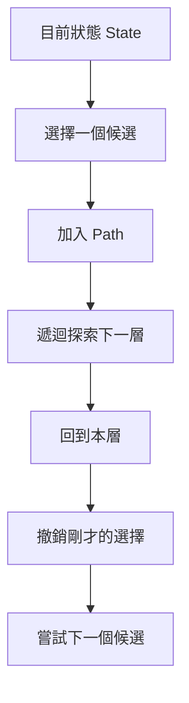
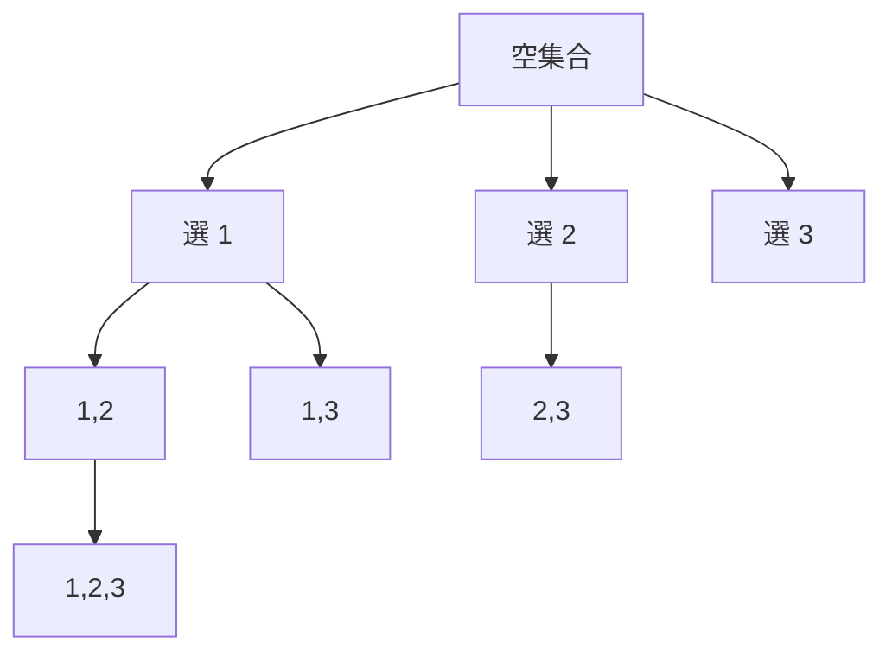
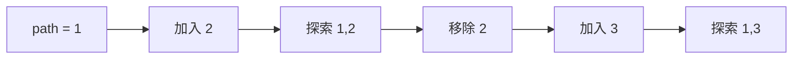
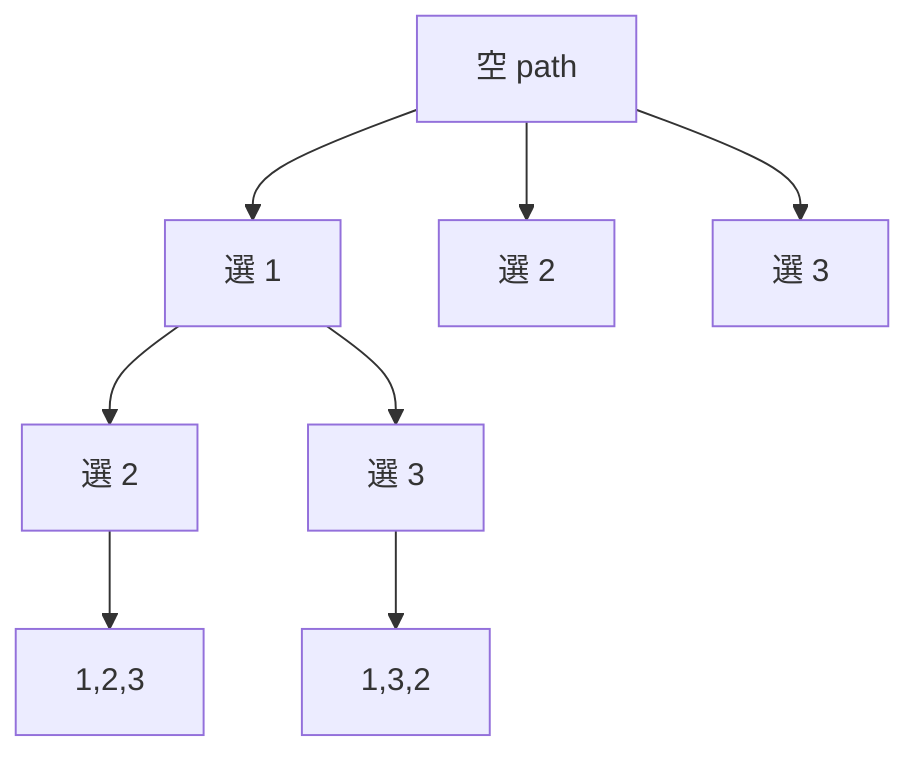
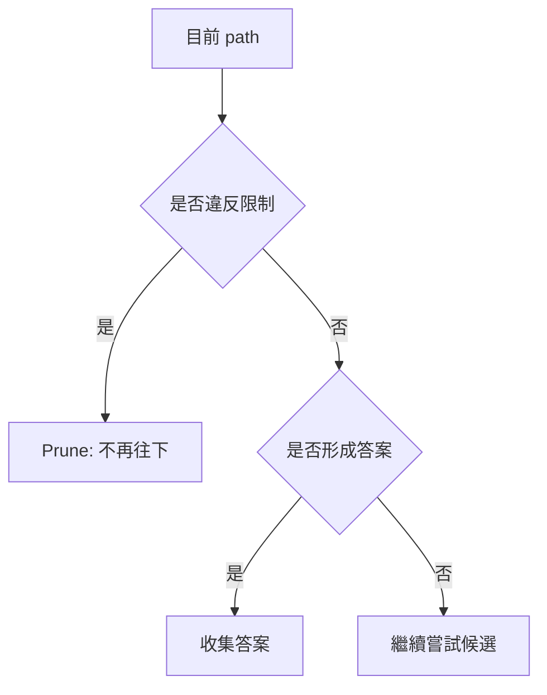

## 第 22 章　Backtracking

### 適用範圍

本章說明 Backtracking，也就是在決策樹中「做選擇、往下探索、再撤銷選擇」的解題方式。

Backtracking 常用在需要列舉所有可能答案的題目，例如：

- Subset
- Combination
- Permutation
- N-Queens
- 括號產生
- 迷宮路徑
- 含限制條件的搜尋問題

Backtracking 與一般遞迴的差異在於，它通常會維護一條目前路徑 `path`，並在探索不同分支時還原狀態。若狀態沒有正確還原，後面的分支就會受到前一個分支影響。



### 適用讀者

- 已理解 Recursion，但不熟悉「選擇與撤銷」流程的讀者。
- 容易在 Subset、Combination、Permutation 中混淆的讀者。
- 常因 path、used、startIndex 或狀態還原出錯的讀者。
- 想理解 Decision Tree 與 Pruning 的讀者。
- 想建立可重複使用的 Backtracking 解題模板的讀者。

### 快速導覽

- [22.1 Backtracking 前要先分析什麼](#221-backtracking-前要先分析什麼)：先確認選擇空間與答案型態。
- [22.2 Decision Tree](#222-decision-tree)：把選擇過程看成樹。
- [22.3 選擇、遞迴與撤銷](#223-選擇遞迴與撤銷)：Backtracking 的核心流程。
- [22.4 Path 與 State](#224-path-與-state)：區分目前答案與全域限制資訊。
- [22.5 Subset](#225-subset)：每個元素選或不選。
- [22.6 Combination](#226-combination)：選固定數量且不在乎順序。
- [22.7 Permutation](#227-permutation)：排列所有元素且順序重要。
- [22.8 去除重複](#228-去除重複)：處理重複值造成的重複答案。
- [22.9 Constraint 與 Pruning](#229-constraint-與-pruning)：用限制條件減少搜尋。
- [22.10 狀態還原](#2210-狀態還原)：確認每個分支互不干擾。
- [22.11 常見問題與判讀](#2211-常見問題與判讀)：整理常見錯誤。
- [22.12 本章檢查表](#2212-本章檢查表)：確認是否掌握核心概念。
- [22.13 本章重點](#2213-本章重點)：回顧本章核心。

### 22.1 Backtracking 前要先分析什麼

假設題目如下：

給定 `[1, 2, 3]`，列出所有 Subset。

先整理分析表：

<table>
<tr><th>分析項目</th><th>本題內容</th></tr>
<tr><td>輸入</td><td>一組不重複整數</td></tr>
<tr><td>輸出</td><td>所有 Subset</td></tr>
<tr><td>答案順序是否重要</td><td>Subset 內順序不重要</td></tr>
<tr><td>每個元素能用幾次</td><td>最多一次</td></tr>
<tr><td>是否需要固定長度</td><td>不需要</td></tr>
<tr><td>是否有重複值</td><td>本例沒有</td></tr>
<tr><td>候選選擇</td><td>每一層選擇從哪個 index 繼續</td></tr>
</table>

這張表會決定：

- 是否需要 `startIndex`。
- 是否需要 `used` 陣列。
- 是否要排序以處理重複值。
- 什麼時候把 `path` 放入答案。

### 22.2 Decision Tree

Backtracking 可以看成走訪一棵 Decision Tree。

以 Subset `[1, 2, 3]` 為例，每一層可以選擇下一個要加入的元素。



這棵樹中的每個節點都可以是一個 Subset。

#### 為什麼要用樹來想

Decision Tree 可以幫助確認：

- 每一層有哪些候選。
- 哪些路徑會形成答案。
- 是否會產生重複答案。
- 是否可以提早停止某些分支。

### 22.3 選擇、遞迴與撤銷

Backtracking 的核心流程通常是：

1. 做一個選擇。
2. 將選擇加入目前路徑。
3. 遞迴探索下一層。
4. 回到本層後，撤銷剛才的選擇。
5. 嘗試下一個選擇。

```cpp
path.push_back(choice);
backtrack(nextState);
path.pop_back();
```

這三行是 Backtracking 的核心。

#### 為什麼需要撤銷

因為 `path` 是不同分支共用的暫存路徑。

若探索完 `[1, 2]` 後沒有移除 2，下一個分支 `[1, 3]` 可能會錯誤變成 `[1, 2, 3]`。



### 22.4 Path 與 State

Backtracking 中常見兩種資訊：

<table>
<tr><th>名稱</th><th>意思</th><th>範例</th></tr>
<tr><td>Path</td><td>目前路徑，也就是已選內容</td><td>`[1, 3]`</td></tr>
<tr><td>State</td><td>描述目前搜尋狀態的其他資訊</td><td>`startIndex`、`used`、剩餘總和</td></tr>
</table>

#### startIndex

在 Combination 或 Subset 中，為了避免重複選前面的元素，通常使用 `startIndex` 表示下一層可以從哪裡開始選。

#### used

在 Permutation 中，因為每一層都可以從所有元素中挑一個還沒用過的元素，所以通常使用 `used` 記錄哪些 index 已經在目前 path 中。

### 22.5 Subset

Subset 的特性是：每個元素可以選或不選，答案長度不固定。

#### C++ 範例

```cpp
#include <vector>

void backtrackSubsets(
    const std::vector<int>& nums,
    int startIndex,
    std::vector<int>& path,
    std::vector<std::vector<int>>& result)
{
    result.push_back(path);

    for (int i = startIndex; i < static_cast<int>(nums.size()); ++i)
    {
        path.push_back(nums[i]);
        backtrackSubsets(nums, i + 1, path, result);
        path.pop_back();
    }
}

std::vector<std::vector<int>> subsets(const std::vector<int>& nums)
{
    std::vector<std::vector<int>> result;
    std::vector<int> path;
    backtrackSubsets(nums, 0, path, result);
    return result;
}
```

#### 為什麼一進入函式就加入 result

Subset 的每個中間節點都是一個合法答案。

例如：

- `[]`
- `[1]`
- `[1, 2]`
- `[1, 2, 3]`

都應該被收集。

### 22.6 Combination

Combination 是從 n 個元素中選 k 個，不在乎順序。

例如從 `[1, 2, 3, 4]` 選 2 個：

```text
[1,2], [1,3], [1,4], [2,3], [2,4], [3,4]
```

#### C++ 範例

```cpp
#include <vector>

void backtrackCombinations(
    int n,
    int k,
    int start,
    std::vector<int>& path,
    std::vector<std::vector<int>>& result)
{
    if (static_cast<int>(path.size()) == k)
    {
        result.push_back(path);
        return;
    }

    for (int value = start; value <= n; ++value)
    {
        path.push_back(value);
        backtrackCombinations(n, k, value + 1, path, result);
        path.pop_back();
    }
}

std::vector<std::vector<int>> combine(int n, int k)
{
    std::vector<std::vector<int>> result;
    std::vector<int> path;
    backtrackCombinations(n, k, 1, path, result);
    return result;
}
```

#### 可以加入剪枝

若剩餘元素數量不夠補滿 `k`，就不需要再搜尋。

```cpp
for (int value = start; value <= n - (k - path.size()) + 1; ++value)
{
    path.push_back(value);
    backtrackCombinations(n, k, value + 1, path, result);
    path.pop_back();
}
```

這段上限的意思是：保留足夠元素給後面的位置使用。

### 22.7 Permutation

Permutation 是排列，順序重要。

`[1, 2, 3]` 的排列包含：

```text
[1,2,3]
[1,3,2]
[2,1,3]
[2,3,1]
[3,1,2]
[3,2,1]
```

Permutation 通常需要 `used` 陣列，因為每一層都可以從所有尚未使用的元素中選一個。



#### C++ 範例

```cpp
#include <vector>

void backtrackPermutations(
    const std::vector<int>& nums,
    std::vector<int>& path,
    std::vector<bool>& used,
    std::vector<std::vector<int>>& result)
{
    if (path.size() == nums.size())
    {
        result.push_back(path);
        return;
    }

    for (int i = 0; i < static_cast<int>(nums.size()); ++i)
    {
        if (used[i])
        {
            continue;
        }

        used[i] = true;
        path.push_back(nums[i]);

        backtrackPermutations(nums, path, used, result);

        path.pop_back();
        used[i] = false;
    }
}

std::vector<std::vector<int>> permute(const std::vector<int>& nums)
{
    std::vector<std::vector<int>> result;
    std::vector<int> path;
    std::vector<bool> used(nums.size(), false);
    backtrackPermutations(nums, path, used, result);
    return result;
}
```

### 22.8 去除重複

如果輸入有重複值，Backtracking 可能產生重複答案。

例如：

```text
[1, 1, 2]
```

排列時，兩個 1 若只看數值，交換它們的位置不會產生新的答案。

常見處理方式：

1. 先排序。
2. 在同一層中，跳過和前一個相同且前一個尚未使用的元素。

#### Permutation II 常見判斷

```cpp
if (i > 0 && nums[i] == nums[i - 1] && !used[i - 1])
{
    continue;
}
```

這個條件的重點是「同一層避免選到重複值作為分支起點」。

#### C++ 範例

```cpp
#include <algorithm>
#include <vector>

void backtrackUniquePermutations(
    const std::vector<int>& nums,
    std::vector<int>& path,
    std::vector<bool>& used,
    std::vector<std::vector<int>>& result)
{
    if (path.size() == nums.size())
    {
        result.push_back(path);
        return;
    }

    for (int i = 0; i < static_cast<int>(nums.size()); ++i)
    {
        if (used[i])
        {
            continue;
        }

        if (i > 0 && nums[i] == nums[i - 1] && !used[i - 1])
        {
            continue;
        }

        used[i] = true;
        path.push_back(nums[i]);
        backtrackUniquePermutations(nums, path, used, result);
        path.pop_back();
        used[i] = false;
    }
}

std::vector<std::vector<int>> permuteUnique(std::vector<int> nums)
{
    std::sort(nums.begin(), nums.end());

    std::vector<std::vector<int>> result;
    std::vector<int> path;
    std::vector<bool> used(nums.size(), false);

    backtrackUniquePermutations(nums, path, used, result);
    return result;
}
```

### 22.9 Constraint 與 Pruning

Constraint 是題目的限制條件。Pruning 是根據限制提早停止不可能產生答案的分支。

例如 Combination Sum 中，若所有數字都是正數，且目前總和已超過 target，就可以停止探索。



#### 剪枝成立條件

剪枝不是看到數字變大就一定能用。必須確認：

- 後續選擇是否只會讓某個值單調增加。
- 是否所有數字都是正數。
- 是否排序後可以安全停止迴圈。

如果資料含負數，總和超過 target 後，後面仍可能因為加入負數而回到 target，因此這種剪枝未必成立。

### 22.10 狀態還原

Backtracking 中最容易出錯的地方是狀態還原。

每次做了選擇，都要在遞迴回來後撤銷對應變更。

<table>
<tr><th>做選擇</th><th>撤銷選擇</th></tr>
<tr><td>`path.push_back(x)`</td><td>`path.pop_back()`</td></tr>
<tr><td>`used[i] = true`</td><td>`used[i] = false`</td></tr>
<tr><td>`sum += x`</td><td>`sum -= x`</td></tr>
</table>

#### 錯誤範例

```cpp
used[i] = true;
path.push_back(nums[i]);

backtrackPermutations(nums, path, used, result);

path.pop_back();
// 忘記 used[i] = false;
```

這會讓後面的分支誤以為 `nums[i]` 還在使用中。

### 22.11 常見問題與判讀

<table>
<tr><th>現象</th><th>可能原因</th><th>第一輪檢查</th></tr>
<tr><td>答案缺少部分組合</td><td>startIndex 或迴圈範圍錯誤</td><td>用小資料畫 Decision Tree</td></tr>
<tr><td>答案重複</td><td>重複值未處理或同一層未跳過</td><td>排序後檢查去重條件</td></tr>
<tr><td>Permutation 少答案</td><td>used 沒有正確還原</td><td>檢查每個 true 是否對應 false</td></tr>
<tr><td>Subset 少空集合</td><td>沒有在入口收集 path</td><td>確認空 path 是否為合法答案</td></tr>
<tr><td>Combination 出現不同順序但同內容答案</td><td>沒有使用 startIndex</td><td>下一層應從 i + 1 開始</td></tr>
<tr><td>剪枝後答案錯誤</td><td>剪枝條件不成立</td><td>檢查是否有負數或非單調狀態</td></tr>
<tr><td>時間複雜度低估</td><td>忽略答案數量本身很大</td><td>Subset 有 2^n 個答案，Permutation 有 n! 個答案</td></tr>
</table>

### 22.12 本章檢查表

- 我能把 Backtracking 看成 Decision Tree。
- 我能說明每一層有哪些候選。
- 我能區分 Path 與 State。
- 我能寫出選擇、遞迴、撤銷三個步驟。
- 我知道 Subset 通常使用 startIndex。
- 我知道 Combination 通常使用 startIndex 並在長度達到 k 時收集答案。
- 我知道 Permutation 通常使用 used 陣列。
- 我能處理輸入含重複值的情況。
- 我能說明剪枝條件為什麼成立。
- 我能確認每個狀態變更都有對應還原。
- 我會用小資料畫出 Decision Tree 檢查答案是否完整。
- 我知道 Backtracking 的複雜度常與答案數量有關。

### 22.13 本章重點

- Backtracking 是在決策樹中做選擇、遞迴探索、再撤銷選擇。
- Path 表示目前已選內容，State 表示搜尋所需的其他資訊。
- Subset 的每個中間節點都可能是答案。
- Combination 不在乎順序，因此通常使用 startIndex 避免重複組合。
- Permutation 在乎順序，因此通常使用 used 記錄目前哪些元素已被選。
- 含重複值的問題通常需要先排序，再在同一層跳過重複分支。
- Pruning 可以減少搜尋，但必須確認限制條件真的能排除後續分支。
- 狀態還原是 Backtracking 正確性的核心。
- Backtracking 的時間複雜度常由 Decision Tree 節點數與答案數量決定。
