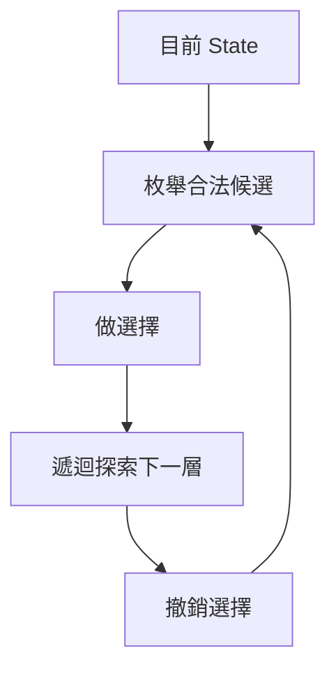
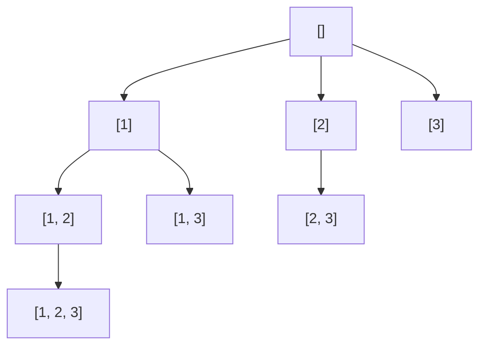
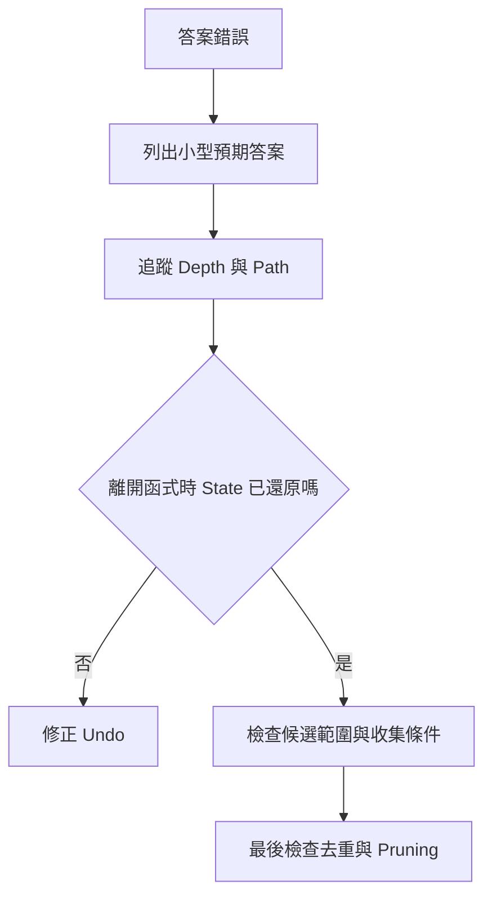

## 第 22 章　Backtracking

### 適用範圍

Backtracking 適合處理「需要列出、尋找或計算多種選擇結果」的問題，例如 Subset、Combination、Permutation、棋盤配置與路徑搜尋。

它的核心不是 Recursion 本身，而是反覆執行三個動作：

```text
做選擇
遞迴探索
撤銷選擇
```

每一層遞迴代表 Decision Tree 的一層，`path` 表示目前已做出的選擇。當一個分支探索完成後，必須讓共用狀態回到進入該分支前的內容，才能安全探索下一個分支。

本章使用以下固定流程：

1. 定義一個答案的完整格式。
2. 判斷順序是否重要。
3. 判斷每個候選可使用幾次。
4. 決定每一層可以選哪些候選。
5. 定義遞迴函式的 State 與契約。
6. 定義何時收集答案、何時停止。
7. 為每個狀態變更安排對應還原。
8. 再加入去重與安全的 Pruning。
9. 依搜尋樹與輸出數量分析複雜度。



### 適用讀者

- 已理解 Recursion，但不容易追蹤 Backtracking 流程的讀者。
- 不清楚 `push_back` 與 `pop_back` 為何成對出現的讀者。
- 容易混淆 Subset、Combination 與 Permutation 的讀者。
- 常漏掉 `startIndex`、`used`、去重或狀態還原的讀者。
- 想理解 Pruning 何時安全，以及複雜度為何通常很高的讀者。

### 快速導覽

- [22.1 Backtracking 前要分析什麼](#221-backtracking-前要分析什麼)
- [22.2 Decision Tree 與遞迴契約](#222-decision-tree-與遞迴契約)
- [22.3 Path 與狀態還原](#223-path-與狀態還原)
- [22.4 完整案例：Subset](#224-完整案例subset)
- [22.5 完整案例：Combination](#225-完整案例combination)
- [22.6 完整案例：Permutation](#226-完整案例permutation)
- [22.7 startIndex、used 與可重複選取](#227-startindexused-與可重複選取)
- [22.8 去除重複答案](#228-去除重複答案)
- [22.9 Pruning](#229-pruning)
- [22.10 Backtracking 與 DFS、Brute Force](#2210-backtracking-與-dfsbrute-force)
- [22.11 複雜度與輸出成本](#2211-複雜度與輸出成本)
- [22.12 Iterative State 與例外安全](#2212-iterative-state-與例外安全)
- [22.13 系統化 Debug](#2213-系統化-debug)
- [22.14 常見問題與判讀](#2214-常見問題與判讀)
- [22.15 本章檢查表](#2215-本章檢查表)
- [22.16 本章重點](#2216-本章重點)

### 22.1 Backtracking 前要分析什麼

拿到列舉問題時，先回答：

| 分析項目 | 要回答的問題 |
|---|---|
| 答案格式 | 一個答案由哪些元素或動作組成？ |
| 答案長度 | 固定、可變，還是直到抵達終點？ |
| 順序 | `[1, 2]` 與 `[2, 1]` 是否不同？ |
| 使用次數 | 每個候選最多一次、可重複，還是有上限？ |
| 候選集合 | 下一層可以從哪些項目中選？ |
| State | 除了 `path`，還要保存位置、總和、棋盤或 `used` 嗎？ |
| 收集條件 | 中間 State 是答案，還是只有完成 State 才是答案？ |
| 去重 | 輸入是否有重複值？相同值如何避免重複分支？ |
| Pruning | 哪些分支可證明不可能產生答案？ |

以 `[1, 2, 3]` 的 Subset 為例：

- 長度可為 0 到 3。
- 順序不重要。
- 每個 Index 最多使用一次。
- 每個中間 `path` 都是答案。
- 選取 Index `i` 後，下一層從 `i + 1` 開始。

#### 先不要急著寫遞迴

以 `[1, 2, 3]` 的 Subset 為例，先用手列出答案：

```text
選 0 個：[]
選 1 個：[1]、[2]、[3]
選 2 個：[1, 2]、[1, 3]、[2, 3]
選 3 個：[1, 2, 3]
```

這一步可以先確認三件事：

1. 空集合 `[]` 是答案。
2. `[1, 2]` 與 `[2, 1]` 視為同一個 Subset，因此不需要產生兩次。
3. 答案長度不固定，所以不能只在選滿全部元素時收集答案。

接著再問「人是怎麼列出這些答案的」：

```text
手上先是 []
拿 1，變成 [1]
再拿 2，變成 [1, 2]
再拿 3，變成 [1, 2, 3]

後面沒有東西可拿了：
放回 3，回到 [1, 2]
放回 2，回到 [1]
改拿 3，變成 [1, 3]
```

這段過程就是 Backtracking。程式中的 `path` 相當於手上的牌，`push_back()` 是拿牌，`pop_back()` 是把本輪拿的牌放回去。

#### 為什麼順序不重要時只往後選

產生 `[1, 2]` 後，如果下一個 Root 分支從 2 開始又允許回頭拿 1，就會再產生 `[2, 1]`。對 Subset 與 Combination 而言，這兩個答案內容相同。

因此選擇 Index `i` 後，下一層只考慮 `i + 1` 之後的候選。這不是為了讓程式比較短，而是在搜尋樹中直接移除代表相同答案的排列分支。

### 22.2 Decision Tree 與遞迴契約

Backtracking 可以看成走訪隱含的 Decision Tree：

- Node 是目前 State。
- Edge 是一個選擇。
- Root 是尚未選擇任何內容的初始 State。
- Leaf 可能是完整答案、失敗狀態或沒有候選的狀態。

遞迴函式應有明確契約。例如 Subset：

```text
backtrack(startIndex)
列出所有以目前 path 為前綴，
而且後續只使用 startIndex 之後元素的 Subset。
```

函式進入與離開時還應滿足：

```text
離開 backtrack(...) 時，
共享的 path 必須和進入函式時完全相同。
```

這是 Backtracking 最重要的 State Invariant。

### 22.3 Path 與狀態還原

`path` 表示目前 Decision Tree 路徑上的選擇，不等於所有答案。

```cpp
path.push_back(candidate);
backtrack(...);
path.pop_back();
```

可讀成：

```text
選 candidate
在此選擇下探索所有後續答案
取消 candidate
```

若還修改其他共享狀態，也要對稱還原：

```cpp
used[i] = true;
path.push_back(nums[i]);

backtrack(...);

path.pop_back();
used[i] = false;
```

還原順序通常與修改順序相反，較容易核對。

#### Copy State 與 Undo State

另一種寫法是每次建立新副本：

```cpp
auto nextPath = path;
nextPath.push_back(candidate);
backtrack(nextPath, ...);
```

這能降低共用狀態錯誤，但可能產生較多 Copy。教材與競賽程式常使用「修改後還原」，因為成本較低；選擇哪種方式應考慮可讀性、資料大小與正確性。

#### 用 `[1, 2, 3]` 追蹤 `path`

假設目前正在探索所有以 `[1]` 開頭的 Subset：

| 時間點 | 動作 | `path` | 說明 |
|---|---|---|---|
| 進入分支 | 已選 1 | `[1]` | 這是目前共同前綴 |
| 選擇 2 | `push_back(2)` | `[1, 2]` | 進入「有選 2」的分支 |
| 選擇 3 | `push_back(3)` | `[1, 2, 3]` | 繼續往下一層 |
| 返回上一層 | `pop_back()` | `[1, 2]` | 取消本層選的 3 |
| 返回 `[1]` | `pop_back()` | `[1]` | 取消先前選的 2 |
| 改選 3 | `push_back(3)` | `[1, 3]` | 探索 `[1, 3]` 分支 |

關鍵不是「把答案刪掉」。`result` 已經保存答案的副本；`pop_back()` 修改的是工作中的 `path`，目的是讓下一個分支從正確的共同前綴開始。

#### 為什麼 `result.push_back(path)` 不會受後續 `pop_back()` 影響

`result.push_back(path)` 會把目前 `path` 的內容複製進 `result`。之後對工作用 `path` 執行 `pop_back()`，不會回頭修改已存入 `result` 的那份 Vector。

可以把兩者分開理解：

```text
path   = 可反覆修改的草稿
result = 已完成答案的集合
```

#### 狀態還原不只包含 `path`

如果一個選擇同時修改多個 State，就必須全部還原。例如排列題會修改：

```text
path
used[i]
```

棋盤題可能修改：

```text
board[row][column]
columnUsed[column]
diagonalUsed[diagonal]
```

只還原其中一部分，下一個分支仍會讀到上一個分支留下的資料。

### 22.4 完整案例：Subset

#### State

```text
path = 目前已選元素
startIndex = 下一層可以開始選取的 Index
```

每個 `path` 都是合法 Subset，因此進入函式時先收集。

```cpp
#include <vector>

void collectSubsets(
    const std::vector<int>& nums,
    int startIndex,
    std::vector<int>& path,
    std::vector<std::vector<int>>& result) {

    result.push_back(path);

    for (int i = startIndex;
         i < static_cast<int>(nums.size());
         ++i) {

        path.push_back(nums[i]);
        collectSubsets(nums, i + 1, path, result);
        path.pop_back();
    }
}

std::vector<std::vector<int>> subsets(
    const std::vector<int>& nums) {

    std::vector<std::vector<int>> result;
    std::vector<int> path;
    collectSubsets(nums, 0, path, result);
    return result;
}
```

#### 為什麼使用 `i + 1`

因為每個 Index 最多使用一次，而且順序不重要。只往後選可以避免同時產生 `[1, 2]` 與 `[2, 1]`。

#### 收集時機

Subset 的答案長度不固定，所以每個 Node 都是答案。這與「到 Leaf 才收集」的寫法不同。

#### Subset 搜尋樹



每個 Node 都會收集一次，因此 `n` 個不同元素恰好得到 `2^n` 個 Subset。

#### 完整呼叫順序

輸入 `[1, 2, 3]` 時，答案通常依 DFS 順序產生：

```text
[]
[1]
[1, 2]
[1, 2, 3]
[1, 3]
[2]
[2, 3]
[3]
```

輸出順序不是 Subset 定義的一部分。若測試只要求答案集合相同，不應假設所有正確解法都會以相同順序輸出。

#### Subset 的正確性思路

對任一 Subset，把其中元素的 Index 由小到大排列。搜尋過程會依同樣順序選取這些 Index，因此一定能產生該 Subset。另一方面，因為 Index 只會嚴格增加，同一組 Index 不會由另一種順序再次產生，所以不重複。

### 22.5 完整案例：Combination

從 `1..n` 中選出恰好 `k` 個數字，順序不重要。

```text
path.size() == k
```

時才形成答案。

```cpp
#include <vector>

void collectCombinations(
    int n,
    int k,
    int start,
    std::vector<int>& path,
    std::vector<std::vector<int>>& result) {

    if (static_cast<int>(path.size()) == k) {
        result.push_back(path);
        return;
    }

    const int remainingNeeded =
        k - static_cast<int>(path.size());

    for (int value = start;
         value <= n - remainingNeeded + 1;
         ++value) {

        path.push_back(value);
        collectCombinations(
            n, k, value + 1, path, result);
        path.pop_back();
    }
}

std::vector<std::vector<int>> combine(int n, int k) {
    if (n < 0 || k < 0 || k > n) {
        return {};
    }

    std::vector<std::vector<int>> result;
    std::vector<int> path;
    collectCombinations(n, k, 1, path, result);
    return result;
}
```

`n - remainingNeeded + 1` 是安全 Pruning：若目前值再大，剩餘數字數量不足以把 `path` 補到長度 `k`。

#### Combination 與 Subset 的收集時機

兩者搜尋方式相似，但答案條件不同：

| 題型 | 目前 `path` 何時是答案？ |
|---|---|
| Subset | 每次進入函式時都是答案 |
| Combination | 只有 `path.size() == k` 時 |

例如 `k = 2`：

```text
[]          尚未選滿，不收集
[1]         尚未選滿，不收集
[1, 2]      長度為 2，收集
[1, 2, 3]   不應繼續產生
```

因此 Combination 收集答案後立即 `return`，避免再選成長度超過 `k` 的路徑。

#### 剩餘數量 Pruning 的推導

假設還需要選 `remainingNeeded` 個數。如果目前從 `value` 開始，包含 `value` 在內到 `n` 共有：

```text
n - value + 1
```

個候選。要有足夠候選完成答案，必須滿足：

```text
n - value + 1 >= remainingNeeded
```

整理後得到：

```text
value <= n - remainingNeeded + 1
```

這就是 Loop 上界的來源。若一開始不熟悉，可以先寫沒有此 Pruning 的正確版本，再加入並用小型案例核對。

### 22.6 完整案例：Permutation

Permutation 的順序重要。第一個位置選 2 後，第二個位置仍可選 1，因此不能只使用 `startIndex` 往後掃。

需要 `used[i]` 表示該 Index 是否已在目前 `path` 中。

```cpp
#include <vector>

void collectPermutations(
    const std::vector<int>& nums,
    std::vector<bool>& used,
    std::vector<int>& path,
    std::vector<std::vector<int>>& result) {

    if (path.size() == nums.size()) {
        result.push_back(path);
        return;
    }

    for (int i = 0;
         i < static_cast<int>(nums.size());
         ++i) {

        if (used[i]) {
            continue;
        }

        used[i] = true;
        path.push_back(nums[i]);

        collectPermutations(nums, used, path, result);

        path.pop_back();
        used[i] = false;
    }
}

std::vector<std::vector<int>> permute(
    const std::vector<int>& nums) {

    std::vector<std::vector<int>> result;
    std::vector<int> path;
    std::vector<bool> used(nums.size(), false);
    collectPermutations(nums, used, path, result);
    return result;
}
```

`used` 追蹤的是 Index，不是 Value。若輸入含兩個相同值，它們仍是兩個不同 Index，去重需要額外規則。

#### 為什麼 Permutation 不能使用一般 `startIndex`

假設第一個位置選了 2：

```text
path = [2]
```

下一個位置仍可能選 1 或 3。如果傳入 `startIndex = i + 1`，Index 0 的 1 會永久被排除，於是 `[2, 1, 3]` 無法產生。

Permutation 的問題不是「接下來只能往後選」，而是「全部元素都可考慮，但目前路徑已使用的 Index 不能再選」。所以使用 `used`。

#### `used` 的生命週期

```text
used[i] == true
```

只表示 Index `i` 正在目前這一條遞迴路徑中，不表示它已被所有分支永久使用。

因此：

```cpp
used[i] = true;
// 探索所有包含 nums[i] 的後續排列
used[i] = false;
```

若忘記恢復 `false`，後續兄弟分支會少掉該元素，Permutation 數量通常小於 `n!`。

### 22.7 `startIndex`、`used` 與可重複選取

| 題型 | 順序重要 | 每個候選使用次數 | 常見 State |
|---|---:|---:|---|
| Subset | 否 | 最多一次 | `startIndex`，下一層 `i + 1` |
| Combination | 否 | 最多一次 | `startIndex`，下一層 `value + 1` |
| Combination Sum | 否 | 可重複 | `startIndex`，下一層仍可從 `i` 開始 |
| Permutation | 是 | 最多一次 | `used` |

可重複選取時，若選了候選 `i` 後仍允許再次使用它，下一層可以傳入 `i`，而不是 `i + 1`。但若候選包含 0 或負數，遞迴可能不收斂，必須由規格保證進展，或增加使用上限與其他停止條件。

#### 可重複選取的例子

假設候選為 `[2, 3, 6, 7]`，Target 為 7，而且每個正整數可以重複使用。

選擇 2 後，下一層仍可選 2，因此傳入目前的 `i`：

```cpp
path.push_back(candidates[i]);
backtrack(i, remaining - candidates[i]);
path.pop_back();
```

若改傳 `i + 1`，就只能使用每個候選一次，`[2, 2, 3]` 會被漏掉。

這裡需要正數 Precondition。若候選為 0，選取後 `remaining` 不變；若候選為負數，`remaining` 可能遠離終止條件，兩者都可能造成無限遞迴。

### 22.8 去除重複答案

輸入含重複值時，必須區分：

- 同一路徑是否可使用兩個相同值。
- 同一層是否應由相同值開出多個等價分支。

常見流程：

1. 先排序。
2. 跳過同一層的重複起點。

Unique Permutation 的條件：

```cpp
if (i > 0
    && nums[i] == nums[i - 1]
    && !used[i - 1]) {
    continue;
}
```

其中 `!used[i - 1]` 表示前一個相同值目前不在路徑內，因此兩者正在競爭同一層的同一位置。跳過後一個可避免等價分支。

```cpp
#include <algorithm>
#include <vector>

void collectUniquePermutations(
    const std::vector<int>& nums,
    std::vector<bool>& used,
    std::vector<int>& path,
    std::vector<std::vector<int>>& result) {

    if (path.size() == nums.size()) {
        result.push_back(path);
        return;
    }

    for (int i = 0;
         i < static_cast<int>(nums.size());
         ++i) {

        if (used[i]) {
            continue;
        }

        if (i > 0
            && nums[i] == nums[i - 1]
            && !used[i - 1]) {
            continue;
        }

        used[i] = true;
        path.push_back(nums[i]);
        collectUniquePermutations(nums, used, path, result);
        path.pop_back();
        used[i] = false;
    }
}
```

去重不應只背條件。應先說明「哪些分支等價」以及「要避免的是同層重複，還是同一路徑重複」。

#### 「同層去重」與「同一路徑可重複值」

以排序後的 `[1a, 1b, 2]` 為例，`1a`、`1b` 表示兩個值相同但 Index 不同的元素。

在 Root 這一層：

```text
先由 1a 開分支
再由 1b 開分支
```

兩棵子樹會產生相同的數值排列，所以第二個 Root 分支應跳過。

但若 `1a` 已在目前路徑中，下一層選 `1b` 可能是合法的，因為答案確實可以包含兩個 1。這就是去重條件需要查看 `used[i - 1]` 的原因。

### 22.9 Pruning

Pruning 是提前停止可證明無法產生所需答案的分支。

常見方向：

- 剩餘候選不足以完成固定長度答案。
- 目前成本已不可能優於已知最佳解。
- 所有候選為正數，而且目前 Sum 已超過 Target。
- 排序後，當目前候選已超過剩餘需求，後面候選也不可能成功。
- Constraint 已被破壞，而且後續選擇無法修復。

Pruning 必須建立在題目條件上。例如有負數時，`sum > target` 不代表後續無法回到 Target。

正確性問題是：

```text
被剪掉的每個 State，是否都能證明沒有合法後代？
```

效能問題則是：

```text
剪枝能減少多少搜尋 Node？檢查成本本身是多少？
```

#### Pruning 不應改變答案集合

Pruning 是效能改善，不是答案規則。加入 Pruning 前後，輸出的合法答案集合應相同。

推薦驗證順序：

1. 先完成沒有 Pruning 的版本。
2. 用小型輸入列出完整答案。
3. 加入一條 Pruning。
4. 再比較答案集合。
5. 每次只增加一項，較容易找到哪條推理造成漏解。

#### 通用骨架應如何閱讀

```cpp
void backtrack(State& state) {
    if (isComplete(state)) {
        collect(state);
        return;
    }

    for (const Candidate& candidate : candidates(state)) {
        if (!isAllowed(state, candidate)) {
            continue;
        }

        apply(state, candidate);
        backtrack(state);
        undo(state, candidate);
    }
}
```

這不是可直接套用所有題目的固定程式。真正需要依題目回答的是：

- `State` 包含什麼？
- `isComplete` 是答案條件還是失敗條件？
- `candidates` 每一層有哪些候選？
- `apply` 改了哪些資料？
- `undo` 是否完整還原？

### 22.10 Backtracking 與 DFS、Brute Force

- DFS 描述搜尋樹或 Graph 的走訪順序。
- Backtracking 常以 DFS 方式探索 Decision Tree，並在返回時還原 State。
- Brute Force 表示全面枚舉候選；Backtracking 可以視為有結構的枚舉，並可加入 Constraint 與 Pruning。

不是所有 DFS 都有狀態還原。例如只用 `visited` 走訪一般 Graph，可能不需要在返回時取消永久訪問標記。相反地，若 `visited` 表示「目前路徑中」，離開路徑時通常要還原。

### 22.11 複雜度與輸出成本

Backtracking 的成本通常至少與輸出數量相關：

- Subset 有 `2^n` 個答案。
- 長度 `k` 的 Combination 有 `C(n, k)` 個答案。
- Permutation 有 `n!` 個答案。

若每個答案都複製長度最多 `n` 的 `path`：

```text
Subset 輸出成本可達 O(n × 2^n)
Permutation 輸出成本可達 O(n × n!)
```

Recursive Stack 與單一路徑通常使用 O(n) 空間，但 `result` 的儲存成本可能遠高於工作空間。

Pruning 可改善特定輸入的搜尋量，但不一定改變最差情況上界。

### 22.12 Iterative State 與例外安全

「修改後還原」假設遞迴正常返回。若回呼、配置或其他函式可能丟出例外，手動 `pop_back` 可能無法執行。

一般演算法題通常不處理此情境；正式程式可考慮：

- 使用 State Copy。
- 以 RAII Guard 在 Scope 結束時自動還原。
- 限制遞迴區段中可能丟出例外的動作。

此外，搜尋深度很大時可能造成 Stack Overflow。可改用明確 Stack 模擬 DFS，但「進入 State」與「離開 State」仍需清楚區分。

### 22.13 系統化 Debug

每次遞迴記錄：

```text
Depth
Function Parameters
path 進入時內容
本層候選集合
選取的候選
遞迴前 State
遞迴後 State
撤銷後 State
是否收集答案
是否 Prune
```

建議流程：

1. 使用 `[1, 2, 3]` 或更小輸入。
2. 寫出預期答案集合，不只比較數量。
3. 為每次函式呼叫印出 Depth 與 `path`。
4. 檢查離開函式時 State 是否和進入時相同。
5. 確認收集答案的時機。
6. 關閉 Pruning 與去重，先驗證基本搜尋樹。
7. 逐一重新加入最佳化。
8. 找出第一個多出的分支、漏掉的分支或錯誤 State。



### 22.14 常見問題與判讀

| 現象 | 可能原因 | 第一輪檢查 |
|---|---|---|
| `path` 混入上一分支元素 | 未撤銷選擇 | 每個修改是否有對應 Undo |
| Subset 少空集合 | 沒有收集初始 `path` | 空集合是否為合法答案 |
| Combination 出現不同順序 | 下一層仍從頭掃描 | 使用 `startIndex` |
| Combination 少答案 | Loop 上界 Pruning 錯誤 | 暫時移除 Pruning 比對 |
| Permutation 少答案 | `used` 未還原 | 每個 `true` 是否回復 `false` |
| Permutation 有重複元素 | 只檢查 `used`，未做同層去重 | 排序並檢查等價分支 |
| 無限遞迴 | State 沒有進展 | 候選是否可重複且值為 0 或負數 |
| Pruning 後漏答案 | 剪枝推理不成立 | 驗證被剪 State 是否真的無合法後代 |
| 時間仍很高 | 輸出數量本身巨大 | 先估算 `2^n`、`C(n,k)`、`n!` |
| 記憶體很高 | 保存所有答案 | 區分 Streaming Callback 與完整 Result |
| Graph 路徑被錯誤排除 | 將永久 Visited 與目前路徑混用 | 定義 `visited` 的生命週期 |

### 22.15 本章檢查表

- 我能定義一個完整答案的格式。
- 我能判斷順序是否重要、候選可使用幾次。
- 我能寫出遞迴函式契約。
- 我知道 `path` 表示目前搜尋路徑。
- 我能確認離開函式時共享 State 完全還原。
- 我知道 Subset 為何每個中間 `path` 都可收集。
- 我知道 Combination 為何使用 `startIndex`。
- 我知道 Permutation 為何使用 `used`。
- 我能區分下一層傳入 `i` 與 `i + 1` 的語意。
- 我能說明去重是在消除哪些等價分支。
- 我不會在未證明時加入 Pruning。
- 我能區分 DFS、Backtracking 與 Brute Force。
- 我會把輸出數量納入複雜度。
- 我能用小型搜尋樹找出第一個錯誤 State。

### 22.16 本章重點

- Backtracking 是沿 Decision Tree 逐一探索選擇的搜尋方式。
- 每個分支通常包含做選擇、遞迴探索與撤銷選擇。
- `path` 是目前答案前綴，而不是所有答案。
- 遞迴函式離開時，共享 State 應與進入時相同。
- Subset、Combination、Permutation 的主要差異是答案長度、順序與候選使用方式。
- `startIndex` 避免產生同一組內容的不同順序；`used` 追蹤目前排列已使用的 Index。
- 可重複選取時，下一層是否傳入 `i` 必須由題目規格決定。
- 去重應先辨認同層等價分支，再寫跳過條件。
- Pruning 必須證明被移除的 State 不可能有合法後代。
- 執行成本常由搜尋樹與輸出數量主導，可能是指數或階乘等級。
- Debug 時先停用最佳化，確認基本搜尋樹與 State 還原，再逐一加入去重與 Pruning。
