## 第 23 章　Tree 基礎

### 適用範圍

本章介紹 Tree 的基本資料模型，包括 Node、Edge、Root、Parent、Child、Leaf、Depth、Height、Level、Subtree，以及 Binary Tree 的常見類型與 Array、Pointer 表示方式。

Tree 題目的困難通常不是走訪語法，而是名詞與狀態沒有先定義清楚，例如：

- 空 Tree 的 Height 是多少。
- Root 的 Depth 從 0 還是 1 開始。
- Height 是以 Edge 數還是 Node 數計算。
- 題目給的是一般 Tree、Binary Tree，還是 Binary Search Tree。
- 輸入是 Root Pointer、Parent Array、Edge List，還是完整 Array 表示。
- 遞迴函式回傳的是目前 Node 的答案，還是整棵 Subtree 的摘要。

本章會建立一套固定流程：

1. 先定義 Tree 類型與空 Tree 行為。
2. 明確區分 Node Identity 與 Node Value。
3. 定義 Root、Parent、Child、Sibling 與 Leaf。
4. 統一 Depth、Level 與 Height 的計算方式。
5. 將 Tree 問題拆成「目前 Node」與「Child Subtree」。
6. 為遞迴寫出 Base Case、Subproblem 與組合方式。
7. 分別計算 Node 走訪成本與 Call Stack 空間。
8. 以空 Tree、單一 Node、鏈狀 Tree、完整 Tree 與重複值測試。

### 適用讀者

- 第一次系統化學習 Tree 的讀者。
- 會寫遞迴，但不清楚函式回傳值語意的讀者。
- 容易混淆 Depth、Height 與 Level 的讀者。
- 把 Binary Tree 和 Binary Search Tree 視為相同結構的讀者。
- 需要理解 Pointer Tree 與 Array Tree 表示差異的讀者。
- 想為後續 DFS、BFS、BST、Heap 與 Tree DP 建立基礎的讀者。

### 快速導覽

- [Tree 到底是什麼](#231-tree-到底是什麼)
- [Node、Edge 與 Root](#232-nodeedge-與-root)
- [Parent、Child、Sibling 與 Leaf](#233-parentchildsibling-與-leaf)
- [Depth、Level 與 Height](#234-depthlevel-與-height)
- [Subtree 與遞迴模型](#235-subtree-與遞迴模型)
- [Binary Tree 的常見類型](#236-binary-tree-的常見類型)
- [Pointer 表示](#237-pointer-表示)
- [Array 表示](#238-array-表示)
- [完整案例：計算 Node 數量](#239-完整案例計算-node-數量)
- [完整案例：計算 Tree Height](#2310-完整案例計算-tree-height)
- [DFS 與 BFS 的基本差異](#2311-dfs-與-bfs-的基本差異)
- [Tree 正確性與複雜度](#2312-tree-正確性與複雜度)
- [Ownership 與生命週期](#2313-ownership-與生命週期)
- [C 語言中的 Tree](#2314-c-語言中的-tree)
- [系統化 Debug](#2315-系統化-debug)
- [建立自己的 Tree 分析表](#2316-建立自己的-tree-分析表)
- [常見問題與判讀](#2317-常見問題與判讀)
- [練習題方向](#2318-練習題方向)
- [本章檢查表](#2319-本章檢查表)
- [本章重點](#2320-本章重點)

### 23.1 Tree 到底是什麼

Tree 是由 Node 與 Edge 組成的階層結構。Rooted Tree 會指定一個 Root，其他 Node 可依 Root 方向形成 Parent 與 Child 關係。

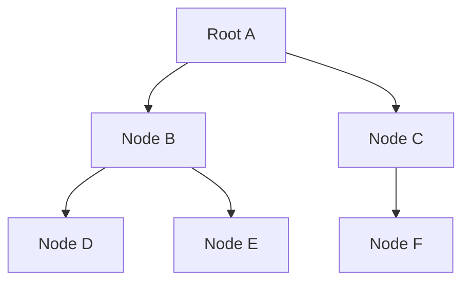

在一般有限 Tree 中：

- 任意兩個 Node 之間有唯一簡單 Path。
- 沒有 Cycle。
- 若有 n 個 Node，通常有 n - 1 條 Edge。

若結構中存在 Cycle，或某個 Child 同時由多個 Parent 指向，它可能是 Graph 或 DAG，而不是本章假設的 Tree。

### 23.2 Node、Edge 與 Root

#### Node

Node 保存資料與連接關係。資料可以是 Value、Key、狀態或物件。

#### Edge

Edge 連接兩個 Node。在 Rooted Tree 中，通常由 Parent 指向 Child。

#### Root

Root 是沒有 Parent 的起點。非空 Rooted Tree 恰好有一個 Root。

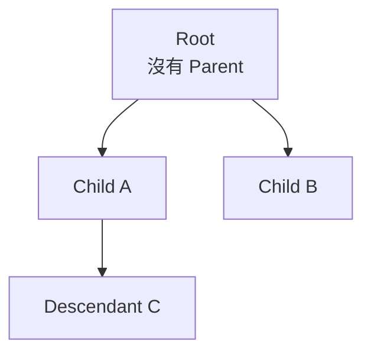

空 Tree 沒有 Root，通常使用 `nullptr` 或空容器表示。

#### Node Identity 與 Value

兩個 Node 可以保存相同 Value，但仍是不同 Node：

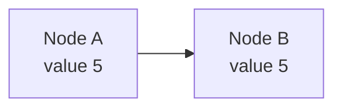

比較 Value 與比較 Node Identity 是不同問題。判斷 Tree 結構、Ancestor 或共享 Node 時，通常需要 Identity。

### 23.3 Parent、Child、Sibling 與 Leaf

若 Edge 由 A 指向 B：

- A 是 B 的 Parent。
- B 是 A 的 Child。

具有相同 Parent 的 Node 稱為 Sibling。

沒有 Child 的 Node 稱為 Leaf。

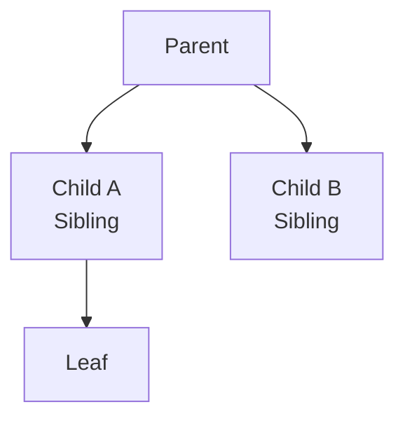

#### Ancestor 與 Descendant

沿 Parent 方向可到達的 Node 是 Ancestor；沿 Child 方向可到達的 Node 是 Descendant。Node 是否視為自己的 Ancestor，需依題目定義，常見做法是另外區分 Proper Ancestor。

#### Degree

Node 的 Degree 可表示 Child 數量。Binary Tree 中每個 Node 最多有兩個 Child。

### 23.4 Depth、Level 與 Height

本章採用 Edge 數定義：

- Root Depth = 0。
- Child Depth = Parent Depth + 1。
- Node Height = 從該 Node 到最深 Leaf 的最大 Edge 數。
- Leaf Height = 0。
- 非空 Tree Height = Root Height。
- 空 Tree Height = -1。

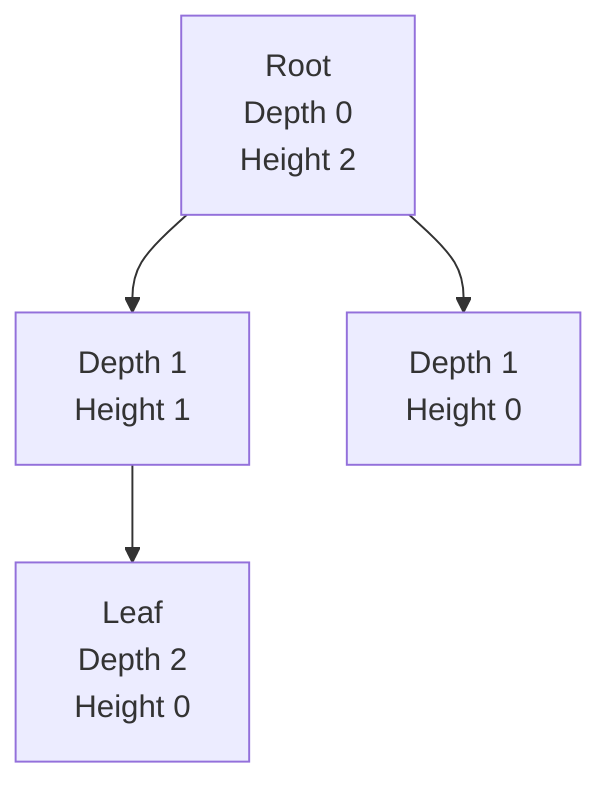

有些教材以 Node 數定義 Height，這時 Leaf Height 會是 1，空 Tree 可能是 0。兩種定義都可使用，但程式、公式與測試必須保持一致。

#### Level

Level 有時等同 Depth，有時從 1 開始。題目只寫 Level 時，應先確認定義，不要自行假設。

#### Depth 與 Height 的方向

```text
Depth：從 Root 往目前 Node
Height：從目前 Node 往最深 Leaf
```

Depth 通常由上往下傳遞；Height 通常由下往上組合 Child 結果。

### 23.5 Subtree 與遞迴模型

以某個 Node 為 Root，包含它與所有 Descendant 的結構稱為 Subtree。

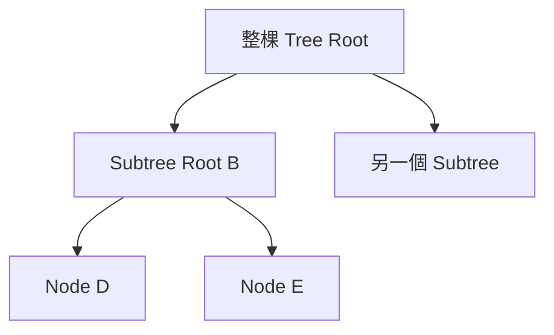

Tree 遞迴的核心模型是：

> 假設每個 Child Subtree 的答案已正確取得，目前 Node 如何組合成自己的答案？

典型結構：

```cpp
Result solve(TreeNode* node)
{
    if (node == nullptr)
    {
        return baseResult;
    }

    Result left = solve(node->left);
    Result right = solve(node->right);
    return combine(node, left, right);
}
```

需要明確定義：

- `Result` 代表什麼。
- 空 Subtree 回傳什麼 Identity 或 Sentinel。
- `combine` 如何使用目前 Node 與 Child Result。

### 23.6 Binary Tree 的常見類型

#### Binary Tree

每個 Node 最多有 Left Child 與 Right Child。沒有排序保證。

#### Full Binary Tree

每個 Node 的 Child 數是 0 或 2。

#### Complete Binary Tree

除了最後一層外，其餘層填滿；最後一層由左至右填入。Heap 常使用此形狀。

#### Perfect Binary Tree

所有內部 Node 都有兩個 Child，而且所有 Leaf 位於相同 Depth。

#### Balanced Binary Tree

通常表示 Tree Height 沒有過度偏斜，但精確條件依資料結構而異。例如 AVL Tree 對每個 Node 的左右 Subtree Height 差有明確限制。

#### Binary Search Tree

除 Binary Tree 結構外，還具備 Key 排序規則。重複 Key 放置政策必須另行定義。

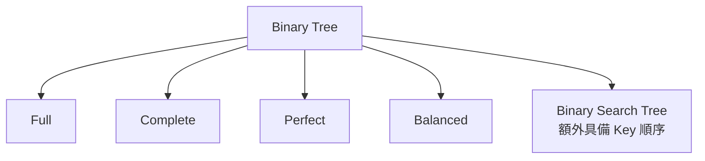

這些名詞描述不同性質，不是互斥分類。一棵 Tree 可以同時是 Full、Complete 與 Perfect。

### 23.7 Pointer 表示

```cpp
struct TreeNode
{
    int value;
    TreeNode* left;
    TreeNode* right;
};
```

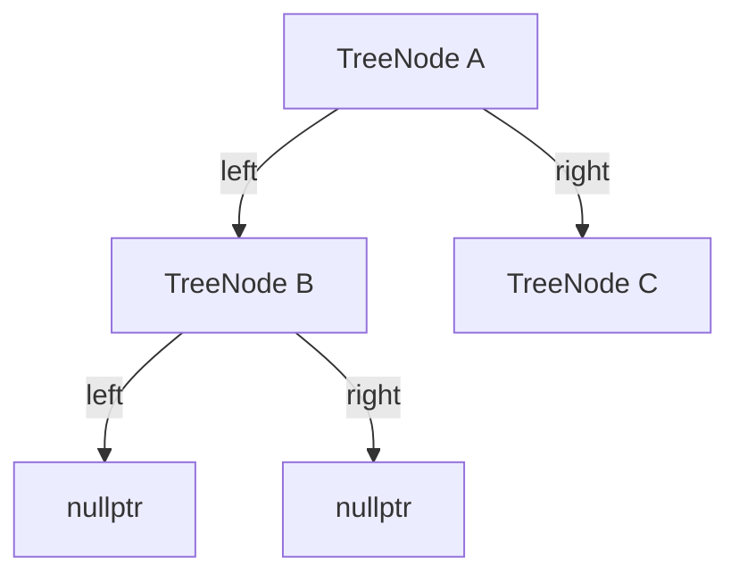

Pointer 表示適合：

- Tree 形狀不完整。
- 經常新增或移除 Node。
- Node 還包含其他 State。

缺點包括：

- 每個 Node 需要 Child Pointer。
- Node 可能分散配置。
- Ownership 與釋放責任需另行管理。

### 23.8 Array 表示

Complete Binary Tree 常用 Array 儲存。0-based Index 下：

```text
left child  = 2 * i + 1
right child = 2 * i + 2
parent      = (i - 1) / 2，僅適用 i > 0
```

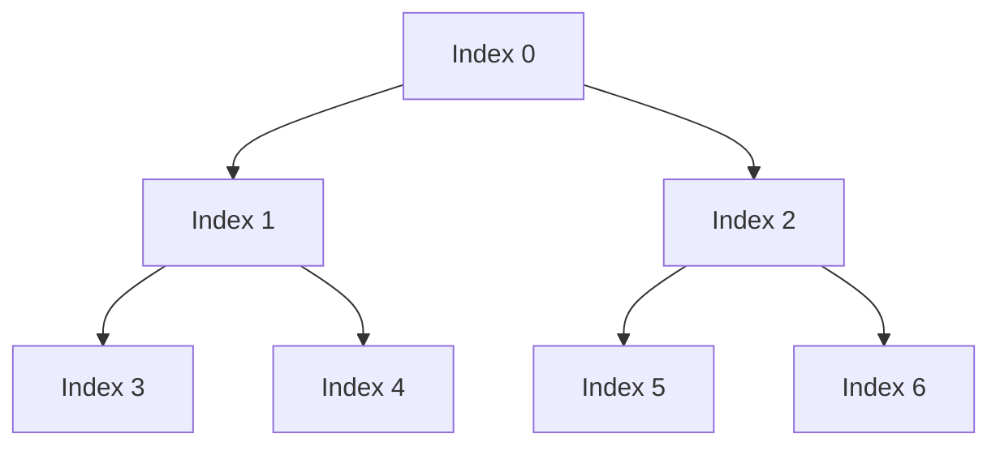

Array 表示適合 Complete Tree，定位 Parent 與 Child 為 O(1)。若 Tree 高度很大但非常稀疏，保留大量空位置會浪費空間。

計算 `2 * i + 1` 前也要考慮 Index 型別 Overflow，並檢查結果小於 Array Size。

### 23.9 完整案例：計算 Node 數量

#### Postcondition

回傳以 `node` 為 Root 的 Subtree Node 數量。

```cpp
#include <cstddef>

std::size_t countNodes(const TreeNode* node)
{
    if (node == nullptr)
    {
        return 0;
    }

    return 1
         + countNodes(node->left)
         + countNodes(node->right);
}
```

#### Base Case

空 Subtree 沒有 Node，回傳 0。

#### 遞迴步驟

假設左右 Child 函式分別正確回傳左右 Subtree Node 數量。目前答案為：

```text
目前 Node 1 個 + Left Subtree + Right Subtree
```

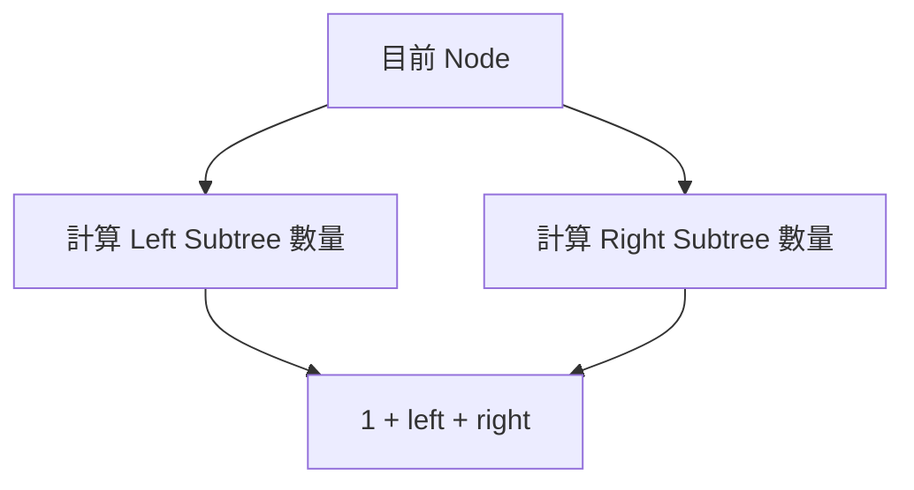

#### 複雜度

每個 Node 恰好處理一次：

- 時間 O(n)。
- Call Stack 平均取決於形狀，最差 O(h)。
- 平衡 Tree 的 h 約為 O(log n)，鏈狀 Tree 的 h 可達 O(n)。

### 23.10 完整案例：計算 Tree Height

本章採 Edge 數定義，空 Tree Height = -1，Leaf Height = 0。

```cpp
#include <algorithm>

int treeHeight(const TreeNode* node)
{
    if (node == nullptr)
    {
        return -1;
    }

    return 1 + std::max(
        treeHeight(node->left),
        treeHeight(node->right));
}
```

#### 為何空 Tree 回傳 -1

Leaf 的兩個 Child 都是空 Subtree：

```text
1 + max(-1, -1) = 0
```

因此 Leaf Height 自然為 0。

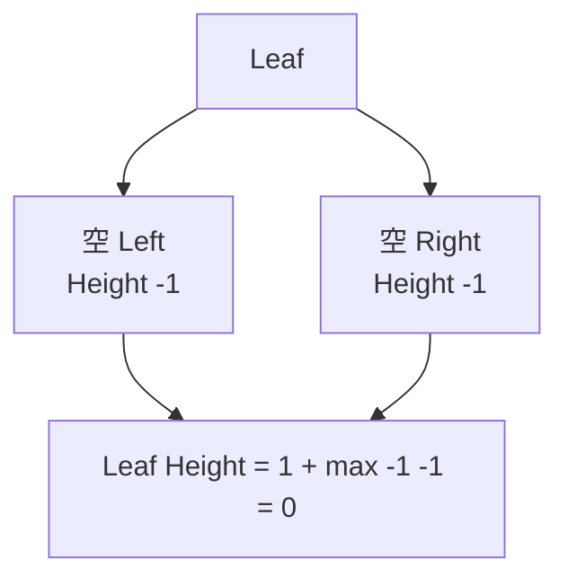

若採 Node 數定義，Base Case 可改為 0，Leaf Height 會是 1。不可只改註解而不改公式與測試。

### 23.11 DFS 與 BFS 的基本差異

#### DFS

優先深入某個 Child Subtree。可用遞迴或顯式 Stack。

常見順序：

- Preorder：Node、Left、Right。
- Inorder：Left、Node、Right。
- Postorder：Left、Right、Node。

#### BFS

使用 Queue 依 Depth Layer 走訪。

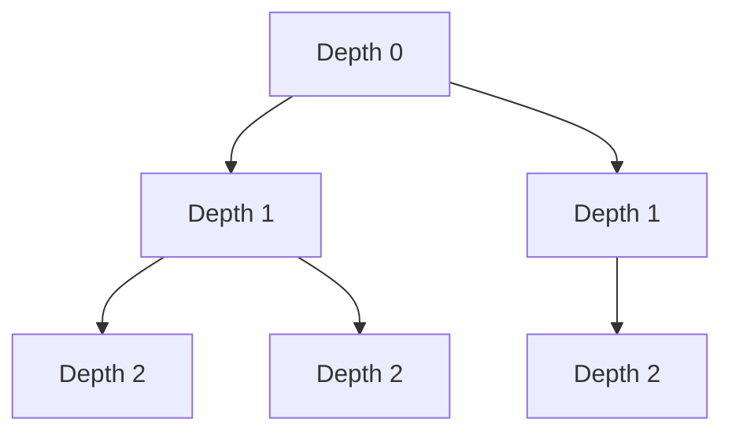

選擇依問題需求：

- 需要 Subtree 結果往上組合：常用 Postorder DFS。
- 需要按層處理或找最淺答案：常用 BFS。
- 需要所有走訪順序：依輸出規格選擇。

### 23.12 Tree 正確性與複雜度

Tree 遞迴通常使用結構歸納：

1. 空 Tree 或 Leaf 的 Base Case 正確。
2. 假設 Child Subtree 的遞迴結果正確。
3. 證明目前 Node 的 Combine 會產生正確答案。
4. 每次呼叫進入嚴格較小的 Subtree，所以會終止。

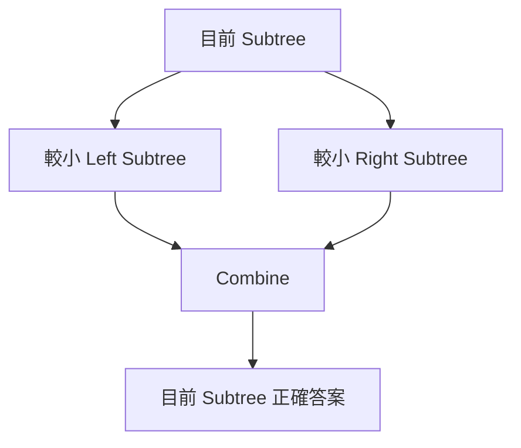

#### 複雜度計算

不要只看到兩次遞迴呼叫就判定 O(2^h)。如果 Left 與 Right Subtree 不重疊，每個 Node 只被處理一次，時間通常是 O(n)。

空間需包括：

- 明確建立的 Stack、Queue 或結果容器。
- 遞迴 Call Stack O(h)。

### 23.13 Ownership 與生命週期

Raw Pointer Tree 不會自動表達 Ownership：

- 誰配置 Node？
- 誰釋放 Node？
- Child 是否可能共享？
- 結構是否保證無 Cycle？

若每個 Node 唯一擁有 Child，可使用：

```cpp
#include <memory>

struct OwnedTreeNode
{
    int value;
    std::unique_ptr<OwnedTreeNode> left;
    std::unique_ptr<OwnedTreeNode> right;
};
```

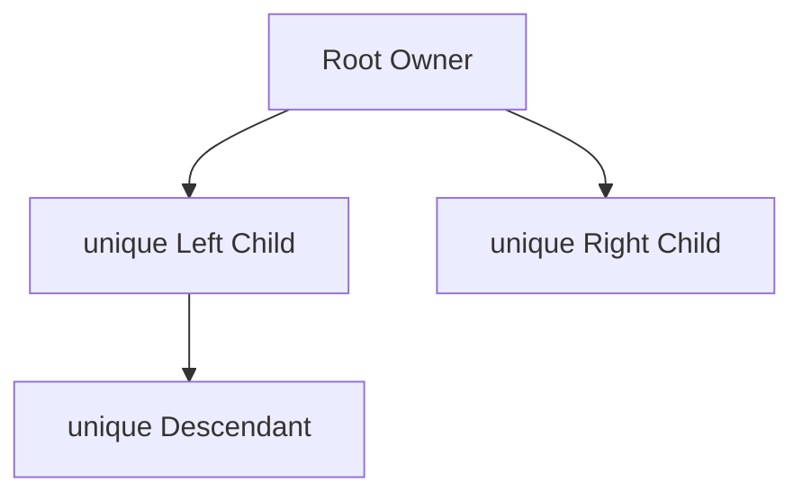

若使用 Parent Pointer，它通常不應再擁有 Parent，否則可能形成 Ownership Cycle。演算法結構與 Ownership 結構需要分開設計。

### 23.14 C 語言中的 Tree

```c
#include <stdlib.h>

struct TreeNode
{
    int value;
    struct TreeNode *left;
    struct TreeNode *right;
};

struct TreeNode *create_node(int value)
{
    struct TreeNode *node = malloc(sizeof(*node));

    if (node == NULL)
    {
        return NULL;
    }

    node->value = value;
    node->left = NULL;
    node->right = NULL;
    return node;
}
```

釋放無共享、無 Cycle Tree 可使用 Postorder：

```c
void destroy_tree(struct TreeNode *node)
{
    if (node == NULL)
    {
        return;
    }

    destroy_tree(node->left);
    destroy_tree(node->right);
    free(node);
}
```

必須先釋放 Child，再釋放目前 Node。若先 `free(node)`，就不能再安全讀取 Child Pointer。

### 23.15 系統化 Debug

建議為每次遞迴記錄：

```text
Node Identity
Node Value
Depth
Left Result
Right Result
Combined Result
返回位置
```

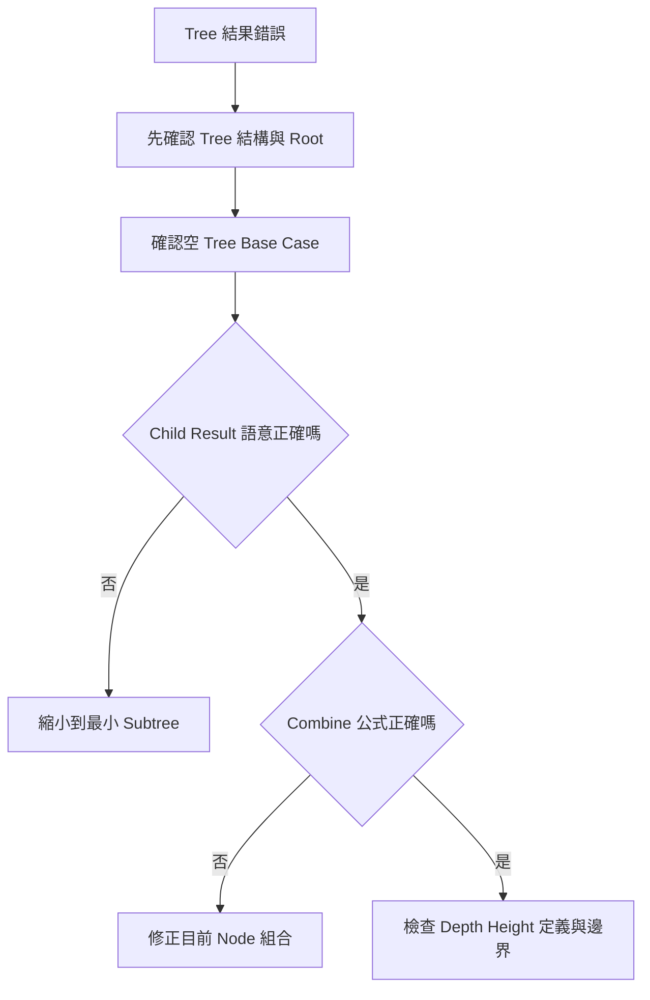

重要測試：

- 空 Tree。
- 單一 Root。
- 只有 Left Child。
- 只有 Right Child。
- 完全鏈狀 Tree。
- Perfect Tree。
- 左右 Height 不同。
- Node Value 全部相同。
- 極深 Tree 的 Stack 深度。

### 23.16 建立自己的 Tree 分析表

| 欄位 | 要回答的問題 |
|---|---|
| Tree 類型 | 一般 Tree、Binary Tree、BST、Complete Tree？ |
| Root | 空 Tree 如何表示？ |
| Node Identity | 相同 Value 的 Node 是否區分？ |
| Child | Child 數量固定或可變？ |
| Depth | Root 從 0 還是 1 開始？ |
| Height | 以 Edge 或 Node 數計算？空 Tree 是多少？ |
| Subproblem | 遞迴函式對一棵 Subtree 回傳什麼？ |
| Base Case | 空 Subtree 或 Leaf 回傳什麼？ |
| Combine | 如何由 Child Result 組合目前答案？ |
| Traversal | Preorder、Inorder、Postorder 或 BFS？ |
| Representation | Pointer、Array、Parent Array 或 Edge List？ |
| Ownership | 誰建立與釋放 Node？ |
| 複雜度 | 每個 Node 處理幾次？最大 Height 多少？ |
| 邊界 | 空、單一 Node、鏈狀與重複值如何處理？ |

### 23.17 常見問題與判讀

| 現象 | 可能原因 | 第一輪檢查 |
|---|---|---|
| Height 差一 | Edge 與 Node 數定義混用 | 空 Tree 與 Leaf Height 是多少 |
| Root Depth 不一致 | Level 從 1、Depth 從 0 混用 | 先固定名詞定義 |
| 把 Binary Tree 當 BST | 誤以為 Left 一定較小 | 題目是否明確提供排序性 |
| 遞迴答案重複或漏算 | Subtree Result 語意不清 | 函式對目前 Node 回傳什麼 |
| 空 Tree Crash | 先讀取 Node 再檢查 Null | Base Case 應先處理 `nullptr` |
| 複雜度誤判 O(2^h) | 只看兩次遞迴呼叫 | Left、Right Subtree 是否重疊 |
| 深 Tree Stack Overflow | Height 接近 n | 改用顯式 Stack 或限制深度 |
| Array Child Index 越界 | 未檢查 `2*i+1` | 先檢查型別與 Size |
| 相同 Value Node 混淆 | 只印 Value | 同時記錄 Node Identity |
| Memory Leak | 未釋放 Node | 明確定義 Ownership 與 Postorder 銷毀 |
| Double Free | Subtree 被多個 Owner 共享 | 確認結構是否真的是 Tree |
| BFS Layer 錯誤 | Queue Size 或 Depth 更新時機錯 | 每層開始時固定該層 Node 數 |

### 23.18 練習題方向

#### 基礎題

計算 Tree 的 Node 數、Leaf 數、最大 Depth 與所有 Value 總和。

#### 變化題

判斷兩棵 Tree 是否具有相同結構與 Value。先定義空 Tree 與 Node Identity 是否影響答案。

#### 綜合題

輸出每一層的 Node Value，並比較 BFS Queue 與 DFS 傳遞 Depth 的時間、空間與輸出順序。

每題都應寫出：

- 遞迴函式語意。
- Base Case。
- Child Result。
- Combine。
- 時間 O(n)。
- 空間 O(h) 或 BFS Queue 的最大寬度。

### 23.19 本章檢查表

- 我能說明 Node、Edge 與 Root。
- 我能區分 Parent、Child、Sibling、Leaf、Ancestor 與 Descendant。
- 我知道相同 Value 不代表相同 Node。
- 我能明確定義 Depth、Level 與 Height。
- 我知道 Leaf Height 與空 Tree Height 取決於採用的定義。
- 我能說明 Subtree 為何適合遞迴。
- 我能為遞迴函式寫出精確回傳語意。
- 我能說明 Base Case、Child Subproblem 與 Combine。
- 我能區分 Binary Tree、Complete Tree、Perfect Tree 與 BST。
- 我知道 Binary Tree 本身沒有排序保證。
- 我能比較 Pointer 與 Array 表示。
- 我會檢查 Array Child Index 是否位於範圍內。
- 我能用結構歸納說明 Tree 遞迴正確性。
- 我知道每個 Node 只處理一次時，時間通常為 O(n)。
- 我會把遞迴 Call Stack O(h) 列入空間成本。
- 我能依需求選擇 DFS 或 BFS。
- 我會明確定義 Node Ownership 與釋放責任。
- 我能使用空 Tree、單一 Node、鏈狀與 Perfect Tree 測試。

### 23.20 本章重點

- Tree 是由 Node 與 Edge 構成的階層結構，Root 是沒有 Parent 的起點。
- Node Value 與 Node Identity 是不同概念。
- Parent、Child、Sibling、Leaf、Ancestor 與 Descendant 描述 Node 間的結構關係。
- Depth 從 Root 往下計算，Height 從目前 Node 往最深 Leaf 計算。
- Height 可用 Edge 數或 Node 數定義，但 Base Case、公式與測試必須一致。
- Subtree 讓 Tree 問題自然拆成 Child Subproblem 與目前 Node 的 Combine。
- Binary Tree 只限制 Child 數量，Binary Search Tree 才額外具有 Key 排序規則。
- Pointer 表示適合稀疏或動態形狀，Array 表示適合 Complete Tree。
- Tree 遞迴通常以空 Subtree為 Base Case，並對嚴格較小的 Child Subtree呼叫。
- 每個 Node 處理一次時，時間通常為 O(n)，空間還要計入 O(h) Call Stack。
- DFS 適合深入 Subtree 與向上組合答案，BFS 適合按 Depth Layer 處理。
- Raw Pointer 不表達 Ownership，正式程式必須定義 Node 的建立與釋放責任。
- Debug 時應記錄 Node Identity、Depth、Child Result 與 Combine，而不只觀察最終輸出。
