## 第 24 章　Binary Tree Traversal

### 適用範圍

本章介紹 Binary Tree 的 Preorder、Inorder、Postorder、Level-order，以及 Recursive 與 Iterative Traversal。後半章會將走訪模式延伸到 Tree Height、Balance、Diameter、Path Sum 與 Lowest Common Ancestor。

Tree Traversal 不只是記住存取順序。真正重要的是確認：

- 目前 Node 應在 Child 之前、之間，還是之後處理。
- 遞迴函式對一棵 Subtree 回傳什麼 State。
- Iterative 版本的 Stack 或 Queue 保存哪些尚未完成工作。
- 同一個 Node 是否恰好處理一次。
- 空 Tree、單一 Node 與極度偏斜 Tree 如何處理。
- 額外空間應計算遞迴 Call Stack、顯式 Stack 或 BFS Queue。

本章會建立一套固定流程：

1. 先定義走訪輸出順序或 Subtree Result。
2. 決定使用 DFS 還是 BFS。
3. 遞迴版本寫出 Base Case、Child Call 與目前 Node 的處理位置。
4. Iterative 版本定義 Stack Element 或 Queue Element 的語意。
5. 確認 Push Child 的順序符合 LIFO 或 FIFO。
6. 對 Height、Balance、Diameter 等問題，明確區分向上回傳 State 與全域答案。
7. 分析 O(n) 走訪時間與 O(h)、O(w) 額外空間。
8. 使用空 Tree、鏈狀 Tree、完整 Tree、負數與重複值測試。

### 適用讀者

- 會背 Preorder、Inorder、Postorder 名稱，但不理解處理時機的讀者。
- 想把 Recursive Traversal 改成 Iterative Traversal 的讀者。
- 不清楚 DFS Stack Frame 需要保存哪些 State 的讀者。
- 需要使用 BFS 進行 Level-order Traversal 的讀者。
- 容易把 Tree Height、Balance 與 Diameter 混在一起的讀者。
- 解 Path Sum 或 Lowest Common Ancestor 時，不確定遞迴回傳值的讀者。

### 快速導覽

- [Traversal 到底決定什麼](#241-traversal-到底決定什麼)
- [Preorder、Inorder 與 Postorder](#242-preorderinorder-與-postorder)
- [完整案例：Recursive DFS](#243-完整案例recursive-dfs)
- [Iterative Preorder](#244-iterative-preorder)
- [Iterative Inorder](#245-iterative-inorder)
- [Iterative Postorder](#246-iterative-postorder)
- [Level-order Traversal](#247-level-order-traversal)
- [完整案例：逐層輸出](#248-完整案例逐層輸出)
- [Tree Height](#249-tree-height)
- [Balanced Binary Tree](#2410-balanced-binary-tree)
- [Tree Diameter](#2411-tree-diameter)
- [Path Sum](#2412-path-sum)
- [Lowest Common Ancestor](#2413-lowest-common-ancestor)
- [Traversal 的正確性與複雜度](#2414-traversal-的正確性與複雜度)
- [Recursive 與 Iterative 的選擇](#2415-recursive-與-iterative-的選擇)
- [C 語言中的 Traversal](#2416-c-語言中的-traversal)
- [系統化 Debug](#2417-系統化-debug)
- [常見問題與判讀](#2418-常見問題與判讀)
- [本章檢查表](#2419-本章檢查表)
- [本章重點](#2420-本章重點)

### 24.1 Traversal 到底決定什麼

Traversal 決定所有 Node 被處理的順序。對目前 Node、Left Subtree 與 Right Subtree，DFS 有三種主要順序：

```text
Preorder  = Node, Left, Right
Inorder   = Left, Node, Right
Postorder = Left, Right, Node
```

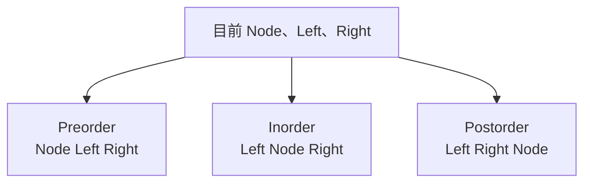

這裡的「處理 Node」可能是：

- 將 Value 加入輸出。
- 更新答案。
- 建立副本。
- 釋放 Node。
- 將 Child Result 組合成目前 Result。

所以 Traversal 順序應由資料相依性決定，不是只由題目名稱決定。

### 24.2 Preorder、Inorder 與 Postorder

使用以下 Tree：

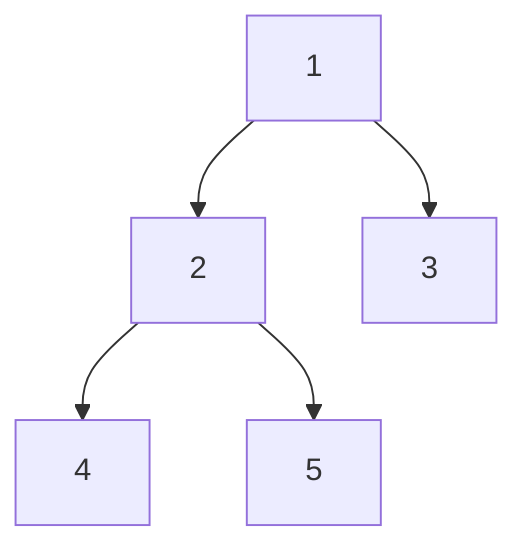

輸出順序：

```text
Preorder：  1, 2, 4, 5, 3
Inorder：   4, 2, 5, 1, 3
Postorder： 4, 5, 2, 3, 1
```

#### Preorder

目前 Node 在 Child 前處理。適合：

- 複製 Tree 時先建立目前 Node。
- 序列化結構。
- 將 Parent State 傳向 Child。

#### Inorder

目前 Node 在 Left 與 Right 之間處理。在 Binary Search Tree 中，若重複 Key 政策與結構正確，Inorder 會產生排序順序。

Binary Tree 本身不保證 Inorder 有序。

#### Postorder

先取得 Child Result，再處理目前 Node。適合：

- 計算 Height。
- 判斷 Balance。
- 計算 Diameter。
- 銷毀 Tree。
- Tree DP。

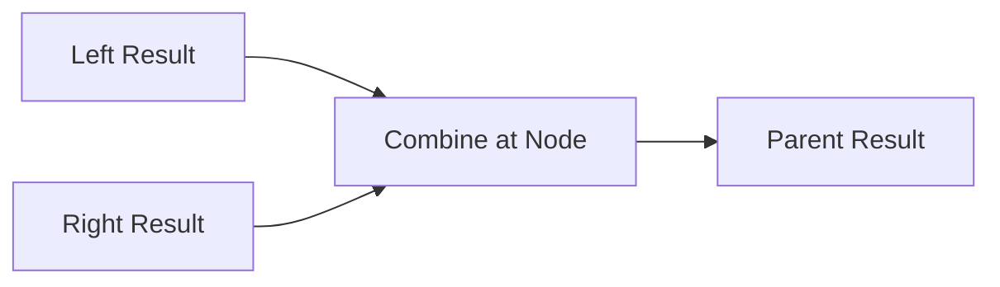

### 24.3 完整案例：Recursive DFS

```cpp
#include <vector>

struct TreeNode
{
    int value;
    TreeNode* left;
    TreeNode* right;
};

void preorder(
    const TreeNode* node,
    std::vector<int>& result)
{
    if (node == nullptr)
    {
        return;
    }

    result.push_back(node->value);
    preorder(node->left, result);
    preorder(node->right, result);
}

void inorder(
    const TreeNode* node,
    std::vector<int>& result)
{
    if (node == nullptr)
    {
        return;
    }

    inorder(node->left, result);
    result.push_back(node->value);
    inorder(node->right, result);
}

void postorder(
    const TreeNode* node,
    std::vector<int>& result)
{
    if (node == nullptr)
    {
        return;
    }

    postorder(node->left, result);
    postorder(node->right, result);
    result.push_back(node->value);
}
```

三個版本只有「處理目前 Node」的位置不同。

#### 正確性

Base Case 為空 Subtree，不輸出任何 Node。假設 Left 與 Right Subtree 能依指定順序正確輸出，把目前 Node 放在兩次呼叫之前、之間或之後，即可形成對目前 Subtree 的正確順序。

#### 終止性

每次呼叫進入嚴格較小的 Child Subtree，最後抵達 `nullptr`。

### 24.4 Iterative Preorder

Stack 保存已發現但尚未處理的 Node。

```cpp
#include <stack>
#include <vector>

std::vector<int> preorderIterative(TreeNode* root)
{
    std::vector<int> result;

    if (root == nullptr)
    {
        return result;
    }

    std::stack<TreeNode*> pending;
    pending.push(root);

    while (!pending.empty())
    {
        TreeNode* node = pending.top();
        pending.pop();

        result.push_back(node->value);

        if (node->right != nullptr)
        {
            pending.push(node->right);
        }

        if (node->left != nullptr)
        {
            pending.push(node->left);
        }
    }

    return result;
}
```

因為 Stack 是 LIFO，若要先處理 Left，必須先 Push Right，再 Push Left。

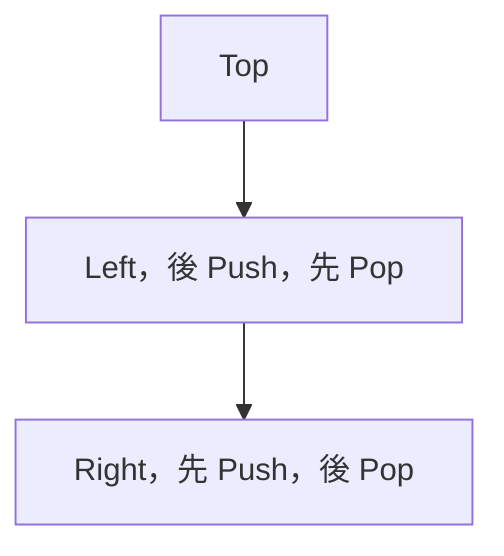

Invariant：Stack 保存已發現但尚未輸出的 Subtree Root，Top 是下一個符合 Preorder 的 Node。

### 24.5 Iterative Inorder

Inorder 需要先走到最左，再回到最近尚未處理的 Ancestor。

```cpp
std::vector<int> inorderIterative(TreeNode* root)
{
    std::vector<int> result;
    std::stack<TreeNode*> ancestors;
    TreeNode* current = root;

    while (current != nullptr || !ancestors.empty())
    {
        while (current != nullptr)
        {
            ancestors.push(current);
            current = current->left;
        }

        current = ancestors.top();
        ancestors.pop();
        result.push_back(current->value);
        current = current->right;
    }

    return result;
}
```

Stack Element 語意：

> Stack 保存 Left Subtree 尚未走完，或目前 Node 尚未輸出的 Ancestor。

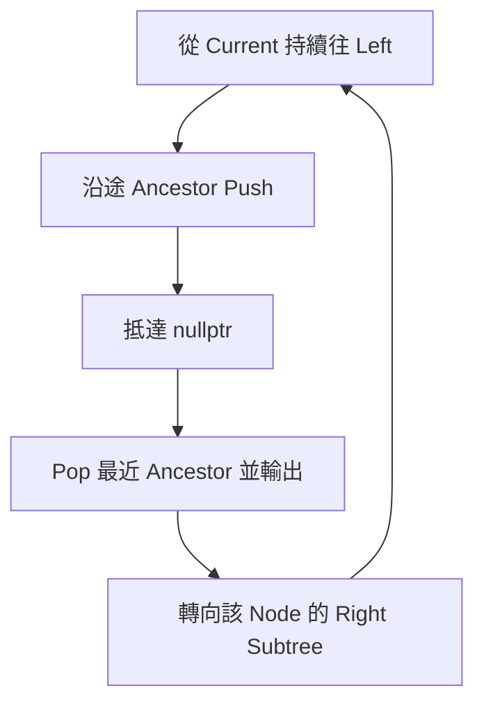

常見錯誤是迴圈只寫 `while (current != nullptr)`，導致 Current 變空後，Stack 中尚未處理的 Ancestor 被忽略。

### 24.6 Iterative Postorder

Postorder 必須知道 Child 是否已處理。可用 `(Node, visited)` Frame：

```cpp
#include <utility>

std::vector<int> postorderIterative(TreeNode* root)
{
    std::vector<int> result;

    if (root == nullptr)
    {
        return result;
    }

    std::stack<std::pair<TreeNode*, bool>> pending;
    pending.push({root, false});

    while (!pending.empty())
    {
        auto [node, expanded] = pending.top();
        pending.pop();

        if (expanded)
        {
            result.push_back(node->value);
            continue;
        }

        pending.push({node, true});

        if (node->right != nullptr)
        {
            pending.push({node->right, false});
        }

        if (node->left != nullptr)
        {
            pending.push({node->left, false});
        }
    }

    return result;
}
```

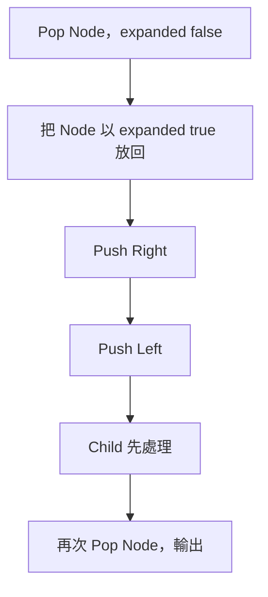

只保存 Node 不一定足以模擬 Postorder，因為需要記錄「返回後還要處理目前 Node」的階段。

### 24.7 Level-order Traversal

Level-order 使用 Queue，依 Depth 從小到大處理 Node。

```cpp
#include <queue>

std::vector<int> levelOrder(TreeNode* root)
{
    std::vector<int> result;

    if (root == nullptr)
    {
        return result;
    }

    std::queue<TreeNode*> pending;
    pending.push(root);

    while (!pending.empty())
    {
        TreeNode* node = pending.front();
        pending.pop();

        result.push_back(node->value);

        if (node->left != nullptr)
        {
            pending.push(node->left);
        }

        if (node->right != nullptr)
        {
            pending.push(node->right);
        }
    }

    return result;
}
```

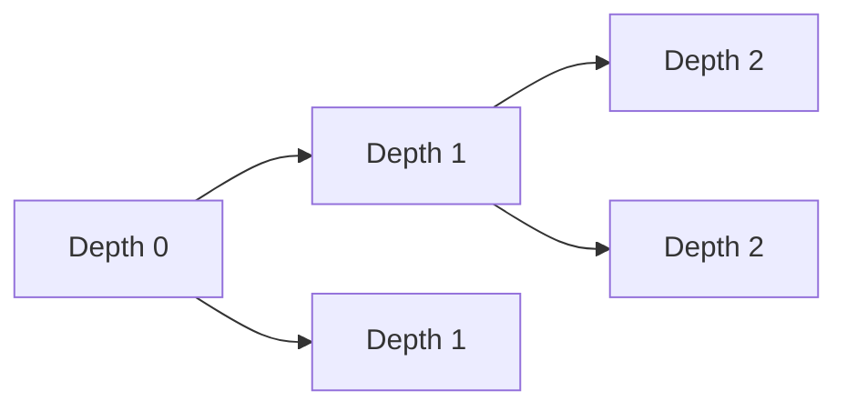

Queue 保存已發現但尚未展開 Child 的 Node。FIFO 讓較淺 Node 先於較深 Node 被處理。

### 24.8 完整案例：逐層輸出

若輸出型別是每層一個 Vector，需要在每層開始時固定目前 Queue Size。

```cpp
std::vector<std::vector<int>> levelOrderByLayer(
    TreeNode* root)
{
    std::vector<std::vector<int>> result;

    if (root == nullptr)
    {
        return result;
    }

    std::queue<TreeNode*> pending;
    pending.push(root);

    while (!pending.empty())
    {
        const int layerSize =
            static_cast<int>(pending.size());
        std::vector<int> layer;

        for (int i = 0; i < layerSize; ++i)
        {
            TreeNode* node = pending.front();
            pending.pop();
            layer.push_back(node->value);

            if (node->left != nullptr)
            {
                pending.push(node->left);
            }

            if (node->right != nullptr)
            {
                pending.push(node->right);
            }
        }

        result.push_back(std::move(layer));
    }

    return result;
}
```

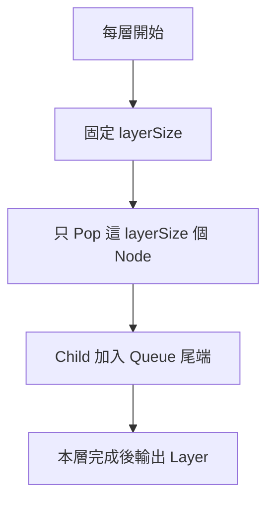

不能在 `for` 條件中持續使用變動中的 `pending.size()`，因為加入 Child 後 Size 會改變，可能把下一層也混入目前層。

### 24.9 Tree Height

本章沿用上一章定義：空 Tree Height = -1，Leaf Height = 0。

```cpp
#include <algorithm>

int treeHeight(const TreeNode* node)
{
    if (node == nullptr)
    {
        return -1;
    }

    return 1 + std::max(
        treeHeight(node->left),
        treeHeight(node->right));
}
```

這是 Postorder，因為目前 Height 依賴兩個 Child Height。

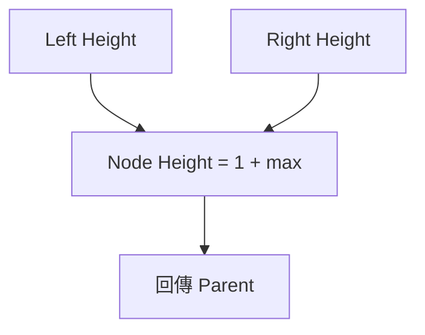

若採 Node 數定義，空 Tree 可回傳 0，Leaf Height 為 1。整本教材需要保持一致。

### 24.10 Balanced Binary Tree

常見 Height-balanced 定義：每個 Node 的 Left、Right Subtree Height 差不超過 1。

低效率做法會對每個 Node 重複計算 Height，最差可達 O(n²)。較好的方式是在一次 Postorder 中，同時回傳 Height 或失敗 Sentinel。

```cpp
int heightIfBalanced(const TreeNode* node)
{
    if (node == nullptr)
    {
        return -1;
    }

    const int left = heightIfBalanced(node->left);
    if (left == -2)
    {
        return -2;
    }

    const int right = heightIfBalanced(node->right);
    if (right == -2)
    {
        return -2;
    }

    if (std::abs(left - right) > 1)
    {
        return -2;
    }

    return 1 + std::max(left, right);
}

bool isBalanced(const TreeNode* root)
{
    return heightIfBalanced(root) != -2;
}
```

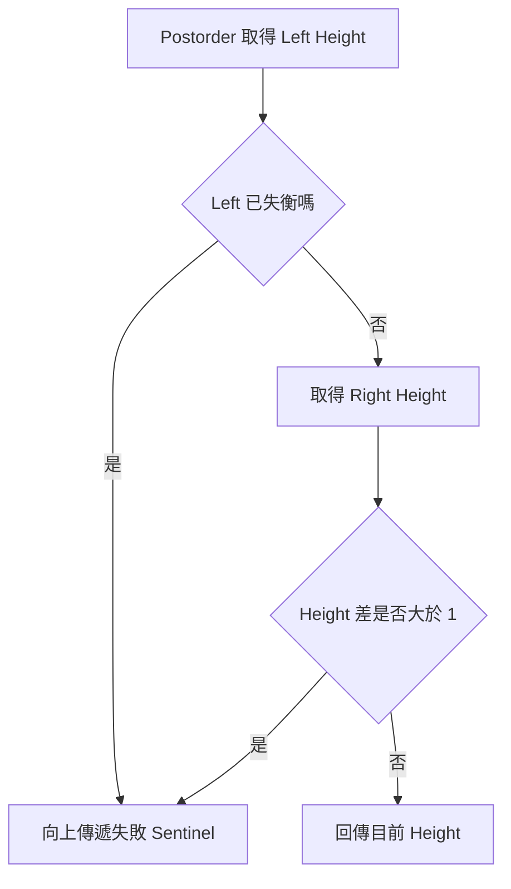

`-2` 不可能是合法 Height，因此可作為失衡 Sentinel。也可使用 Struct 或 `optional` 讓語意更明確。

### 24.11 Tree Diameter

Diameter 常定義為任意兩個 Node 間最長 Path 的 Edge 數。

對每個 Node，穿過目前 Node 的 Path 長度為：

```text
leftHeight + rightHeight + 2
```

同一次 Postorder：

- 向 Parent 回傳目前 Height。
- 更新全域或 Reference 中的最大 Diameter。

```cpp
int heightAndUpdateDiameter(
    const TreeNode* node,
    int& diameter)
{
    if (node == nullptr)
    {
        return -1;
    }

    const int left =
        heightAndUpdateDiameter(node->left, diameter);
    const int right =
        heightAndUpdateDiameter(node->right, diameter);

    diameter = std::max(diameter, left + right + 2);
    return 1 + std::max(left, right);
}
```

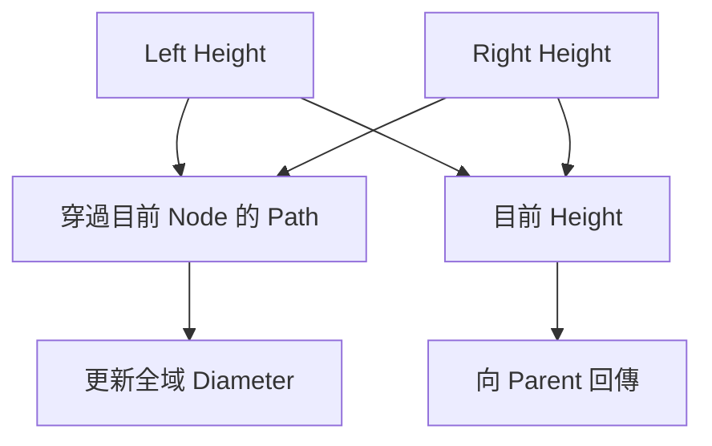

Diameter 與 Height 的 State 不同。函式向上只需回傳單一路徑 Height，但答案可由左右兩條路徑組合。

### 24.12 Path Sum

判斷是否存在 Root-to-Leaf Path Sum 等於 Target：

```cpp
bool hasPathSum(
    const TreeNode* node,
    long long remaining)
{
    if (node == nullptr)
    {
        return false;
    }

    remaining -= node->value;

    if (node->left == nullptr &&
        node->right == nullptr)
    {
        return remaining == 0;
    }

    return hasPathSum(node->left, remaining) ||
           hasPathSum(node->right, remaining);
}
```

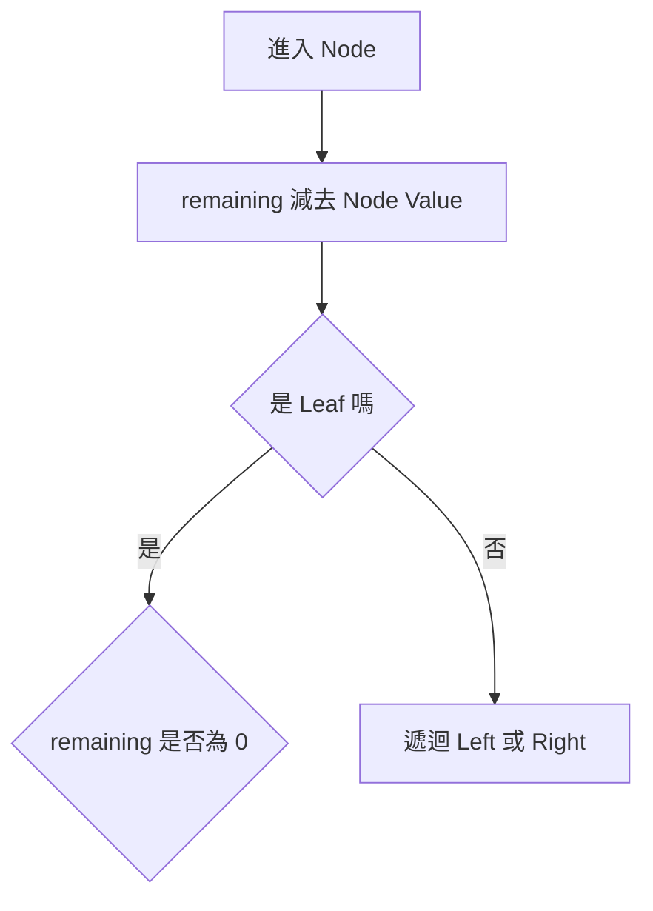

必須在 Leaf 才判定完整 Root-to-Leaf Path。若在內部 Node 的 Remaining 變 0 就回傳 True，會把尚未到 Leaf 的 Prefix 誤當完整 Path。

含負數時不能因 Remaining 小於 0 就剪枝，因為後方負數或正數仍可能改變結果。

### 24.13 Lowest Common Ancestor

對一般 Binary Tree，假設 `p` 與 `q` 都存在，遞迴回傳：

> 目前 Subtree 中找到的 `p`、`q`，或它們的 Lowest Common Ancestor。

```cpp
TreeNode* lowestCommonAncestor(
    TreeNode* root,
    TreeNode* p,
    TreeNode* q)
{
    if (root == nullptr || root == p || root == q)
    {
        return root;
    }

    TreeNode* left =
        lowestCommonAncestor(root->left, p, q);
    TreeNode* right =
        lowestCommonAncestor(root->right, p, q);

    if (left != nullptr && right != nullptr)
    {
        return root;
    }

    return left != nullptr ? left : right;
}
```

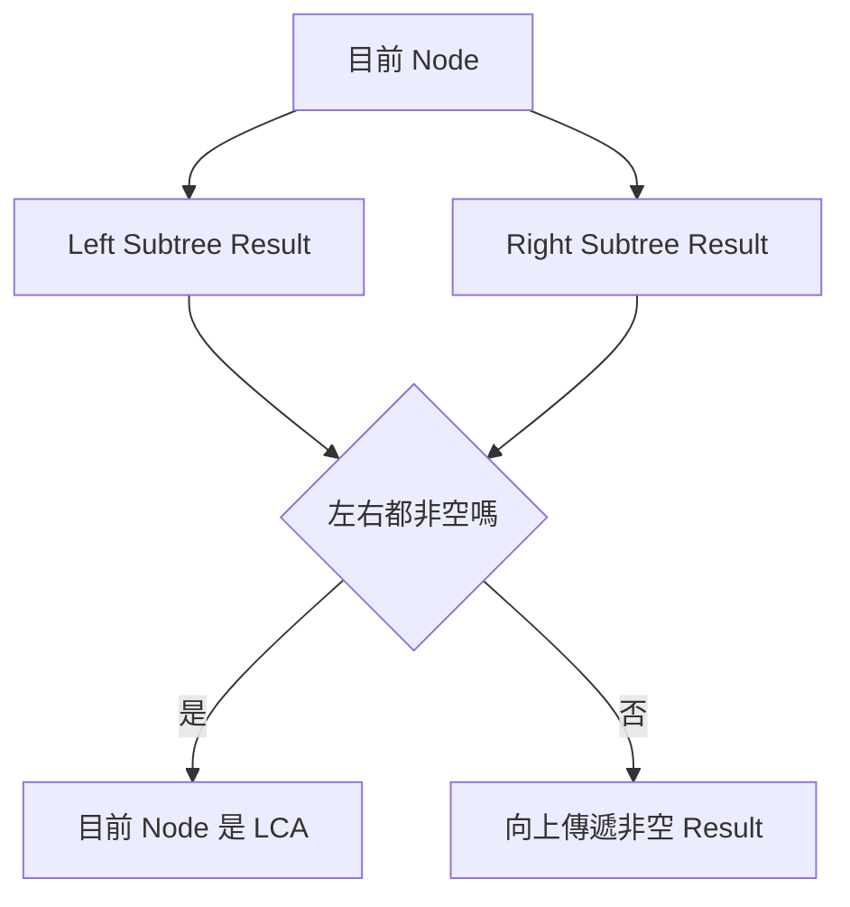

此版本比較 Node Identity，而不是 Value。若 `p` 或 `q` 可能不存在，需要額外回傳找到數量，否則單一存在 Node 也可能被當成結果。

### 24.14 Traversal 的正確性與複雜度

遞迴 DFS 可用結構歸納說明：

1. 空 Subtree 的 Base Case 正確。
2. 假設 Left 與 Right Subtree Traversal 正確。
3. 將目前 Node 放在指定位置，即得到目前 Subtree 的正確順序。
4. Child Subtree 嚴格較小，因此遞迴終止。

每個 Node 恰好輸出或組合一次，時間通常為 O(n)。

額外空間：

- Recursive DFS：O(h) Call Stack。
- Iterative DFS：最差 O(h) 至 O(n)，依 Tree 形狀與演算法而定。
- BFS：O(w)，w 為最大寬度。
- 輸出容器：若保存所有結果，另需 O(n)。

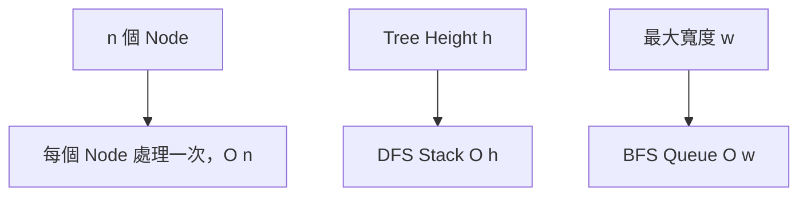

### 24.15 Recursive 與 Iterative 的選擇

| 面向 | Recursive | Iterative |
|---|---|---|
| 可讀性 | 常較接近 Tree 定義 | State 需要自行管理 |
| Stack | 使用 Call Stack | 使用顯式 Stack 或 Queue |
| 深度風險 | 極深 Tree 可能 Stack Overflow | 可自行控制記憶體與流程 |
| 複雜 State | 返回後流程自然保留 | 可能需要 Frame 與階段旗標 |
| BFS | 不自然 | Queue 較直接 |

遞迴改成迭代時，不能只把 Node 放進 Stack。若原函式返回後還要處理目前 Node，就要保存執行階段、局部變數或 Child Result。

### 24.16 C 語言中的 Traversal

Preorder：

```c
void preorder(
    const struct TreeNode *node,
    void (*visit)(int))
{
    if (node == NULL)
    {
        return;
    }

    visit(node->value);
    preorder(node->left, visit);
    preorder(node->right, visit);
}
```

C 沒有標準通用 Stack 或 Queue。Iterative Traversal 需要自行管理 Array、Dynamic Buffer 或專案容器，並處理：

- Capacity。
- Push 失敗。
- Pointer Ownership。
- 最終釋放。

若使用固定容量 Stack，最大 Tree Height 超過 Capacity 時必須回報失敗，不能寫出 Buffer。

### 24.17 系統化 Debug

建議記錄：

```text
Node Identity
Traversal 類型
進入 Node 的時間
Push 或遞迴 Child 的順序
輸出 Node 的時間
Stack / Queue 內容
Child Result
目前 Combine Result
```

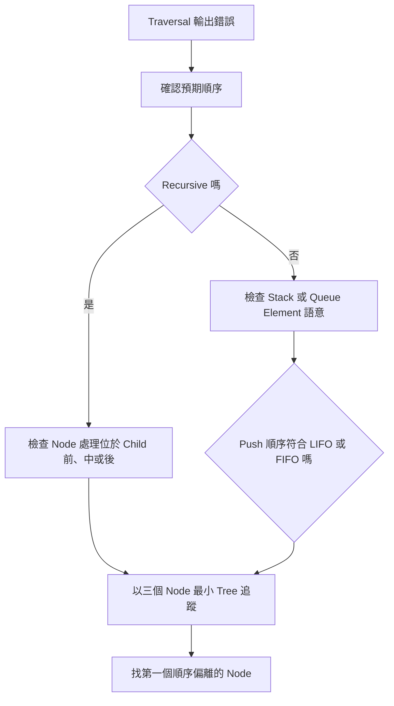

最小測試 Tree：

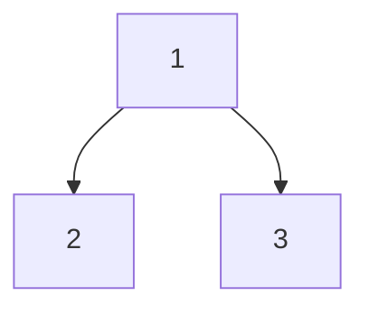

預期：

```text
Preorder  1,2,3
Inorder   2,1,3
Postorder 2,3,1
Level     1,2,3
```

### 24.18 常見問題與判讀

| 現象 | 可能原因 | 第一輪檢查 |
|---|---|---|
| Preorder 左右顛倒 | Iterative Push 順序錯誤 | Stack 應先 Push Right |
| Inorder 提前結束 | 只檢查 Current | 條件應包含 Stack 非空 |
| Postorder 重複輸出 | Expanded Frame 邏輯錯誤 | Node 何時第二次進入 Stack |
| Level 混入下一層 | 每層 Size 動態變化 | 層開始時固定 `layerSize` |
| Height 差一 | Edge 與 Node 定義混用 | 空 Tree 與 Leaf 回傳值 |
| Balance 變成 O(n²) | 每個 Node 重算 Height | 一次 Postorder 同時回傳 Height |
| Diameter 少一或多一 | Edge 數與 Node 數混用 | 穿過 Node 的公式 |
| Path Sum 在內部 Node 提前成功 | 未要求 Root-to-Leaf | 只在 Leaf 判定 |
| 含負數 Path Sum 漏解 | Remaining 小於 0 就剪枝 | 負數會破壞單調性 |
| LCA 以 Value 比較 | 重複 Value Node 混淆 | 使用 Pointer Identity |
| LCA 在 Node 不存在時誤判 | 假設兩者必定存在 | 額外回傳找到數量 |
| 深 Tree Stack Overflow | 遞迴深度 O(n) | 改用 Iterative 或限制深度 |

### 24.19 本章檢查表

- 我能說明 Preorder、Inorder、Postorder 的 Node 處理位置。
- 我知道 Binary Tree 的 Inorder 不一定有序。
- 我能使用 Recursive DFS 並寫出 Base Case。
- 我能說明 Iterative Preorder 為何先 Push Right。
- 我能定義 Iterative Inorder Stack 中 Ancestor 的語意。
- 我知道 Iterative Postorder 可能需要 Expanded State。
- 我能使用 Queue 完成 Level-order Traversal。
- 我會在每層開始時固定 Layer Size。
- 我知道 Height、Balance 與 Diameter 適合 Postorder。
- 我能區分向 Parent 回傳的 State 與全域答案。
- 我能在一次走訪中同時計算 Height 與 Balance。
- 我知道 Diameter 的 Edge 與 Node 數定義必須一致。
- 我會在 Leaf 才判定 Root-to-Leaf Path Sum。
- 我知道含負數時不能使用不成立的 Sum 剪枝。
- 我會使用 Node Identity 判斷 LCA。
- 我能用結構歸納說明 Traversal 正確性。
- 我會把 Call Stack、顯式 Stack 或 BFS Queue 列入空間成本。
- 我能依 Tree 深度與需求選擇 Recursive 或 Iterative。

### 24.20 本章重點

- Preorder、Inorder 與 Postorder 的差異，是目前 Node 位於 Child 處理之前、之間或之後。
- Preorder 適合先處理 Parent，Postorder 適合先取得 Child Result，Inorder 常用於 BST 的排序走訪。
- Iterative Traversal 必須明確定義 Stack Element 代表的未完成工作。
- Preorder 因 LIFO 需先 Push Right；Inorder 需保存尚未輸出的 Ancestor；Postorder 常需保存返回階段。
- Level-order 使用 Queue 依 Depth Layer 處理 Node。
- 逐層輸出時，應在每層開始固定目前 Queue Size。
- Height、Balance 與 Diameter 都可在 Postorder 中由 Child State 組合。
- Balance 可使用合法 Height 或失敗 Sentinel，在一次 O(n) 走訪完成。
- Diameter 的全域答案可使用左右 Height 組合，但向 Parent 只需回傳單一路徑 Height。
- Root-to-Leaf Path Sum 必須在 Leaf 判定完整 Path。
- 一般 Binary Tree 的 LCA 應比較 Node Identity，並明確定義 Node 不存在時的政策。
- 每個 Node 處理一次時，Traversal 時間為 O(n)；DFS 空間和 Height 有關，BFS 空間和最大寬度有關。
- Recursive 寫法接近 Tree 定義，Iterative 寫法則能自行管理 Stack 與深度風險。
- Debug 時應找出第一個走訪順序或 Child Result 偏離的 Node。
