## 第 25 章　Binary Search Tree

### 適用範圍

本章介紹 Binary Search Tree，簡稱 BST，包括 BST Property、Search、Insert、Delete、Inorder、驗證 BST、Predecessor、Successor、範圍查詢，以及平衡搜尋樹的基本概念。

BST 並不是「每個 Node 只和直接 Child 比較」的 Binary Tree。它的排序性必須對整棵 Subtree 成立。若重複 Key 的放置政策不清楚，Search、Insert、Delete、Inorder 與驗證函式可能採用不同規格，導致結果不一致。

本章會建立一套固定流程：

1. 先定義 Key 比較規則與重複 Key 政策。
2. 將 BST Property 寫成對整棵 Left、Right Subtree 的限制。
3. Search 與 Insert 每輪只保留可能包含 Target 的一側。
4. Delete 依 0、1、2 個 Child 分類處理。
5. 使用 Inorder 說明 BST 的排序輸出。
6. 驗證 BST 時傳遞合法值域，而不是只比較 Parent 與 Child。
7. 定義 Predecessor、Successor 與 Range Query 的候選排除方式。
8. 依 Tree Height 分析時間，不把 BST 操作一律寫成 O(log n)。
9. 使用空 Tree、重複 Key、極端值與鏈狀 Tree 測試。

### 適用讀者

- 知道 BST 左小右大，但不清楚限制需套用到整棵 Subtree 的讀者。
- Search 與 Insert 寫得出來，但 Delete 容易斷鏈的讀者。
- 使用 `node->left < node < node->right` 驗證 BST 的讀者。
- 不清楚 Inorder 為何能產生排序結果的讀者。
- 對重複 Key、Predecessor 與 Successor 語意不確定的讀者。
- 容易把 BST 操作時間固定寫成 O(log n) 的讀者。
- 想為 AVL Tree、Red-Black Tree 與 Ordered Map 建立基礎的讀者。

### 快速導覽

- [BST 到底增加了什麼性質](#251-bst-到底增加了什麼性質)
- [第一步：定義重複 Key 政策](#252-第一步定義重複-key-政策)
- [Search](#253-search)
- [完整案例：Iterative Search](#254-完整案例iterative-search)
- [Insert](#255-insert)
- [完整案例：Recursive Insert](#256-完整案例recursive-insert)
- [Delete 的三種情況](#257-delete-的三種情況)
- [完整案例：刪除指定 Key](#258-完整案例刪除指定-key)
- [Inorder 與排序](#259-inorder-與排序)
- [驗證 BST](#2510-驗證-bst)
- [完整案例：使用合法範圍驗證](#2511-完整案例使用合法範圍驗證)
- [Predecessor 與 Successor](#2512-predecessor-與-successor)
- [範圍查詢與剪枝](#2513-範圍查詢與剪枝)
- [Height、Balance 與複雜度](#2514-heightbalance-與複雜度)
- [完整可編譯 C++ 範例](#2515-完整可編譯-c-範例)
- [Ownership 與 C 語言](#2516-ownership-與-c-語言)
- [系統化 Debug](#2517-系統化-debug)
- [常見問題與判讀](#2518-常見問題與判讀)
- [練習題方向](#2519-練習題方向)
- [本章檢查表](#2520-本章檢查表)
- [本章重點](#2521-本章重點)

### 25.1 BST 到底增加了什麼性質

Binary Search Tree 是 Binary Tree 加上 Key 排序規則。

本章預設所有 Key 互異，對每個 Node：

```text
Left Subtree 中每個 Key < node->key
Right Subtree 中每個 Key > node->key
```

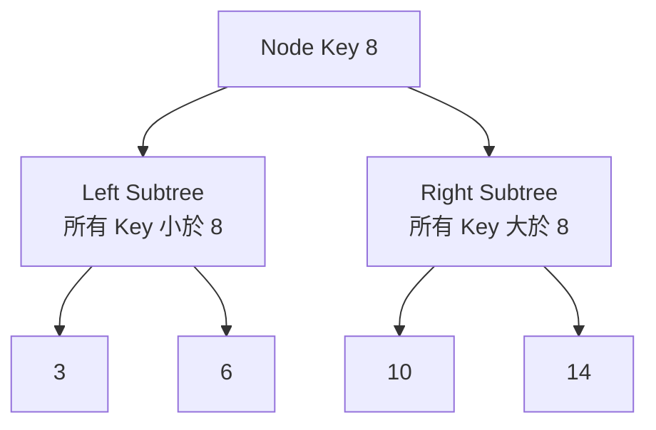

限制作用於整棵 Subtree，不是只比較直接 Child。

以下 Tree 雖然每個 Parent 與直接 Child 看起來符合大小關係，仍不是合法 BST：

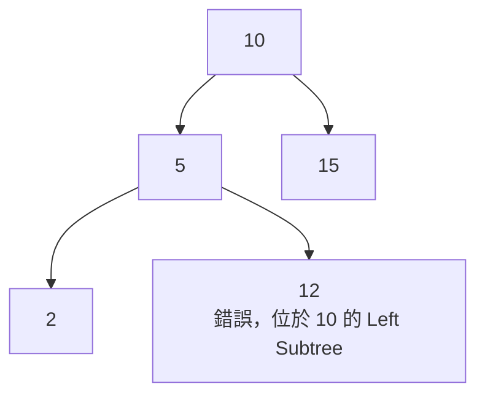

Node 12 大於其 Parent 5，但它仍位於 Root 10 的 Left Subtree，因此違反全域限制。

### 25.2 第一步：定義重複 Key 政策

BST 必須先決定重複 Key 如何處理。常見政策：

- 不允許重複，Insert 遇到相等便不新增。
- 相等 Key 固定放 Left。
- 相等 Key 固定放 Right。
- 每個 Node 另外保存 Count。

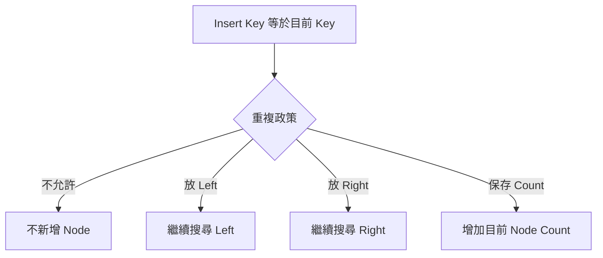

Search、Insert、Delete、Inorder 與 Validate 必須使用相同政策。本章後續採「不允許重複 Key」。

若使用 Count：

- 刪除一份 Key 時可以先減少 Count。
- Count 變成 0 才移除 Node。
- 第 K 小等排名問題需把 Count 納入 Subtree Size。

### 25.3 Search

Search 從 Root 開始比較 Target：

- Target 小於目前 Key，只可能在 Left Subtree。
- Target 大於目前 Key，只可能在 Right Subtree。
- 相等時找到答案。

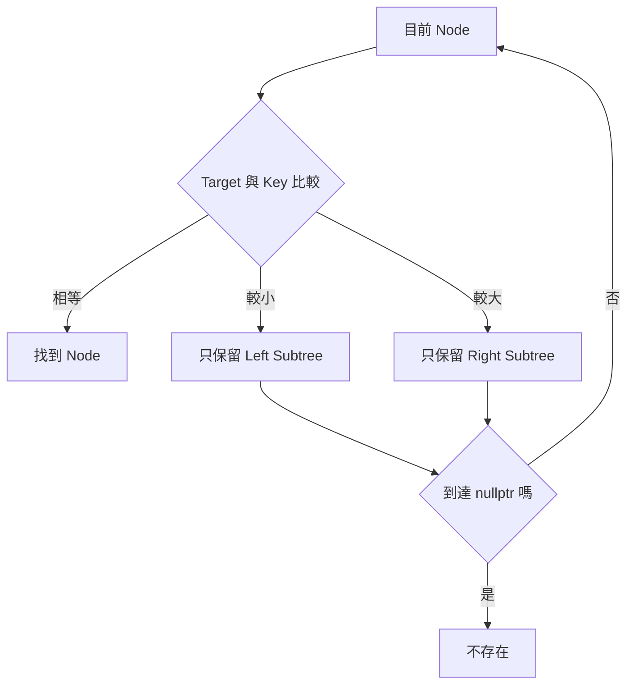

每次排除一整棵不可能包含 Target 的 Subtree。這和 Binary Search 排除一半候選的概念相近，但 BST 是否平衡會影響排除幅度。

### 25.4 完整案例：Iterative Search

```cpp
struct TreeNode
{
    int key;
    TreeNode* left;
    TreeNode* right;
};

TreeNode* search(TreeNode* root, int target)
{
    TreeNode* current = root;

    while (current != nullptr)
    {
        if (target == current->key)
        {
            return current;
        }

        if (target < current->key)
        {
            current = current->left;
        }
        else
        {
            current = current->right;
        }
    }

    return nullptr;
}
```

#### Loop Invariant

每輪開始前：

> 若 Target 存在，它一定位於以 `current` 為 Root 的 Subtree。

移動到 Left 或 Right 後，BST Property 保證被排除的另一側不可能含有 Target。

#### 終止性

每輪進入嚴格較小的 Child Subtree，最終找到 Target 或到達 `nullptr`。

#### 逐輪案例

搜尋 6：

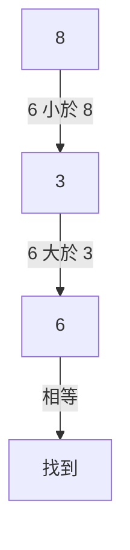

時間為 O(h)，h 是 Tree Height。

### 25.5 Insert

Insert 先沿 Search Path 找到空 Child 位置，再把新 Node 接上去。

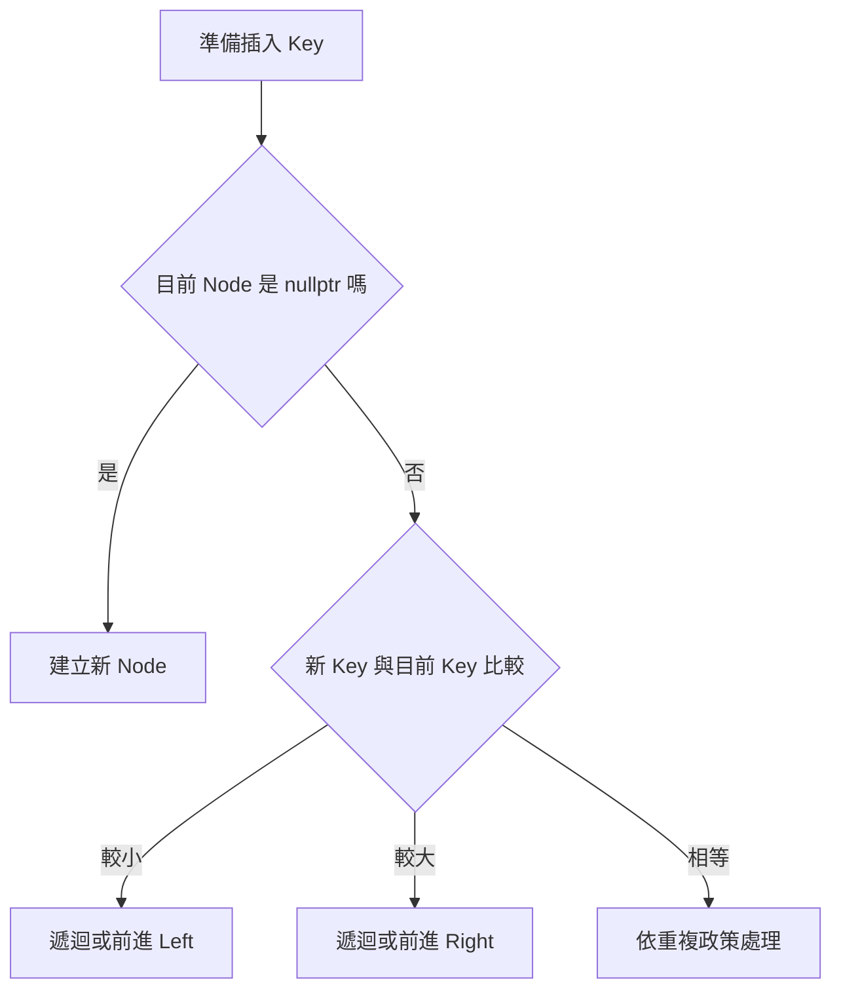

新 Node 一定放在 Leaf 位置，因為第一個 `nullptr` 是保持 Search Path 排序性的合法插入點。

### 25.6 完整案例：Recursive Insert

```cpp
TreeNode* insert(TreeNode* root, int key)
{
    if (root == nullptr)
    {
        return new TreeNode{key, nullptr, nullptr};
    }

    if (key < root->key)
    {
        root->left = insert(root->left, key);
    }
    else if (key > root->key)
    {
        root->right = insert(root->right, key);
    }

    return root;
}
```

#### 為何要接回回傳值

```cpp
root->left = insert(root->left, key);
```

當 Left 原本為空時，遞迴會建立新 Node 並回傳新 Subtree Root。若只呼叫函式但不接回，Parent 的 Child Pointer 不會更新。

#### Postcondition

回傳值是插入後目前 Subtree 的 Root：

- 原有 Key 保留。
- 新 Key 若原本不存在，恰好新增一次。
- BST Property 保持成立。

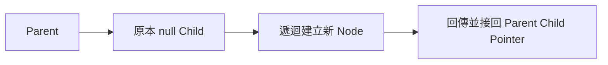

### 25.7 Delete 的三種情況

刪除目標 Node 時，依 Child 數量分三類。

#### 沒有 Child

直接移除 Leaf，Parent 對應 Child 改為 `nullptr`。

#### 只有一個 Child

讓 Parent 直接連到唯一 Child。

#### 有兩個 Child

常見做法：

1. 找 Right Subtree 的最小 Key，也就是 Inorder Successor。
2. 將 Successor Key 複製到目前 Node。
3. 從 Right Subtree 刪除該 Successor Node。

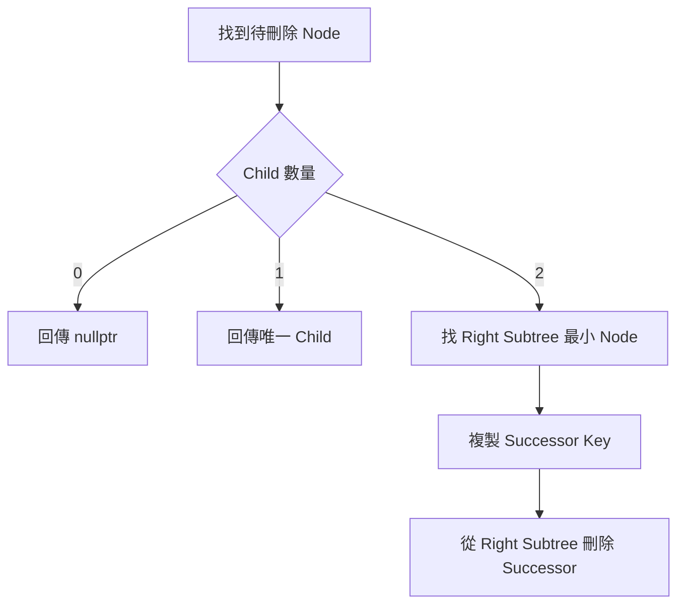

也可使用 Left Subtree 最大值，也就是 Inorder Predecessor。兩種方式都可，但實作與說明需一致。

### 25.8 完整案例：刪除指定 Key

```cpp
TreeNode* minimumNode(TreeNode* node)
{
    while (node != nullptr && node->left != nullptr)
    {
        node = node->left;
    }

    return node;
}

TreeNode* erase(TreeNode* root, int key)
{
    if (root == nullptr)
    {
        return nullptr;
    }

    if (key < root->key)
    {
        root->left = erase(root->left, key);
        return root;
    }

    if (key > root->key)
    {
        root->right = erase(root->right, key);
        return root;
    }

    if (root->left == nullptr)
    {
        TreeNode* replacement = root->right;
        delete root;
        return replacement;
    }

    if (root->right == nullptr)
    {
        TreeNode* replacement = root->left;
        delete root;
        return replacement;
    }

    TreeNode* successor = minimumNode(root->right);
    root->key = successor->key;
    root->right = erase(root->right, successor->key);
    return root;
}
```

#### 兩個 Child 的結構

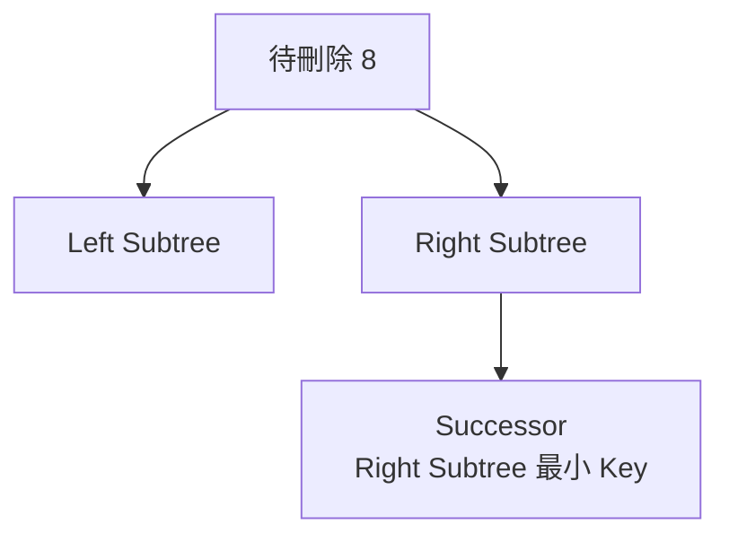

Successor 沒有 Left Child，否則它不是 Right Subtree 的最小值。因此第二次刪除會落在 0 或 1 個 Child 的較簡單情況。

#### Ownership 約定

此版本假設函式擁有 Node 並負責 `delete`。若 Node 由 Pool、測試框架或其他 Owner 管理，不能直接套用此釋放策略。

#### 為何回傳 Subtree Root

刪除可能改變目前 Subtree Root，例如刪除只有右 Child 的 Root。Parent 必須接回新的 Root。

### 25.9 Inorder 與排序

對合法 BST 進行 Inorder Traversal：

```text
Left Subtree → Node → Right Subtree
```

因為 Left 全部較小、Right 全部較大，所以產生嚴格遞增 Key。

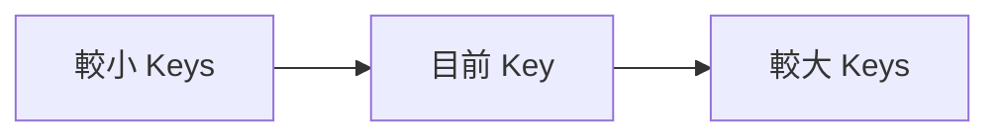

```cpp
void inorder(
    const TreeNode* root,
    std::vector<int>& result)
{
    if (root == nullptr)
    {
        return;
    }

    inorder(root->left, result);
    result.push_back(root->key);
    inorder(root->right, result);
}
```

若允許重複 Key，輸出可能是非遞減，但具體結果取決於重複政策。

Inorder 有序是 BST Property 的結果，不是驗證方法的唯一選擇。若只比較相鄰輸出，仍需明確處理重複政策與前一個值的型別範圍。

### 25.10 驗證 BST

只比較目前 Node 與直接 Child 不夠：

```cpp
root->left->key < root->key
root->right->key > root->key
```

因為 Descendant 仍可能違反 Ancestor 限制。

正確方法之一是向下傳遞合法範圍：

```text
每個 Node 必須滿足 lower < key < upper
```

進入 Left 時把 Upper 改為目前 Key；進入 Right 時把 Lower 改為目前 Key。

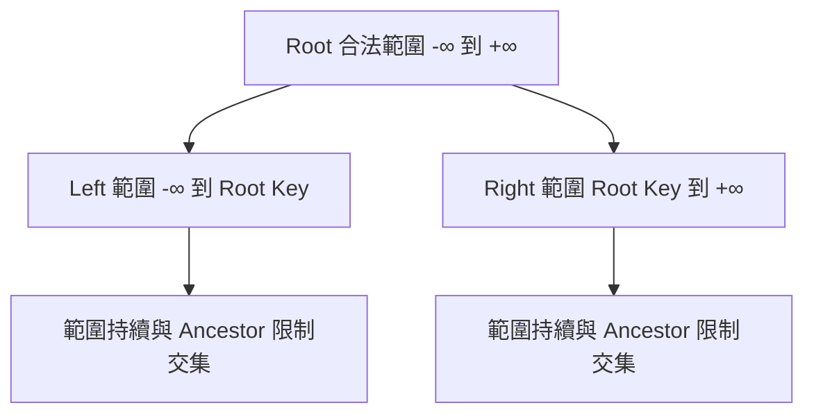

### 25.11 完整案例：使用合法範圍驗證

使用 `std::optional<long long>` 表示是否存在邊界：

```cpp
#include <optional>

bool isValidBstRange(
    const TreeNode* node,
    std::optional<long long> lower,
    std::optional<long long> upper)
{
    if (node == nullptr)
    {
        return true;
    }

    const long long key = node->key;

    if (lower.has_value() && key <= *lower)
    {
        return false;
    }

    if (upper.has_value() && key >= *upper)
    {
        return false;
    }

    return isValidBstRange(node->left, lower, key) &&
           isValidBstRange(node->right, key, upper);
}

bool isValidBst(const TreeNode* root)
{
    return isValidBstRange(
        root,
        std::nullopt,
        std::nullopt);
}
```

#### 為何不用 `INT_MIN` 與 `INT_MAX` 當 Sentinel

若合法 Key 本身可以等於這些值，Sentinel 會和真實邊界混淆。使用 Optional 邊界可避免這個問題。

#### 遞迴 Invariant

每次呼叫：

> `node` 所在 Subtree 的每個 Key 都必須落在傳入的 `(lower, upper)` 範圍。

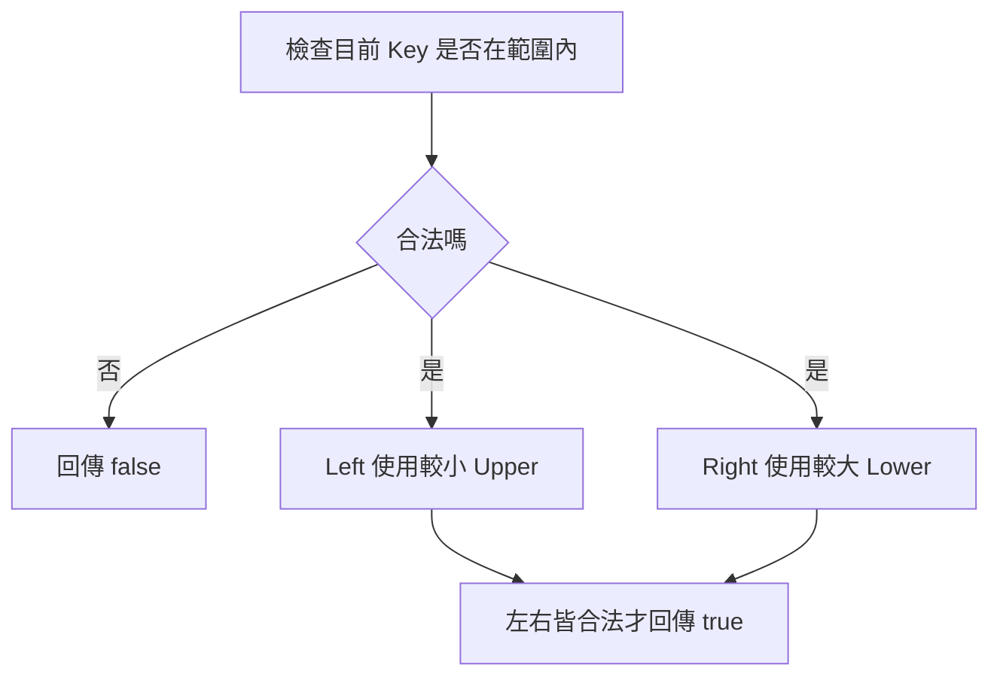

重複政策若不同，不等號也需調整。例如允許相等 Key 固定放 Right，就不能左右都使用嚴格不等式。

### 25.12 Predecessor 與 Successor

對某個 Key：

- Predecessor：嚴格小於它的最大 Key。
- Successor：嚴格大於它的最小 Key。

#### Node 有 Right Subtree

Successor 是 Right Subtree 最左 Node。

#### 沒有 Right Subtree

從 Root 搜尋目標時，記錄最近一個大於 Target 的 Ancestor 候選。

```cpp
TreeNode* successor(TreeNode* root, int target)
{
    TreeNode* candidate = nullptr;
    TreeNode* current = root;

    while (current != nullptr)
    {
        if (target < current->key)
        {
            candidate = current;
            current = current->left;
        }
        else
        {
            current = current->right;
        }
    }

    return candidate;
}
```

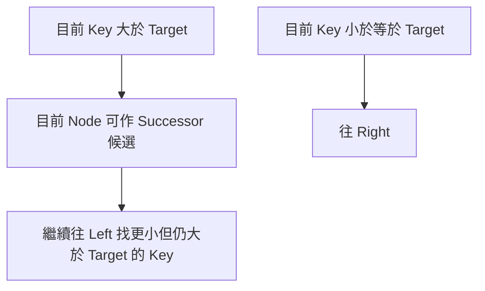

Predecessor 使用對稱邏輯。

若問題要求「某個 Node 的 Successor」，而 Tree 允許重複 Key，就應使用 Node Identity 與明確重複政策，而不是只傳入 Value。

### 25.13 範圍查詢與剪枝

輸出 `[low, high]` 內所有 Key：

```cpp
void collectRange(
    const TreeNode* node,
    int low,
    int high,
    std::vector<int>& result)
{
    if (node == nullptr)
    {
        return;
    }

    if (node->key > low)
    {
        collectRange(node->left, low, high, result);
    }

    if (node->key >= low && node->key <= high)
    {
        result.push_back(node->key);
    }

    if (node->key < high)
    {
        collectRange(node->right, low, high, result);
    }
}
```

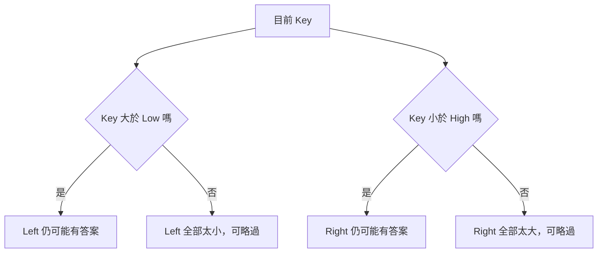

輸出使用 Inorder，因此結果有序。複雜度可描述為 O(h + m)，其中 m 是輸出數量，前提是 Tree 結構與查詢路徑能有效剪枝。

### 25.14 Height、Balance 與複雜度

Search、Insert、Delete 的時間均為 O(h)。

#### 平衡情況

```text
h = O(log n)
```

#### 鏈狀情況

依序插入已排序 Key，未平衡 BST 可能退化：

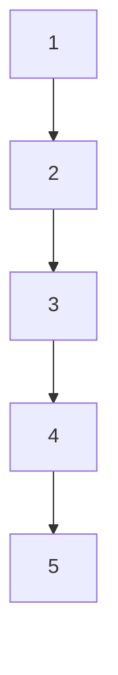

此時：

```text
h = O(n)
```

操作退化為 O(n)。因此不能把一般 BST 操作直接宣告為 O(log n)。

AVL Tree、Red-Black Tree 等平衡搜尋樹會透過 Rotation 或其他規則限制 Height。C++ `std::map` 與 `std::set` 提供 O(log n) 類型的有序容器保證，實務上通常比自行維護未平衡 BST 合適。

### 25.15 完整可編譯 C++ 範例

```cpp
#include <iostream>
#include <optional>
#include <vector>

struct TreeNode
{
    int key;
    TreeNode* left;
    TreeNode* right;
};

TreeNode* insert(TreeNode* root, int key)
{
    if (root == nullptr)
    {
        return new TreeNode{key, nullptr, nullptr};
    }

    if (key < root->key)
    {
        root->left = insert(root->left, key);
    }
    else if (key > root->key)
    {
        root->right = insert(root->right, key);
    }

    return root;
}

void inorder(const TreeNode* root)
{
    if (root == nullptr)
    {
        return;
    }

    inorder(root->left);
    std::cout << root->key << ' ';
    inorder(root->right);
}

void destroyTree(TreeNode* root)
{
    if (root == nullptr)
    {
        return;
    }

    destroyTree(root->left);
    destroyTree(root->right);
    delete root;
}

int main()
{
    TreeNode* root = nullptr;

    for (int key : std::vector<int>{8, 3, 10, 1, 6, 14, 4, 7, 13})
    {
        root = insert(root, key);
    }

    inorder(root);
    std::cout << '\n';

    destroyTree(root);
}
```

輸出：

```text
1 3 4 6 7 8 10 13 14
```

此範例採不允許重複 Key 的政策，並以 Postorder 釋放所有 Node。

### 25.16 Ownership 與 C 語言

Raw Pointer 版本需要明確定義 Node 的配置與釋放。若每個 Node 唯一擁有 Child，可考慮 `std::unique_ptr`，但 Insert、Delete 需要使用 Ownership Move。

C 語言 Node：

```c
struct TreeNode
{
    int key;
    struct TreeNode *left;
    struct TreeNode *right;
};
```

Recursive Insert 若配置失敗，需要保留原 Tree 並回報狀態。單純回傳 Root 不一定足以同時表達「Key 已存在」與「配置失敗」，可使用輸出狀態：

```c
struct TreeNode *insert_bst(
    struct TreeNode *root,
    int key,
    bool *success);
```

刪除 Node 前必須先保存 Replacement Pointer，釋放後不能再存取原 Node。

### 25.17 系統化 Debug

建議記錄：

```text
目前 Node Identity 與 Key
目標 Key
比較結果
下一個 Subtree
目前合法 Lower / Upper Bound
Insert 或 Delete 後回傳的 Subtree Root
Inorder 結果
```

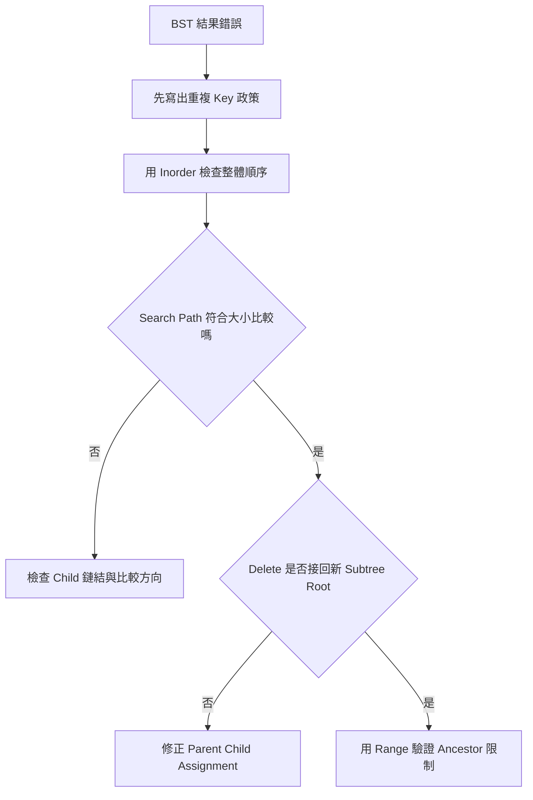

重要測試：

- 空 Tree Search、Insert、Delete。
- 刪除唯一 Root。
- 刪除 Leaf。
- 刪除只有 Left Child 或 Right Child 的 Node。
- 刪除有兩個 Child 的 Root。
- 刪除不存在 Key。
- 插入重複 Key。
- `INT_MIN` 與 `INT_MAX`。
- 已排序插入形成鏈狀 Tree。
- 違反 Ancestor 範圍但直接 Child 看似合法的 Tree。

### 25.18 常見問題與判讀

| 現象 | 可能原因 | 第一輪檢查 |
|---|---|---|
| Search 漏掉存在 Key | 比較方向寫反 | Target 較小應往 Left |
| Insert 後 Tree 沒改變 | 未接回遞迴回傳 Root | `root->left = insert(...)` |
| 重複 Key 行為不一致 | 各函式政策不同 | 先統一 Duplicate Policy |
| 刪除 Root 後仍使用舊 Pointer | 忽略 Root 可能改變 | 接回 `root = erase(root,key)` |
| 刪除後某個 Subtree 消失 | Replacement 或 Child 鏈結錯誤 | 分別測試 0、1、2 Child |
| 兩 Child 刪除出現重複 Key | 複製 Successor 後未刪除原 Node | 再從 Right Subtree Delete |
| 驗證錯誤 Tree 卻回傳 True | 只比較直接 Child | 傳遞 Ancestor Range |
| `INT_MIN` 被判非法 | 使用真實 Key 當 Sentinel | 使用 Optional 或較寬 Range |
| Inorder 不是有序 | Tree 非 BST 或鏈結已損壞 | 驗證整棵 Subtree Property |
| Predecessor/Successor 錯誤 | 只看 Child，不記錄 Ancestor 候選 | 沿 Search Path 更新 Candidate |
| 操作比預期慢 | Tree 退化成鏈狀 | 測量 Height，考慮平衡 Tree |
| Memory Leak 或 Double Free | Ownership 不明 | 明確定義建立、替換與釋放責任 |

### 25.19 練習題方向

#### 基礎題

實作 Search、Insert、Inorder，採不允許重複 Key 的政策。

#### 變化題

實作 `floor(key)` 與 `ceiling(key)`：

- Floor 是不大於 Target 的最大 Key。
- Ceiling 是不小於 Target 的最小 Key。

說明每次往 Left 或 Right 時如何更新 Candidate。

#### 綜合題

在每個 Node 保存 Subtree Size，支援第 K 小查詢。Insert 與 Delete 後必須同步更新 Size，並說明重複 Key 政策如何影響排名。

### 25.20 本章檢查表

- 我知道 BST Property 必須套用到整棵 Left、Right Subtree。
- 我會先定義重複 Key 政策。
- 我能說明 Search 每次排除哪一側 Subtree。
- 我知道 BST 操作時間是 O(h)，不一定是 O(log n)。
- 我能實作 Recursive 或 Iterative Insert。
- 我會接回 Insert 與 Delete 回傳的新 Subtree Root。
- 我能區分刪除 0、1、2 個 Child 的情況。
- 我知道兩 Child 刪除可使用 Successor 或 Predecessor。
- 我知道複製 Successor Key 後仍需刪除原 Successor Node。
- 我能用 Inorder 說明 BST 的排序輸出。
- 我知道一般 Binary Tree 的 Inorder 不一定有序。
- 我能使用合法 Range 驗證整棵 BST。
- 我不會用 `INT_MIN`、`INT_MAX` 當無條件安全的 Sentinel。
- 我能說明 Predecessor 與 Successor 的 Candidate 更新。
- 我能利用 BST Property 對範圍查詢剪枝。
- 我知道平衡 BST 的 Height 為 O(log n)，鏈狀 Tree 為 O(n)。
- 我會處理 Raw Pointer Ownership 與 Tree 銷毀。
- 我能以極端 Key、重複 Key、鏈狀 Tree 與各種 Delete 情況測試。

### 25.21 本章重點

- BST 是具有全域 Subtree 排序限制的 Binary Tree，不是只要求直接 Child 大小正確。
- 重複 Key 政策會影響 Insert、Delete、Inorder、Validate 與排名問題，必須先統一。
- Search 與 Insert 根據比較結果只保留一側 Subtree，時間取決於 Height。
- Insert 與 Delete 都可能改變 Subtree Root，因此 Parent 必須接回函式回傳值。
- Delete 分為 0、1、2 個 Child；兩 Child 情況可用 Successor 或 Predecessor 轉成較簡單刪除。
- 合法 BST 的 Inorder 會依重複政策產生遞增或非遞減順序。
- 驗證 BST 應累積所有 Ancestor Range，而不是只比較 Parent 與 Child。
- Predecessor 與 Successor 可由 Child Subtree 極值或 Search Path 上的 Ancestor Candidate 取得。
- Range Query 可利用 BST Property 略過整棵不可能含答案的 Subtree。
- 未平衡 BST 最差會退化成鏈狀，Search、Insert、Delete 皆為 O(n)。
- 平衡搜尋樹透過額外規則將 Height 維持在 O(log n)；實務 C++ 可優先考慮標準 Ordered Container。
- Raw Pointer BST 必須明確處理 Ownership、Replacement 與 Deallocation。
- Debug 時應同步檢查 Search Path、Inorder、合法 Range 與每次修改後的 Subtree Root。
