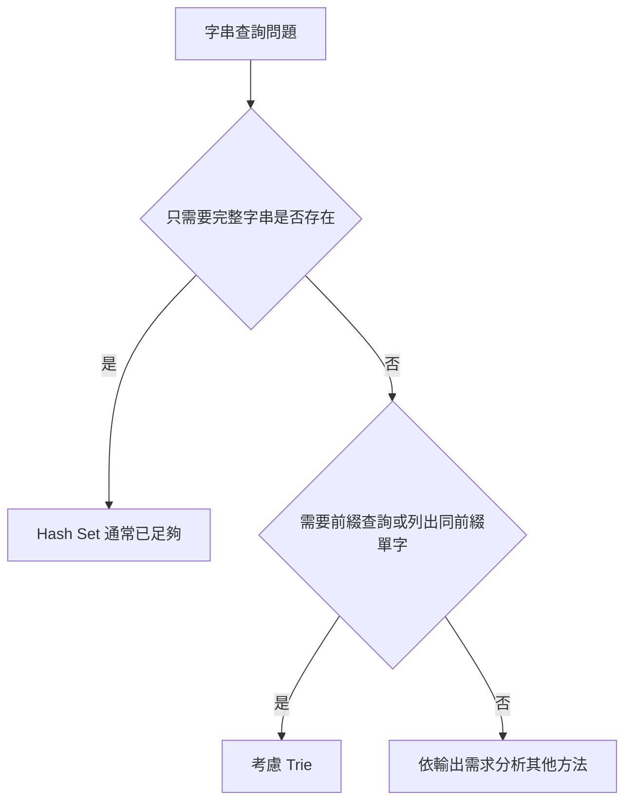
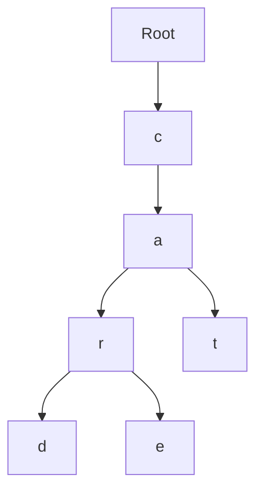
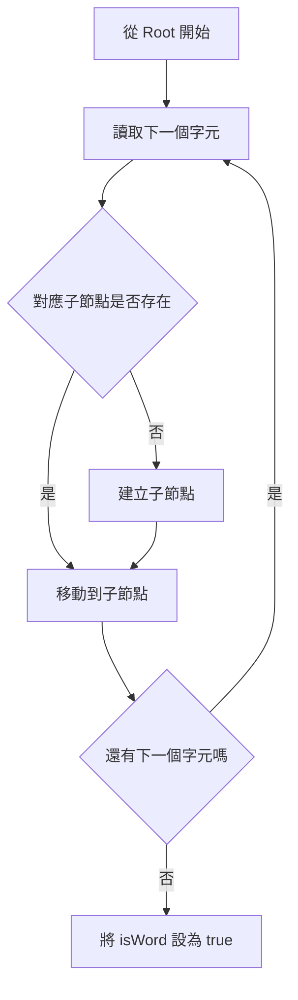
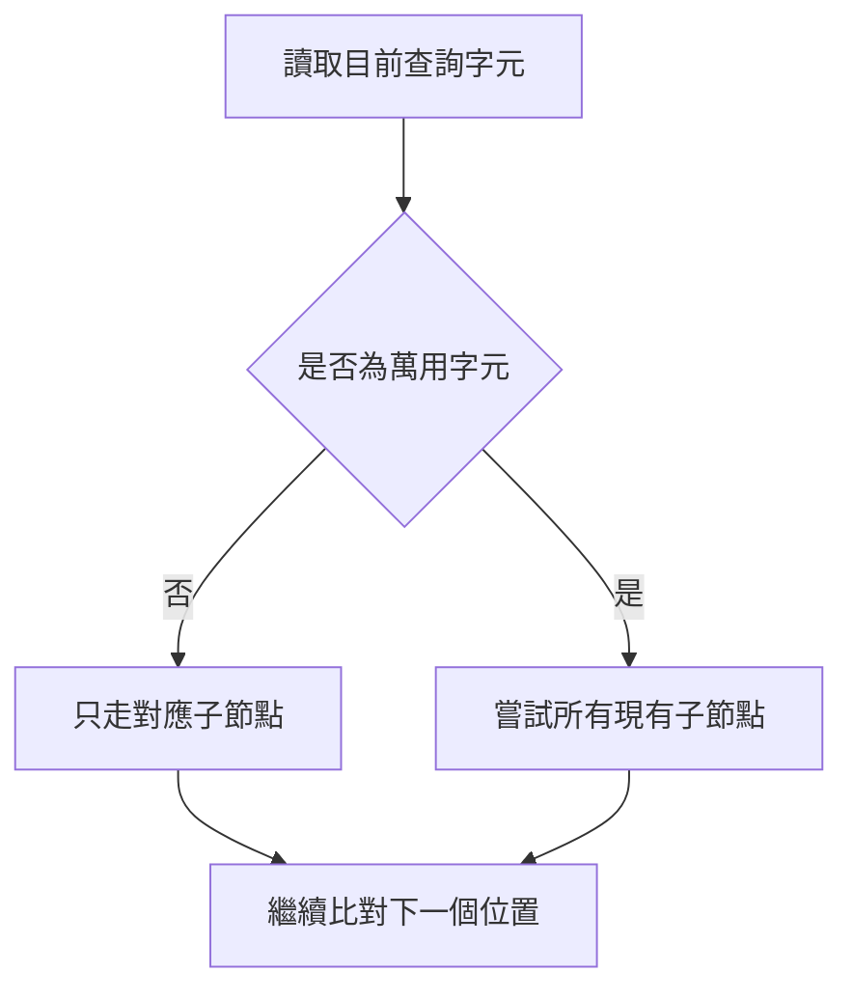
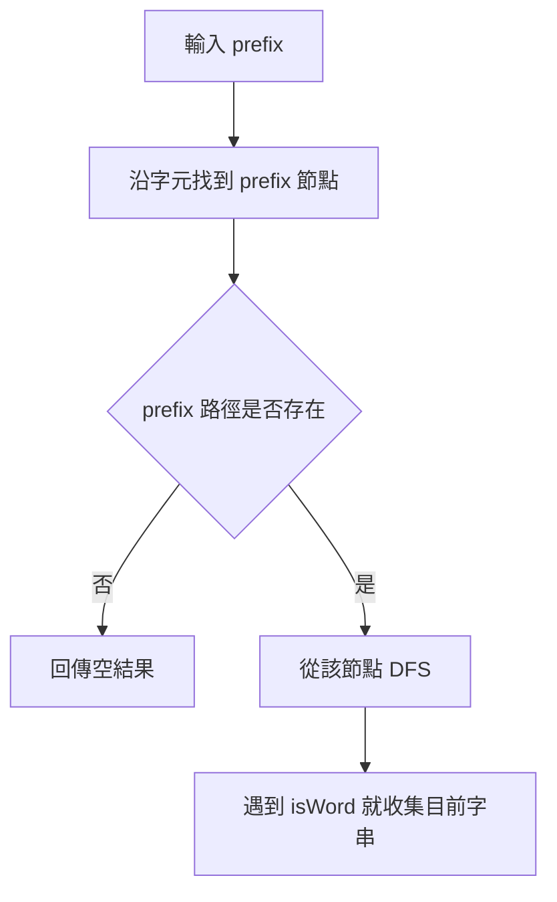
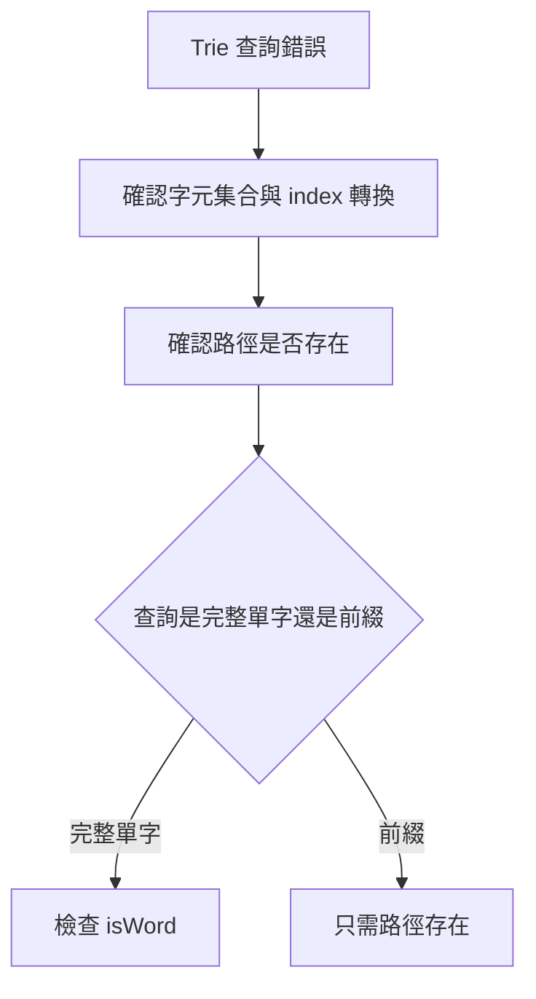

## 第 26 章　Trie

### 適用範圍

本章說明 Trie，也稱為 Prefix Tree。Trie 適合保存大量字串，並處理完整單字查詢、前綴查詢、Autocomplete、Word Dictionary 與部分字串集合相關問題。

第一次接觸 Trie 時，常見困難不是看不懂 Tree，而是不清楚：

- 為什麼不能直接用 `std::unordered_set`？
- 一個字母是一個節點，還是一個單字是一個節點？
- 找到一條字元路徑後，為什麼仍不能直接判定單字存在？
- `isWord` 或 `isEnd` 到底保存什麼資訊？
- Trie 查詢很快，為什麼仍要考慮空間成本？

原始章節也把這些問題列為第一次學 Trie 時的核心困難，並指出 Trie 的重點不是背節點類別，而是理解多個單字如何共用相同前綴。citeturn42search1

本章會建立一套固定流程：

- 先整理題目需要完整單字查詢，還是前綴查詢。
- 使用少量單字手動建立 Trie。
- 區分節點、邊、字元路徑與單字結尾。
- 分別追蹤 Insert、Search 與 Prefix Search。
- 再比較 Trie 與 Hash Table 的差異。
- 最後延伸到 Autocomplete、Word Dictionary、刪除與空間設計。



### 適用讀者

- 已理解 Tree，但第一次接觸字串樹狀結構的讀者。
- 能看懂 Trie 程式，卻不清楚 `isWord` 用途的讀者。
- 容易混淆完整單字查詢與前綴查詢的讀者。
- 想理解 Autocomplete 為什麼適合使用 Trie 的讀者。
- 不確定 Trie 與 Hash Table 應如何選擇的讀者。

### 快速導覽

- [26.1 Trie 前到底要分析什麼](#261-trie-前到底要分析什麼)
- [26.2 先不要寫程式：用單字建立 Trie](#262-先不要寫程式用單字建立-trie)
- [26.3 Trie 節點保存什麼](#263-trie-節點保存什麼)
- [26.4 Insert](#264-insert)
- [26.5 Search](#265-search)
- [26.6 Prefix Search](#266-prefix-search)
- [26.7 完整 C++ 實作](#267-完整-c-實作)
- [26.8 空間成本](#268-空間成本)
- [26.9 Word Dictionary](#269-word-dictionary)
- [26.10 Autocomplete](#2610-autocomplete)
- [26.11 Delete 與節點清理](#2611-delete-與節點清理)
- [26.12 Trie 與 Hash Table](#2612-trie-與-hash-table)
- [26.13 常見變形](#2613-常見變形)
- [26.14 複雜度](#2614-複雜度)
- [26.15 系統化 Debug](#2615-系統化-debug)
- [26.16 常見問題與判讀](#2616-常見問題與判讀)
- [26.17 本章檢查表](#2617-本章檢查表)
- [26.18 本章重點](#2618-本章重點)

### 26.1 Trie 前到底要分析什麼

假設系統已保存以下單字：

```text
car
card
care
cat
```

題目可能提出不同查詢：

- `car` 是否是一個完整單字？
- 是否存在以 `ca` 開頭的單字？
- 列出所有以 `car` 開頭的單字。

這三個問題雖然都與字串有關，但輸出要求不同。

| 分析項目 | 本題內容 |
|---|---|
| 輸入資料 | 多個英文小寫單字 |
| 完整查詢 | 判斷某個完整單字是否存在 |
| 前綴查詢 | 判斷是否有任何單字以指定文字開頭 |
| 延伸輸出 | 可能需要列出同一前綴下的所有單字 |
| 字元集合 | 本章先假設為 `a` 到 `z` |
| 是否允許空字串 | 需由題目定義 |
| 是否需要刪除 | 先處理插入與查詢，再延伸到刪除 |

原始章節也使用 `car`、`card`、`care`、`cat` 這組單字說明，完整查詢、前綴查詢與列出同前綴單字是不同需求。citeturn42search1

這張表會直接影響資料結構：

- 如果只需要完整字串是否存在，Hash Set 通常已足夠。
- 如果需要頻繁查詢前綴，Trie 可以直接沿著前綴字元走訪。
- 如果字元集合固定為 26 個小寫字母，可以使用固定大小 Array 保存子節點。
- 如果字元集合很大或稀疏，可以考慮 Map。

#### 先問三個問題

拿到字串查詢題時，先問：

```text
1. 查詢的是完整字串，還是前綴？
2. 是否需要列出所有符合前綴的字串？
3. 字元集合有多大？固定還是動態？
```

如果答案是「只查完整字串」，Trie 可能不是第一選擇。如果答案是「大量前綴查詢」或「Autocomplete」，Trie 就很自然。

### 26.2 先不要寫程式：用單字建立 Trie

先插入：

```text
car
card
care
cat
```

這些單字都有共同前綴 `ca`。如果每個單字都獨立保存，`c` 和 `a` 會重複出現。Trie 會讓共同前綴共用同一段路徑。



這張圖只畫出字元路徑，還少了一項重要資訊：哪些位置是一個完整單字的結尾。

- `r` 是 `car` 的結尾。
- `d` 是 `card` 的結尾。
- `e` 是 `care` 的結尾。
- `t` 是 `cat` 的結尾。

因此 Trie 節點除了子節點，也需要一個 Boolean 記錄「走到這裡是否形成完整單字」。原始章節也特別指出，這是理解 Trie 的關鍵。citeturn42search1

#### Prefix 不一定是完整單字

插入 `card` 之後，路徑 `c -> a -> r` 已經存在。

但如果只插入 `card`，沒有插入 `car`，那麼：

```text
startsWith("car") = true
search("car") = false
```

原因是 `car` 是已存在的前綴，但還沒有被標記為完整單字。原始章節也用這個例子說明「路徑存在」與「完整單字存在」的差異。citeturn42search1

### 26.3 Trie 節點保存什麼

每個 Trie 節點通常保存兩類資訊：

| 資訊 | 用途 |
|---|---|
| `children` | 從目前位置可以走到哪些下一個字元 |
| `isWord` | 目前位置是否是一個完整單字的結尾 |

本章假設只包含英文小寫字母，因此可以使用長度 26 的 Array。

```cpp
#include <array>
#include <memory>

struct TrieNode
{
    std::array<std::unique_ptr<TrieNode>, 26> children{};
    bool isWord = false;
};
```

#### 節點是否需要保存自己的字元

不一定。

從父節點的 `children[index]` 已經可以知道這條邊代表哪個字元，因此節點本身不一定要再保存字元。

例如：

```text
children[0] 代表 a
children[1] 代表 b
...
children[25] 代表 z
```

字元與 Index 的轉換方式是：

```cpp
int index = ch - 'a';
```

這個寫法有明確前置條件：`ch` 必須介於 `'a'` 到 `'z'`。原始章節也提醒，這個 Index 轉換有字元範圍前置條件。citeturn42search1

#### Root 代表什麼

Root 通常不代表任何字元。它代表「尚未讀取任何字元」的位置。

若題目允許空字串，則 Root 的 `isWord` 可以表示空字串是否存在。

```text
insert("") -> root.isWord = true
search("") -> 檢查 root.isWord
startsWith("") -> 通常為 true，因為所有字串都以空字串為前綴
```

是否允許空字串要依題目定義。

### 26.4 Insert

Insert 的工作是把一個單字逐字元加入 Trie。

以插入 `cat` 為例：

1. 從 Root 開始。
2. 查看是否有 `c` 子節點，沒有就建立。
3. 移動到 `c`。
4. 查看是否有 `a` 子節點，沒有就建立。
5. 移動到 `a`。
6. 查看是否有 `t` 子節點，沒有就建立。
7. 移動到 `t`。
8. 將 `t` 節點的 `isWord` 設為 true。



#### C++ Insert

```cpp
void insert(const std::string& word)
{
    TrieNode* current = root.get();

    for (char ch : word)
    {
        int index = ch - 'a';

        if (!current->children[index])
        {
            current->children[index] = std::make_unique<TrieNode>();
        }

        current = current->children[index].get();
    }

    current->isWord = true;
}
```

#### 逐輪執行

插入 `cat`：

| 目前字元 | 對應 Index | 子節點原本是否存在 | 本輪動作 |
|---|---:|---|---|
| `c` | 2 | 否 | 建立節點並移動 |
| `a` | 0 | 否 | 建立節點並移動 |
| `t` | 19 | 否 | 建立節點並移動 |
| 字串結束 | 不適用 | 不適用 | 將目前節點標記為完整單字 |

原始章節也以 `cat` 展示 Insert 的逐字元過程。citeturn42search1

#### 重複插入

若同一個單字插入多次，最簡單版本只會讓 `isWord` 維持 true，不會記錄次數。

如果題目需要計算出現次數，可以加入：

```cpp
int wordCount = 0;
```

插入結束後：

```cpp
++current->wordCount;
current->isWord = true;
```

### 26.5 Search

Search 用來判斷完整單字是否存在。

它分成兩個條件：

1. 每個字元對應的路徑都存在。
2. 最後一個節點的 `isWord` 是 true。

如果只檢查路徑，會把前綴錯認為完整單字。

#### C++ Search

```cpp
bool search(const std::string& word) const
{
    const TrieNode* node = findNode(word);
    return node != nullptr && node->isWord;
}
```

假設只插入 `card`：

| 查詢 | 路徑是否存在 | 最後節點 `isWord` | Search 結果 |
|---|---|---|---|
| `card` | 是 | true | true |
| `car` | 是 | false | false |
| `can` | 否 | 無節點 | false |

原始章節也用這張概念表說明，`search("car")` 需要確認最後節點是否為完整單字。citeturn42search1

#### findNode 的用途

`search` 和 `startsWith` 都需要沿著字元路徑找到最後節點。可把共同邏輯抽成 `findNode()`：

```cpp
const TrieNode* findNode(const std::string& text) const
{
    const TrieNode* current = root.get();

    for (char ch : text)
    {
        int index = ch - 'a';

        if (!current->children[index])
        {
            return nullptr;
        }

        current = current->children[index].get();
    }

    return current;
}
```

### 26.6 Prefix Search

Prefix Search 只需確認整段前綴路徑存在，不要求最後節點的 `isWord` 是 true。

```cpp
bool startsWith(const std::string& prefix) const
{
    return findNode(prefix) != nullptr;
}
```

假設 Trie 中有 `card`：

| 查詢 | 路徑是否存在 | Prefix Search 結果 |
|---|---|---|
| `c` | 是 | true |
| `ca` | 是 | true |
| `car` | 是 | true |
| `card` | 是 | true |
| `care` | 否 | false |

#### Search 與 startsWith 的差異

```text
Search：路徑存在，而且最後位置是完整單字。
startsWith：只要路徑存在即可。
```

原始章節也明確整理了這個差異。citeturn42search1

### 26.7 完整 C++ 實作

```cpp
#include <array>
#include <iostream>
#include <memory>
#include <string>

class Trie
{
private:
    struct TrieNode
    {
        std::array<std::unique_ptr<TrieNode>, 26> children{};
        bool isWord = false;
    };

    std::unique_ptr<TrieNode> root;

    static int toIndex(char ch)
    {
        return ch - 'a';
    }

    const TrieNode* findNode(const std::string& text) const
    {
        const TrieNode* current = root.get();

        for (char ch : text)
        {
            int index = toIndex(ch);

            if (index < 0 || index >= 26)
            {
                return nullptr;
            }

            if (!current->children[index])
            {
                return nullptr;
            }

            current = current->children[index].get();
        }

        return current;
    }

public:
    Trie()
        : root(std::make_unique<TrieNode>())
    {
    }

    void insert(const std::string& word)
    {
        TrieNode* current = root.get();

        for (char ch : word)
        {
            int index = toIndex(ch);

            if (index < 0 || index >= 26)
            {
                throw std::invalid_argument("word contains unsupported character");
            }

            if (!current->children[index])
            {
                current->children[index] = std::make_unique<TrieNode>();
            }

            current = current->children[index].get();
        }

        current->isWord = true;
    }

    bool search(const std::string& word) const
    {
        const TrieNode* node = findNode(word);
        return node != nullptr && node->isWord;
    }

    bool startsWith(const std::string& prefix) const
    {
        return findNode(prefix) != nullptr;
    }
};

int main()
{
    Trie trie;
    trie.insert("car");
    trie.insert("card");
    trie.insert("care");
    trie.insert("cat");

    std::cout << std::boolalpha;
    std::cout << trie.search("car") << '\n';
    std::cout << trie.search("ca") << '\n';
    std::cout << trie.startsWith("ca") << '\n';
    std::cout << trie.search("can") << '\n';
}
```

輸出：

```text
true
false
true
false
```

原始章節也提供完整 C++ 實作，並示範 `search("car")`、`search("ca")`、`startsWith("ca")`、`search("can")` 的輸出。citeturn42search1

#### 為什麼 insert 遇到非法字元可丟例外

本章假設字元集合是 `'a'` 到 `'z'`。若輸入可能包含大寫、數字、Unicode 或符號，應重新設計 children 表示方式，而不是直接使用 `ch - 'a'`。

### 26.8 空間成本

令所有插入字串的總字元數為 `S`。

最差情況下，單字之間完全沒有共用前綴，需要建立接近 S 個節點，因此空間複雜度可寫成：

```text
O(S × 每個節點的子節點成本)
```

若每個節點固定保存 26 個子節點指標，查找下一個字元很直接，但許多位置可能是空的。

| children 表示方式 | 優點 | 限制 |
|---|---|---|
| 固定大小 Array | 依字元取得子節點的成本固定 | 字元集合大或節點稀疏時浪費空間 |
| Hash Map | 只保存實際存在的子節點 | 每次查找有 Hash Table 成本 |
| Ordered Map | 可依字元順序走訪 | 查找成本較高，節點物件成本也較高 |

Trie 是否節省空間取決於資料。共同前綴很多時可共用節點，但每個節點本身也有管理成本，因此不能只看共用前綴就判定一定比保存完整字串省空間。原始章節也有相同提醒。citeturn42search1

#### 固定 26 children 的估算

每個 Node 都有 26 個指標。如果指標是 8 bytes，光 children 就可能約：

```text
26 × 8 = 208 bytes per node
```

再加上 `bool`、padding、allocator overhead，實際可能更高。因此資料很稀疏時，Array children 可能很耗記憶體。

#### 使用 unordered_map children

```cpp
#include <memory>
#include <unordered_map>

struct TrieNode
{
    std::unordered_map<char, std::unique_ptr<TrieNode>> children;
    bool isWord = false;
};
```

優點是只保存存在的子節點。缺點是 Hash Table 本身也有成本，且查詢常數比 Array 大。

### 26.9 Word Dictionary

Word Dictionary 常在一般 Trie Search 上加入萬用字元，例如 `.` 可以代表任意一個字元。

假設已插入：

```text
bad
dad
mad
```

查詢：

```text
.ad
```

第一個位置是 `.`，因此要嘗試 Root 的所有現有子節點，再繼續比對 `a` 和 `d`。



#### 遞迴查詢

```cpp
bool searchPattern(
    const std::string& pattern,
    int index,
    const TrieNode* node) const
{
    if (index == static_cast<int>(pattern.size()))
    {
        return node->isWord;
    }

    char ch = pattern[index];

    if (ch != '.')
    {
        int childIndex = ch - 'a';

        if (childIndex < 0 || childIndex >= 26 ||
            !node->children[childIndex])
        {
            return false;
        }

        return searchPattern(
            pattern,
            index + 1,
            node->children[childIndex].get());
    }

    for (const auto& child : node->children)
    {
        if (child && searchPattern(pattern, index + 1, child.get()))
        {
            return true;
        }
    }

    return false;
}
```

一般字元只有一條路。萬用字元可能產生多條分支，因此最差時間會高於一般 Search。原始章節也指出，`.` 可能展開多個搜尋分支，複雜度需依實際分支數分析。citeturn42search1

#### Word Dictionary Debug

若萬用字元查詢錯誤，先檢查：

- 到字串結尾時是否檢查 `isWord`。
- 一般字元是否只走對應 child。
- `.` 是否嘗試所有存在的 child。
- 任一分支成功是否立即回傳 true。

### 26.10 Autocomplete

Autocomplete 的問題通常是：

```text
給定前綴，列出所有以此前綴開頭的單字。
```

例如 Trie 中有：

```text
car
card
care
cat
```

輸入前綴：

```text
car
```

輸出可能是：

```text
car
card
care
```

處理方式分成兩步：

1. 沿著前綴找到對應節點。
2. 從該節點繼續 DFS，收集所有 `isWord == true` 的路徑。



原始章節也用同樣兩步描述 Autocomplete：先找前綴節點，再從該節點 DFS 收集單字。citeturn42search1

#### 收集單字的 DFS

```cpp
void collectWords(
    const TrieNode* node,
    std::string& current,
    std::vector<std::string>& result) const
{
    if (node->isWord)
    {
        result.push_back(current);
    }

    for (int i = 0; i < 26; ++i)
    {
        if (!node->children[i])
        {
            continue;
        }

        current.push_back(static_cast<char>('a' + i));
        collectWords(node->children[i].get(), current, result);
        current.pop_back();
    }
}
```

這裡的 `push_back`、遞迴與 `pop_back` 和 Backtracking 相同：進入一個字元分支，收集完後再還原字串。原始章節也指出這點。citeturn42search1

#### 排序順序

若 children 用固定 Array 並從 `a` 到 `z` 掃描，Autocomplete 結果會自然依字典序輸出。

若 children 使用 `unordered_map`，輸出順序不固定；若需要字典序，應使用 ordered map 或額外排序 keys。

### 26.11 Delete 與節點清理

基礎 Trie 常只處理 Insert、Search、Prefix Search。但有些題目會要求刪除單字。

刪除分成兩層：

1. 將單字結尾的 `isWord` 改為 false。
2. 若某些節點不再被任何單字使用，可選擇清理節點。

#### 只取消 isWord

若只要求刪除後 `search(word)` 為 false，最簡單方式是：

```cpp
bool eraseWordOnly(const std::string& word)
{
    TrieNode* node = findNodeMutable(word);

    if (node == nullptr || !node->isWord)
    {
        return false;
    }

    node->isWord = false;
    return true;
}
```

這不會釋放不再使用的節點，但語意簡單。

#### 何時不能刪節點

假設 Trie 中有：

```text
car
card
care
```

刪除 `car` 時不能刪掉 `r` 節點，因為 `card` 和 `care` 仍需要 `car` 這條前綴路徑。

可以清理節點的條件通常是：

```text
該節點不是任何單字結尾，且沒有任何 child。
```

### 26.12 Trie 與 Hash Table

Trie 與 Hash Table 都可以查詢完整字串，但適用情況不同。

| 需求 | Trie | Hash Table |
|---|---|---|
| 查詢完整單字 | 可以 | 可以 |
| 查詢任意前綴 | 直接沿前綴走訪 | 一般 Hash Set 不直接支援 |
| 列出同前綴單字 | 可從前綴節點繼續 DFS | 通常要掃描全部字串 |
| 空間 | 依節點表示與共同前綴而定 | 保存完整 Key 與 Hash Table 結構 |
| 實作難度 | 較高 | 較低 |

如果題目只問單字是否存在，Hash Set 通常較直接。

如果題目需要大量前綴查詢、Autocomplete 或依前綴走訪，Trie 的結構更符合需求。工具不是從題目出現「字串」就直接決定，而是由查詢型態決定。這也是原始章節的核心判斷。citeturn42search1

#### Trie 不一定永遠比較快

Trie 的查詢時間常寫成 O(L)，L 是字串長度。Hash Set 平均查詢也通常和字串 Hash 成本有關，實務上兩者常數、記憶體配置與資料分布都會影響效能。

因此選擇時應依需求：

- 前綴相關：偏 Trie。
- 只查完整字串：Hash Set 通常簡單。
- 需要字典序列出：Trie + ordered traversal 或排序容器。
- 字元集合很大：固定 Array Trie 可能浪費空間。

### 26.13 常見變形

#### 1. Prefix Count

若題目問「有多少單字以 prefix 開頭」，可以在每個節點保存 `prefixCount`。

插入每個字元後：

```cpp
++current->prefixCount;
```

查詢 prefix 對應節點後，回傳該節點的 `prefixCount`。

#### 2. Word Count

若允許重複插入相同單字，可用 `wordCount` 取代或搭配 `isWord`。

```cpp
int wordCount = 0;
```

插入結尾：

```cpp
++current->wordCount;
current->isWord = true;
```

#### 3. Longest Prefix Match

常見於路由表或字典匹配：沿著字串走 Trie，同時記錄最後一次遇到 `isWord == true` 的位置。

#### 4. Binary Trie

若字串換成二進位位元，例如處理 XOR 最大值，可以使用只有 0 / 1 兩個 children 的 Trie。

```text
children[0]
children[1]
```

這類題的節點深度通常是位元數，例如 31 或 63。

### 26.14 複雜度

令：

```text
L = 查詢或插入字串長度
S = 所有插入字串總字元數
A = 字元集合大小，例如 26
K = 輸出結果數量或輸出總字元數
```

| 操作 | 時間 | 額外說明 |
|---|---:|---|
| Insert | O(L) | 每個字元走一步或建立節點 |
| Search | O(L) | 路徑存在後還要檢查 `isWord` |
| startsWith | O(L) | 只檢查路徑 |
| Autocomplete | O(L + K) | 先找 prefix，再輸出所有結果 |
| Word Dictionary with `.` | 最差可分支展開 | 每個 `.` 可能嘗試多個 child |
| 空間 | O(S × 每節點成本) | 取決於 children 表示方式 |

#### Autocomplete 的輸出成本不能省略

如果有很多單字都符合 prefix，就算找 prefix 節點很快，也必須花時間把結果輸出。

```text
時間 = 找 prefix O(L) + 收集輸出 O(K)
```

### 26.15 系統化 Debug

Trie Debug 建議記錄：

```text
目前字元
對應 index
目前節點是否存在
是否建立新節點
最後節點 isWord
Search 與 startsWith 是否混用
```

#### Insert Debug 表

| 字元 | index | child 是否存在 | 動作 |
|---|---:|---|---|
| c | 2 | 否 | 建立 |
| a | 0 | 否 | 建立 |
| r | 17 | 否 | 建立 |
| 結束 | - | - | `isWord = true` |

#### Search Debug 表

| 字元 | index | child 是否存在 | 動作 |
|---|---:|---|---|
| c | 2 | 是 | 移動 |
| a | 0 | 是 | 移動 |
| r | 17 | 是 | 移動 |
| 結束 | - | - | 檢查 `isWord` |



### 26.16 常見問題與判讀

原始章節已整理常見問題，例如 `search("car")` 錯誤回傳 true、`startsWith` 錯誤回傳 false、陣列讀取越界、共同前綴插入後資料消失、Autocomplete 漏字、萬用字元查詢很慢、記憶體使用過高等。citeturn42search1

| 現象 | 可能原因 | 第一輪檢查 |
|---|---|---|
| `search("car")` 錯誤回傳 true | 只檢查路徑，沒有檢查 `isWord` | 確認最後節點是否為完整單字 |
| `startsWith` 錯誤回傳 false | 誤要求最後節點 `isWord == true` | 前綴查詢只需路徑存在 |
| 陣列讀取越界 | 輸入字元不在 `a` 到 `z` | 確認字元集合與 Index 轉換 |
| 插入共同前綴後資料消失 | 重複建立並覆蓋既有節點 | 只有子節點不存在時才建立 |
| Autocomplete 漏字 | 遇到 `isWord` 後就停止 DFS | 收集單字後仍要繼續走子節點 |
| 萬用字元查詢很慢 | 每個 `.` 都可能展開多個分支 | 依實際分支數分析複雜度 |
| 記憶體使用過高 | 每個節點固定配置大量子指標 | 考慮改用 Map 或壓縮結構 |
| 刪除 prefix 後其他單字消失 | 清理節點時未確認 child 與 `isWord` | 只有無 child 且非單字結尾才可刪 |
| 重複插入後計數錯 | 只使用 Boolean `isWord` | 需要 `wordCount` 或 `prefixCount` |
| unordered_map children 輸出順序不穩定 | Hash Map 不保證字元順序 | 需要字典序時排序 key 或用 ordered map |

### 26.17 本章檢查表

- 我能說明 Trie 如何共用單字的共同前綴。
- 我知道一個節點通常對應一個字元位置，而不是一個完整單字。
- 我能說明 `children` 與 `isWord` 的用途。
- 我能區分路徑存在與完整單字存在。
- 我能手動插入 `car`、`card`、`care` 與 `cat`。
- 我能分別寫出 Insert、Search 與 Prefix Search。
- 我知道 `search` 需要檢查 `isWord`，而 `startsWith` 不需要。
- 我能說明固定 Array 與 Map 保存子節點的差異。
- 我能說明萬用字元為什麼會產生多個搜尋分支。
- 我能說明 Autocomplete 如何先找前綴，再從該節點 DFS。
- 我能依需求判斷使用 Trie 或 Hash Table。
- 我會測試空字串、單字本身也是其他單字前綴、查無路徑與重複插入。
- 我知道如果字元集合不是 `a` 到 `z`，不能直接使用 `ch - 'a'`。
- 我知道 Autocomplete 的時間要包含輸出大小。

### 26.18 本章重點

- Trie 是用字元路徑保存字串的 Prefix Tree。
- 多個單字可以共用相同前綴節點。
- `children` 表示下一個可以走到的字元。
- `isWord` 表示目前節點是否為完整單字結尾。
- Insert 會逐字元建立缺少的節點，最後標記 `isWord`。
- Search 要求整段路徑存在，而且最後節點是完整單字。
- Prefix Search 只要求整段前綴路徑存在。
- Trie 的時間通常與查詢字串長度有關，但空間成本也包含大量節點與子節點表示。
- Word Dictionary 的萬用字元可能展開多條搜尋路徑。
- Autocomplete 會先找到前綴節點，再從該節點收集所有完整單字。
- 如果只需要完整字串存在性，Hash Set 通常較直接；需要前綴能力時，Trie 更符合問題結構。
- 若需要刪除、計數或字典序輸出，節點需要額外保存對應資訊。
