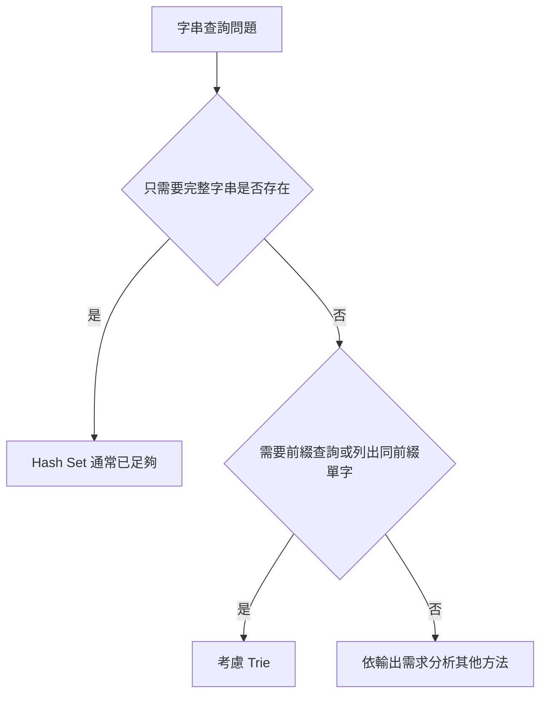
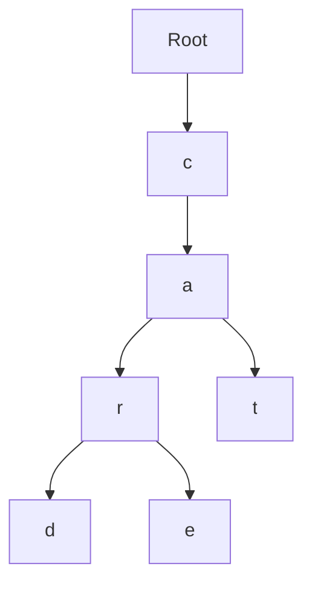
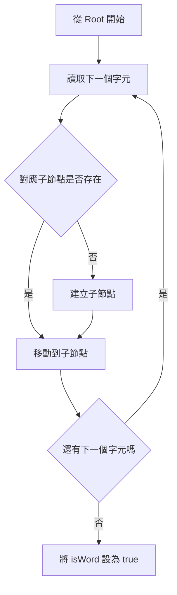
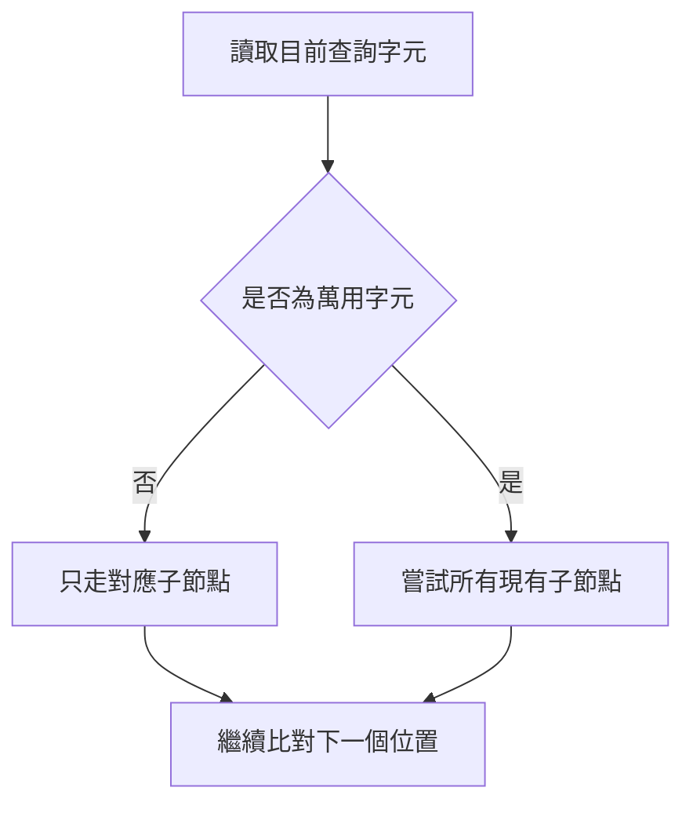
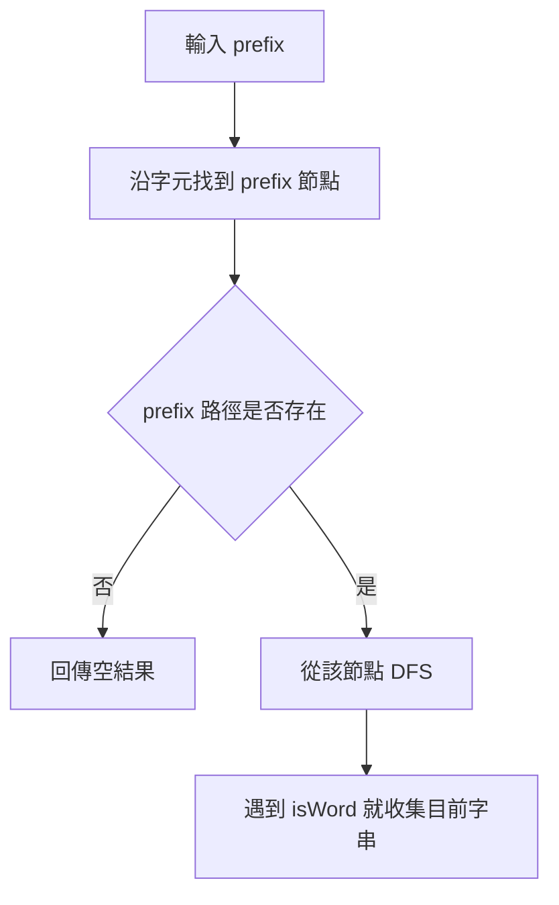

## 第 26 章　Trie

### 適用範圍

本章說明 Trie，也稱為 Prefix Tree。Trie 適合保存大量字串，並處理完整單字查詢與前綴查詢。

第一次接觸 Trie 時，常見困難不是看不懂 Tree，而是不清楚：

- 為什麼不能直接用 `std::unordered_set<string>`？
- 一個字母是一個節點，還是一個單字是一個節點？
- 找到一條字元路徑後，為什麼仍不能直接判定單字存在？
- `isWord` 或 `isEnd` 到底保存什麼資訊？
- Trie 查詢很快，為什麼仍要考慮空間成本？

本章會建立一套固定流程：

- 先整理題目需要完整單字查詢，還是前綴查詢。
- 使用少量單字手動建立 Trie。
- 區分節點、邊、字元路徑與單字結尾。
- 分別追蹤 Insert、Search 與 Prefix Search。
- 再比較 Trie 與 Hash Table 的差異。
- 最後延伸到 Autocomplete 與 Word Dictionary。



Trie 的重點不是背節點類別，而是理解多個單字如何共用相同前綴。

### 適用讀者

- 已理解 Tree，但第一次接觸字串樹狀結構的讀者。
- 能看懂 Trie 程式，卻不清楚 `isWord` 用途的讀者。
- 容易混淆完整單字查詢與前綴查詢的讀者。
- 想理解 Autocomplete 為什麼適合使用 Trie 的讀者。
- 不確定 Trie 與 Hash Table 應如何選擇的讀者。

### 快速導覽

- [26.1 Trie 前到底要分析什麼](#261-trie-前到底要分析什麼)：先整理查詢需求。
- [26.2 先不要寫程式：用單字建立 Trie](#262-先不要寫程式用單字建立-trie)：觀察共同前綴。
- [26.3 Trie 節點保存什麼](#263-trie-節點保存什麼)：理解 children 與 isWord。
- [26.4 Insert](#264-insert)：逐字元建立路徑。
- [26.5 Search](#265-search)：確認完整單字是否存在。
- [26.6 Prefix Search](#266-prefix-search)：確認前綴路徑是否存在。
- [26.7 完整 C++ 實作](#267-完整-c-實作)：整合三個核心功能。
- [26.8 空間成本](#268-空間成本)：分析節點與子節點表示方式。
- [26.9 Word Dictionary](#269-word-dictionary)：加入萬用字元查詢。
- [26.10 Autocomplete](#2610-autocomplete)：從前綴節點繼續收集單字。
- [26.11 Trie 與 Hash Table](#2611-trie-與-hash-table)：依輸出需求選擇。
- [26.12 常見問題與判讀](#2612-常見問題與判讀)：整理常見錯誤。
- [26.13 本章檢查表](#2613-本章檢查表)：確認是否掌握核心概念。
- [26.14 本章重點](#2614-本章重點)：回顧本章核心。

### 26.1 Trie 前到底要分析什麼

假設系統已保存以下單字：

```text
car
card
care
cat
```

題目可能提出不同查詢：

- `car` 是否是一個完整單字？
- 是否存在以 `ca` 開頭的單字？
- 列出所有以 `car` 開頭的單字。

這三個問題雖然都與字串有關，但輸出要求不同。

<table>
<tr><th>分析項目</th><th>本題內容</th></tr>
<tr><td>輸入資料</td><td>多個英文小寫單字</td></tr>
<tr><td>完整查詢</td><td>判斷某個完整單字是否存在</td></tr>
<tr><td>前綴查詢</td><td>判斷是否有任何單字以指定文字開頭</td></tr>
<tr><td>延伸輸出</td><td>可能需要列出同一前綴下的所有單字</td></tr>
<tr><td>字元集合</td><td>本章先假設為 `a` 到 `z`</td></tr>
<tr><td>是否允許空字串</td><td>需由題目定義</td></tr>
<tr><td>是否需要刪除</td><td>本章先處理插入與查詢</td></tr>
</table>

這張表會直接影響資料結構：

- 如果只需要完整字串是否存在，Hash Set 通常已足夠。
- 如果需要頻繁查詢前綴，Trie 可以直接沿著前綴字元走訪。
- 如果字元集合固定為 26 個小寫字母，可以使用固定大小 Array 保存子節點。
- 如果字元集合很大或稀疏，可以考慮 Map。

### 26.2 先不要寫程式：用單字建立 Trie

先插入：

```text
car
card
care
cat
```

這些單字都有共同前綴 `ca`。

如果每個單字都獨立保存，`c` 和 `a` 會重複出現。Trie 會讓共同前綴共用同一段路徑。



這張圖只畫出字元路徑，還少了一項重要資訊：哪些位置是一個完整單字的結尾。

- `r` 是 `car` 的結尾。
- `d` 是 `card` 的結尾。
- `e` 是 `care` 的結尾。
- `t` 是 `cat` 的結尾。

因此 Trie 節點除了子節點，也需要一個 Boolean 記錄「走到這裡是否形成完整單字」。

#### Prefix 不一定是完整單字

插入 `card` 之後，路徑 `c → a → r` 已經存在。

但如果只插入 `card`，沒有插入 `car`，那麼：

```text
startsWith("car") = true
search("car") = false
```

原因是 `car` 是已存在的前綴，但還沒有被標記為完整單字。

這是理解 Trie 最重要的差異。

### 26.3 Trie 節點保存什麼

每個 Trie 節點通常保存兩類資訊：

<table>
<tr><th>資訊</th><th>用途</th></tr>
<tr><td>`children`</td><td>從目前位置可以走到哪些下一個字元</td></tr>
<tr><td>`isWord`</td><td>目前位置是否是一個完整單字的結尾</td></tr>
</table>

本章假設只包含英文小寫字母，因此可以使用長度 26 的 Array。

```cpp
struct TrieNode
{
    std::array<std::unique_ptr<TrieNode>, 26> children{};
    bool isWord = false;
};
```

#### 節點是否需要保存自己的字元

不一定。

從父節點的 `children[index]` 已經可以知道這條邊代表哪個字元，因此節點本身不一定要再保存字元。

例如：

```text
children[0] 代表 a
children[1] 代表 b
...
children[25] 代表 z
```

字元與 Index 的轉換方式是：

```cpp
int index = ch - 'a';
```

這個寫法有明確前置條件：`ch` 必須介於 `'a'` 到 `'z'`。

### 26.4 Insert

Insert 的工作是把一個單字逐字元加入 Trie。

以插入 `cat` 為例：

1. 從 Root 開始。
2. 查看是否有 `c` 子節點，沒有就建立。
3. 移動到 `c`。
4. 查看是否有 `a` 子節點，沒有就建立。
5. 移動到 `a`。
6. 查看是否有 `t` 子節點，沒有就建立。
7. 移動到 `t`。
8. 將 `t` 節點的 `isWord` 設為 true。



#### C++ Insert

```cpp
void insert(const std::string& word)
{
    TrieNode* current = root.get();

    for (char ch : word)
    {
        int index = ch - 'a';

        if (!current->children[index])
        {
            current->children[index] = std::make_unique<TrieNode>();
        }

        current = current->children[index].get();
    }

    current->isWord = true;
}
```

#### 逐輪執行

插入 `cat`：

<table>
<tr><th>目前字元</th><th>對應 Index</th><th>子節點原本是否存在</th><th>本輪動作</th></tr>
<tr><td>`c`</td><td>2</td><td>否</td><td>建立節點並移動</td></tr>
<tr><td>`a`</td><td>0</td><td>否</td><td>建立節點並移動</td></tr>
<tr><td>`t`</td><td>19</td><td>否</td><td>建立節點並移動</td></tr>
<tr><td>字串結束</td><td>不適用</td><td>不適用</td><td>將目前節點標記為完整單字</td></tr>
</table>

### 26.5 Search

Search 用來判斷完整單字是否存在。

它分成兩個條件：

1. 每個字元對應的路徑都存在。
2. 最後一個節點的 `isWord` 是 true。

如果只檢查路徑，會把前綴錯認為完整單字。

#### C++ Search

```cpp
bool search(const std::string& word) const
{
    const TrieNode* node = findNode(word);
    return node != nullptr && node->isWord;
}
```

假設只插入 `card`：

<table>
<tr><th>查詢</th><th>路徑是否存在</th><th>最後節點 isWord</th><th>Search 結果</th></tr>
<tr><td>`card`</td><td>是</td><td>true</td><td>true</td></tr>
<tr><td>`car`</td><td>是</td><td>false</td><td>false</td></tr>
<tr><td>`can`</td><td>否</td><td>無節點</td><td>false</td></tr>
</table>

### 26.6 Prefix Search

Prefix Search 只需確認整段前綴路徑存在，不要求最後節點的 `isWord` 是 true。

```cpp
bool startsWith(const std::string& prefix) const
{
    return findNode(prefix) != nullptr;
}
```

假設 Trie 中有 `card`：

<table>
<tr><th>查詢</th><th>路徑是否存在</th><th>Prefix Search 結果</th></tr>
<tr><td>`c`</td><td>是</td><td>true</td></tr>
<tr><td>`ca`</td><td>是</td><td>true</td></tr>
<tr><td>`car`</td><td>是</td><td>true</td></tr>
<tr><td>`card`</td><td>是</td><td>true</td></tr>
<tr><td>`care`</td><td>否</td><td>false</td></tr>
</table>

#### Search 與 startsWith 的差異

```text
Search：路徑存在，而且最後位置是完整單字。
startsWith：只要路徑存在即可。
```

### 26.7 完整 C++ 實作

```cpp
#include <array>
#include <iostream>
#include <memory>
#include <string>

class Trie
{
private:
    struct TrieNode
    {
        std::array<std::unique_ptr<TrieNode>, 26> children{};
        bool isWord = false;
    };

    std::unique_ptr<TrieNode> root;

    const TrieNode* findNode(const std::string& text) const
    {
        const TrieNode* current = root.get();

        for (char ch : text)
        {
            int index = ch - 'a';

            if (!current->children[index])
            {
                return nullptr;
            }

            current = current->children[index].get();
        }

        return current;
    }

public:
    Trie()
        : root(std::make_unique<TrieNode>())
    {
    }

    void insert(const std::string& word)
    {
        TrieNode* current = root.get();

        for (char ch : word)
        {
            int index = ch - 'a';

            if (!current->children[index])
            {
                current->children[index] =
                    std::make_unique<TrieNode>();
            }

            current = current->children[index].get();
        }

        current->isWord = true;
    }

    bool search(const std::string& word) const
    {
        const TrieNode* node = findNode(word);
        return node != nullptr && node->isWord;
    }

    bool startsWith(const std::string& prefix) const
    {
        return findNode(prefix) != nullptr;
    }
};

int main()
{
    Trie trie;

    trie.insert("car");
    trie.insert("card");
    trie.insert("care");
    trie.insert("cat");

    std::cout << std::boolalpha;
    std::cout << trie.search("car") << '\n';
    std::cout << trie.search("ca") << '\n';
    std::cout << trie.startsWith("ca") << '\n';
    std::cout << trie.search("can") << '\n';
}
```

輸出：

```text
true
false
true
false
```

### 26.8 空間成本

令所有插入字串的總字元數為 S。

最差情況下，單字之間完全沒有共用前綴，需要建立接近 S 個節點，因此空間複雜度可寫成：

```text
O(S × 每個節點的子節點成本)
```

若每個節點固定保存 26 個子節點指標，查找下一個字元很直接，但許多位置可能是空的。

<table>
<tr><th>children 表示方式</th><th>優點</th><th>限制</th></tr>
<tr><td>固定大小 Array</td><td>依字元取得子節點的成本固定</td><td>字元集合大或節點稀疏時浪費空間</td></tr>
<tr><td>Hash Map</td><td>只保存實際存在的子節點</td><td>每次查找有 Hash Table 成本</td></tr>
<tr><td>Ordered Map</td><td>可依字元順序走訪</td><td>查找成本較高，節點物件成本也較高</td></tr>
</table>

Trie 是否節省空間取決於資料。共同前綴很多時可共用節點，但每個節點本身也有管理成本，因此不能只看共用前綴就判定一定比保存完整字串省空間。

### 26.9 Word Dictionary

Word Dictionary 常在一般 Trie Search 上加入萬用字元，例如 `.` 可以代表任意一個字元。

假設已插入：

```text
bad
dad
mad
```

查詢：

```text
.ad
```

第一個位置是 `.`，因此要嘗試 Root 的所有現有子節點，再繼續比對 `a` 和 `d`。



#### 遞迴查詢

```cpp
bool searchPattern(
    const std::string& pattern,
    int index,
    const TrieNode* node) const
{
    if (index == static_cast<int>(pattern.size()))
    {
        return node->isWord;
    }

    char ch = pattern[index];

    if (ch != '.')
    {
        int childIndex = ch - 'a';

        if (!node->children[childIndex])
        {
            return false;
        }

        return searchPattern(
            pattern,
            index + 1,
            node->children[childIndex].get());
    }

    for (const auto& child : node->children)
    {
        if (child && searchPattern(pattern, index + 1, child.get()))
        {
            return true;
        }
    }

    return false;
}
```

一般字元只有一條路。萬用字元可能產生多條分支，因此最差時間會高於一般 Search。

### 26.10 Autocomplete

Autocomplete 的問題通常是：

```text
給定前綴，列出所有以此前綴開頭的單字。
```

例如 Trie 中有：

```text
car
card
care
cat
```

輸入前綴：

```text
car
```

輸出可能是：

```text
car
card
care
```

處理方式分成兩步：

1. 沿著前綴找到對應節點。
2. 從該節點繼續 DFS，收集所有 `isWord == true` 的路徑。



#### 收集單字的 DFS

```cpp
void collectWords(
    const TrieNode* node,
    std::string& current,
    std::vector<std::string>& result) const
{
    if (node->isWord)
    {
        result.push_back(current);
    }

    for (int i = 0; i < 26; ++i)
    {
        if (!node->children[i])
        {
            continue;
        }

        current.push_back(static_cast<char>('a' + i));
        collectWords(node->children[i].get(), current, result);
        current.pop_back();
    }
}
```

這裡的 `push_back`、遞迴與 `pop_back` 和 Backtracking 相同：進入一個字元分支，收集完後再還原字串。

### 26.11 Trie 與 Hash Table

Trie 與 Hash Table 都可以查詢完整字串，但適用情況不同。

<table>
<tr><th>需求</th><th>Trie</th><th>Hash Table</th></tr>
<tr><td>查詢完整單字</td><td>可以</td><td>可以</td></tr>
<tr><td>查詢任意前綴</td><td>直接沿前綴走訪</td><td>一般 Hash Set 不直接支援</td></tr>
<tr><td>列出同前綴單字</td><td>可從前綴節點繼續 DFS</td><td>通常要掃描全部字串</td></tr>
<tr><td>空間</td><td>依節點表示與共同前綴而定</td><td>保存完整 Key 與 Hash Table 結構</td></tr>
<tr><td>實作難度</td><td>較高</td><td>較低</td></tr>
</table>

如果題目只問單字是否存在，Hash Set 通常較直接。

如果題目需要大量前綴查詢、Autocomplete 或依前綴走訪，Trie 的結構更符合需求。

工具不是從題目出現「字串」就直接決定，而是由查詢型態決定。

### 26.12 常見問題與判讀

<table>
<tr><th>現象</th><th>可能原因</th><th>第一輪檢查</th></tr>
<tr><td>`search("car")` 錯誤回傳 true</td><td>只檢查路徑，沒有檢查 `isWord`</td><td>確認最後節點是否為完整單字</td></tr>
<tr><td>`startsWith` 錯誤回傳 false</td><td>誤要求最後節點 `isWord == true`</td><td>前綴查詢只需路徑存在</td></tr>
<tr><td>陣列讀取越界</td><td>輸入字元不在 `a` 到 `z`</td><td>確認字元集合與 Index 轉換</td></tr>
<tr><td>插入共同前綴後資料消失</td><td>重複建立並覆蓋既有節點</td><td>只有子節點不存在時才建立</td></tr>
<tr><td>Autocomplete 漏字</td><td>遇到 `isWord` 後就停止 DFS</td><td>收集單字後仍要繼續走子節點</td></tr>
<tr><td>萬用字元查詢很慢</td><td>每個 `.` 都可能展開多個分支</td><td>依實際分支數分析複雜度</td></tr>
<tr><td>記憶體使用過高</td><td>每個節點固定配置大量子指標</td><td>考慮改用 Map 或壓縮結構</td></tr>
</table>

### 26.13 本章檢查表

- 我能說明 Trie 如何共用單字的共同前綴。
- 我知道一個節點通常對應一個字元位置，而不是一個完整單字。
- 我能說明 `children` 與 `isWord` 的用途。
- 我能區分路徑存在與完整單字存在。
- 我能手動插入 `car`、`card`、`care` 與 `cat`。
- 我能分別寫出 Insert、Search 與 Prefix Search。
- 我知道 `search` 需要檢查 `isWord`，而 `startsWith` 不需要。
- 我能說明固定 Array 與 Map 保存子節點的差異。
- 我能說明萬用字元為什麼會產生多個搜尋分支。
- 我能說明 Autocomplete 如何先找前綴，再從該節點 DFS。
- 我能依需求判斷使用 Trie 或 Hash Table。
- 我會測試空字串、單字本身也是其他單字前綴、查無路徑與重複插入。

### 26.14 本章重點

- Trie 是用字元路徑保存字串的 Prefix Tree。
- 多個單字可以共用相同前綴節點。
- `children` 表示下一個可以走到的字元。
- `isWord` 表示目前節點是否為完整單字結尾。
- Insert 會逐字元建立缺少的節點，最後標記 `isWord`。
- Search 要求整段路徑存在，而且最後節點是完整單字。
- Prefix Search 只要求整段前綴路徑存在。
- Trie 的時間通常與查詢字串長度有關，但空間成本也包含大量節點與子節點表示。
- Word Dictionary 的萬用字元可能展開多條搜尋路徑。
- Autocomplete 會先找到前綴節點，再從該節點收集所有完整單字。
- 如果只需要完整字串存在性，Hash Set 通常較直接；需要前綴能力時，Trie 更符合問題結構。
