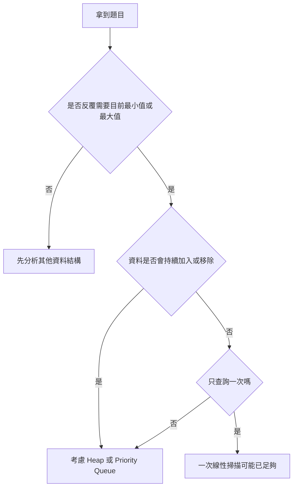
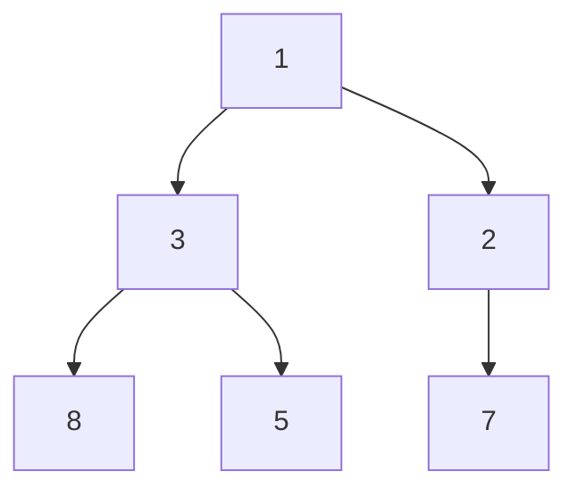
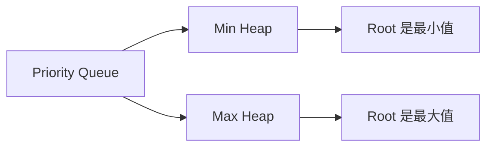
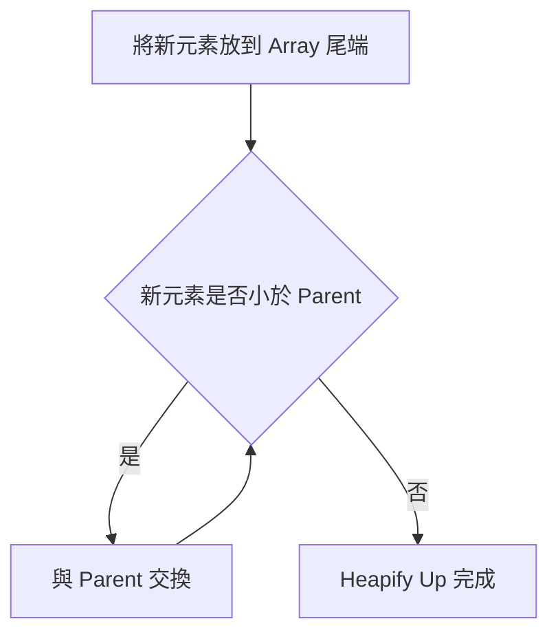
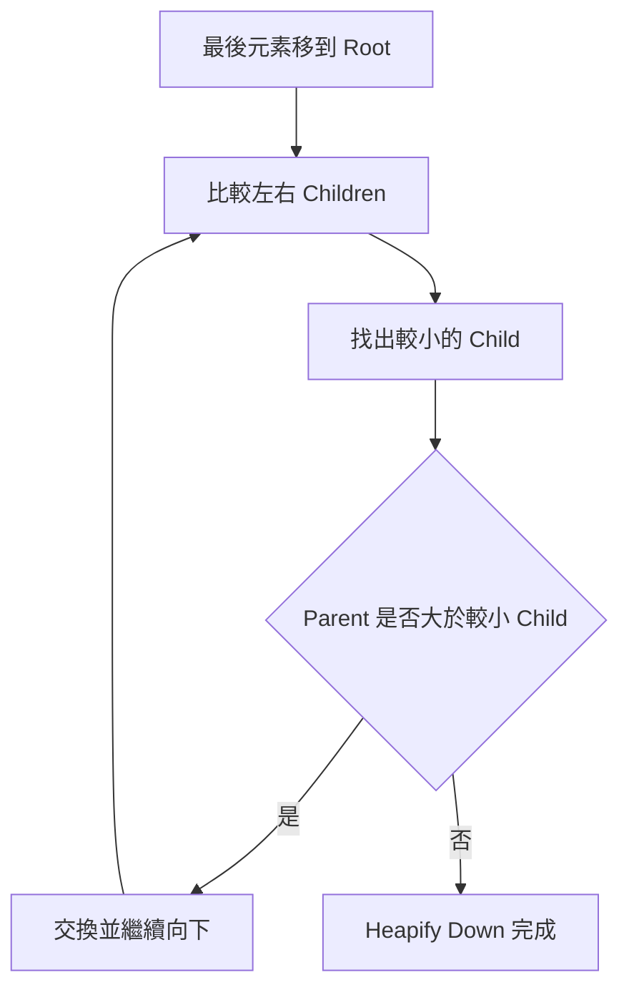
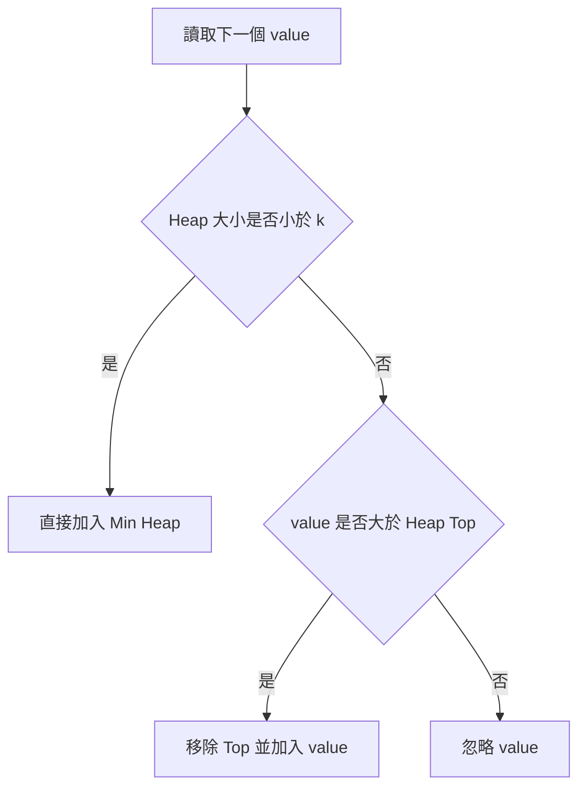
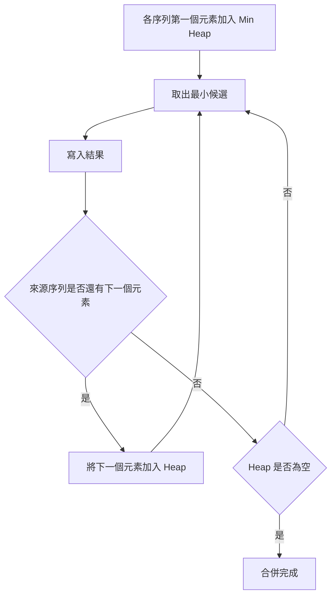
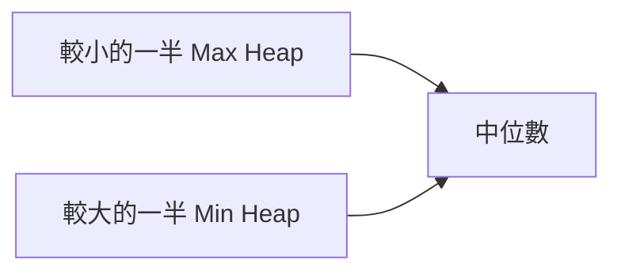

## 第 27 章　Heap 與 Priority Queue

### 適用範圍

本章說明 Heap 與 Priority Queue，以及它們適合處理哪些「反覆取得目前最小值或最大值」的問題。

第一次接觸 Heap 時，常見困難不是不會呼叫 `std::priority_queue`，而是不清楚：

- Heap 是不是一棵完整排序的 Tree？
- 為什麼只保證 Root 是最小值或最大值？
- Tree 為什麼可以放在 Array 裡？
- 插入後為什麼要 Heapify Up？
- 移除頂端後為什麼要 Heapify Down？
- `priority_queue` 預設到底是 Min Heap 還是 Max Heap？
- Top K 為什麼有時使用 Min Heap，有時使用 Max Heap？

這些問題通常不是語法問題，而是尚未分清楚「Heap 保存的性質」與「排序 Array 保存的性質」。原始章節也以這些問題作為本章切入點。citeturn41search1

本章會建立一套固定流程：

- 先確認題目是否反覆需要目前最小值或最大值。
- 使用小型資料手動畫出 Heap。
- 理解 Complete Binary Tree 與 Array Index 的關係。
- 分別追蹤 Insert、Heapify Up、Pop 與 Heapify Down。
- 再使用 C++ `std::priority_queue`。
- 最後延伸到 Top K、K-way Merge、Median Maintenance 與 Lazy Deletion。



### 適用讀者

- 已理解 Array 與 Binary Tree，但第一次接觸 Heap 的讀者。
- 會使用 `priority_queue`，但不清楚內部維護方式的讀者。
- 容易混淆 Min Heap、Max Heap 與完整排序的讀者。
- 不熟悉 Parent、Left Child、Right Child Index 公式的讀者。
- 想理解 Top K、K-way Merge、Median Maintenance 與 Lazy Deletion 的讀者。

### 快速導覽

- [27.1 Heap 前到底要分析什麼](#271-heap-前到底要分析什麼)
- [27.2 Heap 不是完整排序](#272-heap-不是完整排序)
- [27.3 Min Heap 與 Max Heap](#273-min-heap-與-max-heap)
- [27.4 使用 Array 表示 Heap](#274-使用-array-表示-heap)
- [27.5 Insert 與 Heapify Up](#275-insert-與-heapify-up)
- [27.6 Pop 與 Heapify Down](#276-pop-與-heapify-down)
- [27.7 Build Heap](#277-build-heap)
- [27.8 C++ Priority Queue](#278-c-priority-queue)
- [27.9 自訂比較器與 Pair / Struct](#279-自訂比較器與-pair--struct)
- [27.10 Top K](#2710-top-k)
- [27.11 K-way Merge](#2711-k-way-merge)
- [27.12 Median Maintenance](#2712-median-maintenance)
- [27.13 Lazy Deletion](#2713-lazy-deletion)
- [27.14 Heap、Sorting、Balanced Tree 的差異](#2714-heapsortingbalanced-tree-的差異)
- [27.15 複雜度](#2715-複雜度)
- [27.16 常見問題與判讀](#2716-常見問題與判讀)
- [27.17 本章檢查表](#2717-本章檢查表)
- [27.18 本章重點](#2718-本章重點)

### 27.1 Heap 前到底要分析什麼

假設題目如下：

```text
資料會持續加入，系統需要隨時取出目前最小值。
```

很多人看到「最小值」就直接想到排序。但第一步應先整理問題：

| 分析項目 | 本題內容 |
|---|---|
| 輸入 | 持續加入的整數 |
| 查詢 | 取得目前最小值 |
| 是否會移除最小值 | 依題目而定 |
| 資料是否持續變化 | 是 |
| 是否需要完整排序 | 不需要 |
| 真正需要維護的資訊 | 目前最小值，以及移除後的下一個最小值 |

這張表會直接影響方法：

- 若只查詢一次最小值，一次 O(n) 掃描通常足夠。
- 若資料不再變化且需要完整順序，可以排序。
- 若資料持續加入，並反覆取得或移除最小值，Min Heap 通常較合適。

Heap 的用途不是讓所有元素保持排序，而是讓最高優先權元素可以快速出現在頂端。原始章節也用這個分析表提醒，Heap 適合「資料持續變化且反覆取得極值」的情境。citeturn41search1

#### 常見適用訊號

看到下列敘述，可以優先考慮 Heap：

- 持續加入任務，每次處理最高優先權任務。
- 反覆取出目前最小成本。
- 保留目前最大的 k 個或最小的 k 個。
- 合併多個已排序序列。
- 每次需要取得目前中位數附近的資料。
- Dijkstra 中反覆取出目前距離最小的 Node。

但若題目需要「查找任意值」、「依序走訪所有元素」、「區間查詢」，Heap 不一定合適。

### 27.2 Heap 不是完整排序

假設有以下 Min Heap：

```text
[1, 3, 2, 8, 5, 7]
```

它的 Tree 可以表示成：



Min Heap 只要求：

```text
每個 Parent 小於等於自己的 Children。
```

它不要求同一層由小到大，也不要求左子樹全部小於右子樹。

例如 3 位於 2 的左邊，但 3 大於 2，仍然是合法 Min Heap。因為 3 與 2 不是 Parent 與 Child 的關係。原始章節也用這個例子說明 Heap 不是完整排序。citeturn41search1

#### Heap 與排序 Array 的差異

| 資料結構 | 保證的順序 | 最小值位置 | 任意元素查詢 |
|---|---|---|---|
| 排序 Array | 所有元素依序排列 | 固定在一端 | 可使用 Binary Search |
| Min Heap | Parent 不大於 Children | Root | 一般仍需 O(n) |
| Max Heap | Parent 不小於 Children | Root 是最大值 | 一般仍需 O(n) |

因此不能對 Heap 直接使用 Binary Search。Heap 並沒有完整的左右單調順序。原始章節也明確提醒，Heap 並不能直接用 Binary Search。citeturn41search1

#### Heap Property 只看 Parent 與 Child

檢查一個 Min Heap 是否合法，只需要對每個有 Child 的 Index 檢查：

```text
heap[parent] <= heap[leftChild]
heap[parent] <= heap[rightChild]
```

不需要檢查左邊元素是否小於右邊元素。

### 27.3 Min Heap 與 Max Heap

#### Min Heap

Min Heap 的 Root 是目前最小值。

```text
Parent <= Children
```

適合：

- 反覆取出最小工作成本。
- Dijkstra 中取得目前距離最小的 Node。
- K-way Merge 中取得目前最小候選。
- 找最大的 k 個元素時，快速淘汰候選中最小者。

#### Max Heap

Max Heap 的 Root 是目前最大值。

```text
Parent >= Children
```

適合：

- 反覆取出最大值。
- 維護目前最高優先權工作。
- 找最小的 k 個元素時，快速淘汰候選中最大者。
- Median Maintenance 中保存較小的一半。



Min 或 Max 描述的是頂端優先權，不代表整個 Array 是遞增或遞減。原始章節也以相同方式區分 Min Heap 與 Max Heap 的 Root 意義。citeturn41search1

#### 判斷要用 Min 還是 Max

不要只問「題目要最大還是最小」，還要問：

```text
我需要快速淘汰哪個候選？
```

例如找最大的 k 個元素：

- 需要保留目前最大的 k 個。
- 若來了一個更大的新值，要淘汰目前 k 個候選中最小的。
- 因此使用大小為 k 的 Min Heap。

### 27.4 使用 Array 表示 Heap

Heap 通常是一棵 Complete Binary Tree。

Complete Binary Tree 的每一層會由左到右填滿，因此可以直接依層級放入 Array，不需要為每個節點保存左右指標。

對 0-based Index：

```text
Parent(i) = (i - 1) / 2
LeftChild(i) = 2 * i + 1
RightChild(i) = 2 * i + 2
```

例如：

```text
Index: 0 1 2 3 4 5
Value: 1 3 2 8 5 7
```

| Index | Value | Parent | Left Child | Right Child |
|---|---|---|---|---|
| 0 | 1 | 無 | Index 1，值 3 | Index 2，值 2 |
| 1 | 3 | Index 0，值 1 | Index 3，值 8 | Index 4，值 5 |
| 2 | 2 | Index 0，值 1 | Index 5，值 7 | 無 |

計算 Child Index 後，仍要確認它小於 Heap 大小，否則該 Child 不存在。原始章節也提醒，Child Index 計算後仍要檢查是否越界。citeturn41search1

#### 為什麼不用 Pointer

Complete Binary Tree 的形狀固定，Array Index 已經能推導 Parent 與 Children。因此不需要每個 Node 都存 Pointer。這也是 Heap 常使用 `std::vector` 作為底層容器的原因。

### 27.5 Insert 與 Heapify Up

插入新元素時，先把元素放在 Array 尾端。這樣可以保持 Complete Binary Tree 的形狀。

但新元素可能破壞 Heap Property，因此要向上比較 Parent，必要時交換。這個過程稱為 Heapify Up，也常稱為 Sift Up。

#### 手動追蹤

原本 Min Heap：

```text
[2, 5, 4, 9, 7]
```

插入 1：

```text
[2, 5, 4, 9, 7, 1]
```

1 的 Parent 是 4。因為 1 < 4，交換：

```text
[2, 5, 1, 9, 7, 4]
```

接著 1 的 Parent 是 2。因為 1 < 2，再交換：

```text
[1, 5, 2, 9, 7, 4]
```



原始章節也以 `[2, 5, 4, 9, 7]` 插入 1 的過程示範 Heapify Up。citeturn41search1

#### C++ Min Heap Insert

```cpp
#include <vector>
#include <algorithm>

void push(std::vector<int>& heap, int value)
{
    heap.push_back(value);
    int index = static_cast<int>(heap.size()) - 1;

    while (index > 0)
    {
        int parent = (index - 1) / 2;

        if (heap[parent] <= heap[index])
        {
            break;
        }

        std::swap(heap[parent], heap[index]);
        index = parent;
    }
}
```

Heap 高度是 O(log n)，所以插入時間為 O(log n)。

### 27.6 Pop 與 Heapify Down

移除 Min Heap 頂端時，不能直接刪除 Root 後留下空洞，否則會破壞 Complete Binary Tree 的形狀。

常見流程：

1. 保存 Root 值。
2. 將最後一個元素移到 Root。
3. 刪除 Array 最後一格。
4. 從 Root 向下修復 Heap Property。

#### 手動追蹤

原本：

```text
[1, 3, 2, 8, 5, 7]
```

移除 1，將最後的 7 移到 Root：

```text
[7, 3, 2, 8, 5]
```

7 的 Children 是 3 與 2。Min Heap 要和較小的 Child 交換，因此選 2：

```text
[2, 3, 7, 8, 5]
```

Heap Property 已恢復。



原始章節也用這個案例示範 Pop 與 Heapify Down，並提醒要和左右 Children 中較小者交換。citeturn41search1

#### C++ Min Heap Pop

```cpp
#include <vector>
#include <algorithm>
#include <stdexcept>

int popMin(std::vector<int>& heap)
{
    if (heap.empty())
    {
        throw std::out_of_range("pop from empty heap");
    }

    int result = heap.front();

    heap.front() = heap.back();
    heap.pop_back();

    int index = 0;
    int n = static_cast<int>(heap.size());

    while (true)
    {
        int left = 2 * index + 1;
        int right = 2 * index + 2;
        int smallest = index;

        if (left < n && heap[left] < heap[smallest])
        {
            smallest = left;
        }

        if (right < n && heap[right] < heap[smallest])
        {
            smallest = right;
        }

        if (smallest == index)
        {
            break;
        }

        std::swap(heap[index], heap[smallest]);
        index = smallest;
    }

    return result;
}
```

呼叫前要確認 Heap 不為空。移除時間為 O(log n)。

#### 單一元素的特別提醒

若 Heap 只有一個元素，`heap.front() = heap.back()` 沒問題，接著 `pop_back()` 後 Heap 變空。`n == 0` 時 while 迴圈不會交換。仍建議先處理空 Heap，避免呼叫 `front()` 崩潰。

### 27.7 Build Heap

若已有一個未排序 Array，可以逐一插入 Heap。n 次 O(log n) 插入得到 O(n log n)。

另一種方式是 Bottom-up Build Heap：從最後一個非 Leaf 節點開始，逐一執行 Heapify Down。

0-based Index 中，最後一個非 Leaf 節點是：

```text
n / 2 - 1
```

#### C++ Bottom-up Build Min Heap

```cpp
#include <vector>
#include <algorithm>

void heapifyDown(std::vector<int>& heap, int index)
{
    int n = static_cast<int>(heap.size());

    while (true)
    {
        int left = 2 * index + 1;
        int right = 2 * index + 2;
        int smallest = index;

        if (left < n && heap[left] < heap[smallest])
        {
            smallest = left;
        }

        if (right < n && heap[right] < heap[smallest])
        {
            smallest = right;
        }

        if (smallest == index)
        {
            break;
        }

        std::swap(heap[index], heap[smallest]);
        index = smallest;
    }
}

void buildMinHeap(std::vector<int>& heap)
{
    for (int i = static_cast<int>(heap.size()) / 2 - 1;
         i >= 0;
         --i)
    {
        heapifyDown(heap, i);
    }
}
```

Bottom-up Build Heap 的時間複雜度是 O(n)，不是 O(n log n)。原因是大部分節點位於底層，需要向下移動的距離很短。原始章節也指出這點。citeturn41search1

#### 空 Heap 的迴圈注意

若 `heap.size() == 0`，`static_cast<int>(heap.size()) / 2 - 1` 為 -1，迴圈不會進入。這裡使用 signed `int` 是為了讓 `i >= 0` 可以正常終止。若使用 `std::size_t`，反向迴圈要特別小心 underflow。

### 27.8 C++ Priority Queue

C++ `std::priority_queue` 預設是 Max Heap。

#### Max Heap

```cpp
#include <queue>
#include <vector>

std::priority_queue<int> maxHeap;

maxHeap.push(3);
maxHeap.push(1);
maxHeap.push(5);

int largest = maxHeap.top(); // 5
maxHeap.pop();
```

#### Min Heap

```cpp
#include <functional>
#include <queue>
#include <vector>

std::priority_queue<
    int,
    std::vector<int>,
    std::greater<int>> minHeap;
```

常用函式：

| 函式 | 用途 | 時間 |
|---|---|---|
| `top()` | 查看最高優先權元素 | O(1) |
| `push()` | 加入元素 | O(log n) |
| `pop()` | 移除頂端元素 | O(log n) |
| `empty()` | 判斷是否為空 | O(1) |
| `size()` | 取得元素數量 | O(1) |

`pop()` 不會回傳被移除的值。若需要該值，要先讀取 `top()`。原始章節也特別提醒這點。citeturn41search1

#### priority_queue 的排序方向怎麼記

`priority_queue` 的 `top()` 會回傳「比較規則下優先權最高」的元素。預設 `std::less<T>` 讓最大值在 top，所以是 Max Heap。

若使用 `std::greater<int>`，較小值優先，因此 top 是最小值。

### 27.9 自訂比較器與 Pair / Struct

很多題目需要 Heap 中保存多個欄位，例如：

- Dijkstra：`(distance, node)`。
- K-way Merge：`(value, listIndex, elementIndex)`。
- Task Scheduling：`(priority, taskId)`。

#### Pair 的 Min Heap

```cpp
using Entry = std::pair<int, int>;

std::priority_queue<
    Entry,
    std::vector<Entry>,
    std::greater<Entry>> heap;
```

`std::pair` 會先比較第一個欄位，再比較第二個欄位。

#### Struct 自訂 Comparator

```cpp
struct Task
{
    int priority;
    int id;
};

struct CompareTask
{
    bool operator()(const Task& a, const Task& b) const
    {
        if (a.priority != b.priority)
        {
            return a.priority > b.priority; // priority 小者優先
        }
        return a.id > b.id; // id 小者優先
    }
};

std::priority_queue<
    Task,
    std::vector<Task>,
    CompareTask> heap;
```

在 `priority_queue` 中，Comparator 的語意常讓人混淆。可以用小資料測試 top 是否如預期，並在註解中寫清楚：

```text
priority 小者優先；若 priority 相同，id 小者優先。
```

### 27.10 Top K

Top K 題目通常不需要完整排序，只需要最大的 k 個或最小的 k 個元素。

#### 找最大的 k 個元素

可以維護大小最多為 k 的 Min Heap：

- Heap 保存目前最大的 k 個候選。
- Heap 頂端是這 k 個候選中最小的。
- 遇到更大的值時，移除頂端，再加入新值。



原始章節也指出，找最大的 k 個，常用大小為 k 的 Min Heap，因為要快速淘汰候選中最小的值。citeturn41search1

#### C++ 找第 k 大

```cpp
#include <functional>
#include <queue>
#include <vector>

int findKthLargest(const std::vector<int>& nums, int k)
{
    std::priority_queue<
        int,
        std::vector<int>,
        std::greater<int>> minHeap;

    for (int value : nums)
    {
        minHeap.push(value);

        if (static_cast<int>(minHeap.size()) > k)
        {
            minHeap.pop();
        }
    }

    return minHeap.top();
}
```

時間複雜度為 O(n log k)，額外空間為 O(k)。

#### 找最小的 k 個元素

對稱地，可以維護大小為 k 的 Max Heap：

- Heap 保存目前最小的 k 個候選。
- Heap 頂端是這 k 個候選中最大的。
- 遇到更小的新值時，移除頂端，再加入新值。

### 27.11 K-way Merge

若有 k 個已排序序列，要合併成一個已排序序列，每次只需比較各序列目前最前面的候選。

Min Heap 可以保存：

- 值。
- 來自哪個序列。
- 該序列中的位置。

每次取出最小候選，再把同一序列的下一個元素放入 Heap。



原始章節也說明，若總元素數是 N，Heap 大小最多為 k，時間複雜度為 O(N log k)。citeturn41search1

#### Entry 設計

```cpp
struct Entry
{
    int value;
    int listIndex;
    int elementIndex;
};
```

Comparator 應讓 `value` 小者優先。如果需要穩定輸出，可再加入 `listIndex`、`elementIndex` 作為 Tie-breaker。

#### 何時不用 Heap

如果只有兩個排序序列，雙指標 Merge 就足夠，時間 O(n + m)，不需要 Heap。Heap 主要用於 k 個序列，其中 k 可能大於 2。

### 27.12 Median Maintenance

若數字持續加入，並要隨時取得中位數，可以使用兩個 Heap：

- Max Heap 保存較小的一半。
- Min Heap 保存較大的一半。

維持兩個條件：

1. Max Heap 所有值不大於 Min Heap 所有值。
2. 兩邊大小差不超過 1。



若兩邊大小相同，中位數通常是兩個 Top 的平均。若一邊多一個元素，中位數是較大那一邊的 Top。

原始章節也說明，插入與重新平衡通常為 O(log n)，讀取中位數為 O(1)，計算平均時要小心整數溢位與整數除法。citeturn41search1

#### 插入流程

```text
若新值 <= lower.top()，放入 lower Max Heap。
否則放入 upper Min Heap。

若某邊大小超過另一邊 2 個，移動 top 到另一邊。
```

#### 平均溢位

錯誤方向：

```cpp
double median = (a + b) / 2.0;
```

如果 a、b 是 int 且很大，`a + b` 可能先 Overflow。較安全方向：

```cpp
double median = (static_cast<double>(a) + b) / 2.0;
```

或使用較寬型別。

### 27.13 Lazy Deletion

Priority Queue 可以快速移除 Top，但不擅長直接移除中間任意元素。

Lazy Deletion 的想法是：

- 先記錄某個值或某筆資料已經失效。
- 不立即從 Heap 中間移除。
- 等失效資料走到 Top 時，再真正 `pop()`。

```cpp
while (!heap.empty() && isInvalid(heap.top()))
{
    heap.pop();
}
```

原始章節也指出，Lazy Deletion 常用於 Sliding Window Median 或需要延後刪除的 Priority Queue 問題，且讀取 Top 前要先清理失效項目。citeturn41search1

#### 為什麼要 Lazy

`std::priority_queue` 不支援從中間刪除任意元素。若要刪除某個不在 top 的值，只能等它浮到 top 時再刪。

#### 相同值要記次數

若相同值可出現多次，不能只用 Boolean 表示某值失效。通常要用 Map 記待刪除次數：

```text
delayed[value] = 需要刪除的次數
```

清理 top 時：

```text
若 delayed[top] > 0，就 pop 並 delayed[top]--
```

#### 邏輯大小與實際大小

Heap 內可能暫時保留失效元素，因此：

- 容器實際 `size()` 可能包含失效資料。
- 演算法可能需要另外維護合法元素數量。
- 每次讀 `top()` 前要清理。

### 27.14 Heap、Sorting、Balanced Tree 的差異

| 需求 | Heap | Sorting | Balanced Tree |
|---|---|---|---|
| 反覆取目前最大或最小 | 適合 | 若資料不更新，可排序後依序取 | 適合，但常數可能較高 |
| 完整排序輸出 | 不直接適合 | 適合 | 可依序走訪 |
| 任意值查找 | O(n) | 排序後可 Binary Search | O(log n) |
| 動態插入 | O(log n) | Array 中插入維持排序常 O(n) | O(log n) |
| 刪除任意元素 | 不擅長 | 依位置可能 O(n) | O(log n) |
| Top K | 適合 | 可排序但成本 O(n log n) | 可行但較複雜 |

Heap 的強項是「頂端優先權」。若需求是範圍查詢、任意刪除或依序走訪所有元素，可能要考慮其他資料結構。

### 27.15 複雜度

| 工作 | Heap 成本 | 說明 |
|---|---:|---|
| `top()` | O(1) | 直接讀 Root |
| `push()` | O(log n) | Heapify Up |
| `pop()` | O(log n) | Heapify Down |
| Build Heap，逐一插入 | O(n log n) | n 次 push |
| Bottom-up Build Heap | O(n) | 從最後非 Leaf 往前 Heapify Down |
| 查找任意值 | O(n) | Heap 不完整排序 |
| Top K | O(n log k) | Heap 大小維持 k |
| K-way Merge | O(N log k) | N 為總元素數 |
| Median Maintenance 插入 | O(log n) | 插入後可能 Rebalance |
| Median Maintenance 查詢 | O(1) | 讀 Heap Top |

空間：

- Heap 本身 O(n)。
- Top K 的 Heap O(k)。
- K-way Merge 的 Heap O(k)。
- Median Maintenance 兩個 Heap 合計 O(n)。

### 27.16 常見問題與判讀

原始章節已整理常見問題，例如誤以為 Heap Array 已完整排序、Pop 後只和左 Child 比較、Child Index 越界、`priority_queue` 預設方向錯誤、空 Heap 呼叫 `top()`、Top K 使用錯 Heap、Lazy Deletion 未清理、Median 平均溢位等。citeturn41search1

| 現象 | 可能原因 | 第一輪檢查 |
|---|---|---|
| 以為 Heap Array 已完整排序 | 混淆 Heap Property 與排序順序 | 只檢查 Parent 與 Children |
| Min Heap Pop 後仍不合法 | 只和左 Child 比較 | 應先找左右 Children 中較小者 |
| Child Index 越界 | 計算後未檢查是否小於 n | 先檢查 `left < n`、`right < n` |
| `priority_queue` 頂端方向錯誤 | 忘記預設為 Max Heap | Min Heap 使用 `std::greater` |
| 呼叫 `top()` 崩潰 | Heap 為空 | 先檢查 `empty()` |
| Top K 使用錯誤 Heap | 沒有先想要淘汰哪個候選 | 找最大 k 個時通常淘汰其中最小者 |
| Lazy Deletion 讀到失效資料 | 讀取 Top 前未清理 | 使用 while 持續移除失效 Top |
| 中位數平均溢位 | 先用 int 相加 | 轉成較大型別後再加總 |
| 自訂 Comparator 結果相反 | priority_queue 比較器語意混淆 | 用小資料確認 top 是否符合預期 |
| K-way Merge 遺失元素 | 取出後未加入同序列下一個元素 | Entry 要保存來源序列與位置 |

### 27.17 本章檢查表

- 我能說明 Heap 不等於完整排序。
- 我能分辨 Min Heap 與 Max Heap 的 Root 意義。
- 我能使用 Array Index 找出 Parent 與 Children。
- 我能手動追蹤 Insert 與 Heapify Up。
- 我能手動追蹤 Pop 與 Heapify Down。
- 我知道 Heapify Down 要與較適合的 Child 交換。
- 我知道 Bottom-up Build Heap 為 O(n)。
- 我知道 C++ `priority_queue` 預設為 Max Heap。
- 我能建立 C++ Min Heap。
- 我能為 Pair 或 Struct 設計 Heap Entry。
- 我能說明找最大 k 個時為什麼常用大小為 k 的 Min Heap。
- 我能說明 K-way Merge 的 Heap 中要保存哪些資訊。
- 我能說明兩個 Heap 如何維護中位數。
- 我知道 Lazy Deletion 需要在讀取 Top 前清理失效元素。
- 我知道 Heap 不擅長任意值查找與中間刪除。

### 27.18 本章重點

- Heap 適合反覆取得或移除目前最高優先權元素。
- Min Heap 的 Root 是最小值，Max Heap 的 Root 是最大值。
- Heap 只維護 Parent 與 Children 的順序，不是完整排序。
- Complete Binary Tree 可以緊密地放入 Array。
- 插入時先放到尾端，再用 Heapify Up 修復。
- 移除頂端時用最後元素補到 Root，再用 Heapify Down 修復。
- Heap 的 `top` 為 O(1)，`push` 與 `pop` 通常為 O(log n)。
- Bottom-up Build Heap 的時間複雜度是 O(n)。
- C++ `std::priority_queue` 預設為 Max Heap。
- Top K 常用大小為 k 的 Heap，將成本控制在 O(n log k)。
- K-way Merge 用 Heap 保存每個序列目前的最小候選。
- Median Maintenance 可用 Max Heap 與 Min Heap 分別保存資料兩半。
- Lazy Deletion 適合無法直接刪除 Heap 中間元素的情況。
