## 第 28 章　Graph 基礎

### 適用範圍

本章介紹 Graph 的基本資料模型，包括 Directed、Undirected、Weighted、Unweighted Graph，以及 Path、Cycle、Connected Component、Sparse、Dense、Adjacency List、Adjacency Matrix、Edge List 與隱含 Graph。

Graph 題目的第一個難點通常不是選 BFS 或 DFS，而是先辨識輸入真正描述的關係：

- Edge 是否有方向。
- Edge 是否有權重。
- 同一組 Node 之間是否允許多條 Edge。
- 是否允許 Self-loop。
- 問題處理的是 Reachability、最少 Edge 數、最低成本，還是全部 Component。
- 輸入是現成 Graph，還是要從 Grid、字串、狀態或規則建立隱含 Graph。
- Graph 規模較適合 Adjacency List 還是 Matrix。

本章會建立一套固定流程：

1. 定義 Node 與 Edge 各代表什麼。
2. 確認 Directed、Undirected、Weighted 與重複 Edge 規則。
3. 寫出 Graph 的 Node 數 V 與 Edge 數 E。
4. 根據查詢需求選擇表示方式。
5. 明確定義 Visited State 與 Node Identity。
6. 區分 Path、Walk、Cycle、Reachability 與 Connected Component。
7. 計算建圖、儲存與完整走訪成本。
8. 使用空 Graph、孤立 Node、Self-loop、平行 Edge、Disconnected Graph 與 Cycle 測試。

### 適用讀者

- 第一次系統化學習 Graph 的讀者。
- 容易混淆 Directed 與 Undirected Graph 的讀者。
- 看到「最短路」便直接使用 BFS 的讀者。
- 不清楚 Adjacency List、Matrix 與 Edge List 差異的讀者。
- 在 Undirected Graph 建圖時只加入單向 Edge 的讀者。
- 對 Connected Component、Strongly Connected Component 與 Reachability 語意不熟悉的讀者。
- 需要為後續 BFS、DFS、Topological Sort、Shortest Path 與 MST 建立基礎的讀者。

### 快速導覽

- [Graph 到底是什麼](#281-graph-到底是什麼)
- [Directed 與 Undirected Graph](#282-directed-與-undirected-graph)
- [Weighted 與 Unweighted Graph](#283-weighted-與-unweighted-graph)
- [Path、Walk、Cycle 與 Reachability](#284-pathwalkcycle-與-reachability)
- [Connected Component](#285-connected-component)
- [Sparse 與 Dense Graph](#286-sparse-與-dense-graph)
- [Adjacency List](#287-adjacency-list)
- [Adjacency Matrix](#288-adjacency-matrix)
- [Edge List](#289-edge-list)
- [完整案例：建立 Undirected Graph](#2810-完整案例建立-undirected-graph)
- [完整案例：計算 Connected Component](#2811-完整案例計算-connected-component)
- [隱含 Graph](#2812-隱含-graph)
- [Grid 作為 Graph](#2813-grid-作為-graph)
- [Graph 表示方式的選擇](#2814-graph-表示方式的選擇)
- [正確性與複雜度](#2815-正確性與複雜度)
- [Ownership 與輸入驗證](#2816-ownership-與輸入驗證)
- [C 語言中的 Graph](#2817-c-語言中的-graph)
- [系統化 Debug](#2818-系統化-debug)
- [常見問題與判讀](#2819-常見問題與判讀)
- [練習題方向](#2820-練習題方向)
- [本章檢查表](#2821-本章檢查表)
- [本章重點](#2822-本章重點)

### 28.1 Graph 到底是什麼

Graph 通常表示為：

```text
G = (V, E)
```

- V 是 Node 或 Vertex 的集合。
- E 是 Edge 的集合。

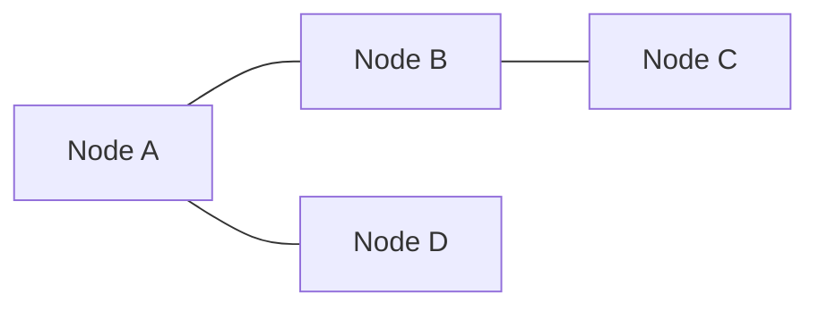

Node 可以代表：

- 城市。
- 使用者。
- 課程。
- Grid Cell。
- 遊戲狀態。
- 字串轉換狀態。

Edge 可以代表：

- 道路。
- 追蹤關係。
- 先修條件。
- 可進行的一步移動。
- 狀態轉換。

同一個故事可能對應不同 Graph 問題。城市與道路可以問 Reachability、最少道路數、最低成本或連接全部城市的成本，演算法也會不同。

### 28.2 Directed 與 Undirected Graph

#### Undirected Graph

Edge `{u, v}` 沒有方向。若 u 和 v 相鄰，從 u 可沿同一條 Edge 到 v，也可從 v 到 u。

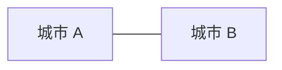

Adjacency List 通常要加入兩次：

```cpp
graph[u].push_back(v);
graph[v].push_back(u);
```

#### Directed Graph

Edge `(u, v)` 表示只能由 u 指向 v。

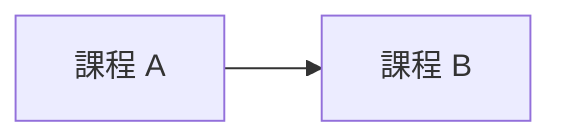

只加入：

```cpp
graph[u].push_back(v);
```

A 能到 B 不代表 B 能到 A。

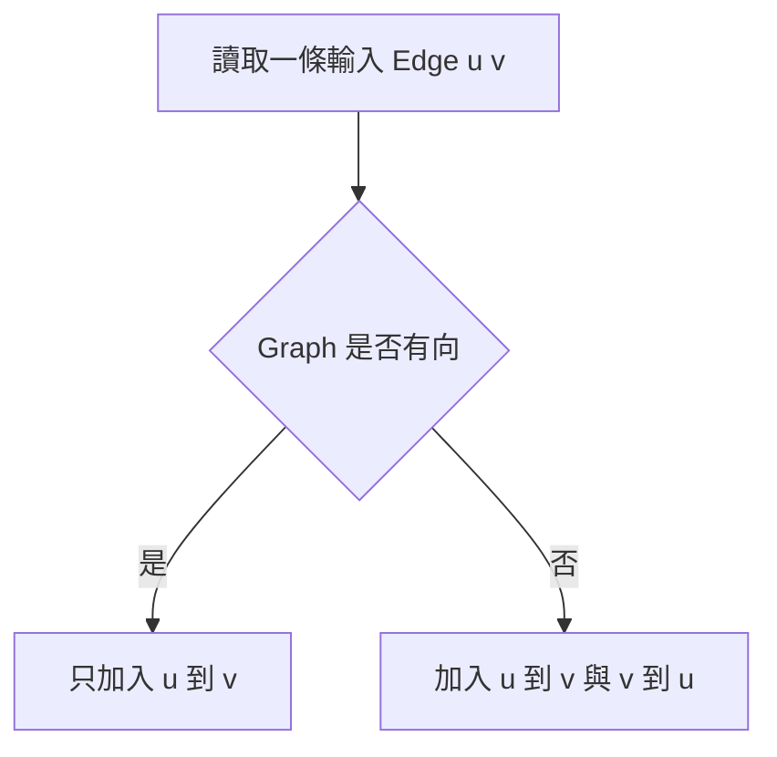

#### Degree

Undirected Graph 中，Node Degree 是相連 Edge 數。Self-loop 的 Degree 計數規則需明確定義。

Directed Graph 中：

- In-degree：指向目前 Node 的 Edge 數。
- Out-degree：由目前 Node 指出去的 Edge 數。

Topological Sort 會使用 In-degree，但只適用於 Directed Acyclic Graph。

### 28.3 Weighted 與 Unweighted Graph

#### Unweighted Graph

Edge 沒有額外成本，或所有 Edge 成本視為相同。

若目標是最少 Edge 數，普通 BFS 可按 Layer 擴張。

#### Weighted Graph

每條 Edge 額外保存 Weight：

```text
(u, v, weight)
```

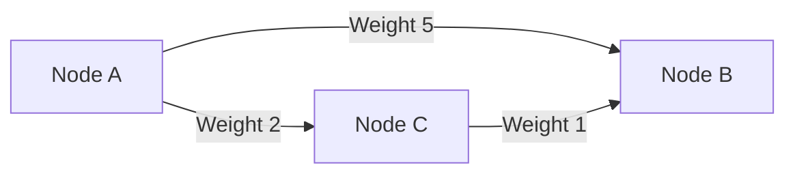

由 A 直接到 B 只走一條 Edge，但成本是 5。經 C 走兩條 Edge，總成本是 3。因此「最少 Edge 數」和「最低 Weight Sum」是不同問題。

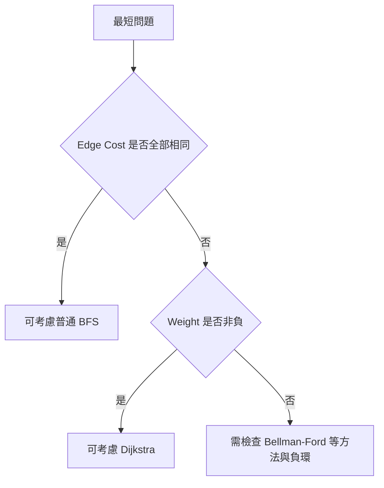

若只有 0 與 1 兩種 Weight，可考慮 0-1 BFS 與 Deque。選擇方法前應先確認 Weight 條件。

### 28.4 Path、Walk、Cycle 與 Reachability

#### Walk

Walk 是一串相鄰 Node，通常允許重複 Node 或 Edge。

#### Path

許多教材將 Path 定義為不重複 Node 的 Walk，但不同題目用語可能較寬鬆。需要確認規格。

#### Path Length

- Unweighted Graph 常以 Edge 數計算。
- Weighted Graph 常以 Weight Sum 計算。

#### Cycle

Cycle 會回到起點。Directed 與 Undirected Graph 的 Cycle 判斷方式不同。

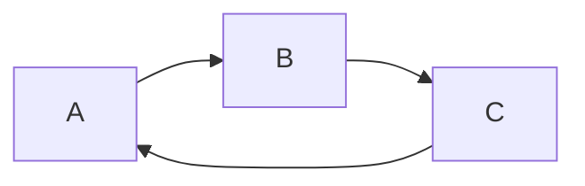

Undirected DFS 遇到已訪問 Neighbor 時，還需排除返回 Parent 的同一條 Edge。Directed Cycle 則常使用三色 State 或目前遞迴路徑。

#### Reachability

若存在從 u 到 v 的合法 Path，則 v 對 u 可達。在 Directed Graph 中 Reachability 不具對稱性。

### 28.5 Connected Component

#### Undirected Graph

Connected Component 是一組彼此可達，而且不能再加入其他可達 Node 的最大集合。

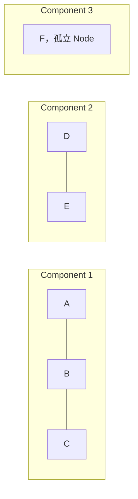

孤立 Node 本身也是一個 Component。

#### Directed Graph

Directed Graph 中需要區分：

- Weakly Connected：忽略 Edge 方向後連通。
- Strongly Connected：Component 中任意兩個 Node 都可互相到達。

一般所稱 Connected Component 常是 Undirected Graph 概念。Directed Graph 需明確說明使用哪一種定義。

### 28.6 Sparse 與 Dense Graph

令 Node 數為 V，Edge 數為 E。

#### Sparse Graph

E 相對 V 較小，例如接近 O(V)。Adjacency List 往往較省空間。

#### Dense Graph

Edge 數接近可能上限：

- Simple Undirected Graph 最多約 `V(V - 1) / 2` 條 Edge。
- 不含 Self-loop 的 Simple Directed Graph 最多 `V(V - 1)` 條 Edge。

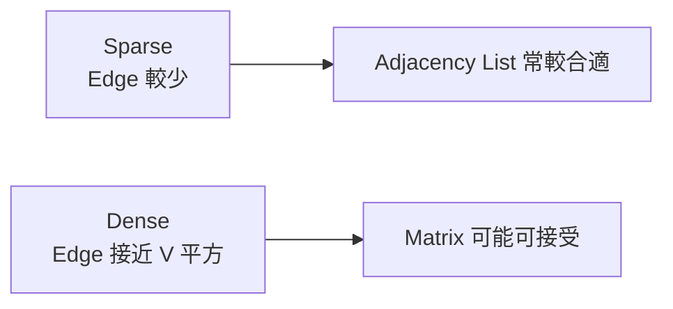

Sparse 與 Dense 不是只有名稱差異，它會影響儲存量、走訪成本與演算法選擇。

### 28.7 Adjacency List

對每個 Node 保存所有 Neighbor。

```cpp
#include <vector>

using Graph = std::vector<std::vector<int>>;
```

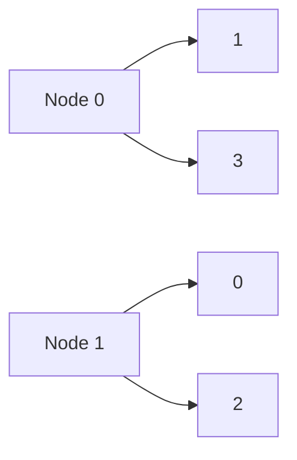

#### 成本

- 空間 O(V + E)，Undirected Graph 的每條 Edge 通常出現兩次。
- 列出 Node u 的全部 Neighbor：O(deg(u))。
- 檢查任意 `(u, v)` 是否有 Edge：一般需掃描 u 的 Neighbor。
- 完整 BFS 或 DFS：O(V + E)。

Weighted Graph 可保存：

```cpp
struct Edge
{
    int to;
    long long weight;
};

using WeightedGraph =
    std::vector<std::vector<Edge>>;
```

### 28.8 Adjacency Matrix

使用 `matrix[u][v]` 表示 Edge 是否存在，或保存 Weight。

```cpp
std::vector<std::vector<bool>> connected(
    nodeCount,
    std::vector<bool>(nodeCount, false));
```

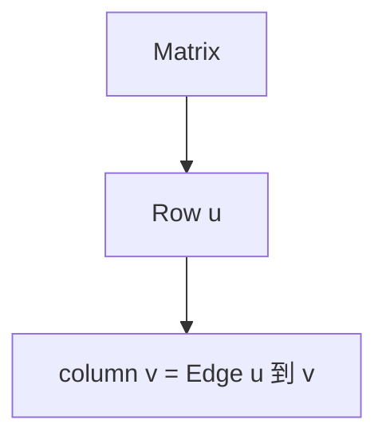

#### 成本

- 空間 O(V²)。
- 檢查任意 Edge：O(1)。
- 列出一個 Node 的全部 Neighbor：O(V)。
- 完整走訪通常需掃描 O(V²) 個 Matrix Cell。

Undirected Graph 的 Matrix 對稱：

```text
matrix[u][v] == matrix[v][u]
```

若 0 Weight 是合法值，就不能直接用 0 表示沒有 Edge，需使用額外 Boolean、Optional 或特定 Sentinel。

### 28.9 Edge List

Edge List 直接保存所有 Edge：

```cpp
struct WeightedEdge
{
    int from;
    int to;
    long long weight;
};

std::vector<WeightedEdge> edges;
```

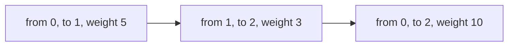

適合：

- 演算法本來就逐 Edge 處理。
- Kruskal MST 需要依 Weight 排序 Edge。
- Bellman-Ford 反覆 Relax 全部 Edge。
- 輸入本身就是 Edge 清單。

不適合頻繁列出某個 Node 的全部 Neighbor，除非另外建立 Index。

### 28.10 完整案例：建立 Undirected Graph

#### 問題規格

Node 使用 `[0, nodeCount)`，輸入每一組 `(u, v)` 代表一條 Undirected Edge。

```cpp
#include <optional>
#include <utility>
#include <vector>

std::optional<std::vector<std::vector<int>>>
buildUndirectedGraph(
    int nodeCount,
    const std::vector<std::pair<int, int>>& edges)
{
    if (nodeCount < 0)
    {
        return std::nullopt;
    }

    std::vector<std::vector<int>> graph(nodeCount);

    for (const auto& [u, v] : edges)
    {
        if (u < 0 || u >= nodeCount ||
            v < 0 || v >= nodeCount)
        {
            return std::nullopt;
        }

        graph[u].push_back(v);
        graph[v].push_back(u);
    }

    return graph;
}
```

#### Postcondition

對每條輸入 Edge `(u, v)`：

- v 出現在 `graph[u]`。
- u 出現在 `graph[v]`。

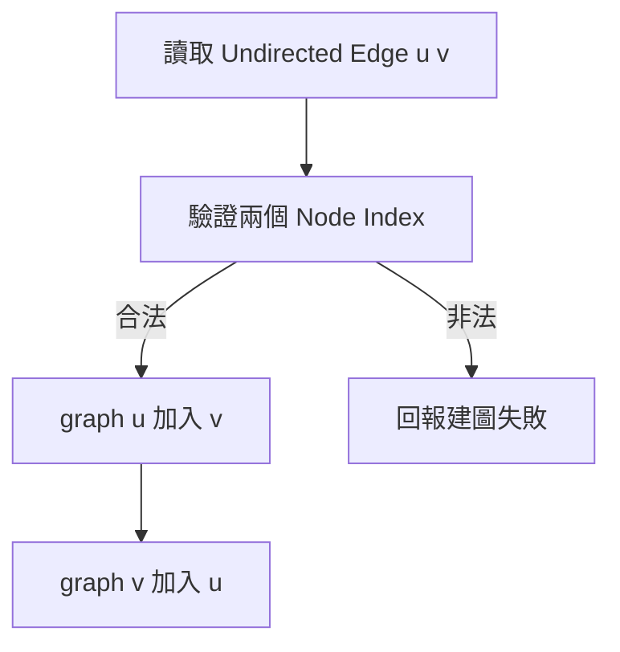

此版本保留平行 Edge 與 Self-loop。若題目要求 Simple Graph，需要另外去重或拒絕這些輸入。

### 28.11 完整案例：計算 Connected Component

使用 Iterative DFS：

```cpp
#include <stack>

int countComponents(const Graph& graph)
{
    std::vector<bool> visited(graph.size(), false);
    int components = 0;

    for (int start = 0;
         start < static_cast<int>(graph.size());
         ++start)
    {
        if (visited[start])
        {
            continue;
        }

        ++components;
        std::stack<int> pending;
        pending.push(start);
        visited[start] = true;

        while (!pending.empty())
        {
            const int node = pending.top();
            pending.pop();

            for (int next : graph[node])
            {
                if (visited[next])
                {
                    continue;
                }

                visited[next] = true;
                pending.push(next);
            }
        }
    }

    return components;
}
```

#### State 語意

- `visited[node]`：Node 已分配到某個已發現 Component。
- Stack：已發現但 Neighbor 尚未全部處理的 Node。
- `components`：目前啟動過的 DFS 次數。

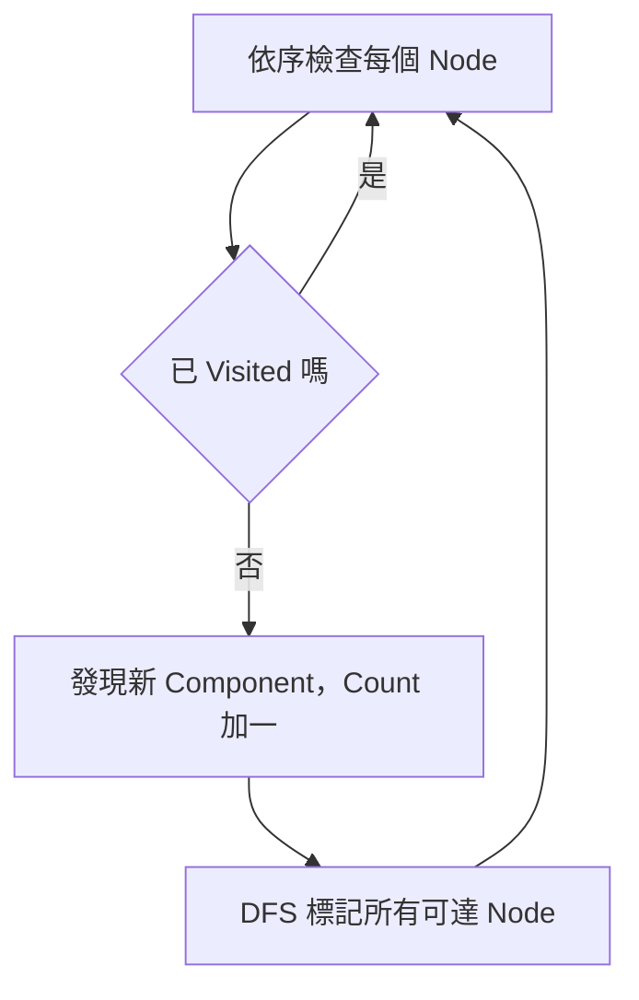

孤立 Node 未被其他 DFS 標記，因此會啟動一次自己的 DFS，正確計為一個 Component。

#### 複雜度

Adjacency List 下：

- 每個 Node 標記一次。
- 每條 Directed Adjacency Entry 檢查一次。
- 時間 O(V + E)。
- 額外空間 O(V)。

### 28.12 隱含 Graph

有些題目不直接提供 Node 與 Edge，而是由規則動態產生 Neighbor。

例如字串改一個字元：

- Node：每個合法字串。
- Edge：兩字串只差一個位置。

數字狀態：

- Node：某個整數 State。
- Edge：可執行加一、減一或乘二。

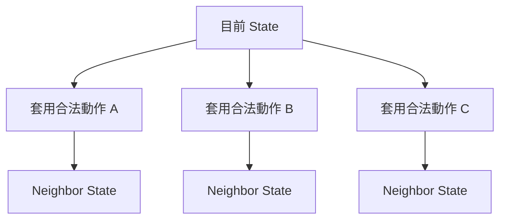

隱含 Graph 不一定要完整建出全部 Edge。BFS 或 DFS 展開 Node 時即時計算 Neighbor，常能降低記憶體需求。

需要定義：

- State 的唯一表示。
- Neighbor 產生規則。
- 合法性檢查。
- Visited Key。
- Search Space 是否有限。

### 28.13 Grid 作為 Graph

Grid 可將每個可走 Cell 視為 Node，相鄰方向視為 Edge。

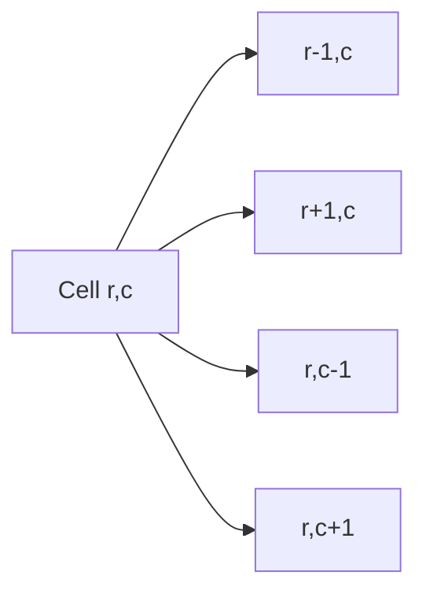

四方向 Neighbor：

```cpp
constexpr int directions[4][2] = {
    {-1, 0},
    {1, 0},
    {0, -1},
    {0, 1}
};
```

每次產生 Neighbor 都要檢查：

```text
0 <= row < rows
0 <= column < columns
Cell 是否可走
是否已訪問
```

若可斜向移動、Wrap-around 或不同地形 Weight，Graph 定義會改變，演算法也可能不同。

### 28.14 Graph 表示方式的選擇

| 需求 | 常見選擇 |
|---|---|
| Sparse Graph，常列出 Neighbor | Adjacency List |
| Dense Graph，常查任意 Edge | Adjacency Matrix |
| 逐 Edge 排序或 Relax | Edge List |
| State 很大但 Neighbor 可即時計算 | 隱含 Graph |
| Complete Binary Tree 類結構 | 可能使用 Array 公式，不必一般 Graph |

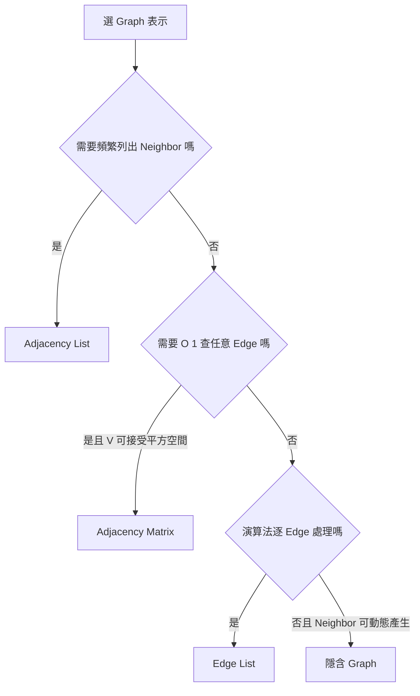

表示方式不會改變抽象 Graph，但會影響時間、空間與程式介面。

### 28.15 正確性與複雜度

Graph 完整走訪通常需要 Visited，否則 Cycle 可能造成重複走訪或無窮迴圈。

#### DFS/BFS Invariant

- 已標記 Node 都屬於已發現區域。
- Stack 或 Queue 保存已發現但尚未完整展開的 Node。
- 未標記 Neighbor 第一次發現時加入容器。

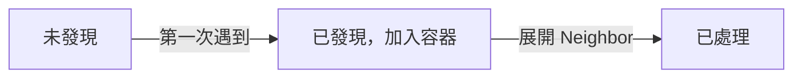

#### 複雜度

Adjacency List：

```text
O(V + E)
```

Adjacency Matrix 完整走訪：

```text
O(V²)
```

空間也要包含 Visited、Stack、Queue、Distance、Parent 等 State。

Undirected Graph 的 Adjacency List 通常包含 2E 個 Entry，但 Big-O 仍為 O(V + E)。

### 28.16 Ownership 與輸入驗證

建圖前要確認：

- Node Index 是否落在合法範圍。
- Weight 型別是否足以保存最大值與 Path Sum。
- 是否允許 Self-loop。
- 是否允許 Parallel Edge。
- Undirected Edge 是否需要去重。
- Graph 是否會在演算法執行期間修改。

如果 Adjacency List 保存 Pointer 或複雜 Edge 物件，還需定義 Ownership。多數演算法題使用 Index，可降低 Node 生命週期管理負擔。

對外部輸入，不能假設所有 Neighbor 都合法。錯誤 Index 會造成越界，錯誤 Weight 可能破壞演算法 Precondition。

### 28.17 C 語言中的 Graph

固定 Node 數且使用 Matrix：

```c
#include <stdbool.h>
#include <stddef.h>

bool add_undirected_edge(
    bool *matrix,
    size_t node_count,
    size_t u,
    size_t v)
{
    if (matrix == NULL ||
        u >= node_count ||
        v >= node_count)
    {
        return false;
    }

    matrix[u * node_count + v] = true;
    matrix[v * node_count + u] = true;
    return true;
}
```

使用 `u * node_count + v` 前，需要確認配置大小乘法沒有 Overflow。

Adjacency List 在 C 中通常需要：

- 每個 Node 一個 Dynamic Array。
- 或以 Edge Array、Head Array、Next Index 建立 Forward Star。
- 或使用 Linked List，但需管理配置與釋放成本。

介面應明確回報配置失敗，避免建出只有部分 Edge 的 Graph 卻被當成完整輸入。

### 28.18 系統化 Debug

建議記錄：

```text
Graph 類型
Node 數 V 與 Edge 數 E
每條輸入 Edge
每個 Node 的 Adjacency List
目前 Node
容器內容
Visited 更新時機
Neighbor 被略過的原因
Component / Distance / Parent State
```

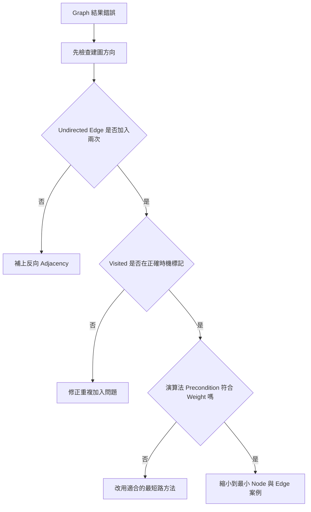

重要測試：

- 0 個 Node。
- 1 個孤立 Node。
- 兩個 Node、沒有 Edge。
- 一條 Directed Edge。
- 一條 Undirected Edge。
- Self-loop。
- Parallel Edge。
- 一個 Cycle。
- 多個 Component。
- Dense Graph。
- 非法 Node Index。
- Weight 為 0、負數或極大值。

### 28.19 常見問題與判讀

| 現象 | 可能原因 | 第一輪檢查 |
|---|---|---|
| Undirected Graph 只能單向到達 | 只加入一個方向 | u 到 v 與 v 到 u 都需加入 |
| Directed Graph 多出反向路徑 | 誤加反向 Edge | 確認輸入方向 |
| BFS 最低成本錯誤 | Weight 不相同 | 普通 BFS 只保證最少 Edge 數 |
| DFS 無法結束 | Cycle 中未使用 Visited | 第一次發現時標記 |
| 同一 Node 重複大量入列 | Visited 標記太晚 | 入列或 Push 時標記 |
| Component 少算孤立 Node | 只從有 Edge 的 Node 開始 | 外層迴圈需檢查所有 Node |
| Matrix 把 0 Weight 當無 Edge | Sentinel 衝突 | 分開保存存在性與 Weight |
| Adjacency List 越界 | Edge Endpoint 非法 | 建圖時驗證 Node Index |
| Directed Component 定義不一致 | 混淆 Weak 與 Strong | 先寫出可達性要求 |
| 複雜度誤寫 O(V+E) | 實際使用 Matrix 掃整列 | Matrix 完整走訪通常 O(V²) |
| 平行 Edge 造成重複處理 | Simple Graph 假設未確認 | 決定是否去重 |
| Grid 漏走或越界 | Direction 或 Boundary 錯誤 | 逐一列出合法 Neighbor |

### 28.20 練習題方向

#### 基礎題

給定 Undirected Edge List，建立 Adjacency List，輸出每個 Node 的 Degree。

#### 變化題

計算 Undirected Graph 的 Connected Component 數量，並輸出每個 Component 的 Node。

#### 綜合題

將 Maze Grid 視為隱含 Unweighted Graph，求起點到終點的最少步數。說明：

- Node 與 Edge 定義。
- Neighbor 產生方式。
- Visited 標記時機。
- 為何 BFS 第一次到達終點即為最少步數。

### 28.21 本章檢查表

- 我能說明 Node 與 Edge 在題目中代表什麼。
- 我能區分 Directed 與 Undirected Graph。
- 我知道 Undirected Adjacency List 通常要加入兩個方向。
- 我能區分 Weighted 與 Unweighted Graph。
- 我知道最少 Edge 數不等於最低 Weight Sum。
- 我能說明 Path、Cycle 與 Reachability。
- 我能定義 Undirected Connected Component。
- 我知道 Directed Graph 還需區分 Weak 與 Strong Connectivity。
- 我能依 V、E 與查詢需求選擇 List、Matrix 或 Edge List。
- 我知道 Adjacency List 完整走訪為 O(V+E)。
- 我知道 Adjacency Matrix 完整走訪通常為 O(V²)。
- 我能說明隱含 Graph 的 State 與 Neighbor 規則。
- 我會在建圖時驗證 Node Index 與 Weight 條件。
- 我會確認 Self-loop 與 Parallel Edge 是否允許。
- 我知道 Graph Traversal 通常需要 Visited。
- 我能以所有 Node 為外層起點計算包含孤立 Node 的 Component。
- 我會把 Stack、Queue、Visited、Distance 等列入空間成本。
- 我能使用最小 Graph 案例檢查方向、Cycle 與 Component。

### 28.22 本章重點

- Graph 由 Node 集合 V 與 Edge 集合 E 構成，解題前應先定義兩者語意。
- Directed Edge 只有一個方向；Undirected Edge 在 Adjacency List 中通常需加入兩個方向。
- Unweighted 最短路通常指最少 Edge 數，Weighted 最短路則考慮 Weight Sum。
- 普通 BFS 的最短性依賴所有 Edge 成本相同。
- Path、Cycle、Reachability 與 Connected Component 是不同 Graph 性質。
- Directed Graph 的連通性需區分 Weakly Connected 與 Strongly Connected。
- Sparse Graph 常適合 Adjacency List，Dense Graph 或頻繁 Edge Query 可考慮 Matrix。
- Edge List 適合逐 Edge 排序或 Relax 的演算法。
- 隱含 Graph 可在走訪時即時計算 Neighbor，不必先建立全部 Edge。
- Grid 是常見隱含 Graph，每個 Cell 的 Neighbor 必須通過邊界與可走性檢查。
- Visited 可避免 Cycle 造成重複走訪，也讓每個 Node 只被發現有限次。
- Adjacency List 的完整 BFS、DFS 通常為 O(V+E)，Matrix 版本通常需 O(V²)。
- Connected Component 計數必須檢查所有 Node，孤立 Node 也構成一個 Component。
- Graph 表示方式、演算法 Precondition、輸入驗證與 State 語意必須保持一致。
