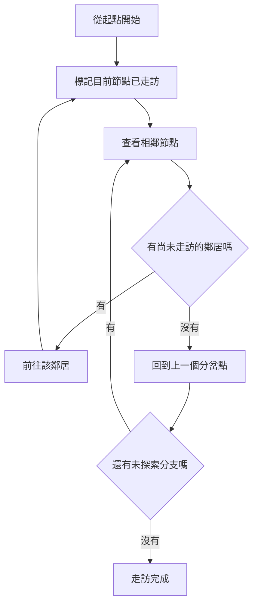
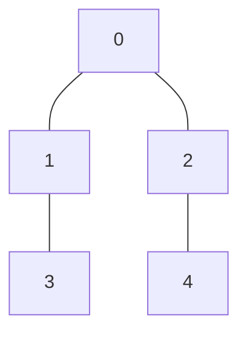
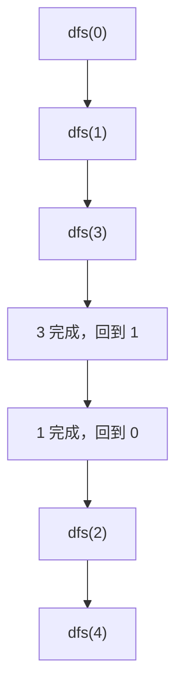
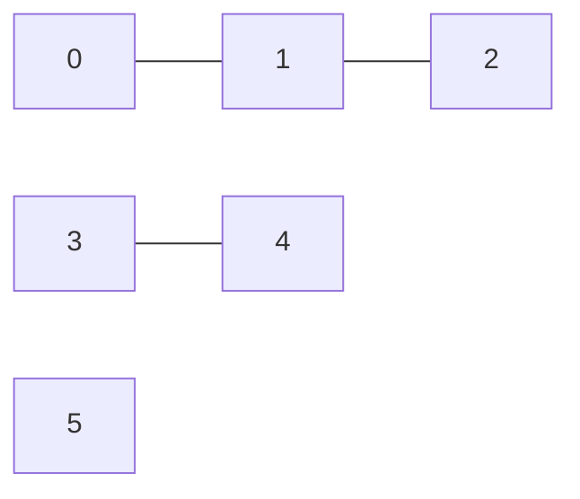
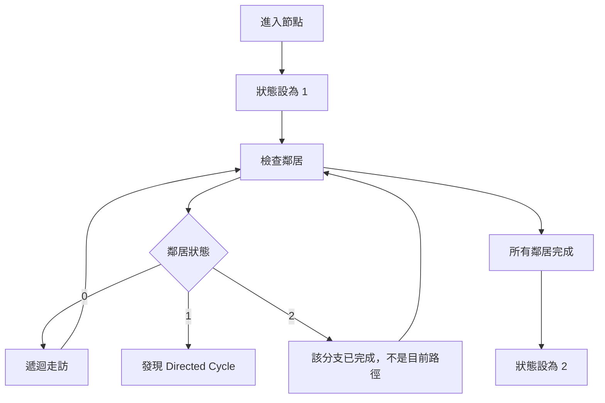
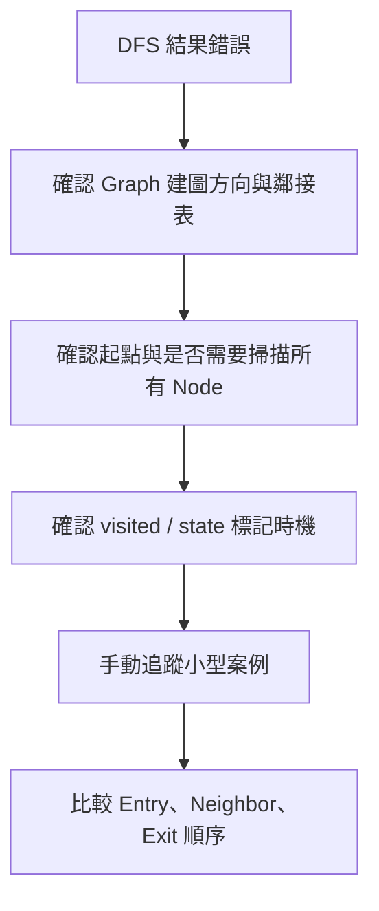

## 第 29 章　Depth-First Search

### 適用範圍

本章說明 Depth-First Search，簡稱 DFS。DFS 是一種走訪 Graph、Tree 或 Grid 的方法。它會先沿著一條路持續往下走，直到不能再走，再回到上一個分岔點，改走其他尚未探索的路。

第一次接觸 DFS 時，常見困難不是不會寫遞迴，而是不清楚：

- DFS 現在走到哪一個節點？
- 為什麼需要 `visited`？
- 走到沒有鄰居時，程式如何回到上一層？
- Recursive DFS 與 Iterative DFS 有什麼差異？
- Graph DFS、Tree DFS 與 Grid DFS 為什麼看起來不一樣？
- Connected Components 與 Cycle Detection 如何從 DFS 延伸？

這些問題通常不是語法問題，而是尚未把走訪過程整理成「目前位置」、「下一步候選」與「哪些位置已經處理過」。原始章節也已用這個方向整理 DFS 的核心困難。citeturn40search1

本章會建立一套固定流程：

- 先將題目整理成節點與連線。
- 使用小型 Graph 手動走一次 DFS。
- 確認是否可能繞回已走過的節點。
- 使用 `visited` 保存已走訪狀態。
- 分別理解 Recursive DFS 與 Iterative DFS。
- 再延伸到 Connected Components、Cycle Detection、Grid DFS、Entry / Exit Time。



### 適用讀者

- 已理解 Array、Stack 與基本 Recursion，但第一次接觸 Graph Traversal 的讀者。
- 能看懂 DFS 程式，卻無法手動追蹤走訪順序的讀者。
- 不清楚 `visited` 為什麼必要的讀者。
- 容易混淆 DFS、Backtracking 與 BFS 的讀者。
- 想理解 Connected Components、Cycle Detection 與 Flood Fill 的讀者。

### 快速導覽

- [29.1 DFS 前到底要分析什麼](#291-dfs-前到底要分析什麼)
- [29.2 先不要寫程式：手動走一次 DFS](#292-先不要寫程式手動走一次-dfs)
- [29.3 Visited State](#293-visited-state)
- [29.4 Recursive DFS](#294-recursive-dfs)
- [29.5 Iterative DFS](#295-iterative-dfs)
- [29.6 Recursive 與 Iterative DFS 的差異](#296-recursive-與-iterative-dfs-的差異)
- [29.7 Connected Components](#297-connected-components)
- [29.8 Undirected Graph Cycle Detection](#298-undirected-graph-cycle-detection)
- [29.9 Directed Graph Cycle Detection](#299-directed-graph-cycle-detection)
- [29.10 Grid DFS 與 Flood Fill](#2910-grid-dfs-與-flood-fill)
- [29.11 Entry 與 Exit Time](#2911-entry-與-exit-time)
- [29.12 DFS、BFS 與 Backtracking 的差異](#2912-dfsbfs-與-backtracking-的差異)
- [29.13 複雜度](#2913-複雜度)
- [29.14 系統化 Debug](#2914-系統化-debug)
- [29.15 常見問題與判讀](#2915-常見問題與判讀)
- [29.16 本章檢查表](#2916-本章檢查表)
- [29.17 本章重點](#2917-本章重點)

### 29.1 DFS 前到底要分析什麼

假設有以下無向 Graph：

```text
0 連到 1、2
1 連到 0、3
2 連到 0、4
3 連到 1
4 連到 2
```

題目要求：從節點 0 開始走訪所有可到達節點。

第一步不是直接寫遞迴，而是先整理問題：

| 分析項目 | 本題內容 |
|---|---|
| 節點 | 0、1、2、3、4 |
| 連線方向 | 無向 |
| 起點 | 0 |
| 輸出 | 所有從 0 可到達的節點 |
| 是否可能繞回原節點 | 會，例如 0 到 1 後可再走回 0 |
| 需要保存的狀態 | 每個節點是否已走訪 |
| 鄰居順序是否固定 | 依 Adjacency List 的儲存順序而定 |

這張表會直接影響程式：

- 因為是無向 Graph，每條 Edge 會在兩個方向出現。
- 因為可能從 0 走到 1，再從 1 走回 0，所以需要 `visited`。
- 因為 DFS 的合法順序可能不只一種，不能只背一組輸出順序。原始章節也用相同範例說明，DFS 前要先整理節點、連線方向、起點、輸出與 `visited` 狀態。citeturn40search1

#### DFS 題目分析表

遇到 DFS 題，可先填：

| 問題 | 要確認的內容 |
|---|---|
| Node 是什麼？ | Graph Node、Tree Node、Grid Cell、State |
| Edge 是什麼？ | Adjacency List、Child、上下左右、狀態轉移 |
| Graph 是有向還是無向？ | 影響 visited、parent、cycle detection |
| 是否可能有 Cycle？ | 有 Cycle 通常需要 visited 或三色狀態 |
| 起點是單一還是多個？ | 單一起點 DFS 或外層掃描所有 Node |
| 輸出是什麼？ | 走訪順序、Component 數量、是否有 Cycle、區域大小 |
| 是否需要回溯狀態？ | 若要列舉所有路徑或排列，可能是 Backtracking |

### 29.2 先不要寫程式：手動走一次 DFS

先畫出 Graph：



假設每個節點都依數字由小到大查看鄰居。

從 0 開始：

1. 到達 0，標記 0 已走訪。
2. 0 的第一個未走訪鄰居是 1，所以前往 1。
3. 到達 1，標記 1 已走訪。
4. 1 的鄰居 0 已走訪，下一個未走訪鄰居是 3。
5. 到達 3，標記 3 已走訪。
6. 3 沒有其他未走訪鄰居，回到 1。
7. 1 沒有其他未走訪鄰居，回到 0。
8. 0 的下一個未走訪鄰居是 2。
9. 到達 2，再前往 4。

走訪順序是：

```text
0, 1, 3, 2, 4
```

原始章節也用這個 Graph 示範 DFS 的走訪順序，並指出 DFS 的「深度優先」是先把目前分支往下走到底，再回頭處理旁邊分支。citeturn40search1

#### 逐輪執行

| 步驟 | 目前節點 | 動作 | visited |
|---|---|---|---|
| 1 | 0 | 標記 0，準備查看鄰居 | {0} |
| 2 | 1 | 從 0 前往 1 | {0, 1} |
| 3 | 3 | 從 1 前往 3 | {0, 1, 3} |
| 4 | 3 | 沒有新鄰居，回到 1 | {0, 1, 3} |
| 5 | 1 | 沒有新鄰居，回到 0 | {0, 1, 3} |
| 6 | 2 | 從 0 前往 2 | {0, 1, 2, 3} |
| 7 | 4 | 從 2 前往 4 | {0, 1, 2, 3, 4} |

#### 為什麼手動追蹤重要

DFS 的程式碼通常很短，但執行過程藏在 Call Stack 或 Stack 容器裡。如果不能手動追蹤，就很容易在 Cycle Detection、Backtracking、Grid DFS 中出錯。

### 29.3 Visited State

`visited` 用來記錄哪些節點已經走訪過。

假設 Graph 中有：

```text
0 --- 1
```

從 0 走到 1 後，1 的鄰居又包含 0。如果沒有 `visited`，流程可能變成：

```text
0 -> 1 -> 0 -> 1 -> 0 -> ...
```

因此在進入節點時，通常要先標記：

```cpp
visited[node] = true;
```

再走訪鄰居：

```cpp
for (int neighbor : graph[node])
{
    if (!visited[neighbor])
    {
        dfs(neighbor);
    }
}
```

原始章節也強調，Graph DFS 通常需要 `visited`，避免重複走訪與無限循環。citeturn40search1

#### 何時標記 visited

Recursive DFS 常在一進入函式時標記。

Iterative DFS 可以在放入 Stack 時標記，也可以在取出 Stack 時標記。若等到取出時才標記，同一節點可能被不同鄰居重複放入 Stack。

本章的 Iterative DFS 會在放入 Stack 時標記，以減少重複加入。

#### visited、state、parent 的差異

| 名稱 | 常見用途 | 代表語意 |
|---|---|---|
| `visited` | 一般 Graph DFS | 是否已走訪過 |
| `state` | Directed Cycle Detection | 0 未走訪、1 走訪中、2 已完成 |
| `parent` | Undirected Cycle Detection | DFS Tree 中上一個節點 |

不要把所有題目都只用 Boolean `visited` 處理。Directed Cycle Detection 通常需要三色狀態。

### 29.4 Recursive DFS

Recursive DFS 使用 Call Stack 保存「走完目前節點後要回到哪裡」。

#### C++ 實作

```cpp
#include <iostream>
#include <vector>

void dfsRecursive(
    const std::vector<std::vector<int>>& graph,
    int node,
    std::vector<bool>& visited)
{
    visited[node] = true;
    std::cout << node << ' ';

    for (int neighbor : graph[node])
    {
        if (!visited[neighbor])
        {
            dfsRecursive(graph, neighbor, visited);
        }
    }
}
```

呼叫方式：

```cpp
std::vector<bool> visited(graph.size(), false);
dfsRecursive(graph, 0, visited);
```

#### 遞迴正在保存什麼

當流程是：

```text
0 -> 1 -> 3
```

Call Stack 會保存：

```text
dfs(0)：仍要繼續查看 0 的其他鄰居
dfs(1)：仍要繼續查看 1 的其他鄰居
dfs(3)：目前正在處理
```

3 處理完成後，函式返回 1；1 處理完成後，再返回 0。



原始章節也用 Call Stack 說明 Recursive DFS 如何回到上一層。citeturn40search1

#### Recursive DFS 的風險

如果 Graph 很深，例如一條長鏈：

```text
0 -> 1 -> 2 -> 3 -> ... -> n-1
```

遞迴深度可能是 O(n)，輸入很大時可能 Stack Overflow。若題目資料量很大，可考慮 Iterative DFS。

### 29.5 Iterative DFS

Iterative DFS 不依賴函式遞迴，而是自己建立 Stack。Stack 保存接下來要處理的節點。

#### C++ 實作

```cpp
#include <iostream>
#include <stack>
#include <vector>

void dfsIterative(
    const std::vector<std::vector<int>>& graph,
    int start)
{
    std::vector<bool> visited(graph.size(), false);
    std::stack<int> pending;

    pending.push(start);
    visited[start] = true;

    while (!pending.empty())
    {
        int node = pending.top();
        pending.pop();

        std::cout << node << ' ';

        // 反向加入，讓較小的鄰居較早被處理。
        for (int i = static_cast<int>(graph[node].size()) - 1;
             i >= 0;
             --i)
        {
            int neighbor = graph[node][i];

            if (!visited[neighbor])
            {
                visited[neighbor] = true;
                pending.push(neighbor);
            }
        }
    }
}
```

#### 為什麼反向加入鄰居

Stack 是 Last In, First Out。若希望較小的鄰居先被取出，就要先把較大的鄰居放入 Stack，再放較小的鄰居。

若不在乎特定走訪順序，也可以直接依原順序加入。DFS 的正確性通常不要求唯一順序。原始章節也提醒，鄰居處理順序會影響 DFS 輸出順序，但合法 DFS 順序可能不只一種。citeturn40search1

#### 取出時才標記的版本

有些 Iterative DFS 會在 pop 時才標記：

```cpp
while (!pending.empty())
{
    int node = pending.top();
    pending.pop();

    if (visited[node])
    {
        continue;
    }

    visited[node] = true;

    for (int neighbor : graph[node])
    {
        pending.push(neighbor);
    }
}
```

這種寫法簡單，但同一 Node 可能被 push 多次。是否可接受，取決於題目需求與效能考量。

### 29.6 Recursive 與 Iterative DFS 的差異

| 項目 | Recursive DFS | Iterative DFS |
|---|---|---|
| 回程資訊 | Call Stack | 自行建立的 Stack |
| 程式長度 | 通常較短 | 通常較長 |
| 深度過大風險 | 可能 Stack Overflow | 可使用 Heap Memory 上的容器 |
| 走訪順序控制 | 由鄰居遞迴順序決定 | 由放入 Stack 的順序決定 |
| 適合情況 | 深度可控、結構清楚 | 深度很大或需明確控制 Stack |

兩種版本的核心相同：

- 記錄已走訪節點。
- 沿著一條分支持續往下。
- 沒有新鄰居時回到之前的分岔點。

原始章節也用表格比較了 Recursive 與 Iterative DFS。citeturn40search1

#### 如何選擇

- Tree 深度小、邏輯偏 Postorder：Recursive DFS 通常更清楚。
- Graph 可能非常深：Iterative DFS 較安全。
- 需要精準模擬 Entry / Exit：Recursive 較自然；Iterative 也可以，但要額外保存狀態。
- 線上評測容易 Stack Overflow：可改 Iterative DFS。

### 29.7 Connected Components

Connected Component 是無向 Graph 中彼此可互相到達的一組節點。



這個 Graph 有三個 Connected Components：

```text
{0, 1, 2}
{3, 4}
{5}
```

#### 解題想法

從未走訪節點啟動一次 DFS，該次 DFS 會走完整個 Component。

所以：

```text
啟動 DFS 的次數 = Connected Components 數量
```

#### C++ 實作

```cpp
#include <vector>

void markComponent(
    const std::vector<std::vector<int>>& graph,
    int node,
    std::vector<bool>& visited)
{
    visited[node] = true;

    for (int neighbor : graph[node])
    {
        if (!visited[neighbor])
        {
            markComponent(graph, neighbor, visited);
        }
    }
}

int countComponents(const std::vector<std::vector<int>>& graph)
{
    std::vector<bool> visited(graph.size(), false);
    int components = 0;

    for (int node = 0;
         node < static_cast<int>(graph.size());
         ++node)
    {
        if (!visited[node])
        {
            ++components;
            markComponent(graph, node, visited);
        }
    }

    return components;
}
```

不能只從節點 0 做一次 DFS，因為 Graph 可能不連通。原始章節也強調這點。citeturn40search1

### 29.8 Undirected Graph Cycle Detection

在無向 Graph 中，鄰居包含上一個節點。若只看到「鄰居已走訪」就判定有 Cycle，會把返回 Parent 的 Edge 誤認為 Cycle。

因此 DFS 需要額外保存 `parent`。

判斷方式：

- 鄰居未走訪，繼續 DFS。
- 鄰居已走訪，而且鄰居不是 Parent，表示發現 Cycle。

```cpp
bool hasCycleUndirected(
    const std::vector<std::vector<int>>& graph,
    int node,
    int parent,
    std::vector<bool>& visited)
{
    visited[node] = true;

    for (int neighbor : graph[node])
    {
        if (!visited[neighbor])
        {
            if (hasCycleUndirected(graph, neighbor, node, visited))
            {
                return true;
            }
        }
        else if (neighbor != parent)
        {
            return true;
        }
    }

    return false;
}
```

若 Graph 不保證連通，要從每個尚未走訪節點啟動檢查。

```cpp
bool containsCycleUndirected(
    const std::vector<std::vector<int>>& graph)
{
    std::vector<bool> visited(graph.size(), false);

    for (int node = 0;
         node < static_cast<int>(graph.size());
         ++node)
    {
        if (!visited[node] &&
            hasCycleUndirected(graph, node, -1, visited))
        {
            return true;
        }
    }

    return false;
}
```

原始章節也指出，無向 Graph 判斷 Cycle 時需要排除返回 Parent 的 Edge。citeturn40search1

#### Parallel Edge 與 Self-loop

如果輸入允許 Parallel Edge 或 Self-loop，Cycle 定義要依題目確認：

- Self-loop `u -> u` 通常可視為 Cycle。
- 無向 Graph 中兩條平行 Edge 可能形成長度 2 的 Cycle。

一般面試題常假設 Simple Graph，但正式實作前應確認。

### 29.9 Directed Graph Cycle Detection

Directed Graph 不能只用單一 `visited` 判斷 Cycle。

原因是走到一個「以前處理完成」的節點，不一定表示形成 Cycle。只有回到目前這條 DFS 路徑中的節點，才表示產生 Directed Cycle。

可以使用三種狀態：

| 狀態 | 意思 |
|---|---|
| 0 | 尚未走訪 |
| 1 | 正在目前 DFS 路徑中 |
| 2 | 該節點與後續分支已處理完成 |



#### C++ 實作

```cpp
bool hasCycleDirected(
    const std::vector<std::vector<int>>& graph,
    int node,
    std::vector<int>& state)
{
    state[node] = 1;

    for (int neighbor : graph[node])
    {
        if (state[neighbor] == 1)
        {
            return true;
        }

        if (state[neighbor] == 0 &&
            hasCycleDirected(graph, neighbor, state))
        {
            return true;
        }
    }

    state[node] = 2;
    return false;
}
```

外層：

```cpp
bool containsCycleDirected(
    const std::vector<std::vector<int>>& graph)
{
    std::vector<int> state(graph.size(), 0);

    for (int node = 0;
         node < static_cast<int>(graph.size());
         ++node)
    {
        if (state[node] == 0 &&
            hasCycleDirected(graph, node, state))
        {
            return true;
        }
    }

    return false;
}
```

原始章節也以三色狀態說明 Directed Graph Cycle Detection，並指出只有回到目前 DFS 路徑中的節點才是 Directed Cycle。citeturn40search1

### 29.10 Grid DFS 與 Flood Fill

二維 Grid 也可以視為 Graph：

- 每一格是一個節點。
- 上、下、左、右相鄰格是 Edge。

例如計算島嶼數量時：

- `'1'` 表示陸地。
- `'0'` 表示水。
- 從一格尚未走訪的陸地啟動 DFS，可以標記整座島。

#### 四個方向

```cpp
const int directions[4][2] = {
    {-1, 0},
    {1, 0},
    {0, -1},
    {0, 1}
};
```

#### Grid DFS

```cpp
void floodFill(
    const std::vector<std::vector<char>>& grid,
    int row,
    int col,
    std::vector<std::vector<bool>>& visited)
{
    int rows = static_cast<int>(grid.size());
    int cols = static_cast<int>(grid[0].size());

    if (row < 0 || row >= rows ||
        col < 0 || col >= cols ||
        grid[row][col] == '0' ||
        visited[row][col])
    {
        return;
    }

    visited[row][col] = true;

    floodFill(grid, row - 1, col, visited);
    floodFill(grid, row + 1, col, visited);
    floodFill(grid, row, col - 1, visited);
    floodFill(grid, row, col + 1, visited);
}
```

#### Grid DFS 的固定檢查順序

每次進入一格時，先確認：

1. Row 是否越界。
2. Column 是否越界。
3. 是否為可以走的格子。
4. 是否已走訪。

需先檢查邊界，再讀取 `grid[row][col]`，避免越界。原始章節也明確列出這個固定檢查順序。citeturn40search1

#### 空 Grid

如果 `grid.empty()`，不能讀 `grid[0].size()`。正式寫法應先處理：

```cpp
if (grid.empty() || grid[0].empty())
{
    return 0;
}
```

### 29.11 Entry 與 Exit Time

Recursive DFS 對每個節點有兩個重要時機：

- Entry：剛進入節點時。
- Exit：所有鄰居都處理完成，即將返回時。

```cpp
void dfs(int node)
{
    visited[node] = true;
    // Entry

    for (int neighbor : graph[node])
    {
        if (!visited[neighbor])
        {
            dfs(neighbor);
        }
    }

    // Exit
}
```

Entry 適合處理「第一次看到節點」的工作。

Exit 適合處理「所有子分支都完成後」的工作，例如：

- Tree 的 Postorder 計算。
- Directed Graph 的完成順序。
- Topological Sort 的 DFS 寫法。
- Subtree aggregation。

原始章節也提醒，不要只記錄程式位置，而要確認題目需要在進入時處理，還是在所有子問題完成後處理。citeturn40search1

### 29.12 DFS、BFS 與 Backtracking 的差異

DFS、BFS、Backtracking 都可能使用「走訪」概念，但目的不同。

| 方法 | 核心 | 常見用途 |
|---|---|---|
| DFS | 沿分支深入再回頭 | Component、Cycle、Tree Traversal、Flood Fill |
| BFS | 依層擴張 | Unweighted Shortest Path、Layer、最少步數 |
| Backtracking | 嘗試選擇，遞迴後撤銷 | 列舉排列、組合、所有方案 |

#### DFS vs BFS

DFS 不保證最少 Edge 數。若題目要求 Unweighted Graph 的最短步數，BFS 通常更合適。

#### DFS vs Backtracking

Backtracking 通常會在離開分支時還原狀態：

```cpp
path.push_back(x);
backtrack(...);
path.pop_back();
```

一般 Graph DFS 的 `visited` 通常不會在返回時取消，因為目標是避免重複走訪整個 Graph。

若題目要求「列出所有路徑」，則可能不能用全域 visited 直接禁止再次進入，需要依問題規格設計 path state。

### 29.13 複雜度

使用 Adjacency List 時：

```text
時間：O(V + E)
```

原因：

- 每個 Vertex 最多被標記一次。
- 每條 Edge 在走訪鄰接表時被檢查固定次數。
- 無向 Graph 中一條 Edge 通常在 Adjacency List 中出現兩次，但仍是 O(E)。

空間：

```text
visited: O(V)
recursive call stack 或 explicit stack: O(V) 最差
Graph 儲存: O(V + E)
```

Grid DFS 若 Grid 大小為 `rows x cols`：

```text
時間：O(rows * cols)
空間：visited O(rows * cols)，遞迴深度最差 O(rows * cols)
```

原始章節也指出，使用 Adjacency List 時，DFS 的時間複雜度是 O(V + E)，額外空間與 `visited`、Stack 或最大遞迴深度有關。citeturn40search1

### 29.14 系統化 Debug

DFS Debug 建議逐步記錄：

```text
目前 node
parent 或 caller
visited / state
正在檢查哪個 neighbor
為什麼略過 neighbor
何時進入 node
何時離開 node
stack 或 call stack 狀態
```

#### Recursive DFS Debug 輸出

```cpp
void dfsDebug(
    const std::vector<std::vector<int>>& graph,
    int node,
    std::vector<bool>& visited,
    int depth)
{
    std::cerr << std::string(depth * 2, ' ')
              << "enter " << node << '\n';

    visited[node] = true;

    for (int neighbor : graph[node])
    {
        std::cerr << std::string(depth * 2, ' ')
                  << "check " << node << " -> " << neighbor << '\n';

        if (!visited[neighbor])
        {
            dfsDebug(graph, neighbor, visited, depth + 1);
        }
    }

    std::cerr << std::string(depth * 2, ' ')
              << "exit " << node << '\n';
}
```

#### Debug 流程



### 29.15 常見問題與判讀

原始章節已整理常見問題，例如 DFS 無限循環、同一節點輸出多次、只走到部分節點、Iterative 與 Recursive 順序不同、無向 Graph 誤判 Cycle、有向 Graph 漏判或誤判 Cycle、Grid 讀取越界、輸入很深時崩潰等。citeturn40search1

| 現象 | 可能原因 | 第一輪檢查 |
|---|---|---|
| DFS 無限循環 | Graph 有環但未使用 `visited` | 進入節點時先標記 |
| 同一節點輸出多次 | 太晚標記 `visited` | 確認是在加入待處理集合時或進入節點時標記 |
| 只走到部分節點 | Graph 不連通，但只從單一起點 DFS | 外層掃描所有節點 |
| Iterative 與 Recursive 順序不同 | Stack 放入鄰居的順序不同 | 若要相同順序，反向 push 鄰居 |
| 無向 Graph 誤判 Cycle | 把返回 Parent 的 Edge 當成環 | 額外保存 `parent` |
| 有向 Graph 漏判或誤判 Cycle | 只使用單一 Boolean `visited` | 使用未走訪、走訪中、已完成三種狀態 |
| Grid 讀取越界 | 先讀格子再檢查 Row、Column | 先做邊界判斷 |
| 輸入很深時崩潰 | Recursive DFS 深度過大 | 改用 Iterative DFS |
| Topological DFS 順序反了 | 忘記處理 Exit / Postorder | Exit 時 push，最後 reverse |
| 列舉所有路徑少答案 | 全域 visited 過度限制 | 改用 path-level state，依題意還原 |

### 29.16 本章檢查表

- 我能說明 DFS 為什麼叫 Depth-First Search。
- 我能用小型 Graph 手動追蹤 DFS。
- 我知道 Graph 中通常需要 `visited`。
- 我能說明 Recursive DFS 如何利用 Call Stack 回到上一層。
- 我能使用明確 Stack 寫出 Iterative DFS。
- 我知道 DFS 走訪順序可能不唯一。
- 我知道 Iterative DFS 的輸出順序受 push 順序影響。
- 我能計算無向 Graph 的 Connected Components。
- 我能使用 Parent 判斷無向 Graph Cycle。
- 我能用三種 State 判斷有向 Graph Cycle。
- 我能將 Grid 視為節點與相鄰關係。
- 我會先檢查 Grid 邊界，再讀取格子內容。
- 我能區分 DFS 的 Entry 與 Exit 時機。
- 我知道 DFS、BFS 與 Backtracking 的差異。
- 我知道時間複雜度要包含所有 Vertex 與 Edge。
- 我知道 Recursive DFS 在深輸入時可能 Stack Overflow。

### 29.17 本章重點

- DFS 會先沿著一條分支持續往下，再回頭探索其他分支。
- Graph DFS 通常需要 `visited`，避免重複走訪與無限循環。
- Recursive DFS 使用 Call Stack 保存回程資訊。
- Iterative DFS 使用明確的 Stack 保存待處理節點。
- 鄰居處理順序會影響 DFS 輸出順序，但合法 DFS 順序可能不只一種。
- 從每個未走訪節點啟動 DFS，可以計算 Connected Components。
- 無向 Graph 判斷 Cycle 時，需要排除返回 Parent 的 Edge。
- 有向 Graph 判斷 Cycle 時，需要區分走訪中與已完成節點。
- Grid DFS 會把每一格視為節點，把相鄰方向視為 Edge。
- Entry 表示第一次進入節點，Exit 表示所有後續分支都已完成。
- 使用 Adjacency List 時，DFS 的時間複雜度是 O(V + E)。
- DFS 的額外空間與 `visited`、Stack 或最大遞迴深度有關。
