## 第 30 章　Breadth-First Search

### 適用範圍

本章介紹 Breadth-First Search，簡稱 BFS，包括 Queue、Layer、無權最短路徑、Distance Array、Parent Array、Multi-source BFS、Grid BFS、State-space BFS 與 Bidirectional BFS。

BFS 的核心不是單純把 Node 放進 Queue，而是利用 FIFO 順序，讓距離較小的狀態先被處理。在所有 Edge 成本相同時，BFS 第一次發現某個 Node，就已找到從 Source 到該 Node 的最少 Edge 數。

真正需要先確認的是：

- Node 與 Edge 分別代表什麼。
- 每一步移動的成本是否相同。
- Queue Element 保存 Node、Distance，還是完整 State。
- Visited 應在入列時還是出列時標記。
- 要求的是 Reachability、Distance、實際 Path，還是每一層內容。
- 是否有多個 Source。
- Graph 是明確提供，還是由 Grid、字串、密碼鎖等規則隱含產生。

本章會建立一套固定流程：

1. 定義 State 與 Neighbor。
2. 確認每條 Edge 成本相同。
3. 初始化 Source 的 Distance 與 Queue。
4. 在第一次入列時標記已發現。
5. 由 `distance[next] = distance[node] + 1` 建立下一層。
6. 若需還原 Path，同時保存 Parent。
7. Multi-source BFS 將所有 Source 一起放入 Layer 0。
8. 以 O(V + E) 或 State-space 規模分析成本。

### 適用讀者

- 知道 BFS 使用 Queue，但不理解 Layer 與最短性理由的讀者。
- 在出列後才標記 Visited，造成大量重複入列的讀者。
- 需要計算無權 Graph 最短距離或實際 Path 的讀者。
- 需要同時從多個起點向外擴張的讀者。
- 想將 Grid、字串轉換或遊戲狀態建模成 BFS 的讀者。
- 容易把 Weighted Shortest Path 直接交給普通 BFS 的讀者。
- 想理解 Bidirectional BFS 何時可能降低搜尋空間的讀者。

### 快速導覽

- [BFS 到底保證什麼](#301-bfs-到底保證什麼)
- [Queue 與 Layer](#302-queue-與-layer)
- [第一步：定義 State 與 Neighbor](#303-第一步定義-state-與-neighbor)
- [完整案例：無權 Graph Distance](#304-完整案例無權-graph-distance)
- [為何第一次發現就是最短](#305-為何第一次發現就是最短)
- [Visited 標記時機](#306-visited-標記時機)
- [Parent Array 與 Path 還原](#307-parent-array-與-path-還原)
- [Level-order 與逐層處理](#308-level-order-與逐層處理)
- [Multi-source BFS](#309-multi-source-bfs)
- [完整案例：最近 Source 距離](#3010-完整案例最近-source-距離)
- [Grid BFS](#3011-grid-bfs)
- [完整案例：Maze 最少步數](#3012-完整案例maze-最少步數)
- [State-space BFS](#3013-state-space-bfs)
- [Bidirectional BFS](#3014-bidirectional-bfs)
- [不適用普通 BFS 的情況](#3015-不適用普通-bfs-的情況)
- [正確性、終止性與複雜度](#3016-正確性終止性與複雜度)
- [C 語言中的 BFS](#3017-c-語言中的-bfs)
- [系統化 Debug](#3018-系統化-debug)
- [常見問題與判讀](#3019-常見問題與判讀)
- [練習題方向](#3020-練習題方向)
- [本章檢查表](#3021-本章檢查表)
- [本章重點](#3022-本章重點)

### 30.1 BFS 到底保證什麼

在所有 Edge 成本相同的 Graph 中，BFS 依照最少 Edge 數由近到遠擴張。

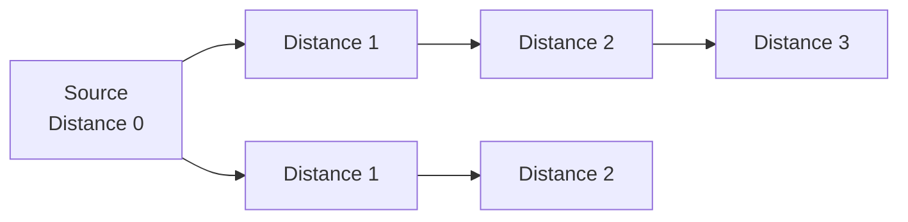

BFS 可以解決：

- 從 Source 可到達哪些 Node。
- Source 到每個 Node 的最少 Edge 數。
- 任意一條最短 Path。
- 每個 Depth Layer 的 Node。
- 多個 Source 到其他 Node 的最近距離。

普通 BFS 不保證一般 Weighted Graph 的最低 Weight Sum。若 Edge Weight 不同，較少 Edge 不代表成本較低。

### 30.2 Queue 與 Layer

Queue 是 FIFO。較早發現的 Node 先被展開，因此 Distance 較小的 Layer 不會被較大的 Layer 越過。

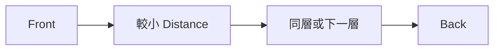

典型 BFS State：

- Queue：已發現但 Neighbor 尚未全部展開的 Node。
- Distance：Source 到 Node 的最少 Edge 數。
- Visited：是否已經第一次發現。
- Parent：最短 Path 中的前一個 Node。

Distance Array 可同時扮演 Visited：

```text
distance[node] == -1  尚未發現
distance[node] >= 0   已發現
```

### 30.3 第一步：定義 State 與 Neighbor

Graph BFS 的 State 通常是 Node Index。隱含 Graph 的 State 可能是：

- Grid 座標 `(row, column)`。
- 字串。
- 密碼鎖四位數。
- 棋盤與棋子位置。
- 多個欄位組成的 Struct。

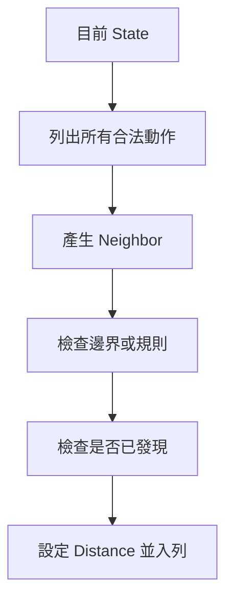

應先回答：

1. 如何唯一表示 State？
2. 如何產生 Neighbor？
3. 哪些 Neighbor 合法？
4. 每次轉移成本是否相同？
5. Search Space 是否有限？
6. Visited Key 是否完整包含影響未來移動的 State？

若不同狀態被錯誤使用相同 Visited Key，BFS 可能不當合併候選而漏解。

### 30.4 完整案例：無權 Graph Distance

```cpp
#include <queue>
#include <vector>

std::vector<int> bfsDistances(
    const std::vector<std::vector<int>>& graph,
    int source)
{
    std::vector<int> distance(graph.size(), -1);

    if (source < 0 ||
        source >= static_cast<int>(graph.size()))
    {
        return distance;
    }

    std::queue<int> pending;
    distance[source] = 0;
    pending.push(source);

    while (!pending.empty())
    {
        const int node = pending.front();
        pending.pop();

        for (int next : graph[node])
        {
            if (distance[next] != -1)
            {
                continue;
            }

            distance[next] = distance[node] + 1;
            pending.push(next);
        }
    }

    return distance;
}
```

#### Precondition

- Adjacency List 中每個 Neighbor Index 合法。
- 每條 Edge 成本相同。

#### Loop Invariant

每輪開始前：

1. Queue 中 Node 全部已發現，但尚未完整展開。
2. 已發現 Node 的 Distance 已是最少 Edge 數。
3. Queue 由 Front 到 Back 的 Distance 非遞減。
4. `distance == -1` 的 Node 尚未發現。

#### 範例

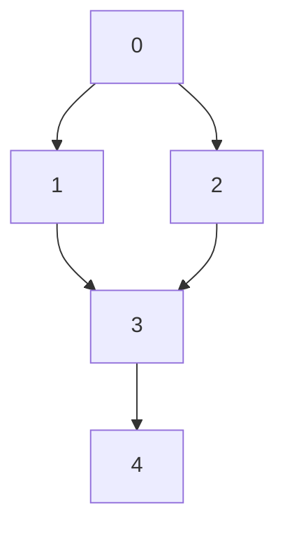

從 0 開始：

```text
distance = [0, 1, 1, 2, 3]
```

Node 3 可由 1 或 2 發現，但只需第一次入列。

### 30.5 為何第一次發現就是最短

假設 Queue 正在展開 Distance d 的 Node。它的未發現 Neighbor 會被設定為 d + 1。

因為 Queue 按 Distance 非遞減處理：

- 所有 Distance 小於 d 的 Node 已處理。
- Queue 中不會有更大的 Layer 越過 d 或 d + 1。
- 如果 Neighbor 存在更短 Path，它應該早已由更小 Distance 的 Node 發現。

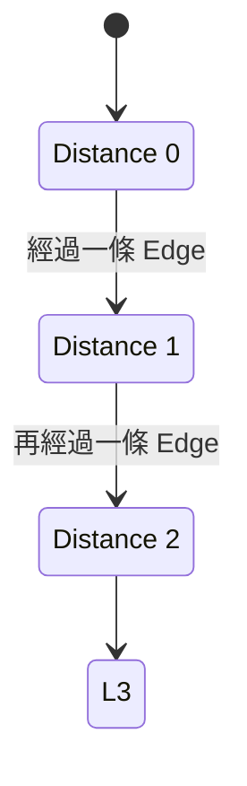

所以第一次發現即可確定最少 Edge 數，不需要像 Dijkstra 那樣反覆改善 Distance。

### 30.6 Visited 標記時機

應在第一次入列時標記，而不是等出列後才標記。

錯誤時機可能讓同一 Node 被多個 Parent 重複加入：

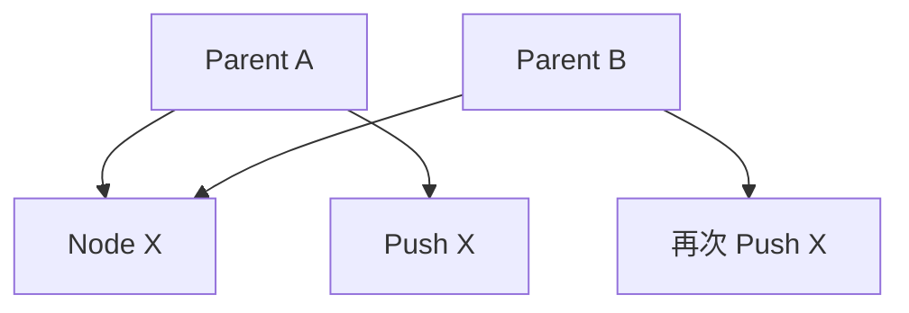

正確流程：

```cpp
distance[next] = distance[node] + 1;
pending.push(next);
```

先設定 Distance，再 Push。後續 Parent 看到 `distance[next] != -1` 便會略過。

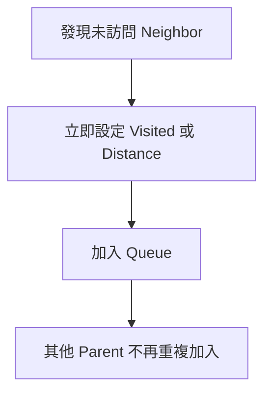

某些問題允許同一 Node 以不同 State 重訪，例如不同剩餘資源。此時 Visited 不能只用 Node Index，而要包含完整 State。

### 30.7 Parent Array 與 Path 還原

如果只需 Distance，不必保存完整 Path。若要輸出 Path，可在第一次發現 Neighbor 時保存 Parent：

```cpp
parent[next] = node;
```

從 Target 反向走回 Source：

```cpp
#include <algorithm>

std::vector<int> restorePath(
    int source,
    int target,
    const std::vector<int>& parent)
{
    std::vector<int> path;

    for (int node = target;
         node != -1;
         node = parent[node])
    {
        path.push_back(node);

        if (node == source)
        {
            break;
        }
    }

    if (path.empty() || path.back() != source)
    {
        return {};
    }

    std::reverse(path.begin(), path.end());
    return path;
}
```

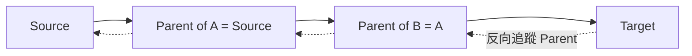

若存在多條最短 Path，Parent 記錄其中一條。要列出全部最短 Path，需要保存多個合法 Parent 或建立最短路 DAG。

### 30.8 Level-order 與逐層處理

若每層需要分開處理，可在層開始時固定 Queue Size：

```cpp
while (!pending.empty())
{
    const int layerSize =
        static_cast<int>(pending.size());

    for (int i = 0; i < layerSize; ++i)
    {
        int node = pending.front();
        pending.pop();
        // 展開 node
    }
}
```

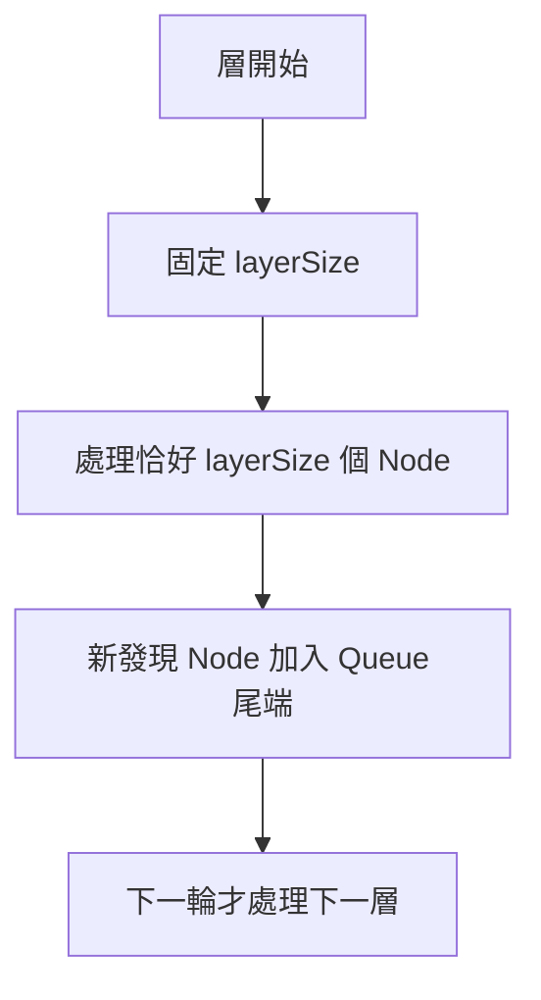

不能直接在 `for` 條件中使用持續變化的 Queue Size，否則新加入的下一層 Node 可能混入目前層。

如果只需要 Distance Array，通常不必顯式分層，`distance[next] = distance[node] + 1` 已保存 Layer。

### 30.9 Multi-source BFS

Multi-source BFS 將所有 Source 同時放入 Distance 0。

```cpp
std::queue<int> pending;
std::vector<int> distance(graph.size(), -1);

for (int source : sources)
{
    if (distance[source] != -1)
    {
        continue;
    }

    distance[source] = 0;
    pending.push(source);
}
```

後續流程和單一 Source BFS 相同。

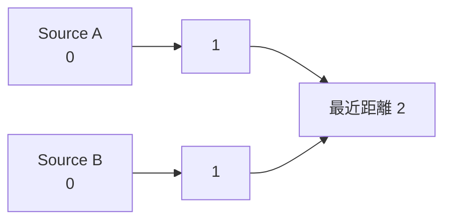

可以把所有 Source 想像成由一個 Super Source 以 0 成本連接，但普通 BFS 的實作直接把它們同時初始化即可。

### 30.10 完整案例：最近 Source 距離

```cpp
std::vector<int> nearestSourceDistances(
    const std::vector<std::vector<int>>& graph,
    const std::vector<int>& sources)
{
    std::vector<int> distance(graph.size(), -1);
    std::queue<int> pending;

    for (int source : sources)
    {
        if (source < 0 ||
            source >= static_cast<int>(graph.size()) ||
            distance[source] != -1)
        {
            continue;
        }

        distance[source] = 0;
        pending.push(source);
    }

    while (!pending.empty())
    {
        const int node = pending.front();
        pending.pop();

        for (int next : graph[node])
        {
            if (distance[next] != -1)
            {
                continue;
            }

            distance[next] = distance[node] + 1;
            pending.push(next);
        }
    }

    return distance;
}
```

第一次發現 Node 的 Source 提供到 Source 集合的最短距離。如果要求知道最近的是哪個 Source，可另外保存 `owner[next] = owner[node]`。距離相同時的 Tie-breaking Policy 需另行定義。

### 30.11 Grid BFS

Grid BFS 將每個可走 Cell 視為 Node，合法移動視為 Edge。

```cpp
constexpr int directions[4][2] = {
    {-1, 0},
    {1, 0},
    {0, -1},
    {0, 1}
};
```

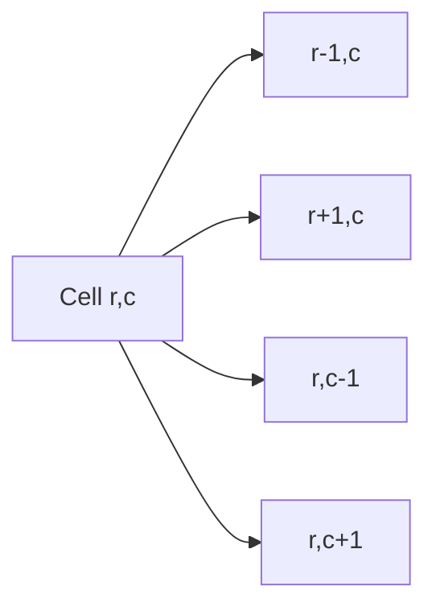

每個 Neighbor 需檢查：

- Row 邊界。
- Column 邊界。
- 是否為障礙。
- 是否已訪問。

可將 `(row, column)` 編碼成 Pair，也可扁平化為：

```text
index = row * columns + column
```

乘法與 Index 範圍都需安全。

### 30.12 完整案例：Maze 最少步數

Grid 中 `0` 可走、`1` 為障礙，求 Start 到 Target 的最少四方向步數。

```cpp
#include <array>

int shortestMazePath(
    const std::vector<std::vector<int>>& grid,
    int startRow,
    int startColumn,
    int targetRow,
    int targetColumn)
{
    const int rows = static_cast<int>(grid.size());

    if (rows == 0)
    {
        return -1;
    }

    const int columns = static_cast<int>(grid[0].size());

    auto valid = [&](int row, int column)
    {
        return row >= 0 && row < rows &&
               column >= 0 && column < columns &&
               grid[row][column] == 0;
    };

    if (!valid(startRow, startColumn) ||
        !valid(targetRow, targetColumn))
    {
        return -1;
    }

    std::vector<std::vector<int>> distance(
        rows,
        std::vector<int>(columns, -1));

    std::queue<std::pair<int, int>> pending;
    distance[startRow][startColumn] = 0;
    pending.push({startRow, startColumn});

    constexpr int directions[4][2] = {
        {-1, 0}, {1, 0}, {0, -1}, {0, 1}
    };

    while (!pending.empty())
    {
        const auto [row, column] = pending.front();
        pending.pop();

        if (row == targetRow && column == targetColumn)
        {
            return distance[row][column];
        }

        for (const auto& direction : directions)
        {
            const int nextRow = row + direction[0];
            const int nextColumn = column + direction[1];

            if (!valid(nextRow, nextColumn) ||
                distance[nextRow][nextColumn] != -1)
            {
                continue;
            }

            distance[nextRow][nextColumn] =
                distance[row][column] + 1;
            pending.push({nextRow, nextColumn});
        }
    }

    return -1;
}
```

#### 輸入形狀

此版本假設每列 Column 數相同。若 Grid 可能不規則，必須對每列分別檢查長度。

#### 提早結束

Target 第一次出列時，Distance 已是最少步數。也可在第一次發現 Target 時回傳，因為 Distance 已確定，但整段程式應統一採用同一時機。

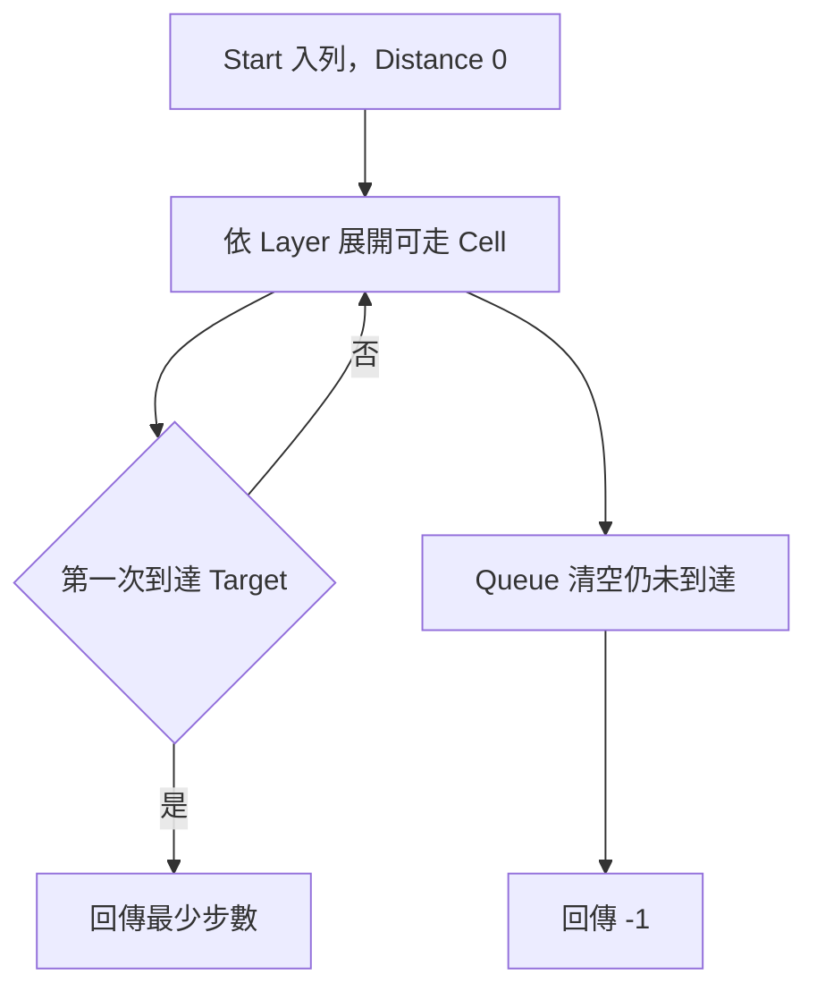

### 30.13 State-space BFS

State-space BFS 的 Graph 可能非常大，甚至不明確建立。

例如密碼鎖：

- State：四位數字。
- Neighbor：任一位加一或減一。
- Forbidden State：不可進入。
- Source：初始組合。
- Target：目標組合。

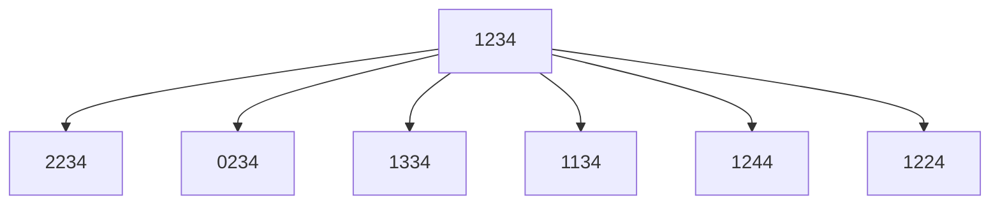

Visited 必須使用完整 State。若狀態包含位置與剩餘消除障礙次數：

```text
(row, column, remainingPower)
```

只用 `(row, column)` 標記會錯誤合併未來能力不同的狀態。

State-space BFS 的複雜度以可達 State 數 S 與每個 State 的分支數 B 表示，不能只套用原 Graph 的 V、E。

### 30.14 Bidirectional BFS

若有單一 Source、單一 Target，且能從兩邊產生 Neighbor，可同時由兩端搜尋。

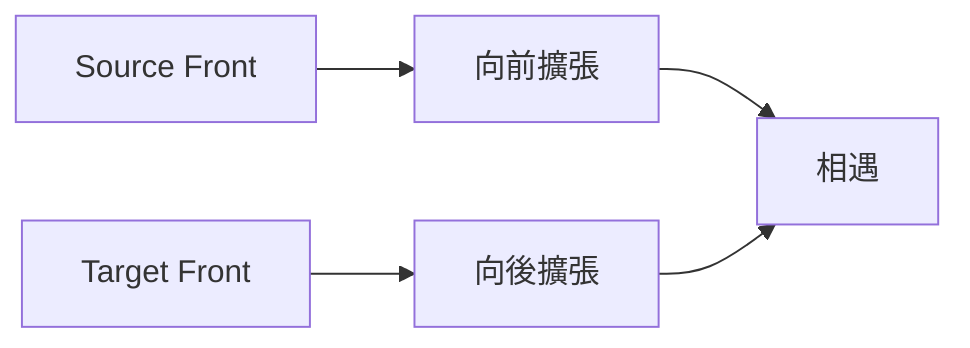

在分支數約 b、最短距離 d 時，單向 BFS 搜尋規模近似 `b^d`，雙向理想上接近兩個 `b^(d/2)` Front。

實作重點：

- 保存兩側 Distance 或 Visited。
- 通常每輪擴張較小的 Frontier。
- 發現兩側共同 State 時組合距離。
- Directed Graph 必須能正確產生反向 Edge。
- Path 還原需要保存兩側 Parent 並在相遇點拼接。

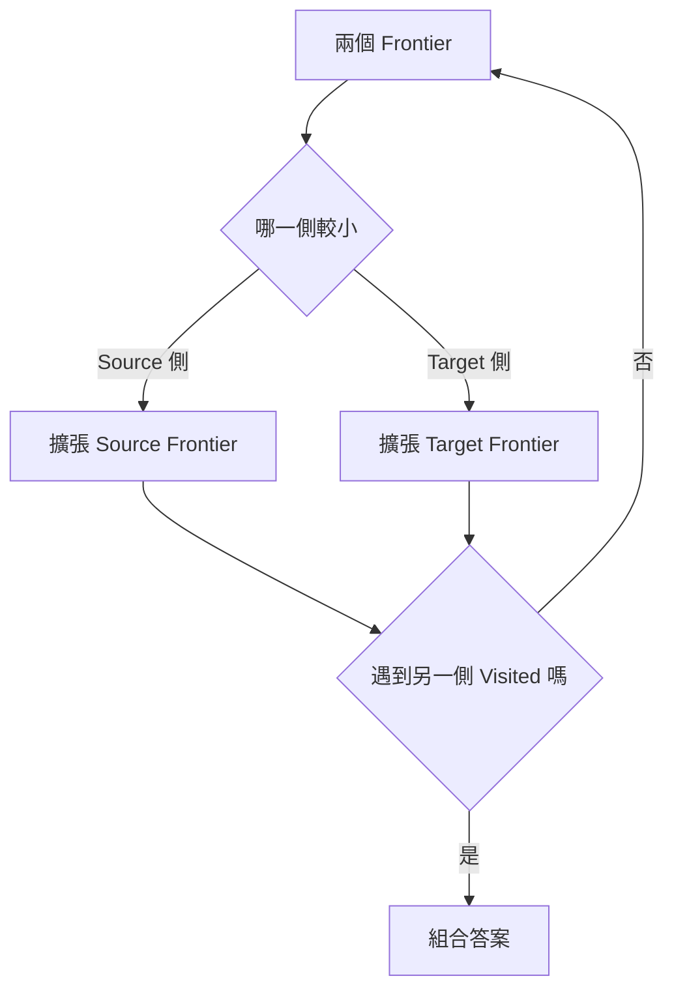

Bidirectional BFS 增加實作複雜度，不是所有 BFS 都需要使用。

### 30.15 不適用普通 BFS 的情況

#### Edge Weight 不同

普通 FIFO 順序只依 Edge 數，不依累積成本。非負不同 Weight 通常考慮 Dijkstra。

#### 0 與 1 Weight

可考慮 0-1 BFS：

- Weight 0 的 Edge Push Front。
- Weight 1 的 Edge Push Back。

#### 負 Weight

需考慮 Bellman-Ford 等方法，並確認是否存在 Negative Cycle。

#### State 太大

完整 BFS 可能因 State 數或 Frontier 寬度耗盡記憶體。可評估：

- Bidirectional BFS。
- A*，前提是有合適 Heuristic。
- 壓縮 State。
- 剪枝或其他問題特性。

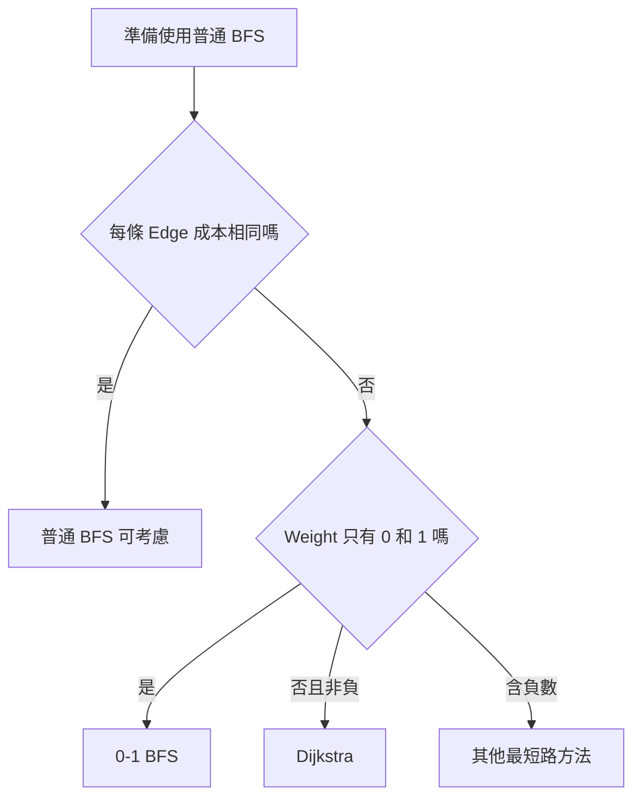

### 30.16 正確性、終止性與複雜度

#### Initialization

Source Distance 設為 0，並加入 Queue。Multi-source 則所有 Source 同為 Distance 0。

#### Maintenance

展開 Distance d 的 Node，第一次發現 Neighbor 時設定 d + 1 並入列。FIFO 維持 Distance 非遞減順序。

#### Termination

有限 Graph 中，每個完整 State 最多第一次入列一次。Queue 最終清空，或提前找到 Target。

#### 複雜度

Adjacency List：

```text
時間 O(V + E)
空間 O(V)
```

Grid `rows × columns`：

```text
時間 O(rows × columns)
空間 O(rows × columns)
```

前提是每個 Cell State 只處理固定次數。

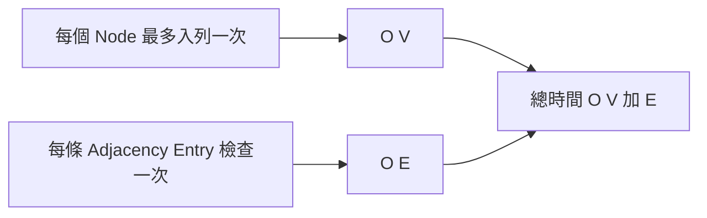

如果 Visited State 包含額外維度，複雜度要乘上該維度的可能值數量。

### 30.17 C 語言中的 BFS

使用固定容量 Circular Queue：

```c
#include <stdbool.h>
#include <stddef.h>

struct IntQueue
{
    int *data;
    size_t capacity;
    size_t head;
    size_t tail;
    size_t size;
};
```

Graph BFS 還需要：

- `distance[node_count]`。
- Adjacency Matrix 或自行建立的 Adjacency List。
- Queue Capacity 至少能容納最大 Frontier，常設為 Node Count。

若 Queue Push 失敗，函式必須回報錯誤，不能把不完整走訪當成合法結果。

Matrix Graph 展開 Neighbor：

```c
for (size_t next = 0; next < node_count; ++next)
{
    if (matrix[node * node_count + next] &&
        distance[next] == -1)
    {
        distance[next] = distance[node] + 1;
        queue_push(&queue, (int)next);
    }
}
```

完整 Matrix BFS 時間為 O(V²)。

### 30.18 系統化 Debug

建議逐輪記錄：

```text
Queue 內容
取出的 Node 或 State
目前 Distance
每個 Neighbor
Neighbor 合法性
是否已訪問
新 Distance
Parent
入列時機
```

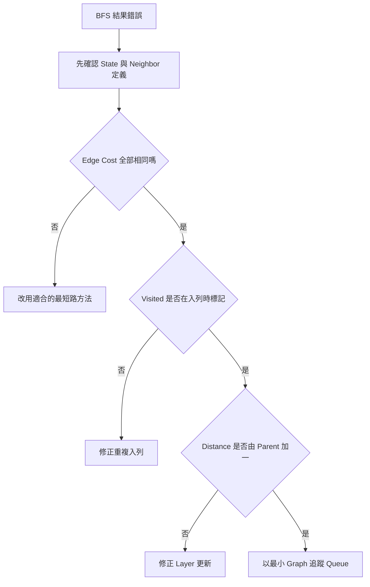

重要測試：

- Source 等於 Target。
- 空 Graph。
- 單一 Node。
- Target 無法到達。
- 一條 Path。
- 多條相同長度最短 Path。
- 含 Cycle。
- 多個 Component。
- Multi-source 含重複 Source。
- Grid 起點或終點是障礙。
- State-space 中相同位置但資源不同。

### 30.19 常見問題與判讀

| 現象 | 可能原因 | 第一輪檢查 |
|---|---|---|
| 同一 Node 大量重複入列 | 出列後才標記 | 第一次入列前設定 Visited |
| Distance 比預期大 | Layer 或 Parent Distance 更新錯誤 | `distance[next]=distance[node]+1` |
| Weighted 最短路錯誤 | Edge Cost 不同仍使用普通 BFS | 改用合適演算法 |
| 找得到 Target 但 Path 錯 | Parent 更新多次 | 只在第一次發現時設定 Parent |
| 逐層輸出混入下一層 | Layer Size 持續變動 | 每層開始固定 Queue Size |
| Multi-source 結果偏向第一個 Source | Source 逐個各跑 BFS | 全部 Source 同時初始化為 0 |
| Grid 越界 | Neighbor 邊界檢查錯誤 | Row、Column 分別檢查 |
| 不規則 Grid Crash | 假設每列同長 | 使用每列實際大小或限制輸入 |
| 有資源狀態時漏解 | Visited 只記位置 | Key 應包含完整 State |
| Bidirectional 無法相遇 | 反向 Neighbor 錯誤 | Directed Graph 要建立 Reverse Edge |
| Queue 記憶體過大 | Frontier 寬度很大 | 評估雙向搜尋或其他策略 |
| 提早停止回傳錯誤 | 停止時機與 Distance 未確定 | 在第一次發現或出列時保持一致推理 |

### 30.20 練習題方向

#### 基礎題

給定 Unweighted Graph 與 Source，輸出到所有 Node 的 Distance，無法到達為 -1。

#### 變化題

輸出 Source 到 Target 的一條最短 Path，使用 Parent Array 還原。

#### 綜合題

給定 Grid 中多個火源與一個人物，先用 Multi-source BFS 計算火到每格的最早時間，再判斷人物是否能在火之前到達出口。必須定義兩次 BFS 的 State、時間與合法移動條件。

### 30.21 本章檢查表

- 我能說明 BFS Queue 中每個元素代表的 State。
- 我知道普通 BFS 的最短性依賴 Edge 成本相同。
- 我能說明 Queue 為何按 Distance Layer 擴張。
- 我會在第一次入列時標記 Visited。
- 我能使用 Distance Array 同時表示未訪問與最短距離。
- 我能證明 Node 第一次發現時 Distance 已最短。
- 我能使用 Parent Array 還原一條最短 Path。
- 我知道多條最短 Path 時單一 Parent 只保存其中一條。
- 我會在逐層處理時固定 Layer Size。
- 我能將所有 Source 同時初始化為 Distance 0。
- 我能把 Grid Cell 建模為 Node，移動建模為 Edge。
- 我會分別檢查 Row、Column、障礙與 Visited。
- 我知道 State-space Visited Key 必須包含完整 State。
- 我能說明 Bidirectional BFS 的兩個 Frontier。
- 我知道 Directed Graph 的反向搜尋需要 Reverse Edge。
- 我能區分普通 BFS、0-1 BFS、Dijkstra 與負權最短路問題。
- 我能計算 Adjacency List BFS 的 O(V+E)。
- 我會把 Queue、Distance、Visited 與 Parent 列入空間成本。
- 我能以 Cycle、Disconnected、Multi-source 與無法到達案例測試。

### 30.22 本章重點

- BFS 使用 FIFO Queue，讓較早發現、距離較小的 State 先被處理。
- 在所有 Edge 成本相同時，BFS 第一次發現 Node 即取得最少 Edge 數。
- Queue 保存已發現但 Neighbor 尚未完整展開的 State。
- Visited 應在第一次入列時標記，避免同一 State 重複加入。
- Distance Array 可同時表示是否發現與最短 Layer。
- Parent Array 可還原一條最短 Path，並應在第一次發現時設定。
- 逐層處理需在每層開始固定 Queue Size。
- Multi-source BFS 將所有 Source 同時放在 Distance 0，求到 Source 集合的最近距離。
- Grid 與各種狀態問題可視為隱含 Graph，Neighbor 可在展開時動態產生。
- Visited Key 必須包含所有會影響後續移動的 State 欄位。
- Bidirectional BFS 從 Source 與 Target 同時擴張，適合部分單一來源、單一目標問題。
- 普通 BFS 不適用於一般不同 Weight 的最短成本問題。
- Adjacency List BFS 的時間為 O(V+E)，Grid BFS 通常為 O(rows×columns)。
- Debug 時應同步檢查 State、Neighbor、Visited 時機、Distance 更新與 Queue Layer。
