## 第 31 章　Topological Sort

### 適用範圍

本章介紹 Topological Sort，包括 Dependency Graph、Directed Acyclic Graph、Indegree、Kahn's Algorithm、DFS-based Topological Sort、Cycle Detection、順序唯一性，以及字典序最小拓撲順序。

Topological Sort 處理的是 Directed Graph 中的先後限制。若 Edge `u -> v` 表示「u 必須先於 v」，合法輸出必須讓 `u` 出現在 `v` 前方。它不是依 Node Value 排序，也不保證結果唯一。原始章節也特別提醒，真正開始前要確認 Edge 方向、Graph 是否 Directed、是否要求完整排列、是否判斷唯一性，以及是否有 Cycle。citeturn39search1

本章會建立一套固定流程：

- 定義 Node 與 Dependency Edge 的語意。
- 確認 Graph 必須是 DAG 才存在完整拓撲順序。
- Kahn Algorithm 建立 Indegree，並初始化所有 Indegree 0 Node。
- 每次移除一個目前沒有未完成前置條件的 Node。
- 刪除其 Outgoing Edge，更新 Neighbor Indegree。
- 以完成 Node 數判斷是否存在 Cycle。
- DFS 版本以三色 State 偵測 Back Edge，並在離開 Node 時加入結果。
- 若要求唯一性或字典序，改變可選集合與額外判斷。

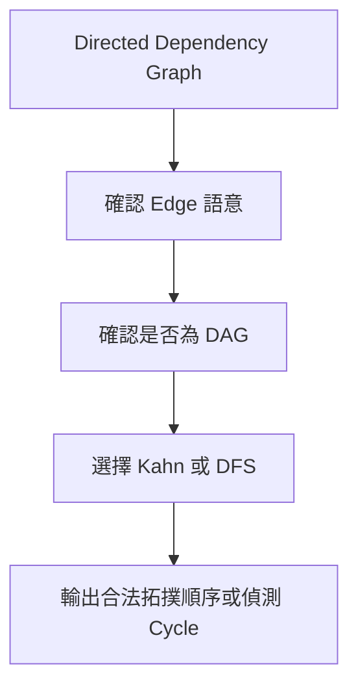

### 適用讀者

- 需要處理課程先修、工作依賴或建置順序的讀者。
- 會寫 BFS，但不理解 Indegree 代表什麼的讀者。
- 只檢查 Queue 最後是否為空，卻無法判斷 Cycle 的讀者。
- DFS 遇到已訪問 Node 就判定 Cycle 的讀者。
- 不清楚為何 Postorder 反轉會得到拓撲順序的讀者。
- 需要判斷順序是否唯一，或求字典序最小順序的讀者。

### 快速導覽

- [31.1 Topological Sort 到底保證什麼](#311-topological-sort-到底保證什麼)
- [31.2 Dependency Graph 與 DAG](#312-dependency-graph-與-dag)
- [31.3 第一步：確認 Edge 方向](#313-第一步確認-edge-方向)
- [31.4 Indegree](#314-indegree)
- [31.5 Kahn's Algorithm](#315-kahns-algorithm)
- [31.6 完整案例：課程順序](#316-完整案例課程順序)
- [31.7 Kahn Algorithm 的正確性](#317-kahn-algorithm-的正確性)
- [31.8 使用完成數量偵測 Cycle](#318-使用完成數量偵測-cycle)
- [31.9 DFS-based Topological Sort](#319-dfs-based-topological-sort)
- [31.10 完整案例：三色 DFS](#3110-完整案例三色-dfs)
- [31.11 Kahn 與 DFS 的比較](#3111-kahn-與-dfs-的比較)
- [31.12 順序唯一性](#3112-順序唯一性)
- [31.13 字典序最小拓撲順序](#3113-字典序最小拓撲順序)
- [31.14 重複 Edge 與輸入驗證](#3114-重複-edge-與輸入驗證)
- [31.15 正確性、終止性與複雜度](#3115-正確性終止性與複雜度)
- [31.16 C 語言中的 Topological Sort](#3116-c-語言中的-topological-sort)
- [31.17 系統化 Debug](#3117-系統化-debug)
- [31.18 常見問題與判讀](#3118-常見問題與判讀)
- [31.19 練習題方向](#3119-練習題方向)
- [31.20 本章檢查表](#3120-本章檢查表)
- [31.21 本章重點](#3121-本章重點)

### 31.1 Topological Sort 到底保證什麼

對 Directed Graph `G = (V, E)`，Topological Order 是包含所有 Node 的線性順序，而且對每條 Edge `u -> v`：

```text
u 在輸出中出現在 v 前方
```

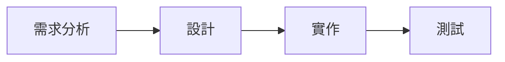

若 Edge 表示「前一步必須先完成」，合法順序必須保持每條依賴方向。例如：

```text
需求分析 -> 設計 -> 實作 -> 測試
```

合法輸出可以是：

```text
需求分析, 設計, 實作, 測試
```

#### 結果不一定唯一

Topological Sort 不要求無 Edge 的 Node 依特定 Value 排序，因此結果可能不唯一。原始章節也以 A、B 都指向 C 為例，說明 `A, B, C` 與 `B, A, C` 都合法。citeturn39search1

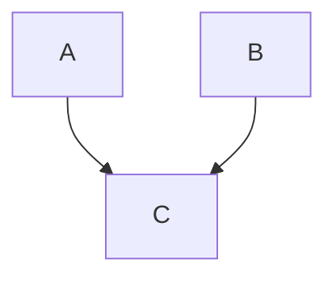

合法順序包括：

```text
A, B, C
B, A, C
```

A 與 B 之間沒有依賴，因此兩種順序都合法。

#### Topological Sort 不是 Sort by Value

若 Node 編號是 0、1、2、3，拓撲順序不一定要由小到大。若題目要求字典序最小，才需要額外規則，例如 Min-heap。

### 31.2 Dependency Graph 與 DAG

Topological Sort 只對 Directed Acyclic Graph，也就是 DAG，存在完整順序。

如果存在 Cycle：

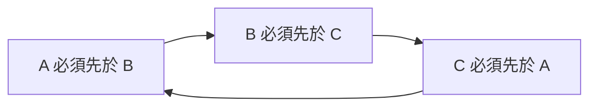

這些限制互相矛盾，沒有任何 Node 能同時滿足全部先後關係。

#### Self-loop

Edge `u -> u` 本身就是 Cycle，因此不存在完整拓撲順序。

#### Disconnected DAG

Graph 不必 Weakly Connected。多個互不相連的 DAG Component 仍可合併成拓撲順序，只要各 Component 內部依賴成立。

例子：

```text
A -> B
C -> D
E isolated
```

合法輸出可以是：

```text
A, C, E, B, D
```

只要 A 在 B 前，C 在 D 前即可。

### 31.3 第一步：確認 Edge 方向

課程題常提供 Pair：

```text
(course, prerequisite)
```

若語意是先修課 `prerequisite` 必須先完成，建圖應為：

```text
prerequisite -> course
```

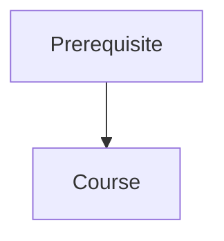

若方向建反，演算法仍可能產生某個順序，但語意會相反。

建圖前應先寫一句話：

```text
Edge u -> v 表示 u 必須先於 v。
```

接著所有 Indegree、Output 與驗證都依同一語意進行。原始章節也把「確認 Edge 方向」列為第一步。citeturn39search1

#### 常見方向混淆

| 輸入格式 | 正確語意 | 建圖方向 |
|---|---|---|
| `(course, prerequisite)` | prerequisite 先於 course | `prerequisite -> course` |
| `(before, after)` | before 先於 after | `before -> after` |
| `(u, v)` 且題目說 u depends on v | v 先於 u | `v -> u` |
| `(u, v)` 且題目說 u must be before v | u 先於 v | `u -> v` |

### 31.4 Indegree

Indegree 是指向某個 Node 的 Edge 數量。

在 Dependency Graph 中，它可解讀為：

```text
目前仍未被移除的前置依賴數量
```

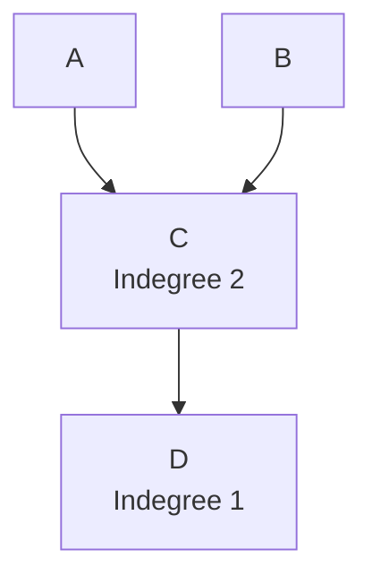

建立方式：

```cpp
for (int u = 0; u < nodeCount; ++u)
{
    for (int v : graph[u])
    {
        ++indegree[v];
    }
}
```

Indegree 0 表示目前沒有尚未完成的前置條件，可以加入結果。

注意「目前」二字。隨著 Node 被移除，其 Outgoing Edge 也視為移除，Neighbor Indegree 會降低。原始章節也強調 Indegree 0 是「目前」沒有尚未完成前置條件。citeturn39search1

#### Indegree 常見錯誤

- 對 Edge Source 增加 Indegree，而不是 Target。
- 只初始化有 Edge 的 Node，漏掉孤立 Node。
- 重複 Edge 去重不一致，導致 Indegree 無法降到 0。
- Edge 方向建反，導致 Indegree 全部不符合語意。

### 31.5 Kahn's Algorithm

Kahn's Algorithm 使用 Queue 保存目前 Indegree 為 0，而且尚未輸出的 Node。

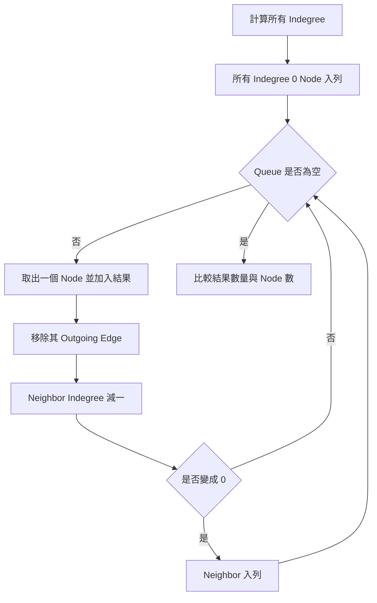

#### Queue 中的 Node 代表什麼

Queue 保存的是：

```text
目前沒有未完成前置依賴、而且尚未輸出的 Node
```

這不是一般 BFS 的「距離層」，而是依賴條件解除後的可選集合。

#### C++ 實作

```cpp
#include <queue>
#include <vector>

std::vector<int> topologicalSortKahn(
    const std::vector<std::vector<int>>& graph)
{
    const int nodeCount = static_cast<int>(graph.size());
    std::vector<int> indegree(nodeCount, 0);

    for (int node = 0; node < nodeCount; ++node)
    {
        for (int next : graph[node])
        {
            ++indegree[next];
        }
    }

    std::queue<int> ready;

    for (int node = 0; node < nodeCount; ++node)
    {
        if (indegree[node] == 0)
        {
            ready.push(node);
        }
    }

    std::vector<int> order;
    order.reserve(nodeCount);

    while (!ready.empty())
    {
        const int node = ready.front();
        ready.pop();

        order.push_back(node);

        for (int next : graph[node])
        {
            --indegree[next];

            if (indegree[next] == 0)
            {
                ready.push(next);
            }
        }
    }

    if (static_cast<int>(order.size()) != nodeCount)
    {
        return {};
    }

    return order;
}
```

#### 為什麼最後要比較 order.size()

任何流程最後 Queue 都會空。DAG 完成時 Queue 會空；Cycle 卡住時 Queue 也會空。因此不能只用 Queue 空判斷是否有 Cycle，要比較完成 Node 數是否等於 V。原始章節也明確提醒，Queue 最後為空本身不能判定 Cycle。citeturn39search1

### 31.6 完整案例：課程順序

假設：

```text
0 -> 2
1 -> 2
2 -> 3
```

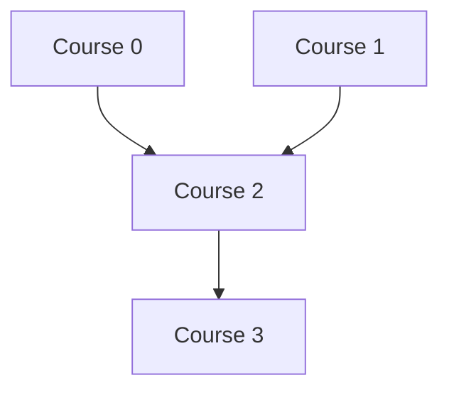

初始 Indegree：

```text
0: 0
1: 0
2: 2
3: 1
```

逐輪：

| Queue Front | 輸出 | 更新 |
|---|---|---|
| 0 | 0 | `indegree[2]` 變 1 |
| 1 | 0,1 | `indegree[2]` 變 0，2 入列 |
| 2 | 0,1,2 | `indegree[3]` 變 0，3 入列 |
| 3 | 0,1,2,3 | 完成 |

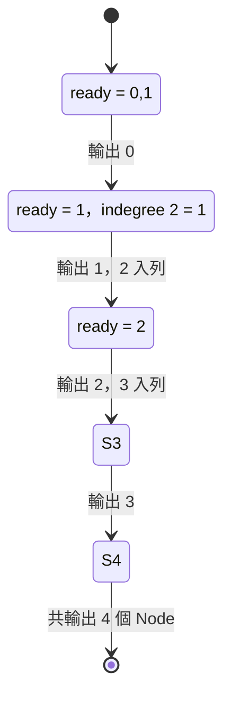

若 Queue 初始順序不同，也可能得到：

```text
1, 0, 2, 3
```

仍是合法拓撲順序。原始章節也指出，此案例可能得到 `0,1,2,3` 或 `1,0,2,3`，兩者都合法。citeturn39search1

### 31.7 Kahn Algorithm 的正確性

#### Queue Element 語意

Queue 保存目前殘餘 Graph 中 Indegree 0、尚未輸出的 Node。

#### 為什麼可安全輸出 Indegree 0 Node

Indegree 0 表示沒有尚未輸出的 Node 指向它。因此把它放在目前順序的下一個位置，不會違反任何剩餘依賴。

#### 移除 Outgoing Edge

輸出 Node 後，它的先後責任已滿足。對每條 `node -> next`，將 `indegree[next]` 減一，表示一項前置依賴已完成。

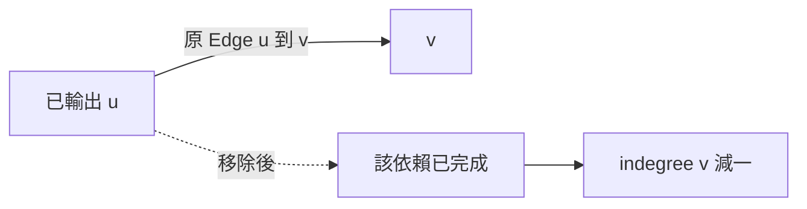

#### 結束時

若所有 Node 都被輸出，對每條 Edge，Source 一定先於 Target 被移除，因此順序合法。

### 31.8 使用完成數量偵測 Cycle

若 Queue 清空，但輸出 Node 數少於 V，表示剩餘 Graph 中每個 Node 的 Indegree 都大於 0。

在有限 Directed Graph 中，沿著每個 Node 的未移除前驅持續往回走，最終會重複某個 Node，因此存在 Cycle。

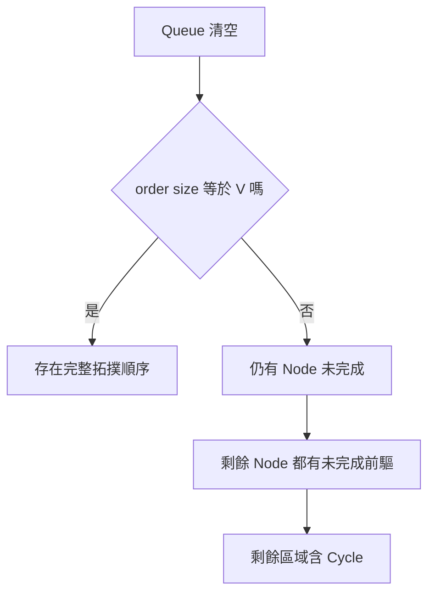

不能只看 Queue 是否空。任何合法 DAG 最後 Queue 也會空，關鍵是是否已處理全部 Node。原始章節也有相同提醒。citeturn39search1

### 31.9 DFS-based Topological Sort

DFS 版本在 Node 的所有 Outgoing Neighbor 都完成後，才把 Node 加入 Postorder，最後反轉。

直覺：

```text
u -> v 表示 u 必須先於 v
DFS 中先完成 v，再把 u 放入 postorder
最後反轉 postorder，u 就會在 v 前方
```

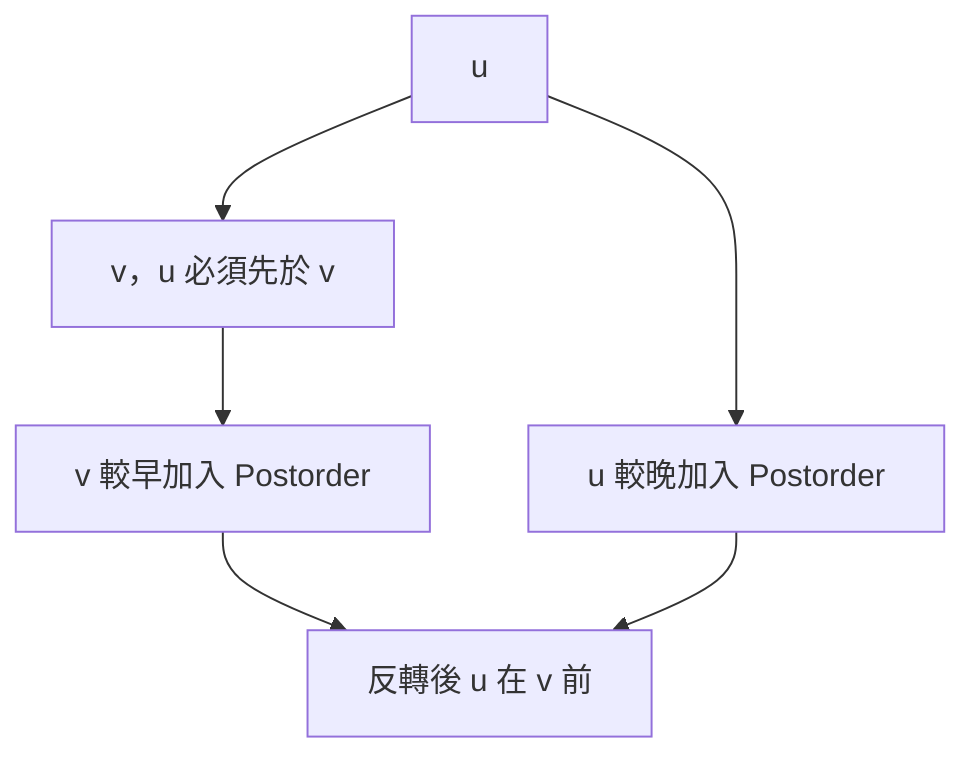

DFS 還需要 Cycle Detection。單一 visited 不足以區分：

- Node 已完成。
- Node 正在目前遞迴路徑。

因此常使用三色 State。原始章節也指出，DFS 版本需要區分「正在目前路徑」與「已完成」。citeturn39search1

### 31.10 完整案例：三色 DFS

State：

```text
0 = Unvisited
1 = Visiting，位於目前 DFS Path
2 = Finished，所有 Descendant 已完成
```

```cpp
#include <algorithm>
#include <vector>

bool dfsTopological(
    int node,
    const std::vector<std::vector<int>>& graph,
    std::vector<int>& state,
    std::vector<int>& postorder)
{
    state[node] = 1;

    for (int next : graph[node])
    {
        if (state[next] == 1)
        {
            return false;
        }

        if (state[next] == 0 &&
            !dfsTopological(next, graph, state, postorder))
        {
            return false;
        }
    }

    state[node] = 2;
    postorder.push_back(node);
    return true;
}

std::vector<int> topologicalSortDfs(
    const std::vector<std::vector<int>>& graph)
{
    std::vector<int> state(graph.size(), 0);
    std::vector<int> order;

    for (int node = 0;
         node < static_cast<int>(graph.size());
         ++node)
    {
        if (state[node] == 0 &&
            !dfsTopological(node, graph, state, order))
        {
            return {};
        }
    }

    std::reverse(order.begin(), order.end());
    return order;
}
```

#### Back Edge

若正在處理 u 時遇到 `state[v] == 1`，表示 v 已在目前 DFS Path 上。


這條 Edge 回到 Ancestor，形成 Directed Cycle。

遇到 `state[v] == 2` 不代表 Cycle，因為 v 的 DFS 已完整結束，它不在目前 Path。原始章節也提醒，遇到 Finished Node 不代表 Cycle。citeturn39search1

### 31.11 Kahn 與 DFS 的比較

| 面向 | Kahn Algorithm | DFS-based |
|---|---|---|
| 核心 State | Indegree、Ready Queue | 三色 State、Postorder |
| Cycle 判斷 | 完成數量少於 V | 遇到 Visiting Node |
| 逐層處理 | 容易 | 不直接呈現 |
| 唯一性判斷 | 容易觀察 Ready 數量 | 較不直接 |
| 遞迴深度 | 無遞迴 | 深 Graph 可能 Stack Overflow |
| 字典序最小 | 可用 Min-heap | 需額外設計 |

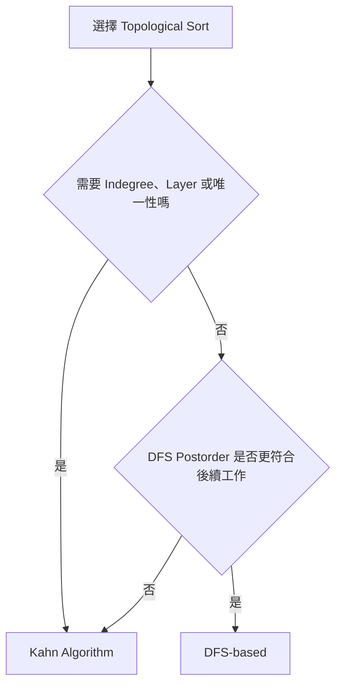

兩種演算法都要求 DAG 才能輸出完整順序。

### 31.12 順序唯一性

在 Kahn Algorithm 中，如果某一步有兩個以上 Ready Node，代表目前至少有多種合法選擇，拓撲順序不唯一。原始章節也說明，要判定唯一性，每一輪 Ready 容器大小都必須恰好為 1，最後仍需確認輸出數量等於 V。citeturn39search1

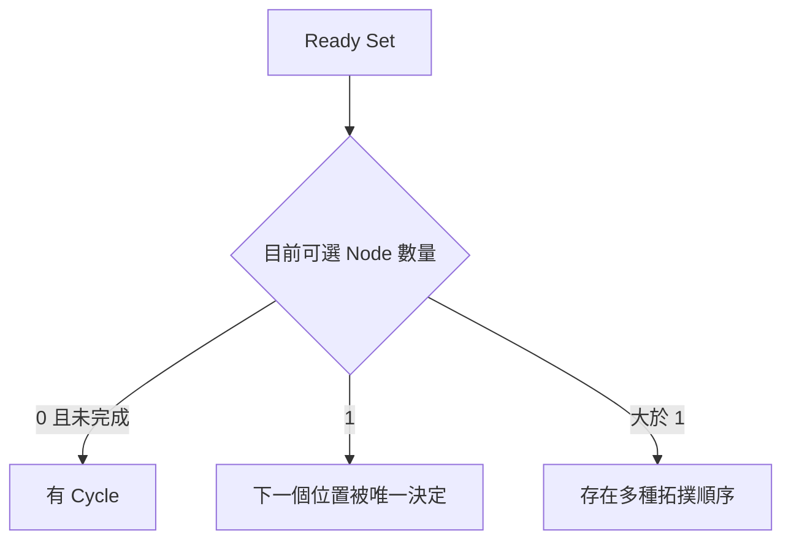

#### 唯一性檢查流程

```cpp
bool unique = true;

while (!ready.empty())
{
    if (ready.size() > 1)
    {
        unique = false;
    }

    // process one node
}
```

若 Graph 有 Cycle，不能只說「不唯一」，而是根本不存在拓撲順序。

### 31.13 字典序最小拓撲順序

普通 Queue 依入列順序選 Node，不保證字典序最小。

若 Node Key 可排序，改用 Min-priority Queue：

```cpp
#include <functional>
#include <queue>
#include <vector>

std::priority_queue<
    int,
    std::vector<int>,
    std::greater<int>> ready;
```

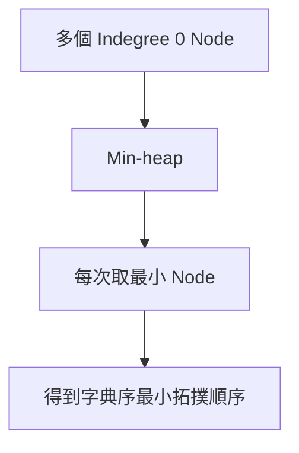

時間複雜度由 O(V + E) 變成約 O((V + E) log V)，因為 Ready 集合的 Push、Pop 具有對數成本。原始章節也有相同複雜度提醒。citeturn39search1

字典序最小不代表順序唯一。即使有多個選擇，也可以用規則選出其中最小的一個。

### 31.14 重複 Edge 與輸入驗證

若輸入有重複 Edge `u -> v`：

- Adjacency List 加入兩次。
- Indegree v 增加兩次。
- 處理 u 時也會減少兩次。

若建圖和 Indegree 對重複 Edge 的處理一致，演算法仍可能完成，但語意是否正確取決於問題是否允許平行依賴。

若只對 Adjacency 去重，卻仍重複增加 Indegree，v 可能永遠無法降到 0。原始章節也特別指出這個風險。citeturn39search1

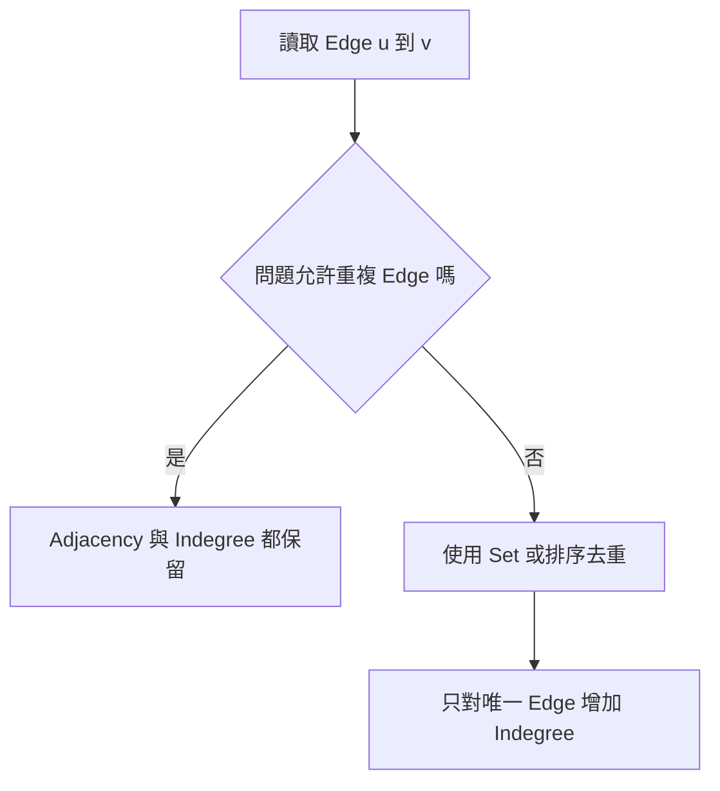

建圖時也要驗證：

- Node Index 合法。
- Self-loop 政策。
- Node Count 是否合理。
- Edge 方向是否符合輸入語意。

### 31.15 正確性、終止性與複雜度

#### Kahn

- 每個 Node 最多入列一次。
- 每條 Edge 用來降低一次 Indegree。
- Adjacency List 下時間 O(V + E)。
- Indegree、Queue、Result 共需 O(V)，Graph 儲存 O(V + E)。

#### DFS-based

- 每個 Node 由 Unvisited 進入 Visiting，再進入 Finished。
- 每條 Edge 檢查一次。
- 時間 O(V + E)。
- State、Result O(V)，Call Stack 最差 O(V)。

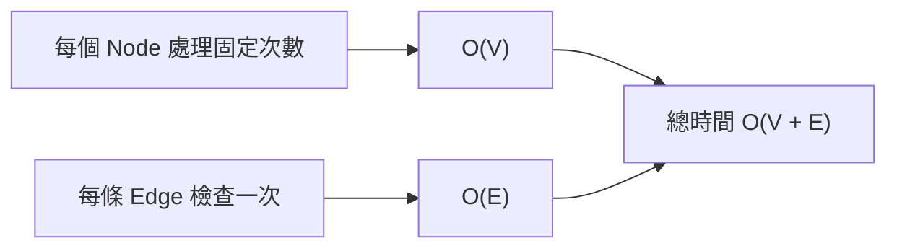

終止性來自有限 Node 與 Edge，而且 Node State 或 Indegree 只單向前進，不會恢復成未處理狀態。原始章節也有相同說明。citeturn39search1

### 31.16 C 語言中的 Topological Sort

C 可使用：

- Adjacency Matrix，程式較直接但走訪 O(V²)。
- 自建 Adjacency List。
- 固定容量 Circular Queue。

Matrix Kahn 核心：

```c
for (size_t u = 0; u < node_count; ++u)
{
    for (size_t v = 0; v < node_count; ++v)
    {
        if (matrix[u * node_count + v])
        {
            ++indegree[v];
        }
    }
}
```

處理 Node u 時再掃描 Row u，對每條存在 Edge 的 v 將 Indegree 減一。

需要檢查：

- `node_count * node_count` 配置是否 Overflow。
- Queue Capacity 是否至少可容納 V。
- Push 失敗是否回報。
- Result Buffer 是否足夠。

### 31.17 系統化 Debug

建議逐輪記錄：

```text
每條 Edge 的方向
初始 Indegree
Ready Queue / Heap
本輪輸出 Node
每個 Neighbor 更新前後的 Indegree
新入列 Node
目前輸出數量
```

DFS 另外記錄：

```text
Node State 0 / 1 / 2
目前 DFS Path
Postorder Push 時機
遇到 Back Edge 的位置
```

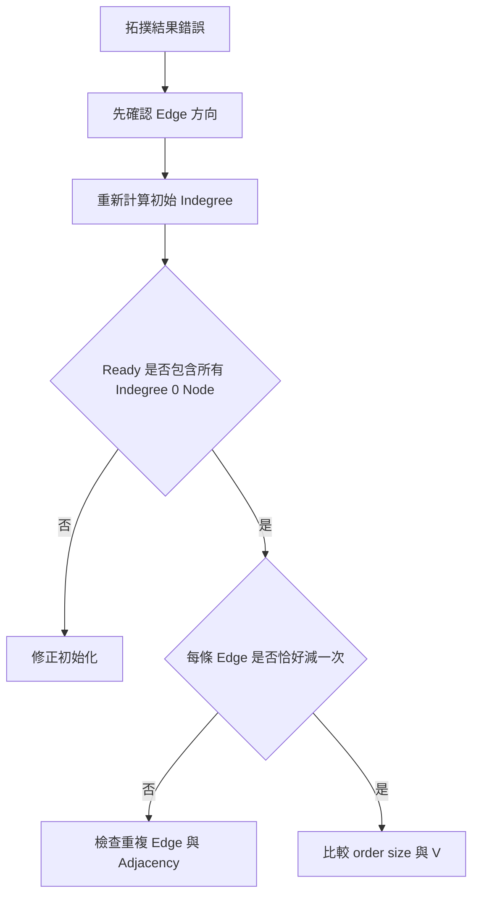

重要測試：

- 0 個 Node。
- 單一 Node。
- 沒有 Edge 的多個 Node。
- 一條 Chain。
- 多個合法順序。
- 唯一順序。
- Self-loop。
- 兩 Node Cycle。
- 較長 Cycle。
- Disconnected DAG。
- 重複 Edge。
- 非法 Node Index。

原始章節也列出這些 Debug 記錄項與重要測試。citeturn39search1

### 31.18 常見問題與判讀

| 現象 | 可能原因 | 第一輪檢查 |
|---|---|---|
| 輸出順序完全相反 | Edge 方向建反 | 明確寫出 u 必須先於 v |
| 所有 Node 一開始都不可選 | Indegree 計算方向錯誤 | Indegree 增加在 Edge Target |
| Neighbor 永遠無法變 0 | Edge 重複處理不一致 | Adjacency 與 Indegree 是否同步去重 |
| Queue 空就判定 Cycle | 忽略正常完成時 Queue 也會空 | 比較 order size 與 V |
| Cycle 未被 DFS 發現 | 只有單一 Visited | 區分 Visiting 與 Finished |
| DFS 遇到 Finished 就誤判 Cycle | 將所有已訪問視為目前路徑 | 只有 State 1 是 Back Edge |
| DFS 順序反向 | 忘記反轉 Postorder | 離開 Node 時 Push，最後 Reverse |
| 順序不唯一卻誤判唯一 | 未檢查 Ready Size | 每輪應恰好一個可選 Node |
| 想要字典序最小但結果不穩定 | 使用普通 Queue | 改用 Min-heap |
| 孤立 Node 漏掉 | 只從有 Edge 的 Node 初始化 | 所有 Indegree 0 Node 都要加入 |
| 深 DAG 發生 Stack Overflow | DFS 遞迴深度過大 | 使用 Kahn 或顯式 Stack |
| 複雜度被寫成 O(V²) | 使用 List 卻按 Matrix 分析 | 依實際表示方式計算 |

這些常見問題也在原始章節中完整列出。citeturn39search1

### 31.19 練習題方向

#### 基礎題

給定課程數與 Prerequisite Pair，判斷是否能完成全部課程。

檢查重點：

- Edge 方向。
- Indegree 初始化。
- `order.size() == V`。

#### 變化題

輸出任意合法課程順序；若不存在，回傳空結果。

檢查重點：

- 多個合法答案都應接受。
- 不應只和單一順序比對。

#### 綜合題

判斷拓撲順序是否唯一，若不唯一則輸出字典序最小順序。說明普通 Queue、Ready Size 與 Min-heap 各自用途。

### 31.20 本章檢查表

- 我能說明 Edge `u -> v` 表示 `u` 必須先於 `v`。
- 我知道只有 DAG 存在完整 Topological Order。
- 我能正確計算每個 Node 的 Indegree。
- 我知道 Indegree 0 表示目前沒有未完成前置依賴。
- 我能說明 Kahn Queue 中每個 Node 的語意。
- 我會初始化所有 Indegree 0 Node，包括孤立 Node。
- 我知道處理 u 後要降低每個 Outgoing Neighbor 的 Indegree。
- 我會使用 `order.size() == V` 判斷是否完成。
- 我知道 Queue 最後為空本身不能判定 Cycle。
- 我能使用 Unvisited、Visiting、Finished 三色 DFS。
- 我知道只有遇到 Visiting Node 才表示 Back Edge。
- 我知道 DFS 要在離開 Node 時加入 Postorder，最後反轉。
- 我能比較 Kahn 與 DFS-based 方法。
- 我能使用每輪 Ready Size 判斷唯一性。
- 我知道字典序最小順序可使用 Min-heap。
- 我會讓重複 Edge 的 Adjacency 與 Indegree 處理一致。
- 我能計算 Adjacency List 下的 O(V + E)。
- 我會測試 Self-loop、Cycle、Disconnected DAG、孤立 Node 與重複 Edge。

### 31.21 本章重點

- Topological Sort 將 Directed Dependency Graph 排成符合所有 Edge 先後限制的線性順序。
- 完整拓撲順序存在的必要且充分條件是 Graph 為 DAG。
- Edge 方向必須先定義清楚，通常由 Prerequisite 指向依賴它的工作。
- Indegree 表示目前尚未移除的前置依賴數量。
- Kahn's Algorithm 每次選擇 Indegree 0 Node，移除其 Outgoing Edge，再更新 Neighbor。
- Queue 清空後必須比較已輸出 Node 數與 V，才能判斷是否含 Cycle。
- DFS-based 方法在離開 Node 時加入 Postorder，最後反轉得到拓撲順序。
- DFS 需要三色 State，遇到 Visiting Node 才代表 Directed Cycle。
- 多個 Ready Node 表示拓撲順序不唯一；每輪恰好一個 Ready Node 才可能唯一。
- 字典序最小拓撲順序可使用 Min-heap，但時間會增加對數因子。
- 重複 Edge 的 Adjacency 與 Indegree 必須一致處理。
- Kahn 與 DFS-based 在 Adjacency List 下皆為 O(V + E)。
- Debug 時應同步檢查 Edge 方向、Indegree、Ready 集合、Edge 更新與完成 Node 數。
