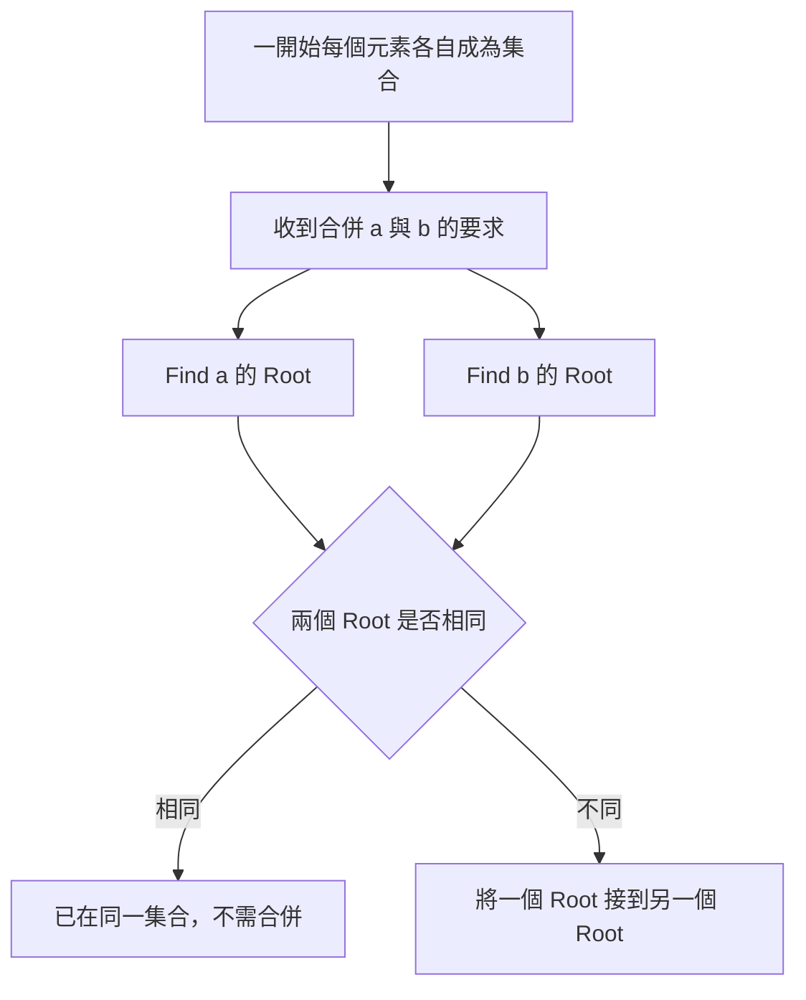
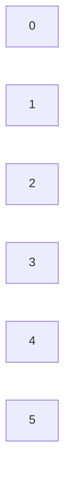
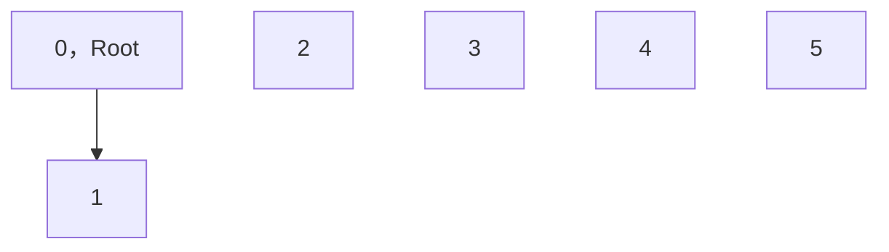
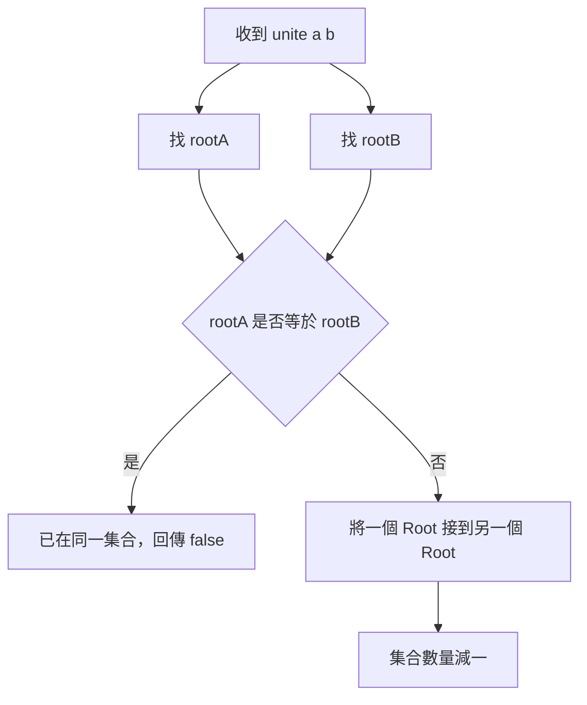
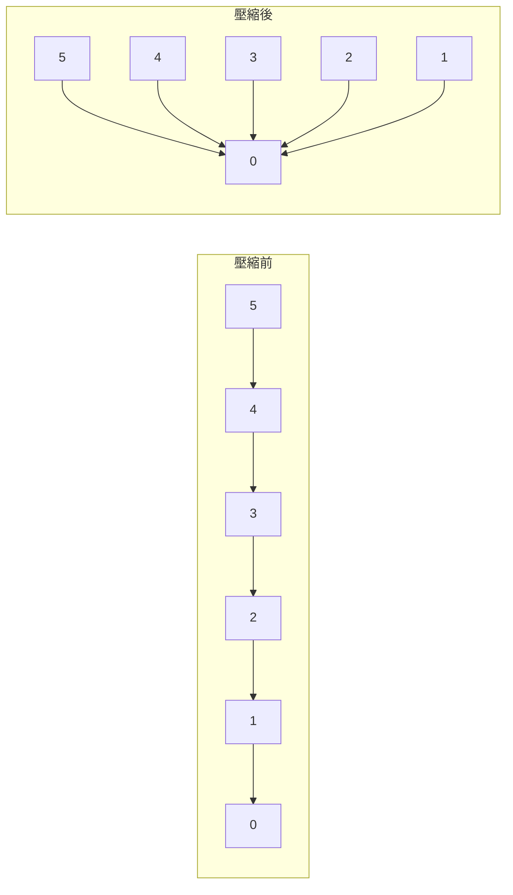
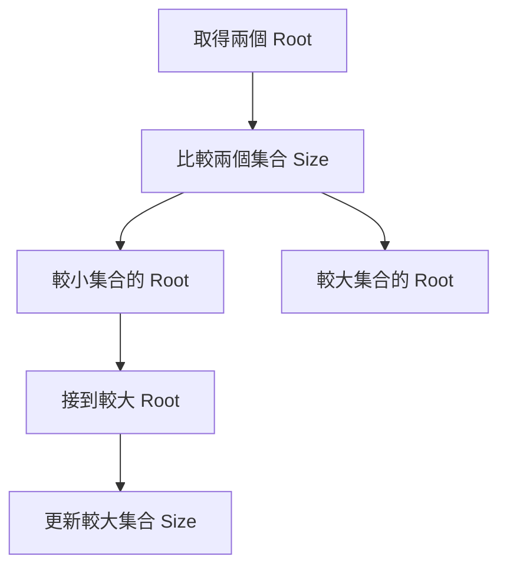
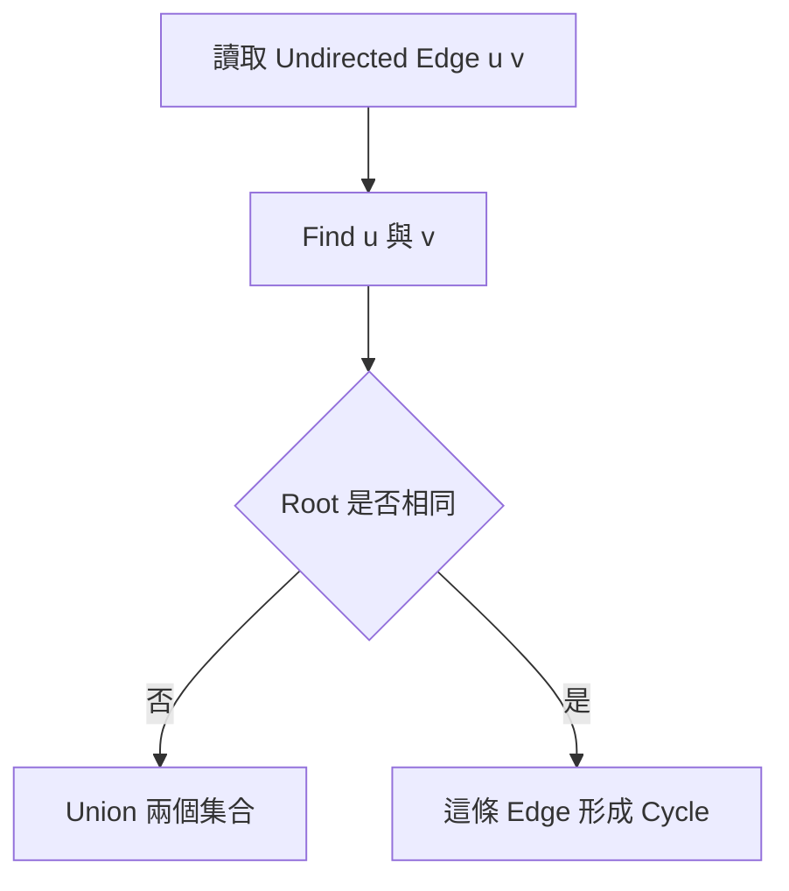

## 第 32 章　Disjoint Set Union

### 適用範圍

本章說明 Disjoint Set Union，簡稱 DSU，也常稱為 Union-Find。

DSU 適合處理一組元素被分成多個互不重疊集合，而且集合會持續合併的問題。它最常回答兩類問題：

- 兩個元素目前是否屬於同一個集合？
- 將兩個元素所在的集合合併。

第一次接觸 DSU 時，常見困難不是不會寫 `find` 或 `unite`，而是不清楚：

- `parent[x]` 表示 x 的上一層，還是整個集合代表？
- 為什麼同一集合可以用一棵 Tree 表示？
- `find(x)` 為什麼要一路找到 Root？
- Union 時應該改哪一個 Parent？
- Path Compression 攠變 Tree 後，集合關係會不會改變？
- Union by Size 與 Union by Rank 解決什麼問題？

這些困難通常不是語法問題，而是尚未分清楚「元素本身」、「元素的 Parent」與「集合代表 Root」。

本章會建立一套固定流程：

- 先將問題整理成元素、集合與合併事件。
- 用小型資料手動追蹤 Parent Array。
- 區分 Parent 與 Root。
- 分別理解 Find 與 Union。
- 再加入 Path Compression 與 Union by Size。
- 最後延伸到 Dynamic Connectivity 與 Cycle Detection。



### 適用讀者

- 已理解 Array、Tree 與 Graph 基礎，但第一次接觸 DSU 的讀者。
- 能看懂 DSU 程式，卻不清楚 Parent Array 代表什麼的讀者。
- 容易混淆 Parent、Root、Rank 與 Size 的讀者。
- 想理解動態連通性與無向 Graph Cycle Detection 的讀者。
- 想為 Kruskal Minimum Spanning Tree 建立基礎的讀者。

### 快速導覽

- [32.1 DSU 前到底要分析什麼](#321-dsu-前到底要分析什麼)：先確認是否只需維護集合關係。
- [32.2 先不要寫程式：手動合併集合](#322-先不要寫程式手動合併集合)：建立集合代表的直覺。
- [32.3 Parent Array](#323-parent-array)：用 Array 表示多棵 Tree。
- [32.4 Find](#324-find)：找到元素所屬集合的 Root。
- [32.5 Union](#325-union)：合併兩個不同集合。
- [32.6 Path Compression](#326-path-compression)：壓縮 Find 經過的路徑。
- [32.7 Union by Size](#327-union-by-size)：把較小 Tree 接到較大 Tree。
- [32.8 Union by Rank](#328-union-by-rank)：依近似高度決定合併方向。
- [32.9 完整 C++ 實作](#329-完整-c-實作)：整合 Find、Union 與集合數量。
- [32.10 Dynamic Connectivity](#3210-dynamic-connectivity)：處理持續加入的連線。
- [32.11 Cycle Detection](#3211-cycle-detection)：判斷新增無向 Edge 是否形成 Cycle。
- [32.12 DSU 與 DFS、BFS 的差異](#3212-dsu-與-dfsbfs-的差異)：依輸出需求選擇方法。
- [32.13 複雜度](#3213-複雜度)：理解近似常數時間的由來。
- [32.14 常見問題與判讀](#3214-常見問題與判讀)：整理常見錯誤。
- [32.15 本章檢查表](#3215-本章檢查表)：確認是否掌握核心概念。
- [32.16 本章重點](#3216-本章重點)：回顧本章核心。

### 32.1 DSU 前到底要分析什麼

假設有 6 個 Node：

```text
0, 1, 2, 3, 4, 5
```

系統會依序加入下列連線：

```text
0 - 1
1 - 2
3 - 4
2 - 4
```

並且需要反覆回答：

```text
0 和 4 是否已經連通？
0 和 5 是否已經連通？
```

第一步不是直接寫 DSU，而是先整理問題：

<table>
<tr><th>分析項目</th><th>本題內容</th></tr>
<tr><td>元素</td><td>Node 0 到 5</td></tr>
<tr><td>初始集合</td><td>每個 Node 各自形成一個集合</td></tr>
<tr><td>更新</td><td>加入一條連線，合併兩個集合</td></tr>
<tr><td>查詢</td><td>兩個 Node 是否屬於同一集合</td></tr>
<tr><td>是否需要列出路徑</td><td>不需要</td></tr>
<tr><td>是否需要最短距離</td><td>不需要</td></tr>
<tr><td>是否會刪除連線</td><td>本章基礎版本不處理刪除</td></tr>
</table>

這張表會直接影響方法：

- 若只需判斷兩個 Node 是否連通，不需要知道實際路徑，DSU 很合適。
- 若需要輸出從 a 到 b 的實際路徑，DSU 保存的 Parent Tree 不能直接代表 Graph 路徑。
- 若 Edge 會持續新增，DSU 可以快速合併集合。
- 若需要任意刪除 Edge，基礎 DSU 通常無法直接處理。

DSU 解決的是集合歸屬與合併，不是一般 Graph 的完整走訪問題。

### 32.2 先不要寫程式：手動合併集合

一開始每個元素都是自己的集合：

```text
{0} {1} {2} {3} {4} {5}
```

加入連線 `0 - 1`：

```text
{0, 1} {2} {3} {4} {5}
```

加入連線 `1 - 2`：

```text
{0, 1, 2} {3} {4} {5}
```

加入連線 `3 - 4`：

```text
{0, 1, 2} {3, 4} {5}
```

加入連線 `2 - 4`：

```text
{0, 1, 2, 3, 4} {5}
```

這時：

```text
0 和 4 在同一集合：是
0 和 5 在同一集合：否
```

DSU 不需要保存集合中的所有元素清單。它會為每個集合選出一個 Root，讓同一集合中的元素最後都能找到同一個 Root。

### 32.3 Parent Array

DSU 使用 Parent Array 表示多棵 Tree。

一開始：

```text
Index:   0 1 2 3 4 5
Parent:  0 1 2 3 4 5
```

`parent[x] == x` 表示 x 是一棵 Tree 的 Root，也就是該集合的代表。



每個節點目前都指向自己，所以共有 6 個集合。

假設合併 0 與 1，令 1 的 Root 接到 0：

```text
Index:   0 1 2 3 4 5
Parent:  0 0 2 3 4 5
```



此時：

- `parent[1]` 是 0。
- 0 是集合 `{0, 1}` 的 Root。
- 1 與 0 屬於同一集合。

#### Parent 不一定直接等於 Root

假設形成：

```text
2 -> 1 -> 0
```

那麼：

```text
parent[2] = 1
parent[1] = 0
parent[0] = 0
```

2 的 Parent 是 1，但 2 的 Root 是 0。

所以要判斷集合歸屬，不能只比較 `parent[a]` 和 `parent[b]`，而要比較 `find(a)` 和 `find(b)`。

### 32.4 Find

`find(x)` 會沿著 Parent 一直往上走，直到找到 `parent[root] == root` 的節點。

```mermaid
flowchart TD
    A[從 x 開始] --> B{"parent[x] 是否等於 x"}
    B -->|是| C[x 是 Root，回傳 x]
    B -->|否| D[移動到 parent[x]]
    D --> B
```

#### 基礎遞迴版本

```cpp
int find(int x)
{
    if (parent[x] == x)
    {
        return x;
    }

    return find(parent[x]);
}
```

#### 基礎迭代版本

```cpp
int find(int x)
{
    while (parent[x] != x)
    {
        x = parent[x];
    }

    return x;
}
```

假設：

```text
parent[4] = 3
parent[3] = 1
parent[1] = 0
parent[0] = 0
```

那麼 `find(4)` 的路徑是：

```text
4 -> 3 -> 1 -> 0
```

最後回傳 0。

### 32.5 Union

Union 的工作不是直接把 b 接到 a，而是先找到兩邊的 Root，再合併兩棵 Tree。

```cpp
int rootA = find(a);
int rootB = find(b);
```

如果兩個 Root 相同，表示已經在同一集合，不需再合併。

如果 Root 不同，將其中一個 Root 的 Parent 改成另一個 Root。



#### 為什麼要連 Root

若直接寫：

```cpp
parent[b] = a;
```

a 或 b 可能不是 Root。這可能只改變局部關係，並讓 Tree 結構變得難以控制。

正確做法是：

```cpp
parent[rootB] = rootA;
```

也就是合併整個集合的代表。

### 32.6 Path Compression

如果 Parent Tree 很高，Find 需要走過很多節點。

例如：

```text
5 -> 4 -> 3 -> 2 -> 1 -> 0
```

`find(5)` 需要一路走到 0。

Path Compression 會在 Find 返回時，讓經過的節點直接指向 Root：

```text
5 -> 0
4 -> 0
3 -> 0
2 -> 0
1 -> 0
```



#### C++ Path Compression

```cpp
int find(int x)
{
    if (parent[x] == x)
    {
        return x;
    }

    parent[x] = find(parent[x]);
    return parent[x];
}
```

最重要的一行是：

```cpp
parent[x] = find(parent[x]);
```

右側先找到 Root，左側再讓 x 直接指向該 Root。

Path Compression 只改變 Tree 的形狀，不改變集合成員。原本同一集合中的元素，壓縮後仍屬於同一集合。

### 32.7 Union by Size

Path Compression 加速 Find。Union by Size 則在合併時避免 Tree 變得太高。

`size[root]` 表示該 Root 所代表集合的元素數量。

合併時：

- 找出兩個 Root。
- 將較小集合的 Root 接到較大集合的 Root。
- 更新較大集合的 Size。

```cpp
if (size[rootA] < size[rootB])
{
    std::swap(rootA, rootB);
}

parent[rootB] = rootA;
size[rootA] += size[rootB];
```

這裡交換後保證 `rootA` 對應較大的集合。

#### 為什麼較小集合接到較大集合

若一直把大 Tree 接到小 Tree，許多節點的深度可能增加。

把小 Tree 接到大 Tree，只會讓小 Tree 中的節點深度增加一層，較容易控制整體高度。



只有 Root 的 `size` 值保證代表完整集合大小。非 Root 節點的舊 `size` 通常不再使用。

### 32.8 Union by Rank

Union by Rank 與 Union by Size 目的相同，都是避免 Tree 過高。

Rank 通常表示 Tree 高度的上界或近似資訊，不一定永遠等於 Path Compression 後的實際高度。

合併規則：

- Rank 較小的 Root 接到 Rank 較大的 Root。
- Rank 相同時，可任選一邊作為新 Root，並將新 Root 的 Rank 加一。

```cpp
if (rank[rootA] < rank[rootB])
{
    parent[rootA] = rootB;
}
else if (rank[rootA] > rank[rootB])
{
    parent[rootB] = rootA;
}
else
{
    parent[rootB] = rootA;
    ++rank[rootA];
}
```

Union by Size 與 Union by Rank 通常擇一即可。對初學者而言，Size 的語意較容易直接驗證。

### 32.9 完整 C++ 實作

以下版本使用 Path Compression 與 Union by Size。

```cpp
#include <iostream>
#include <numeric>
#include <utility>
#include <vector>

class DisjointSetUnion
{
private:
    std::vector<int> parent;
    std::vector<int> size;
    int componentCount;

public:
    explicit DisjointSetUnion(int n)
        : parent(n), size(n, 1), componentCount(n)
    {
        std::iota(parent.begin(), parent.end(), 0);
    }

    int find(int x)
    {
        if (parent[x] == x)
        {
            return x;
        }

        parent[x] = find(parent[x]);
        return parent[x];
    }

    bool unite(int a, int b)
    {
        int rootA = find(a);
        int rootB = find(b);

        if (rootA == rootB)
        {
            return false;
        }

        if (size[rootA] < size[rootB])
        {
            std::swap(rootA, rootB);
        }

        parent[rootB] = rootA;
        size[rootA] += size[rootB];
        --componentCount;

        return true;
    }

    bool connected(int a, int b)
    {
        return find(a) == find(b);
    }

    int getSize(int x)
    {
        return size[find(x)];
    }

    int countComponents() const
    {
        return componentCount;
    }
};

int main()
{
    DisjointSetUnion dsu(6);

    dsu.unite(0, 1);
    dsu.unite(1, 2);
    dsu.unite(3, 4);

    std::cout << std::boolalpha;
    std::cout << dsu.connected(0, 2) << '\n';
    std::cout << dsu.connected(0, 4) << '\n';

    dsu.unite(2, 4);

    std::cout << dsu.connected(0, 4) << '\n';
    std::cout << dsu.getSize(0) << '\n';
    std::cout << dsu.countComponents() << '\n';
}
```

輸出：

```text
true
false
true
5
2
```

最後共有兩個集合：

```text
{0, 1, 2, 3, 4}
{5}
```

### 32.10 Dynamic Connectivity

Dynamic Connectivity 處理的是連線持續新增時的連通查詢。

常見指令可能是：

```text
union 0 1
union 2 3
connected 0 3
union 1 2
connected 0 3
```

處理過程：

<table>
<tr><th>指令</th><th>集合狀態</th><th>查詢結果</th></tr>
<tr><td>`union 0 1`</td><td>`{0,1} {2} {3}`</td><td>不適用</td></tr>
<tr><td>`union 2 3`</td><td>`{0,1} {2,3}`</td><td>不適用</td></tr>
<tr><td>`connected 0 3`</td><td>不變</td><td>false</td></tr>
<tr><td>`union 1 2`</td><td>`{0,1,2,3}`</td><td>不適用</td></tr>
<tr><td>`connected 0 3`</td><td>不變</td><td>true</td></tr>
</table>

基礎 DSU 很適合新增連線，但不擅長刪除連線。刪除一條 Edge 後，同一集合可能分裂成多個集合，單靠 Parent Array 無法直接恢復這些關係。

### 32.11 Cycle Detection

在無向 Graph 中，依序加入 Edge `(u, v)` 時：

- 若 `find(u) != find(v)`，加入這條 Edge 會合併兩個集合。
- 若 `find(u) == find(v)`，u 與 v 原本已經連通，再加入這條 Edge 會形成 Cycle。



#### C++ 範例

```cpp
bool containsCycle(
    int nodeCount,
    const std::vector<std::pair<int, int>>& edges)
{
    DisjointSetUnion dsu(nodeCount);

    for (const auto& [u, v] : edges)
    {
        if (!dsu.unite(u, v))
        {
            return true;
        }
    }

    return false;
}
```

這個判斷適用於逐 Edge 處理的 Undirected Graph。

若輸入允許 Parallel Edge 或 Self-loop，需要先確認題目如何定義 Cycle。Directed Graph 的 Cycle Detection 也不能直接套用這個基礎方法。

### 32.12 DSU 與 DFS、BFS 的差異

DSU、DFS 與 BFS 都能處理連通性，但保存的資訊不同。

<table>
<tr><th>需求</th><th>DSU</th><th>DFS / BFS</th></tr>
<tr><td>判斷兩點是否在同一集合</td><td>適合</td><td>可以，但每次查詢可能需重新走訪</td></tr>
<tr><td>連線持續新增</td><td>適合</td><td>需重新處理或維護其他狀態</td></tr>
<tr><td>輸出實際 Path</td><td>不適合</td><td>可配合 Parent 記錄</td></tr>
<tr><td>計算最短距離</td><td>不適合</td><td>特定條件下使用 BFS 或最短路演算法</td></tr>
<tr><td>列出所有 Neighbor</td><td>不保存</td><td>由 Graph 表示提供</td></tr>
<tr><td>無向 Edge 是否形成 Cycle</td><td>適合逐 Edge 判斷</td><td>也可使用 DFS</td></tr>
</table>

DSU 的 Parent Tree 是資料結構內部用來表示集合，不等於原 Graph 中的實際 Edge 或 Path。

### 32.13 複雜度

若只用簡單 Parent Tree，Find 最差可能接近 O(n)。

同時使用：

- Path Compression
- Union by Size 或 Union by Rank

之後，m 次 Find 與 Union 的總成本可以寫成：

```text
O(m α(n))
```

`α(n)` 是 Inverse Ackermann Function。對實際可處理的資料規模，它成長非常慢，因此通常可把每次 DSU 呼叫理解為接近 O(1) 的攤銷成本。

空間複雜度為：

```text
O(n)
```

主要來自 Parent Array 與 Size 或 Rank Array。

### 32.14 常見問題與判讀

<table>
<tr><th>現象</th><th>可能原因</th><th>第一輪檢查</th></tr>
<tr><td>明明連通卻回傳 false</td><td>直接比較 `parent[a]` 與 `parent[b]`</td><td>應比較 `find(a)` 與 `find(b)`</td></tr>
<tr><td>Union 後 Tree 結構混亂</td><td>直接設定 `parent[b] = a`</td><td>先取得兩邊 Root</td></tr>
<tr><td>集合數量少減或多減</td><td>Root 相同時仍減少 Count</td><td>只有真正合併時才減一</td></tr>
<tr><td>集合 Size 錯誤</td><td>更新了非 Root 的 Size</td><td>只維護新 Root 的 Size</td></tr>
<tr><td>Path Compression 沒有效果</td><td>只回傳 Root，沒有回寫 Parent</td><td>使用 `parent[x] = find(parent[x])`</td></tr>
<tr><td>Rank 與實際高度不相同</td><td>Path Compression 改變了 Tree 形狀</td><td>Rank 是合併用的近似資訊</td></tr>
<tr><td>刪除 Edge 後查詢錯誤</td><td>基礎 DSU 不支援集合分裂</td><td>確認問題是否只有新增與合併</td></tr>
<tr><td>把 DSU Parent 當作 Graph Path</td><td>混淆集合表示與原始連線</td><td>DSU 不保存實際路徑</td></tr>
<tr><td>Directed Cycle 判斷錯誤</td><td>直接套用無向 DSU Cycle 方法</td><td>Directed Graph 通常需其他方法</td></tr>
</table>

### 32.15 本章檢查表

- 我能說明 DSU 用來維護互不重疊的集合。
- 我能說明 `parent[x]` 與 `find(x)` 的差異。
- 我知道 Root 滿足 `parent[root] == root`。
- 我能手動追蹤 Parent Array 的變化。
- 我知道 Union 前要先找出兩邊 Root。
- 我能說明 Path Compression 為什麼不會改變集合歸屬。
- 我能使用 Union by Size 避免 Tree 過高。
- 我能區分 Size 與 Rank 的語意。
- 我能使用 DSU 回答兩個元素是否連通。
- 我能維護目前的集合數量與集合大小。
- 我能用 DSU 判斷新增無向 Edge 是否形成 Cycle。
- 我知道 DSU Parent Tree 不等於原 Graph Path。
- 我知道基礎 DSU 不適合任意刪除 Edge。
- 我知道最佳化後的 Find 與 Union 具有接近常數的攤銷成本。

### 32.16 本章重點

- DSU 用來維護多個互不重疊集合，以及集合間的合併。
- 每個集合以一個 Root 作為代表。
- Parent Array 將每個集合表示成一棵 Tree。
- `find(x)` 會沿 Parent 找到 x 所屬集合的 Root。
- `unite(a, b)` 應合併 `find(a)` 與 `find(b)`，不是直接連接 a 與 b。
- Path Compression 會讓 Find 經過的節點直接指向 Root。
- Union by Size 或 Rank 會避免合併後的 Tree 過高。
- Path Compression 搭配 Union by Size 或 Rank，可讓攤銷成本接近 O(1)。
- DSU 適合 Dynamic Connectivity、Connected Components 與逐 Edge Cycle Detection。
- DSU 不保存原 Graph 的實際 Path，也不直接處理最短距離。
- 基礎 DSU 適合合併，不擅長將一個集合重新分裂。
