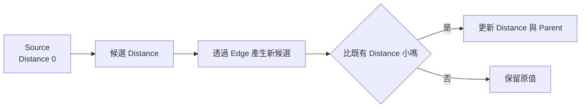
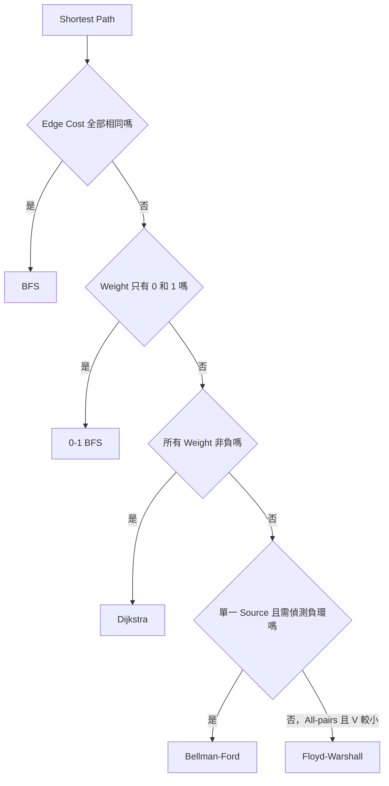
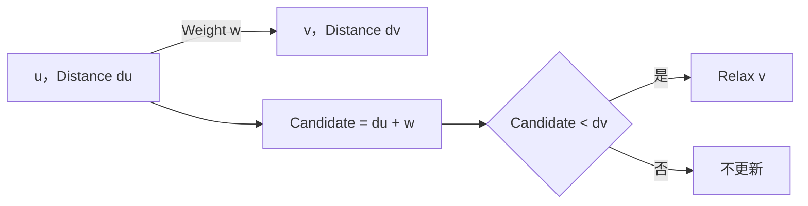
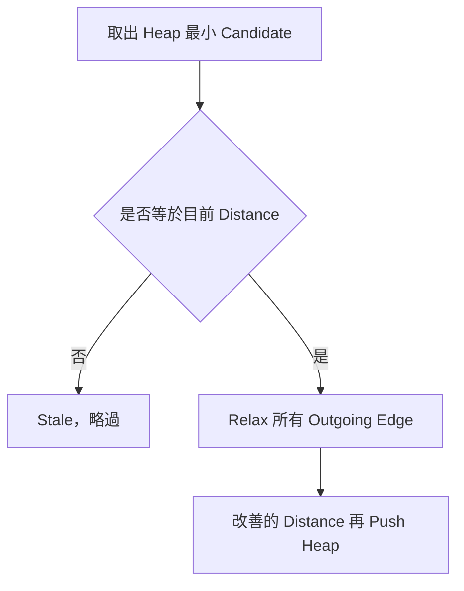
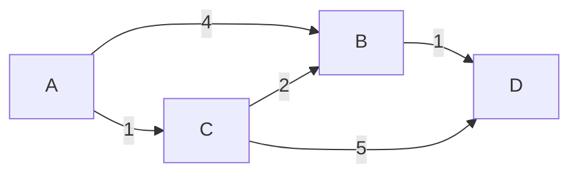
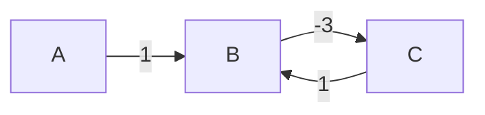
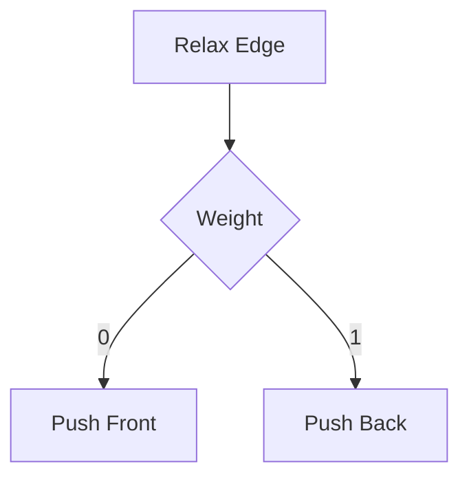
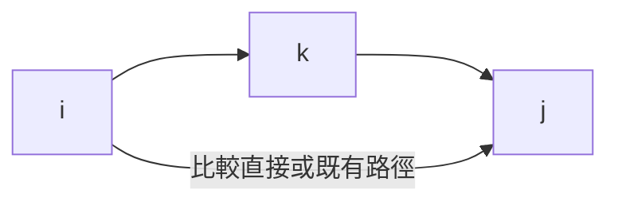

## 第 33 章　Shortest Path

### 適用範圍

本章介紹 Shortest Path 的共同模型，以及 BFS、Dijkstra、Relaxation、Stale Heap Entry、Bellman-Ford、Negative Cycle、Floyd-Warshall 與 0-1 BFS。

最短路徑題不能只看見「最短」就選一套固定方法。開始前應先確認：

- Edge 是否有 Weight。
- Weight 是否全部相同、只含 0 與 1、全部非負，或可能為負。
- 要求單一 Source、單一 Target、所有 Node，還是 All-pairs。
- 是否要還原實際 Path。
- Negative Cycle 是否可由 Source 到達，且是否影響目標。
- Distance 加法是否可能 Overflow。

### 快速導覽

- [最短路徑的共同 State](#331-最短路徑的共同-state)
- [方法選擇](#332-方法選擇)
- [BFS Shortest Path](#333-bfs-shortest-path)
- [Relaxation](#334-relaxation)
- [Dijkstra](#335-dijkstra)
- [Stale Heap Entry](#336-stale-heap-entry)
- [完整案例：Dijkstra](#337-完整案例dijkstra)
- [Bellman-Ford](#338-bellman-ford)
- [Negative Cycle](#339-negative-cycle)
- [0-1 BFS](#3310-0-1-bfs)
- [Floyd-Warshall](#3311-floyd-warshall)
- [Path 還原](#3312-path-還原)
- [複雜度與型別](#3313-複雜度與型別)
- [常見問題與判讀](#3314-常見問題與判讀)
- [本章檢查表](#3315-本章檢查表)
- [本章重點](#3316-本章重點)

### 33.1 最短路徑的共同 State

對 Source `s`，`distance[v]` 表示目前已知從 s 到 v 的最佳成本上界。

```text
distance[s] = 0
其他 Node = Infinity
```



若 Node 不可達，Distance 維持 Infinity。Infinity 應使用足夠大的 Sentinel，而且加法前需避免 `Infinity + weight`。

### 33.2 方法選擇



方法的 Precondition 比模板更重要。Dijkstra 遇到負 Weight 時，已取出的最小 Distance 仍可能被後方負 Edge 改善。

### 33.3 BFS Shortest Path

所有 Edge 成本相同時，BFS 依最少 Edge 數擴張。

```cpp
std::vector<int> bfsDistances(
    const std::vector<std::vector<int>>& graph,
    int source)
{
    std::vector<int> distance(graph.size(), -1);
    std::queue<int> pending;
    distance[source] = 0;
    pending.push(source);

    while (!pending.empty())
    {
        int node = pending.front();
        pending.pop();

        for (int next : graph[node])
        {
            if (distance[next] != -1)
            {
                continue;
            }

            distance[next] = distance[node] + 1;
            pending.push(next);
        }
    }

    return distance;
}
```

第一次入列時設定 Distance，可避免重複加入。BFS 的最短性依賴每條 Edge 成本相同。

### 33.4 Relaxation

對 Edge `u -> v`，Weight 為 w：

```text
candidate = distance[u] + w
```

若 Candidate 更小：

```text
distance[v] = candidate
parent[v] = u
```



Relaxation 是 Dijkstra、Bellman-Ford 與許多最短路方法的共同動作。

### 33.5 Dijkstra

Dijkstra 適用於所有 Edge Weight 非負。Min-heap 保存 `(candidateDistance, node)`。

```cpp
struct Edge
{
    int to;
    long long weight;
};

std::vector<long long> dijkstra(
    const std::vector<std::vector<Edge>>& graph,
    int source)
{
    const long long infinity =
        std::numeric_limits<long long>::max() / 4;

    std::vector<long long> distance(graph.size(), infinity);

    using Entry = std::pair<long long, int>;
    std::priority_queue<
        Entry,
        std::vector<Entry>,
        std::greater<Entry>> pending;

    distance[source] = 0;
    pending.push({0, source});

    while (!pending.empty())
    {
        auto [currentDistance, node] = pending.top();
        pending.pop();

        if (currentDistance != distance[node])
        {
            continue;
        }

        for (const Edge& edge : graph[node])
        {
            const long long candidate =
                currentDistance + edge.weight;

            if (candidate < distance[edge.to])
            {
                distance[edge.to] = candidate;
                pending.push({candidate, edge.to});
            }
        }
    }

    return distance;
}
```



### 33.6 Stale Heap Entry

C++ `priority_queue` 沒有直接 Decrease-key。Distance 改善時通常 Push 新 Entry，舊 Entry 留在 Heap。

```text
Heap 內可能同時有 (10, v) 與 (6, v)
目前 distance[v] = 6
```

Pop 到 `(10, v)` 時，它已過期：

```cpp
if (currentDistance != distance[node])
{
    continue;
}
```

Stale Entry 不影響正確性，但必須略過，避免重複展開與增加成本。

### 33.7 完整案例：Dijkstra



從 A：

1. 初始 A=0。
2. Relax 得 B=4、C=1。
3. 先取 C=1，改善 B=3、D=6。
4. 取 B=3，改善 D=4。
5. 舊 B=4 與 D=6 成為 Stale。

最終：

```text
A=0, C=1, B=3, D=4
```

非負 Weight 保證 Heap 取出的最新最小 Distance 不會再被未處理路徑改善。

### 33.8 Bellman-Ford

Bellman-Ford 可處理負 Weight，對全部 Edge 進行最多 `V - 1` 輪 Relaxation。

```cpp
struct WeightedEdge
{
    int from;
    int to;
    long long weight;
};

bool bellmanFord(
    int nodeCount,
    const std::vector<WeightedEdge>& edges,
    int source,
    std::vector<long long>& distance)
{
    const long long inf =
        std::numeric_limits<long long>::max() / 4;
    distance.assign(nodeCount, inf);
    distance[source] = 0;

    for (int round = 1; round < nodeCount; ++round)
    {
        bool changed = false;

        for (const auto& edge : edges)
        {
            if (distance[edge.from] == inf)
            {
                continue;
            }

            long long candidate =
                distance[edge.from] + edge.weight;

            if (candidate < distance[edge.to])
            {
                distance[edge.to] = candidate;
                changed = true;
            }
        }

        if (!changed)
        {
            break;
        }
    }

    return true;
}
```

任意無重複 Node 的最短 Path 最多有 `V - 1` 條 Edge，因此 `V - 1` 輪足以傳播所有有限最短距離。

### 33.9 Negative Cycle

第 V 輪若仍能 Relax，表示有從 Source 可達的 Negative Cycle 影響某些 Distance。



Cycle B→C→B 的總 Weight 為 -2，可不斷降低 Path Cost，因此不存在有限最短值。

只應從 `distance[from]` 有限的 Edge 判斷，避免把 Source 不可達的 Negative Cycle 誤視為 Source 最短路問題的一部分。

### 33.10 0-1 BFS

Weight 只含 0 與 1 時，使用 Deque：

- Weight 0 的改善 Push Front。
- Weight 1 的改善 Push Back。



此順序維持較小 Distance 優先，時間可達 O(V + E)。

### 33.11 Floyd-Warshall

Floyd-Warshall 計算 All-pairs Shortest Path。

State：

```text
distance[i][j] = 目前允許的中繼 Node 集合下，i 到 j 的最短距離
```

更新：

```text
d[i][j] = min(d[i][j], d[i][k] + d[k][j])
```



三層迴圈時間 O(V³)，空間 O(V²)，適合 V 較小且需要大量任意 Pair 查詢的情境。

### 33.12 Path 還原

Relax Distance 時同步設定：

```cpp
parent[next] = node;
```

Target 不可達時不能直接追蹤 Parent。多條等成本最短路徑時，單一 Parent 只保存其中一條。若要求全部最短 Path，需要保存所有符合：

```text
distance[u] + weight(u,v) == distance[v]
```

的前驅。

### 33.13 複雜度與型別

| 方法 | 適用條件 | 常見時間 |
|---|---|---:|
| BFS | 相同 Edge Cost | O(V+E) |
| 0-1 BFS | Weight 0/1 | O(V+E) |
| Dijkstra + Heap | 非負 Weight | O((V+E) log V) |
| Bellman-Ford | 可含負 Weight | O(VE) |
| Floyd-Warshall | All-pairs、V 較小 | O(V³) |

Distance 應使用足夠寬型別。加法前確認：

- 起點 Distance 不是 Infinity。
- `distance + weight` 不會超出型別範圍。

### 33.14 常見問題與判讀

| 現象 | 可能原因 | 第一輪檢查 |
|---|---|---|
| Weighted 結果錯誤 | 不同 Weight 使用 BFS | 重新選擇方法 |
| Dijkstra 在負 Edge 失敗 | 非負 Precondition 不成立 | 改用 Bellman-Ford 等方法 |
| Heap 展開很多舊資料 | 未略過 Stale Entry | 比較 Heap Distance 與目前 Distance |
| Distance Overflow | Infinity 或型別太小 | 加法前檢查並使用寬型別 |
| Bellman-Ford 誤判負環 | 未限制 Source 可達 | 只 Relax 有限 Distance 的 Edge |
| Path 還原中斷 | Parent 未在 Relax 時更新 | Distance 與 Parent 同步更新 |
| 0-1 BFS 順序錯誤 | 0 Weight 放到 Back | 0 Push Front、1 Push Back |
| Floyd-Warshall 溢位 | Infinity 仍參與加法 | 兩段都可達才相加 |

### 33.15 本章檢查表

- 我會先確認 Edge Weight 類型。
- 我能說明 Relaxation 的 Candidate 與更新條件。
- 我知道 BFS 只適用相同 Edge Cost 的最短路。
- 我知道 Dijkstra 要求所有 Weight 非負。
- 我會略過 Dijkstra 的 Stale Heap Entry。
- 我能說明 Bellman-Ford 為何需要最多 V-1 輪。
- 我能偵測 Source 可達的 Negative Cycle。
- 我知道 0-1 BFS 的 Deque 更新規則。
- 我能說明 Floyd-Warshall 的中繼 Node State。
- 我會同步更新 Parent 以還原 Path。
- 我會把 Predicate 或 Relax Cost 納入複雜度。
- 我會檢查 Infinity 與 Distance Overflow。

### 33.16 本章重點

- Shortest Path 方法由 Edge Weight、Source 數量與查詢型態決定。
- Relaxation 嘗試用一條新 Path 改善目前 Distance。
- BFS 處理相同 Edge Cost，0-1 BFS 處理 0/1 Weight，Dijkstra 處理非負 Weight。
- Dijkstra 可保留多個 Heap Entry，但需略過 Stale Entry。
- Bellman-Ford 可處理負 Weight，額外一輪 Relax 可偵測 Source 可達的 Negative Cycle。
- Floyd-Warshall 使用中繼 Node DP 計算 All-pairs Shortest Path。
- Parent 應在 Distance 改善時同步更新。
- Distance 型別、Infinity 與加法 Overflow 都屬於正確性的一部分。
