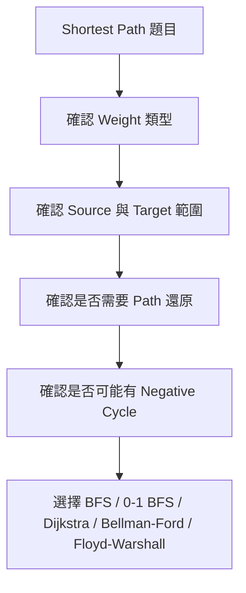
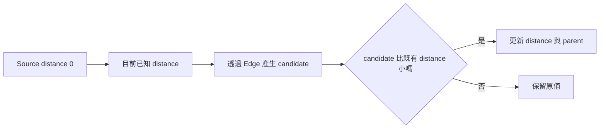
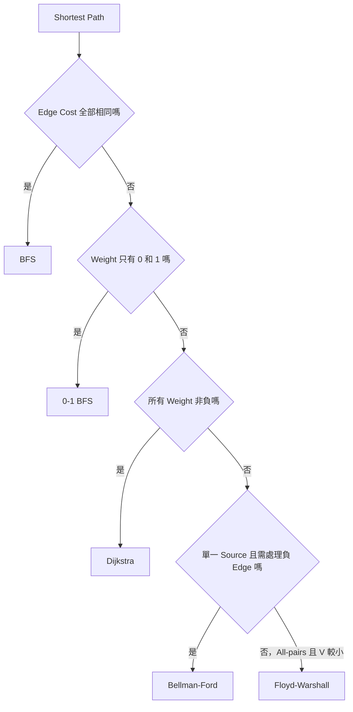
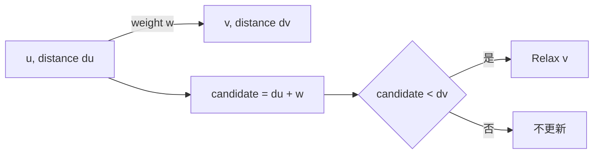
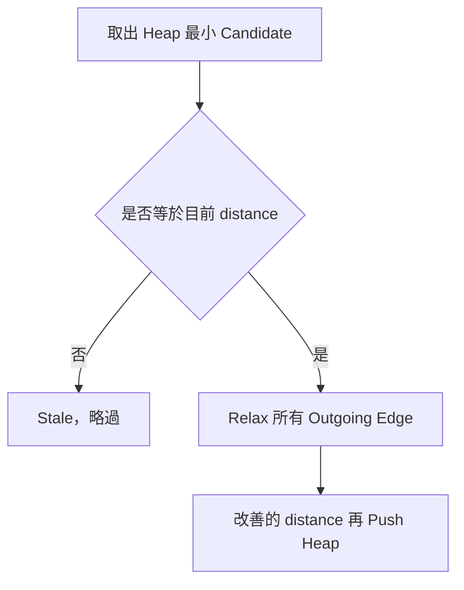
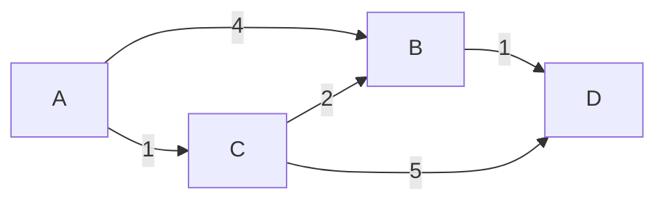
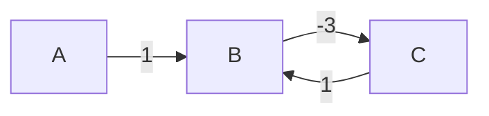
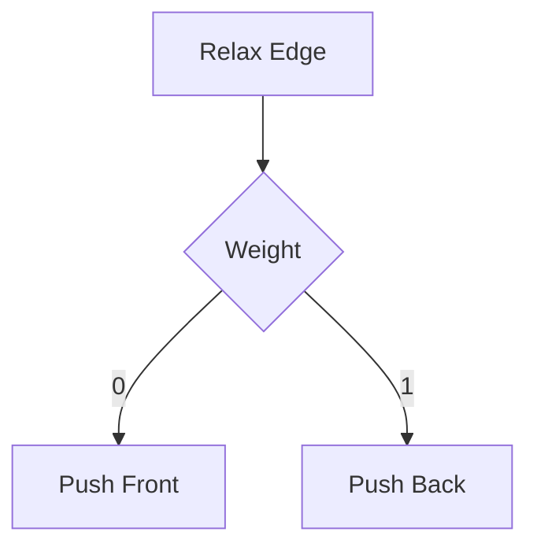
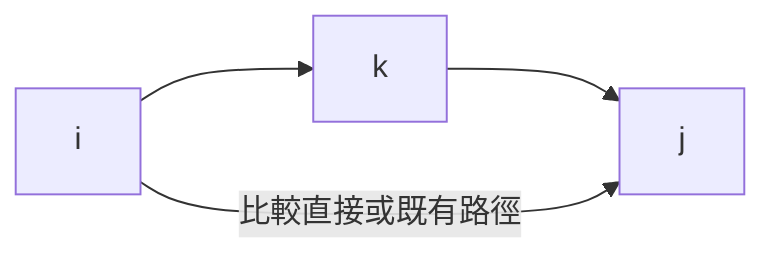

## 第 33 章　Shortest Path

### 適用範圍

本章介紹 Shortest Path 的共同模型，以及 BFS、Dijkstra、Relaxation、Stale Heap Entry、Bellman-Ford、Negative Cycle、Floyd-Warshall 與 0-1 BFS。

最短路徑題不能只看見「最短」就選一套固定方法。開始前應先確認：

- Edge 是否有 Weight。
- Weight 是否全部相同、只含 0 與 1、全部非負，或可能為負。
- 要求單一 Source、單一 Target、所有 Node，還是 All-pairs。
- 是否要還原實際 Path。
- Negative Cycle 是否可由 Source 到達，且是否影響目標。
- Distance 加法是否可能 Overflow。

原始章節已把方法選擇重點整理成：相同 Edge Cost 用 BFS，Weight 為 0/1 可用 0-1 BFS，所有 Weight 非負用 Dijkstra，可能有負 Weight 且需偵測負環可用 Bellman-Ford，All-pairs 且 V 較小可用 Floyd-Warshall。citeturn37search1



### 適用讀者

- 看到「最短」就不確定要用 BFS、Dijkstra 還是 DP 的讀者。
- 已會寫 BFS，但不清楚為什麼 Weighted Graph 不能直接套用的讀者。
- 會寫 Dijkstra，但不理解 Stale Heap Entry 的讀者。
- 對 Bellman-Ford 的 `V - 1` 輪與 Negative Cycle 偵測不熟的讀者。
- 想理解 Floyd-Warshall 的中繼 Node DP 定義的讀者。
- 常在 Infinity、Parent、Overflow 與不可達 Node 上出錯的讀者。

### 快速導覽

- [33.1 最短路徑的共同 State](#331-最短路徑的共同-state)
- [33.2 方法選擇](#332-方法選擇)
- [33.3 BFS Shortest Path](#333-bfs-shortest-path)
- [33.4 Relaxation](#334-relaxation)
- [33.5 Dijkstra](#335-dijkstra)
- [33.6 Stale Heap Entry](#336-stale-heap-entry)
- [33.7 完整案例：Dijkstra](#337-完整案例dijkstra)
- [33.8 Bellman-Ford](#338-bellman-ford)
- [33.9 Negative Cycle](#339-negative-cycle)
- [33.10 0-1 BFS](#3310-0-1-bfs)
- [33.11 Floyd-Warshall](#3311-floyd-warshall)
- [33.12 Path 還原](#3312-path-還原)
- [33.13 Dijkstra、Bellman-Ford、Floyd-Warshall 的差異](#3313-dijkstrabellman-fordfloyd-warshall-的差異)
- [33.14 複雜度與型別](#3314-複雜度與型別)
- [33.15 常見問題與判讀](#3315-常見問題與判讀)
- [33.16 本章檢查表](#3316-本章檢查表)
- [33.17 本章重點](#3317-本章重點)

### 33.1 最短路徑的共同 State

對 Source `s`，最短路徑演算法通常維護：

```text
distance[v] = 目前已知從 s 到 v 的最佳成本上界
```

初始化：

```text
distance[s] = 0
其他 Node = Infinity
```

原始章節也以同樣方式定義共同 State，並指出不可達 Node 的 Distance 會維持 Infinity。citeturn37search1



#### Distance 是「目前已知上界」

在演算法過程中，`distance[v]` 不一定一開始就是最終答案。它代表目前找到的最好路徑成本。

例如：

```text
一開始只知道 A -> B 成本 10
之後發現 A -> C -> B 成本 3
```

此時 `distance[B]` 會從 10 更新成 3。

#### Infinity 要小心

Infinity 是 Sentinel，不是真正數學無限大。加法前要檢查：

```cpp
if (distance[u] != infinity)
{
    long long candidate = distance[u] + weight;
}
```

原始章節也提醒，Infinity 應使用足夠大的 Sentinel，而且加法前需避免 `Infinity + weight`。citeturn37search1

### 33.2 方法選擇

先用 Edge Weight 類型分流。



#### 方法選擇表

| 條件 | 方法 | 主要理由 |
|---|---|---|
| 無權重或所有 Edge Cost 相同 | BFS | 依 Layer 擴張，第一次到達就是最少 Edge 數 |
| Weight 只有 0 與 1 | 0-1 BFS | Deque 維持較小 Distance 優先 |
| 所有 Weight 非負 | Dijkstra | 已取出的最小 Distance 不會再被改善 |
| 可能有負 Weight | Bellman-Ford | 反覆 Relax，可處理負 Edge |
| All-pairs 且 V 較小 | Floyd-Warshall | 以中繼 Node 做 DP |

#### Dijkstra 為什麼不能有負 Weight

Dijkstra 的核心假設是：當某個 Node 以目前最小 Distance 從 Heap 取出時，它的 Distance 已經確定。如果後面有負 Edge，可能出現一條較晚才發現的路徑，把已取出的 Node 再改善。

原始章節也提醒，Dijkstra 遇到負 Weight 時，已取出的最小 Distance 仍可能被後方負 Edge 改善。citeturn37search1

### 33.3 BFS Shortest Path

所有 Edge 成本相同時，BFS 依最少 Edge 數擴張。

BFS 的核心 Invariant：

```text
Queue 中越早出現的 Node，Distance 不會比後面 Node 大。
```

因此第一次到達某 Node 時，就是從 Source 到該 Node 的最少 Edge 數。

#### C++ 實作

```cpp
#include <queue>
#include <vector>

std::vector<int> bfsDistances(
    const std::vector<std::vector<int>>& graph,
    int source)
{
    std::vector<int> distance(graph.size(), -1);
    std::queue<int> pending;

    distance[source] = 0;
    pending.push(source);

    while (!pending.empty())
    {
        int node = pending.front();
        pending.pop();

        for (int next : graph[node])
        {
            if (distance[next] != -1)
            {
                continue;
            }

            distance[next] = distance[node] + 1;
            pending.push(next);
        }
    }

    return distance;
}
```

原始章節也指出，第一次入列時設定 Distance，可避免重複加入；BFS 的最短性依賴每條 Edge 成本相同。citeturn37search1

#### BFS 常見錯誤

- Weighted Graph 直接使用 BFS。
- 出列時才標記 visited，導致同一 Node 重複入列。
- 忘記處理不可達 Node。
- 多 Source BFS 時，沒有把所有 Source 初始化為 0。

### 33.4 Relaxation

Relaxation 是許多最短路方法的共同動作。

對 Edge `u -> v`，Weight 為 `w`：

```text
candidate = distance[u] + w
```

若 candidate 更小：

```text
distance[v] = candidate
parent[v] = u
```



原始章節也定義了相同的 Relaxation 行為，並指出它是 Dijkstra、Bellman-Ford 與許多最短路方法的共同動作。citeturn37search1

#### Relaxation 的三個安全檢查

1. `distance[u]` 不是 Infinity。
2. `distance[u] + w` 不會 Overflow。
3. 若需要 Path 還原，`parent[v]` 要同步更新。

#### Directed 與 Undirected

如果 Graph 是 Undirected，Edge `(u, v, w)` 通常要建兩條方向：

```cpp
graph[u].push_back({v, w});
graph[v].push_back({u, w});
```

如果只建單向，最短路結果會少很多候選路徑。

### 33.5 Dijkstra

Dijkstra 適用於所有 Edge Weight 非負。

Min-heap 保存：

```text
(candidateDistance, node)
```

每次取出 Heap 中最小 candidate，若它仍是目前最新距離，就展開它的 Outgoing Edge。



#### C++ 實作

```cpp
#include <functional>
#include <limits>
#include <queue>
#include <vector>

struct Edge
{
    int to;
    long long weight;
};

std::vector<long long> dijkstra(
    const std::vector<std::vector<Edge>>& graph,
    int source)
{
    const long long infinity =
        std::numeric_limits<long long>::max() / 4;

    std::vector<long long> distance(graph.size(), infinity);

    using Entry = std::pair<long long, int>;
    std::priority_queue<
        Entry,
        std::vector<Entry>,
        std::greater<Entry>> pending;

    distance[source] = 0;
    pending.push({0, source});

    while (!pending.empty())
    {
        auto [currentDistance, node] = pending.top();
        pending.pop();

        if (currentDistance != distance[node])
        {
            continue;
        }

        for (const Edge& edge : graph[node])
        {
            long long candidate = currentDistance + edge.weight;

            if (candidate < distance[edge.to])
            {
                distance[edge.to] = candidate;
                pending.push({candidate, edge.to});
            }
        }
    }

    return distance;
}
```

#### Dijkstra 的正確性直覺

因為所有 Edge Weight 非負，若某個 Node `u` 是目前 Heap 中最小 Distance，任何尚未處理的繞路都至少不會讓距離變小到比 `distance[u]` 更低。因此 `u` 的最短距離可以確定。

原始章節也在 Dijkstra 案例中指出，非負 Weight 保證 Heap 取出的最新最小 Distance 不會再被未處理路徑改善。citeturn37search1

### 33.6 Stale Heap Entry

C++ `priority_queue` 沒有直接 Decrease-key。Distance 改善時，常見做法是 Push 新 Entry，舊 Entry 留在 Heap。

```text
Heap 內可能同時有：
(10, v)
(6, v)

目前 distance[v] = 6
```

Pop 到 `(10, v)` 時，它已過期：

```cpp
if (currentDistance != distance[node])
{
    continue;
}
```

原始章節也指出，Stale Entry 不影響正確性，但必須略過，避免重複展開與增加成本。citeturn37search1

#### 如果不略過會怎樣

不略過通常仍可能得到正確答案，但會做很多重複 Relax，造成效能變差。若程式在其他地方假設每個 Node 只展開一次，也可能產生邏輯錯誤。

#### Stale Entry Debug

若 Dijkstra 很慢，可記錄：

```text
Pop 次數
有效 Pop 次數
Stale Pop 次數
Push 次數
```

若 Stale 很多，通常是 Graph 中候選改善很多，這在 Lazy Dijkstra 中是正常現象，但仍應確認有正確略過。

### 33.7 完整案例：Dijkstra

Graph：



從 A 出發。

#### 初始

```text
distance[A] = 0
distance[B] = INF
distance[C] = INF
distance[D] = INF
Heap = (0, A)
```

#### Step 1：取 A

Relax A 的 Edge：

```text
A -> B: 0 + 4 = 4，所以 B = 4
A -> C: 0 + 1 = 1，所以 C = 1
```

Heap：

```text
(1, C), (4, B)
```

#### Step 2：取 C

Relax C 的 Edge：

```text
C -> B: 1 + 2 = 3，比 B=4 小，所以 B=3
C -> D: 1 + 5 = 6，所以 D=6
```

Heap：

```text
(3, B), (4, B stale), (6, D)
```

#### Step 3：取 B

Relax B 的 Edge：

```text
B -> D: 3 + 1 = 4，比 D=6 小，所以 D=4
```

Heap：

```text
(4, B stale), (4, D), (6, D stale)
```

#### Step 4：略過 Stale B，取 D

最終：

```text
A = 0
C = 1
B = 3
D = 4
```

原始章節也用這個案例說明舊 B=4 與 D=6 會成為 Stale。citeturn37search1

### 33.8 Bellman-Ford

Bellman-Ford 可處理負 Weight。它對全部 Edge 進行最多 `V - 1` 輪 Relaxation。

#### 為什麼是 V - 1 輪

若最短路徑沒有重複 Node，最多包含 `V - 1` 條 Edge。每一輪 Relaxation 最多讓使用多一條 Edge 的最短資訊往前傳播。因此 `V - 1` 輪足以傳播所有有限最短距離。

原始章節也用相同理由說明 Bellman-Ford 的輪數。citeturn37search1

#### C++ 實作

```cpp
#include <limits>
#include <vector>

struct WeightedEdge
{
    int from;
    int to;
    long long weight;
};

bool bellmanFord(
    int nodeCount,
    const std::vector<WeightedEdge>& edges,
    int source,
    std::vector<long long>& distance)
{
    const long long inf =
        std::numeric_limits<long long>::max() / 4;

    distance.assign(nodeCount, inf);
    distance[source] = 0;

    for (int round = 1; round < nodeCount; ++round)
    {
        bool changed = false;

        for (const auto& edge : edges)
        {
            if (distance[edge.from] == inf)
            {
                continue;
            }

            long long candidate = distance[edge.from] + edge.weight;

            if (candidate < distance[edge.to])
            {
                distance[edge.to] = candidate;
                changed = true;
            }
        }

        if (!changed)
        {
            break;
        }
    }

    return true;
}
```

#### Early Stop

如果某一輪沒有任何 Distance 被改善，代表已經穩定，可以提前停止。

### 33.9 Negative Cycle

第 V 輪若仍能 Relax，表示有從 Source 可達的 Negative Cycle 影響某些 Distance。



Cycle `B -> C -> B` 的總 Weight：

```text
-3 + 1 = -2
```

可不斷降低 Path Cost，因此不存在有限最短值。

原始章節也提醒，只應從 `distance[from]` 有限的 Edge 判斷，避免把 Source 不可達的 Negative Cycle 誤視為 Source 最短路問題的一部分。citeturn37search1

#### 偵測流程

在 `V - 1` 輪後，再額外掃描所有 Edge：

```cpp
bool hasNegativeCycleReachableFromSource(
    const std::vector<WeightedEdge>& edges,
    const std::vector<long long>& distance,
    long long inf)
{
    for (const auto& edge : edges)
    {
        if (distance[edge.from] == inf)
        {
            continue;
        }

        if (distance[edge.from] + edge.weight < distance[edge.to])
        {
            return true;
        }
    }

    return false;
}
```

#### Negative Cycle 是否影響 Target

若題目是 Source 到某個 Target 的最短路，還要確認 Negative Cycle 是否能影響 Target。

可能情況：

- Negative Cycle 從 Source 不可達：不影響。
- Negative Cycle 可達，但無法到 Target：不影響 Target 路徑。
- Negative Cycle 可由 Source 到達，且能到 Target：Target 沒有有限最短值。

### 33.10 0-1 BFS

Weight 只含 0 與 1 時，可以使用 Deque。

規則：

- Weight 0 的改善 Push Front。
- Weight 1 的改善 Push Back。



原始章節也指出，這個順序維持較小 Distance 優先，時間可達 O(V + E)。citeturn37search1

#### C++ 實作

```cpp
#include <deque>
#include <limits>
#include <vector>

struct ZeroOneEdge
{
    int to;
    int weight; // 0 or 1
};

std::vector<int> zeroOneBfs(
    const std::vector<std::vector<ZeroOneEdge>>& graph,
    int source)
{
    const int inf = std::numeric_limits<int>::max() / 4;
    std::vector<int> distance(graph.size(), inf);
    std::deque<int> pending;

    distance[source] = 0;
    pending.push_front(source);

    while (!pending.empty())
    {
        int node = pending.front();
        pending.pop_front();

        for (const auto& edge : graph[node])
        {
            int candidate = distance[node] + edge.weight;

            if (candidate < distance[edge.to])
            {
                distance[edge.to] = candidate;

                if (edge.weight == 0)
                {
                    pending.push_front(edge.to);
                }
                else
                {
                    pending.push_back(edge.to);
                }
            }
        }
    }

    return distance;
}
```

#### 0-1 BFS 常見錯誤

- Weight 0 也 push back，破壞距離優先順序。
- Weight 不是 0/1 卻套用 0-1 BFS。
- 使用普通 BFS 處理 0/1 Weight，導致結果錯誤。

### 33.11 Floyd-Warshall

Floyd-Warshall 計算 All-pairs Shortest Path。

State：

```text
distance[i][j] = 目前允許的中繼 Node 集合下，i 到 j 的最短距離
```

更新：

```text
distance[i][j] = min(distance[i][j], distance[i][k] + distance[k][j])
```



原始章節也說明 Floyd-Warshall 的時間為 O(V³)，空間為 O(V²)，適合 V 較小且需要大量任意 Pair 查詢的情境。citeturn37search1

#### k 為什麼在最外層

Floyd-Warshall 的 DP 語意是：逐步允許更多中繼 Node。當外層固定 k 時，表示考慮是否讓路徑經過 k。

正確迴圈順序：

```cpp
for (int k = 0; k < n; ++k)
{
    for (int i = 0; i < n; ++i)
    {
        for (int j = 0; j < n; ++j)
        {
            // update distance[i][j]
        }
    }
}
```

#### Infinity 加法

要確認兩段都可達才相加：

```cpp
if (distance[i][k] != inf && distance[k][j] != inf)
{
    distance[i][j] = std::min(
        distance[i][j],
        distance[i][k] + distance[k][j]);
}
```

### 33.12 Path 還原

如果只要求 Distance，不需要 Parent。如果要輸出實際 Path，Relax Distance 時要同步設定 Parent。

```cpp
parent[next] = node;
```

原始章節也提醒，Target 不可達時不能直接追蹤 Parent；多條等成本最短路徑時，單一 Parent 只保存其中一條。citeturn37search1

#### 單一路徑還原

假設已保存 `parent[v]`：

```cpp
std::vector<int> restorePath(
    int source,
    int target,
    const std::vector<int>& parent)
{
    std::vector<int> path;

    for (int node = target; node != -1; node = parent[node])
    {
        path.push_back(node);

        if (node == source)
        {
            break;
        }
    }

    if (path.back() != source)
    {
        return {}; // unreachable
    }

    std::reverse(path.begin(), path.end());
    return path;
}
```

#### 全部最短路前驅

若要求全部最短 Path，需要保存所有符合以下條件的前驅：

```text
distance[u] + weight(u, v) == distance[v]
```

這會形成 Shortest Path DAG，但若有 0 Weight Cycle，還需要額外小心路徑數量與重複問題。

### 33.13 Dijkstra、Bellman-Ford、Floyd-Warshall 的差異

| 項目 | Dijkstra | Bellman-Ford | Floyd-Warshall |
|---|---|---|---|
| Query 型態 | Single Source | Single Source | All-pairs |
| Weight 條件 | 非負 | 可含負 Weight | 可含負 Weight，但需處理負環語意 |
| 負環偵測 | 不適用 | 可偵測 Source 可達負環 | 可用 `distance[i][i] < 0` 判斷相關負環 |
| 常見時間 | O((V+E) log V) | O(VE) | O(V³) |
| 常見表示 | Adjacency List | Edge List | Matrix |
| 適合情境 | Sparse、非負 Weight | 需要負 Edge 或負環檢查 | V 較小且需要任意 Pair 查詢 |

### 33.14 複雜度與型別

| 方法 | 適用條件 | 常見時間 | 空間 |
|---|---|---:|---:|
| BFS | 相同 Edge Cost | O(V + E) | O(V) |
| 0-1 BFS | Weight 0/1 | O(V + E) | O(V) |
| Dijkstra + Heap | 非負 Weight | O((V + E) log V) | O(V + E) |
| Bellman-Ford | 可含負 Weight | O(VE) | O(V) |
| Floyd-Warshall | All-pairs、V 較小 | O(V³) | O(V²) |

原始章節也列出這些常見複雜度，並提醒 Distance 應使用足夠寬型別。citeturn37search1

#### 型別檢查

Distance 加法前確認：

- 起點 Distance 不是 Infinity。
- `distance + weight` 不會超出型別範圍。
- Edge Weight 與 Path 長度的乘積是否可能超過 int。

建議使用：

```cpp
const long long inf = std::numeric_limits<long long>::max() / 4;
```

保留餘裕可以降低加法 Overflow 的風險，但仍應估算最大合法 Path Cost。

### 33.15 常見問題與判讀

原始章節已整理常見問題，例如 Weighted Graph 使用 BFS、Dijkstra 遇到負 Edge、未略過 Stale Entry、Distance Overflow、Bellman-Ford 誤判負環、Parent 未同步更新、0-1 BFS 順序錯誤、Floyd-Warshall Infinity 參與加法。citeturn37search1

| 現象 | 可能原因 | 第一輪檢查 |
|---|---|---|
| Weighted 結果錯誤 | 不同 Weight 使用 BFS | 重新選擇方法 |
| Dijkstra 在負 Edge 失敗 | 非負 Precondition 不成立 | 改用 Bellman-Ford 等方法 |
| Heap 展開很多舊資料 | 未略過 Stale Entry | 比較 Heap Distance 與目前 Distance |
| Distance Overflow | Infinity 或型別太小 | 加法前檢查並使用寬型別 |
| Bellman-Ford 誤判負環 | 未限制 Source 可達 | 只 Relax 有限 Distance 的 Edge |
| Path 還原中斷 | Parent 未在 Relax 時更新 | Distance 與 Parent 同步更新 |
| 0-1 BFS 順序錯誤 | 0 Weight 放到 Back | 0 Push Front、1 Push Back |
| Floyd-Warshall 溢位 | Infinity 仍參與加法 | 兩段都可達才相加 |
| Undirected Graph 少路徑 | 只建單向 Edge | 雙向加入 |
| Target 不可達卻追 Parent | 沒先檢查 Distance | 不可達時不要還原 Path |

### 33.16 本章檢查表

- 我會先確認 Edge Weight 類型。
- 我能依 Weight 條件選 BFS、0-1 BFS、Dijkstra、Bellman-Ford 或 Floyd-Warshall。
- 我能說明 Relaxation 的 Candidate 與更新條件。
- 我知道 BFS 只適用相同 Edge Cost 的最短路。
- 我知道 Dijkstra 要求所有 Weight 非負。
- 我會略過 Dijkstra 的 Stale Heap Entry。
- 我能說明 Bellman-Ford 為何需要最多 `V - 1` 輪。
- 我能偵測 Source 可達的 Negative Cycle。
- 我知道 0-1 BFS 的 Deque 更新規則。
- 我能說明 Floyd-Warshall 的中繼 Node State。
- 我會同步更新 Parent 以還原 Path。
- 我會把 Predicate 或 Relax Cost 納入複雜度。
- 我會檢查 Infinity 與 Distance Overflow。
- 我知道不可達 Target 不能直接追 Parent。
- 我知道多條等成本最短路時，單一 Parent 只保存其中一條。

### 33.17 本章重點

- Shortest Path 方法由 Edge Weight、Source 數量與查詢型態決定。
- `distance[v]` 表示目前已知從 Source 到 v 的最佳成本上界。
- Relaxation 嘗試用一條新 Path 改善目前 Distance。
- BFS 處理相同 Edge Cost，0-1 BFS 處理 0/1 Weight，Dijkstra 處理非負 Weight。
- Dijkstra 可保留多個 Heap Entry，但需略過 Stale Entry。
- Bellman-Ford 可處理負 Weight，額外一輪 Relax 可偵測 Source 可達的 Negative Cycle。
- Negative Cycle 必須和 Source / Target 可達性一起判斷。
- Floyd-Warshall 使用中繼 Node DP 計算 All-pairs Shortest Path。
- Parent 應在 Distance 改善時同步更新。
- Distance 型別、Infinity 與加法 Overflow 都屬於正確性的一部分。
