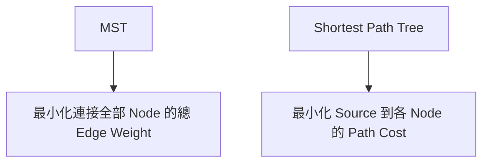
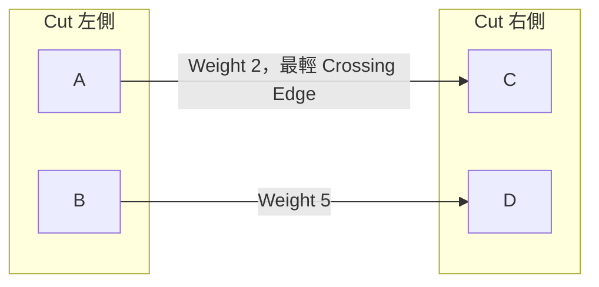
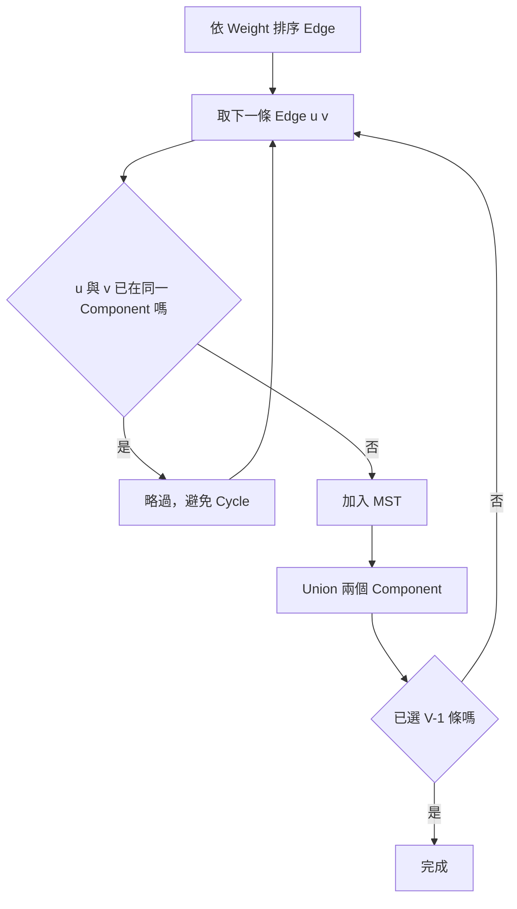
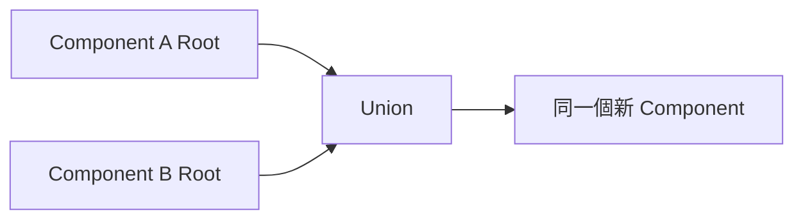
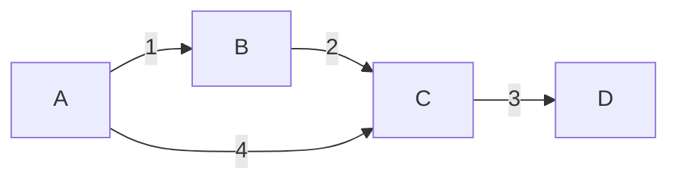
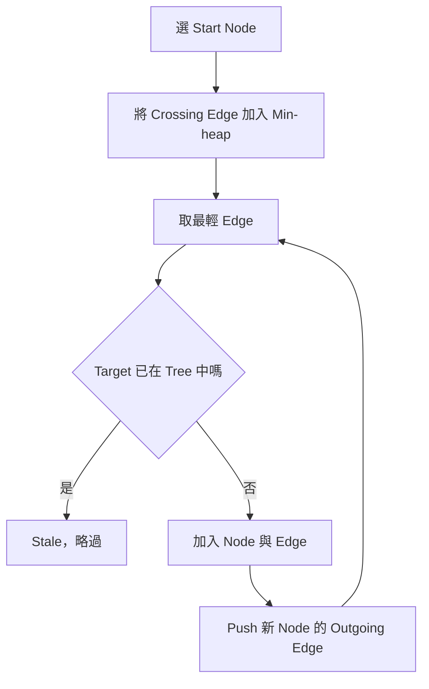
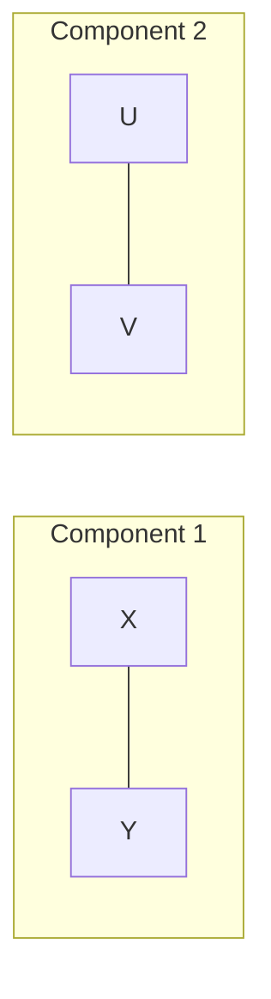

## 第 34 章　Minimum Spanning Tree

### 適用範圍

本章介紹 Minimum Spanning Tree，簡稱 MST，包括 Spanning Tree、Cut Property、Kruskal、Disjoint Set Union、Prim、Minimum Spanning Forest，以及 MST 與 Shortest Path 的差異。

MST 的目標是用最小總 Edge Weight 連接所有 Node，而且結果不能含 Cycle。它不是從某個 Source 到其他 Node 的最短路徑集合。

### 快速導覽

- [Spanning Tree](#341-spanning-tree)
- [MST 與 Shortest Path](#342-mst-與-shortest-path)
- [Cut Property](#343-cut-property)
- [Kruskal](#344-kruskal)
- [DSU](#345-dsu)
- [完整案例：Kruskal](#346-完整案例kruskal)
- [Prim](#347-prim)
- [完整案例：Prim](#348-完整案例prim)
- [不連通 Graph](#349-不連通-graph)
- [唯一性與負 Weight](#3410-唯一性與負-weight)
- [複雜度](#3411-複雜度)
- [常見問題與判讀](#3412-常見問題與判讀)
- [本章檢查表](#3413-本章檢查表)
- [本章重點](#3414-本章重點)

### 34.1 Spanning Tree

對 Connected Undirected Graph，Spanning Tree：

- 包含所有 V 個 Node。
- Connected。
- 不含 Cycle。
- 恰好有 V - 1 條 Edge。


Minimum Spanning Tree 是總 Weight 最小的 Spanning Tree。

若選入 V - 1 條 Edge 且 Graph Connected，就不可能仍含 Cycle。反之，V 個 Node 的 Connected Acyclic Graph 必有 V - 1 條 Edge。

### 34.2 MST 與 Shortest Path



MST 中 Source 到某 Node 的 Path 不一定最短；Shortest Path Tree 的總 Edge Weight 也不一定最小。

因此「連接所有城市的最低建設成本」較像 MST；「由城市 S 到各城市的最低旅行成本」較像 Shortest Path。

### 34.3 Cut Property

Cut 將 Node 分成兩個不相交集合。跨越 Cut 的 Edge 連接兩側。

Cut Property：對任意尊重目前安全 Edge 的 Cut，最輕的 Crossing Edge 可以安全加入某棵 MST。



Exchange Argument：若某棵 MST 沒有選最輕 Crossing Edge e，加入 e 會形成 Cycle。該 Cycle 中另有一條 Crossing Edge f，且 `weight(e) <= weight(f)`。以 e 取代 f 不會增加總成本。

### 34.4 Kruskal

Kruskal 依 Weight 由小到大檢查 Edge。若 Edge 連接兩個不同 Component，就加入；若兩端已連通，加入會形成 Cycle，因此略過。



### 34.5 DSU

Disjoint Set Union 維護 Component：

- `find(x)`：取得代表 Root。
- `unite(a,b)`：合併兩個 Component。
- Path Compression：壓縮尋找路徑。
- Union by Size/Rank：小 Tree 接到大 Tree。

```cpp
class Dsu
{
public:
    explicit Dsu(int n)
        : parent(n), size(n, 1)
    {
        std::iota(parent.begin(), parent.end(), 0);
    }

    int find(int x)
    {
        if (parent[x] != x)
        {
            parent[x] = find(parent[x]);
        }
        return parent[x];
    }

    bool unite(int a, int b)
    {
        a = find(a);
        b = find(b);

        if (a == b)
        {
            return false;
        }

        if (size[a] < size[b])
        {
            std::swap(a, b);
        }

        parent[b] = a;
        size[a] += size[b];
        return true;
    }

private:
    std::vector<int> parent;
    std::vector<int> size;
};
```



### 34.6 完整案例：Kruskal

```cpp
struct Edge
{
    int u;
    int v;
    long long weight;
};

std::optional<long long> kruskalMst(
    int nodeCount,
    std::vector<Edge> edges)
{
    std::sort(
        edges.begin(),
        edges.end(),
        [](const Edge& a, const Edge& b)
        {
            return a.weight < b.weight;
        });

    Dsu dsu(nodeCount);
    long long total = 0;
    int selected = 0;

    for (const Edge& edge : edges)
    {
        if (!dsu.unite(edge.u, edge.v))
        {
            continue;
        }

        total += edge.weight;
        ++selected;

        if (selected == nodeCount - 1)
        {
            break;
        }
    }

    if (selected != nodeCount - 1)
    {
        return std::nullopt;
    }

    return total;
}
```



依序選 Weight 1、2、3；Weight 4 會在 A、C 已連通後形成 Cycle，因此略過。

Kruskal Invariant：已選 Edge 無 Cycle，而且可擴充成某棵 MST。

### 34.7 Prim

Prim 從任一 Start Node 建立單一 Tree，每次選擇由已加入集合跨到未加入集合的最輕 Edge。



```cpp
struct AdjacentEdge
{
    int to;
    long long weight;
};

std::optional<long long> primMst(
    const std::vector<std::vector<AdjacentEdge>>& graph)
{
    if (graph.empty())
    {
        return 0;
    }

    using Entry = std::pair<long long, int>;
    std::priority_queue<
        Entry,
        std::vector<Entry>,
        std::greater<Entry>> pending;

    std::vector<bool> included(graph.size(), false);
    pending.push({0, 0});

    long long total = 0;
    int count = 0;

    while (!pending.empty())
    {
        auto [weight, node] = pending.top();
        pending.pop();

        if (included[node])
        {
            continue;
        }

        included[node] = true;
        total += weight;
        ++count;

        for (const auto& edge : graph[node])
        {
            if (!included[edge.to])
            {
                pending.push({edge.weight, edge.to});
            }
        }
    }

    if (count != static_cast<int>(graph.size()))
    {
        return std::nullopt;
    }

    return total;
}
```

### 34.8 完整案例：Prim

Start A：

1. Tree `{A}`，候選 A-B(1)、A-C(4)。
2. 選 A-B(1)。
3. 新候選 B-C(2)，比 A-C(4) 輕，選 B-C(2)。
4. 選 C-D(3)。

每次使用 Cut Property，選目前 Tree 與外部之間的最輕 Crossing Edge。

Prim Heap 可能保留指向已加入 Node 的舊 Entry，Pop 時以 `included[node]` 略過。

### 34.9 不連通 Graph

不連通 Undirected Graph 不存在涵蓋所有 Node 的 Spanning Tree。



Kruskal 最後選不到 V - 1 條 Edge；Prim 從單一起點只能加入該 Component。

若需求是 Minimum Spanning Forest，可以對每個 Component 建立 MST，而不是回報失敗。

### 34.10 唯一性與負 Weight

MST 允許負 Weight。Kruskal 會優先選取負 Edge，只要不形成 Cycle。

MST 不一定唯一。若多條 Crossing Edge Weight 相同，可能有多種總成本相同的 MST。

若所有 Edge Weight 互異，MST 一定唯一。Weight 重複不代表一定不唯一，只表示可能不唯一。

### 34.11 複雜度

| 方法 | 常見時間 | 適合表示 |
|---|---:|---|
| Kruskal + DSU | O(E log E) | Edge List |
| Prim + Binary Heap | O((V+E) log V) | Adjacency List |
| Prim + Matrix | O(V²) | Dense Graph |

DSU 經 Path Compression 與 Union by Size 後，每次操作為接近常數的攤銷成本。

### 34.12 常見問題與判讀

| 現象 | 可能原因 | 第一輪檢查 |
|---|---|---|
| 選到 Cycle | 未先檢查 Component | Kruskal 使用 DSU |
| 最後少 Node | Graph 不連通 | 選中 Edge 或 Included Node 數 |
| Prim 重複加入成本 | 未略過已 Included Node | Pop Heap 時檢查 |
| 把 MST 當最短路 | 目標函式不同 | 全域連接成本或 Source Path Cost |
| Undirected Graph 只建單向 | Adjacency 遺漏反向 Edge | 兩方向都加入 |
| DSU Union 錯誤 | 未先 Find Root | 只合併代表 Root |
| 總成本 Overflow | 使用 int | 改用 long long |
| 誤認 MST 唯一 | Weight 重複 | 分析 Cut 上是否有等重候選 |

### 34.13 本章檢查表

- 我能定義 Spanning Tree 與 V-1 條 Edge。
- 我能區分 MST 與 Shortest Path Tree。
- 我能使用 Cut Property 說明安全 Edge。
- 我知道 Kruskal 依 Weight 排序並使用 DSU 避免 Cycle。
- 我能說明 DSU Find、Union、Path Compression 與 Size。
- 我會檢查最後是否選到 V-1 條 Edge。
- 我知道 Prim 每次選目前 Tree 的最輕 Crossing Edge。
- 我會略過 Prim Heap 中指向已加入 Node 的 Entry。
- 我能處理不連通 Graph 或回傳 Minimum Spanning Forest。
- 我知道負 Weight 不會使 MST 定義失效。
- 我能依 Sparse、Dense 與輸入表示選擇 Kruskal 或 Prim。
- 我會使用較寬型別累加總成本。

### 34.14 本章重點

- MST 以最小總 Weight 連接 Undirected Graph 的全部 Node，結果 Connected 且無 Cycle。
- Spanning Tree 恰好有 V-1 條 Edge。
- Cut Property 是 Kruskal 與 Prim 的共同正確性基礎。
- Kruskal 由全域最輕 Edge 開始，使用 DSU 判斷是否連接不同 Component。
- Prim 從一棵局部 Tree 向外選最輕 Crossing Edge。
- 不連通 Graph 沒有單一 MST，但可建立 Minimum Spanning Forest。
- MST 與 Shortest Path 的目標函式不同，不能互相替代。
- Kruskal 常為 O(E log E)，Heap Prim 常為 O((V+E) log V)。
