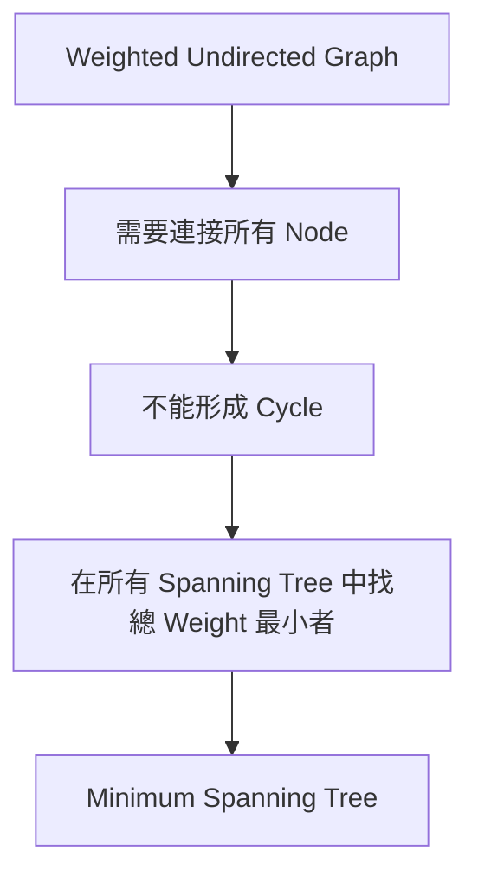
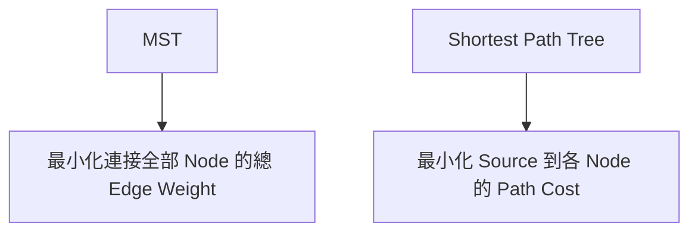
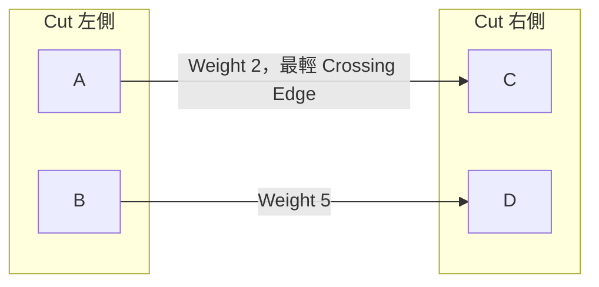
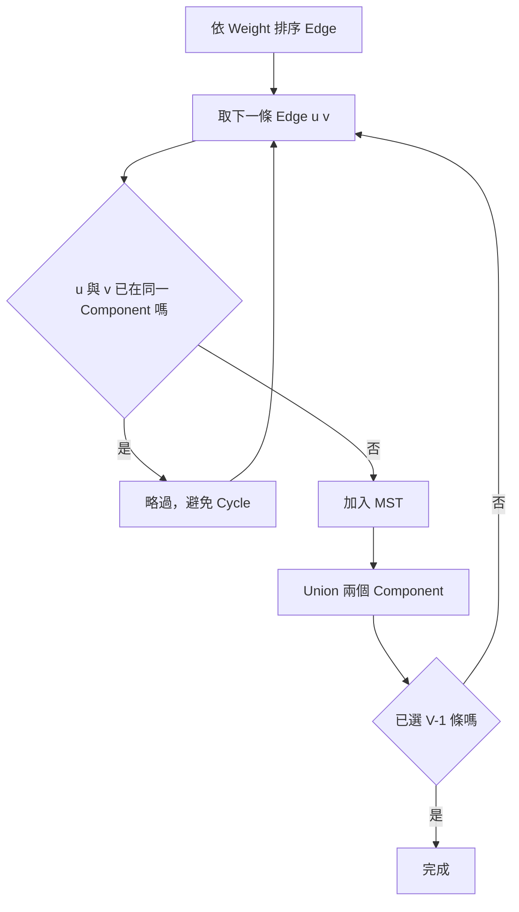
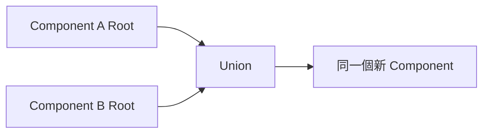
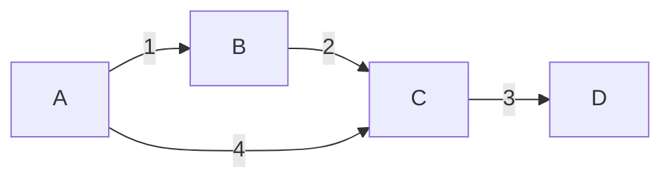
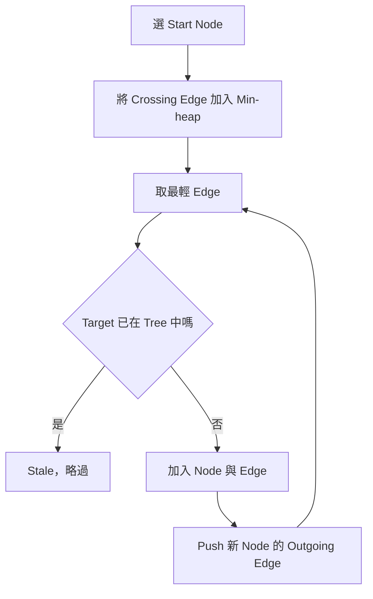
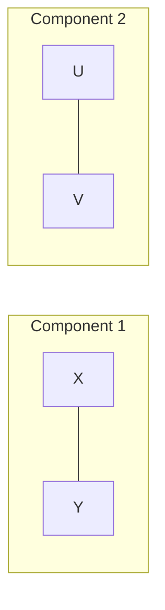

### 第 34 章　Minimum Spanning Tree

#### 適用範圍

本章介紹 Minimum Spanning Tree，簡稱 MST，包括 Spanning Tree、Cut Property、Kruskal、Disjoint Set Union、Prim、Minimum Spanning Forest，以及 MST 與 Shortest Path 的差異。

MST 的目標是：在 Undirected Weighted Graph 中，選出一組 Edge，使所有 Node 連通，且總 Edge Weight 最小。選出的 Edge 不能形成 Cycle。原始章節也強調，MST 不是從某個 Source 到其他 Node 的最短路徑集合。citeturn36search1

本章會依照以下順序建立新手可追蹤的理解：

- 先定義 Spanning Tree。
- 再區分 MST 與 Shortest Path。
- 用 Cut Property 解釋為什麼某些 Edge 可以安全加入。
- 用 Kruskal 從「全域最輕 Edge」角度建立 MST。
- 用 DSU 維護 Component，避免 Cycle。
- 用 Prim 從「目前 Tree 往外延伸」角度建立 MST。
- 處理不連通 Graph、負 Weight、唯一性與複雜度。



#### 適用讀者

- 已理解 Graph、Edge、Weight，但第一次接觸 MST 的讀者。
- 會寫 Kruskal 或 Prim，但不清楚為什麼正確的讀者。
- 容易把 MST 和 Shortest Path 混淆的讀者。
- 不熟悉 Cut Property 與 Exchange Argument 的讀者。
- 想知道 Sparse Graph、Dense Graph 下如何選 Kruskal 或 Prim 的讀者。

#### 快速導覽

- [34.1 Spanning Tree](#341-spanning-tree)
- [34.2 MST 與 Shortest Path](#342-mst-與-shortest-path)
- [34.3 Cut Property](#343-cut-property)
- [34.4 Kruskal](#344-kruskal)
- [34.5 DSU 在 Kruskal 中的角色](#345-dsu-在-kruskal-中的角色)
- [34.6 完整案例：Kruskal](#346-完整案例kruskal)
- [34.7 Kruskal C++ 實作](#347-kruskal-c-實作)
- [34.8 Prim](#348-prim)
- [34.9 完整案例：Prim](#349-完整案例prim)
- [34.10 Prim C++ 實作](#3410-prim-c-實作)
- [34.11 Kruskal 與 Prim 如何選](#3411-kruskal-與-prim-如何選)
- [34.12 不連通 Graph 與 Minimum Spanning Forest](#3412-不連通-graph-與-minimum-spanning-forest)
- [34.13 唯一性與負 Weight](#3413-唯一性與負-weight)
- [34.14 複雜度](#3414-複雜度)
- [34.15 常見問題與判讀](#3415-常見問題與判讀)
- [34.16 本章檢查表](#3416-本章檢查表)
- [34.17 本章重點](#3417-本章重點)

#### 34.1 Spanning Tree

對 Connected Undirected Graph，Spanning Tree 是一棵包含所有 Node 的 Tree。

它必須滿足：

- 包含所有 V 個 Node。
- Connected。
- 不含 Cycle。
- 恰好有 `V - 1` 條 Edge。


上圖若只有 A、B、C、D 四個 Node，並且 Edge 為 A-B、B-C、C-D，則它是一棵 Spanning Tree。

##### 為什麼是 V - 1 條 Edge

Tree 的基本性質：

```text
V 個 Node 的 Connected Acyclic Graph，必有 V - 1 條 Edge。
```

可以從直覺理解：

- 一開始有 V 個互不連通的 Component。
- 每加入一條不形成 Cycle 的 Edge，會把兩個 Component 合併成一個。
- 要從 V 個 Component 合併成 1 個 Component，需要 V - 1 條 Edge。

若已選入 V - 1 條 Edge 且 Graph Connected，就不可能仍含 Cycle。若含 Cycle，移除 Cycle 中一條 Edge 後仍會 Connected，Edge 數就可以少於 V - 1，和 Tree 性質矛盾。

##### Minimum Spanning Tree

Minimum Spanning Tree 是所有 Spanning Tree 中總 Weight 最小的一棵。

```text
目標：minimize sum(selected edge weights)
限制：selected edges form a spanning tree
```

#### 34.2 MST 與 Shortest Path

MST 和 Shortest Path 很容易混淆，因為兩者都和 Edge Weight 有關。但目標函式不同。



<table>
<tr><th>問題</th><th>目標</th><th>常見方法</th></tr>
<tr><td>MST</td><td>用最小總建設成本連接全部 Node</td><td>Kruskal、Prim</td></tr>
<tr><td>Shortest Path</td><td>從 Source 到其他 Node 的路徑成本最小</td><td>BFS、Dijkstra、Bellman-Ford</td></tr>
</table>

##### MST 中的路徑不一定是最短路

假設有三個 Node：A、B、C。

```text
A-B weight 1
B-C weight 1
A-C weight 3
```

MST 會選 A-B、B-C，總成本 2。MST 中 A 到 C 的路徑成本是 2，這剛好比 A-C 3 小。

但改成：

```text
A-B weight 1
B-C weight 100
A-C weight 50
```

MST 會選 A-B 與 A-C，總成本 51。從 B 到 C 在 MST 中的路徑是 B-A-C，成本 51；原 Graph 中 B-C 直接 Edge 成本 100，所以仍較小。

再看另一類情況：MST 是全域連接成本最小，不保證某個 Source 到所有 Node 的路徑都最短。要解 Source Path Cost，應選 Shortest Path。

##### 判斷問題類型

- 「連接所有城市的最低建設成本」：MST。
- 「從城市 S 到各城市的最低旅行成本」：Shortest Path。
- 「保持網路連通且總線路成本最低」：MST。
- 「封包從 Server 到所有 Client 的最短延遲」：Shortest Path Tree 或其他 Routing 問題。

原始章節也用城市建設成本與旅行成本區分 MST 與 Shortest Path。citeturn36search1

#### 34.3 Cut Property

Cut 將 Node 分成兩個不相交集合。跨越 Cut 的 Edge 連接兩側。



Cut Property：

```text
對任意尊重目前安全 Edge 的 Cut，最輕的 Crossing Edge 可以安全加入某棵 MST。
```

原始章節也以 Cut Property 作為 Kruskal 與 Prim 的共同正確性基礎。citeturn36search1

##### 什麼是 Crossing Edge

若 Cut 將 Node 分成兩側：

```text
Left = {A, B}
Right = {C, D}
```

一條 Edge 若一端在 Left，另一端在 Right，就是 Crossing Edge。

##### 為什麼最輕 Crossing Edge 安全

使用 Exchange Argument：

1. 假設某棵 MST 沒有選最輕 Crossing Edge `e`。
2. 將 `e` 加入這棵 MST，會形成一個 Cycle。
3. 這個 Cycle 中一定有另一條 Crossing Edge `f`。
4. 因為 `e` 是最輕 Crossing Edge，所以 `weight(e) <= weight(f)`。
5. 用 `e` 取代 `f`，Graph 仍然連通、仍然無 Cycle，總 Weight 不會增加。
6. 因此存在一棵 MST 包含 `e`。

這個證明不表示所有最輕 Crossing Edge 都唯一；若有多條同 Weight Crossing Edge，可能有多棵 MST。

#### 34.4 Kruskal

Kruskal 從所有 Edge 的角度出發：

```text
依 Weight 由小到大檢查 Edge。
若 Edge 連接兩個不同 Component，就加入。
若兩端已連通，加入會形成 Cycle，因此略過。
```



##### Kruskal 的直覺

Kruskal 像是把所有 Edge 依成本排隊，從最便宜的開始買。但它不是只要便宜就買，還要確認不形成 Cycle。

每次加入 Edge 都會把兩個 Component 合併。直到所有 Node 都在同一 Component，且選了 V - 1 條 Edge。

##### Kruskal Invariant

```text
目前已選 Edge 不形成 Cycle，且可以擴充成某棵 MST。
```

排序後每次遇到最輕可連接不同 Component 的 Edge，根據 Cut Property，它是安全 Edge。

#### 34.5 DSU 在 Kruskal 中的角色

Disjoint Set Union 維護 Component。

需要三個核心操作：

- `find(x)`：取得 x 所屬集合的 Root。
- `unite(a, b)`：合併 a、b 所在的 Component。
- `connected(a, b)`：判斷兩者是否在同一 Component。



Kruskal 中使用 DSU 的目的：

```text
判斷加入 Edge(u, v) 是否會形成 Cycle。
```

如果 `find(u) == find(v)`，表示 u、v 已經在同一 Component。再加入這條 Edge，會在 Component 內形成 Cycle。

如果 `find(u) != find(v)`，表示這條 Edge 連接兩個 Component，可以加入 MST，並合併 Component。

##### DSU 完整程式

```cpp
#include <numeric>
#include <vector>

class Dsu
{
public:
    explicit Dsu(int n)
        : parent(n), size(n, 1)
    {
        std::iota(parent.begin(), parent.end(), 0);
    }

    int find(int x)
    {
        if (parent[x] != x)
        {
            parent[x] = find(parent[x]);
        }

        return parent[x];
    }

    bool unite(int a, int b)
    {
        a = find(a);
        b = find(b);

        if (a == b)
        {
            return false;
        }

        if (size[a] < size[b])
        {
            std::swap(a, b);
        }

        parent[b] = a;
        size[a] += size[b];
        return true;
    }

private:
    std::vector<int> parent;
    std::vector<int> size;
};
```

注意：Union 前一定要先找 Root。直接寫 `parent[b] = a` 可能把非 Root 連到非 Root，造成結構難以控制。

#### 34.6 完整案例：Kruskal

假設 Graph：

```text
A-B weight 1
B-C weight 2
A-C weight 4
C-D weight 3
```



依 Weight 排序：

```text
A-B 1
B-C 2
C-D 3
A-C 4
```

逐步處理：

<table>
<tr><th>Edge</th><th>兩端是否同 Component</th><th>動作</th><th>目前選中 Edge</th></tr>
<tr><td>A-B 1</td><td>否</td><td>加入</td><td>A-B</td></tr>
<tr><td>B-C 2</td><td>否</td><td>加入</td><td>A-B, B-C</td></tr>
<tr><td>C-D 3</td><td>否</td><td>加入</td><td>A-B, B-C, C-D</td></tr>
<tr><td>A-C 4</td><td>是</td><td>略過，會形成 Cycle</td><td>不變</td></tr>
</table>

有 4 個 Node，因此 MST 需要 3 條 Edge。已選 A-B、B-C、C-D，完成。

總 Weight：

```text
1 + 2 + 3 = 6
```

原始章節也用這個案例說明，Weight 4 的 A-C 會在 A、C 已連通後形成 Cycle，因此略過。citeturn36search1

#### 34.7 Kruskal C++ 實作

```cpp
#include <algorithm>
#include <numeric>
#include <optional>
#include <vector>

struct Edge
{
    int u;
    int v;
    long long weight;
};

std::optional<long long> kruskalMst(
    int nodeCount,
    std::vector<Edge> edges)
{
    std::sort(
        edges.begin(),
        edges.end(),
        [](const Edge& a, const Edge& b)
        {
            return a.weight < b.weight;
        });

    Dsu dsu(nodeCount);
    long long total = 0;
    int selected = 0;

    for (const Edge& edge : edges)
    {
        if (!dsu.unite(edge.u, edge.v))
        {
            continue;
        }

        total += edge.weight;
        ++selected;

        if (selected == nodeCount - 1)
        {
            break;
        }
    }

    if (selected != nodeCount - 1)
    {
        return std::nullopt;
    }

    return total;
}
```

##### 為什麼回傳 optional

若 Graph 不連通，就不存在涵蓋所有 Node 的 Spanning Tree。此時 Kruskal 無法選到 `V - 1` 條 Edge，因此回傳 `std::nullopt`。

##### 為什麼 total 使用 long long

Edge Weight 與 Edge 數量相乘可能超過 `int`。即使單條 Edge Weight 是 int，MST 總成本仍可能需要 `long long`。

#### 34.8 Prim

Prim 從一個 Start Node 開始，逐步擴張一棵 Tree。

每次選擇：

```text
目前 Tree 與外部 Node 之間的最輕 Crossing Edge。
```



##### Prim 的直覺

Kruskal 是全域看所有 Edge，Prim 是從一個已連通集合往外長。

在任一步：

- 已加入的 Node 形成目前 Tree。
- 未加入的 Node 在外部。
- 從 Tree 到外部的 Edge 是 Crossing Edge。
- 選其中最輕者，根據 Cut Property 安全。

##### Heap 中為什麼會有 Stale Entry

當某個 Node 已經被加入 Tree，Heap 中可能仍殘留指向它的舊 Edge。Pop 出來時要檢查 `included[node]`，若已加入就略過。

原始章節也指出，Prim Heap 可能保留指向已加入 Node 的舊 Entry，Pop 時以 `included[node]` 略過。citeturn36search1

#### 34.9 完整案例：Prim

使用同一個 Graph：

```text
A-B 1
B-C 2
A-C 4
C-D 3
```

Start A：

<table>
<tr><th>步驟</th><th>目前 Tree</th><th>候選 Edge</th><th>選擇</th></tr>
<tr><td>1</td><td>{A}</td><td>A-B(1), A-C(4)</td><td>A-B(1)</td></tr>
<tr><td>2</td><td>{A, B}</td><td>B-C(2), A-C(4)</td><td>B-C(2)</td></tr>
<tr><td>3</td><td>{A, B, C}</td><td>C-D(3), A-C(4 stale)</td><td>C-D(3)</td></tr>
</table>

選到 Edge：

```text
A-B, B-C, C-D
```

總 Weight：

```text
1 + 2 + 3 = 6
```

每一步都使用 Cut Property：選目前 Tree 與外部之間的最輕 Crossing Edge。

#### 34.10 Prim C++ 實作

```cpp
#include <functional>
#include <optional>
#include <queue>
#include <vector>

struct AdjacentEdge
{
    int to;
    long long weight;
};

std::optional<long long> primMst(
    const std::vector<std::vector<AdjacentEdge>>& graph)
{
    if (graph.empty())
    {
        return 0;
    }

    using Entry = std::pair<long long, int>;

    std::priority_queue<
        Entry,
        std::vector<Entry>,
        std::greater<Entry>> pending;

    std::vector<bool> included(graph.size(), false);
    pending.push({0, 0});

    long long total = 0;
    int count = 0;

    while (!pending.empty())
    {
        auto [weight, node] = pending.top();
        pending.pop();

        if (included[node])
        {
            continue;
        }

        included[node] = true;
        total += weight;
        ++count;

        for (const auto& edge : graph[node])
        {
            if (!included[edge.to])
            {
                pending.push({edge.weight, edge.to});
            }
        }
    }

    if (count != static_cast<int>(graph.size()))
    {
        return std::nullopt;
    }

    return total;
}
```

##### 空 Graph 回傳 0 的語意

若 Graph 沒有 Node，有些題目會定義總成本為 0；有些題目可能不允許空 Graph。實作前應依題目規格決定。

##### Undirected Graph 建圖

Prim 使用 Adjacency List 時，Undirected Edge 必須加入兩個方向：

```cpp
graph[u].push_back({v, w});
graph[v].push_back({u, w});
```

若只建單向，Prim 可能看不到某些候選 Edge。

#### 34.11 Kruskal 與 Prim 如何選

<table>
<tr><th>情況</th><th>較常考慮</th><th>原因</th></tr>
<tr><td>輸入是 Edge List</td><td>Kruskal</td><td>直接排序 Edge，配合 DSU</td></tr>
<tr><td>Graph 較 Sparse</td><td>Kruskal 或 Heap Prim</td><td>兩者都常可接受</td></tr>
<tr><td>Graph 已是 Adjacency List</td><td>Prim</td><td>可從 Node 的 Neighbor 往外推</td></tr>
<tr><td>Dense Graph</td><td>Matrix Prim</td><td>O(V²) 可能比 Heap 操作更合適</td></tr>
<tr><td>需要 Minimum Spanning Forest</td><td>Kruskal 較自然</td><td>排序後跨 Component 合併</td></tr>
</table>

選擇時還要看：

- 輸入格式。
- Graph 是否連通。
- V 與 E 的規模。
- 是否需要輸出 Edge 集合。
- Memory Limit。

#### 34.12 不連通 Graph 與 Minimum Spanning Forest

不連通 Undirected Graph 不存在涵蓋所有 Node 的 Spanning Tree。



Kruskal 最後選不到 `V - 1` 條 Edge。Prim 從單一起點只能加入該 Component。

原始章節也指出，若需求是 Minimum Spanning Forest，可以對每個 Component 建立 MST，而不是回報失敗。citeturn36search1

##### Minimum Spanning Forest

若 Graph 有多個 Component，對每個 Component 建立 MST，得到的集合稱為 Minimum Spanning Forest。

Kruskal 很自然可以得到 Forest：

- 依 Weight 排序所有 Edge。
- 能連接不同 Component 就加入。
- 不要求最後 selected 是 `V - 1`。

但要注意需求：題目可能要求「若不能連接所有 Node 就回傳 -1」，也可能要求「回傳每個 Component 的最低連接成本」。

#### 34.13 唯一性與負 Weight

##### 負 Weight

MST 允許負 Weight。Kruskal 會優先選取負 Edge，只要不形成 Cycle。Prim 也可以處理負 Edge，因為它只是在 Cut 上選最輕 Crossing Edge。

MST 和 Dijkstra 不同。Dijkstra 不允許負 Weight 是因為 Path Relaxation 的性質；MST 不依賴同樣條件。

原始章節也指出，MST 允許負 Weight。citeturn36search1

##### MST 不一定唯一

若多條 Edge Weight 相同，可能有多種總成本相同的 MST。

若所有 Edge Weight 互異，MST 一定唯一。

但反過來不成立：

```text
Weight 重複不代表 MST 一定不唯一。
```

可能有重複 Weight，但仍只有一種 MST 結構。

##### Tie-breaking

Kruskal 排序時，若 Weight 相同，不同 Tie-breaking 可能得到不同 MST，但總 Weight 仍相同。

若題目要求輸出固定 Edge 集合，需要額外定義 Tie-breaking，例如依 `u`、`v` 排序。

#### 34.14 複雜度

<table>
<tr><th>方法</th><th>常見時間</th><th>空間</th><th>適合表示</th></tr>
<tr><td>Kruskal + DSU</td><td>O(E log E)</td><td>O(V) + Edge List</td><td>Edge List</td></tr>
<tr><td>Prim + Binary Heap</td><td>O((V + E) log V)</td><td>O(V + E)</td><td>Adjacency List</td></tr>
<tr><td>Prim + Matrix</td><td>O(V²)</td><td>O(V²)</td><td>Dense Graph</td></tr>
</table>

##### Kruskal 複雜度來源

- 排序 Edge：O(E log E)。
- DSU 操作：接近 O(E) 的攤銷成本。
- 總時間通常由排序主導。

DSU 經 Path Compression 與 Union by Size 後，每次操作為接近常數的攤銷成本。原始章節也有此說明。citeturn36search1

##### Prim + Heap 複雜度來源

- 每條 Edge 可能被 push 到 Heap。
- 每次 push / pop 需要對數成本。
- 常見寫法為 O((V + E) log V)，或依 Heap Entry 數寫成 O(E log E)，在一般比較下可視為同級分析。

##### Prim + Matrix

Dense Graph 中，E 接近 V²。使用 Matrix Prim 時，每輪 O(V) 找下一個未加入 Node，共 V 輪，時間 O(V²)。

#### 34.15 常見問題與判讀

原始章節已整理常見錯誤，例如選到 Cycle、最後少 Node、Prim 重複加入成本、把 MST 當最短路、Undirected Graph 只建單向、DSU Union 錯誤、總成本 Overflow、誤認 MST 唯一。citeturn36search1

<table>
<tr><th>現象</th><th>可能原因</th><th>第一輪檢查</th></tr>
<tr><td>選到 Cycle</td><td>未先檢查 Component</td><td>Kruskal 使用 DSU</td></tr>
<tr><td>最後少 Node</td><td>Graph 不連通</td><td>選中 Edge 或 Included Node 數</td></tr>
<tr><td>Prim 重複加入成本</td><td>未略過已 Included Node</td><td>Pop Heap 時檢查</td></tr>
<tr><td>把 MST 當最短路</td><td>目標函式不同</td><td>全域連接成本或 Source Path Cost</td></tr>
<tr><td>Undirected Graph 只建單向</td><td>Adjacency 遺漏反向 Edge</td><td>兩方向都加入</td></tr>
<tr><td>DSU Union 錯誤</td><td>未先 Find Root</td><td>只合併代表 Root</td></tr>
<tr><td>總成本 Overflow</td><td>使用 int</td><td>改用 long long</td></tr>
<tr><td>誤認 MST 唯一</td><td>Weight 重複</td><td>分析 Cut 上是否有等重候選</td></tr>
<tr><td>Prim 從 0 開始但只走到部分 Node</td><td>Graph 不連通</td><td>檢查 count 是否等於 V</td></tr>
<tr><td>Kruskal 複雜度漏算排序</td><td>只看 DSU 接近 O(1)</td><td>加入 O(E log E)</td></tr>
</table>

#### 34.16 本章檢查表

- 我能定義 Spanning Tree 與 `V - 1` 條 Edge。
- 我能區分 MST 與 Shortest Path Tree。
- 我能使用 Cut Property 說明安全 Edge。
- 我能說明 Exchange Argument 中為什麼替換後仍可行且不更差。
- 我知道 Kruskal 依 Weight 排序並使用 DSU 避免 Cycle。
- 我能說明 DSU Find、Union、Path Compression 與 Size。
- 我會檢查最後是否選到 `V - 1` 條 Edge。
- 我知道 Prim 每次選目前 Tree 的最輕 Crossing Edge。
- 我會略過 Prim Heap 中指向已加入 Node 的 Entry。
- 我能處理不連通 Graph 或回傳 Minimum Spanning Forest。
- 我知道負 Weight 不會使 MST 定義失效。
- 我知道 MST 不一定唯一。
- 我能依 Sparse、Dense 與輸入表示選擇 Kruskal 或 Prim。
- 我會使用較寬型別累加總成本。

#### 34.17 本章重點

- MST 以最小總 Weight 連接 Undirected Graph 的全部 Node，結果 Connected 且無 Cycle。
- Spanning Tree 恰好有 `V - 1` 條 Edge。
- MST 與 Shortest Path 的目標函式不同，不能互相替代。
- Cut Property 是 Kruskal 與 Prim 的共同正確性基礎。
- Kruskal 由全域最輕 Edge 開始，使用 DSU 判斷是否連接不同 Component。
- Prim 從一棵局部 Tree 向外選最輕 Crossing Edge。
- 不連通 Graph 沒有單一 MST，但可建立 Minimum Spanning Forest。
- MST 允許負 Weight，也不一定唯一。
- Kruskal 常為 O(E log E)，Heap Prim 常為 O((V + E) log V)。
- 實作時要注意 Undirected Graph 雙向建邊、Heap Stale Entry、DSU Root 合併與總成本 Overflow。
