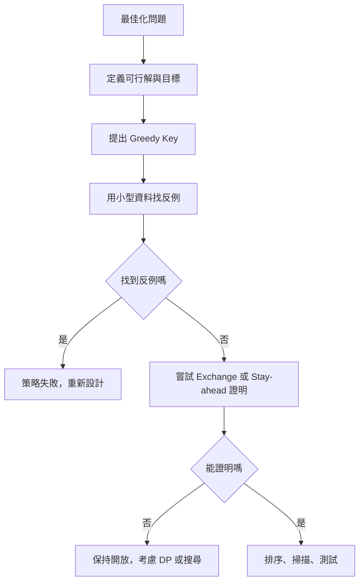
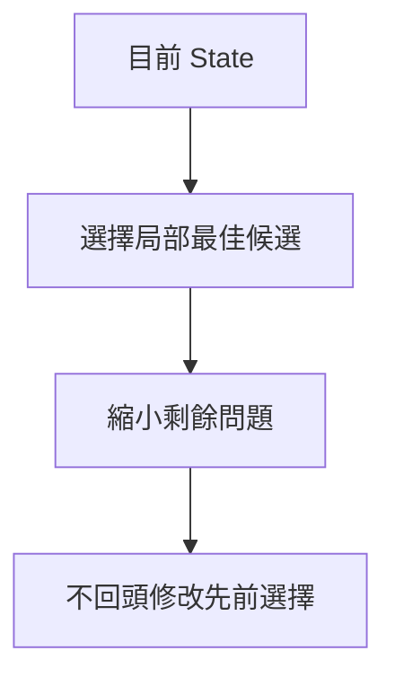
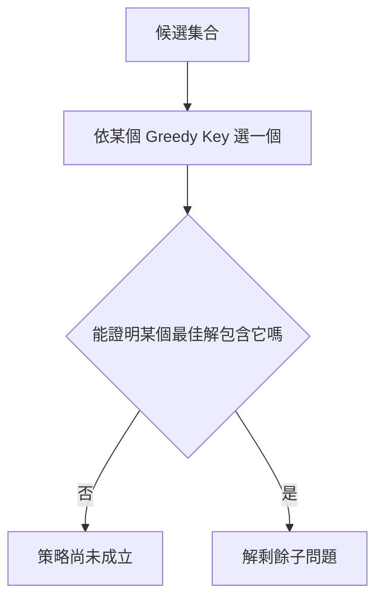
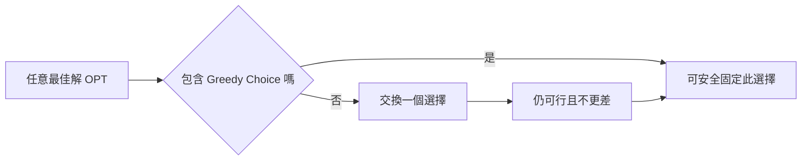
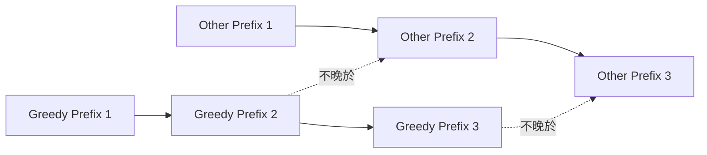
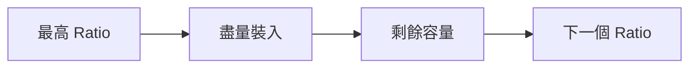
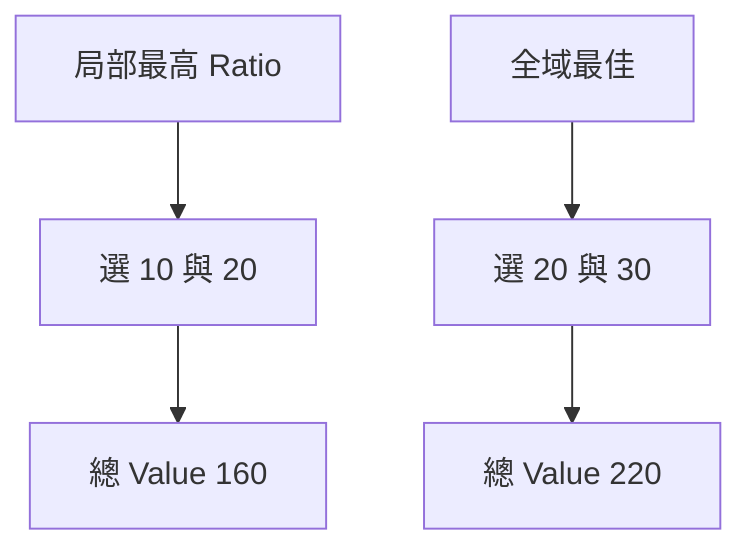
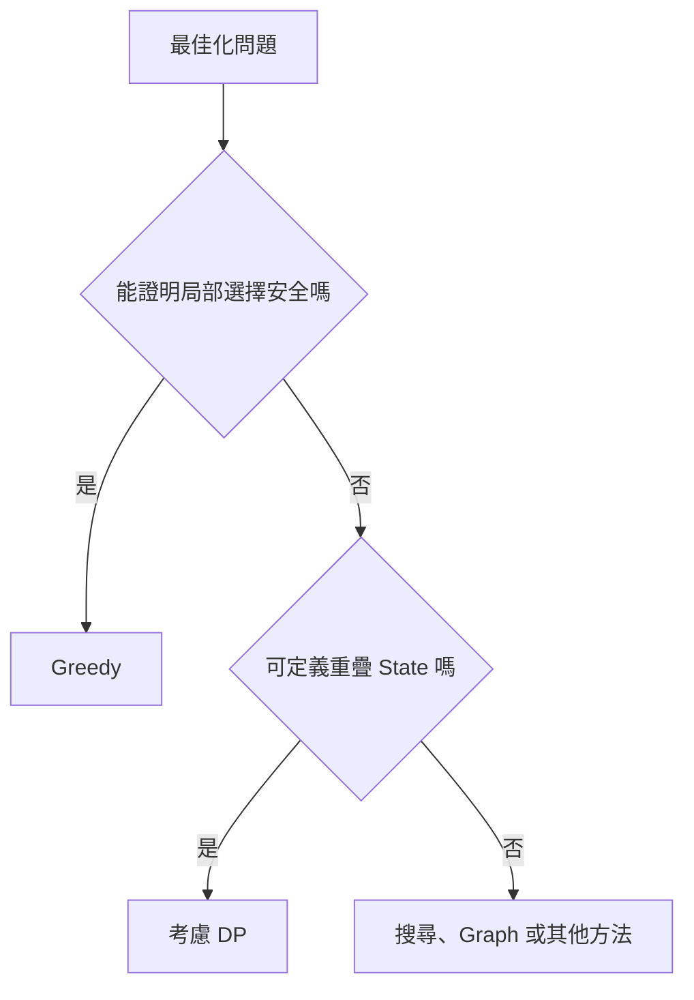
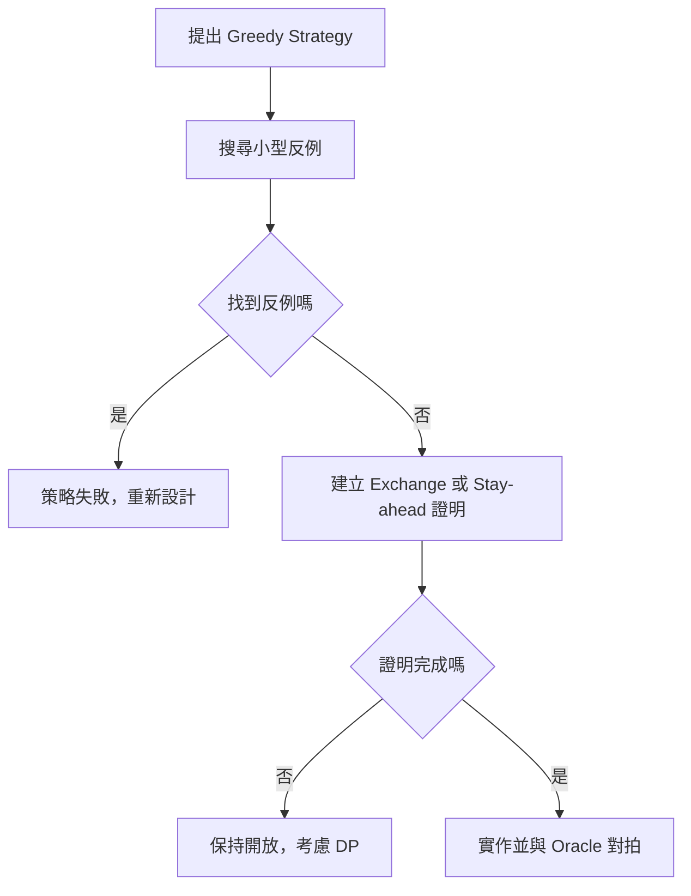

### 第 35 章　Greedy 基礎

#### 適用範圍

本章介紹 Greedy Choice、Local Optimum 與 Global Optimum、排序與選擇順序、Exchange Argument、Stay-ahead Argument、反例，以及 Greedy 與 Dynamic Programming 的差異。

Greedy 並不是「每次選看起來最好」就一定正確。Greedy 的本質是：每一步做出一個不可回頭的選擇，並且要能說明這個選擇不會破壞全域最佳解。

原始章節已經指出，正確的 Greedy Method 必須證明：目前的局部選擇不會破壞某個全域最佳解，或可將任意最佳解轉換成包含此選擇的另一個最佳解。citeturn35search1

本章會以新手較容易檢查的順序說明：

- 先定義目標函式與可行性限制。
- 再提出 Greedy Key。
- 用小型資料列舉所有解，主動找反例。
- 若找不到反例，再嘗試 Exchange 或 Stay-ahead 證明。
- 最後才進入排序、掃描與 C++ 實作。



#### 適用讀者

- 容易把 Greedy 理解成「看起來最大就選最大」的讀者。
- 會寫排序加掃描，但說不出為什麼正確的讀者。
- 常把 Fractional Knapsack 和 0/1 Knapsack 混淆的讀者。
- 想理解 Exchange Argument 與 Stay-ahead Argument 的讀者。
- 想知道何時應從 Greedy 改成 DP 的讀者。

#### 快速導覽

- [35.1 Greedy 到底需要證明什麼](#351-greedy-到底需要證明什麼)
- [35.2 Local Optimum 與 Global Optimum](#352-local-optimum-與-global-optimum)
- [35.3 Greedy Choice 與 Optimal Substructure](#353-greedy-choice-與-optimal-substructure)
- [35.4 排序與選擇順序](#354-排序與選擇順序)
- [35.5 Exchange Argument](#355-exchange-argument)
- [35.6 Stay-ahead Argument](#356-stay-ahead-argument)
- [35.7 完整案例：Interval Scheduling](#357-完整案例interval-scheduling)
- [35.8 完整案例：Fractional Knapsack](#358-完整案例fractional-knapsack)
- [35.9 反例：0/1 Knapsack](#359-反例01-knapsack)
- [35.10 Greedy 與 DP](#3510-greedy-與-dp)
- [35.11 設計與驗證流程](#3511-設計與驗證流程)
- [35.12 如何主動找反例](#3512-如何主動找反例)
- [35.13 複雜度與實作](#3513-複雜度與實作)
- [35.14 常見 Greedy 題型](#3514-常見-greedy-題型)
- [35.15 常見問題與判讀](#3515-常見問題與判讀)
- [35.16 本章檢查表](#3516-本章檢查表)
- [35.17 本章重點](#3517-本章重點)

#### 35.1 Greedy 到底需要證明什麼

Greedy 每一步做出一個不可回頭的選擇。



要證明 Greedy 正確，通常需要兩件事：

1. Greedy Choice Property。
2. Optimal Substructure。

##### Greedy Choice Property

表示目前的 Greedy Choice 是安全的。更精確地說：

```text
存在某個最佳解包含目前 Greedy 所選的項目。
```

這句話很重要。它不是說「所有最佳解都包含 Greedy Choice」，而是說「至少存在一個最佳解可以包含它」。

只要能證明存在一個最佳解包含目前選擇，就可以放心固定這個選擇，接著處理剩餘問題。

##### Optimal Substructure

表示固定目前選擇後，剩餘部分仍然是一個同類型最佳化問題。

例如 Interval Scheduling 中，選了一個最早結束的 Interval 後，剩下要處理的是：

```text
從所有不衝突的剩餘 Interval 中，繼續選最多個互不重疊 Interval。
```

這仍然是同一類問題。

##### 只看起來合理不夠

局部選擇看起來合理，不等於全域最佳。例如「每次選價值最高的物品」在 Knapsack 題中不一定正確；「每次選最早開始的 Interval」在 Interval Scheduling 中也不一定正確。

因此 Greedy 解法至少要留下：

- Greedy Key 是什麼。
- 為什麼這個選擇安全。
- 選完後剩下的子問題是什麼。
- 有無小型反例。

#### 35.2 Local Optimum 與 Global Optimum

Local Optimum 是目前一步看起來最好的選擇。Global Optimum 是整體目標下的最佳答案。

兩者常常不同。

##### 例子：每次選最大價值

假設背包容量是 10：

<table>
<tr><th>物品</th><th>Weight</th><th>Value</th></tr>
<tr><td>A</td><td>10</td><td>100</td></tr>
<tr><td>B</td><td>6</td><td>70</td></tr>
<tr><td>C</td><td>4</td><td>60</td></tr>
</table>

若每次選 Value 最大，會選 A，總 Value 是 100。

但選 B 與 C，總 Weight 是 10，總 Value 是 130。

```text
局部看起來最大：A = 100
全域最佳：B + C = 130
```

這說明：Greedy Key 若沒有證明，可能只是在做局部直覺。

##### Greedy 證明要排除什麼

Greedy 證明要排除的是：

```text
現在選了局部最佳，是否可能讓未來失去更好的組合？
```

如果會，就不是安全選擇。

#### 35.3 Greedy Choice 與 Optimal Substructure

Greedy Choice 通常依某個排序 Key 或優先順序：

- 最早結束。
- 最小成本。
- 最大 Value / Weight Ratio。
- 最短 Deadline。
- 最小 Crossing Edge。
- 最大剩餘彈性。



##### Optimal Substructure 不足以推出 Greedy

許多 DP 問題也有 Optimal Substructure。例如 0/1 Knapsack 的最佳解可以由子問題最佳值組成，但它不能只靠單一路徑的 Greedy Choice 完成。

差異在於：

- Greedy：每一步只保留一個選擇。
- DP：保留多個 State，等待後續比較。

因此看到 Optimal Substructure，不能直接判斷 Greedy 正確。還需要 Greedy Choice Property。

##### Greedy Choice 的常見檢查句

遇到一個 Greedy 策略時，可以問：

```text
若 OPT 不包含我的 Greedy Choice，我能不能把 OPT 中某個選擇換成 Greedy Choice，且答案不變差？
```

這就是 Exchange Argument 的起點。

#### 35.4 排序與選擇順序

排序常用來讓 Greedy Choice 可以由左到右決定。

例如 Interval Scheduling 若依 Finish Time 排序，選取目前最早結束且不衝突的 Interval，可為未來保留最多時間。原始章節也指出，排序成本通常是 O(n log n)，即使後續 Scan 只有 O(n)，總時間仍是 O(n log n)。citeturn35search1


##### 排序方向很關鍵

同一批 Interval 可以依不同 Key 排序：

- Start 由早到晚。
- Finish 由早到晚。
- Duration 由短到長。
- Value 由大到小。

但只有某些排序能支援正確 Greedy。

##### Tie-breaking

Tie-breaking 不一定影響最佳值，但會影響：

- 輸出是否穩定。
- 是否符合題目要求的次要排序。
- 對拍與測試時是否容易比較。

例如 Interval Scheduling 依 Finish 排序時，Finish 相同可再依 Start 排序，使輸出可重現。

##### Comparator 必須是嚴格弱序

錯誤：

```cpp
return a.finish <= b.finish;
```

當 `a.finish == b.finish` 時，`a <= b` 與 `b <= a` 都可能為 true，違反排序 Comparator 要求。

正確方向：

```cpp
if (a.finish != b.finish)
{
    return a.finish < b.finish;
}
return a.start < b.start;
```

#### 35.5 Exchange Argument

Exchange Argument 是 Greedy 最常見的證明工具之一。

典型結構：

1. 取任意最佳解 OPT。
2. 若 OPT 已包含 Greedy Choice，完成第一步。
3. 否則找 OPT 中對應的第一個不同選擇。
4. 用 Greedy Choice 取代它。
5. 證明可行性不被破壞。
6. 證明目標值不變差。
7. 得到包含 Greedy Choice 的最佳解。



原始章節也提醒，Exchange 不必真的在程式中執行，它是正確性證明工具。citeturn35search1

##### Exchange Argument 要同時證明兩件事

不要只說「換了不會更差」。還要證明：

- Feasibility：交換後仍然是合法解。
- Objective：交換後目標值不變差。

例如 Interval Scheduling 中，將 OPT 的第一個 Interval O 換成 Greedy 選的 G：

- 因為 G 的 Finish 不晚於 O，所以 O 後面原本可接的 Interval，G 後面也仍可接。
- Interval 數量沒有減少。

因此交換後仍是最佳解。

##### 何時適合 Exchange Argument

常見於：

- 排序後選擇。
- MST 的 Cut Property。
- Interval Scheduling。
- Fractional Knapsack。
- 某些排程問題。

#### 35.6 Stay-ahead Argument

Stay-ahead 證明 Greedy 在每個 Prefix 都不落後於任意其他解。

原始章節以 Interval Scheduling 表示：比較第 i 個選取 Interval 的 Finish Time，Greedy 第 i 個完成時間不晚於任意可行解第 i 個完成時間，因此其他解能容納的後續 Interval，Greedy 也至少有同樣多空間。citeturn35search1



##### Stay-ahead 的一般寫法

1. 定義 Greedy 的第 i 步狀態。
2. 定義任意可行解或最佳解的第 i 步狀態。
3. 證明對所有 i，Greedy 的狀態都不比對方差。
4. 因此若對方能完成 k 步，Greedy 也能完成至少 k 步。

##### 適合情境

Stay-ahead 常用在累積進度可以比較的題目，例如：

- 最早完成時間。
- 最小已花成本。
- 最大剩餘空間。
- 最遠可達位置。

#### 35.7 完整案例：Interval Scheduling

##### 問題規格

選出最多個互不重疊的 Half-open Interval `[start, finish)`。

Half-open 的意思是：

```text
[start, finish) 包含 start，不包含 finish
```

因此 `[1, 3)` 和 `[3, 5)` 不衝突。

Greedy Strategy：

```text
依 finish 由小到大排序，每次選取 start >= currentFinish 的 Interval。
```

##### 為什麼不是選最早開始

如果選最早開始，可能選到一個很長的 Interval，阻塞很多短 Interval。

例子：

<table>
<tr><th>Interval</th><th>start</th><th>finish</th></tr>
<tr><td>A</td><td>0</td><td>10</td></tr>
<tr><td>B</td><td>1</td><td>2</td></tr>
<tr><td>C</td><td>2</td><td>3</td></tr>
<tr><td>D</td><td>3</td><td>4</td></tr>
</table>

選最早開始會選 A，只得到 1 個。最佳解可選 B、C、D，得到 3 個。

##### 為什麼選最早結束

最早結束的 Interval 會留下最多後續時間。這個直覺可以用 Exchange Argument 證明。

任取一個最佳解 OPT，它的第一個 Interval 是 O。Greedy 選的第一個 Interval 是 G。因為 G 是所有 Interval 中最早結束者，所以：

```text
G.finish <= O.finish
```

用 G 替換 O 後，原本 O 後方能接的 Interval，在 G 後方仍可接，因為 G 不會結束得更晚。選取數量不變，因此仍是最佳解。

##### C++ 實作

```cpp
#include <algorithm>
#include <limits>
#include <vector>

struct Interval
{
    int start;
    int finish;
};

std::vector<Interval> selectMaximumIntervals(
    std::vector<Interval> intervals)
{
    std::sort(
        intervals.begin(),
        intervals.end(),
        [](const Interval& a, const Interval& b)
        {
            if (a.finish != b.finish)
            {
                return a.finish < b.finish;
            }
            return a.start < b.start;
        });

    std::vector<Interval> selected;
    int currentFinish = std::numeric_limits<int>::min();

    for (const Interval& interval : intervals)
    {
        if (interval.start >= currentFinish)
        {
            selected.push_back(interval);
            currentFinish = interval.finish;
        }
    }

    return selected;
}
```

##### 複雜度

- 排序：O(n log n)。
- 掃描：O(n)。
- 總時間：O(n log n)。
- 輸出最多 n 個 Interval，因此結果空間 O(n)。

##### 測試重點

- 空輸入。
- 單一 Interval。
- 完全不重疊。
- 全部互相重疊。
- 相接端點，例如 `[1,3)` 與 `[3,4)`。
- Finish 相同的 Tie。

#### 35.8 完整案例：Fractional Knapsack

Fractional Knapsack 中，物品可以切分。這是 Ratio Greedy 正確的關鍵前提。

Greedy Strategy：

```text
依 Value / Weight Ratio 由大到小排序，優先拿 Ratio 最高的物品。
```



##### Exchange 理由

如果某個解中使用了較低 Ratio 的重量，但還有較高 Ratio 的物品未使用，則可以用同樣重量的高 Ratio 物品替換低 Ratio 物品。

替換後：

- 總 Weight 不變。
- 總 Value 不下降。

因此最佳解可以被調整成優先使用高 Ratio 物品。

##### Ratio 比較與浮點數

直接比較 `double ratio` 可能受到精度影響。可用交叉相乘比較：

```text
a.value / a.weight > b.value / b.weight
等價於
a.value * b.weight > b.value * a.weight
```

但乘法可能 Overflow，因此應使用足夠寬的型別。

```cpp
bool betterRatio(const Item& a, const Item& b)
{
    return 1LL * a.value * b.weight >
           1LL * b.value * a.weight;
}
```

原始章節也提醒，Ratio 比較可使用交叉相乘，但乘法需使用足夠寬型別並檢查 Overflow。citeturn35search1

#### 35.9 反例：0/1 Knapsack

物品不可切分時，Ratio Greedy 不一定正確。原始章節也提供容量 50 的經典反例：Ratio Greedy 選重量 10 與 20，Value 160；最佳解選 20 與 30，Value 220。citeturn35search1

容量 50：

<table>
<tr><th>物品</th><th>Weight</th><th>Value</th><th>Ratio</th></tr>
<tr><td>A</td><td>10</td><td>60</td><td>6</td></tr>
<tr><td>B</td><td>20</td><td>100</td><td>5</td></tr>
<tr><td>C</td><td>30</td><td>120</td><td>4</td></tr>
</table>

Ratio Greedy：

```text
選 A + B
Weight = 30
Value = 160
```

最佳解：

```text
選 B + C
Weight = 50
Value = 220
```



此反例說明：Fractional Knapsack 的可切分 Precondition 是 Greedy 正確性的關鍵。一旦不能切分，就可能需要 DP 或其他方法。

#### 35.10 Greedy 與 DP

<table>
<tr><th>問題特徵</th><th>Greedy</th><th>DP</th></tr>
<tr><td>每步選擇</td><td>固定一個選擇，不回頭</td><td>保留多個 State 的最佳值</td></tr>
<tr><td>證明方式</td><td>Exchange、Stay-ahead、Cut Property</td><td>State、Transition、Optimal Substructure</td></tr>
<tr><td>常見成本</td><td>排序後線性 Scan</td><td>State 數 × Transition 成本</td></tr>
<tr><td>風險</td><td>局部最佳不一定全域最佳</td><td>State 設計與記憶體較複雜</td></tr>
</table>



不要因為 Greedy 程式較短就優先假設它正確。原始章節也提醒，應先找證明或反例。citeturn35search1

##### 何時偏向 Greedy

- 能證明某個局部選擇安全。
- 選擇後剩餘問題仍是同類型問題。
- Exchange 或 Stay-ahead 很自然。
- 問題常可排序後單次掃描。

##### 何時偏向 DP

- 每一步都有多個選擇難以立即排除。
- 需要保留多個狀態才能處理未來限制。
- Greedy 小反例很容易找到。
- 題目有重複子問題。

#### 35.11 設計與驗證流程

原始章節提供的流程包括：寫出目標函式與可行性限制、提出 Greedy Key、用小資料列舉所有解尋找反例、嘗試 Exchange 或 Stay-ahead 證明、確認 Tie-breaking、寫出 Loop Invariant、保留 Brute Force 或 DP 作為小型 Oracle。citeturn35search1

可整理成以下步驟：



##### Greedy 設計紀錄模板

```markdown
## Greedy Strategy

- 目標函式：
- 可行性限制：
- Greedy Key：
- 排序方向：
- 每一步選擇：
- 選完後的剩餘問題：

## 正確性

- Greedy Choice Property：
- Exchange / Stay-ahead 論證：
- Optimal Substructure：
- 反例搜尋結果：

## 實作

- Comparator：
- Tie-breaking：
- Loop Invariant：
- 複雜度：
- Oracle 對拍：
```

#### 35.12 如何主動找反例

Greedy 題一定要主動找反例。找不到反例不代表證明完成，但能幫助淘汰明顯錯誤策略。

##### 常見反例設計方向

<table>
<tr><th>Greedy 直覺</th><th>反例方向</th></tr>
<tr><td>選最大 Value</td><td>設計兩個中等 Value 組合超過最大 Value</td></tr>
<tr><td>選最小 Weight</td><td>設計小物品價值很低，大物品組合更好</td></tr>
<tr><td>選最高 Ratio</td><td>用 0/1 限制讓高 Ratio 物品卡住容量</td></tr>
<tr><td>選最早開始</td><td>設計很早開始但持續很久的 Interval</td></tr>
<tr><td>選最短 Duration</td><td>設計短 Interval 位置不佳，阻塞多個 Interval</td></tr>
<tr><td>選目前最便宜</td><td>設計便宜選擇導致後續成本增加</td></tr>
</table>

##### 小型枚舉 Oracle

對 n 很小的資料，可列舉所有可行解，比較 Greedy 結果與最佳結果。

例如 Interval Scheduling 小型 Oracle 可枚舉所有 Subset，檢查互不衝突，取最大數量。這種 Oracle 不一定用於正式解法，但適合驗證 Greedy Strategy。

#### 35.13 複雜度與實作

Greedy 常見成本：

```text
排序 O(n log n) + Scan O(n) = O(n log n)
```

若輸入已依 Greedy Key 排序，可能只需 O(n)。原始章節也提醒，複雜度要計入排序成本。citeturn35search1

實作時要確認：

- Comparator 嚴格弱序。
- Sum 或乘法是否 Overflow。
- 是否修改原輸入。
- 輸出需要 Value、Index 還是完整項目。
- 相同 Key 的 Tie-breaking。
- 輸出是否需要穩定順序。

##### 不修改原輸入

若題目不允許修改原輸入，排序前應複製：

```cpp
std::vector<Item> sorted = items;
std::sort(sorted.begin(), sorted.end(), compare);
```

##### 需要原始 Index

若輸出需要原始位置，排序前要保存 Index：

```cpp
struct Job
{
    int start;
    int finish;
    int index;
};
```

#### 35.14 常見 Greedy 題型

<table>
<tr><th>題型</th><th>常見 Greedy Key</th><th>常見證明方向</th></tr>
<tr><td>Interval Scheduling</td><td>最早 Finish</td><td>Exchange、Stay-ahead</td></tr>
<tr><td>Fractional Knapsack</td><td>最大 Value / Weight Ratio</td><td>Exchange</td></tr>
<tr><td>Huffman Coding</td><td>合併最小兩項</td><td>Exchange / Tree 結構性質</td></tr>
<tr><td>MST Kruskal</td><td>最小 Edge Weight</td><td>Cut Property</td></tr>
<tr><td>MST Prim</td><td>目前 Cut 最小 Edge</td><td>Cut Property</td></tr>
<tr><td>Jump Game 類型</td><td>最遠可達位置</td><td>Stay-ahead</td></tr>
<tr><td>排程與 Deadline</td><td>最早 Deadline 或最大 Profit</td><td>Exchange 或 Heap 輔助</td></tr>
</table>

看到 Greedy 題型時，不要只記 Key。要同時記：

- 可行性限制。
- 局部選擇為何安全。
- 反例會從哪裡出現。

#### 35.15 常見問題與判讀

原始章節已整理常見問題，例如小案例正確大案例錯誤、排序方向錯誤、Tie 不穩定、Interval 邊界衝突、0/1 Knapsack 使用 Ratio 失敗、複雜度漏算排序、交換論證不完整與大數比較錯誤。citeturn35search1

<table>
<tr><th>現象</th><th>可能原因</th><th>第一輪檢查</th></tr>
<tr><td>小案例正確、大案例錯誤</td><td>Greedy Choice 無證明</td><td>尋找交換失敗案例</td></tr>
<tr><td>排序方向錯誤</td><td>Greedy Key 定義錯</td><td>寫出局部選擇理由</td></tr>
<tr><td>Tie 造成不穩定輸出</td><td>Comparator 次要規則未定義</td><td>加入明確 Tie-breaker</td></tr>
<tr><td>Interval 邊界衝突</td><td>Inclusive / Half-open 混用</td><td>定義相接是否重疊</td></tr>
<tr><td>0/1 Knapsack 使用 Ratio 失敗</td><td>不可切分</td><td>改用 DP 或其他方法</td></tr>
<tr><td>複雜度漏算排序</td><td>只看 Scan</td><td>加上 O(n log n)</td></tr>
<tr><td>交換論證不完整</td><td>只說不更差，未證明可行</td><td>同時證明 Feasibility</td></tr>
<tr><td>大數比較錯誤</td><td>Ratio 浮點或乘法 Overflow</td><td>使用安全交叉相乘</td></tr>
<tr><td>輸出 Index 錯誤</td><td>排序後遺失原始位置</td><td>排序前保存 index</td></tr>
<tr><td>Greedy 和 DP 混淆</td><td>只看到 Optimal Substructure</td><td>檢查 Greedy Choice Property</td></tr>
</table>

#### 35.16 本章檢查表

- 我能說明 Greedy Choice 與 Global Optimum 的差異。
- 我知道 Optimal Substructure 不足以單獨證明 Greedy。
- 我能寫出 Greedy Key 與排序方向。
- 我能說明每一步選擇後，剩餘問題是什麼。
- 我能使用 Exchange Argument 證明選擇安全。
- 我能使用 Stay-ahead 比較 Greedy 與其他解的 Prefix。
- 我會主動尋找小型反例。
- 我能證明 Interval Scheduling 的最早結束策略。
- 我知道 Fractional Knapsack 與 0/1 Knapsack 的差異。
- 我能區分 Greedy 與 DP 的 State 保留方式。
- 我會保留 Brute Force 或 DP 作為 Oracle。
- 我會計入排序成本與型別風險。
- 我能明確定義 Tie-breaking 與區間邊界。
- 我知道無法證明時，應考慮 DP、搜尋或其他方法。

#### 35.17 本章重點

- Greedy 每步做出不可回頭的局部選擇，正確性必須另外證明。
- Local Optimum 不一定等於 Global Optimum。
- Greedy Choice Property 表示存在某個最佳解包含目前選擇。
- Optimal Substructure 單獨不足以推出 Greedy。
- Exchange Argument 將任意最佳解轉換成包含 Greedy Choice 的最佳解。
- Stay-ahead Argument 證明 Greedy 在每個 Prefix 都不落後。
- 排序常建立 Greedy 的選擇順序，總成本通常包含 O(n log n)。
- Interval Scheduling 的最早結束策略可保留最多後續空間。
- Fractional Knapsack 的 Ratio Greedy 依賴物品可切分。
- 0/1 Knapsack 是局部 Ratio 不保證全域最佳的典型反例。
- 無法證明局部選擇安全時，應考慮 DP、搜尋或其他方法。
- 小型 Brute Force Oracle 是驗證 Greedy Strategy 的重要工具。
