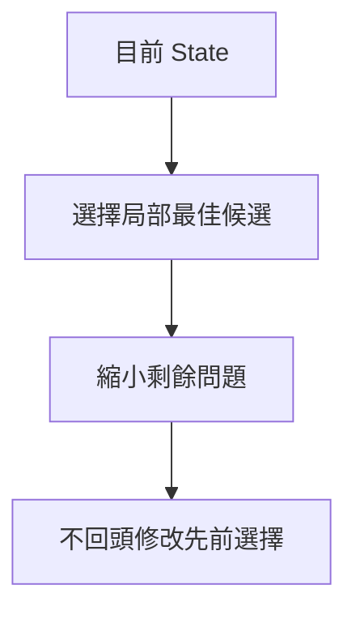
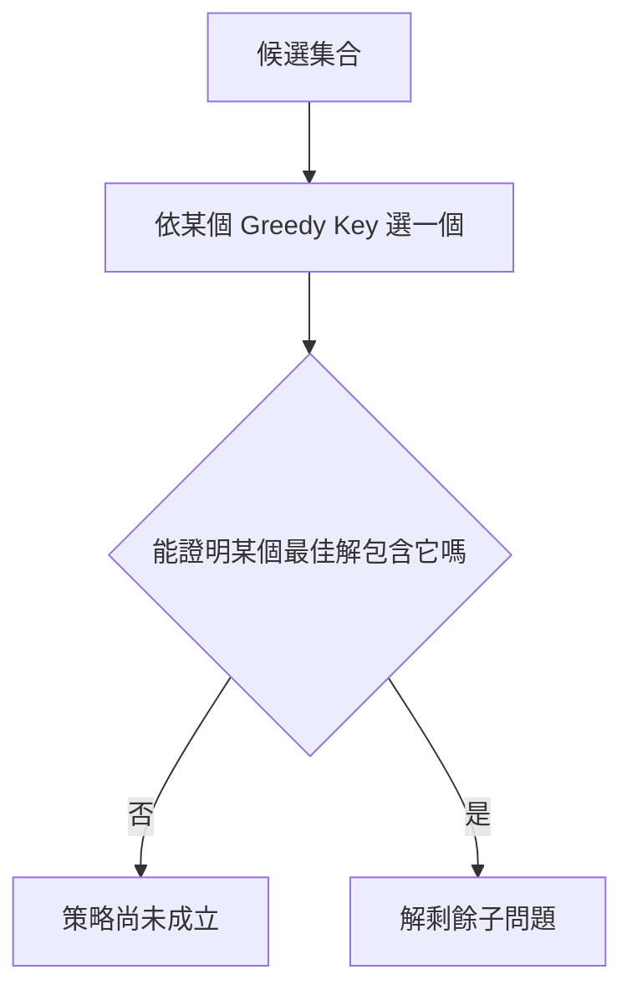
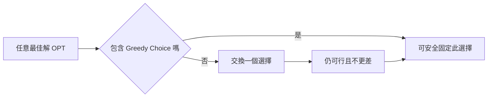
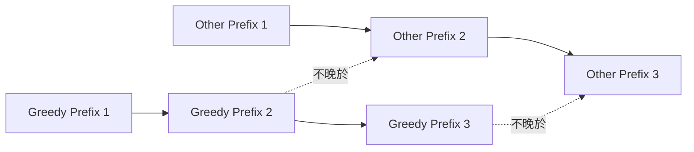
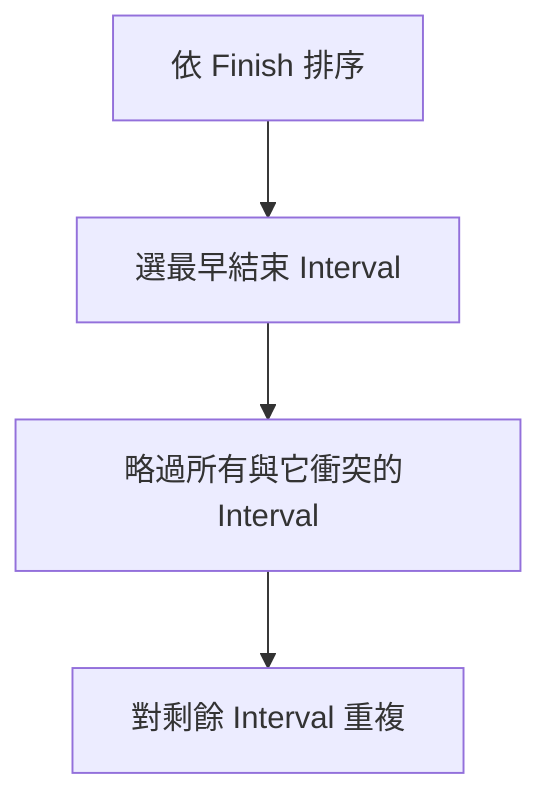
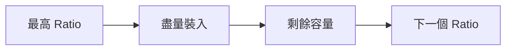
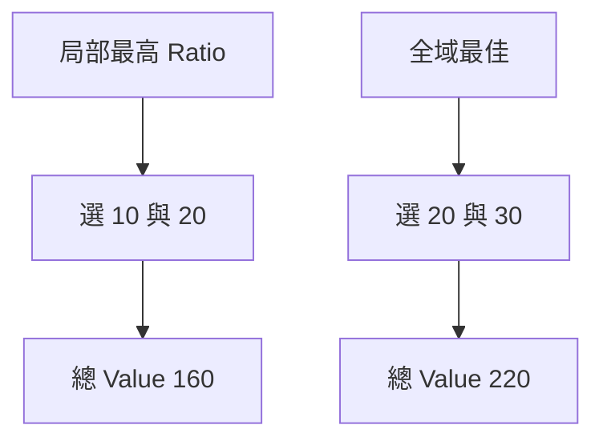
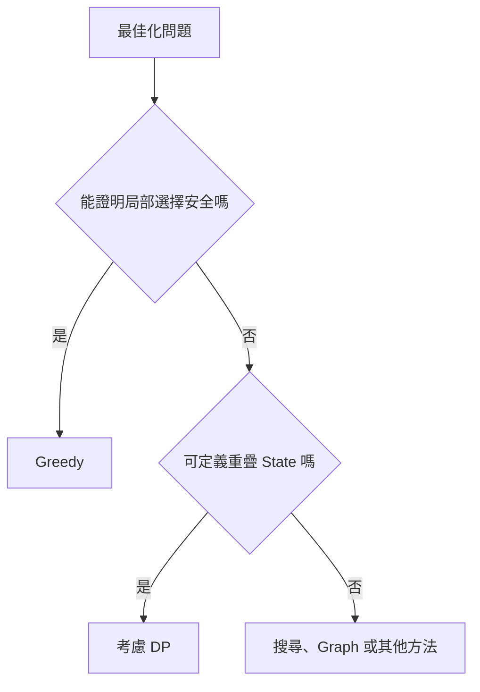
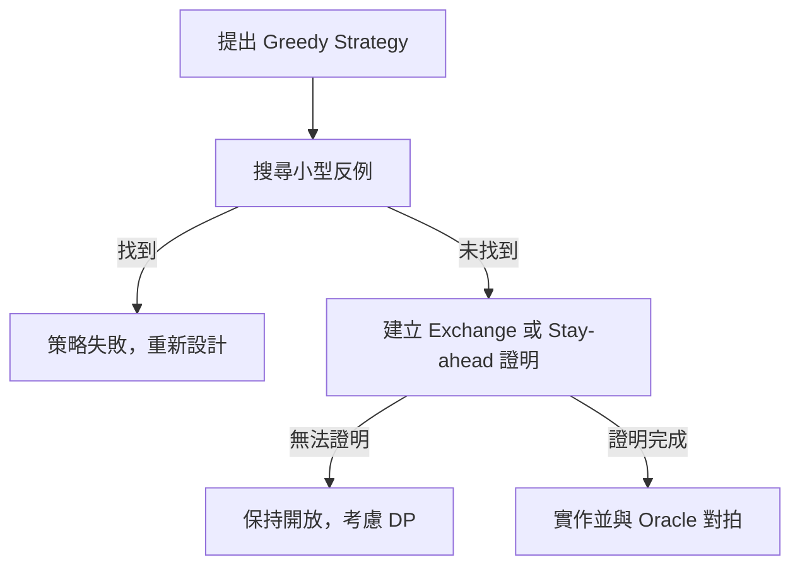

## 第 35 章　Greedy 基礎

### 適用範圍

本章介紹 Greedy Choice、Local 與 Global Optimum、排序與選擇順序、Exchange Argument、Stay-ahead Argument、反例，以及 Greedy 與 Dynamic Programming 的差異。

Greedy 並不是「每次選看起來最好」就能成立。正確 Greedy Method 必須證明：目前的局部選擇不會破壞某個全域最佳解，或可將任意最佳解轉換成包含此選擇的另一個最佳解。

### 快速導覽

- [Greedy 到底需要證明什麼](#351-greedy-到底需要證明什麼)
- [Greedy Choice 與 Optimal Substructure](#352-greedy-choice-與-optimal-substructure)
- [排序與選擇順序](#353-排序與選擇順序)
- [Exchange Argument](#354-exchange-argument)
- [Stay-ahead Argument](#355-stay-ahead-argument)
- [完整案例：Interval Scheduling](#356-完整案例interval-scheduling)
- [完整案例：Fractional Knapsack](#357-完整案例fractional-knapsack)
- [反例：0/1 Knapsack](#358-反例01-knapsack)
- [Greedy 與 DP](#359-greedy-與-dp)
- [設計與驗證流程](#3510-設計與驗證流程)
- [複雜度與實作](#3511-複雜度與實作)
- [常見問題與判讀](#3512-常見問題與判讀)
- [本章檢查表](#3513-本章檢查表)
- [本章重點](#3514-本章重點)

### 35.1 Greedy 到底需要證明什麼

Greedy 每一步做出一個不可回頭的選擇。



需要證明兩件事：

1. Greedy Choice Property：存在某個最佳解包含目前選擇。
2. Optimal Substructure：做出選擇後，剩餘部分仍是一個同類型最佳化問題。

局部選擇看起來合理不等於全域最佳。應主動尋找小型反例。

### 35.2 Greedy Choice 與 Optimal Substructure

Greedy Choice 通常依某個排序 Key：

- 最早結束。
- 最小成本。
- 最大 Value/Weight Ratio。
- 最短 Deadline。
- 最小 Crossing Edge。



Optimal Substructure 單獨不足以推出 Greedy。許多 DP 問題也有 Optimal Substructure，但需要比較多個選擇，不能只保留單一路徑。

### 35.3 排序與選擇順序

排序常用來讓 Greedy Choice 可以由左到右決定。

例如 Interval Scheduling 若依 Finish Time 排序，選取目前最早結束且不衝突的 Interval，可為未來保留最多時間。

排序成本通常是 O(n log n)，即使後續 Scan 只有 O(n)，總時間仍是 O(n log n)。


Comparator 必須符合題目規格，Tie-breaking 不一定影響最優值，但可能影響輸出重現與次要目標。

### 35.4 Exchange Argument

Exchange Argument 的典型結構：

1. 取任意最佳解 OPT。
2. 若 OPT 已包含 Greedy Choice，完成第一步。
3. 否則找 OPT 中對應的第一個不同選擇。
4. 用 Greedy Choice 取代它。
5. 證明可行性不被破壞，目標值不變差。
6. 得到包含 Greedy Choice 的最佳解。



Exchange 不必真的在程式中執行，它是正確性證明工具。

### 35.5 Stay-ahead Argument

Stay-ahead 證明 Greedy 在每個 Prefix 都不落後於任意其他解。

例如比較第 i 個選取 Interval 的 Finish Time：

```text
Greedy 第 i 個完成時間 <= 任意可行解第 i 個完成時間
```

因此其他解能容納的後續 Interval，Greedy 也至少有同樣多空間。



### 35.6 完整案例：Interval Scheduling

#### 問題規格

選出最多個互不重疊的 Half-open Interval `[start, finish)`。

Greedy Strategy：依 Finish 由小到大排序，每次選取 Start 不小於上一個 Finish 的 Interval。

```cpp
struct Interval
{
    int start;
    int finish;
};

std::vector<Interval> selectMaximumIntervals(
    std::vector<Interval> intervals)
{
    std::sort(
        intervals.begin(),
        intervals.end(),
        [](const Interval& a, const Interval& b)
        {
            if (a.finish != b.finish)
            {
                return a.finish < b.finish;
            }
            return a.start < b.start;
        });

    std::vector<Interval> selected;
    int currentFinish = std::numeric_limits<int>::min();

    for (const Interval& interval : intervals)
    {
        if (interval.start >= currentFinish)
        {
            selected.push_back(interval);
            currentFinish = interval.finish;
        }
    }

    return selected;
}
```



#### Exchange Argument

任取最佳解，其第一個 Interval 為 O。Greedy 選擇 G 的 Finish 不晚於 O。以 G 替換 O 後，不會使任何原本在 O 後方的 Interval 失去可行性，因此仍有相同數量的最佳解包含 G。

#### 錯誤 Greedy 反例

「選最早開始」可能挑到一個持續很久的 Interval，阻塞多個短 Interval。

### 35.7 完整案例：Fractional Knapsack

物品可以切分時，依 Value/Weight Ratio 由大到小選取。



交換理由：若解中使用較低 Ratio 的重量，同時未使用較高 Ratio 的可用重量，交換同樣重量後 Value 不會下降。

Ratio 比較若使用浮點數可能有精度問題，可使用交叉相乘：

```text
a.value * b.weight > b.value * a.weight
```

但乘法需使用足夠寬型別並檢查 Overflow。

### 35.8 反例：0/1 Knapsack

物品不可切分時，Ratio Greedy 不一定正確。

容量 50：

| Weight | Value | Ratio |
|---:|---:|---:|
| 10 | 60 | 6 |
| 20 | 100 | 5 |
| 30 | 120 | 4 |

Ratio Greedy 選 10 與 20，Value 160；最佳解選 20 與 30，Value 220。



此反例說明 Fractional Knapsack 的可切分 Precondition 是 Greedy 正確性的關鍵。

### 35.9 Greedy 與 DP

| 問題特徵 | Greedy | DP |
|---|---|---|
| 每步選擇 | 固定一個選擇，不回頭 | 保留多個 State 的最佳值 |
| 證明 | Exchange、Stay-ahead、Cut Property | State、Transition、Optimal Substructure |
| 常見成本 | 排序後線性 Scan | State 數 × Transition 成本 |
| 風險 | 局部最佳不一定全域最佳 | State 設計與記憶體較複雜 |



不要因為 Greedy 程式較短就優先假設它正確。先找證明或反例。

### 35.10 設計與驗證流程

1. 寫出目標函式與可行性限制。
2. 提出 Greedy Key。
3. 用小資料列舉所有解，尋找反例。
4. 嘗試 Exchange 或 Stay-ahead 證明。
5. 確認 Tie-breaking 是否影響結果。
6. 寫出 Loop Invariant。
7. 保留 Brute Force 或 DP 作為小型 Oracle。



### 35.11 複雜度與實作

Greedy 常見成本：

```text
排序 O(n log n) + Scan O(n) = O(n log n)
```

若輸入已依 Greedy Key 排序，可能只需 O(n)。

實作時還要確認：

- Comparator 嚴格弱序。
- Sum 或乘法 Overflow。
- 是否修改原輸入。
- 輸出需要 Value、Index 還是完整項目。
- 相同 Key 的 Tie-breaking。

### 35.12 常見問題與判讀

| 現象 | 可能原因 | 第一輪檢查 |
|---|---|---|
| 小案例正確、大案例錯誤 | Greedy Choice 無證明 | 尋找交換失敗案例 |
| 排序方向錯誤 | Greedy Key 定義錯 | 寫出局部選擇理由 |
| Tie 造成不穩定輸出 | Comparator 次要規則未定義 | 加入明確 Tie-breaker |
| Interval 邊界衝突 | Inclusive/Half-open 混用 | 定義相接是否重疊 |
| 0/1 Knapsack 使用 Ratio 失敗 | 不可切分 | 改用 DP 或其他方法 |
| 複雜度漏算排序 | 只看 Scan | 加上 O(n log n) |
| 交換論證不完整 | 只說不更差，未證明可行 | 同時證明 Feasibility |
| 大數比較錯誤 | Ratio 浮點或乘法 Overflow | 使用安全交叉相乘 |

### 35.13 本章檢查表

- 我能說明 Greedy Choice 與 Global Optimum 的差異。
- 我知道 Optimal Substructure 不足以單獨證明 Greedy。
- 我能寫出 Greedy Key 與排序方向。
- 我能使用 Exchange Argument 證明選擇安全。
- 我能使用 Stay-ahead 比較 Greedy 與其他解的 Prefix。
- 我會主動尋找小型反例。
- 我能證明 Interval Scheduling 的最早結束策略。
- 我知道 Fractional Knapsack 與 0/1 Knapsack 的差異。
- 我能區分 Greedy 與 DP 的 State 保留方式。
- 我會保留 Brute Force 或 DP 作為 Oracle。
- 我會計入排序成本與型別風險。
- 我能明確定義 Tie-breaking 與區間邊界。

### 35.14 本章重點

- Greedy 每步做出不可回頭的局部選擇，正確性必須另外證明。
- Greedy Choice Property 表示存在某個最佳解包含目前選擇。
- Exchange Argument 將任意最佳解轉換成包含 Greedy Choice 的最佳解。
- Stay-ahead Argument 證明 Greedy 在每個 Prefix 都不落後。
- 排序常建立 Greedy 的選擇順序，總成本通常包含 O(n log n)。
- Interval Scheduling 的最早結束策略可保留最多後續空間。
- Fractional Knapsack 的 Ratio Greedy 依賴物品可切分。
- 0/1 Knapsack 是局部 Ratio 不保證全域最佳的典型反例。
- 無法證明局部選擇安全時，應考慮 DP、搜尋或其他方法。
- 小型 Brute Force Oracle 是驗證 Greedy Strategy 的重要工具。
