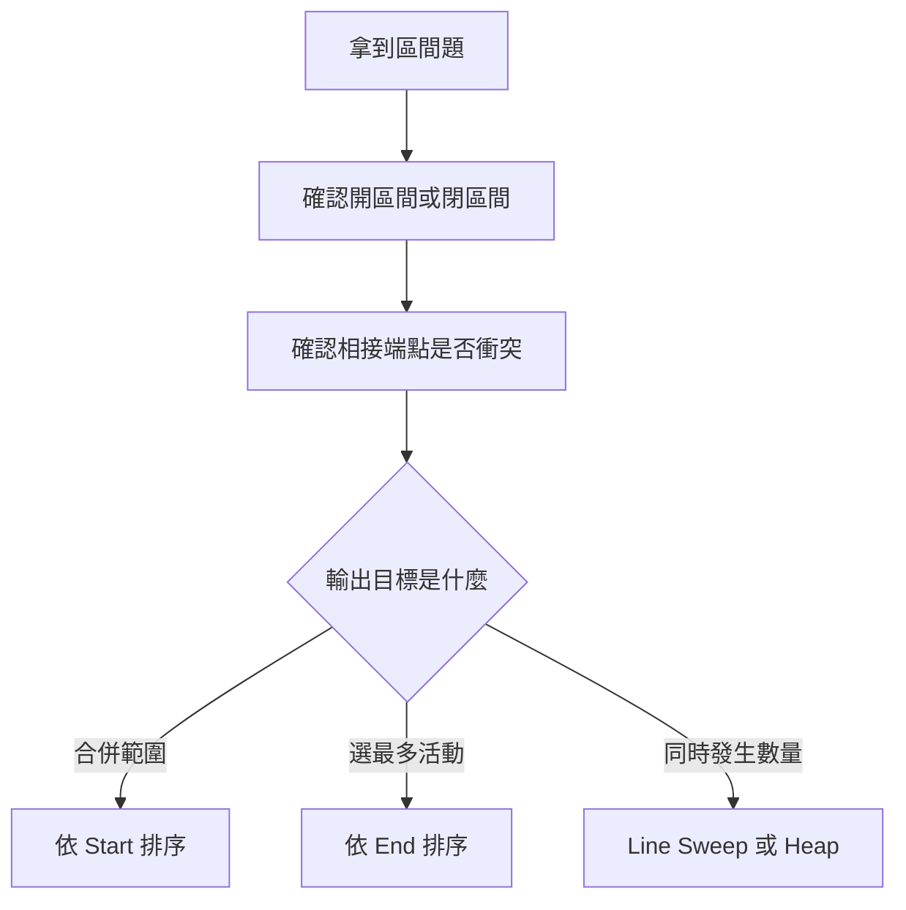
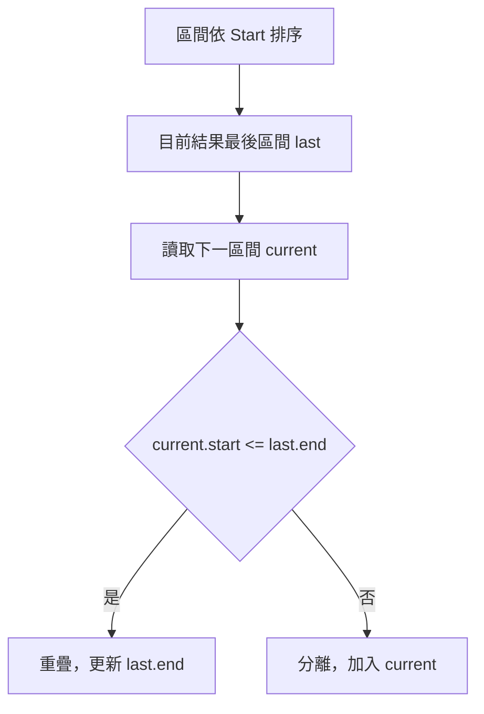
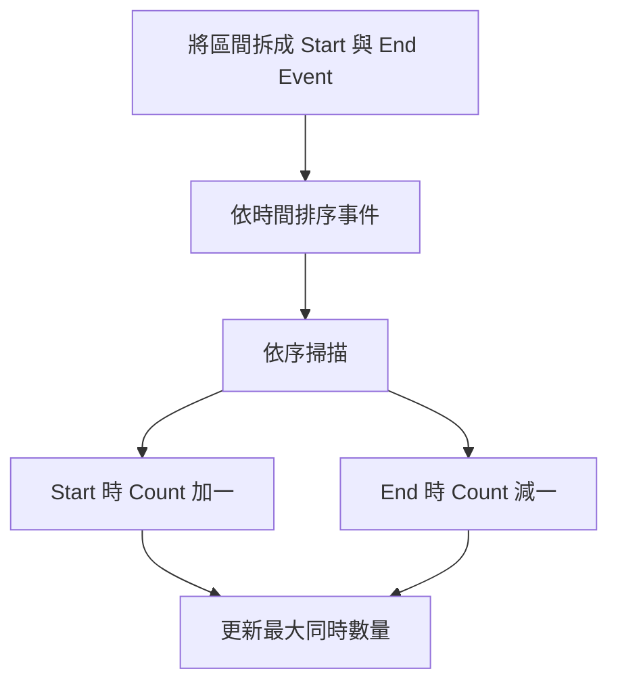
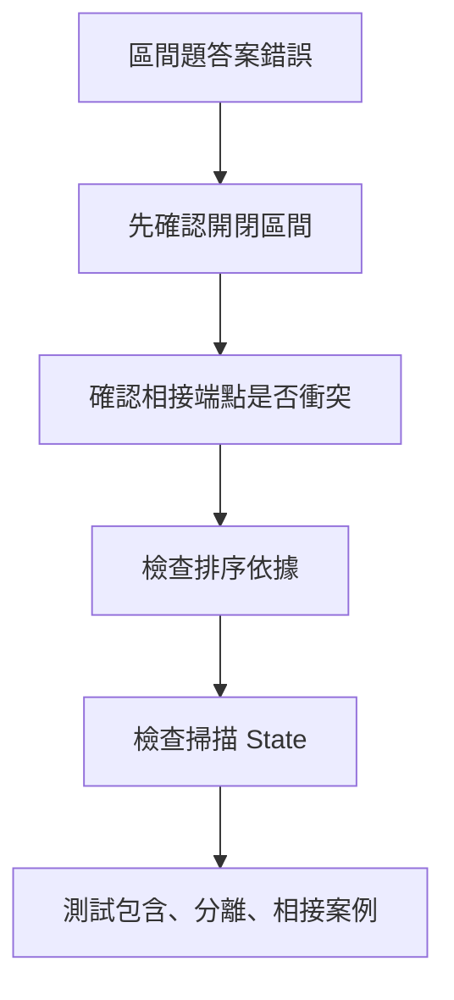

## 第 36 章　Interval Problems

### 適用範圍

本章說明 Interval Problems，也就是以開始時間與結束時間描述一段範圍的問題。區間題常出現在會議時間、工作排程、活動選擇、預約紀錄、數線範圍、日曆系統與資源分配。

原始章節已經指出，第一次接觸區間題時，常見困難不是不會排序，而是還沒有先確認：區間端點是否包含、`[1,3]` 與 `[3,5]` 是否重疊、題目要合併區間、插入區間、選最多活動，還是計算同時發生數量，以及排序應依 Start 還是 End。citeturn52search1

本章會建立固定流程：

1. 先統一區間語意。
2. 判斷相接端點是否衝突。
3. 根據輸出目標選排序依據。
4. 設計掃描時需要維護的 State。
5. 針對 Merge、Insert、Scheduling、Meeting Rooms、Line Sweep 分別套用。
6. 用端點相接、完全包含、完全分離、空輸入與重複區間測試。



### 適用讀者

- 容易混淆相交、相接與包含關係的讀者。
- 看到區間題會直接排序，但不清楚排序依據的讀者。
- 想理解 Merge Intervals、Insert Interval 與 Meeting Rooms 的讀者。
- 常在 `<` 與 `<=` 邊界條件出錯的讀者。
- 想分清楚 Start 排序、End 排序、Min Heap 與 Line Sweep 適用情境的讀者。

### 快速導覽

- [36.1 區間題前到底要分析什麼](#361-區間題前到底要分析什麼)
- [36.2 Interval 的表示](#362-interval-的表示)
- [36.3 先手動判斷區間關係](#363-先手動判斷區間關係)
- [36.4 Merge Intervals](#364-merge-intervals)
- [36.5 Insert Interval](#365-insert-interval)
- [36.6 Interval Scheduling](#366-interval-scheduling)
- [36.7 Meeting Rooms](#367-meeting-rooms)
- [36.8 Line Sweep](#368-line-sweep)
- [36.9 Heap 與 Line Sweep 的選擇](#369-heap-與-line-sweep-的選擇)
- [36.10 Difference Event 與大量區間更新](#3610-difference-event-與大量區間更新)
- [36.11 常見題型辨識](#3611-常見題型辨識)
- [36.12 系統化 Debug](#3612-系統化-debug)
- [36.13 常見問題與判讀](#3613-常見問題與判讀)
- [36.14 本章檢查表](#3614-本章檢查表)
- [36.15 本章重點](#3615-本章重點)

### 36.1 區間題前到底要分析什麼

假設題目給定：

```text
[1, 3], [2, 6], [8, 10]
```

要求合併所有重疊區間。

先整理：

<table>
<tr><th>分析項目</th><th>本題內容</th><th>影響</th></tr>
<tr><td>輸入</td><td>多個區間</td><td>需要處理空輸入與單一區間</td></tr>
<tr><td>區間語意</td><td>閉區間 `[start, end]`</td><td>相接端點算相交</td></tr>
<tr><td>輸出</td><td>合併後互不重疊的區間</td><td>維護 merged result</td></tr>
<tr><td>是否已排序</td><td>未保證</td><td>需先排序</td></tr>
<tr><td>相接是否算重疊</td><td>閉區間下 `[1,3]` 與 `[3,5]` 共享端點</td><td>使用 `current.start <= last.end`</td></tr>
<tr><td>可利用性質</td><td>依 Start 排序後，只需和最後合併結果比較</td><td>線性掃描</td></tr>
</table>

原始章節也用同一組分析項目說明，區間題第一步不是背 `current.start <= last.end`，而是先確認端點語意。若題目把會議視為半開區間 `[start, end)`，前一場在 3 結束、下一場在 3 開始，通常不算衝突。citeturn52search1

#### 區間題先問

1. 區間是閉區間、半開區間，還是開區間？
2. `start == end` 是否表示零長度區間，是否有效？
3. 相接端點算不算衝突或重疊？
4. 輸出是合併結果、最大重疊數、是否衝突、最少資源數，還是最多可選活動？
5. 輸入是否已排序？若已排序，是否互不重疊？
6. 結果是否需要保留原順序或原 Index？

### 36.2 Interval 的表示

C++ 可以使用結構表示：

```cpp
struct Interval
{
    int start;
    int end;
};
```

建立區間前應確認：

```text
start <= end
```

若題目允許零長度區間，`start == end` 可能合法；若題目要求正長度，則需 `start < end`。

原始章節也提供 `Interval` 結構，並提醒建立區間前應確認 `start <= end`。citeturn52search1

#### 常見區間語意

<table>
<tr><th>表示</th><th>包含內容</th><th>端點相接</th></tr>
<tr><td>`[a, b]`</td><td>包含 a 與 b</td><td>`[1,3]` 與 `[3,5]` 相交</td></tr>
<tr><td>`[a, b)`</td><td>包含 a，不包含 b</td><td>`[1,3)` 與 `[3,5)` 不相交</td></tr>
<tr><td>`(a, b)`</td><td>不包含兩端</td><td>需依題目定義</td></tr>
</table>

原始章節也用這張語意對照提醒，同一題中必須維持一致的區間定義。citeturn52search1

#### Half-open Interval 的優點

在排程與會議題中，常用 `[start, end)`：

```text
會議 A: [1, 3)
會議 B: [3, 5)
```

A 在時間 3 已結束，B 在時間 3 開始，不衝突。這樣可自然表示連續資源使用。

#### Closed Interval 的注意

若使用 `[start, end]`，則：

```text
[1,3] 與 [3,5]
```

共享時間點 3。是否算衝突需看題目。例如數線範圍可能算相交，會議排程通常不會用閉區間表示。

### 36.3 先手動判斷區間關係

對閉區間 `[a, b]` 與 `[c, d]`，若已知 `a <= c`：

- `c <= b`：兩區間重疊或相接。
- `c > b`：兩區間分離。

原始章節也以已排序閉區間推導 `current.start <= last.end` 時合併，否則分離。citeturn52search1



若一個區間完全包含另一個，合併後 End 應取最大值：

```cpp
last.end = std::max(last.end, current.end);
```

不能直接指定成 `current.end`，否則可能縮短原區間。原始章節也特別提醒這個錯誤。citeturn52search1

#### 四種基本關係

假設已依 start 排序，且 `last.start <= current.start`。

<table>
<tr><th>關係</th><th>條件</th><th>處理</th></tr>
<tr><td>完全分離</td><td>`current.start > last.end`，閉區間語意</td><td>加入 current</td></tr>
<tr><td>端點相接</td><td>`current.start == last.end`</td><td>依區間語意判斷</td></tr>
<tr><td>部分重疊</td><td>`current.start <= last.end` 且 `current.end > last.end`</td><td>更新 end</td></tr>
<tr><td>完全包含</td><td>`current.end <= last.end`</td><td>end 維持 last.end</td></tr>
</table>

### 36.4 Merge Intervals

#### 人類直接解法

先依 Start 由小到大排序：

```text
[1,3], [2,6], [8,10], [9,12]
```

逐一處理：

<table>
<tr><th>目前區間</th><th>最後結果</th><th>判斷</th><th>結果</th></tr>
<tr><td>`[1,3]`</td><td>空</td><td>直接加入</td><td>`[1,3]`</td></tr>
<tr><td>`[2,6]`</td><td>`[1,3]`</td><td>2 ≤ 3，合併</td><td>`[1,6]`</td></tr>
<tr><td>`[8,10]`</td><td>`[1,6]`</td><td>8 > 6，分離</td><td>`[1,6], [8,10]`</td></tr>
<tr><td>`[9,12]`</td><td>`[8,10]`</td><td>9 ≤ 10，合併</td><td>`[1,6], [8,12]`</td></tr>
</table>

原始章節也用這組區間逐步示範 Merge Intervals。citeturn52search1

#### C++ 實作

```cpp
#include <algorithm>
#include <vector>

struct Interval
{
    int start;
    int end;
};

std::vector<Interval> mergeIntervals(std::vector<Interval> intervals)
{
    if (intervals.empty())
    {
        return {};
    }

    std::sort(
        intervals.begin(),
        intervals.end(),
        [](const Interval& a, const Interval& b)
        {
            if (a.start != b.start)
            {
                return a.start < b.start;
            }

            return a.end < b.end;
        });

    std::vector<Interval> result;
    result.push_back(intervals[0]);

    for (int i = 1; i < static_cast<int>(intervals.size()); ++i)
    {
        Interval& last = result.back();
        const Interval& current = intervals[i];

        if (current.start <= last.end)
        {
            last.end = std::max(last.end, current.end);
        }
        else
        {
            result.push_back(current);
        }
    }

    return result;
}
```

原始章節也提供相同核心實作，時間複雜度為 O(n log n)，主要成本來自排序；掃描為 O(n)。citeturn52search1

#### Half-open 版本差異

若區間是 `[start, end)` 且相接不算重疊，條件要改成：

```cpp
if (current.start < last.end)
{
    // overlap
}
```

這是區間題最常見的 `<` / `<=` 差異。

### 36.5 Insert Interval

若原本區間已依 Start 排序且彼此不重疊，插入新區間時可分三段：

1. 先加入所有在新區間左邊的區間。
2. 合併所有與新區間重疊的區間。
3. 加入剩餘右側區間。

原始章節也以三段掃描說明 Insert Interval，並指出此 O(n) 解法依賴原有區間已排序且互不重疊。citeturn52search1


#### C++ 實作

```cpp
#include <algorithm>
#include <vector>

std::vector<Interval> insertInterval(
    const std::vector<Interval>& intervals,
    Interval newInterval)
{
    std::vector<Interval> result;
    int i = 0;
    int n = static_cast<int>(intervals.size());

    while (i < n && intervals[i].end < newInterval.start)
    {
        result.push_back(intervals[i]);
        ++i;
    }

    while (i < n && intervals[i].start <= newInterval.end)
    {
        newInterval.start = std::min(newInterval.start, intervals[i].start);
        newInterval.end = std::max(newInterval.end, intervals[i].end);
        ++i;
    }

    result.push_back(newInterval);

    while (i < n)
    {
        result.push_back(intervals[i]);
        ++i;
    }

    return result;
}
```

#### 邊界條件

- 新區間在所有區間左邊。
- 新區間在所有區間右邊。
- 新區間和多個區間重疊。
- 新區間被某個原區間完全包含。
- 原區間為空。

若沒有「已排序且互不重疊」此前置條件，可先把新區間加入，接著使用一般 Merge Intervals。

### 36.6 Interval Scheduling

Interval Scheduling 的目標通常是：選出最多個互不衝突活動。

此時排序依據不是 Start，而是 End。每次選擇最早結束的活動，可以保留最多後續空間。原始章節也指出，選最多活動時通常依 End 排序，而不是依 Start 排序。citeturn52search1

#### C++ 實作

```cpp
#include <algorithm>
#include <vector>

int maxNonOverlapping(std::vector<Interval> intervals)
{
    std::sort(
        intervals.begin(),
        intervals.end(),
        [](const Interval& a, const Interval& b)
        {
            if (a.end != b.end)
            {
                return a.end < b.end;
            }

            return a.start < b.start;
        });

    int count = 0;
    int lastEnd = 0;
    bool hasSelected = false;

    for (const Interval& interval : intervals)
    {
        if (!hasSelected || interval.start >= lastEnd)
        {
            ++count;
            lastEnd = interval.end;
            hasSelected = true;
        }
    }

    return count;
}
```

原始章節也說明，這裡使用 `>=` 表示前一活動結束時，下一活動可以立即開始；若題目將相接視為衝突，條件需要調整。citeturn52search1

#### 為什麼依 End 排序

若先選最早開始的活動，可能佔用很長時間，阻擋後面很多短活動。選最早結束者能讓剩餘時間最大，這是典型 Greedy 證明方向。

#### 常見變化

- 最少移除幾個區間使剩下互不重疊：總數 - 最多可選活動數。
- 活動有權重：不再是簡單依 End Greedy，可能需要 DP。
- 相接是否衝突：決定 `>=` 或 `>`。

### 36.7 Meeting Rooms

Meeting Rooms 常見兩種問題：

- 一個人能否參加全部會議。
- 最少需要幾間會議室。

原始章節也用這兩類問題作為 Meeting Rooms 的核心分類。citeturn52search1

#### 能否參加全部會議

依 Start 排序後，檢查相鄰會議：

```cpp
#include <algorithm>
#include <vector>

bool canAttendAllMeetings(std::vector<Interval> meetings)
{
    std::sort(
        meetings.begin(),
        meetings.end(),
        [](const Interval& a, const Interval& b)
        {
            return a.start < b.start;
        });

    for (int i = 1; i < static_cast<int>(meetings.size()); ++i)
    {
        if (meetings[i].start < meetings[i - 1].end)
        {
            return false;
        }
    }

    return true;
}
```

若會議使用 `[start, end)`，`start == previous.end` 不衝突。原始章節也用這個條件說明半開區間。citeturn52search1

#### 最少會議室：Min Heap

可依 Start 排序，再使用 Min Heap 保存目前各房間的結束時間。

規則：

- 新會議開始時間不早於最早結束時間，可以重用房間。
- 否則需要新房間。

```cpp
#include <algorithm>
#include <functional>
#include <queue>
#include <vector>

int minMeetingRooms(std::vector<Interval> meetings)
{
    if (meetings.empty())
    {
        return 0;
    }

    std::sort(
        meetings.begin(),
        meetings.end(),
        [](const Interval& a, const Interval& b)
        {
            return a.start < b.start;
        });

    std::priority_queue<int, std::vector<int>, std::greater<int>> endTimes;

    for (const Interval& meeting : meetings)
    {
        if (!endTimes.empty() && endTimes.top() <= meeting.start)
        {
            endTimes.pop();
        }

        endTimes.push(meeting.end);
    }

    return static_cast<int>(endTimes.size());
}
```

時間複雜度為 O(n log n)，原始章節也指出最少會議室可用 Min Heap，時間為 O(n log n)。citeturn52search1

#### 為什麼只 pop 一個房間也可以

每次只安排一個新會議，只需要釋放一間可重用房間即可。若要讓 Heap 大小更精準反映當前進行中的所有會議，也可在 `while top <= start` 時全部 pop，再 push 新會議。兩種寫法對最大房間數答案都可用，但語意略有不同。

### 36.8 Line Sweep

Line Sweep 會把每個區間拆成開始事件與結束事件，再依時間順序掃描。

例如 `[1,4)`：

```text
時間 1：進入一個活動
時間 4：離開一個活動
```

原始章節也用 `[1,4)` 拆成 Start / End Event，並提醒同時間事件順序會影響答案。citeturn52search1



#### C++ 實作：半開區間 `[start, end)`

半開區間下，同時間 End 應先於 Start，避免把 `[1,3)` 和 `[3,5)` 算成同時發生。

```cpp
#include <algorithm>
#include <utility>
#include <vector>

int maxOverlapHalfOpen(const std::vector<Interval>& intervals)
{
    std::vector<std::pair<int, int>> events;

    for (const Interval& interval : intervals)
    {
        events.push_back({interval.start, +1});
        events.push_back({interval.end, -1});
    }

    std::sort(
        events.begin(),
        events.end(),
        [](const auto& a, const auto& b)
        {
            if (a.first != b.first)
            {
                return a.first < b.first;
            }

            return a.second < b.second;
        });

    int active = 0;
    int answer = 0;

    for (const auto& [time, delta] : events)
    {
        active += delta;
        answer = std::max(answer, active);
    }

    return answer;
}
```

因為 `-1 < +1`，相同時間會先處理 End，再處理 Start。

#### 同時間事件順序

原始章節也整理了同時間事件順序：半開區間 `[start, end)` 通常先處理 End，再處理 Start；閉區間可能要先處理 Start，視題目衝突定義而定。citeturn52search1

<table>
<tr><th>區間語意</th><th>同一時間建議順序</th><th>原因</th></tr>
<tr><td>`[start, end)`</td><td>End 先於 Start</td><td>相接不重疊</td></tr>
<tr><td>`[start, end]`</td><td>Start 先於 End</td><td>相接端點也算同時存在</td></tr>
</table>

### 36.9 Heap 與 Line Sweep 的選擇

Meeting Rooms 最少房間可用 Heap，也可用 Line Sweep。

#### Heap 方法

適合：

- 想追蹤每個房間目前結束時間。
- 需要在安排過程中知道可重用的最早房間。
- 可能需要輸出房間分配。

#### Line Sweep 方法

適合：

- 只需要最大同時數量。
- 不需要知道是哪個房間。
- 事件模型清楚。

#### 比較表

<table>
<tr><th>方法</th><th>排序依據</th><th>維護 State</th><th>適合輸出</th></tr>
<tr><td>Min Heap</td><td>依 Start 排序</td><td>目前房間 End Time</td><td>最少房間數、房間分配</td></tr>
<tr><td>Line Sweep</td><td>依 Event Time 排序</td><td>Active Count</td><td>最大同時數量</td></tr>
</table>

### 36.10 Difference Event 與大量區間更新

若區間是離散座標，且值域不大，可以用 Difference Array。

例如對 `[left, right)` 加一：

```text
diff[left] += 1
diff[right] -= 1
```

最後對 diff 做 Prefix Sum，即可得到每個位置的覆蓋數量。

#### 適用情境

- 座標值域小。
- 需要知道每個位置的覆蓋次數。
- 所有更新可離線處理。

#### 不適用情境

- 座標很大或稀疏。
- 需要即時查詢。
- 區間端點不是整數或不可直接作 Array Index。

若座標大但事件少，可改用 Line Sweep 或 Coordinate Compression。

### 36.11 常見題型辨識

<table>
<tr><th>題目問法</th><th>常用方法</th><th>排序依據</th></tr>
<tr><td>合併所有重疊區間</td><td>Merge Intervals</td><td>Start</td></tr>
<tr><td>插入一個新區間</td><td>三段掃描</td><td>已排序前提</td></tr>
<tr><td>能否參加全部會議</td><td>相鄰檢查</td><td>Start</td></tr>
<tr><td>最少需要幾間會議室</td><td>Min Heap / Line Sweep</td><td>Start 或 Event Time</td></tr>
<tr><td>選最多互不衝突活動</td><td>Greedy</td><td>End</td></tr>
<tr><td>最大同時發生數</td><td>Line Sweep</td><td>Event Time</td></tr>
<tr><td>大量區間加值</td><td>Difference / Sweep</td><td>座標值域決定</td></tr>
</table>

原始章節也指出，不同輸出目標會使用不同排序方式：Merge 通常依 Start，Interval Scheduling 通常依 End，Meeting Rooms 則可使用排序、Min Heap 或 Line Sweep。citeturn52search1

### 36.12 系統化 Debug

區間題 Debug 時，先不要直接看完整程式，應把每個區間關係手動列出。

#### Debug 欄位

```text
區間語意：[start,end] 或 [start,end)
目前排序依據：Start 或 End
last interval
current interval
相接是否算重疊
比較條件是 < 還是 <=
合併後 start / end
active count
同時間 event 順序
```

#### 建議測試

- 空輸入。
- 單一區間。
- 完全分離。
- 完全重疊。
- 完全包含。
- 端點相接。
- 多個區間同 start。
- 多個區間同 end。
- 零長度區間。
- 負數時間或座標。



### 36.13 常見問題與判讀

原始章節列出常見問題：相接區間判斷錯誤、合併後區間縮短、只比較原始上一個區間、活動選擇依 Start 而非 End 排序、Meeting Rooms 同時間事件順序錯誤、Insert Interval 三段掃描邊界錯誤。citeturn52search1

<table>
<tr><th>現象</th><th>可能原因</th><th>第一輪檢查</th></tr>
<tr><td>相接區間判斷錯誤</td><td>沒有先定義開閉區間</td><td>確認應使用 `<` 或 `<=`</td></tr>
<tr><td>合併後區間縮短</td><td>直接指定 `last.end = current.end`</td><td>End 應取最大值</td></tr>
<tr><td>只比較原始上一個區間</td><td>沒有比較合併結果的最後區間</td><td>使用 `result.back()`</td></tr>
<tr><td>活動選擇答案過少</td><td>依 Start 而非 End 排序</td><td>最多活動通常優先最早結束</td></tr>
<tr><td>Meeting Rooms 多算房間</td><td>相同時間 End 與 Start 順序錯誤</td><td>確認半開區間事件順序</td></tr>
<tr><td>Insert Interval 漏區間</td><td>三段掃描邊界錯誤</td><td>分別確認左側、重疊、右側</td></tr>
<tr><td>Heap 方法回傳太小</td><td>沒有保存所有仍進行中的會議</td><td>檢查 push / pop 順序</td></tr>
<tr><td>Line Sweep active 負數</td><td>事件順序或 delta 設錯</td><td>Start +1，End -1</td></tr>
<tr><td>零長度區間影響答案</td><td>未定義 `start == end` 語意</td><td>確認是否要忽略</td></tr>
</table>

### 36.14 本章檢查表

- 我能先確認區間的開閉語意。
- 我能判斷相接端點是否算衝突。
- 我知道 Merge Intervals 通常依 Start 排序。
- 我知道 Interval Scheduling 通常依 End 排序。
- 我能手動追蹤區間合併。
- 我能說明 Insert Interval 的三段掃描。
- 我能區分「能否參加全部會議」與「最少會議室」。
- 我知道 Heap 與 Line Sweep 各自維護什麼 State。
- 我知道 Line Sweep 同時間事件順序會影響答案。
- 我會測試空輸入、單一區間、完全包含、完全分離與端點相接。

原始章節檢查表也包含開閉語意、相接端點、Merge Start 排序、Interval Scheduling End 排序、手動合併、Insert 三段掃描、Meeting Rooms 分類、Line Sweep 同時間順序與重要測試等項目。citeturn52search1

### 36.15 本章重點

- 區間題首先要定義端點是否包含。
- 不同輸出目標會使用不同排序方式。
- Merge Intervals 依 Start 排序後，只需比較最後合併結果。
- 合併 End 應取最大值，避免包含關係造成區間縮短。
- Insert Interval 可分成左側、重疊與右側三段。
- Interval Scheduling 選最多活動時，通常優先選最早結束者。
- Meeting Rooms 可使用排序、Min Heap 或 Line Sweep。
- Line Sweep 的同時間事件順序必須符合區間語意。
- Difference Event 適合值域較小或可壓縮的區間更新問題。
