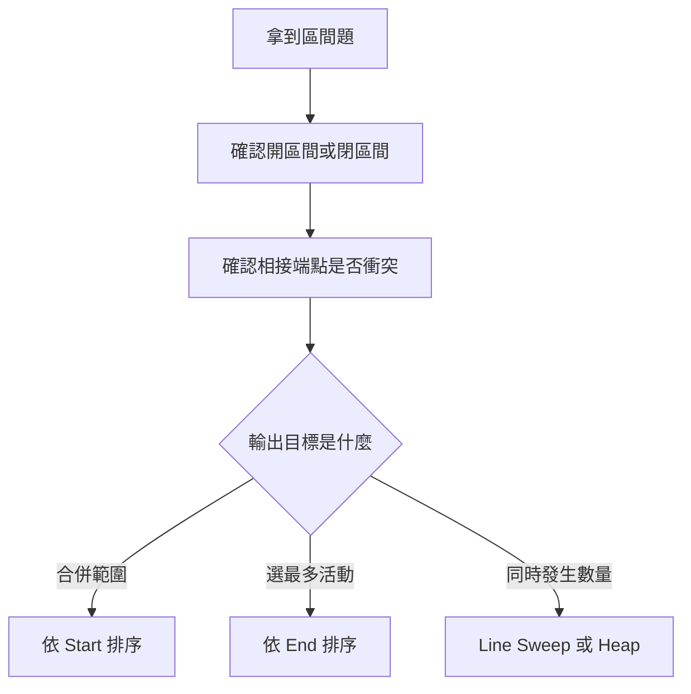
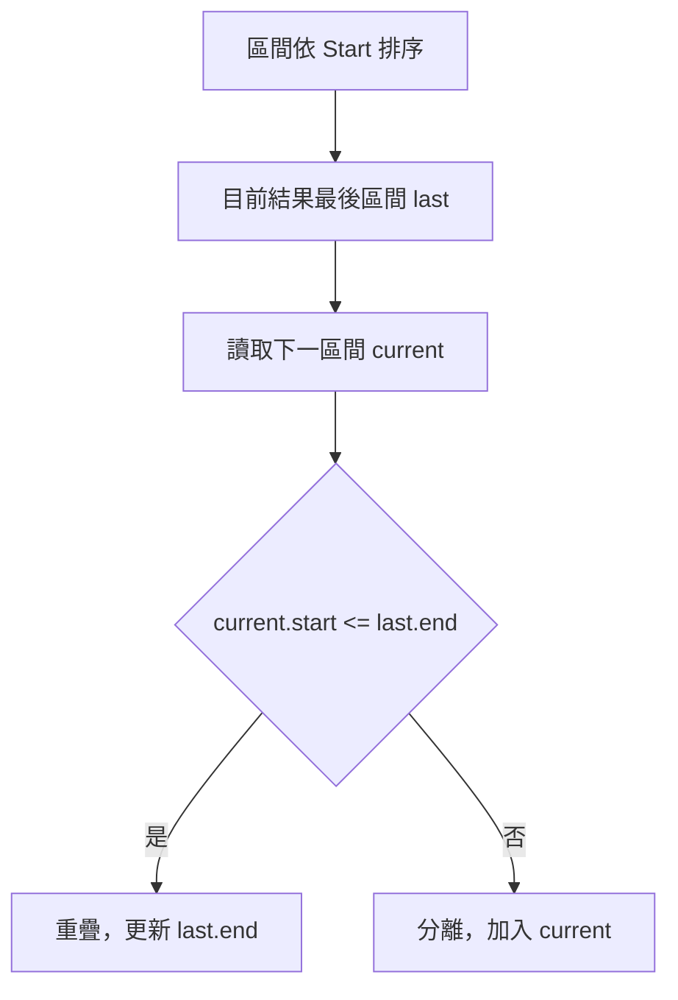
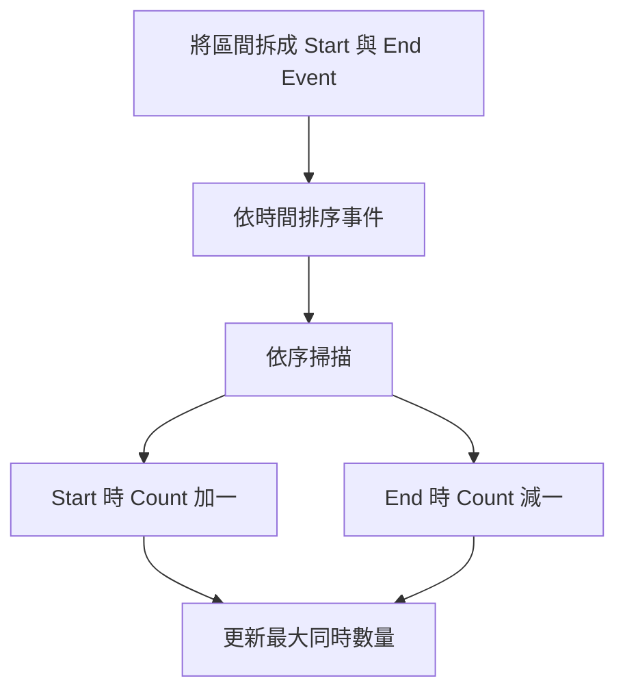

## 第 36 章　Interval Problems

### 適用範圍

本章說明 Interval Problems，也就是以開始時間與結束時間描述一段範圍的問題。

區間題常出現在會議時間、工作排程、活動選擇、預約紀錄與數線範圍。第一次接觸時，常見困難不是不會排序，而是還沒有先確認：

- 區間端點是否包含在範圍內？
- `[1, 3]` 與 `[3, 5]` 算不算重疊？
- 題目要合併區間、插入區間、選最多活動，還是計算同時發生數量？
- 應依 Start 排序，還是依 End 排序？

本章會建立固定流程：先統一區間語意，再根據輸出目標選擇排序方式與掃描狀態。



### 適用讀者

- 容易混淆相交、相接與包含關係的讀者。
- 看到區間題會直接排序，但不清楚排序依據的讀者。
- 想理解 Merge Intervals、Insert Interval 與 Meeting Rooms 的讀者。
- 常在 `<` 與 `<=` 邊界條件出錯的讀者。

### 快速導覽

- [36.1 區間題前到底要分析什麼](#361-區間題前到底要分析什麼)
- [36.2 Interval 的表示](#362-interval-的表示)
- [36.3 先手動判斷區間關係](#363-先手動判斷區間關係)
- [36.4 Merge Intervals](#364-merge-intervals)
- [36.5 Insert Interval](#365-insert-interval)
- [36.6 Interval Scheduling](#366-interval-scheduling)
- [36.7 Meeting Rooms](#367-meeting-rooms)
- [36.8 Line Sweep](#368-line-sweep)
- [36.9 常見問題與判讀](#369-常見問題與判讀)
- [36.10 本章檢查表](#3610-本章檢查表)
- [36.11 本章重點](#3611-本章重點)

### 36.1 區間題前到底要分析什麼

假設題目給定：

```text
[1, 3], [2, 6], [8, 10]
```

要求合併所有重疊區間。

先整理：

<table>
<tr><th>分析項目</th><th>本題內容</th></tr>
<tr><td>輸入</td><td>多個區間</td></tr>
<tr><td>區間語意</td><td>閉區間 `[start, end]`</td></tr>
<tr><td>輸出</td><td>合併後互不重疊的區間</td></tr>
<tr><td>是否已排序</td><td>未保證</td></tr>
<tr><td>相接是否算重疊</td><td>閉區間下 `[1,3]` 與 `[3,5]` 共享端點</td></tr>
<tr><td>可利用性質</td><td>依 Start 排序後，只需和最後合併結果比較</td></tr>
</table>

區間題的第一步不是背 `current.start <= last.end`，而是先確認端點語意。若題目把會議視為半開區間 `[start, end)`，前一場在 3 結束、下一場在 3 開始，通常不算衝突。

### 36.2 Interval 的表示

C++ 可以使用結構表示：

```cpp
struct Interval
{
    int start;
    int end;
};
```

建立區間前應確認：

```text
start <= end
```

常見區間語意：

<table>
<tr><th>表示</th><th>包含內容</th><th>端點相接</th></tr>
<tr><td>`[a, b]`</td><td>包含 a 與 b</td><td>`[1,3]` 與 `[3,5]` 相交</td></tr>
<tr><td>`[a, b)`</td><td>包含 a，不包含 b</td><td>`[1,3)` 與 `[3,5)` 不相交</td></tr>
<tr><td>`(a, b)`</td><td>不包含兩端</td><td>需依題目定義</td></tr>
</table>

同一題中必須維持一致的區間定義。

### 36.3 先手動判斷區間關係

對閉區間 `[a, b]` 與 `[c, d]`，若已知 `a <= c`：

- `c <= b`：兩區間重疊或相接。
- `c > b`：兩區間分離。



若一個區間完全包含另一個，合併後 End 應取最大值：

```cpp
last.end = std::max(last.end, current.end);
```

不能直接指定成 `current.end`，否則可能縮短原區間。

### 36.4 Merge Intervals

#### 人類直接解法

先依 Start 由小到大排序：

```text
[1,3], [2,6], [8,10], [9,12]
```

逐一處理：

<table>
<tr><th>目前區間</th><th>最後結果</th><th>判斷</th><th>結果</th></tr>
<tr><td>`[1,3]`</td><td>空</td><td>直接加入</td><td>`[1,3]`</td></tr>
<tr><td>`[2,6]`</td><td>`[1,3]`</td><td>2 ≤ 3，合併</td><td>`[1,6]`</td></tr>
<tr><td>`[8,10]`</td><td>`[1,6]`</td><td>8 > 6，分離</td><td>`[1,6], [8,10]`</td></tr>
<tr><td>`[9,12]`</td><td>`[8,10]`</td><td>9 ≤ 10，合併</td><td>`[1,6], [8,12]`</td></tr>
</table>

#### C++ 實作

```cpp
#include <algorithm>
#include <vector>

struct Interval
{
    int start;
    int end;
};

std::vector<Interval> mergeIntervals(std::vector<Interval> intervals)
{
    if (intervals.empty())
    {
        return {};
    }

    std::sort(
        intervals.begin(),
        intervals.end(),
        [](const Interval& a, const Interval& b)
        {
            if (a.start != b.start)
            {
                return a.start < b.start;
            }
            return a.end < b.end;
        });

    std::vector<Interval> result;
    result.push_back(intervals[0]);

    for (int i = 1; i < static_cast<int>(intervals.size()); ++i)
    {
        Interval& last = result.back();
        const Interval& current = intervals[i];

        if (current.start <= last.end)
        {
            last.end = std::max(last.end, current.end);
        }
        else
        {
            result.push_back(current);
        }
    }

    return result;
}
```

時間複雜度是 O(n log n)，主要成本來自排序。掃描為 O(n)。

### 36.5 Insert Interval

若原本區間已依 Start 排序且彼此不重疊，插入新區間時可分三段：

1. 先加入所有在新區間左邊的區間。
2. 合併所有與新區間重疊的區間。
3. 加入剩餘右側區間。


```cpp
std::vector<Interval> insertInterval(
    const std::vector<Interval>& intervals,
    Interval newInterval)
{
    std::vector<Interval> result;
    int i = 0;
    int n = static_cast<int>(intervals.size());

    while (i < n && intervals[i].end < newInterval.start)
    {
        result.push_back(intervals[i]);
        ++i;
    }

    while (i < n && intervals[i].start <= newInterval.end)
    {
        newInterval.start = std::min(newInterval.start, intervals[i].start);
        newInterval.end = std::max(newInterval.end, intervals[i].end);
        ++i;
    }

    result.push_back(newInterval);

    while (i < n)
    {
        result.push_back(intervals[i]);
        ++i;
    }

    return result;
}
```

此 O(n) 解法依賴原有區間已排序且互不重疊。若沒有此前置條件，可先加入新區間，再使用一般 Merge Intervals。

### 36.6 Interval Scheduling

Interval Scheduling 的目標通常是：選出最多個互不衝突活動。

此時排序依據不是 Start，而是 End。每次選擇最早結束的活動，可以保留最多後續空間。

```cpp
int maxNonOverlapping(std::vector<Interval> intervals)
{
    std::sort(
        intervals.begin(),
        intervals.end(),
        [](const Interval& a, const Interval& b)
        {
            return a.end < b.end;
        });

    int count = 0;
    int lastEnd = 0;
    bool hasSelected = false;

    for (const Interval& interval : intervals)
    {
        if (!hasSelected || interval.start >= lastEnd)
        {
            ++count;
            lastEnd = interval.end;
            hasSelected = true;
        }
    }

    return count;
}
```

這裡使用 `>=`，表示前一活動結束時，下一活動可以立即開始。若題目將相接視為衝突，條件需要調整。

### 36.7 Meeting Rooms

Meeting Rooms 常見兩種問題：

- 一個人能否參加全部會議。
- 最少需要幾間會議室。

#### 能否參加全部會議

依 Start 排序後，檢查相鄰會議：

```cpp
if (meetings[i].start < meetings[i - 1].end)
{
    return false;
}
```

若會議使用 `[start, end)`，`start == previous.end` 不衝突。

#### 最少會議室

可依 Start 排序，再使用 Min Heap 保存目前各房間的結束時間。

- 新會議開始時間不早於最早結束時間，可以重用房間。
- 否則需要新房間。

時間複雜度為 O(n log n)。

### 36.8 Line Sweep

Line Sweep 會把每個區間拆成開始事件與結束事件，再依時間順序掃描。

例如 `[1,4)`：

```text
時間 1：進入一個活動
時間 4：離開一個活動
```



若 Start 與 End 發生在同一時間，事件排序方式會影響答案：

- 半開區間 `[start, end)`：通常先處理 End，再處理 Start。
- 閉區間：可能要先處理 Start，視題目衝突定義而定。

### 36.9 常見問題與判讀

<table>
<tr><th>現象</th><th>可能原因</th><th>第一輪檢查</th></tr>
<tr><td>相接區間判斷錯誤</td><td>沒有先定義開閉區間</td><td>確認應使用 `<` 或 `<=`</td></tr>
<tr><td>合併後區間縮短</td><td>直接指定 `last.end = current.end`</td><td>End 應取最大值</td></tr>
<tr><td>只比較原始上一個區間</td><td>沒有比較合併結果的最後區間</td><td>使用 `result.back()`</td></tr>
<tr><td>活動選擇答案過少</td><td>依 Start 而非 End 排序</td><td>最多活動通常優先最早結束</td></tr>
<tr><td>Meeting Rooms 多算房間</td><td>相同時間 End 與 Start 順序錯誤</td><td>確認半開區間事件順序</td></tr>
<tr><td>Insert Interval 漏區間</td><td>三段掃描邊界錯誤</td><td>分別確認左側、重疊、右側</td></tr>
</table>

### 36.10 本章檢查表

- 我能先確認區間的開閉語意。
- 我能判斷相接端點是否算衝突。
- 我知道 Merge Intervals 通常依 Start 排序。
- 我知道 Interval Scheduling 通常依 End 排序。
- 我能手動追蹤區間合併。
- 我能說明 Insert Interval 的三段掃描。
- 我能區分「能否參加全部會議」與「最少會議室」。
- 我知道 Line Sweep 同時間事件順序會影響答案。
- 我會測試空輸入、單一區間、完全包含、完全分離與端點相接。

### 36.11 本章重點

- 區間題首先要定義端點是否包含。
- 不同輸出目標會使用不同排序方式。
- Merge Intervals 依 Start 排序後，只需比較最後合併結果。
- 合併 End 應取最大值，避免包含關係造成區間縮短。
- Insert Interval 可分成左側、重疊與右側三段。
- Interval Scheduling 選最多活動時，通常優先選最早結束者。
- Meeting Rooms 可使用排序、Min Heap 或 Line Sweep。
- Line Sweep 的同時間事件順序必須符合區間語意。
