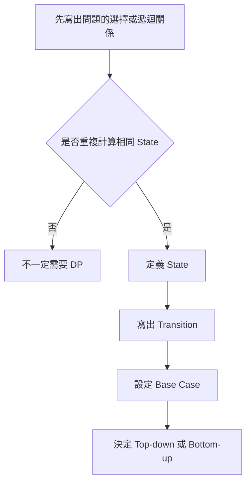
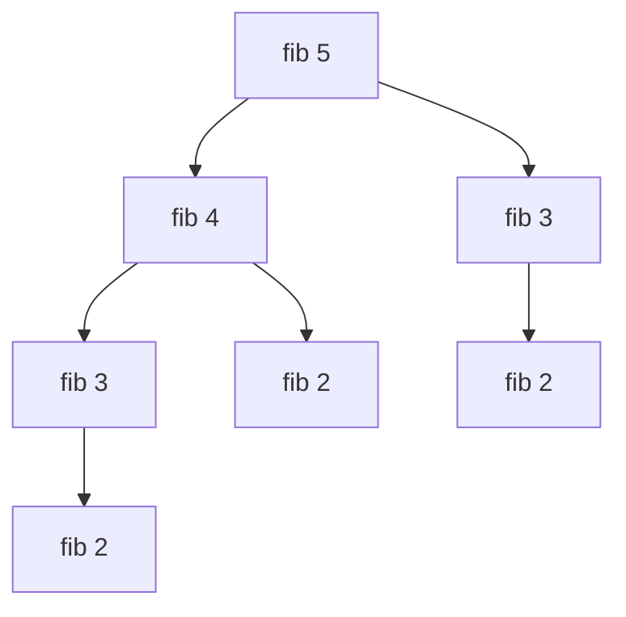
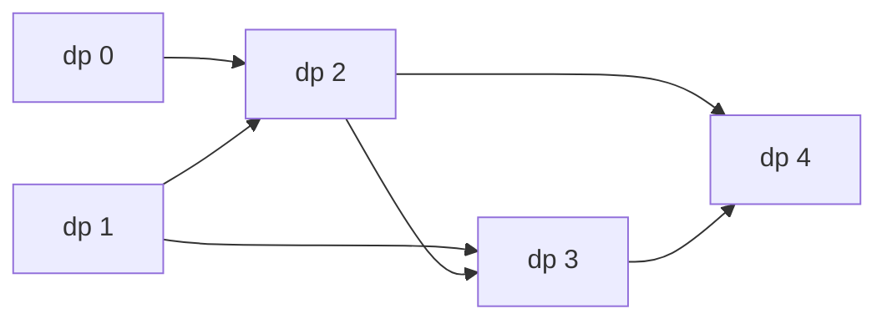

## 第 37 章　Dynamic Programming 基礎

### 適用範圍

本章說明 Dynamic Programming，簡稱 DP。DP 適合處理能拆成重複子問題，而且大問題答案可由較小問題答案組成的問題。

第一次接觸 DP 時，常見困難不是不會寫 Array，而是不知道：

- `dp[i]` 應該代表什麼？
- Transition 是從哪裡推導出來的？
- Base Case 為什麼是那些值？
- Top-down 與 Bottom-up 有什麼關係？
- 題目出現「最大、最小、方法數」就一定是 DP 嗎？

本章不從模板開始，而是先從直接遞迴中的重複工作推導 DP。



### 適用讀者

- 能看懂 DP 答案，但很難自己定義 State 的讀者。
- 容易背 Transition，卻說不出每一項意思的讀者。
- 不清楚 Memoization 與 Tabulation 差異的讀者。
- 想建立固定 DP 分析流程的讀者。

### 快速導覽

- [37.1 DP 前到底要分析什麼](#371-dp-前到底要分析什麼)
- [37.2 從 Fibonacci 的重複工作開始](#372-從-fibonacci-的重複工作開始)
- [37.3 State](#373-state)
- [37.4 Transition](#374-transition)
- [37.5 Base Case](#375-base-case)
- [37.6 Top-down Memoization](#376-top-down-memoization)
- [37.7 Bottom-up Tabulation](#377-bottom-up-tabulation)
- [37.8 Optimal Substructure](#378-optimal-substructure)
- [37.9 DP 五步分析法](#379-dp-五步分析法)
- [37.10 狀態依賴圖與計算順序](#3710-狀態依賴圖與計算順序)
- [37.11 常見問題與判讀](#3711-常見問題與判讀)
- [37.12 本章檢查表](#3712-本章檢查表)
- [37.13 本章重點](#3713-本章重點)

### 37.1 DP 前到底要分析什麼

假設題目要求計算 Fibonacci：

```text
fib(0) = 0
fib(1) = 1
fib(n) = fib(n - 1) + fib(n - 2)
```

先整理：

<table>
<tr><th>分析項目</th><th>本題內容</th></tr>
<tr><td>輸入</td><td>非負整數 n</td></tr>
<tr><td>輸出</td><td>fib(n)</td></tr>
<tr><td>最小問題</td><td>n 為 0 或 1</td></tr>
<tr><td>大問題來自哪些小問題</td><td>n - 1 與 n - 2</td></tr>
<tr><td>是否重複計算</td><td>是，例如 fib(3) 會從不同分支重複出現</td></tr>
<tr><td>State</td><td>目前要計算的 n</td></tr>
</table>

DP 的第一步不是建立 `dp` Array，而是先能說明「同一個子問題是否被重複求解」。

### 37.2 從 Fibonacci 的重複工作開始

直接遞迴：

```cpp
long long fibonacci(int n)
{
    if (n <= 1)
    {
        return n;
    }

    return fibonacci(n - 1) + fibonacci(n - 2);
}
```

`fibonacci(5)` 的呼叫會重複出現相同子問題：



如果 `fib(3)` 已經算過，再次遇到時可以直接讀取答案。這就是 Memoization 的核心。

### 37.3 State

State 是足以描述一個子問題的資訊。

在 Fibonacci 中：

```text
dp[i] = fib(i)
```

這個定義必須能回答：

- `i` 表示什麼？
- `dp[i]` 保存什麼答案？
- 最後要讀取哪一格？

不清楚 State 語意時，Transition 很容易寫錯。

#### State 不一定只有一個 Index

有些問題可能需要：

```text
dp[i][j]
```

例如 `i` 表示處理到哪個位置，`j` 表示剩餘容量或另一個字串位置。State 應只保存會影響未來選擇的必要資訊。

### 37.4 Transition

Transition 說明目前 State 如何由較小 State 得到。

Fibonacci：

```text
dp[i] = dp[i - 1] + dp[i - 2]
```

原因不是因為模板長這樣，而是 Fibonacci 定義本身表示：

- 最後一步來自 `i - 1`。
- 或來自 `i - 2`。
- 兩種情況互不重複，因此方法數相加。

Transition 中常見運算：

<table>
<tr><th>輸出目標</th><th>常見組合方式</th></tr>
<tr><td>方法數</td><td>將不同來源的方法數相加</td></tr>
<tr><td>最大收益</td><td>在合法選擇中取最大值</td></tr>
<tr><td>最小成本</td><td>在合法選擇中取最小值</td></tr>
<tr><td>是否可行</td><td>將合法來源做 Boolean 組合</td></tr>
</table>

仍應從題目選擇推導，不要只看「最大」就直接套 `max`。

### 37.5 Base Case

Base Case 是不需要依賴其他 State 就能確定的答案。

Fibonacci：

```text
dp[0] = 0
dp[1] = 1
```

Base Case 同時決定：

- Array 需要多大。
- 迴圈從哪裡開始。
- 小輸入是否能正確處理。

若 `n == 0`，程式不能先寫入 `dp[1]`。因此初始化前要先處理輸入大小。

### 37.6 Top-down Memoization

Top-down 從原問題開始，使用遞迴尋找需要的子問題，並把已算答案保存起來。

```cpp
#include <vector>

long long fibonacciMemo(
    int n,
    std::vector<long long>& memo)
{
    if (n <= 1)
    {
        return n;
    }

    if (memo[n] != -1)
    {
        return memo[n];
    }

    memo[n] = fibonacciMemo(n - 1, memo)
            + fibonacciMemo(n - 2, memo);

    return memo[n];
}
```

呼叫：

```cpp
std::vector<long long> memo(n + 1, -1);
long long answer = fibonacciMemo(n, memo);
```

Top-down 的優點是接近原始遞迴思考，而且只計算實際需要的 State。限制是需要遞迴 Stack，深度過大時要注意 Stack Overflow。

### 37.7 Bottom-up Tabulation

Bottom-up 先計算小 State，再依序得到大 State。

```cpp
#include <vector>

long long fibonacciTable(int n)
{
    if (n <= 1)
    {
        return n;
    }

    std::vector<long long> dp(n + 1, 0);
    dp[0] = 0;
    dp[1] = 1;

    for (int i = 2; i <= n; ++i)
    {
        dp[i] = dp[i - 1] + dp[i - 2];
    }

    return dp[n];
}
```



計算順序必須保證 Transition 所依賴的 State 已經完成。

### 37.8 Optimal Substructure

Optimal Substructure 表示大問題的最佳答案可以由較小子問題的最佳答案組成。

例如最小成本問題若最後一步只能來自兩個位置，則目前最小成本可能是：

```text
目前成本 + min(前一個 State, 前兩個 State)
```

但不是所有最佳化問題都能這樣拆。若局部子問題的最佳答案會因為未保存的歷史選擇而影響未來，就表示 State 定義可能不完整，或問題不符合此 DP 形式。

### 37.9 DP 五步分析法

遇到 DP 題時，可以依序回答：

1. State 是什麼？
2. Transition 是什麼？
3. Base Case 是什麼？
4. 計算順序是什麼？
5. 最後答案在哪裡？

<table>
<tr><th>欄位</th><th>Fibonacci</th></tr>
<tr><td>State</td><td>`dp[i]` 表示 `fib(i)`</td></tr>
<tr><td>Transition</td><td>`dp[i] = dp[i-1] + dp[i-2]`</td></tr>
<tr><td>Base Case</td><td>`dp[0] = 0`、`dp[1] = 1`</td></tr>
<tr><td>計算順序</td><td>由小到大</td></tr>
<tr><td>答案</td><td>`dp[n]`</td></tr>
</table>

### 37.10 狀態依賴圖與計算順序

若 `dp[i]` 依賴 `dp[i - 1]`，就必須先完成 `i - 1`。

狀態依賴圖可以幫助確認：

- 是否存在循環依賴。
- Bottom-up 應由左到右或由右到左。
- 是否能壓縮空間。

如果目前 State 只依賴前兩格，就不一定需要保存整個 Array。第 38 章會進一步說明 Rolling Variables。

### 37.11 常見問題與判讀

<table>
<tr><th>現象</th><th>可能原因</th><th>第一輪檢查</th></tr>
<tr><td>看得懂 Transition 但不會自己寫</td><td>沒有先定義 State</td><td>先用一句話寫出 `dp[i]` 意義</td></tr>
<tr><td>小輸入越界</td><td>Base Case 與 Array 大小不一致</td><td>測試 n 為 0、1、2</td></tr>
<tr><td>Bottom-up 讀到未計算值</td><td>計算順序錯誤</td><td>畫狀態依賴圖</td></tr>
<tr><td>Top-down 仍然很慢</td><td>沒有保存或沒有讀取 Memo</td><td>確認每個 State 只計算一次</td></tr>
<tr><td>Memo Sentinel 衝突</td><td>-1 可能是合法答案</td><td>另用 visited 或 optional 狀態</td></tr>
<tr><td>空間複雜度漏算</td><td>忽略遞迴 Stack</td><td>Top-down 要列入最大深度</td></tr>
</table>

### 37.12 本章檢查表

- 我能找出直接遞迴中的重複子問題。
- 我能用一句話定義每個 DP State。
- 我能從最後一步或選擇推導 Transition。
- 我能設定最小輸入的 Base Case。
- 我能區分 Top-down Memoization 與 Bottom-up Tabulation。
- 我能畫出簡單的狀態依賴圖。
- 我能確認 Bottom-up 的計算順序。
- 我知道答案不一定總是在 `dp[n]`，需依 State 定義判斷。
- 我會測試 0、1、2 等小型輸入。

### 37.13 本章重點

- DP 不是看到最大值或最小值就直接套用的模板。
- 重複子問題表示相同 State 會被反覆求解。
- Optimal Substructure 表示大問題答案可由較小子問題答案組成。
- State 必須保存足以影響未來的資訊。
- Transition 應從題目的合法選擇推導。
- Base Case 決定最小問題答案與初始化方式。
- Top-down 使用遞迴與 Memo，Bottom-up 依順序填表。
- 計算順序必須符合 State 依賴。
- 分析 DP 時可固定回答 State、Transition、Base Case、順序與答案位置。
