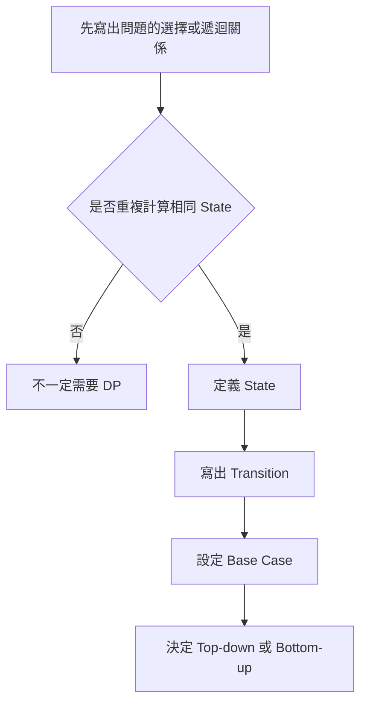
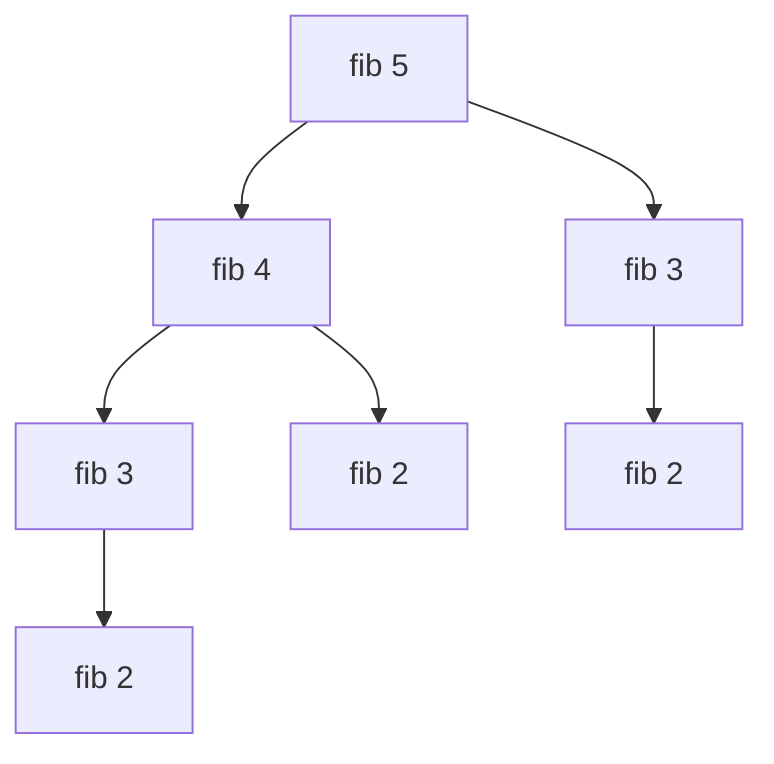
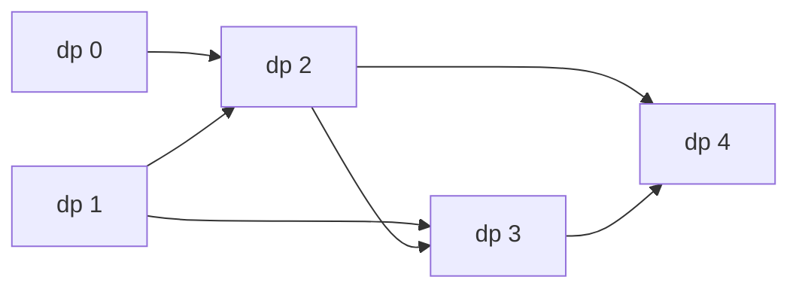
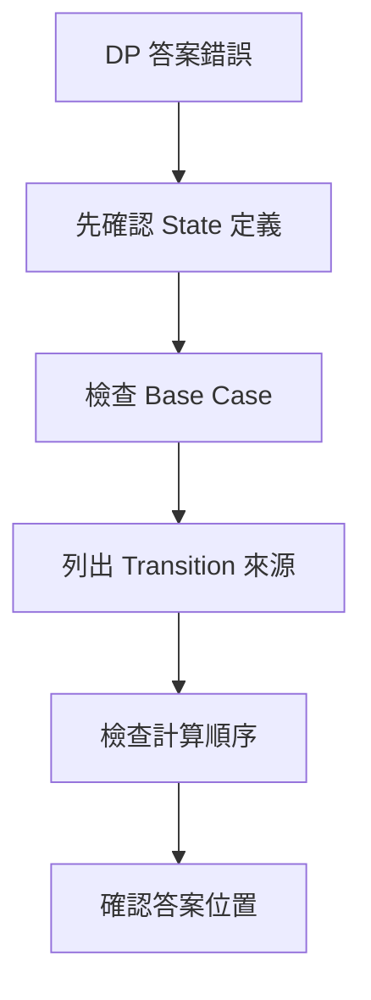

## 第 37 章　Dynamic Programming 基礎

### 適用範圍

本章說明 Dynamic Programming，簡稱 DP。DP 適合處理能拆成重複子問題，而且大問題答案可由較小問題答案組成的問題。

原始章節強調，第一次接觸 DP 時，常見困難不是不會寫 Array，而是不知道 `dp[i]` 應該代表什麼、Transition 從哪裡推導、Base Case 為什麼是那些值、Top-down 與 Bottom-up 的關係，以及題目出現「最大、最小、方法數」是否一定是 DP。原始章節也說明，本章不從模板開始，而是先從直接遞迴中的重複工作推導 DP。citeturn51search1

本版會把 DP 的入門流程補成更完整的分析方法：

- 從暴力遞迴找重複子問題。
- 用完整句子定義 State。
- 從最後一步或合法選擇推導 Transition。
- 設定 Base Case。
- 判斷使用 Top-down 或 Bottom-up。
- 用狀態依賴圖確認計算順序。
- 檢查是否符合 Optimal Substructure。
- 釐清何時不是 DP，或 State 不夠完整。



### 適用讀者

- 能看懂 DP 答案，但很難自己定義 State 的讀者。
- 容易背 Transition，卻說不出每一項意思的讀者。
- 不清楚 Memoization 與 Tabulation 差異的讀者。
- 想建立固定 DP 分析流程的讀者。
- 常在 Base Case、小輸入與計算順序上出錯的讀者。

### 快速導覽

- [37.1 DP 前到底要分析什麼](#371-dp-前到底要分析什麼)
- [37.2 從 Fibonacci 的重複工作開始](#372-從-fibonacci-的重複工作開始)
- [37.3 State](#373-state)
- [37.4 Transition](#374-transition)
- [37.5 Base Case](#375-base-case)
- [37.6 Top-down Memoization](#376-top-down-memoization)
- [37.7 Bottom-up Tabulation](#377-bottom-up-tabulation)
- [37.8 Optimal Substructure](#378-optimal-substructure)
- [37.9 DP 五步分析法](#379-dp-五步分析法)
- [37.10 狀態依賴圖與計算順序](#3710-狀態依賴圖與計算順序)
- [37.11 Memo Sentinel 與 visited](#3711-memo-sentinel-與-visited)
- [37.12 DP 題型的輸出目標](#3712-dp-題型的輸出目標)
- [37.13 什麼時候不適合直接用 DP](#3713-什麼時候不適合直接用-dp)
- [37.14 系統化 Debug](#3714-系統化-debug)
- [37.15 常見問題與判讀](#3715-常見問題與判讀)
- [37.16 本章檢查表](#3716-本章檢查表)
- [37.17 本章重點](#3717-本章重點)

### 37.1 DP 前到底要分析什麼

假設題目要求計算 Fibonacci：

```text
fib(0) = 0
fib(1) = 1
fib(n) = fib(n - 1) + fib(n - 2)
```

先整理：

<table>
<tr><th>分析項目</th><th>本題內容</th><th>影響</th></tr>
<tr><td>輸入</td><td>非負整數 n</td><td>需要處理 n = 0、1</td></tr>
<tr><td>輸出</td><td>`fib(n)`</td><td>答案是單一數值</td></tr>
<tr><td>最小問題</td><td>n 為 0 或 1</td><td>Base Case</td></tr>
<tr><td>大問題來自哪些小問題</td><td>n - 1 與 n - 2</td><td>Transition</td></tr>
<tr><td>是否重複計算</td><td>是，例如 fib(3) 會從不同分支重複出現</td><td>可用 Memo 或 Table</td></tr>
<tr><td>State</td><td>目前要計算的 n</td><td>`dp[i] = fib(i)`</td></tr>
</table>

DP 的第一步不是建立 `dp` Array，而是先能說明「同一個子問題是否被重複求解」。原始章節也以 Fibonacci 分析表說明，DP 的第一步是確認重複子問題，而不是直接建立陣列。citeturn51search1

#### DP 題目前置檢查

遇到題目時，先問：

1. 能不能拆成較小問題？
2. 不同路徑是否會遇到相同子問題？
3. 子問題答案是否只由 State 決定，而不是受未保存的歷史影響？
4. 大問題答案是否可由小問題答案組合？
5. State 數量是否可接受？

如果第 2 點不成立，可能不需要 DP。如果第 3 點不成立，通常代表 State 不夠完整，或問題需要其他方法。

### 37.2 從 Fibonacci 的重複工作開始

直接遞迴：

```cpp
long long fibonacci(int n)
{
    if (n <= 1)
    {
        return n;
    }

    return fibonacci(n - 1) + fibonacci(n - 2);
}
```

`fibonacci(5)` 的呼叫會重複出現相同子問題：



如果 `fib(3)` 已經算過，再次遇到時可以直接讀取答案。這就是 Memoization 的核心。原始章節也用 `fibonacci(5)` 的呼叫圖說明相同子問題會重複出現。citeturn51search1

#### 從遞迴到 DP

直接遞迴慢的原因不是「遞迴本身慢」，而是反覆計算相同 State。

```text
fib(5)
會需要 fib(4) 與 fib(3)
fib(4) 又需要 fib(3)
```

因此只要把每個 `fib(i)` 的答案保存起來，就可以避免重算。

#### 重複子問題的判斷

若遞迴樹中同一個參數組合反覆出現，通常代表可考慮 Memoization。例如：

```text
f(i)
f(i, j)
f(index, remaining)
f(node, state)
```

但若每個子問題只出現一次，DP 可能沒有明顯收益。

### 37.3 State

State 是足以描述一個子問題的資訊。

在 Fibonacci 中：

```text
dp[i] = fib(i)
```

這個定義必須能回答：

- `i` 表示什麼？
- `dp[i]` 保存什麼答案？
- 最後要讀取哪一格？

原始章節也指出，不清楚 State 語意時，Transition 很容易寫錯。citeturn51search1

#### State 要用完整句子定義

不好的定義：

```text
dp[i] = 答案
```

較好的定義：

```text
dp[i] = fib(i)
```

更完整的定義：

```text
dp[i] = 輸入 n 為 i 時，Fibonacci 的值。
```

在其他題中，完整句子更重要。例如：

```text
dp[i] = 到達第 i 階的方法數
dp[i] = 考慮前 i 間房屋時可偷到的最大金額
dp[i][j] = first 前 i 個字元與 second 前 j 個字元的 LCS 長度
```

#### State 不一定只有一個 Index

有些問題可能需要：

```text
dp[i][j]
```

例如 `i` 表示處理到哪個位置，`j` 表示剩餘容量或另一個字串位置。原始章節也提到，State 應只保存會影響未來選擇的必要資訊。citeturn51search1

#### State 要保存足以影響未來的資訊

如果未來選擇會受某個條件影響，而 State 沒有保存它，就會把不同情況誤合併。

例如 House Robber 若只知道「目前最大金額」，但不知道是否選了最後一間，可能會影響下一間能否選。常見解法透過「考慮前 i 間」的 State 與 Transition 隱含處理這個限制，或在其他問題中明確加入維度。

### 37.4 Transition

Transition 說明目前 State 如何由較小 State 得到。

Fibonacci：

```text
dp[i] = dp[i - 1] + dp[i - 2]
```

原因不是因為模板長這樣，而是 Fibonacci 定義本身表示：

- 大問題 `fib(i)` 需要 `fib(i - 1)`。
- 也需要 `fib(i - 2)`。
- 兩者相加得到 `fib(i)`。

原始章節也說明，Transition 應從題目本身的合法選擇推導，而不是只背公式。citeturn51search1

#### Transition 中常見運算

<table>
<tr><th>輸出目標</th><th>常見組合方式</th><th>例子</th></tr>
<tr><td>方法數</td><td>將不同來源的方法數相加</td><td>Climbing Stairs</td></tr>
<tr><td>最大收益</td><td>在合法選擇中取最大值</td><td>House Robber</td></tr>
<tr><td>最小成本</td><td>在合法選擇中取最小值</td><td>Minimum Cost Path</td></tr>
<tr><td>是否可行</td><td>將合法來源做 Boolean 組合</td><td>Subset Sum</td></tr>
</table>

原始章節也整理了方法數、最大收益、最小成本、是否可行的常見組合方式，但同時提醒仍應從題目選擇推導，不要只看「最大」就直接套 `max`。citeturn51search1

#### 從最後一步推導

遇到新題時，常用問題是：

```text
要得到目前 State，最後一步可能從哪裡來？
```

例如到達第 i 階：

```text
最後一步可能從 i-1 走 1 階
或從 i-2 走 2 階
```

因此 Transition 來自 `dp[i-1]` 與 `dp[i-2]`。

#### 從「選或不選」推導

在選擇類題目中，常問：

```text
目前元素選嗎？不選嗎？
```

例如 House Robber：

```text
不選目前房屋 -> dp[i-1]
選目前房屋 -> dp[i-2] + nums[i-1]
```

所以取最大值。

### 37.5 Base Case

Base Case 是不需要依賴其他 State 就能確定的答案。

Fibonacci：

```text
dp[0] = 0
dp[1] = 1
```

Base Case 同時決定：

- Array 需要多大。
- 迴圈從哪裡開始。
- 小輸入是否能正確處理。

原始章節也提醒，若 `n == 0`，程式不能先寫入 `dp[1]`，因此初始化前要先處理輸入大小。citeturn51search1

#### Base Case 的常見形式

<table>
<tr><th>題型</th><th>Base Case 意義</th><th>例子</th></tr>
<tr><td>數值遞推</td><td>最小 n 的已知值</td><td>`fib(0)=0`, `fib(1)=1`</td></tr>
<tr><td>方法數</td><td>空選擇或起點有一種方法</td><td>`dp[0]=1`</td></tr>
<tr><td>最小成本</td><td>起點成本或空成本</td><td>`dp[0]=0`</td></tr>
<tr><td>Boolean</td><td>空集合可形成初始狀態</td><td>`possible[0]=true`</td></tr>
<tr><td>不可達 State</td><td>非 Base State 需 Sentinel</td><td>`INF` 或 `false`</td></tr>
</table>

#### Base Case 不只是避免越界

Base Case 代表最小問題的真實答案。如果 Base Case 語意錯誤，即使不越界，後面 Transition 也會一路傳遞錯誤。

例如 Climbing Stairs 中：

```text
dp[0] = 1
```

不是因為第 0 階真的有一種走法到某處，而是表示「站在起點尚未移動」是一種方式，讓後續方法數相加成立。

### 37.6 Top-down Memoization

Top-down 從原問題開始，使用遞迴尋找需要的子問題，並把已算答案保存起來。

```cpp
#include <vector>

long long fibonacciMemo(
    int n,
    std::vector<long long>& memo)
{
    if (n <= 1)
    {
        return n;
    }

    if (memo[n] != -1)
    {
        return memo[n];
    }

    memo[n] = fibonacciMemo(n - 1, memo)
            + fibonacciMemo(n - 2, memo);

    return memo[n];
}
```

呼叫：

```cpp
std::vector<long long> memo(n + 1, -1);
long long answer = fibonacciMemo(n, memo);
```

Top-down 的優點是接近原始遞迴思考，而且只計算實際需要的 State。限制是需要遞迴 Stack，深度過大時要注意 Stack Overflow。原始章節也列出這些優點與限制。citeturn51search1

#### Top-down 適合情境

- 原始遞迴關係很自然。
- 不是所有 State 都一定會被用到。
- State 空間稀疏。
- 想先驗證 Transition 正確性。

#### Top-down 的注意事項

- Memo 是否真的被讀取？
- Sentinel 是否和合法答案衝突？
- 遞迴深度是否可能過大？
- 是否有 Cycle 導致遞迴不停止？

### 37.7 Bottom-up Tabulation

Bottom-up 先計算小 State，再依序得到大 State。

```cpp
#include <vector>

long long fibonacciTable(int n)
{
    if (n <= 1)
    {
        return n;
    }

    std::vector<long long> dp(n + 1, 0);
    dp[0] = 0;
    dp[1] = 1;

    for (int i = 2; i <= n; ++i)
    {
        dp[i] = dp[i - 1] + dp[i - 2];
    }

    return dp[n];
}
```



計算順序必須保證 Transition 所依賴的 State 已經完成。原始章節也用狀態依賴圖提醒，Bottom-up 的順序要符合 State 依賴。citeturn51search1

#### Bottom-up 適合情境

- State 範圍清楚。
- 幾乎所有 State 都會被用到。
- 想避免遞迴 Stack。
- 計算順序容易寫成迴圈。

#### Bottom-up 的注意事項

- Base Case 是否已填好？
- 迴圈起點是否正確？
- 是否可能讀取未計算 State？
- 最後答案在哪個 State？

### 37.8 Optimal Substructure

Optimal Substructure 表示大問題的最佳答案可以由較小子問題的最佳答案組成。

例如最小成本問題若最後一步只能來自兩個位置，則目前最小成本可能是：

```text
目前成本 + min(前一個 State, 前兩個 State)
```

但不是所有最佳化問題都能這樣拆。若局部子問題的最佳答案會因為未保存的歷史選擇而影響未來，就表示 State 定義可能不完整，或問題不符合此 DP 形式。原始章節也用這個方向說明 Optimal Substructure 的限制。citeturn51search1

#### 反例思考

如果某個子問題的最佳解在更大問題中不能使用，可能代表 State 缺少資訊。

例如：

```text
只保存目前最高收益，但未保存最後選了哪個元素。
```

下一步是否合法可能取決於最後元素，因此 State 需要補上「最後位置」或「最後狀態」。

#### 判斷問題

問自己：

```text
如果我只知道這個 State 的最佳答案，是否足以推導未來？
```

若答案是否定，就需要補 State 或改用其他方法。

### 37.9 DP 五步分析法

遇到 DP 題時，可以依序回答：

1. State 是什麼？
2. Transition 是什麼？
3. Base Case 是什麼？
4. 計算順序是什麼？
5. 最後答案在哪裡？

原始章節也提出這套 DP 五步分析法。citeturn51search1

<table>
<tr><th>欄位</th><th>Fibonacci</th></tr>
<tr><td>State</td><td>`dp[i]` 表示 `fib(i)`</td></tr>
<tr><td>Transition</td><td>`dp[i] = dp[i-1] + dp[i-2]`</td></tr>
<tr><td>Base Case</td><td>`dp[0] = 0`、`dp[1] = 1`</td></tr>
<tr><td>計算順序</td><td>由小到大</td></tr>
<tr><td>答案</td><td>`dp[n]`</td></tr>
</table>

#### 建議使用的分析模板

```markdown
## DP 分析

### State
`dp[...] = ...`

### Transition
從哪些合法來源來？
如何組合？

### Base Case
最小 State 是什麼？答案是多少？

### Order
Top-down 還是 Bottom-up？
若 Bottom-up，計算順序是什麼？

### Answer
最後讀哪個 State？

### Complexity
State 數量 × 每個 State 的 Transition 成本。
```

### 37.10 狀態依賴圖與計算順序

若 `dp[i]` 依賴 `dp[i - 1]`，就必須先完成 `i - 1`。

狀態依賴圖可以幫助確認：

- 是否存在循環依賴。
- Bottom-up 應由左到右或由右到左。
- 是否能壓縮空間。

原始章節也指出，如果目前 State 只依賴前兩格，就不一定需要保存整個 Array，第 38 章會進一步說明 Rolling Variables。citeturn51search1

#### 依賴方向例子

```text
dp[i] depends on dp[i-1], dp[i-2]
```

計算順序：

```text
i = 0, 1, 2, 3, ...
```

若依賴方向相反：

```text
dp[i] depends on dp[i+1]
```

就可能需要由右到左計算。

#### 有 Cycle 時

如果 State 互相依賴形成 Cycle：

```text
dp[a] depends on dp[b]
dp[b] depends on dp[a]
```

單純 Bottom-up 可能無法一次填表。可能需要：

- 重新定義 State。
- 使用 Graph 演算法。
- 使用迭代鬆弛。
- 先確認是否其實是 DAG。

### 37.11 Memo Sentinel 與 visited

Top-down Memo 常需要判斷某個 State 是否已計算。

常見寫法：

```cpp
std::vector<long long> memo(n + 1, -1);
```

但如果合法答案可能是 -1，這種 Sentinel 就會衝突。原始章節的常見問題表也提醒，Memo Sentinel 衝突時，應另用 visited 或 optional 狀態。citeturn51search1

#### 使用 visited

```cpp
#include <vector>

long long solve(
    int state,
    std::vector<long long>& memo,
    std::vector<bool>& visited)
{
    if (visited[state])
    {
        return memo[state];
    }

    visited[state] = true;

    // compute answer
    memo[state] = 0;

    return memo[state];
}
```

#### 使用 optional

```cpp
#include <optional>
#include <vector>

std::vector<std::optional<long long>> memo;
```

使用 `optional` 可清楚表示「尚未計算」與「計算結果」是不同概念。

### 37.12 DP 題型的輸出目標

DP 並不只處理最大值或最小值。

<table>
<tr><th>輸出目標</th><th>State 保存</th><th>Transition 常見形式</th></tr>
<tr><td>方法數</td><td>count</td><td>加總不同來源</td></tr>
<tr><td>最大收益</td><td>best</td><td>取 max</td></tr>
<tr><td>最小成本</td><td>cost</td><td>取 min</td></tr>
<tr><td>是否可行</td><td>bool</td><td>OR 合法來源</td></tr>
<tr><td>字典序或具體方案</td><td>value + parent</td><td>需 Tie-breaking 或 Reconstruction</td></tr>
</table>

原始章節也提醒，不要只看「最大」就直接套 `max`，仍應從題目合法選擇推導。citeturn51search1

#### 初始化差異

- 方法數：通常用 0，Base Case 設 1。
- 最大值：若空集合合法可用 0，否則可能要負無限。
- 最小值：通常用 INF。
- Boolean：通常用 false，Base Case 設 true。

初始化要符合 State 語意，不能所有題目都填 0。

### 37.13 什麼時候不適合直接用 DP

題目出現「最大、最小、方法數」不代表一定是 DP。原始章節也在問題列表中提醒，題目出現「最大、最小、方法數」不一定就能直接套 DP。citeturn51search1

可能不適合直接用 DP 的情況：

<table>
<tr><th>情況</th><th>可能方向</th></tr>
<tr><td>沒有重複子問題</td><td>普通遞迴、分治、搜尋</td></tr>
<tr><td>State 數量太大</td><td>貪心、剪枝、壓縮 State、數學</td></tr>
<tr><td>缺少 Optimal Substructure</td><td>補 State 或改模型</td></tr>
<tr><td>依賴形成 Cycle</td><td>Graph 演算法、拓樸排序、鬆弛</td></tr>
<tr><td>局部選擇可證明安全</td><td>Greedy</td></tr>
</table>

#### DP 前的成本估算

假設：

```text
State 數量 = N
每個 State Transition 成本 = K
總時間 = O(N × K)
```

如果 State 數量本身已經太大，DP 可能不可行。

### 37.14 系統化 Debug

DP Debug 不應只看最後答案。應逐格確認 State 是否符合定義。

#### Debug 欄位

```text
State 是什麼
Base Case 是否正確
目前 State 的合法來源
每個來源的值
Transition 結果
是否讀到未計算 State
答案位置
```

#### 最小測試

- n = 0。
- n = 1。
- n = 2。
- 空輸入。
- 單一元素。
- 題目中的最小合法案例。



#### 常見 Debug 方法

- 手動列出小型 DP Table。
- 印出每個 State 的更新來源。
- 對 Top-down，記錄每個 State 是否只計算一次。
- 對 Bottom-up，檢查每次讀取的 State 是否已完成。
- 若有空間壓縮，先用完整表驗證，再壓縮。

### 37.15 常見問題與判讀

原始章節列出常見問題：看得懂 Transition 但不會自己寫、小輸入越界、Bottom-up 讀到未計算值、Top-down 仍然很慢、Memo Sentinel 衝突、空間複雜度漏算等。citeturn51search1

<table>
<tr><th>現象</th><th>可能原因</th><th>第一輪檢查</th></tr>
<tr><td>看得懂 Transition 但不會自己寫</td><td>沒有先定義 State</td><td>先用一句話寫出 `dp[i]` 意義</td></tr>
<tr><td>小輸入越界</td><td>Base Case 與 Array 大小不一致</td><td>測試 n 為 0、1、2</td></tr>
<tr><td>Bottom-up 讀到未計算值</td><td>計算順序錯誤</td><td>畫狀態依賴圖</td></tr>
<tr><td>Top-down 仍然很慢</td><td>沒有保存或沒有讀取 Memo</td><td>確認每個 State 只計算一次</td></tr>
<tr><td>Memo Sentinel 衝突</td><td>-1 可能是合法答案</td><td>另用 visited 或 optional 狀態</td></tr>
<tr><td>空間複雜度漏算</td><td>忽略遞迴 Stack</td><td>Top-down 要列入最大深度</td></tr>
<tr><td>答案位置錯誤</td><td>State 定義和回傳位置不一致</td><td>確認答案是否真的在 `dp[n]`</td></tr>
<tr><td>初始化全部為 0 導致錯誤</td><td>不可達 State 被當成合法</td><td>最小值題常需 INF</td></tr>
<tr><td>空間壓縮後錯誤</td><td>更新順序覆蓋舊 State</td><td>先用完整 DP Table 驗證</td></tr>
</table>

### 37.16 本章檢查表

- 我能找出直接遞迴中的重複子問題。
- 我能用一句話定義每個 DP State。
- 我能判斷 State 是否保存足以影響未來的資訊。
- 我能從最後一步或選擇推導 Transition。
- 我能設定最小輸入的 Base Case。
- 我能區分 Top-down Memoization 與 Bottom-up Tabulation。
- 我能畫出簡單的狀態依賴圖。
- 我能確認 Bottom-up 的計算順序。
- 我知道答案不一定總是在 `dp[n]`，需依 State 定義判斷。
- 我會測試 0、1、2 等小型輸入。
- 我會檢查 Sentinel、不可達 State 與遞迴 Stack。

原始章節檢查表也包含重複子問題、State、Transition、Base Case、Top-down / Bottom-up、狀態依賴圖、計算順序、答案位置與小型輸入測試等項目。citeturn51search1

### 37.17 本章重點

- DP 不是看到最大值或最小值就直接套用的模板。
- 重複子問題表示相同 State 會被反覆求解。
- Optimal Substructure 表示大問題答案可由較小子問題答案組成。
- State 必須保存足以影響未來的資訊。
- Transition 應從題目的合法選擇推導。
- Base Case 決定最小問題答案與初始化方式。
- Top-down 使用遞迴與 Memo，Bottom-up 依順序填表。
- 計算順序必須符合 State 依賴。
- 分析 DP 時可固定回答 State、Transition、Base Case、順序與答案位置。
- DP Debug 應逐格檢查 State 語意，而不是只看最後答案。
