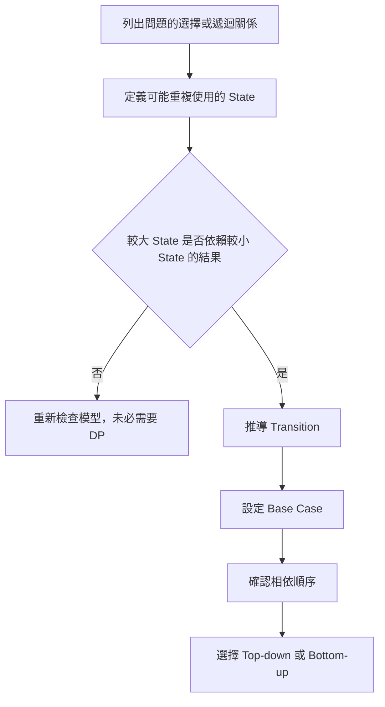
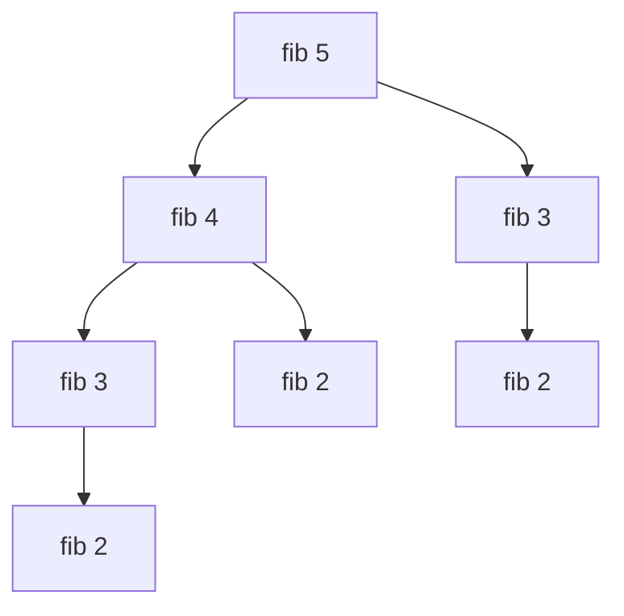
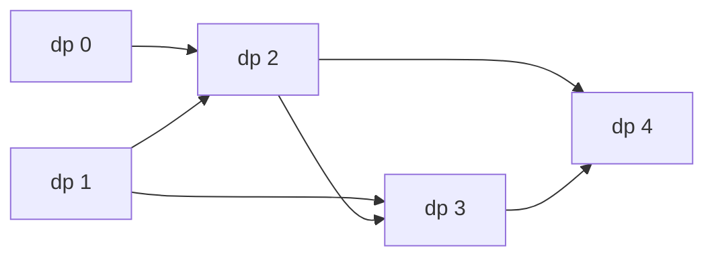
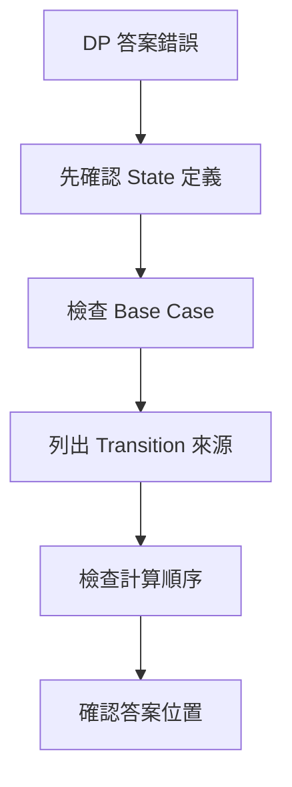

## 第 37 章　Dynamic Programming 基礎

### 適用範圍

本章說明 Dynamic Programming，簡稱 DP。第一次接觸 DP 時，常見困難通常不是 Array 語法，而是不知道 `dp[i]` 應該代表什麼、Transition 如何推導、Base Case 為什麼要設定成特定值，以及 Top-down 與 Bottom-up 有什麼關係。

本章不從公式模板開始，而是先觀察問題中的子問題與相依關係，再逐步建立完整分析流程：

- 從暴力遞迴或合法選擇找出子問題。
- 用完整句子定義 State。
- 從最後一步或合法選擇推導 Transition。
- 設定符合 State 語意的 Base Case。
- 判斷使用 Top-down 或 Bottom-up。
- 用狀態依賴圖確認計算順序。
- 檢查較小 State 的答案是否足以組合成較大 State。
- 估算 State 數量與每個 State 的 Transition 成本。
- 釐清何時不需要 DP，或 State 尚未保存足夠資訊。



### 適用讀者

- 能看懂 DP 答案，但很難自己定義 State 的讀者。
- 容易背 Transition，卻說不出每一項意思的讀者。
- 不清楚 Memoization 與 Tabulation 差異的讀者。
- 想建立固定 DP 分析流程的讀者。
- 常在 Base Case、小輸入與計算順序上出錯的讀者。

### 快速導覽

- [37.1 DP 前到底要分析什麼](#371-dp-前到底要分析什麼)
- [37.2 從 Fibonacci 的重複工作開始](#372-從-fibonacci-的重複工作開始)
- [37.3 State](#373-state)
- [37.4 Transition](#374-transition)
- [37.5 Base Case](#375-base-case)
- [37.6 Top-down Memoization](#376-top-down-memoization)
- [37.7 Bottom-up Tabulation](#377-bottom-up-tabulation)
- [37.8 子問題可組合性與 Optimal Substructure](#378-子問題可組合性與-optimal-substructure)
- [37.9 完整案例：House Robber](#379-完整案例house-robber)
- [37.10 DP 五步分析法](#3710-dp-五步分析法)
- [37.11 狀態依賴圖與計算順序](#3711-狀態依賴圖與計算順序)
- [37.12 Memo Sentinel 與 visited](#3712-memo-sentinel-與-visited)
- [37.13 DP 題型的輸出目標](#3713-dp-題型的輸出目標)
- [37.14 什麼時候不適合直接用 DP](#3714-什麼時候不適合直接用-dp)
- [37.15 系統化 Debug](#3715-系統化-debug)
- [37.16 常見問題與判讀](#3716-常見問題與判讀)
- [37.17 本章檢查表](#3717-本章檢查表)
- [37.18 本章重點](#3718-本章重點)

### 37.1 DP 前到底要分析什麼

假設題目要求計算 Fibonacci：

```text
fib(0) = 0
fib(1) = 1
fib(n) = fib(n - 1) + fib(n - 2)
```

先整理：

<table>
<tr><th>分析項目</th><th>本題內容</th><th>影響</th></tr>
<tr><td>輸入</td><td>非負整數 n</td><td>需要處理 n = 0、1</td></tr>
<tr><td>輸出</td><td>`fib(n)`</td><td>答案是單一數值</td></tr>
<tr><td>最小問題</td><td>n 為 0 或 1</td><td>Base Case</td></tr>
<tr><td>大問題來自哪些小問題</td><td>n - 1 與 n - 2</td><td>Transition</td></tr>
<tr><td>是否重複計算</td><td>是，例如 fib(3) 會從不同分支重複出現</td><td>可用 Memo 或 Table</td></tr>
<tr><td>State</td><td>目前要計算的 n</td><td>`dp[i] = fib(i)`</td></tr>
</table>

#### DP 題目前置檢查

遇到題目時，先問：

1. 能不能拆成較小問題？
2. 多個較大 State 是否會依賴相同的較小 State，或中間答案是否值得保存？
3. 子問題答案是否只由 State 決定，而不是受未保存的歷史影響？
4. 大問題答案是否可由小問題答案組合？
5. State 數量是否可接受？

如果第 2 點不成立，DP 可能沒有明顯收益。如果第 3 點不成立，通常代表 State 不夠完整，或問題需要其他方法。

Top-down 常從遞迴樹中觀察到同一組參數重複出現；Bottom-up 則可能直接依狀態相依順序填表，不一定要先寫出會重複呼叫的遞迴版本。DP 的重點是讓每個 State 的答案最多計算一次，再提供給其他 State 使用。

### 37.2 從 Fibonacci 的重複工作開始

直接遞迴：

```cpp
long long fibonacci(int n)
{
    if (n <= 1)
    {
        return n;
    }

    return fibonacci(n - 1) + fibonacci(n - 2);
}
```

`fibonacci(5)` 的呼叫會重複出現相同子問題：



#### 從遞迴到 DP

直接遞迴慢的原因不是「遞迴本身慢」，而是反覆計算相同 State。

```text
fib(5)
會需要 fib(4) 與 fib(3)
fib(4) 又需要 fib(3)
```

因此只要把每個 `fib(i)` 的答案保存起來，就可以避免重算。

#### 重複子問題的判斷

若遞迴樹中同一個參數組合反覆出現，通常代表可考慮 Memoization。例如：

```text
f(i)
f(i, j)
f(index, remaining)
f(node, state)
```

但若每個子問題只出現一次，DP 可能沒有明顯收益。

### 37.3 State

State 是足以描述一個子問題的資訊。

在 Fibonacci 中：

```text
dp[i] = fib(i)
```

這個定義必須能回答：

- `i` 表示什麼？
- `dp[i]` 保存什麼答案？
- 最後要讀取哪一格？

#### State 要用完整句子定義

不好的定義：

```text
dp[i] = 答案
```

較好的定義：

```text
dp[i] = fib(i)
```

更完整的定義：

```text
dp[i] = 輸入 n 為 i 時，Fibonacci 的值。
```

在其他題中，完整句子更重要。例如：

```text
dp[i] = 到達第 i 階的方法數
dp[i] = 考慮前 i 間房屋時可偷到的最大金額
dp[i][j] = first 前 i 個字元與 second 前 j 個字元的 LCS 長度
```

#### State 不一定只有一個 Index

有些問題可能需要：

```text
dp[i][j]
```

#### State 的 `i` 是 Index，還是元素數量

同樣寫成 `dp[i]`，`i` 可能有兩種常見語意：

```text
定義 A：dp[i] = 到達 Index i 時的答案
目前元素通常是 values[i]

定義 B：dp[i] = 考慮前 i 個元素時的答案
目前元素通常是 values[i - 1]
dp[0] 表示尚未考慮任何元素
```

兩種定義都可以使用，但 State、Base Case、Transition、迴圈範圍與最終答案必須採用同一套語意。若定義為「前 `i` 個元素」，卻在 Transition 中讀取 `values[i]`，通常會產生 Off-by-one Error。

#### State 要保存足以影響未來的資訊

如果未來選擇會受某個條件影響，而 State 沒有保存它，就會把不同情況誤合併。

例如 House Robber 可定義：

```text
dp[i] = 考慮前 i 間房屋時可取得的最大金額
```

計算 `dp[i]` 時，Transition 分別從「不選第 `i` 間」與「選第 `i` 間」兩種相容的前綴 State 取得答案，因此不必另外保存最佳方案是否選了最後一間。若未來是否合法無法只由這些前綴 State 判斷，才需要增加 State 維度。

### 37.4 Transition

Transition 說明目前 State 如何由較小 State 得到。

Fibonacci：

```text
dp[i] = dp[i - 1] + dp[i - 2]
```

原因不是因為模板長這樣，而是 Fibonacci 定義本身表示：

- 大問題 `fib(i)` 需要 `fib(i - 1)`。
- 也需要 `fib(i - 2)`。
- 兩者相加得到 `fib(i)`。

#### Transition 中常見運算

<table>
<tr><th>輸出目標</th><th>常見組合方式</th><th>例子</th></tr>
<tr><td>方法數</td><td>將互不重疊來源的方法數相加</td><td>Climbing Stairs</td></tr>
<tr><td>最大收益</td><td>在合法選擇中取最大值</td><td>House Robber</td></tr>
<tr><td>最小成本</td><td>在合法選擇中取最小值</td><td>Minimum Cost Path</td></tr>
<tr><td>是否可行</td><td>將合法來源做 Boolean 組合</td><td>Subset Sum</td></tr>
</table>

#### 從最後一步推導

遇到新題時，常用問題是：

```text
要得到目前 State，最後一步可能從哪裡來？
```

例如到達第 i 階：

```text
最後一步可能從 i-1 走 1 階
或從 i-2 走 2 階
```

因此 Transition 來自 `dp[i-1]` 與 `dp[i-2]`。方法數相加前，還要確認不同來源代表互不重疊的方案分類，讓每個完整方案恰好被計算一次。

#### 從「選或不選」推導

在選擇類題目中，常問：

```text
目前元素選嗎？不選嗎？
```

例如 House Robber：

```text
不選目前房屋 -> dp[i-1]
選目前房屋 -> dp[i-2] + nums[i-1]
```

所以取最大值。

### 37.5 Base Case

Base Case 是不需要依賴其他 State 就能確定的答案。

Fibonacci：

```text
dp[0] = 0
dp[1] = 1
```

Base Case 同時決定：

- Array 需要多大。
- 迴圈從哪裡開始。
- 小輸入是否能正確處理。

#### Base Case 的常見形式

<table>
<tr><th>題型</th><th>Base Case 意義</th><th>例子</th></tr>
<tr><td>數值遞推</td><td>最小 n 的已知值</td><td>`fib(0)=0`, `fib(1)=1`</td></tr>
<tr><td>方法數</td><td>空選擇或起點有一種方法</td><td>`dp[0]=1`</td></tr>
<tr><td>最小成本</td><td>起點成本或空成本</td><td>`dp[0]=0`</td></tr>
<tr><td>Boolean</td><td>空集合可形成初始狀態</td><td>`possible[0]=true`</td></tr>
<tr><td>不可達 State</td><td>非 Base State 需 Sentinel</td><td>`INF` 或 `false`</td></tr>
</table>

#### Base Case 不只是避免越界

Base Case 代表最小問題的真實答案。如果 Base Case 語意錯誤，即使不越界，後面 Transition 也會一路傳遞錯誤。

例如 Climbing Stairs 中：

```text
dp[0] = 1
```

如果 `dp[i]` 定義為「從起點恰好走到第 `i` 階的方法數」，那麼 `dp[0] = 1` 表示有一種方式到達起點，也就是不採取任何步驟的空序列。這不是為了配合公式而任意補上的數值，而是 State 在 `i = 0` 時的真實答案。

有些寫法改以 `dp[1] = 1`、`dp[2] = 2` 作為起點。兩種方式都可以，但必須先固定 State 定義，並讓 Base Case、迴圈起點與答案位置保持一致。

### 37.6 Top-down Memoization

Top-down 從原問題開始，使用遞迴尋找需要的子問題，並把已算答案保存起來。

```cpp
#include <vector>

long long fibonacciMemo(
    int n,
    std::vector<long long>& memo)
{
    if (n <= 1)
    {
        return n;
    }

    if (memo[n] != -1)
    {
        return memo[n];
    }

    memo[n] = fibonacciMemo(n - 1, memo)
            + fibonacciMemo(n - 2, memo);

    return memo[n];
}
```

呼叫：

```cpp
std::vector<long long> memo(n + 1, -1);
long long answer = fibonacciMemo(n, memo);
```

#### Top-down 適合情境

- 原始遞迴關係很自然。
- 不是所有 State 都一定會被用到。
- State 空間稀疏。
- 想先驗證 Transition 正確性。

#### Top-down 的注意事項

- Memo 是否真的被讀取？
- Sentinel 是否和合法答案衝突？
- 遞迴深度是否可能過大？
- 是否有 Cycle 導致遞迴不停止？

### 37.7 Bottom-up Tabulation

Bottom-up 先計算小 State，再依序得到大 State。Top-down 與 Bottom-up 通常具有相同的 State、Transition 與 Base Case，主要差別在求值順序：Top-down 由原問題按需求遞迴展開，Bottom-up 則依相依順序主動填表。

```cpp
#include <vector>

long long fibonacciTable(int n)
{
    if (n <= 1)
    {
        return n;
    }

    std::vector<long long> dp(n + 1, 0);
    dp[0] = 0;
    dp[1] = 1;

    for (int i = 2; i <= n; ++i)
    {
        dp[i] = dp[i - 1] + dp[i - 2];
    }

    return dp[n];
}
```



#### Bottom-up 適合情境

- State 範圍清楚。
- 幾乎所有 State 都會被用到。
- 想避免遞迴 Stack。
- 計算順序容易寫成迴圈。

#### Bottom-up 的注意事項

- Base Case 是否已填好？
- 迴圈起點是否正確？
- 是否可能讀取未計算 State？
- 最後答案在哪個 State？

### 37.8 子問題可組合性與 Optimal Substructure

DP 一般需要以下性質：較大 State 的答案，可以由較小 State 的答案組合而成。這個「答案」不一定是最大值或最小值，也可能是方法數、Boolean 可行性或其他資訊。

在最大化或最小化問題中，還要確認 **Optimal Substructure**：大問題的最佳答案可以由適當子問題的最佳答案組成。

例如，若到達目前位置的最後一步只可能來自前一格或前兩格，最小成本可以寫成：

```text
cost[i] = currentCost[i] + min(cost[i - 1], cost[i - 2])
```

這個 Transition 成立的前提是：一旦選定最後一步的來源，只需要知道該來源 State 的最小成本，不需要保留其他歷史資訊。

#### 反例思考

若某個較小 State 只保存最高收益，但下一步是否合法仍取決於「最後選了哪個元素」或「某項資源是否已使用」，單一最高收益就不足以支援未來決策。此時可能需要：

- 增加 State 維度，保存會影響未來的資訊。
- 改變 State 定義，使合法歷史被正確區分。
- 改用其他問題模型或演算法。

判斷時可以問：

```text
如果我只知道這個 State 保存的答案，是否足以列出所有合法的下一步？
```

若答案是否定，State 通常尚未完整。

### 37.9 完整案例：House Robber

#### 問題規格

給定一排房屋，每間房屋有一個非負金額。相鄰房屋不能同時選取，求最多可以取得多少金額。

```text
輸入：2, 7, 9, 3, 1
輸出：12
其中一個最佳選擇：2 + 9 + 1
```

#### 第一步：列出目前房屋的合法選擇

對第 `i` 間房屋，只有兩種互斥選擇：

1. 不選第 `i` 間，因此答案沿用前 `i - 1` 間的最佳結果。
2. 選第 `i` 間，因此不能選第 `i - 1` 間，要把目前金額加到前 `i - 2` 間的最佳結果。

這個分類涵蓋所有合法方案，而且不會讓同一方案同時落入兩類。

#### 第二步：定義 State

```text
dp[i] = 考慮前 i 間房屋時，可以取得的最大金額
```

這裡的 `i` 是房屋數量，不是 Array Index。因此：

- `dp[0]` 表示沒有考慮任何房屋。
- `dp[1]` 表示只考慮 `nums[0]`。
- 計算 `dp[i]` 時，目前房屋是 `nums[i - 1]`。
- 最後答案位於 `dp[n]`。

#### 第三步：推導 Transition

```text
不選目前房屋：dp[i - 1]
選目前房屋：dp[i - 2] + nums[i - 1]
```

因此：

```text
dp[i] = max(dp[i - 1], dp[i - 2] + nums[i - 1])
```

#### 第四步：設定 Base Case

```text
dp[0] = 0
dp[1] = nums[0]
```

- 沒有房屋時，最大金額為 0。
- 只有一間且金額非負時，選取該房屋即可。

#### 第五步：確認計算順序

`dp[i]` 依賴 `dp[i - 1]` 與 `dp[i - 2]`，因此 Bottom-up 應由小到大計算。


#### Bottom-up 程式

```cpp
#include <algorithm>
#include <vector>

long long rob(const std::vector<int>& nums) {
    const int n = static_cast<int>(nums.size());

    if (n == 0) {
        return 0;
    }

    std::vector<long long> dp(n + 1, 0);
    dp[0] = 0;
    dp[1] = nums[0];

    for (int i = 2; i <= n; ++i) {
        const long long skipCurrent = dp[i - 1];
        const long long takeCurrent = dp[i - 2] + nums[i - 1];
        dp[i] = std::max(skipCurrent, takeCurrent);
    }

    return dp[n];
}
```

#### 逐格追蹤

對 `nums = [2, 7, 9, 3, 1]`：

| State | 目前考慮範圍 | 不選目前房屋 | 選目前房屋 | `dp[i]` |
|---|---|---:|---:|---:|
| `dp[0]` | 空集合 | 不適用 | 不適用 | 0 |
| `dp[1]` | `[2]` | 0 | 2 | 2 |
| `dp[2]` | `[2, 7]` | 2 | 7 | 7 |
| `dp[3]` | `[2, 7, 9]` | 7 | 11 | 11 |
| `dp[4]` | `[2, 7, 9, 3]` | 11 | 10 | 11 |
| `dp[5]` | `[2, 7, 9, 3, 1]` | 11 | 12 | 12 |

#### Loop Invariant

每次準備計算 `dp[i]` 時：

1. `dp[0]` 到 `dp[i - 1]` 都符合 State 定義。
2. `dp[i - 1]` 是前 `i - 1` 間房屋的最佳答案。
3. `dp[i - 2]` 是前 `i - 2` 間房屋的最佳答案。
4. 所以「不選目前房屋」與「選目前房屋」兩個候選值都已可取得。

取兩者最大值後，`dp[i]` 便符合 State 定義。

#### 邊界案例

- 空輸入：回傳 0。
- 一間房屋：回傳該房屋金額。
- 兩間房屋：回傳兩者較大值。
- 全部金額為 0：回傳 0。
- 金額總和可能超過 `int` 時，DP Table 使用 `long long`。

#### 複雜度

- State 數量為 `n + 1`。
- 每個 State 只比較兩個候選值，Transition 成本為 O(1)。
- 時間複雜度為 O(n)。
- DP Table 空間為 O(n)。

由於每個 State 只依賴前兩格，可進一步壓縮為 O(1) 額外空間。不過在確認 State 與 Transition 正確前，先保留完整 Table 通常更容易追蹤與除錯。

### 37.10 DP 五步分析法

遇到 DP 題時，可以依序回答：

1. State 是什麼？
2. Transition 是什麼？
3. Base Case 是什麼？
4. 計算順序是什麼？
5. 最後答案在哪裡？

<table>
<tr><th>欄位</th><th>Fibonacci</th></tr>
<tr><td>State</td><td>`dp[i]` 表示 `fib(i)`</td></tr>
<tr><td>Transition</td><td>`dp[i] = dp[i-1] + dp[i-2]`</td></tr>
<tr><td>Base Case</td><td>`dp[0] = 0`、`dp[1] = 1`</td></tr>
<tr><td>計算順序</td><td>由小到大</td></tr>
<tr><td>答案</td><td>`dp[n]`</td></tr>
</table>

#### 建議使用的分析模板

```markdown
## DP 分析

### State
`dp[...] = ...`

### Transition
從哪些合法來源來？
如何組合？

### Base Case
最小 State 是什麼？答案是多少？

### Order
Top-down 還是 Bottom-up？
若 Bottom-up，計算順序是什麼？

### Answer
最後讀哪個 State？

### Complexity
State 數量 × 每個 State 的 Transition 成本。
```

### 37.11 狀態依賴圖與計算順序

若 `dp[i]` 依賴 `dp[i - 1]`，就必須先完成 `i - 1`。

狀態依賴圖可以幫助確認：

- 是否存在循環依賴。
- Bottom-up 應由左到右或由右到左。
- 是否能壓縮空間。

#### 依賴方向例子

```text
dp[i] depends on dp[i-1], dp[i-2]
```

計算順序：

```text
i = 0, 1, 2, 3, ...
```

若依賴方向相反：

```text
dp[i] depends on dp[i+1]
```

就可能需要由右到左計算。

#### 有 Cycle 時

如果 State 互相依賴形成 Cycle：

```text
dp[a] depends on dp[b]
dp[b] depends on dp[a]
```

經典 Bottom-up DP 通常要求 State Dependency 可依某種順序排列，使每個 State 在計算時，其相依 State 已完成。若相依關係形成真正的 Cycle，就不能直接使用一次性的填表順序。此時應先確認：

1. Transition 的依賴方向是否寫反。
2. State 是否缺少「已處理進度」等資訊。
3. 問題是否其實是 Graph 上的最短路徑、連通性或反覆鬆弛問題。
4. 相依圖是否能轉換成 DAG 後再依拓樸順序計算。

### 37.12 Memo Sentinel 與 visited

Top-down Memo 常需要判斷某個 State 是否已計算。

常見寫法：

```cpp
std::vector<long long> memo(n + 1, -1);
```

#### 使用 `visited`

```cpp
#include <vector>

long long solve(
    int state,
    std::vector<long long>& memo,
    std::vector<bool>& computed) {

    if (computed[state]) {
        return memo[state];
    }

    long long answer = 0;
    // 使用較小 State 計算 answer

    memo[state] = answer;
    computed[state] = true;
    return memo[state];
}
```

`computed[state]` 應表示答案已經完整算好。如果遞迴相依可能形成 Cycle，單一 Boolean 不足以區分「尚未拜訪」、「計算中」與「已完成」，需要三種狀態或其他 Cycle Detection 方法。

#### 使用 `optional`

```cpp
#include <optional>
#include <vector>

std::vector<std::optional<long long>> memo;

if (memo[state].has_value()) {
    return *memo[state];
}

memo[state] = answer;
return *memo[state];
```

`optional` 可清楚區分「尚未計算」與「已計算，而且合法答案剛好是 -1」。

### 37.13 DP 題型的輸出目標

DP 並不只處理最大值或最小值。

<table>
<tr><th>輸出目標</th><th>State 保存</th><th>Transition 常見形式</th></tr>
<tr><td>方法數</td><td>count</td><td>加總不同來源</td></tr>
<tr><td>最大收益</td><td>best</td><td>取 max</td></tr>
<tr><td>最小成本</td><td>cost</td><td>取 min</td></tr>
<tr><td>是否可行</td><td>bool</td><td>OR 合法來源</td></tr>
<tr><td>字典序或具體方案</td><td>value + parent</td><td>需 Tie-breaking 或 Reconstruction</td></tr>
</table>

#### 初始化差異

- 方法數：通常用 0，Base Case 設 1。
- 最大值：若空集合合法可用 0，否則可能要負無限。
- 最小值：通常用 INF。
- Boolean：通常用 false，Base Case 設 true。

初始化要符合 State 語意，不能所有題目都填 0。

### 37.14 什麼時候不適合直接用 DP

可能不適合直接用 DP 的情況：

<table>
<tr><th>情況</th><th>可能方向</th></tr>
<tr><td>沒有重複子問題</td><td>普通遞迴、分治、搜尋</td></tr>
<tr><td>State 數量太大</td><td>貪心、剪枝、壓縮 State、數學</td></tr>
<tr><td>缺少 Optimal Substructure</td><td>補 State 或改模型</td></tr>
<tr><td>依賴形成 Cycle</td><td>Graph 演算法、拓樸排序、鬆弛</td></tr>
<tr><td>局部選擇可證明安全</td><td>Greedy</td></tr>
</table>

#### DP 前的成本估算

假設：

```text
實際計算的 State 數量 = N
每個 State 的平均或最差 Transition 成本 = K
總時間通常為 O(N × K)
Table 或 Memo 空間通常為 O(N)
Top-down 額外計入最大遞迴深度
```

如果 State 數量本身已經太大，DP 可能不可行。若不同 State 的候選數量不固定，應加總所有 Transition 的實際成本，而不是機械套用 `N × K`。

### 37.15 系統化 Debug

DP Debug 不應只看最後答案。應逐格確認 State 是否符合定義。

#### Debug 欄位

```text
State 是什麼
Base Case 是否正確
目前 State 的合法來源
每個來源的值
Transition 結果
是否讀到未計算 State
答案位置
```

#### 最小測試

- n = 0。
- n = 1。
- n = 2。
- 空輸入。
- 單一元素。
- 題目中的最小合法案例。



#### 常見 Debug 方法

- 手動列出小型 DP Table。
- 印出每個 State 的更新來源。
- 對 Top-down，記錄每個 State 是否只計算一次。
- 對 Bottom-up，檢查每次讀取的 State 是否已完成。
- 若有空間壓縮，先用完整表驗證，再壓縮。
- 對小輸入保留容易確認的暴力遞迴或枚舉版本，將結果與 DP 比較。
- 若兩者不同，輸出第一個失敗案例及其 DP Table。

### 37.16 常見問題與判讀

<table>
<tr><th>現象</th><th>可能原因</th><th>第一輪檢查</th></tr>
<tr><td>看得懂 Transition 但不會自己寫</td><td>沒有先定義 State</td><td>先用一句話寫出 `dp[i]` 意義</td></tr>
<tr><td>小輸入越界</td><td>Base Case 與 Array 大小不一致</td><td>測試 n 為 0、1、2</td></tr>
<tr><td>Bottom-up 讀到未計算值</td><td>計算順序錯誤</td><td>畫狀態依賴圖</td></tr>
<tr><td>Top-down 仍然很慢</td><td>沒有保存或沒有讀取 Memo</td><td>確認每個 State 只計算一次</td></tr>
<tr><td>Memo Sentinel 衝突</td><td>-1 可能是合法答案</td><td>另用 visited 或 optional 狀態</td></tr>
<tr><td>空間複雜度漏算</td><td>忽略遞迴 Stack</td><td>Top-down 要列入最大深度</td></tr>
<tr><td>答案位置錯誤</td><td>State 定義和回傳位置不一致</td><td>確認答案是否真的在 `dp[n]`</td></tr>
<tr><td>初始化全部為 0 導致錯誤</td><td>不可達 State 被當成合法</td><td>最小值題常需 INF</td></tr>
<tr><td>空間壓縮後錯誤</td><td>更新順序覆蓋舊 State</td><td>先用完整 DP Table 驗證</td></tr>
</table>

### 37.17 本章檢查表

- 我能找出直接遞迴中的重複子問題。
- 我能用一句話定義每個 DP State。
- 我能判斷 State 是否保存足以影響未來的資訊。
- 我能從最後一步或選擇推導 Transition。
- 我能設定最小輸入的 Base Case。
- 我能區分 Top-down Memoization 與 Bottom-up Tabulation。
- 我能畫出簡單的狀態依賴圖。
- 我能確認 Bottom-up 的計算順序。
- 我知道答案不一定總是在 `dp[n]`，需依 State 定義判斷。
- 我會測試 0、1、2 等小型輸入。
- 我會檢查 Sentinel、不可達 State 與遞迴 Stack。

### 37.18 本章重點

- DP 不是看到最大值或最小值就直接套用的模板。
- 多個較大 State 可能依賴相同的較小 State；DP 保存中間答案，避免同一 State 重複求值。
- DP 的 State 必須具有可組合的子問題結構；在最佳化問題中，還要確認是否具有 Optimal Substructure。
- State 必須保存足以影響未來的資訊。
- Transition 應從題目的合法選擇推導。
- Base Case 決定最小問題答案與初始化方式。
- Top-down 使用遞迴與 Memo，Bottom-up 依順序填表。
- 計算順序必須符合 State 依賴。
- 分析 DP 時可固定回答 State、Transition、Base Case、順序與答案位置。
- DP Debug 應逐格檢查 State 語意，而不是只看最後答案。
