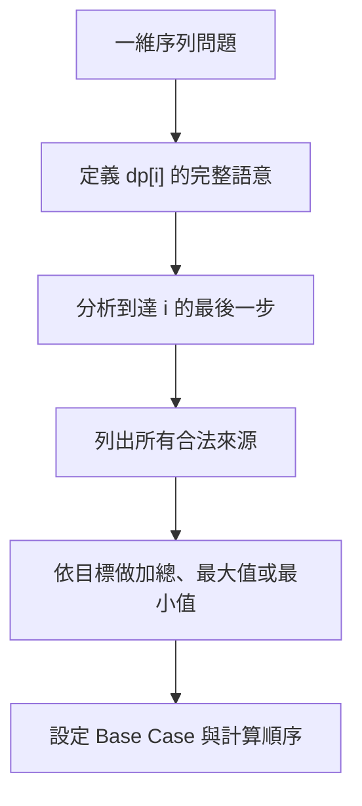
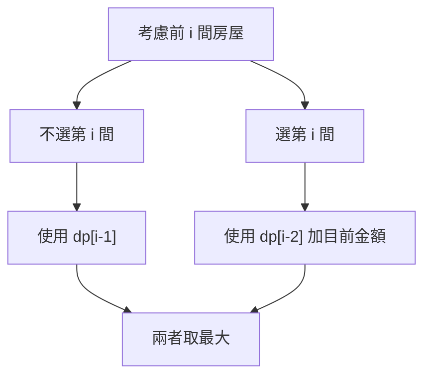
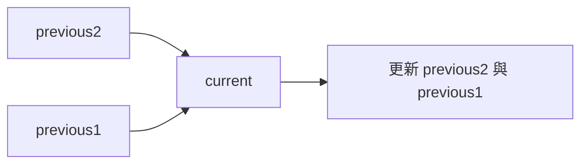
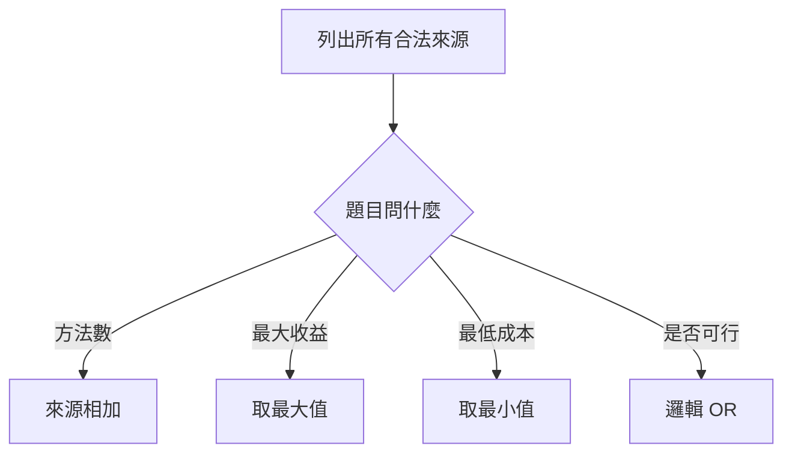
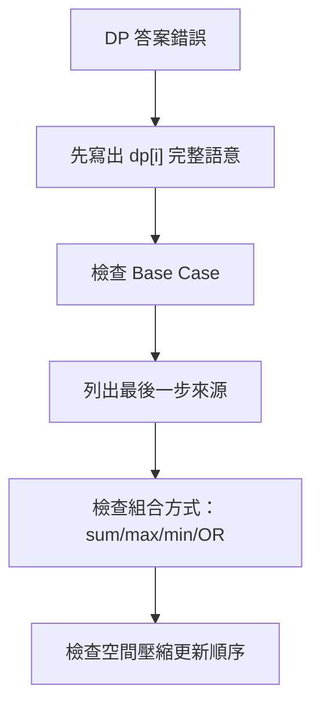

## 第 38 章　一維 Dynamic Programming

### 適用範圍

本章將第 37 章的 State、Transition 與 Base Case 套用到常見一維 DP 題型。一維 DP 常見於序列、階梯、線性選擇、最大收益、最小成本、方法數與有限前置狀態問題。

一維 DP 不代表題目一定簡單。原始章節已經指出，新手常見困難是不同題目都使用 `dp[i]`，但每題的 `dp[i]` 意義不同：Fibonacci 的 `dp[i]` 是數值，Climbing Stairs 的 `dp[i]` 是方法數，House Robber 的 `dp[i]` 是最大金額，Minimum Cost 的 `dp[i]` 是最低成本。citeturn50search1

本章會用固定流程處理一維 DP：

1. 用完整句子定義 `dp[i]`。
2. 分析到達 `i` 或處理到 `i` 的最後一步。
3. 列出所有合法來源。
4. 依題目目標選擇加總、最大值或最小值。
5. 設定 Base Case。
6. 決定計算順序。
7. 最後再考慮空間壓縮與 Reconstruction。



### 適用讀者

- 已理解 DP 基礎，但遇到新題仍不會定義 `dp[i]` 的讀者。
- 容易混淆方法數、最大收益與最小成本 Transition 的讀者。
- 想理解空間壓縮與 Rolling Variables 的讀者。
- 常在 n 為 0 或 1 時越界的讀者。
- 想從最後一步推導 Transition，而不是只背公式的讀者。

### 快速導覽

- [38.1 一維 DP 前到底要分析什麼](#381-一維-dp-前到底要分析什麼)
- [38.2 Fibonacci 類型](#382-fibonacci-類型)
- [38.3 Climbing Stairs](#383-climbing-stairs)
- [38.4 House Robber](#384-house-robber)
- [38.5 Minimum Cost Climbing Stairs](#385-minimum-cost-climbing-stairs)
- [38.6 狀態壓縮](#386-狀態壓縮)
- [38.7 Rolling Array 與 Rolling Variables](#387-rolling-array-與-rolling-variables)
- [38.8 如何從最後一步推導 Transition](#388-如何從最後一步推導-transition)
- [38.9 計數、最大值、最小值的初始化差異](#389-計數最大值最小值的初始化差異)
- [38.10 Reconstruction：還原選擇](#3810-reconstruction還原選擇)
- [38.11 常見一維 DP 變化](#3811-常見一維-dp-變化)
- [38.12 系統化 Debug](#3812-系統化-debug)
- [38.13 常見問題與判讀](#3813-常見問題與判讀)
- [38.14 本章檢查表](#3814-本章檢查表)
- [38.15 本章重點](#3815-本章重點)

### 38.1 一維 DP 前到底要分析什麼

假設題目如下：

```text
有 n 階樓梯，每次可以走 1 階或 2 階，求到達第 n 階的方法數。
```

先整理：

<table>
<tr><th>分析項目</th><th>本題內容</th><th>影響</th></tr>
<tr><td>State</td><td>`dp[i]` 表示到達第 i 階的方法數</td><td>決定 dp 保存的是方法數</td></tr>
<tr><td>最後一步</td><td>從 i - 1 走 1 階，或從 i - 2 走 2 階</td><td>合法來源有兩個</td></tr>
<tr><td>Transition</td><td>`dp[i] = dp[i-1] + dp[i-2]`</td><td>方法數相加</td></tr>
<tr><td>Base Case</td><td>需依第 0 階語意定義</td><td>影響 n = 0、1、2</td></tr>
<tr><td>計算順序</td><td>由小到大</td><td>確保來源已完成</td></tr>
<tr><td>答案</td><td>`dp[n]`</td><td>答案位置明確</td></tr>
</table>

原始章節也用 Climbing Stairs 這個題目提醒：Transition 和 Fibonacci 相同，但 State 語意不同，不能只因公式相同就把兩題視為完全相同。citeturn50search1

#### 一維 DP 的五個問題

每次看到 `dp[i]`，先問：

1. `i` 是 Index、長度、位置，還是已處理個數？
2. `dp[i]` 保存的是方法數、最大值、最小值、Boolean，還是其他資訊？
3. `dp[i]` 的最後一步可能從哪些 State 來？
4. 這些來源要相加、取最大、取最小，還是 OR？
5. `dp[0]`、`dp[1]` 的語意是什麼？

### 38.2 Fibonacci 類型

Fibonacci：

```text
dp[i] = dp[i - 1] + dp[i - 2]
```

完整版本：

```cpp
#include <vector>

long long fibonacci(int n)
{
    if (n <= 1)
    {
        return n;
    }

    std::vector<long long> dp(n + 1, 0);
    dp[0] = 0;
    dp[1] = 1;

    for (int i = 2; i <= n; ++i)
    {
        dp[i] = dp[i - 1] + dp[i - 2];
    }

    return dp[n];
}
```

原始章節也提供 Fibonacci DP 版本與逐輪表，說明 `dp[i]` 由前兩項相加。citeturn50search1

#### 逐輪表

<table>
<tr><th>i</th><th>dp[i - 2]</th><th>dp[i - 1]</th><th>dp[i]</th></tr>
<tr><td>2</td><td>0</td><td>1</td><td>1</td></tr>
<tr><td>3</td><td>1</td><td>1</td><td>2</td></tr>
<tr><td>4</td><td>1</td><td>2</td><td>3</td></tr>
<tr><td>5</td><td>2</td><td>3</td><td>5</td></tr>
</table>

#### Fibonacci 的重點

Fibonacci 是最簡單的一維 DP 形式，但實際題目不一定只是在算數列。應把 Fibonacci 當作「依賴前兩個 State」的範例，而不是看到 `dp[i-1] + dp[i-2]` 就直接判斷題型。

### 38.3 Climbing Stairs

#### State

```text
dp[i] = 到達第 i 階的方法數
```

#### Transition

到達 i 的最後一步只有兩種：

- 從 i - 1 走 1 階。
- 從 i - 2 走 2 階。

因此：

```text
dp[i] = dp[i - 1] + dp[i - 2]
```

#### Base Case

可定義：

```text
dp[0] = 1
dp[1] = 1
```

`dp[0] = 1` 表示站在起點本身有一種「尚未移動」的方式。它讓 Transition 在 i = 2 時自然成立。原始章節也使用這個 Base Case 解釋 Climbing Stairs。citeturn50search1

```cpp
#include <vector>

long long climbStairs(int n)
{
    if (n <= 1)
    {
        return 1;
    }

    std::vector<long long> dp(n + 1, 0);
    dp[0] = 1;
    dp[1] = 1;

    for (int i = 2; i <= n; ++i)
    {
        dp[i] = dp[i - 1] + dp[i - 2];
    }

    return dp[n];
}
```

#### n = 3 的方法

```text
1 + 1 + 1
1 + 2
2 + 1
```

共 3 種。原始章節也列出這三種方法。citeturn50search1

#### Fibonacci 與 Climbing Stairs 的差異

<table>
<tr><th>題目</th><th>dp[i] 語意</th><th>Base Case</th></tr>
<tr><td>Fibonacci</td><td>第 i 個 Fibonacci 數</td><td>`dp[0]=0, dp[1]=1`</td></tr>
<tr><td>Climbing Stairs</td><td>到達第 i 階的方法數</td><td>`dp[0]=1, dp[1]=1`</td></tr>
</table>

公式相似，不代表 State 相同。

### 38.4 House Robber

題目：一排房屋中，相鄰房屋不能同時選，求最大金額。

對：

```text
[2, 7, 9, 3, 1]
```

#### State

```text
dp[i] = 考慮前 i 間房屋時，可取得的最大金額
```

這裡 `i` 表示房屋數量，不直接表示 Array Index。原始章節也特別提醒，House Robber 中 `i` 表示房屋數量，因此目前金額是 `nums[i-1]`。citeturn50search1

#### 最後一間房屋的兩種選擇

- 不選第 i 間：答案是 `dp[i - 1]`。
- 選第 i 間：前一間不能選，所以是 `dp[i - 2] + nums[i - 1]`。

```text
dp[i] = max(dp[i - 1], dp[i - 2] + nums[i - 1])
```



原始章節也使用這個圖像與 Transition 說明 House Robber。citeturn50search1

#### C++ 實作

```cpp
#include <algorithm>
#include <vector>

long long rob(const std::vector<int>& nums)
{
    int n = static_cast<int>(nums.size());

    if (n == 0)
    {
        return 0;
    }

    std::vector<long long> dp(n + 1, 0);
    dp[0] = 0;
    dp[1] = nums[0];

    for (int i = 2; i <= n; ++i)
    {
        dp[i] = std::max(
            dp[i - 1],
            dp[i - 2] + nums[i - 1]);
    }

    return dp[n];
}
```

#### 逐輪表

<table>
<tr><th>i</th><th>不選目前房屋</th><th>選目前房屋</th><th>dp[i]</th></tr>
<tr><td>1</td><td>0</td><td>2</td><td>2</td></tr>
<tr><td>2</td><td>2</td><td>7</td><td>7</td></tr>
<tr><td>3</td><td>7</td><td>2 + 9 = 11</td><td>11</td></tr>
<tr><td>4</td><td>11</td><td>7 + 3 = 10</td><td>11</td></tr>
<tr><td>5</td><td>11</td><td>11 + 1 = 12</td><td>12</td></tr>
</table>

原始章節也使用同一組 `[2,7,9,3,1]` 逐輪推導，最後答案為 12。citeturn50search1

### 38.5 Minimum Cost Climbing Stairs

假設 `cost[i]` 表示踩上第 i 階要付的成本。每次可以走 1 或 2 階，求到達樓梯頂端的最低成本。

#### State

```text
dp[i] = 到達位置 i 前所需的最低成本
```

樓梯頂端可視為位置 n，不需支付 `cost[n]`。

#### Transition

到達 i 可以從 i - 1 或 i - 2：

```text
dp[i] = min(
    dp[i - 1] + cost[i - 1],
    dp[i - 2] + cost[i - 2]
)
```

#### Base Case

題目通常允許從第 0 階或第 1 階開始：

```text
dp[0] = 0
dp[1] = 0
```

原始章節也用這個 State、Transition 與 Base Case 說明 Minimum Cost Climbing Stairs，並提醒這題容易混淆「到達 i 的成本」和「踩上 i 的成本」。citeturn50search1

```cpp
#include <algorithm>
#include <vector>

long long minCostClimbingStairs(const std::vector<int>& cost)
{
    int n = static_cast<int>(cost.size());
    std::vector<long long> dp(n + 1, 0);

    for (int i = 2; i <= n; ++i)
    {
        dp[i] = std::min(
            dp[i - 1] + cost[i - 1],
            dp[i - 2] + cost[i - 2]);
    }

    return dp[n];
}
```

#### State 定義不同，公式會不同

如果改定義：

```text
dp[i] = 踩上第 i 階時的最低成本
```

則 Transition 會變成：

```text
dp[i] = cost[i] + min(dp[i-1], dp[i-2])
```

最後答案會是：

```text
min(dp[n-1], dp[n-2])
```

兩種寫法都可行，但不能混用。

### 38.6 狀態壓縮

若 `dp[i]` 只依賴 `dp[i - 1]` 與 `dp[i - 2]`，就不必保存整個 Array。

Fibonacci 可壓縮成：

```cpp
long long fibonacciCompressed(int n)
{
    if (n <= 1)
    {
        return n;
    }

    long long previous2 = 0;
    long long previous1 = 1;

    for (int i = 2; i <= n; ++i)
    {
        long long current = previous1 + previous2;
        previous2 = previous1;
        previous1 = current;
    }

    return previous1;
}
```



時間仍為 O(n)，額外空間從 O(n) 降為 O(1)。原始章節也以 Fibonacci 壓縮版本說明這一點。citeturn50search1

#### House Robber 壓縮版

```cpp
#include <algorithm>
#include <vector>

long long robCompressed(const std::vector<int>& nums)
{
    long long previous2 = 0;
    long long previous1 = 0;

    for (int money : nums)
    {
        long long current = std::max(previous1, previous2 + money);
        previous2 = previous1;
        previous1 = current;
    }

    return previous1;
}
```

這裡：

```text
previous1 = dp[i - 1]
previous2 = dp[i - 2]
```

處理目前房屋後，`current` 成為新的 `dp[i]`。

### 38.7 Rolling Array 與 Rolling Variables

Rolling Variables 使用少量變數保存最近 State。

Rolling Array 則使用固定大小 Array，透過取餘數重複使用位置：

```cpp
dp[i % 2] = dp[(i - 1) % 2] + dp[(i - 2) % 2];
```

原始章節也指出，對只依賴前兩格的一維問題，具名變數通常更容易閱讀；若依賴固定 k 層或二維 DP 的前幾列，Rolling Array 可能較方便。citeturn50search1

#### Rolling Variables 適合

- 只依賴前一格或前兩格。
- 不需要還原路徑。
- 不需要輸出每個 State。
- 更新順序容易描述。

#### Rolling Array 適合

- 依賴固定 k 層。
- 二維 DP 只依賴前一 row。
- 變數數量太多，用陣列較清楚。

#### 壓縮前檢查

原始章節也提醒，空間壓縮前應先確認：是否還需要回溯完整答案、是否需要輸出每一個 State、更新順序是否會覆蓋尚未使用的舊值。citeturn50search1

```text
是否還需要 Reconstruction？
是否需要列出所有 dp[i]？
是否會覆蓋仍需讀取的舊值？
```

### 38.8 如何從最後一步推導 Transition

遇到新題時，可以問：

```text
要到達目前 State，最後一步可能從哪裡來？
```

原始章節也整理了 Climbing Stairs、House Robber、Minimum Cost 的最後一步與組合方式。citeturn50search1

<table>
<tr><th>題目</th><th>最後一步</th><th>組合方式</th></tr>
<tr><td>Climbing Stairs</td><td>從前一階或前兩階來</td><td>方法數相加</td></tr>
<tr><td>House Robber</td><td>不選目前房屋，或選目前房屋</td><td>取最大值</td></tr>
<tr><td>Minimum Cost</td><td>從兩個可到達位置來</td><td>取最小值再加成本</td></tr>
</table>

公式不同，是因為輸出目標與最後一步選擇不同。

#### 組合方式的判斷



#### 常見 State 寫法

- `dp[i] = 到達位置 i 的方法數`
- `dp[i] = 考慮前 i 個元素的最大值`
- `dp[i] = 到達位置 i 的最低成本`
- `dp[i] = 前 i 個元素是否可形成某條件`

先寫成完整句子，再寫公式。

### 38.9 計數、最大值、最小值的初始化差異

不同目標對 Base Case 與初始值要求不同。

<table>
<tr><th>目標</th><th>常見初始值</th><th>原因</th></tr>
<tr><td>方法數</td><td>0，Base Case 設 1</td><td>0 表示沒有方法</td></tr>
<tr><td>最大值</td><td>0 或負無限</td><td>取決於空集合是否合法</td></tr>
<tr><td>最小值</td><td>INF</td><td>避免不可達 State 被誤選</td></tr>
<tr><td>Boolean</td><td>false，Base Case 設 true</td><td>false 表示不可行</td></tr>
</table>

#### 範例：方法數

```text
dp[0] = 1
```

常表示「空方式」或「起點本身」有一種方法。

#### 範例：最小成本

若某些 State 不可達，不能用 0 初始化所有 dp，因為 0 可能比合法成本更小。應使用 INF。

```cpp
const long long INF = 4e18;
std::vector<long long> dp(n + 1, INF);
dp[0] = 0;
```

#### 範例：最大收益

若可以什麼都不選，初始 0 合理。若必須至少選一個，可能要用負無限，避免空集合被當成答案。

### 38.10 Reconstruction：還原選擇

若題目只問最大值或最小值，可以保存一維 DP。若要輸出選了哪些元素、走了哪些步驟，就需要額外資訊。

#### House Robber 還原選擇

使用完整 DP 表時，可從後往前追：

```text
若 dp[i] == dp[i-1]：第 i 間未選
否則：第 i 間已選，跳到 i-2
```

```cpp
#include <algorithm>
#include <vector>

std::vector<int> reconstructRobbedHouses(
    const std::vector<int>& nums,
    const std::vector<long long>& dp)
{
    std::vector<int> chosen;
    int i = static_cast<int>(nums.size());

    while (i >= 1)
    {
        if (dp[i] == dp[i - 1])
        {
            --i;
        }
        else
        {
            chosen.push_back(i - 1);
            i -= 2;
        }
    }

    std::reverse(chosen.begin(), chosen.end());
    return chosen;
}
```

#### Tie-breaking

如果 `dp[i] == dp[i-1]` 且選目前也可得到相同值，表示有多個最佳解。要先定義：要選較早房屋、較少房屋，還是任一解？

#### 空間壓縮的取捨

原始章節也指出，若需要重建答案，不一定適合壓縮全部 State。citeturn50search1

### 38.11 常見一維 DP 變化

#### Maximum Subarray

State：

```text
dp[i] = 以 nums[i] 結尾的最大 subarray sum
```

Transition：

```text
dp[i] = max(nums[i], dp[i - 1] + nums[i])
```

答案是所有 `dp[i]` 最大值。

#### Decode Ways

State：

```text
dp[i] = 解碼前 i 個字元的方法數
```

Transition 由最後 1 位或最後 2 位是否可解碼決定。

#### Word Break

State：

```text
dp[i] = s[0..i) 是否可被字典切分
```

Transition 枚舉前一個切點：

```text
dp[i] = any dp[j] && s[j..i) in dictionary
```

#### Coin Change

若每個 coin 可重複使用，屬於 Unbounded Knapsack 類型。一維 DP 的走訪方向與 Loop 順序會影響語意，詳見背包章節。

### 38.12 系統化 Debug

一維 DP Debug 最有效的方法是列出每一輪的 State 語意與來源。

#### Debug 欄位

```text
i
dp[i] 的語意
合法來源
來源值
本次元素或成本
組合方式
更新後 dp[i]
```

#### 小型測試

- n = 0。
- n = 1。
- n = 2。
- 所有值相同。
- 遞增或遞減。
- 有 0 成本或 0 方法的情境。
- 和手算表格比對。



### 38.13 常見問題與判讀

原始章節列出常見問題，包括只背 Transition、沒有定義 State；House Robber 混淆 i 是房屋數量或 Array Index；Minimum Cost 多加成本；空輸入越界；狀態壓縮後更新順序錯誤；需要還原選擇卻無法回溯。citeturn50search1

<table>
<tr><th>現象</th><th>可能原因</th><th>第一輪檢查</th></tr>
<tr><td>同樣公式卻不理解</td><td>只背 Transition，沒有定義 State</td><td>先寫出 `dp[i]` 的完整句子</td></tr>
<tr><td>House Robber Index 錯位</td><td>混淆 i 是房屋數量或 Array Index</td><td>確認目前金額是 `nums[i-1]`</td></tr>
<tr><td>Minimum Cost 多加一筆成本</td><td>混淆到達位置與踩上階梯</td><td>明確定義頂端是否有成本</td></tr>
<tr><td>空輸入越界</td><td>直接初始化 `dp[1]`</td><td>先處理 n 為 0 或 1</td></tr>
<tr><td>狀態壓縮後答案錯誤</td><td>更新順序覆蓋舊值</td><td>先計算 current，再移動變數</td></tr>
<tr><td>需要還原選擇卻無法回溯</td><td>太早壓縮 DP Array</td><td>若需重建答案，保留必要 State 或 Parent</td></tr>
<tr><td>最大值題答案被 0 取代</td><td>必須選元素卻用 0 初始化</td><td>考慮負無限初始化</td></tr>
<tr><td>最小成本走到不可達 State</td><td>不可達用 0 表示</td><td>使用 INF 或 Optional</td></tr>
<tr><td>方法數 Overflow</td><td>數量成長很快</td><td>使用 long long 或依題目取 mod</td></tr>
</table>

### 38.14 本章檢查表

- 我能用完整句子定義 `dp[i]`。
- 我能判斷 `i` 是 Index、長度、位置還是已處理個數。
- 我能從最後一步列出合法來源。
- 我能依方法數、最大收益或最小成本選擇組合方式。
- 我能說明 Fibonacci 與 Climbing Stairs 公式相同但 State 不同。
- 我能推導 House Robber 的選與不選。
- 我能分辨到達位置成本與踩上階梯成本。
- 我能處理 n 為 0、1、2 的情況。
- 我能判斷何時可使用 O(1) 空間。
- 我知道需要重建答案時，不一定適合壓縮全部 State。
- 我會依題目檢查 Overflow、Modulo 與不可達 State。

原始章節檢查表也包含定義 `dp[i]`、從最後一步列出來源、依方法數 / 最大收益 / 最小成本選擇組合方式、理解 Fibonacci 與 Climbing Stairs State 不同、推導 House Robber、分辨成本語意、處理小 n、判斷空間壓縮與 Reconstruction 等項目。citeturn50search1

### 38.15 本章重點

- 一維 DP 的核心仍是 State、Transition、Base Case、順序與答案位置。
- 相同 Transition 不代表 State 語意相同。
- Climbing Stairs 從最後一步推導出兩個來源，方法數相加。
- House Robber 比較不選目前房屋與選目前房屋兩種情況。
- Minimum Cost 題要先定義成本是在進入位置、離開位置或踩上位置時支付。
- `dp[i]` 只依賴固定少數舊 State 時，可以考慮空間壓縮。
- Rolling Variables 較適合依賴少量前置 State 的一維問題。
- 壓縮空間前，要確認是否需要完整 DP 表重建答案。
- 初始化方式要符合方法數、最大值、最小值或 Boolean 的語意。
