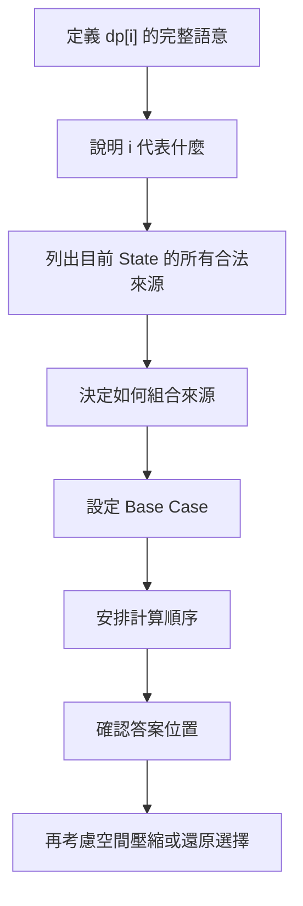
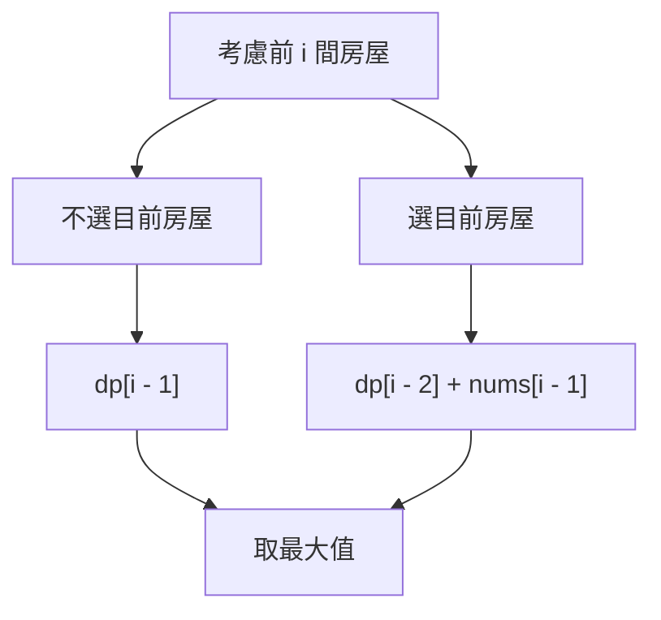
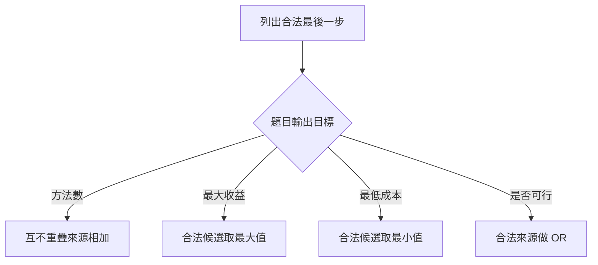
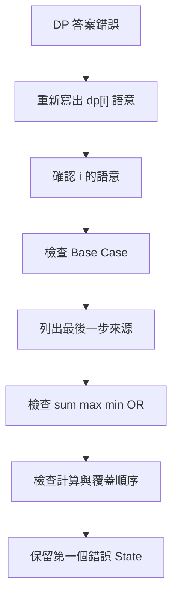

## 第 38 章　一維 Dynamic Programming

### 適用範圍

本章延續第 37 章的 State、Transition、Base Case、計算順序與答案位置，集中處理常見的一維 Dynamic Programming，簡稱一維 DP。

「一維」只表示 State 通常可用一個主要參數描述，例如位置、長度或已處理元素數量，不代表題目一定簡單。不同題目都可能使用 `dp[i]`，但其中保存的資訊完全不同：

- Fibonacci：第 `i` 個數值。
- Climbing Stairs：到達第 `i` 階的方法數。
- House Robber：考慮前 `i` 間房屋時的最大金額。
- Minimum Cost Climbing Stairs：到達位置 `i` 前的最低成本。
- Maximum Subarray：以 Index `i` 結尾的最大連續區間和。

本章使用固定流程分析一維 DP：

1. 用完整句子定義 `dp[i]`。
2. 說明 `i` 是 Index、位置、長度，還是已處理元素數量。
3. 從最後一步或最後一次選擇列出所有合法來源。
4. 確認來源集合是否完整，而且不會重複計數。
5. 依輸出目標進行加總、取最大值、取最小值或 Boolean 組合。
6. 設定符合 State 語意的 Base Case。
7. 依 State Dependency 決定計算順序。
8. 確認最後答案位於哪個 State。
9. 完成正確版本後，再判斷是否適合空間壓縮或 Reconstruction。



### 適用讀者

- 已理解 DP 基礎，但遇到新題仍不容易定義 `dp[i]` 的讀者。
- 容易混淆 Index 與「前 `i` 個元素」的讀者。
- 容易把相似 Transition 誤認為相同問題的讀者。
- 想理解 Rolling Variables、Rolling Array 與更新順序的讀者。
- 常在空輸入、`n = 1`、Overflow 或不可達 State 上出錯的讀者。
- 需要從最佳值還原實際選擇的讀者。

### 快速導覽

- [38.1 一維 DP 的固定分析表](#381-一維-dp-的固定分析表)
- [38.2 `i` 的語意：Index、位置與元素數量](#382-i-的語意index位置與元素數量)
- [38.3 Fibonacci：相同 State 只計算一次](#383-fibonacci相同-state-只計算一次)
- [38.4 Climbing Stairs：方法數與互斥來源](#384-climbing-stairs方法數與互斥來源)
- [38.5 House Robber：選或不選](#385-house-robber選或不選)
- [38.6 Minimum Cost Climbing Stairs：成本在哪裡支付](#386-minimum-cost-climbing-stairs成本在哪裡支付)
- [38.7 從最後一步推導 Transition](#387-從最後一步推導-transition)
- [38.8 初始化：方法數、最大值、最小值與 Boolean](#388-初始化方法數最大值最小值與-boolean)
- [38.9 狀態壓縮與 Rolling Variables](#389-狀態壓縮與-rolling-variables)
- [38.10 Rolling Array 與覆蓋順序](#3810-rolling-array-與覆蓋順序)
- [38.11 Reconstruction：還原實際選擇](#3811-reconstruction還原實際選擇)
- [38.12 常見一維 DP 變化](#3812-常見一維-dp-變化)
- [38.13 複雜度與數值範圍](#3813-複雜度與數值範圍)
- [38.14 系統化 Debug](#3814-系統化-debug)
- [38.15 常見問題與判讀](#3815-常見問題與判讀)
- [38.16 本章檢查表](#3816-本章檢查表)
- [38.17 本章重點](#3817-本章重點)

### 38.1 一維 DP 的固定分析表

以 Climbing Stairs 為例：

```text
有 n 階樓梯，每次可以走 1 階或 2 階，求到達第 n 階的方法數。
```

分析時先完成下列表格：

| 分析項目 | 本題內容 | 影響 |
|---|---|---|
| State | `dp[i]` 表示到達第 `i` 階的方法數 | 決定 Table 保存的是方法數 |
| `i` 的語意 | 樓梯位置 | `dp[n]` 是最終答案 |
| 最後一步 | 從 `i - 1` 走 1 階，或從 `i - 2` 走 2 階 | 有兩個合法來源 |
| 組合方式 | 兩類方法互不重疊，因此相加 | 得到 Transition |
| Base Case | `dp[0] = 1`、`dp[1] = 1` | 支援 `n = 0`、`n = 1` |
| 計算順序 | 由小到大 | 來源 State 會先完成 |
| 答案位置 | `dp[n]` | 回傳位置明確 |

每次看到 `dp[i]`，至少要回答：

1. `i` 代表什麼？
2. `dp[i]` 保存什麼答案？
3. 目前 State 可由哪些較小 State 到達？
4. 為什麼這些來源完整？
5. 方法數相加時，來源是否互不重疊？
6. Base Case 是 State 在最小輸入下的真實答案嗎？
7. Transition 讀取的 State 是否已完成？
8. 最後應回傳單一 State，還是所有 State 的最大值或最小值？

一維 DP 的重點不是 Array 只有一個維度，而是這一個 State 參數是否足以描述會影響未來的資訊。

### 38.2 `i` 的語意：Index、位置與元素數量

最常見的錯誤之一，是同時把 `i` 當成 Array Index 與元素數量。

#### 以 Index 定義

```text
dp[i] = 以 nums[i] 結尾的答案
```

此時：

- `i` 的範圍通常是 `0` 到 `n - 1`。
- 目前元素是 `nums[i]`。
- 空輸入通常需要在建立 Table 前另外處理。

Maximum Subarray 常採用這種定義。

#### 以前 `i` 個元素定義

```text
dp[i] = 考慮 nums 的前 i 個元素時的答案
```

此時：

- `i` 的範圍通常是 `0` 到 `n`。
- `dp[0]` 表示尚未考慮任何元素。
- 第 `i` 個元素的 Array Index 是 `i - 1`。
- 最終答案常位於 `dp[n]`。

House Robber 常採用這種定義。

```text
元素：      nums[0]  nums[1]  nums[2]
元素數量：  dp[1]    dp[2]    dp[3]
```

兩種定義都可行，但 State、Base Case、Transition、迴圈範圍與答案位置必須使用同一套語意。

### 38.3 Fibonacci：相同 State 只計算一次

#### State

```text
dp[i] = 第 i 個 Fibonacci 數
```

#### Transition

```text
dp[i] = dp[i - 1] + dp[i - 2]
```

#### Base Case

```text
dp[0] = 0
dp[1] = 1
```

#### Bottom-up 程式

```cpp
#include <vector>

long long fibonacci(int n) {
    if (n <= 1) {
        return n;
    }

    std::vector<long long> dp(n + 1, 0);
    dp[0] = 0;
    dp[1] = 1;

    for (int i = 2; i <= n; ++i) {
        dp[i] = dp[i - 1] + dp[i - 2];
    }

    return dp[n];
}
```

#### 逐輪追蹤

| `i` | `dp[i - 2]` | `dp[i - 1]` | `dp[i]` |
|---:|---:|---:|---:|
| 2 | 0 | 1 | 1 |
| 3 | 1 | 1 | 2 |
| 4 | 1 | 2 | 3 |
| 5 | 2 | 3 | 5 |

Fibonacci 的價值在於展示「目前 State 依賴前兩個 State」，不是提供所有一維 DP 的通用公式。即使另一題使用相同 Transition，只要 State 或 Base Case 不同，就仍是不同問題。

`long long` 也有數值上限，不能保存任意大的 Fibonacci 數。應依輸入限制判斷是否可能 Overflow；若題目要求取模，應依規格在 Transition 中取模。

### 38.4 Climbing Stairs：方法數與互斥來源

#### State

```text
dp[i] = 從起點恰好到達第 i 階的方法數
```

#### 最後一步

到達第 `i` 階的最後一步只有兩類：

1. 從第 `i - 1` 階走 1 階。
2. 從第 `i - 2` 階走 2 階。

這兩類互不重疊，因為最後一步長度不可能同時是 1 與 2；每個合法走法也必定屬於其中一類。因此可以相加：

```text
dp[i] = dp[i - 1] + dp[i - 2]
```

方法數問題不能只看到多個來源就直接相加。必須確認來源構成完整且互不重疊的分類，否則可能遺漏或重複計數。

#### Base Case

```text
dp[0] = 1
dp[1] = 1
```

`dp[0] = 1` 表示有一種方式到達起點，也就是不採取任何步驟的空序列。這是 State 在 `i = 0` 時的答案，不只是為了讓公式成立而加入的技巧值。

#### Bottom-up 程式

```cpp
#include <vector>

long long climbStairs(int n) {
    if (n <= 1) {
        return 1;
    }

    std::vector<long long> dp(n + 1, 0);
    dp[0] = 1;
    dp[1] = 1;

    for (int i = 2; i <= n; ++i) {
        dp[i] = dp[i - 1] + dp[i - 2];
    }

    return dp[n];
}
```

對 `n = 3`：

```text
1 + 1 + 1
1 + 2
2 + 1
```

共有 3 種。

#### 與 Fibonacci 的差異

| 題目 | `dp[i]` 語意 | Base Case |
|---|---|---|
| Fibonacci | 第 `i` 個 Fibonacci 數 | `dp[0] = 0`、`dp[1] = 1` |
| Climbing Stairs | 到達第 `i` 階的方法數 | `dp[0] = 1`、`dp[1] = 1` |

Transition 相同，不代表 State 與 Base Case 相同。

### 38.5 House Robber：選或不選

#### 問題規格

給定一排非負金額，相鄰房屋不能同時選取，求最多可取得多少金額。

```text
輸入：2, 7, 9, 3, 1
答案：12
其中一個最佳選擇：2 + 9 + 1
```

#### State

```text
dp[i] = 考慮前 i 間房屋時，可取得的最大金額
```

`i` 表示房屋數量，目前房屋的 Array Index 是 `i - 1`。

#### 最後一次選擇

- 不選目前房屋：答案為 `dp[i - 1]`。
- 選目前房屋：前一間不能選，答案為 `dp[i - 2] + nums[i - 1]`。

```text
dp[i] = max(dp[i - 1], dp[i - 2] + nums[i - 1])
```

這兩個候選涵蓋所有合法方案。任一最佳方案對目前房屋而言，不是選，就是不選。



#### Bottom-up 程式

```cpp
#include <algorithm>
#include <vector>

long long rob(const std::vector<int>& nums) {
    const int n = static_cast<int>(nums.size());

    if (n == 0) {
        return 0;
    }

    std::vector<long long> dp(n + 1, 0);
    dp[0] = 0;
    dp[1] = nums[0];

    for (int i = 2; i <= n; ++i) {
        const long long skipCurrent = dp[i - 1];
        const long long takeCurrent = dp[i - 2] + nums[i - 1];
        dp[i] = std::max(skipCurrent, takeCurrent);
    }

    return dp[n];
}
```

#### 逐輪追蹤

| `i` | 不選目前房屋 | 選目前房屋 | `dp[i]` |
|---:|---:|---:|---:|
| 1 | 0 | 2 | 2 |
| 2 | 2 | 7 | 7 |
| 3 | 7 | 2 + 9 = 11 | 11 |
| 4 | 11 | 7 + 3 = 10 | 11 |
| 5 | 11 | 11 + 1 = 12 | 12 |

#### Loop Invariant

每次準備計算 `dp[i]` 時：

1. `dp[0]` 到 `dp[i - 1]` 都符合 State 定義。
2. `dp[i - 1]` 是前 `i - 1` 間房屋的最佳答案。
3. `dp[i - 2]` 是前 `i - 2` 間房屋的最佳答案。
4. 兩個候選值都已可取得。

取兩者最大值後，`dp[i]` 便符合 State 定義。

### 38.6 Minimum Cost Climbing Stairs：成本在哪裡支付

#### 問題規格

`cost[i]` 表示踩上第 `i` 階要支付的成本。每次可以走 1 階或 2 階，可以從第 0 階或第 1 階開始，求到達樓梯頂端的最低成本。頂端視為位置 `n`，本身沒有 `cost[n]`。

#### 定義 A：到達位置前已支付的成本

```text
dp[i] = 到達位置 i 時，已支付的最低總成本
```

要從 `i - 1` 到 `i`，必須先踩過 `i - 1`，因此支付 `cost[i - 1]`。從 `i - 2` 到 `i` 時則支付 `cost[i - 2]`：

```text
dp[i] = min(
    dp[i - 1] + cost[i - 1],
    dp[i - 2] + cost[i - 2]
)
```

Base Case：

```text
dp[0] = 0
dp[1] = 0
```

因為題目允許直接從第 0 階或第 1 階開始，尚未踩上任何先前階梯，所以起始成本為 0。

```cpp
#include <algorithm>
#include <vector>

long long minCostClimbingStairs(const std::vector<int>& cost) {
    const int n = static_cast<int>(cost.size());
    std::vector<long long> dp(n + 1, 0);

    for (int i = 2; i <= n; ++i) {
        const long long fromPrevious = dp[i - 1] + cost[i - 1];
        const long long fromTwoBefore = dp[i - 2] + cost[i - 2];
        dp[i] = std::min(fromPrevious, fromTwoBefore);
    }

    return dp[n];
}
```

#### 定義 B：踩上目前階梯後的成本

也可以改成：

```text
dp[i] = 踩上第 i 階後，已支付的最低總成本
```

此時：

```text
dp[i] = cost[i] + min(dp[i - 1], dp[i - 2])
```

頂端沒有成本，也不在 `dp` 的階梯範圍內，所以答案為：

```text
min(dp[n - 1], dp[n - 2])
```

兩種定義都合理，但不能使用定義 A 的 Transition，再回傳定義 B 的答案位置。遇到成本題時，應先說明成本是在進入位置、離開位置，還是踩上位置時支付。

### 38.7 從最後一步推導 Transition

遇到新題時，先問：

```text
要得到目前 State，最後一步或最後一次選擇可能是什麼？
```

| 題目 | 最後一步或選擇 | 組合方式 |
|---|---|---|
| Climbing Stairs | 最後走 1 階或 2 階 | 互不重疊的方法數相加 |
| House Robber | 不選目前房屋或選目前房屋 | 取最大值 |
| Minimum Cost | 從前一位置或前兩位置到達 | 取最小值 |
| Boolean Reachability | 從任一可行來源到達 | 邏輯 OR |

固定推導流程如下：

1. 固定目前 State `i`。
2. 列出所有能形成 `i` 的合法最後一步。
3. 將每個最後一步改寫成較小 State。
4. 確認來源沒有遺漏。
5. 方法數問題確認來源不重疊。
6. 依題目目標決定加總、`max`、`min` 或 OR。
7. 檢查每個來源的 Index 是否在合法範圍內。



Transition 不是由關鍵字直接決定。即使題目問最大值，也要先證明候選集合涵蓋所有合法方案。

### 38.8 初始化：方法數、最大值、最小值與 Boolean

初始化必須符合 State 語意，不能所有題目都填 0。

| 輸出目標 | 常見初始值 | 注意事項 |
|---|---|---|
| 方法數 | 非 Base State 為 0，Base State 常為 1 | 1 通常表示空方式或起點 |
| 最大值 | 0 或負無限 | 取決於空集合是否合法 |
| 最小值 | `INF` | 避免不可達 State 被誤選 |
| Boolean | `false`，Base State 為 `true` | 表示尚不可達與起點可達 |

#### 方法數

```text
dp[0] = 1
```

通常表示空序列、空選擇或起點本身有一種方式。具體解釋仍由 State 定義決定。

#### 最大值

若允許什麼都不選，初始值 0 可能合理。若題目要求至少選一個元素，而且所有元素可能為負數，使用 0 會把不合法的空集合當成答案，此時需要合法 Base Case 或負無限。

#### 最小值與不可達 State

```cpp
#include <limits>
#include <vector>

const long long INF = std::numeric_limits<long long>::max() / 4;
std::vector<long long> dp(n + 1, INF);
dp[0] = 0;
```

使用 `/ 4` 保留加法空間，但仍應在計算 `dp[state] + cost` 前確認 `dp[state] != INF`。Sentinel 只能降低 Overflow 風險，不能取代可達性檢查。

### 38.9 狀態壓縮與 Rolling Variables

若 `dp[i]` 只依賴固定少數較早 State，就可能不必保存整個 Table。

#### Fibonacci 壓縮版

```cpp
long long fibonacciCompressed(int n) {
    if (n <= 1) {
        return n;
    }

    long long previous2 = 0; // dp[i - 2]
    long long previous1 = 1; // dp[i - 1]

    for (int i = 2; i <= n; ++i) {
        const long long current = previous1 + previous2;
        previous2 = previous1;
        previous1 = current;
    }

    return previous1;
}
```

更新順序要保留舊值：

```text
先用舊 previous1 與舊 previous2 算 current
再令 previous2 = 舊 previous1
最後令 previous1 = current
```

若先覆蓋 `previous1`，後續就可能讀不到上一輪的 `dp[i - 1]`。

#### House Robber 壓縮版

```cpp
#include <algorithm>
#include <vector>

long long robCompressed(const std::vector<int>& nums) {
    long long previous2 = 0;
    long long previous1 = 0;

    for (int money : nums) {
        const long long current = std::max(
            previous1,
            previous2 + money);

        previous2 = previous1;
        previous1 = current;
    }

    return previous1;
}
```

Loop Invariant：

```text
每輪開始前：
previous1 = 已處理房屋的最佳答案
previous2 = 少處理一間房屋時的最佳答案
```

處理目前房屋後，`current` 成為新的最佳答案。

#### 壓縮前檢查

- 是否需要輸出每一個 `dp[i]`？
- 是否需要從完整 Table 還原選擇？
- Transition 是否只依賴固定距離內的舊 State？
- 更新時是否會覆蓋尚未讀取的舊值？
- 壓縮後的變數名稱是否仍能清楚對應 State？

先完成並驗證完整 Table，再壓縮空間，通常較容易定位問題。

### 38.10 Rolling Array 與覆蓋順序

Rolling Variables 使用具名變數保存少量 State。Rolling Array 則使用固定大小 Array，透過取餘數重複利用位置。

```cpp
#include <array>

std::array<long long, 2> dp{0, 1};

for (int i = 2; i <= n; ++i) {
    dp[i % 2] = dp[(i - 1) % 2] + dp[(i - 2) % 2];
}
```

對只依賴前兩格的一維 DP，`previous1`、`previous2` 通常比 `% 2` 更容易閱讀。Rolling Array 較適合：

- 依賴固定 `k` 層。
- 二維 DP 只需要前一列或前幾列。
- 具名變數數量過多，固定大小 Array 更能表達規律。

使用 Rolling Array 時，要明確區分：

- 目前寫入哪個 Slot。
- 哪些 Slot 保存上一輪資料。
- 寫入前是否已讀完將被覆蓋的舊值。

取餘數只是在重複使用 Storage，不會改變原本的 State Definition。

### 38.11 Reconstruction：還原實際選擇

只求最佳值時，保存 `dp[i]` 可能就足夠。若題目還要求輸出選了哪些元素或走了哪些步驟，就要保留足以回溯的資訊。

#### House Robber 還原選擇

使用完整 DP Table 時，可從 `i = n` 往前判斷：

```text
若 dp[i] == dp[i - 1]：
目前房屋可以不選，令 i = i - 1

否則：
目前房屋必須屬於本次採用的最佳方案，記錄 i - 1
令 i = i - 2
```

```cpp
#include <algorithm>
#include <vector>

std::vector<int> reconstructRobbedHouses(
    const std::vector<int>& nums,
    const std::vector<long long>& dp) {

    std::vector<int> chosenIndices;
    int i = static_cast<int>(nums.size());

    while (i >= 1) {
        if (dp[i] == dp[i - 1]) {
            --i;
        } else {
            chosenIndices.push_back(i - 1);
            i -= 2;
        }
    }

    std::reverse(chosenIndices.begin(), chosenIndices.end());
    return chosenIndices;
}
```

#### Tie-breaking

若：

```text
dp[i] == dp[i - 1]
dp[i] == dp[i - 2] + nums[i - 1]
```

表示選與不選目前房屋都能得到最佳值，可能有多個最佳解。此時必須先定義要回傳：

- 任一合法最佳解。
- 選取房屋數較少的最佳解。
- Index 字典序較小的最佳解。
- 優先選較早或較晚房屋的最佳解。

只靠最佳值不一定能滿足複雜 Tie-breaking。必要時應保存 Parent、選擇來源或額外 State。

空間壓縮後，舊 State 可能已不存在。若需要 Reconstruction，可以保留完整 Table、Parent Array，或使用能重新計算局部 State 的方法。

### 38.12 常見一維 DP 變化

#### Maximum Subarray

```text
dp[i] = 以 nums[i] 結尾的最大 Subarray Sum
```

```text
dp[i] = max(nums[i], dp[i - 1] + nums[i])
```

最終答案不是固定的 `dp[n - 1]`，而是所有 `dp[i]` 的最大值，因為最佳 Subarray 不一定在最後一個元素結尾。

#### Decode Ways

```text
dp[i] = 解碼前 i 個字元的方法數
```

最後一段可能使用 1 個字元或 2 個字元，但只有在該片段符合編碼規則時才能加入來源。方法數相加前要確認每個完整解碼依最後使用長度恰好落入其中一類。

#### Word Break

```text
dp[i] = Prefix s[0..i) 是否可由字典單字切分
```

```text
dp[i] = 存在某個 j，使 dp[j] 為 true，且 s[j..i) 位於字典中
```

雖然 State 是一維，每個 State 可能枚舉所有切點 `j`，所以時間複雜度不一定是 O(n)。

#### Coin Change

Coin Change 可能使用一維 Table，但 Loop 順序會改變語意：

- Coin 在外層，常用於避免不同排列被重複計數。
- 金額在外層，可能計算不同順序的排列數。
- 0/1 與 Unbounded Knapsack 的金額走訪方向不同。

因此，「Table 是一維」不代表 Loop 順序可以任意交換。應由 State 與方案計數語意推導。

### 38.13 複雜度與數值範圍

一維 Table 不保證時間複雜度為 O(n)。一般分析方式是：

```text
總時間
= 實際計算的 State 數量
× 每個 State 的平均或最差 Transition 成本
```

例如：

- Fibonacci：`n` 個 State，每個 O(1)，總時間 O(n)。
- House Robber：`n` 個 State，每個比較兩個候選，總時間 O(n)。
- Word Break：`n` 個 State，每個可能枚舉 O(n) 個切點，基本分析可能為 O(n²)，字串處理成本還要另外計入。

空間分析應分開列出：

- DP Table 或 Memo。
- Parent / Choice Array。
- Top-down 的 Recursive Call Stack。
- 輸出結果本身。

#### Overflow 與 Modulo

方法數通常成長很快。使用 `long long` 只能提高上限，不能消除 Overflow。應依題目規格決定：

- 輸入範圍是否保證答案可存入型別。
- 是否要求對某個數取模。
- 加法或乘法的中間結果是否先 Overflow。
- `INF + cost` 是否可能超過型別範圍。

如果題目要求 Modulo，取模屬於題目定義的一部分，不應自行加入到未要求取模的題目。

### 38.14 系統化 Debug

一維 DP 最有效的排查方法，是逐格驗證 State Definition，而不是只看最終答案。

#### 每輪記錄欄位

```text
i
dp[i] 的完整語意
目前元素或位置
所有合法來源
每個來源的值
組合方式
更新後的 dp[i]
```

#### 建議流程

1. 用一句話重新寫出 `dp[i]`。
2. 標明 `i` 是 Index 還是元素數量。
3. 手算最小輸入的真實答案。
4. 檢查 Base Case 是否與手算相同。
5. 對單一 State 列出所有最後一步。
6. 檢查來源是否完整、互斥或合法。
7. 確認計算順序不會讀到未完成 State。
8. 若有空間壓縮，先還原成完整 Table 比較。
9. 對小輸入用暴力遞迴或枚舉答案交叉比對。
10. 保留第一個和手算不一致的 State。



#### 最小測試

- 空輸入或 `n = 0`。
- `n = 1`。
- `n = 2`。
- 全部元素為 0。
- 全部元素相同。
- 嚴格遞增或嚴格遞減。
- 含負數，若題目允許。
- 有多個同值最佳解。
- 方法數接近型別上限。
- 存在不可達 State。

### 38.15 常見問題與判讀

| 現象 | 可能原因 | 第一輪檢查 |
|---|---|---|
| 相同公式卻無法解釋答案 | 只記 Transition，沒有定義 State | 用完整句子寫出 `dp[i]` |
| House Robber Index 錯位 | 混淆 `i` 是房屋數量或 Index | 目前房屋是否為 `nums[i - 1]` |
| Minimum Cost 多加一筆成本 | 混淆到達位置與踩上位置 | 明確標示成本支付時間 |
| 空輸入越界 | 未檢查大小就寫入 `dp[1]` | 先處理 `n = 0`、`n = 1` |
| 方法數重複計算 | 不同來源的方案集合重疊 | 依最後一步建立互斥分類 |
| 狀態壓縮後答案錯誤 | 舊值在使用前被覆蓋 | 先算 `current`，再移動變數 |
| 無法還原所選元素 | 太早移除完整 State | 保留 Table、Parent 或 Choice |
| 最大值題被 0 取代 | 必須選元素卻允許空集合 | 使用合法 Base Case 或負無限 |
| 最小成本選到不可達 State | 不可達 State 初始化為 0 | 使用 `INF` 並檢查可達性 |
| 最後答案位置錯誤 | State 定義不是「前 i 個元素的答案」 | 判斷應回傳單格或所有 State 的聚合 |
| 一維 DP 仍然超時 | 每個 State 枚舉大量候選 | 分析 Transition 的完整成本 |
| 方法數變成負數或異常值 | Integer Overflow | 檢查型別與題目是否要求 Modulo |
| Reconstruction 結果不穩定 | 多個最佳解但未定義 Tie-breaking | 明確決定同值時選哪個來源 |

### 38.16 本章檢查表

- 我能用完整句子定義 `dp[i]`。
- 我能說明 `i` 是 Index、位置、長度，還是已處理元素數量。
- 我能區分 `nums[i]` 與「第 `i` 個元素」對應的 `nums[i - 1]`。
- 我能從最後一步或最後一次選擇列出合法來源。
- 我會檢查方法數來源是否完整且互不重疊。
- 我能說明相同 Transition 為何可能代表不同 State。
- 我能推導 Climbing Stairs、House Robber 與 Minimum Cost 的 Transition。
- 我能分辨成本是在進入、離開或踩上位置時支付。
- 我能讓 Base Case 與 State Definition 保持一致。
- 我能處理空輸入及 `n = 1`、`n = 2`。
- 我能依 State Dependency 決定計算順序。
- 我知道答案不一定是 `dp[n]` 或 `dp[n - 1]`。
- 我能判斷何時可使用 Rolling Variables 或 Rolling Array。
- 我會在壓縮前檢查 Reconstruction 與覆蓋順序。
- 我能分析 State 數量與每個 State 的 Transition 成本。
- 我會檢查 Integer Overflow、Modulo 與 `INF` 加法。
- 我能為多個最佳解定義 Tie-breaking。
- 我會保留第一個錯誤 State，而不只觀察最終輸出。

### 38.17 本章重點

- 一維 DP 的核心仍是 State、Transition、Base Case、計算順序與答案位置。
- `dp[i]` 中的 `i` 可能代表 Index、位置或前 `i` 個元素，不能混用。
- 相同 Transition 不代表 State、Base Case 與問題語意相同。
- 方法數相加前，必須確認來源完整且互不重疊。
- House Robber 的兩個候選來自「選目前房屋」與「不選目前房屋」。
- Minimum Cost 題應先定義成本在哪個動作發生時支付。
- 初始化值必須符合 State 語意與不可達狀態的表示方式。
- 只有當目前 State 只依賴固定少數舊 State 時，才適合考慮空間壓縮。
- Rolling Variables 與 Rolling Array 都必須保護尚未讀取的舊值。
- 需要 Reconstruction 時，通常要保存完整 Table、Parent 或 Choice 資訊。
- 一維 State 不代表 O(n) 時間，還要分析每個 State 的 Transition 成本。
- `long long` 不能消除 Overflow，Modulo 與 `INF` 都要依題目規格處理。
- Debug 時應逐格核對 State 語意、來源與更新順序，並保留第一個錯誤 State。
