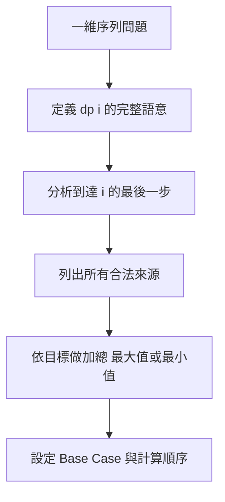
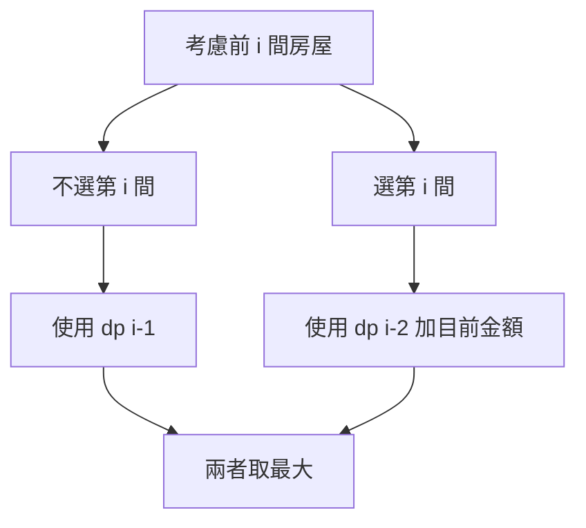
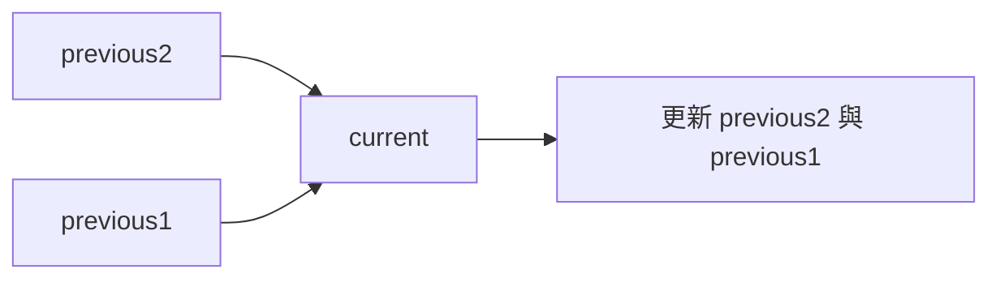

## 第 38 章　一維 Dynamic Programming

### 適用範圍

本章將第 37 章的 State、Transition 與 Base Case 套用到常見一維 DP 題型。

一維 DP 不代表題目一定簡單。新手常見困難是不同題目都使用 `dp[i]`，但每一題的 `dp[i]` 意義不同：

- Fibonacci 的 `dp[i]` 是數值。
- Climbing Stairs 的 `dp[i]` 是方法數。
- House Robber 的 `dp[i]` 是最大金額。
- Minimum Cost 的 `dp[i]` 是最低成本。

本章會先用分析表定義 State，再寫 Transition，最後才進入 C++。



### 適用讀者

- 已理解 DP 基礎，但遇到新題仍不會定義 `dp[i]` 的讀者。
- 容易混淆方法數、最大收益與最小成本 Transition 的讀者。
- 想理解空間壓縮與 Rolling Variables 的讀者。
- 常在 n 為 0 或 1 時越界的讀者。

### 快速導覽

- [38.1 一維 DP 前到底要分析什麼](#381-一維-dp-前到底要分析什麼)
- [38.2 Fibonacci 類型](#382-fibonacci-類型)
- [38.3 Climbing Stairs](#383-climbing-stairs)
- [38.4 House Robber](#384-house-robber)
- [38.5 Minimum Cost Climbing Stairs](#385-minimum-cost-climbing-stairs)
- [38.6 狀態壓縮](#386-狀態壓縮)
- [38.7 Rolling Array 與 Rolling Variables](#387-rolling-array-與-rolling-variables)
- [38.8 如何從最後一步推導 Transition](#388-如何從最後一步推導-transition)
- [38.9 常見問題與判讀](#389-常見問題與判讀)
- [38.10 本章檢查表](#3810-本章檢查表)
- [38.11 本章重點](#3811-本章重點)

### 38.1 一維 DP 前到底要分析什麼

假設題目如下：

有 n 階樓梯，每次可以走 1 階或 2 階，求到達第 n 階的方法數。

先整理：

<table>
<tr><th>分析項目</th><th>本題內容</th></tr>
<tr><td>State</td><td>`dp[i]` 表示到達第 i 階的方法數</td></tr>
<tr><td>最後一步</td><td>從 i - 1 走 1 階，或從 i - 2 走 2 階</td></tr>
<tr><td>Transition</td><td>`dp[i] = dp[i-1] + dp[i-2]`</td></tr>
<tr><td>Base Case</td><td>需依第 0 階語意定義</td></tr>
<tr><td>計算順序</td><td>由小到大</td></tr>
<tr><td>答案</td><td>`dp[n]`</td></tr>
</table>

Transition 和 Fibonacci 相同，但 State 語意不同。不能只因公式相同就把兩題視為完全相同。

### 38.2 Fibonacci 類型

Fibonacci：

```text
dp[i] = dp[i - 1] + dp[i - 2]
```

完整版本：

```cpp
#include <vector>

long long fibonacci(int n)
{
    if (n <= 1)
    {
        return n;
    }

    std::vector<long long> dp(n + 1, 0);
    dp[0] = 0;
    dp[1] = 1;

    for (int i = 2; i <= n; ++i)
    {
        dp[i] = dp[i - 1] + dp[i - 2];
    }

    return dp[n];
}
```

逐輪：

<table>
<tr><th>i</th><th>dp[i - 2]</th><th>dp[i - 1]</th><th>dp[i]</th></tr>
<tr><td>2</td><td>0</td><td>1</td><td>1</td></tr>
<tr><td>3</td><td>1</td><td>1</td><td>2</td></tr>
<tr><td>4</td><td>1</td><td>2</td><td>3</td></tr>
<tr><td>5</td><td>2</td><td>3</td><td>5</td></tr>
</table>

### 38.3 Climbing Stairs

#### State

```text
dp[i] = 到達第 i 階的方法數
```

#### Transition

到達 i 的最後一步只有兩種：

- 從 i - 1 走 1 階。
- 從 i - 2 走 2 階。

因此：

```text
dp[i] = dp[i - 1] + dp[i - 2]
```

#### Base Case

可定義：

```text
dp[0] = 1
dp[1] = 1
```

`dp[0] = 1` 表示站在起點本身有一種「尚未移動」的方式。它讓 Transition 在 i = 2 時自然成立。

```cpp
long long climbStairs(int n)
{
    if (n <= 1)
    {
        return 1;
    }

    std::vector<long long> dp(n + 1, 0);
    dp[0] = 1;
    dp[1] = 1;

    for (int i = 2; i <= n; ++i)
    {
        dp[i] = dp[i - 1] + dp[i - 2];
    }

    return dp[n];
}
```

對 n = 3：

```text
1 + 1 + 1
1 + 2
2 + 1
```

共 3 種。

### 38.4 House Robber

題目：一排房屋中，相鄰房屋不能同時選，求最大金額。

對：

```text
[2, 7, 9, 3, 1]
```

#### State

```text
dp[i] = 考慮前 i 間房屋時，可取得的最大金額
```

這裡 `i` 表示房屋數量，不直接表示 Array Index。

#### 最後一間房屋的兩種選擇

- 不選第 i 間：答案是 `dp[i - 1]`。
- 選第 i 間：前一間不能選，所以是 `dp[i - 2] + nums[i - 1]`。

```text
dp[i] = max(dp[i - 1], dp[i - 2] + nums[i - 1])
```



#### C++ 實作

```cpp
#include <algorithm>
#include <vector>

long long rob(const std::vector<int>& nums)
{
    int n = static_cast<int>(nums.size());

    if (n == 0)
    {
        return 0;
    }

    std::vector<long long> dp(n + 1, 0);
    dp[0] = 0;
    dp[1] = nums[0];

    for (int i = 2; i <= n; ++i)
    {
        dp[i] = std::max(
            dp[i - 1],
            dp[i - 2] + nums[i - 1]);
    }

    return dp[n];
}
```

逐輪：

<table>
<tr><th>i</th><th>不選目前房屋</th><th>選目前房屋</th><th>dp[i]</th></tr>
<tr><td>1</td><td>0</td><td>2</td><td>2</td></tr>
<tr><td>2</td><td>2</td><td>7</td><td>7</td></tr>
<tr><td>3</td><td>7</td><td>2 + 9 = 11</td><td>11</td></tr>
<tr><td>4</td><td>11</td><td>7 + 3 = 10</td><td>11</td></tr>
<tr><td>5</td><td>11</td><td>11 + 1 = 12</td><td>12</td></tr>
</table>

### 38.5 Minimum Cost Climbing Stairs

假設 `cost[i]` 表示踩上第 i 階要付的成本。每次可以走 1 或 2 階，求到達樓梯頂端的最低成本。

#### State

```text
dp[i] = 到達位置 i 前所需的最低成本
```

樓梯頂端可視為位置 n，不需支付 `cost[n]`。

#### Transition

到達 i 可以從 i - 1 或 i - 2：

```text
dp[i] = min(
    dp[i - 1] + cost[i - 1],
    dp[i - 2] + cost[i - 2]
)
```

#### Base Case

題目通常允許從第 0 階或第 1 階開始：

```text
dp[0] = 0
dp[1] = 0
```

```cpp
#include <algorithm>
#include <vector>

long long minCostClimbingStairs(const std::vector<int>& cost)
{
    int n = static_cast<int>(cost.size());
    std::vector<long long> dp(n + 1, 0);

    for (int i = 2; i <= n; ++i)
    {
        dp[i] = std::min(
            dp[i - 1] + cost[i - 1],
            dp[i - 2] + cost[i - 2]);
    }

    return dp[n];
}
```

這題容易混淆「到達 i 的成本」和「踩上 i 的成本」。State 定義不同，Transition 的 Index 也會不同。

### 38.6 狀態壓縮

若 `dp[i]` 只依賴 `dp[i - 1]` 與 `dp[i - 2]`，就不必保存整個 Array。

Fibonacci 可壓縮成：

```cpp
long long fibonacciCompressed(int n)
{
    if (n <= 1)
    {
        return n;
    }

    long long previous2 = 0;
    long long previous1 = 1;

    for (int i = 2; i <= n; ++i)
    {
        long long current = previous1 + previous2;
        previous2 = previous1;
        previous1 = current;
    }

    return previous1;
}
```



時間仍為 O(n)，額外空間從 O(n) 降為 O(1)。

### 38.7 Rolling Array 與 Rolling Variables

Rolling Variables 使用少量變數保存最近 State。

Rolling Array 則使用固定大小 Array，透過取餘數重複使用位置：

```cpp
dp[i % 2] = dp[(i - 1) % 2] + dp[(i - 2) % 2];
```

對只依賴前兩格的一維問題，具名變數通常更容易閱讀。若依賴固定 k 層或二維 DP 的前幾列，Rolling Array 可能較方便。

空間壓縮前應先確認：

- 是否還需要回溯完整答案。
- 是否需要輸出每一個 State。
- 更新順序是否會覆蓋尚未使用的舊值。

### 38.8 如何從最後一步推導 Transition

遇到新題時，可以問：

```text
要到達目前 State，最後一步可能從哪裡來？
```

<table>
<tr><th>題目</th><th>最後一步</th><th>組合方式</th></tr>
<tr><td>Climbing Stairs</td><td>從前一階或前兩階來</td><td>方法數相加</td></tr>
<tr><td>House Robber</td><td>不選目前房屋，或選目前房屋</td><td>取最大值</td></tr>
<tr><td>Minimum Cost</td><td>從兩個可到達位置來</td><td>取最小值再加成本</td></tr>
</table>

公式不同，是因為輸出目標與最後一步選擇不同。

### 38.9 常見問題與判讀

<table>
<tr><th>現象</th><th>可能原因</th><th>第一輪檢查</th></tr>
<tr><td>同樣公式卻不理解</td><td>只背 Transition，沒有定義 State</td><td>先寫出 `dp[i]` 的完整句子</td></tr>
<tr><td>House Robber Index 錯位</td><td>混淆 i 是房屋數量或 Array Index</td><td>確認目前金額是 `nums[i-1]`</td></tr>
<tr><td>Minimum Cost 多加一筆成本</td><td>混淆到達位置與踩上階梯</td><td>明確定義頂端是否有成本</td></tr>
<tr><td>空輸入越界</td><td>直接初始化 `dp[1]`</td><td>先處理 n 為 0 或 1</td></tr>
<tr><td>狀態壓縮後答案錯誤</td><td>更新順序覆蓋舊值</td><td>先計算 current，再移動變數</td></tr>
<tr><td>需要還原選擇卻無法回溯</td><td>太早壓縮 DP Array</td><td>若需重建答案，保留必要 State 或 Parent</td></tr>
</table>

### 38.10 本章檢查表

- 我能用完整句子定義 `dp[i]`。
- 我能從最後一步列出合法來源。
- 我能依方法數、最大收益或最小成本選擇組合方式。
- 我能說明 Fibonacci 與 Climbing Stairs 公式相同但 State 不同。
- 我能推導 House Robber 的選與不選。
- 我能分辨到達位置成本與踩上階梯成本。
- 我能處理 n 為 0、1、2 的情況。
- 我能判斷何時可使用 O(1) 空間。
- 我知道需要重建答案時，不一定適合壓縮全部 State。

### 38.11 本章重點

- 一維 DP 的核心仍是 State、Transition、Base Case、順序與答案位置。
- 相同 Transition 不代表 State 語意相同。
- Climbing Stairs 從最後一步推導出兩個來源，方法數相加。
- House Robber 比較不選目前房屋與選目前房屋兩種情況。
- Minimum Cost 題要先定義成本是在進入位置、離開位置或踩上位置時支付。
- `dp[i]` 只依賴固定少數舊 State 時，可以考慮空間壓縮。
- Rolling Variables 較適合依賴少量前置 State 的一維問題。
- 壓縮空間前，要確認是否需要完整 DP 表重建答案。
