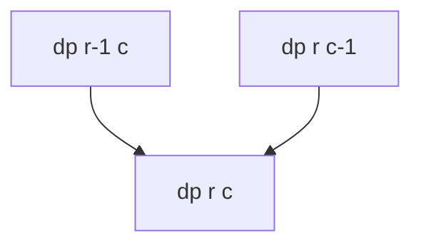
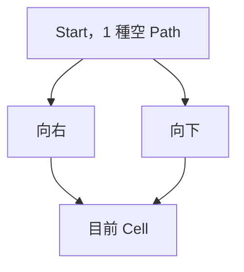
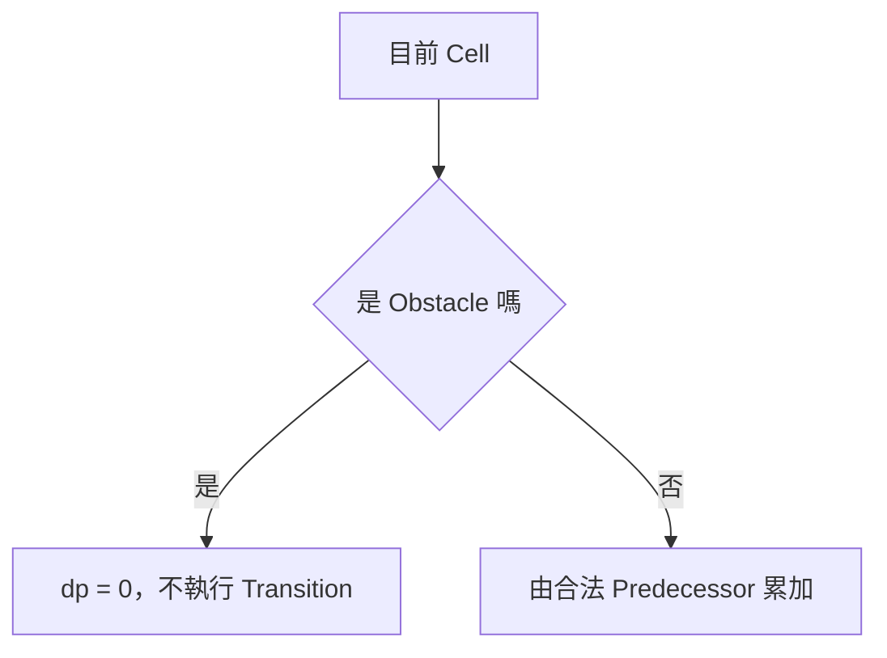
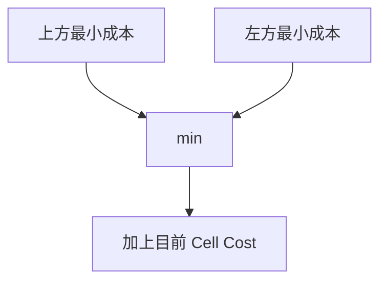
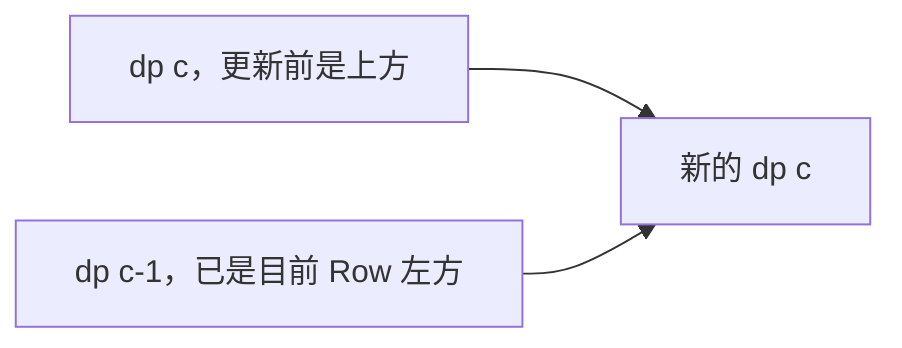

## 第 39 章　二維與 Grid Dynamic Programming

### 適用範圍

本章介紹二維 Dynamic Programming 與 Grid DP，包括二維 State、Unique Paths、Minimum Path Sum、Obstacle、不可以到達的 State、Transition Order、Path Reconstruction 與一維空間改善。

Grid DP 的核心不是建立二維 Array，而是定義 `dp[row][column]` 的精確語意，確認它依賴哪些較早 State，並依 Dependency 順序填表。

### 快速導覽

- [二維 State](#391-二維-state)
- [Dependency 與填表順序](#392-dependency-與填表順序)
- [Unique Paths](#393-unique-paths)
- [Obstacle 與不可達 State](#394-obstacle-與不可達-state)
- [Minimum Path Sum](#395-minimum-path-sum)
- [完整案例：最小路徑和](#396-完整案例最小路徑和)
- [Path Reconstruction](#397-path-reconstruction)
- [空間改善](#398-空間改善)
- [原地 DP 的限制](#399-原地-dp-的限制)
- [常見問題與判讀](#3910-常見問題與判讀)
- [本章檢查表](#3911-本章檢查表)
- [本章重點](#3912-本章重點)

### 39.1 二維 State

常見定義：

```text
dp[r][c] = 從起點走到 Cell (r,c) 的方法數或最佳成本
```



State 必須包含足以決定未來的資訊。若移動規則還受剩餘資源、方向或特殊次數影響，僅使用 Row、Column 可能不足，需要增加維度。

### 39.2 Dependency 與填表順序

若 `dp[r][c]` 依賴上方與左方，應由上到下、由左到右填表。


填表順序不是排版偏好，而是需要確保 Transition 使用的 State 已經完成。

若依賴右方或下方，可能需要反向走訪。若 Dependency 形成 Cycle，便不能直接用單次表格順序，需要重新定義 State 或使用其他方法。

### 39.3 Unique Paths

問題：從左上走到右下，每步只能向右或向下，計算 Path 數量。

定義：

```text
dp[r][c] = 走到 (r,c) 的 Path 數量
```

Transition：

```text
dp[r][c] = dp[r-1][c] + dp[r][c-1]
```

Base Case：

```text
dp[0][0] = 1
```



```cpp
long long uniquePaths(int rows, int columns)
{
    if (rows <= 0 || columns <= 0)
    {
        return 0;
    }

    std::vector<std::vector<long long>> dp(
        rows,
        std::vector<long long>(columns, 0));
    dp[0][0] = 1;

    for (int r = 0; r < rows; ++r)
    {
        for (int c = 0; c < columns; ++c)
        {
            if (r == 0 && c == 0)
            {
                continue;
            }

            if (r > 0)
            {
                dp[r][c] += dp[r - 1][c];
            }

            if (c > 0)
            {
                dp[r][c] += dp[r][c - 1];
            }
        }
    }

    return dp[rows - 1][columns - 1];
}
```

Path 數可能快速成長，需檢查 `long long` 是否足夠，或題目是否要求取模。

### 39.4 Obstacle 與不可達 State

Obstacle Cell 不可進入，其 Path Count 為 0。



若起點是 Obstacle，答案為 0。不要先無條件設定 `dp[0][0] = 1` 再忘記修正。

對 Minimum Path Sum，不可以到達不能用 0 表示，因為 0 可能看起來比合法成本更小。應使用 Infinity 或 Optional State。

### 39.5 Minimum Path Sum

定義：

```text
dp[r][c] = 從起點到 (r,c) 的最小成本，包含目前 Cell 成本
```

Transition：

```text
dp[r][c] = cost[r][c] + min(dp[r-1][c], dp[r][c-1])
```

只有實際存在且可達的 Predecessor 能參與 Minimum。



### 39.6 完整案例：最小路徑和

```cpp
#include <algorithm>
#include <limits>
#include <optional>
#include <vector>

std::optional<long long> minimumPathSum(
    const std::vector<std::vector<int>>& grid)
{
    if (grid.empty() || grid[0].empty())
    {
        return std::nullopt;
    }

    const int rows = static_cast<int>(grid.size());
    const int columns = static_cast<int>(grid[0].size());
    const long long inf =
        std::numeric_limits<long long>::max() / 4;

    std::vector<std::vector<long long>> dp(
        rows,
        std::vector<long long>(columns, inf));

    dp[0][0] = grid[0][0];

    for (int r = 0; r < rows; ++r)
    {
        for (int c = 0; c < columns; ++c)
        {
            if (r == 0 && c == 0)
            {
                continue;
            }

            long long previous = inf;

            if (r > 0)
            {
                previous = std::min(previous, dp[r - 1][c]);
            }

            if (c > 0)
            {
                previous = std::min(previous, dp[r][c - 1]);
            }

            if (previous != inf)
            {
                dp[r][c] = previous + grid[r][c];
            }
        }
    }

    return dp[rows - 1][columns - 1];
}
```

Invariant：處理 `(r,c)` 前，它依賴的上方與左方 State 已完成。處理後，`dp[r][c]` 是所有合法路徑中的最小成本。

### 39.7 Path Reconstruction

若要輸出 Path，需保存每個 Cell 的選擇來源：

```text
parent[r][c] = Up 或 Left
```


Tie 時需定義選 Up 還是 Left。若只要最小成本，可省略 Parent。空間壓縮後通常無法直接還原完整 Path，除非另存決策或重新計算。

### 39.8 空間改善

若目前 Row 只依賴上一 Row與目前 Row 左側，可壓縮成一維：

```cpp
long long uniquePathsCompressed(int rows, int columns)
{
    if (rows <= 0 || columns <= 0)
    {
        return 0;
    }

    std::vector<long long> dp(columns, 0);
    dp[0] = 1;

    for (int r = 0; r < rows; ++r)
    {
        for (int c = 1; c < columns; ++c)
        {
            dp[c] += dp[c - 1];
        }
    }

    return dp.back();
}
```

更新前：

```text
dp[c]     = 上方 State
dp[c - 1] = 已更新的左方 State
```



走訪方向不能任意改變，否則會讀到錯誤版本的 State。

### 39.9 原地 DP 的限制

直接覆寫 Grid 可降低額外空間，但代價包括：

- 破壞輸入。
- 原始 Cost 無法再使用。
- Sentinel 與合法值可能混淆。
- 呼叫端可能不允許修改。

介面應明確接收非 `const` Reference，並在文件中說明輸入會改變。

### 39.10 常見問題與判讀

| 現象 | 可能原因 | 第一輪檢查 |
|---|---|---|
| 第一列或第一欄錯誤 | 邊界 Transition 讀到區間外 | 分別檢查 r>0、c>0 |
| 起點被多算 | Base Case 又執行一般 Transition | 明確略過 `(0,0)` |
| Obstacle 後方仍有 Path | 障礙 State 未清成 0 | Obstacle 不執行 Transition |
| 最小成本穿過不可達 Cell | 用 0 表示不可達 | 使用 Infinity 或 Optional |
| 空間壓縮結果錯誤 | 更新方向破壞舊 State | 寫出更新前後 `dp[c]` 語意 |
| Path 無法還原 | 只保存最佳值 | 另存 Parent 或 Decision |
| Sum Overflow | 使用 int | 依最大 Path 長度使用寬型別 |
| 不規則 Grid 越界 | 假設每列同長 | 驗證矩形輸入或逐列處理 |

### 39.11 本章檢查表

- 我能精確定義 `dp[r][c]`。
- 我知道填表順序由 Dependency 決定。
- 我能寫出 Unique Paths 的 Base Case 與 Transition。
- 我會區分 Path Count 的 0 與 Minimum Cost 的不可達。
- 我能處理起點、第一列與第一欄。
- 我能使用 Parent 還原 Path。
- 我知道空間改善後每個 `dp[c]` 更新前後的語意。
- 我會檢查 Overflow、Obstacle 與 Grid 形狀。

### 39.12 本章重點

- Grid DP 的核心是二維 State、Dependency、Base Case 與填表順序。
- Unique Paths 使用加法組合上方與左方方法數。
- Minimum Path Sum 使用合法 Predecessor 的最小成本加上目前 Cell Cost。
- 不可以到達 State 不能隨意使用 0，應選擇不會和合法答案混淆的表示。
- 一維空間改善依賴精確的更新順序與舊、新 State 語意。
- 若要 Reconstruction，通常需要保留 Parent 或 Decision。
