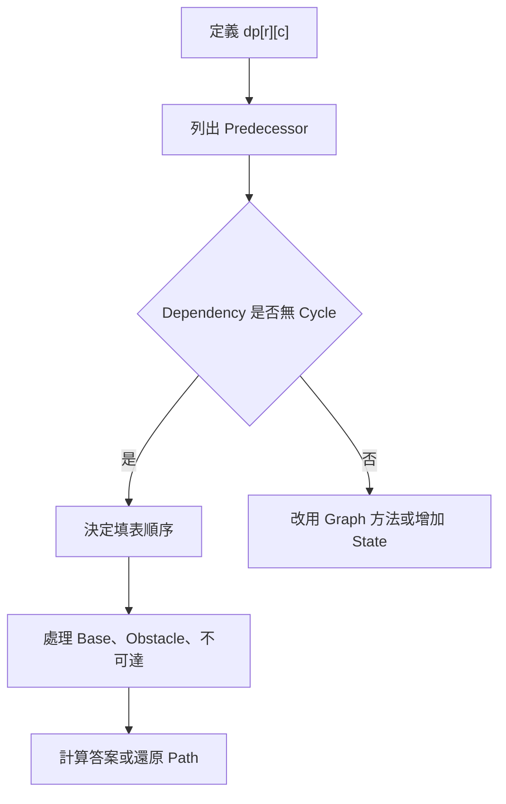
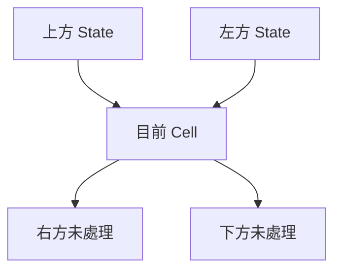
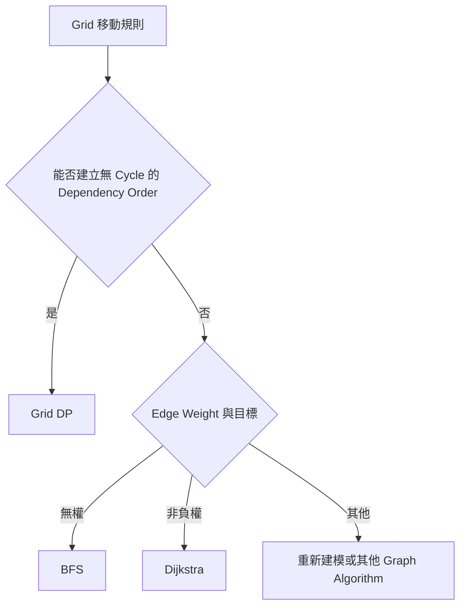
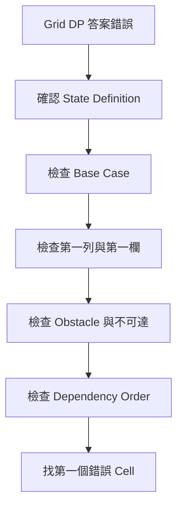

## 第 39 章　二維與 Grid Dynamic Programming

### 適用範圍

本章介紹二維 Dynamic Programming 與 Grid DP，包括二維 State、Dependency、Unique Paths、Obstacle、Minimum Path Sum、不可達 State、Path Reconstruction、一維空間壓縮與原地 DP。

Grid DP 的核心不是建立二維 Array，而是先回答：

```text
dp[row][column] 到底代表什麼？
它依賴哪些已完成的 State？
```

一個 Cell 可以保存：

- 走到該位置的方法數。
- 走到該位置的最小成本。
- 走到該位置的最大分數。
- 該位置是否可達。
- 帶有額外資源時的最佳答案。

State Definition 會決定 Base Case、不可達值、填表順序與答案位置。若移動規則允許四方向任意往返，Position 之間可能形成 Cycle，此時通常不能只用單次 Grid DP，需要改用 BFS、Dijkstra 或重新定義 State。

本章使用以下分析流程：

1. 定義 `dp[r][c]` 的完整語意。
2. 列出所有合法 Predecessor。
3. 確認 Dependency 是否能排出固定順序。
4. 設定起點、邊界與 Obstacle。
5. 選擇不可達 State 的表示方式。
6. 依 Dependency 填表。
7. 確認答案位於哪個 Cell 或哪一組 State。
8. 視需求保存 Parent，或進行空間壓縮。



### 適用讀者

- 已理解一維 DP，但不熟悉二維 State 與填表順序的讀者。
- 常在起點、第一列、第一欄與 Obstacle 上出錯的讀者。
- 不確定 `dp[r][c]` 保存方法數、最小成本或可達性的讀者。
- 想理解 Path Reconstruction 與一維空間壓縮的讀者。
- 容易混淆合法值 0 與不可達 State 的讀者。
- 想判斷 Grid 題應使用 DP、BFS 還是 Dijkstra 的讀者。

### 快速導覽

- [39.1 Grid DP 前要分析什麼](#391-grid-dp-前要分析什麼)
- [39.2 Dependency 與填表順序](#392-dependency-與填表順序)
- [39.3 完整案例：Unique Paths](#393-完整案例unique-paths)
- [39.4 Obstacle 與不可達 State](#394-obstacle-與不可達-state)
- [39.5 完整案例：Minimum Path Sum](#395-完整案例minimum-path-sum)
- [39.6 Path Reconstruction 與 Tie-breaking](#396-path-reconstruction-與-tie-breaking)
- [39.7 一維空間壓縮](#397-一維空間壓縮)
- [39.8 原地 DP 的限制](#398-原地-dp-的限制)
- [39.9 額外維度與資源 State](#399-額外維度與資源-state)
- [39.10 對角線與常見變化](#3910-對角線與常見變化)
- [39.11 何時不能使用單次 Grid DP](#3911-何時不能使用單次-grid-dp)
- [39.12 複雜度與數值範圍](#3912-複雜度與數值範圍)
- [39.13 系統化 Debug](#3913-系統化-debug)
- [39.14 常見問題與判讀](#3914-常見問題與判讀)
- [39.15 本章檢查表](#3915-本章檢查表)
- [39.16 本章重點](#3916-本章重點)

### 39.1 Grid DP 前要分析什麼

常見 State：

```text
dp[r][c]
= 從起點走到 Cell (r, c) 的方法數或最佳成本
```

這個定義仍需補充：

| 分析項目 | 要回答的問題 | 例子 |
|---|---|---|
| 位置 | State 對應哪個 Cell？ | `(r, c)` |
| 答案類型 | Count、Min、Max 或 Boolean？ | Minimum Cost |
| 起點與終點 | 從哪裡開始，答案在哪裡？ | 左上到右下 |
| 移動規則 | 可從哪些位置到達？ | Up、Left |
| Cell 成本 | State 是否已包含目前 Cell？ | 包含 `grid[r][c]` |
| 障礙 | Obstacle 如何表示？ | 不可進入 |
| 額外資源 | Position 是否足以決定未來？ | 剩餘消除次數 |

#### State 不足的例子

若最多可消除 `k` 個障礙，只保存：

```text
dp[r][c]
```

通常不足。到達同一 Cell 時，使用 0 次與已使用 `k` 次消除能力，對未來的選擇不同。

可能需要：

```text
dp[r][c][used]
```

或搜尋 State：

```text
(r, c, used)
```

State 必須保存足以決定未來合法選擇的資訊。

#### 矩形輸入

多數 Grid DP 假設每列長度相同。若輸入是 Ragged Array，使用 `grid[0].size()` 當作所有列寬度可能越界。正式介面應驗證矩形輸入，或明確支援不規則結構。

### 39.2 Dependency 與填表順序

若：

```text
dp[r][c]
```

依賴上方與左方：

```text
dp[r - 1][c]
dp[r][c - 1]
```

就可以由上到下、由左到右填表。



填表順序不是排版偏好，而是在滿足 State Dependency。

| 依賴來源 | 常見填表方向 | 代表題型 |
|---|---|---|
| 上、左 | 上到下、左到右 | Unique Paths、Minimum Path Sum |
| 下、右 | 下到上、右到左 | 從終點反推 |
| 左上、上、左 | 上到下、左到右 | Maximum Square、序列二維表 |
| 依較小高度或值 | 排序或 Topological Order | Longest Increasing Path |
| 四方向可往返 | 通常沒有單次順序 | BFS、Dijkstra |

#### 填表 Invariant

處理 Cell `(r, c)` 前：

```text
所有 Transition 會讀取的 Predecessor State 都已完成。
```

處理完成後，`dp[r][c]` 必須符合完整 State Definition。

### 39.3 完整案例：Unique Paths

#### 問題規格

從左上角走到右下角，每一步只能向右或向下，計算 Path 數量。

#### State

```text
dp[r][c]
= 從 (0, 0) 走到 (r, c) 的 Path 數量
```

#### Base Case

```text
dp[0][0] = 1
```

這個 1 代表「位於起點」有一種空 Path，不代表已移動一次。

#### Transition

到達 `(r, c)` 的最後一步只能來自上方或左方：

```text
dp[r][c]
= dp[r - 1][c]
+ dp[r][c - 1]
```

只累加實際存在的 Predecessor。

#### C++20 實作

```cpp
#include <cstdint>
#include <vector>

std::uint64_t uniquePaths(int rows, int columns) {
    if (rows <= 0 || columns <= 0) {
        return 0;
    }

    std::vector<std::vector<std::uint64_t>> dp(
        rows,
        std::vector<std::uint64_t>(columns, 0));

    dp[0][0] = 1;

    for (int r = 0; r < rows; ++r) {
        for (int c = 0; c < columns; ++c) {
            if (r == 0 && c == 0) {
                continue;
            }

            if (r > 0) {
                dp[r][c] += dp[r - 1][c];
            }

            if (c > 0) {
                dp[r][c] += dp[r][c - 1];
            }
        }
    }

    return dp[rows - 1][columns - 1];
}
```

Path Count 成長很快。`std::uint64_t` 仍可能 Overflow；若題目要求 Modulo，應在每次加法後取模。若要求精確大整數，需要使用合適的任意精度型別。

#### 邊界案例

```text
rows <= 0 或 columns <= 0 -> 0
1 × 1 -> 1
1 × n -> 1
m × 1 -> 1
2 × 2 -> 2
```

#### 複雜度

- 時間 O(rows × columns)。
- 空間 O(rows × columns)。

### 39.4 Obstacle 與不可達 State

Obstacle Cell 不可進入，因此不執行一般 Transition。

#### Unique Paths with Obstacles

Path Count 中，0 可以表示不可達，因為沒有 Path 的方法數就是 0。

```cpp
#include <cstdint>
#include <stdexcept>
#include <vector>

std::uint64_t uniquePathsWithObstacles(
    const std::vector<std::vector<int>>& obstacle) {

    if (obstacle.empty() || obstacle[0].empty()) {
        return 0;
    }

    const int rows = static_cast<int>(obstacle.size());
    const int columns = static_cast<int>(obstacle[0].size());

    for (const auto& row : obstacle) {
        if (static_cast<int>(row.size()) != columns) {
            throw std::invalid_argument(
                "grid must be rectangular");
        }
    }

    if (obstacle[0][0] != 0) {
        return 0;
    }

    std::vector<std::vector<std::uint64_t>> dp(
        rows,
        std::vector<std::uint64_t>(columns, 0));

    dp[0][0] = 1;

    for (int r = 0; r < rows; ++r) {
        for (int c = 0; c < columns; ++c) {
            if (obstacle[r][c] != 0) {
                dp[r][c] = 0;
                continue;
            }

            if (r == 0 && c == 0) {
                continue;
            }

            if (r > 0) {
                dp[r][c] += dp[r - 1][c];
            }

            if (c > 0) {
                dp[r][c] += dp[r][c - 1];
            }
        }
    }

    return dp[rows - 1][columns - 1];
}
```

#### 不可達值的選擇

| 問題目標 | 不可達表示 | 原因 |
|---|---|---|
| Path Count | 0 | 沒有方法即為 0 種 |
| Boolean Reachability | `false` | 直接對應不可達 |
| Minimum Cost | `INF` 或 `optional` | 0 可能是合法且較小成本 |
| Maximum Value | `NEG_INF` 或 `optional` | 0 可能錯誤勝過負值答案 |

不可達 State 與合法值必須可以區分。

### 39.5 完整案例：Minimum Path Sum

#### 問題規格

給定矩形 Cost Grid，從左上走到右下，每步只能向右或向下，求最小 Path Sum。

#### State

```text
dp[r][c]
= 從 (0, 0) 到 (r, c) 的最小成本，
  而且已包含 grid[r][c]
```

#### Base Case

```text
dp[0][0] = grid[0][0]
```

#### Transition

```text
dp[r][c]
= grid[r][c]
+ min(所有存在且可達的 Predecessor)
```

第一列沒有上方，第一欄沒有左方，不能無條件讀取兩者。

#### C++20 實作

```cpp
#include <algorithm>
#include <limits>
#include <optional>
#include <stdexcept>
#include <vector>

std::optional<long long> minimumPathSum(
    const std::vector<std::vector<int>>& grid) {

    if (grid.empty() || grid[0].empty()) {
        return std::nullopt;
    }

    const int rows = static_cast<int>(grid.size());
    const int columns = static_cast<int>(grid[0].size());

    for (const auto& row : grid) {
        if (static_cast<int>(row.size()) != columns) {
            throw std::invalid_argument(
                "grid must be rectangular");
        }
    }

    const long long INF =
        std::numeric_limits<long long>::max() / 4;

    std::vector<std::vector<long long>> dp(
        rows,
        std::vector<long long>(columns, INF));

    dp[0][0] = grid[0][0];

    for (int r = 0; r < rows; ++r) {
        for (int c = 0; c < columns; ++c) {
            if (r == 0 && c == 0) {
                continue;
            }

            long long bestPrevious = INF;

            if (r > 0) {
                bestPrevious = std::min(
                    bestPrevious,
                    dp[r - 1][c]);
            }

            if (c > 0) {
                bestPrevious = std::min(
                    bestPrevious,
                    dp[r][c - 1]);
            }

            if (bestPrevious != INF) {
                dp[r][c] =
                    bestPrevious + grid[r][c];
            }
        }
    }

    if (dp[rows - 1][columns - 1] == INF) {
        return std::nullopt;
    }

    return dp[rows - 1][columns - 1];
}
```

若沒有 Obstacle，而且 Grid 非空，終點一定可達。保留 `optional` 介面可讓後續擴充障礙或不可通行 Cell 時，仍能明確表示無路徑。

`INF = max / 4` 可保留部分加法空間，但仍應依 Grid 大小與 Cell 值上限檢查合法 Path Sum 是否可能 Overflow。

#### State Invariant

處理完 Cell `(r, c)` 後：

```text
dp[r][c]
是所有從起點到 (r, c) 的合法 Right / Down Path 中，
包含目前 Cell Cost 的最小總成本。
```

#### 複雜度

- 時間 O(rows × columns)。
- 空間 O(rows × columns)。

### 39.6 Path Reconstruction 與 Tie-breaking

只保存最小成本，無法直接知道實際 Path。可另外保存來源：

```cpp
enum class Parent {
    None,
    FromUp,
    FromLeft
};
```

更新 `dp[r][c]` 時，同步記錄選擇的 Predecessor。

#### 還原流程

1. 從終點 `(rows - 1, columns - 1)` 開始。
2. 依 `parent[r][c]` 往回走。
3. 到達起點後反轉 Path。

```cpp
#include <algorithm>
#include <utility>
#include <vector>

std::vector<std::pair<int, int>> reconstructPath(
    const std::vector<std::vector<Parent>>& parent) {

    std::vector<std::pair<int, int>> path;

    if (parent.empty() || parent[0].empty()) {
        return path;
    }

    int r = static_cast<int>(parent.size()) - 1;
    int c = static_cast<int>(parent[0].size()) - 1;

    while (true) {
        path.emplace_back(r, c);

        if (r == 0 && c == 0) {
            break;
        }

        if (parent[r][c] == Parent::FromUp) {
            --r;
        } else if (parent[r][c] == Parent::FromLeft) {
            --c;
        } else {
            return {};
        }
    }

    std::reverse(path.begin(), path.end());
    return path;
}
```

若上方與左方成本相同，可能有多條同成本 Path。應先定義：

- 任一最佳 Path。
- 優先從上方或左方。
- 字典序較小的座標序列。
- 轉彎次數較少。

若 Tie-breaking 依賴轉彎次數或最後方向，Position State 可能不足，需要增加方向維度或將額外條件納入比較。

### 39.7 一維空間壓縮

若目前列只依賴上一列同欄與目前列左方，可壓縮成一維：

```text
更新前 dp[c] = 上方 State
更新後 dp[c - 1] = 目前列左方 State
```

#### Unique Paths

```cpp
#include <cstdint>
#include <vector>

std::uint64_t uniquePathsCompressed(
    int rows,
    int columns) {

    if (rows <= 0 || columns <= 0) {
        return 0;
    }

    std::vector<std::uint64_t> dp(columns, 0);
    dp[0] = 1;

    for (int r = 0; r < rows; ++r) {
        for (int c = 1; c < columns; ++c) {
            dp[c] += dp[c - 1];
        }
    }

    return dp.back();
}
```

#### Minimum Path Sum

```cpp
#include <algorithm>
#include <limits>
#include <optional>
#include <vector>

std::optional<long long> minimumPathSumCompressed(
    const std::vector<std::vector<int>>& grid) {

    if (grid.empty() || grid[0].empty()) {
        return std::nullopt;
    }

    const int rows = static_cast<int>(grid.size());
    const int columns = static_cast<int>(grid[0].size());
    const long long INF =
        std::numeric_limits<long long>::max() / 4;

    std::vector<long long> dp(columns, INF);

    for (int r = 0; r < rows; ++r) {
        for (int c = 0; c < columns; ++c) {
            if (r == 0 && c == 0) {
                dp[c] = grid[r][c];
                continue;
            }

            long long bestPrevious = INF;

            if (r > 0) {
                bestPrevious = std::min(
                    bestPrevious,
                    dp[c]);
            }

            if (c > 0) {
                bestPrevious = std::min(
                    bestPrevious,
                    dp[c - 1]);
            }

            dp[c] = bestPrevious == INF
                ? INF
                : bestPrevious + grid[r][c];
        }
    }

    return dp.back() == INF
        ? std::nullopt
        : std::optional<long long>{dp.back()};
}
```

空間可由 O(rows × columns) 降為 O(columns)。也可選擇較短維度作為壓縮方向，但需要同步調整走訪與元素存取方式。

#### 壓縮代價

- Debug 較不直觀。
- 歷史列被覆蓋。
- 一般無法直接 Reconstruction。
- 更新方向必須符合舊、新 State 語意。

### 39.8 原地 DP 的限制

把答案直接寫回輸入 Grid，可降低額外空間，但會產生 Side Effect：

- 原始 Cell Cost 被覆蓋。
- 呼叫端無法再使用原始 Grid。
- 合法值與 Sentinel 可能混淆。
- Reconstruction 或其他後續計算可能需要原始資料。

介面應明確表達可修改輸入：

```cpp
long long minimumPathSumInPlace(
    std::vector<std::vector<long long>>& grid);
```

不應以 `const` Reference 接收，再在內部嘗試覆寫。

原地 DP 適合：

- 規格允許修改輸入。
- 後續不需原資料。
- 值域與 Sentinel 可清楚區分。
- API 文件明確說明副作用。

### 39.9 額外維度與資源 State

Position 不一定足以決定未來。

例如最多可使用一次特殊移動：

```text
dp[r][c][usedSpecial]
```

或每個 Cell 的成本取決於進入方向：

```text
dp[r][c][direction]
```

常見額外維度包括：

- 已使用的障礙消除次數。
- 剩餘資源。
- 最後移動方向。
- 已收集的 Key Mask。
- 目前奇偶狀態。

增加維度前應確認：

1. 額外資訊是否真的影響未來？
2. 每一維範圍是否可接受？
3. Dependency 是否仍能形成 DP Order？
4. 若 Edge Weight 相同，BFS 是否更自然？

### 39.10 對角線與常見變化

#### 對角線 Dependency

若依賴：

```text
dp[r - 1][c]
dp[r][c - 1]
dp[r - 1][c - 1]
```

仍可由上到下、左到右填表。

#### Maximum Square

若 Binary Grid 的 `(r, c)` 為 1：

```text
dp[r][c]
= 1 + min(
    dp[r - 1][c],
    dp[r][c - 1],
    dp[r - 1][c - 1]
)
```

State 可定義為「以 `(r, c)` 為右下角的最大正方形邊長」。答案是所有 Cell 的最大值，不一定位於終點。

#### Multiple Sources

若有多個起點，可將所有合法起點設為 Base Case，再依 Dependency 填表。必須確認不同 Source 的初始成本或方法數如何合併。

#### Target 不在右下角

答案可能是：

- 指定 Cell。
- 最後一列的最小值。
- 最後一欄的最大值。
- 所有 Cell 的最大值。

答案位置由 State Definition 與題目目標決定。

### 39.11 何時不能使用單次 Grid DP

若移動可四方向任意往返：

```text
Up、Down、Left、Right
```

Position Dependency 會形成 Cycle，無法找到簡單的 Row-major Order，使所有 Predecessor 都先完成。

常見替代方法：

- 無權最短步數：BFS。
- 非負 Edge Weight：Dijkstra。
- 含負權且需最短路：依 Graph 條件考慮 Bellman-Ford 等方法。
- 值嚴格增加的移動：可依值排序或用 DFS Memoization，因為嚴格增加建立 DAG。



Grid 只是資料外觀，不代表一定要使用 Grid DP。

### 39.12 複雜度與數值範圍

若每個 Cell 做 O(1) Transition：

```text
時間：O(rows × columns)
空間：O(rows × columns)
```

一維壓縮後：

```text
空間：O(columns)
```

若 State 增加一個大小為 `k` 的維度：

```text
State 數量可能成為 O(rows × columns × k)
```

還要檢查：

- Path Count 是否 Overflow。
- Path Sum 是否超過 `long long`。
- `rows × columns` 配置是否可能溢位或超出記憶體。
- Parent Table 與額外維度的空間。
- 每個 Cell 是否真的只做 O(1) 工作。

### 39.13 系統化 Debug

#### 每個 Cell 記錄欄位

```text
r, c
Cell Value 或 Obstacle
State Definition
上方 State
左方 State
其他 Predecessor
目前 Cell 的 Base / Transition
是否可達
更新後 dp[r][c]
```

#### 排查順序

1. 用完整句子寫出 `dp[r][c]`。
2. 列出合法 Predecessor。
3. 確認填表順序滿足 Dependency。
4. 單獨檢查起點。
5. 單獨檢查第一列與第一欄。
6. 確認 Obstacle 不執行一般 Transition。
7. 檢查不可達表示是否和合法值分離。
8. 空間壓縮先還原成完整二維 Table 比較。
9. 用 BFS 或暴力搜尋比對小型 Grid。
10. 保留第一個不符合 State Definition 的 Cell。



#### 最小測試

- 空 Grid。
- `1 × 1`。
- `1 × n`。
- `n × 1`。
- 起點或終點是 Obstacle。
- 第一列或第一欄中間有 Obstacle。
- 所有路徑都被阻斷。
- 合法 Cell Cost 為 0。
- 負 Cell Cost，但只允許 Right / Down。
- Ragged Grid。
- 多條同成本 Path。

### 39.14 常見問題與判讀

| 現象 | 可能原因 | 第一輪檢查 |
|---|---|---|
| 第一列或第一欄錯誤 | 讀取不存在的 Predecessor | 分別檢查 `r > 0`、`c > 0` |
| 起點被多算 | Base Case 又執行一般 Transition | 略過 `(0, 0)` |
| Obstacle 後方仍有 Path | 障礙 Cell 未清除 State | Obstacle 不執行 Transition |
| Minimum Cost 穿過不可達 Cell | 用 0 代表不可達 | 使用 `INF` 或 `optional` |
| 合法成本 0 被當成不可達 | Sentinel 與合法值衝突 | 分開表示可達性 |
| 空間壓縮答案錯誤 | 更新方向破壞舊 State | 寫出 `dp[c]` 更新前後語意 |
| Path 無法還原 | 只保存最佳值 | 另存 Parent / Decision |
| 路徑 Tie 輸出不穩定 | 未定義 Tie-breaking | 將規則納入 Transition |
| Ragged Grid 越界 | 假設每列同長 | 驗證矩形輸入 |
| 四方向 DP 錯誤 | Dependency 形成 Cycle | 改用 BFS / Dijkstra |
| Path Count 變小或歸零 | Integer Overflow | 使用適合型別、Modulo 或大整數 |
| 額外能力結果錯誤 | State 缺少資源維度 | 增加 `used`、`remaining` 或 Direction |

### 39.15 本章檢查表

- 我能完整定義 `dp[r][c]`。
- 我知道填表順序取決於 Dependency。
- 我能列出目前 Cell 的全部合法 Predecessor。
- 我能寫出 Unique Paths 的 Base Case 與 Transition。
- 我知道 `dp[0][0] = 1` 代表一種空 Path。
- 我能正確處理 Obstacle、起點、第一列與第一欄。
- 我能區分 Path Count 的 0 與 Minimum Cost 的不可達。
- 我能寫出包含目前 Cell Cost 的 Minimum Path Sum State。
- 我知道 Reconstruction 需要 Parent 或 Decision。
- 我能定義同成本 Path 的 Tie-breaking。
- 我知道一維壓縮時 `dp[c]` 的更新前後語意。
- 我知道原地 DP 會修改輸入。
- 我能判斷 Position 是否需要額外資源維度。
- 我能判斷四方向移動是否形成 Cycle。
- 我會驗證 Grid 是否為矩形。
- 我會檢查 Overflow、Modulo 與記憶體成本。
- 我會用小型 Grid 找出第一個錯誤 Cell。

### 39.16 本章重點

- Grid DP 的核心是 State、Dependency、Base Case、不可達表示與填表順序。
- `dp[r][c]` 必須明確說明答案類型與是否包含目前 Cell。
- 填表順序的目的，是在計算目前 State 前完成所有 Predecessor。
- Unique Paths 以加法合併上方與左方的方法數。
- Minimum Path Sum 只使用存在且可達的 Predecessor，再加入目前 Cell Cost。
- Obstacle 應阻止一般 Transition。
- 不可達 State 的表示方式取決於 Count、Min、Max 或 Boolean 語意。
- Reconstruction 通常需要保存 Parent，Tie-breaking 也應納入規格。
- 一維壓縮依賴清楚的舊 State 與新 State 語意。
- 原地 DP 可減少額外空間，但會修改輸入並限制後續用途。
- Position 不足以決定未來時，需要增加資源、方向或其他維度。
- 四方向可往返通常形成 Cycle，應考慮 BFS、Dijkstra 或其他 Graph 方法。
- Grid 只是資料形狀，不代表一定適合使用 Grid DP。
- Debug 時先固定 State Definition，再尋找第一個錯誤 Cell。
