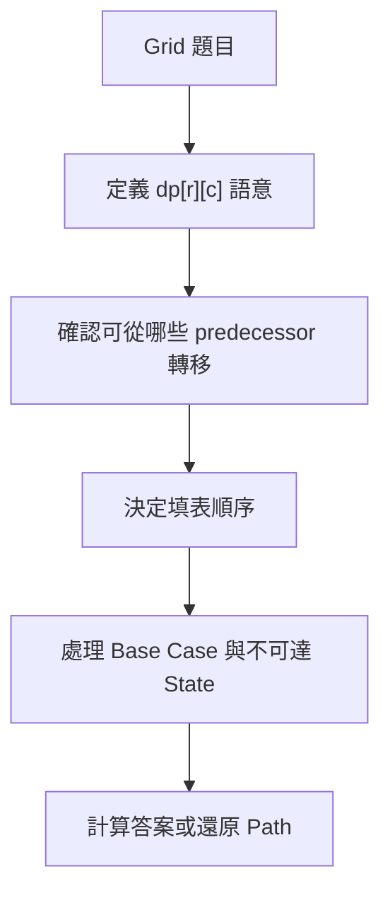
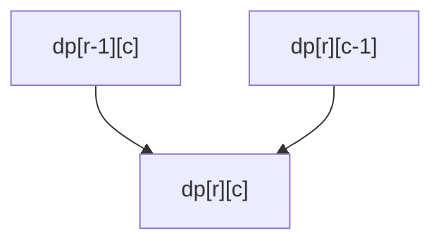
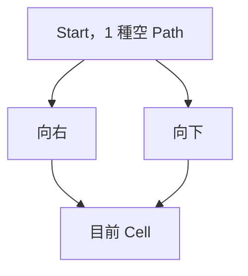
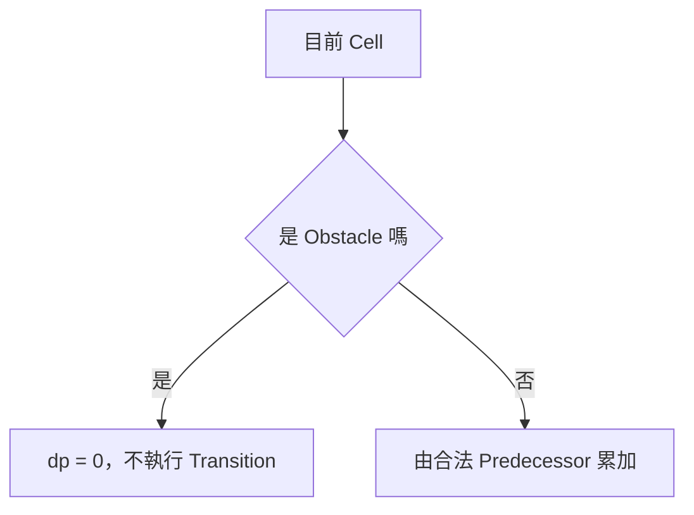
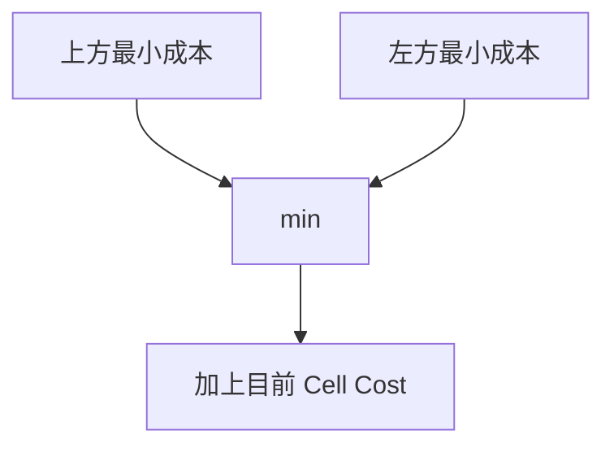
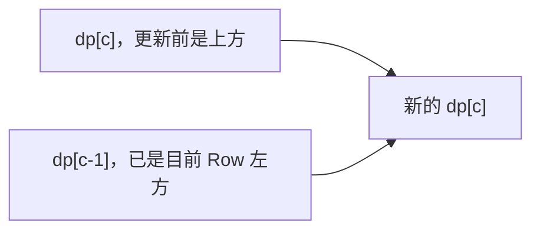
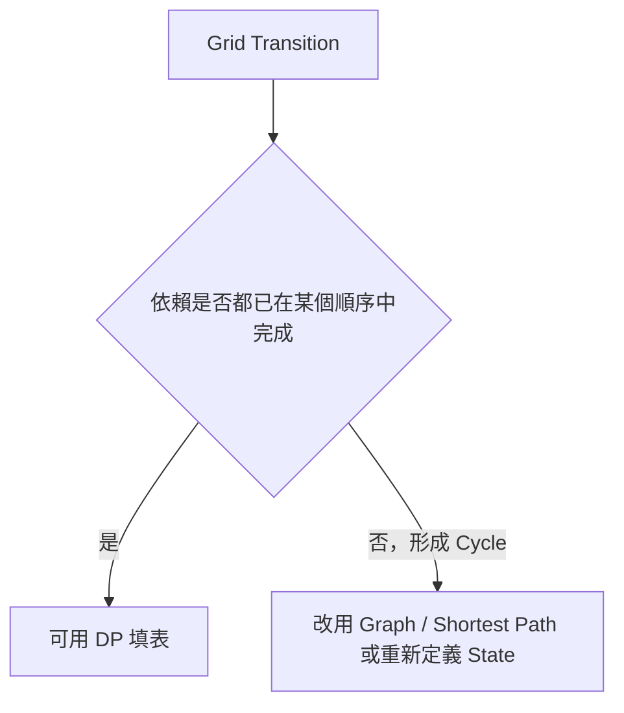
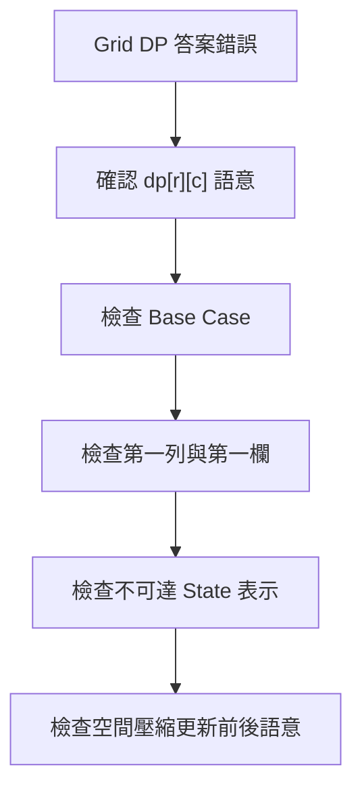

### 第 39 章　二維與 Grid Dynamic Programming

#### 適用範圍

本章介紹二維 Dynamic Programming 與 Grid DP，包括二維 State、Unique Paths、Minimum Path Sum、Obstacle、不可以到達的 State、Transition Order、Path Reconstruction 與一維空間改善。

Grid DP 的核心不是建立二維 Array，而是定義 `dp[row][column]` 的精確語意，確認它依賴哪些較早 State，並依 Dependency 順序填表。原始章節已經涵蓋二維 State、Dependency、Unique Paths、Obstacle、Minimum Path Sum、Path Reconstruction、空間改善與原地 DP，本版會補上更完整的推導、可編譯 C++ 實作、Debug 流程與常見變化題。citeturn49search1



#### 適用讀者

- 已理解一維 DP，但不熟悉二維表格填表順序的讀者。
- 常在第一列、第一欄、起點、Obstacle 上出錯的讀者。
- 不確定 `dp[r][c]` 是方法數、最小成本，還是可達性的讀者。
- 想理解 Path Reconstruction 與一維空間改善的讀者。
- 想分清楚「不可達 State」和合法值 0 的讀者。

#### 快速導覽

- [39.1 二維 State](#391-二維-state)
- [39.2 Dependency 與填表順序](#392-dependency-與填表順序)
- [39.3 Unique Paths](#393-unique-paths)
- [39.4 Obstacle 與不可達 State](#394-obstacle-與不可達-state)
- [39.5 Minimum Path Sum](#395-minimum-path-sum)
- [39.6 完整案例：最小路徑和](#396-完整案例最小路徑和)
- [39.7 Path Reconstruction](#397-path-reconstruction)
- [39.8 空間改善](#398-空間改善)
- [39.9 原地 DP 的限制](#399-原地-dp-的限制)
- [39.10 常見 Grid DP 變化](#3910-常見-grid-dp-變化)
- [39.11 對角線與多方向移動](#3911-對角線與多方向移動)
- [39.12 系統化 Debug](#3912-系統化-debug)
- [39.13 常見問題與判讀](#3913-常見問題與判讀)
- [39.14 本章檢查表](#3914-本章檢查表)
- [39.15 本章重點](#3915-本章重點)

#### 39.1 二維 State

常見定義：

```text
dp[r][c] = 從起點走到 Cell (r,c) 的方法數或最佳成本
```



原始章節也提醒，State 必須包含足以決定未來的資訊；若移動規則還受剩餘資源、方向或特殊次數影響，僅使用 Row、Column 可能不足，需要增加維度。citeturn49search1

##### State 定義要包含哪些資訊

<table>
<tr><th>項目</th><th>要回答的問題</th><th>例子</th></tr>
<tr><td>位置</td><td>State 是哪個 Cell？</td><td>`(r,c)`</td></tr>
<tr><td>答案類型</td><td>方法數、最小成本、最大值、可達性？</td><td>`dp[r][c] = min cost`</td></tr>
<tr><td>路徑限制</td><td>只能從上、左來，還是其他方向？</td><td>Right / Down only</td></tr>
<tr><td>是否包含目前 Cell 成本</td><td>成本是否已加上 `grid[r][c]`？</td><td>Minimum Path Sum 通常包含</td></tr>
<tr><td>是否有額外資源</td><td>剩餘 k 次、方向、狀態？</td><td>`dp[r][c][k]`</td></tr>
</table>

##### State 不足的例子

如果題目允許最多消除 k 個障礙，僅用：

```text
dp[r][c]
```

通常不夠，因為同一個 Cell 可能在「剩餘消除次數不同」時代表不同未來能力。此時需要：

```text
dp[r][c][used]
```

或 BFS State：

```text
(r, c, used)
```

#### 39.2 Dependency 與填表順序

若 `dp[r][c]` 依賴上方與左方，應由上到下、由左到右填表。


填表順序不是排版偏好，而是需要確保 Transition 使用的 State 已經完成。原始章節也指出，若依賴右方或下方，可能需要反向走訪；若 Dependency 形成 Cycle，就不能直接用單次表格順序，需要重新定義 State 或使用其他方法。citeturn49search1

##### 常見 Dependency 與填表方向

<table>
<tr><th>依賴來源</th><th>填表方向</th><th>例子</th></tr>
<tr><td>上方、左方</td><td>上到下、左到右</td><td>Unique Paths、Minimum Path Sum</td></tr>
<tr><td>下方、右方</td><td>下到上、右到左</td><td>從終點反推</td></tr>
<tr><td>左上、上、左</td><td>上到下、左到右</td><td>Edit Distance 類表格</td></tr>
<tr><td>四方向互相可走</td><td>通常不能單次 DP</td><td>BFS、Dijkstra、Bellman-Ford</td></tr>
<tr><td>依賴較小值或拓樸順序</td><td>排序或 Topological Order</td><td>Longest Increasing Path</td></tr>
</table>

##### Invariant

對一般右下移動 Grid DP：

```text
處理 Cell (r,c) 前，所有它會讀取的 predecessor State 都已完成。
```

這個 Invariant 是填表順序正確的核心。

#### 39.3 Unique Paths

問題：從左上走到右下，每步只能向右或向下，計算 Path 數量。

定義：

```text
dp[r][c] = 走到 (r,c) 的 Path 數量
```

Transition：

```text
dp[r][c] = dp[r-1][c] + dp[r][c-1]
```

Base Case：

```text
dp[0][0] = 1
```

原始章節也用同樣的 State、Transition 與 Base Case 說明 Unique Paths。citeturn49search1



##### C++ 實作

```cpp
#include <vector>

long long uniquePaths(int rows, int columns)
{
    if (rows <= 0 || columns <= 0)
    {
        return 0;
    }

    std::vector<std::vector<long long>> dp(
        rows,
        std::vector<long long>(columns, 0));

    dp[0][0] = 1;

    for (int r = 0; r < rows; ++r)
    {
        for (int c = 0; c < columns; ++c)
        {
            if (r == 0 && c == 0)
            {
                continue;
            }

            if (r > 0)
            {
                dp[r][c] += dp[r - 1][c];
            }

            if (c > 0)
            {
                dp[r][c] += dp[r][c - 1];
            }
        }
    }

    return dp[rows - 1][columns - 1];
}
```

原始章節也提醒，Path 數可能快速成長，需檢查 `long long` 是否足夠，或題目是否要求取模。citeturn49search1

##### 邊界測試

```text
rows <= 0 或 columns <= 0 -> 0
1 × 1 -> 1
1 × n -> 1
m × 1 -> 1
2 × 2 -> 2
```

#### 39.4 Obstacle 與不可達 State

Obstacle Cell 不可進入，其 Path Count 為 0。



原始章節提醒，若起點是 Obstacle，答案為 0；不要先無條件設定 `dp[0][0] = 1` 再忘記修正。對 Minimum Path Sum，不可以到達不能用 0 表示，因為 0 可能看起來比合法成本更小，應使用 Infinity 或 Optional State。citeturn49search1

##### Unique Paths with Obstacles

```cpp
#include <vector>

long long uniquePathsWithObstacles(
    const std::vector<std::vector<int>>& obstacle)
{
    if (obstacle.empty() || obstacle[0].empty())
    {
        return 0;
    }

    const int rows = static_cast<int>(obstacle.size());
    const int columns = static_cast<int>(obstacle[0].size());

    if (obstacle[0][0] != 0)
    {
        return 0;
    }

    std::vector<std::vector<long long>> dp(
        rows,
        std::vector<long long>(columns, 0));

    dp[0][0] = 1;

    for (int r = 0; r < rows; ++r)
    {
        for (int c = 0; c < columns; ++c)
        {
            if (obstacle[r][c] != 0)
            {
                dp[r][c] = 0;
                continue;
            }

            if (r == 0 && c == 0)
            {
                continue;
            }

            if (r > 0)
            {
                dp[r][c] += dp[r - 1][c];
            }

            if (c > 0)
            {
                dp[r][c] += dp[r][c - 1];
            }
        }
    }

    return dp[rows - 1][columns - 1];
}
```

##### 不可達 State 的表示

<table>
<tr><th>問題類型</th><th>不可達可否用 0？</th><th>建議</th></tr>
<tr><td>Path Count</td><td>可以</td><td>0 表示沒有方法</td></tr>
<tr><td>Minimum Cost</td><td>通常不可以</td><td>使用 INF 或 Optional</td></tr>
<tr><td>Maximum Value</td><td>視合法值而定</td><td>可能使用 NEG_INF</td></tr>
<tr><td>Boolean Reachability</td><td>可以</td><td>false 表示不可達</td></tr>
</table>

#### 39.5 Minimum Path Sum

定義：

```text
dp[r][c] = 從起點到 (r,c) 的最小成本，包含目前 Cell 成本
```

Transition：

```text
dp[r][c] = cost[r][c] + min(dp[r-1][c], dp[r][c-1])
```

只有實際存在且可達的 Predecessor 能參與 Minimum。原始章節也以相同 State 與 Transition 說明 Minimum Path Sum。citeturn49search1



##### State 語意中的「包含目前 Cell」

若 `dp[r][c]` 已包含 `grid[r][c]`，最後答案就是：

```text
dp[rows-1][columns-1]
```

若不包含目前 Cell，Transition 與 Base Case 都會不同。實作前應先固定語意。

##### 為什麼只取合法 Predecessor

第一列沒有上方，第一欄沒有左方。若直接讀 `dp[-1][c]` 或 `dp[r][-1]` 會越界。若使用 INF 初始化，也要避免 INF 參與加法造成 Overflow。

#### 39.6 完整案例：最小路徑和

```cpp
#include <algorithm>
#include <limits>
#include <optional>
#include <vector>

std::optional<long long> minimumPathSum(
    const std::vector<std::vector<int>>& grid)
{
    if (grid.empty() || grid[0].empty())
    {
        return std::nullopt;
    }

    const int rows = static_cast<int>(grid.size());
    const int columns = static_cast<int>(grid[0].size());
    const long long inf = std::numeric_limits<long long>::max() / 4;

    std::vector<std::vector<long long>> dp(
        rows,
        std::vector<long long>(columns, inf));

    dp[0][0] = grid[0][0];

    for (int r = 0; r < rows; ++r)
    {
        for (int c = 0; c < columns; ++c)
        {
            if (r == 0 && c == 0)
            {
                continue;
            }

            long long previous = inf;

            if (r > 0)
            {
                previous = std::min(previous, dp[r - 1][c]);
            }

            if (c > 0)
            {
                previous = std::min(previous, dp[r][c - 1]);
            }

            if (previous != inf)
            {
                dp[r][c] = previous + grid[r][c];
            }
        }
    }

    return dp[rows - 1][columns - 1];
}
```

原始章節也提供這個完整案例，並定義 Invariant：處理 `(r,c)` 前，它依賴的上方與左方 State 已完成；處理後，`dp[r][c]` 是所有合法路徑中的最小成本。citeturn49search1

##### 複雜度

```text
時間：O(rows × columns)
空間：O(rows × columns)
```

##### 測試案例

```text
空 grid -> nullopt
1 × 1 -> grid[0][0]
單列 -> 所有值總和
單欄 -> 所有值總和
一般矩形 -> 手動確認最小路徑
```

#### 39.7 Path Reconstruction

若要輸出 Path，需保存每個 Cell 的選擇來源：

```text
parent[r][c] = Up 或 Left
```


原始章節提醒，Tie 時需定義選 Up 還是 Left；若只要最小成本，可省略 Parent；空間壓縮後通常無法直接還原完整 Path，除非另存決策或重新計算。citeturn49search1

##### Parent 表示法

```cpp
enum class Parent
{
    None,
    FromUp,
    FromLeft
};
```

##### 還原流程

1. 從 target `(rows-1, columns-1)` 開始。
2. 依 parent 反向走到 start。
3. 將路徑反轉。

```cpp
#include <algorithm>
#include <utility>
#include <vector>

std::vector<std::pair<int, int>> reconstructPath(
    const std::vector<std::vector<Parent>>& parent)
{
    std::vector<std::pair<int, int>> path;

    if (parent.empty() || parent[0].empty())
    {
        return path;
    }

    int r = static_cast<int>(parent.size()) - 1;
    int c = static_cast<int>(parent[0].size()) - 1;

    while (r >= 0 && c >= 0)
    {
        path.push_back({r, c});

        if (parent[r][c] == Parent::FromUp)
        {
            --r;
        }
        else if (parent[r][c] == Parent::FromLeft)
        {
            --c;
        }
        else
        {
            break;
        }
    }

    std::reverse(path.begin(), path.end());
    return path;
}
```

##### Tie-breaking

若上方與左方成本相同，要先定義偏好：

- 優先從上方來。
- 優先從左方來。
- 字典序最小 path。
- 任一最短 path。

不同 Tie-breaking 可能輸出不同但同成本的路徑。

#### 39.8 空間改善

若目前 Row 只依賴上一 Row 與目前 Row 左側，可壓縮成一維。

```cpp
#include <vector>

long long uniquePathsCompressed(int rows, int columns)
{
    if (rows <= 0 || columns <= 0)
    {
        return 0;
    }

    std::vector<long long> dp(columns, 0);
    dp[0] = 1;

    for (int r = 0; r < rows; ++r)
    {
        for (int c = 1; c < columns; ++c)
        {
            dp[c] += dp[c - 1];
        }
    }

    return dp.back();
}
```

更新前：

```text
dp[c]     = 上方 State
dp[c - 1] = 已更新的左方 State
```

原始章節也用同樣語意說明一維壓縮，並提醒走訪方向不能任意改變，否則會讀到錯誤版本的 State。citeturn49search1



##### Minimum Path Sum 一維版本

```cpp
#include <algorithm>
#include <limits>
#include <optional>
#include <vector>

std::optional<long long> minimumPathSumCompressed(
    const std::vector<std::vector<int>>& grid)
{
    if (grid.empty() || grid[0].empty())
    {
        return std::nullopt;
    }

    const int rows = static_cast<int>(grid.size());
    const int columns = static_cast<int>(grid[0].size());
    const long long inf = std::numeric_limits<long long>::max() / 4;

    std::vector<long long> dp(columns, inf);

    for (int r = 0; r < rows; ++r)
    {
        for (int c = 0; c < columns; ++c)
        {
            if (r == 0 && c == 0)
            {
                dp[c] = grid[r][c];
                continue;
            }

            long long best = inf;

            if (r > 0)
            {
                best = std::min(best, dp[c]);
            }

            if (c > 0)
            {
                best = std::min(best, dp[c - 1]);
            }

            dp[c] = best == inf ? inf : best + grid[r][c];
        }
    }

    return dp.back();
}
```

##### 空間改善的代價

- 不容易 Reconstruction。
- Debug 較困難。
- 需要清楚知道 `dp[c]` 更新前後語意。
- 若 dependency 不是上一列與左方，就不能直接套用。

#### 39.9 原地 DP 的限制

直接覆寫 Grid 可降低額外空間，但代價包括：

- 破壞輸入。
- 原始 Cost 無法再使用。
- Sentinel 與合法值可能混淆。
- 呼叫端可能不允許修改。

原始章節也指出，介面應明確接收非 const Reference，並在文件中說明輸入會改變。citeturn49search1

##### 原地 DP 介面應表達修改

```cpp
long long minimumPathSumInPlace(
    std::vector<std::vector<int>>& grid)
{
    // grid 會被修改
}
```

不要用：

```cpp
long long minimumPathSumInPlace(
    const std::vector<std::vector<int>>& grid)
```

因為 `const` 表示不修改輸入，與原地 DP 語意衝突。

##### 原地 DP 適用情境

- 題目允許修改輸入。
- 後續不需要原始 grid。
- 所有值與 Sentinel 不會混淆。
- 介面與文件清楚說明 side effect。

#### 39.10 常見 Grid DP 變化

##### Maximum Path Sum

將 `min` 改成 `max`，但要注意不可達 State 不能用 0 混淆。

##### Number of Paths with Modulo

Path Count 可能很大，可在每次加法後取 mod。

```cpp
dp[r][c] = (fromUp + fromLeft) % mod;
```

##### With Obstacles

Obstacle 的 State：

- Path Count：設 0。
- Min Cost：設 INF。
- Boolean Reachability：設 false。

##### Multiple Sources

若有多個起點，可將所有起點初始化為合法 Base Case，再依 dependency 填表。

##### Target 不一定是右下角

答案可以是某個指定 Cell，或最後一列 / 最後一欄的最大值。需依題目定義答案位置。

### 39.11 對角線與多方向移動

有些 Grid DP 會依賴左上、上方、左方：

```text
dp[r][c] depends on:
dp[r-1][c]
dp[r][c-1]
dp[r-1][c-1]
```

這類仍可由上到下、由左到右填表。

##### 例子：最大正方形

若 `grid[r][c] == 1`：

```text
dp[r][c] = 1 + min(
    dp[r-1][c],
    dp[r][c-1],
    dp[r-1][c-1]
)
```

但如果移動可以四方向任意走，State 可能形成 Cycle，通常不能靠單次 Grid DP 解決，需要 BFS、Dijkstra 或其他 Graph 方法。

##### 判斷能否用固定填表



#### 39.12 系統化 Debug

Grid DP Debug 不建議一次印整張大表。先用小型 Grid 手動追。

##### Debug 欄位

```text
r, c
cell value / obstacle
來自上方的 State
來自左方的 State
目前 Cell 的 Base 或 Transition
更新後 dp[r][c]
是否為不可達
```

##### 建議測試

- 空 Grid。
- 1 × 1。
- 1 × n。
- n × 1。
- 起點是 Obstacle。
- 終點是 Obstacle。
- 第一列中間有 Obstacle。
- 第一欄中間有 Obstacle。
- 所有 Cell 都不可達。
- 成本為 0 的合法 Cell。



#### 39.13 常見問題與判讀

原始章節列出常見問題，包括第一列或第一欄錯誤、起點被多算、Obstacle 後方仍有 Path、最小成本穿過不可達 Cell、空間壓縮結果錯誤、Path 無法還原、Sum Overflow、不規則 Grid 越界等。citeturn49search1

<table>
<tr><th>現象</th><th>可能原因</th><th>第一輪檢查</th></tr>
<tr><td>第一列或第一欄錯誤</td><td>邊界 Transition 讀到區間外</td><td>分別檢查 `r > 0`、`c > 0`</td></tr>
<tr><td>起點被多算</td><td>Base Case 又執行一般 Transition</td><td>明確略過 `(0,0)`</td></tr>
<tr><td>Obstacle 後方仍有 Path</td><td>障礙 State 未清成 0</td><td>Obstacle 不執行 Transition</td></tr>
<tr><td>最小成本穿過不可達 Cell</td><td>用 0 表示不可達</td><td>使用 Infinity 或 Optional</td></tr>
<tr><td>空間壓縮結果錯誤</td><td>更新方向破壞舊 State</td><td>寫出更新前後 `dp[c]` 語意</td></tr>
<tr><td>Path 無法還原</td><td>只保存最佳值</td><td>另存 Parent 或 Decision</td></tr>
<tr><td>Sum Overflow</td><td>使用 int</td><td>依最大 Path 長度使用寬型別</td></tr>
<tr><td>不規則 Grid 越界</td><td>假設每列同長</td><td>驗證矩形輸入或逐列處理</td></tr>
<tr><td>四方向移動 DP 錯誤</td><td>Dependency 形成 Cycle</td><td>改用 BFS / Dijkstra 或重新定義 State</td></tr>
<tr><td>合法成本 0 被當成不可達</td><td>Sentinel 選錯</td><td>不可達需與合法值分開</td></tr>
</table>

#### 39.14 本章檢查表

- 我能精確定義 `dp[r][c]`。
- 我知道填表順序由 Dependency 決定。
- 我能寫出 Unique Paths 的 Base Case 與 Transition。
- 我會區分 Path Count 的 0 與 Minimum Cost 的不可達。
- 我能處理起點、第一列與第一欄。
- 我能正確處理 Obstacle。
- 我能使用 Parent 還原 Path。
- 我知道空間改善後每個 `dp[c]` 更新前後的語意。
- 我知道原地 DP 會破壞輸入，介面需表達副作用。
- 我會檢查 Overflow、Obstacle 與 Grid 形狀。
- 我能判斷 Dependency 是否形成 Cycle。

原始章節檢查表也包含精確定義 `dp[r][c]`、填表順序、Unique Paths、不可達 State、起點、第一列第一欄、Parent 還原、空間改善語意、Overflow、Obstacle 與 Grid 形狀等項目。citeturn49search1

#### 39.15 本章重點

- Grid DP 的核心是二維 State、Dependency、Base Case 與填表順序。
- `dp[r][c]` 必須清楚定義為方法數、最小成本、可達性或其他語意。
- Unique Paths 使用加法組合上方與左方方法數。
- Minimum Path Sum 使用合法 Predecessor 的最小成本加上目前 Cell Cost。
- 不可以到達 State 不能隨意使用 0，應選擇不會和合法答案混淆的表示。
- 一維空間改善依賴精確的更新順序與舊、新 State 語意。
- 若要 Reconstruction，通常需要保留 Parent 或 Decision。
- 原地 DP 可省空間，但會破壞輸入，需在介面中明確表達。
