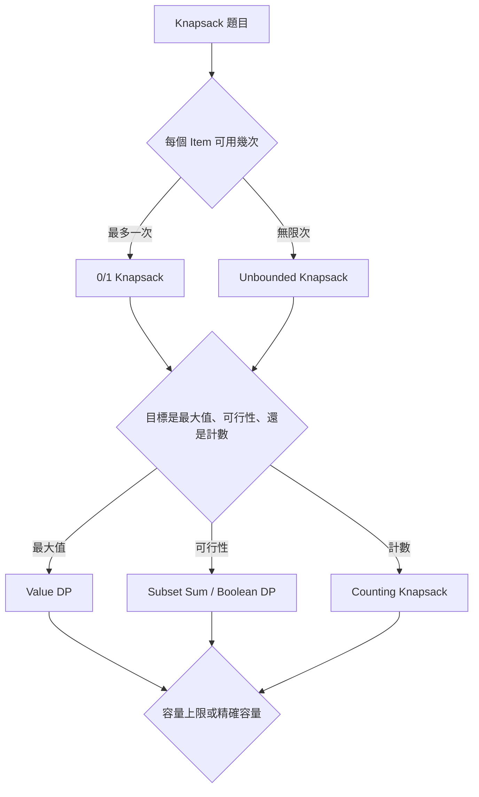
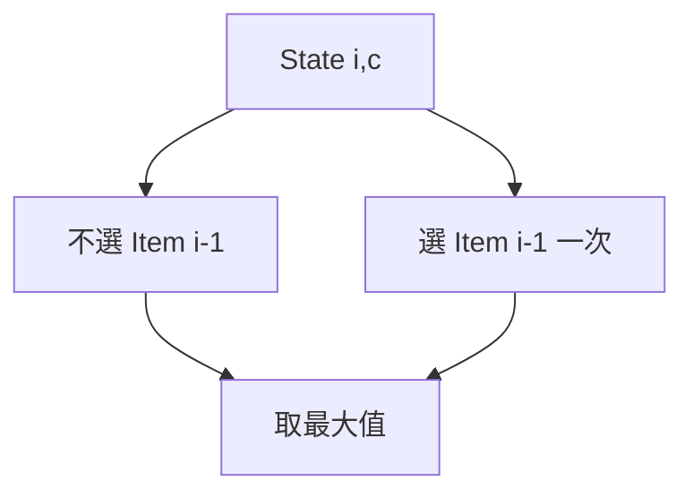
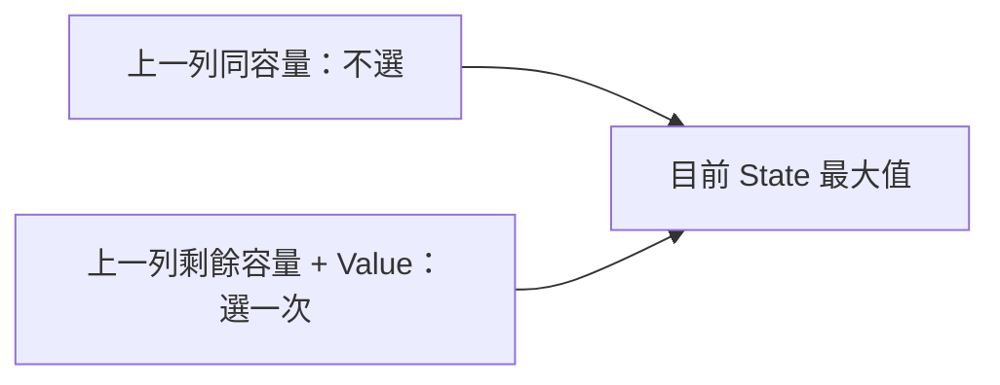
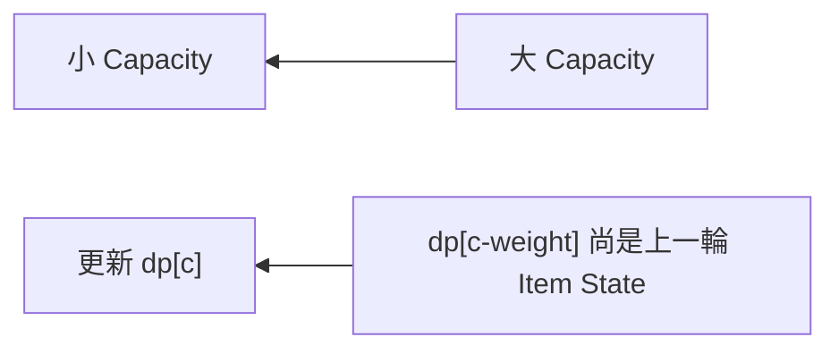
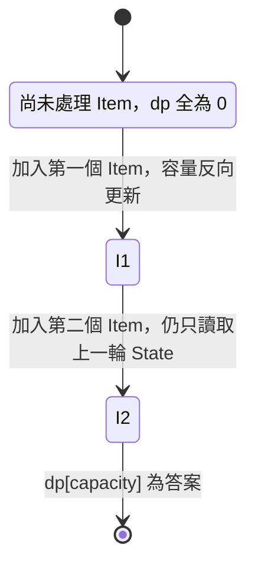
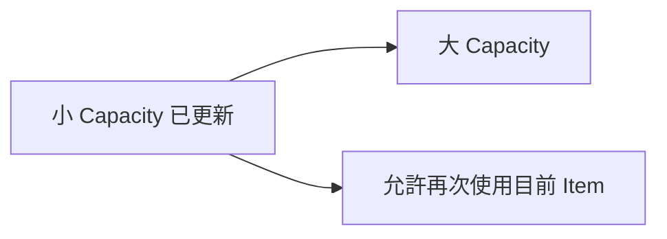
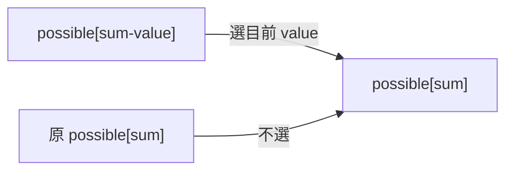
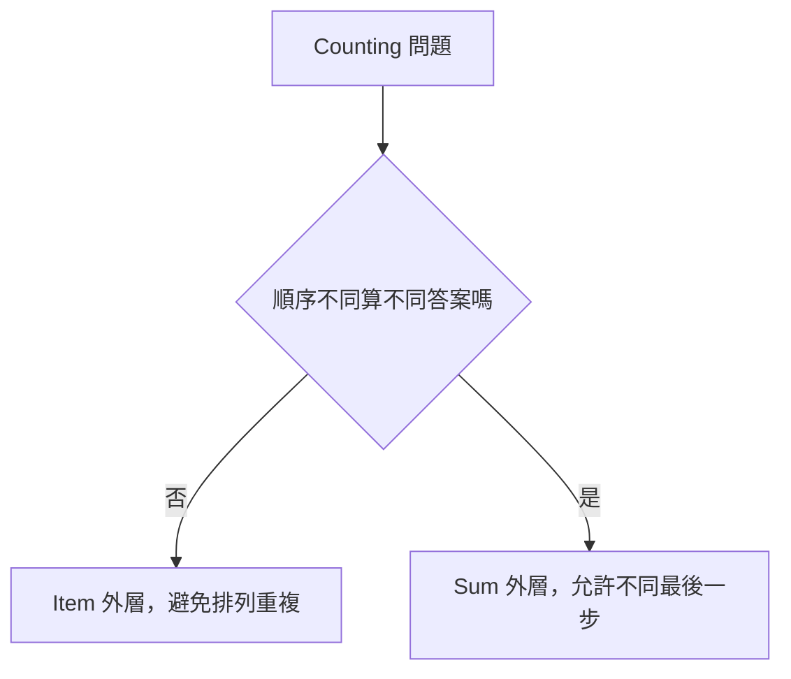
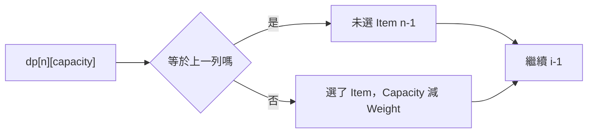
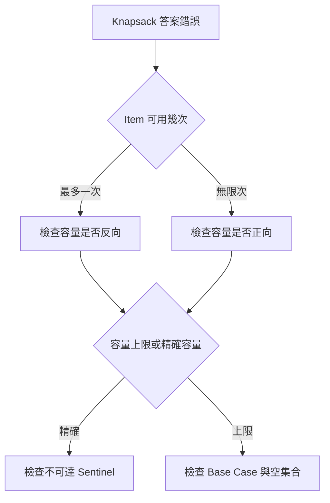

## 第 40 章　Knapsack 背包問題

### 適用範圍

本章介紹 Knapsack 類 DP，包括 0/1 Knapsack、二維 Transition、一維空間改善、容量反向走訪、Unbounded Knapsack、Subset Sum、Counting Knapsack、精確容量、容量上限、Reconstruction 與題型辨識。

Knapsack 的核心問題不是只有「背包容量」，而是要先釐清：每個 Item 可以使用幾次，以及 `dp[capacity]` 表示「容量上限」還是「精確容量」。走訪方向會直接改變 Item 能否在同一輪重複使用。原始章節也明確指出，0/1 與 Unbounded 的 Transition 看似相同，但 Capacity 走訪方向表達不同使用次數。citeturn48search1

本版會補上更完整的推導、可編譯 C++ 實作、常見題型辨識、Loop 順序語意、Reconstruction、Debug 流程與測試案例。



### 適用讀者

- 已理解一維 DP，但不清楚容量與 Item 維度如何設計的讀者。
- 會寫二維 Knapsack，但一維壓縮後常把 Item 重複使用的讀者。
- 容易混淆 0/1、Unbounded、Subset Sum、Coin Change 的讀者。
- 不確定 Counting Knapsack 中 Combination 與 Permutation 差別的讀者。
- 需要輸出選了哪些 Item，但只保存一維 DP 而無法 Reconstruction 的讀者。

### 快速導覽

- [40.1 Knapsack State](#401-knapsack-state)
- [40.2 0/1 Knapsack](#402-01-knapsack)
- [40.3 二維 Transition](#403-二維-transition)
- [40.4 一維改善與反向走訪](#404-一維改善與反向走訪)
- [40.5 完整案例：0/1 Knapsack](#405-完整案例01-knapsack)
- [40.6 Unbounded Knapsack](#406-unbounded-knapsack)
- [40.7 Subset Sum](#407-subset-sum)
- [40.8 Counting Knapsack](#408-counting-knapsack)
- [40.9 Combination Count 與 Permutation Count](#409-combination-count-與-permutation-count)
- [40.10 精確容量與容量上限](#4010-精確容量與容量上限)
- [40.11 Reconstruction](#4011-reconstruction)
- [40.12 題型辨識](#4012-題型辨識)
- [40.13 時間與空間限制](#4013-時間與空間限制)
- [40.14 系統化 Debug](#4014-系統化-debug)
- [40.15 常見問題與判讀](#4015-常見問題與判讀)
- [40.16 本章檢查表](#4016-本章檢查表)
- [40.17 本章重點](#4017-本章重點)

### 40.1 Knapsack State

0/1 Knapsack 常見二維定義：

```text
dp[i][c] = 只考慮前 i 個 Item，在容量上限 c 下的最大 Value
```

每個 Item 有兩個選擇：

- 不選。
- 若容量足夠，選一次。



State 定義必須說明 Item 範圍與 Capacity 語意，否則 Transition 很容易差一列或重複使用 Item。原始章節也特別提醒，State 定義必須說明 Item 範圍與 Capacity 語意。citeturn48search1

#### Knapsack State 的三個關鍵

<table>
<tr><th>項目</th><th>要問的問題</th><th>常見答案</th></tr>
<tr><td>Item 範圍</td><td>目前考慮哪些 Item？</td><td>前 i 個 Item、已處理 Item</td></tr>
<tr><td>Capacity 語意</td><td>容量是上限還是必須剛好用完？</td><td>容量上限 / 精確容量</td></tr>
<tr><td>目標</td><td>保存最大值、可行性、還是方法數？</td><td>max value / bool / count</td></tr>
</table>

#### 為什麼 Item 維度重要

0/1 Knapsack 中每個 Item 最多選一次。如果 Transition 不區分「已處理到第幾個 Item」，就容易在同一輪反覆拿同一個 Item。

二維 DP 使用 `dp[i-1][...]` 確保選與不選都只來自上一列，也就是不會重複使用第 i 個 Item。

### 40.2 0/1 Knapsack

0/1 Knapsack：每個 Item 最多選一次。

假設第 `i-1` 個 Item 的重量是 `weight[i-1]`，價值是 `value[i-1]`。

Transition：

```text
dp[i][c] = max(
    dp[i-1][c],
    dp[i-1][c - weight[i-1]] + value[i-1]
)
```

前提是 `weight[i-1] <= c`。

原始章節也指出，選或不選都只從上一列 `i-1` 轉移，因此同一 Item 不會重複使用。citeturn48search1



#### Base Case

```text
dp[0][c] = 0
```

表示沒有任何 Item 時，在容量上限 c 下最大 Value 是 0。

此 Base Case 隱含：

- 空集合是合法候選。
- 不要求背包必須裝滿。
- Value 不會因空集合而非法。

若題目改成「容量必須剛好用完」，初始化就不同，詳見精確容量一節。

### 40.3 二維 Transition

以下是 0/1 Knapsack 的二維版本。

```cpp
#include <algorithm>
#include <vector>

long long knapsack01TwoDimensional(
    const std::vector<int>& weight,
    const std::vector<long long>& value,
    int capacity)
{
    const int n = static_cast<int>(weight.size());

    std::vector<std::vector<long long>> dp(
        n + 1,
        std::vector<long long>(capacity + 1, 0));

    for (int i = 1; i <= n; ++i)
    {
        for (int c = 0; c <= capacity; ++c)
        {
            dp[i][c] = dp[i - 1][c];

            if (weight[i - 1] <= c)
            {
                dp[i][c] = std::max(
                    dp[i][c],
                    dp[i - 1][c - weight[i - 1]] + value[i - 1]);
            }
        }
    }

    return dp[n][capacity];
}
```

原始章節也提供二維 Transition 範例，並說明此版本假設允許不裝滿容量，且空集合為合法候選。citeturn48search1

#### 複雜度

```text
時間：O(n × capacity)
空間：O(n × capacity)
```

#### 二維版本的優點

- State 語意清楚。
- 容易 Debug。
- 容易 Reconstruction。
- 不容易誤把 0/1 寫成 Unbounded。

#### 二維版本的缺點

- 空間較大。
- capacity 很大時可能無法承受。

### 40.4 一維改善與反向走訪

壓縮後：

```text
dp[c] = 已處理 Item 中，容量上限 c 的最大 Value
```

0/1 Knapsack 必須讓 Capacity 由大到小：

```cpp
for (int c = capacity; c >= weight; --c)
{
    dp[c] = std::max(dp[c], dp[c - weight] + value);
}
```

原始章節指出，反向走訪確保 `dp[c-weight]` 尚未使用目前 Item；若正向走訪，較小 Capacity 先更新，後方可能再次使用同一 Item，變成 Unbounded 語意。citeturn48search1



#### 為什麼要反向

假設 Item 重量 2，價值 10，capacity = 4。

若正向走訪：

```text
c = 2 時，dp[2] = 10
c = 4 時，讀 dp[2] + 10 = 20
```

這代表同一個 Item 被用了兩次，不符合 0/1。

反向走訪時，`dp[2]` 還沒用目前 Item 更新，所以 `dp[4]` 不會同輪重複使用同一 Item。

### 40.5 完整案例：0/1 Knapsack

```cpp
#include <algorithm>
#include <vector>

long long knapsack01(
    const std::vector<int>& weight,
    const std::vector<long long>& value,
    int capacity)
{
    if (weight.size() != value.size() || capacity < 0)
    {
        return 0;
    }

    std::vector<long long> dp(capacity + 1, 0);

    for (std::size_t i = 0; i < weight.size(); ++i)
    {
        for (int c = capacity; c >= weight[i]; --c)
        {
            dp[c] = std::max(
                dp[c],
                dp[c - weight[i]] + value[i]);
        }
    }

    return dp[capacity];
}
```

原始章節也提供這個一維 0/1 Knapsack 案例，並提醒 Precondition 應要求 Weight 為正；Weight 0 配合正 Value 需要另行定義，尤其在 Unbounded 問題中會造成無限 Value。citeturn48search1



#### 測試案例

```text
weight = [2, 3, 4]
value  = [4, 5, 6]
capacity = 5
答案 = 9，選 weight 2 與 3
```

#### 常見 Precondition

- `weight.size() == value.size()`。
- `capacity >= 0`。
- 0/1 Knapsack 通常要求 `weight[i] > 0`。
- 若 value 可能為負，空集合是否合法會影響初始化與答案。

### 40.6 Unbounded Knapsack

Unbounded Knapsack：每個 Item 可使用任意次數。

一維 Capacity 應由小到大：

```cpp
for (int c = weight; c <= capacity; ++c)
{
    dp[c] = std::max(dp[c], dp[c - weight] + value);
}
```

正向走訪讓 `dp[c-weight]` 可以包含目前 Item，因此可重複使用。原始章節也明確說明，0/1 與 Unbounded 的 Transition 看似相同，走訪方向卻表達不同使用次數。citeturn48search1



#### C++ 實作

```cpp
#include <algorithm>
#include <vector>

long long unboundedKnapsack(
    const std::vector<int>& weight,
    const std::vector<long long>& value,
    int capacity)
{
    std::vector<long long> dp(capacity + 1, 0);

    for (std::size_t i = 0; i < weight.size(); ++i)
    {
        for (int c = weight[i]; c <= capacity; ++c)
        {
            dp[c] = std::max(
                dp[c],
                dp[c - weight[i]] + value[i]);
        }
    }

    return dp[capacity];
}
```

#### Weight 0 風險

若 `weight[i] == 0` 且 `value[i] > 0`，Unbounded Knapsack 的答案可以無限大，因為可以無限次拿該 Item。因此題目需明確排除此情況，或定義特殊處理。

### 40.7 Subset Sum

Subset Sum 問題：每個數最多選一次，判斷能否組成 Target。

Boolean State：

```text
possible[sum] = 是否能用已處理元素形成 sum
```

```cpp
#include <vector>

bool subsetSum(
    const std::vector<int>& nums,
    int target)
{
    if (target < 0)
    {
        return false;
    }

    std::vector<bool> possible(target + 1, false);
    possible[0] = true;

    for (int value : nums)
    {
        for (int sum = target; sum >= value; --sum)
        {
            possible[sum] = possible[sum] || possible[sum - value];
        }
    }

    return possible[target];
}
```

原始章節也提供相同 Subset Sum 實作，並指出 `possible[0] = true` 代表空集合可形成 Sum 0，是 Transition 的 Identity。citeturn48search1



#### 限制

上述寫法假設 `nums` 非負。如果有負數，sum 範圍不再是 `0..target`，需要 Offset、Hash Set 或其他方法。

### 40.8 Counting Knapsack

Counting Knapsack 計算方法數。常見 Transition：

```text
count[sum] += count[sum - value]
```

但 Loop 順序會決定計算的是 Combination 還是 Permutation。原始章節也指出，以 Coin Change 為例：Item 在外、Sum 正向通常計算 Combination；Sum 在外、Item 在內通常計算不同順序的 Permutation。citeturn48search1



#### Combination Count：順序不同不算不同

例如硬幣組合：`1 + 2` 與 `2 + 1` 算同一種。

```cpp
#include <vector>

long long coinChangeCombinations(
    const std::vector<int>& coins,
    int target)
{
    std::vector<long long> count(target + 1, 0);
    count[0] = 1;

    for (int coin : coins)
    {
        for (int sum = coin; sum <= target; ++sum)
        {
            count[sum] += count[sum - coin];
        }
    }

    return count[target];
}
```

#### Permutation Count：順序不同算不同

例如爬樓梯或組合總和中，`1 + 2` 與 `2 + 1` 算兩種。

```cpp
#include <vector>

long long coinChangePermutations(
    const std::vector<int>& coins,
    int target)
{
    std::vector<long long> count(target + 1, 0);
    count[0] = 1;

    for (int sum = 1; sum <= target; ++sum)
    {
        for (int coin : coins)
        {
            if (coin <= sum)
            {
                count[sum] += count[sum - coin];
            }
        }
    }

    return count[target];
}
```

#### Count Overflow

Count 可能快速 Overflow，需依題目使用：

- `long long`。
- 大數。
- Modulo。

原始章節也提醒，Count 可能快速 Overflow，需依題目使用較寬型別或取模。citeturn48search1

### 40.9 Combination Count 與 Permutation Count

Loop 順序的本質是「目前選擇是否有固定順序」。

#### Item 外層

```text
for item:
    for sum:
```

代表每種組合會依固定 Item 順序被建立，因此不會把不同排列重複算入。

#### Sum 外層

```text
for sum:
    for item:
```

代表每個 `sum` 都在枚舉「最後一步選哪個 item」，所以不同順序會被分別計算。

#### 小例子

coins = [1, 2]，target = 3。

Combination：

```text
1 + 1 + 1
1 + 2
共 2 種
```

Permutation：

```text
1 + 1 + 1
1 + 2
2 + 1
共 3 種
```

### 40.10 精確容量與容量上限

兩種 State 不可混用：

```text
dp[c] = 容量不超過 c 的最佳值
dp[c] = 恰好使用容量 c 的最佳值
```

精確容量版本中，不可達 State 不能初始化為 0，否則會被誤視為合法。

```text
dp[0] = 0
其他 dp[c] = Negative Infinity 或 Unreachable
```

原始章節也明確指出，精確容量需要區分不可達 State 與合法值 0。citeturn48search1


#### 精確容量最大 Value 實作

```cpp
#include <algorithm>
#include <limits>
#include <vector>

long long knapsackExactCapacity(
    const std::vector<int>& weight,
    const std::vector<long long>& value,
    int capacity)
{
    const long long NEG_INF = std::numeric_limits<long long>::lowest() / 4;
    std::vector<long long> dp(capacity + 1, NEG_INF);
    dp[0] = 0;

    for (std::size_t i = 0; i < weight.size(); ++i)
    {
        for (int c = capacity; c >= weight[i]; --c)
        {
            if (dp[c - weight[i]] == NEG_INF)
            {
                continue;
            }

            dp[c] = std::max(
                dp[c],
                dp[c - weight[i]] + value[i]);
        }
    }

    return dp[capacity];
}
```

若回傳 `NEG_INF`，表示無法剛好裝滿容量。

### 40.11 Reconstruction

一維 DP 常只保存最佳值，無法直接知道選了哪些 Item。原始章節列出幾種方式：使用二維 DP 反向比較、另存 Decision、保留 Parent Capacity 與 Item，但一維更新覆寫需小心。citeturn48search1



#### 使用二維 DP Reconstruction

```cpp
#include <algorithm>
#include <vector>

std::vector<int> reconstructKnapsack01(
    const std::vector<int>& weight,
    const std::vector<long long>& value,
    int capacity,
    const std::vector<std::vector<long long>>& dp)
{
    std::vector<int> chosen;
    int c = capacity;

    for (int i = static_cast<int>(weight.size()); i >= 1; --i)
    {
        if (dp[i][c] == dp[i - 1][c])
        {
            continue;
        }

        chosen.push_back(i - 1);
        c -= weight[i - 1];
    }

    std::reverse(chosen.begin(), chosen.end());
    return chosen;
}
```

#### Tie 的影響

若選與不選都能得到相同 Value，上述程式會選擇「不選」。若題目要求字典序、Item 數最少或其他 Tie-breaking，需要修改判斷規則。

### 40.12 題型辨識

<table>
<tr><th>題目特徵</th><th>可能模型</th><th>關鍵檢查</th></tr>
<tr><td>每個 Item 最多選一次，容量限制下最大價值</td><td>0/1 Knapsack</td><td>一維容量反向走訪</td></tr>
<tr><td>每個 Item 可選任意次</td><td>Unbounded Knapsack</td><td>一維容量正向走訪</td></tr>
<tr><td>判斷能否湊出 target</td><td>Subset Sum</td><td>`possible[0] = true`</td></tr>
<tr><td>計算湊出 target 的組合數</td><td>Counting Combination</td><td>Item 外層</td></tr>
<tr><td>計算湊出 target 的排列數</td><td>Counting Permutation</td><td>Sum 外層</td></tr>
<tr><td>必須剛好用完容量</td><td>Exact Capacity DP</td><td>不可達 State 不可初始化為 0</td></tr>
<tr><td>需要輸出選了哪些 Item</td><td>Reconstruction</td><td>保留二維 DP 或 Decision</td></tr>
</table>

#### 常見題目文字提示

- 「每個物品最多一次」：0/1。
- 「可以重複使用」：Unbounded。
- 「是否可以湊出」：Boolean。
- 「有幾種方法」：Counting。
- 「順序不同算不同」：Permutation Count。
- 「恰好」：Exact Capacity。
- 「不超過」：容量上限。

### 40.13 時間與空間限制

Knapsack 的複雜度常和容量有關。

```text
時間：O(n × capacity)
空間：O(capacity) 或 O(n × capacity)
```

這是 Pseudo-polynomial Time，因為 capacity 是數值大小，不是輸入位元長度。

#### 容量很大時

若 capacity 很大，例如 10^9，普通 Knapsack DP 不可行。此時可能要考慮：

- value 維度 DP。
- Meet-in-the-middle。
- Branch and Bound。
- Greedy 是否有特殊性質，例如 Fractional Knapsack。
- 題目是否另有結構。

#### value 維度 DP

若總 value 小，但 capacity 大，可以定義：

```text
dp[v] = 達到總價值 v 的最小重量
```

最後找 `dp[v] <= capacity` 的最大 v。

### 40.14 系統化 Debug

Knapsack Debug 時，建議記錄：

```text
目前 Item index
weight / value
capacity c
更新前 dp[c]
讀取來源 dp[c - weight]
更新後 dp[c]
走訪方向
State 是容量上限還是精確容量
```

#### 小型測試

```text
capacity = 0
沒有 Item
單一 Item 放得下
單一 Item 放不下
兩個 Item 剛好放滿
0/1 中同一 Item 不可重複
Unbounded 中同一 Item 可重複
精確容量不可達
Counting 中 Combination / Permutation 差異
```



### 40.15 常見問題與判讀

原始章節的常見問題包含 0/1 Item 被重複使用、Unbounded 只能用一次、精確容量假答案、Subset Sum 忘記 `possible[0]`、Counting 多算排列、Value Overflow、Weight 0 無限更新、Reconstruction 失敗。citeturn48search1

<table>
<tr><th>現象</th><th>可能原因</th><th>第一輪檢查</th></tr>
<tr><td>0/1 Item 被重複使用</td><td>Capacity 正向走訪</td><td>改成反向</td></tr>
<tr><td>Unbounded 只能用一次</td><td>Capacity 反向走訪</td><td>改成正向</td></tr>
<tr><td>精確容量出現假答案</td><td>不可達 State 初始化為 0</td><td>使用 Sentinel</td></tr>
<tr><td>Subset Sum 無法形成 0</td><td>`possible[0]` 未設 true</td><td>設定空集合 Base Case</td></tr>
<tr><td>Counting 多算排列</td><td>Loop 順序錯誤</td><td>先定義 Combination 或 Permutation</td></tr>
<tr><td>Value Overflow</td><td>累積型別太小</td><td>使用 long long 或取模</td></tr>
<tr><td>Weight 0 無限更新</td><td>Unbounded 且正 Value</td><td>檢查 Weight Precondition</td></tr>
<tr><td>Reconstruction 失敗</td><td>空間壓縮丟失 Decision</td><td>保留二維表或 Parent</td></tr>
<tr><td>容量很大導致記憶體爆掉</td><td>未估算 O(capacity)</td><td>考慮 value 維度或其他方法</td></tr>
<tr><td>負 Value 答案不符合預期</td><td>空集合是否合法未定義</td><td>重新確認 Base Case 與答案要求</td></tr>
</table>

### 40.16 本章檢查表

- 我能定義 Item 範圍與 Capacity State。
- 我能區分容量上限與精確容量。
- 我能寫出 0/1 Knapsack 二維 Transition。
- 我知道一維 0/1 必須反向走訪 Capacity。
- 我知道 Unbounded 通常正向走訪 Capacity。
- 我能使用 Subset Sum 的 Boolean State。
- 我知道 `possible[0] = true` 的意義。
- 我能區分 Combination Count 與 Permutation Count。
- 我會為不可達 State 使用正確 Sentinel。
- 我會檢查 Weight 0、Value Overflow 與 capacity 範圍。
- 我知道空間改善可能使 Reconstruction 更困難。
- 我能估算 O(n × capacity) 是否可接受。

原始章節檢查表也包含 Item 範圍、Capacity State、0/1 二維 Transition、一維反向走訪、Unbounded 正向走訪、Subset Sum、`possible[0]=true`、Combination / Permutation、精確容量、Sentinel 與 Reconstruction 等項目。citeturn48search1

### 40.17 本章重點

- Knapsack State 必須明確定義 Item 範圍、Capacity 與目標值。
- 0/1 Knapsack 每個 Item 最多一次，一維改善需反向走訪容量。
- Unbounded Knapsack 可重複使用 Item，通常正向走訪容量。
- Subset Sum 是 Boolean 0/1 Knapsack，Sum 0 由空集合形成。
- Counting Knapsack 的 Loop 順序會影響 Combination 與 Permutation 語意。
- 精確容量需要區分不可達與合法值 0。
- 空間改善降低記憶體，但可能丟失 Reconstruction 所需資訊。
- Weight 0、負 Value、Overflow、容量過大都需要在實作前確認。
