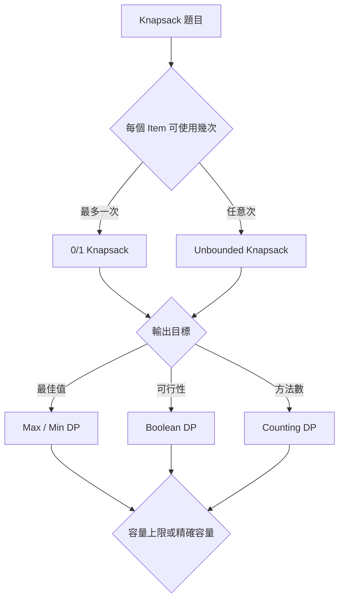
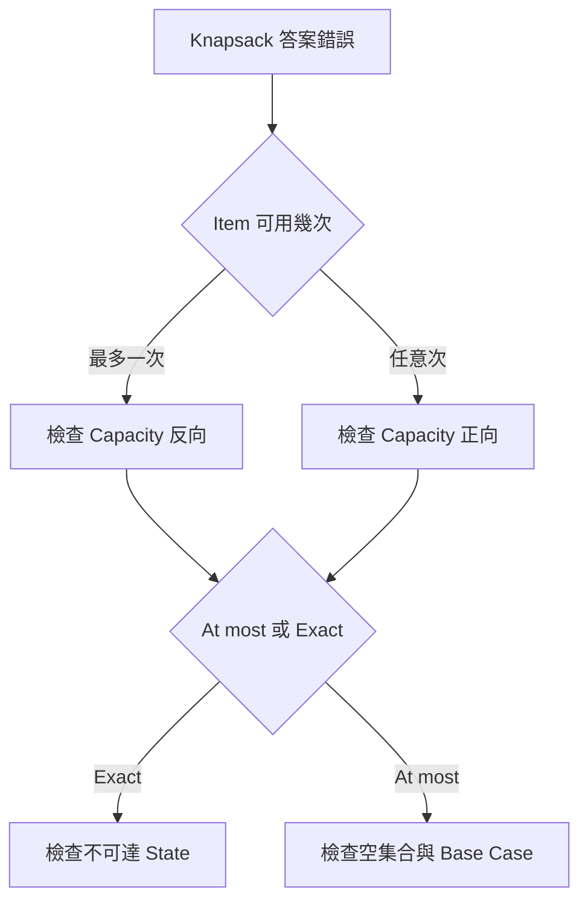

## 第 40 章　Knapsack 背包問題

### 適用範圍

本章介紹 Knapsack 類 Dynamic Programming，包括 0/1 Knapsack、Unbounded Knapsack、Subset Sum、Counting Knapsack、精確容量、空間壓縮、Reconstruction 與 Value-based DP。

Knapsack 不只是在處理「背包」。它描述一類共同模型：

- 有一組 Item。
- 每個 Item 有成本，例如 Weight、Time 或 Price。
- 有一個資源限制，例如 Capacity、Budget 或 Target Sum。
- 每個 Item 可使用零次、一次或多次。
- 目標可能是最大值、最小值、可行性或方法數。

真正需要先釐清的是：

1. 每個 Item 可以使用幾次？
2. `dp[c]` 表示容量上限，還是恰好使用容量 `c`？
3. 保存的是最大 Value、Boolean 可行性，還是 Count？
4. 空集合是否合法？
5. 順序不同是否算不同方案？
6. 是否需要還原選取的 Item？

一維 Knapsack 中，Loop 順序不是單純的程式寫法。它會直接決定同一 Item 能否在同一輪再次被使用，也會改變 Counting 問題計算 Combination 還是 Permutation。



### 適用讀者

- 已理解一維 DP，但不清楚 Item 與 Capacity 維度的讀者。
- 會寫二維 Knapsack，壓縮後卻容易重複使用 Item 的讀者。
- 容易混淆 0/1、Unbounded、Subset Sum 與 Coin Change 的讀者。
- 不確定 Combination Count 與 Permutation Count 差別的讀者。
- 需要 Reconstruction，卻太早移除完整 DP Table 的讀者。
- 容易忽略 Weight 0、負 Value、Overflow 與巨大 Capacity 的讀者。

### 快速導覽

- [40.1 Knapsack 前要分析什麼](#401-knapsack-前要分析什麼)
- [40.2 二維 0/1 Knapsack](#402-二維-01-knapsack)
- [40.3 一維壓縮與反向走訪](#403-一維壓縮與反向走訪)
- [40.4 完整案例：0/1 Knapsack](#404-完整案例01-knapsack)
- [40.5 Unbounded Knapsack](#405-unbounded-knapsack)
- [40.6 Subset Sum](#406-subset-sum)
- [40.7 Counting Knapsack](#407-counting-knapsack)
- [40.8 Combination 與 Permutation](#408-combination-與-permutation)
- [40.9 容量上限與精確容量](#409-容量上限與精確容量)
- [40.10 Reconstruction 與 Tie-breaking](#4010-reconstruction-與-tie-breaking)
- [40.11 Value-based DP 與巨大 Capacity](#4011-value-based-dp-與巨大-capacity)
- [40.12 題型辨識](#4012-題型辨識)
- [40.13 複雜度與數值範圍](#4013-複雜度與數值範圍)
- [40.14 系統化 Debug](#4014-系統化-debug)
- [40.15 常見問題與判讀](#4015-常見問題與判讀)
- [40.16 本章檢查表](#4016-本章檢查表)
- [40.17 本章重點](#4017-本章重點)

### 40.1 Knapsack 前要分析什麼

0/1 Knapsack 的常見二維 State：

```text
dp[i][c]
= 只考慮前 i 個 Item，
  在總 Weight 不超過 c 的條件下，可取得的最大 Value
```

這句話包含三項關鍵資訊：

- Item 範圍：前 `i` 個 Item。
- Capacity 語意：總 Weight 不超過 `c`。
- 輸出目標：最大 Value。

| 分析項目 | 要回答的問題 | 常見選項 |
|---|---|---|
| Item 使用次數 | 每個 Item 可使用幾次？ | 0/1、Unbounded、Bounded |
| Capacity 語意 | 不超過還是恰好等於？ | At most、Exact |
| 輸出目標 | Table 保存什麼？ | Max、Min、Boolean、Count |
| 空集合 | 是否為合法答案？ | 合法、不合法 |
| 順序 | 不同排列是否分開計算？ | Combination、Permutation |
| 輸出內容 | 只求值還是要實際選擇？ | Value、Reconstruction |

若這些規格沒有先固定，相同的 Transition 外形可能代表不同問題。

### 40.2 二維 0/1 Knapsack

0/1 表示每個 Item 最多使用一次。

第 `i - 1` 個 Item 的 Weight 與 Value 分別為：

```text
weight[i - 1]
value[i - 1]
```

#### 不選目前 Item

```text
dp[i - 1][c]
```

#### 選目前 Item

若 `weight[i - 1] <= c`：

```text
dp[i - 1][c - weight[i - 1]]
+ value[i - 1]
```

兩個候選都來自上一列，因此目前 Item 不會被使用兩次。

#### Transition

```text
dp[i][c] = max(
    dp[i - 1][c],
    dp[i - 1][c - weight[i - 1]] + value[i - 1]
)
```

#### Base Case

```text
dp[0][c] = 0
```

此 Base Case 假設：

- 容量不用剛好裝滿。
- 空集合合法。
- 空集合的 Value 為 0。

#### C++20 實作

```cpp
#include <algorithm>
#include <stdexcept>
#include <vector>

long long knapsack01TwoDimensional(
    const std::vector<int>& weight,
    const std::vector<long long>& value,
    int capacity) {

    if (weight.size() != value.size()) {
        throw std::invalid_argument(
            "weight and value sizes must match");
    }

    if (capacity < 0) {
        throw std::invalid_argument(
            "capacity must be non-negative");
    }

    const int n = static_cast<int>(weight.size());

    std::vector<std::vector<long long>> dp(
        n + 1,
        std::vector<long long>(capacity + 1, 0));

    for (int i = 1; i <= n; ++i) {
        if (weight[i - 1] <= 0) {
            throw std::invalid_argument(
                "weights must be positive");
        }

        for (int c = 0; c <= capacity; ++c) {
            dp[i][c] = dp[i - 1][c];

            if (weight[i - 1] <= c) {
                dp[i][c] = std::max(
                    dp[i][c],
                    dp[i - 1][c - weight[i - 1]]
                    + value[i - 1]);
            }
        }
    }

    return dp[n][capacity];
}
```

#### 複雜度

- 時間 O(n × capacity)。
- 空間 O(n × capacity)。

二維版本較容易檢查 State，也方便 Reconstruction。確認模型正確後，再考慮一維壓縮。

### 40.3 一維壓縮與反向走訪

壓縮後：

```text
dp[c]
= 已處理 Item 中，總 Weight 不超過 c 時的最大 Value
```

處理目前 Item 時，0/1 Knapsack 必須讓 Capacity 由大到小：

```cpp
for (int c = capacity; c >= itemWeight; --c) {
    dp[c] = std::max(
        dp[c],
        dp[c - itemWeight] + itemValue);
}
```

#### 為什麼反向

假設只有一個 Item：

```text
Weight = 2
Value = 10
Capacity = 4
```

若正向更新：

```text
c = 2：dp[2] 變成 10
c = 4：讀到本輪剛更新的 dp[2]，得到 20
```

這等同同一 Item 使用兩次。

反向更新時，計算 `dp[4]` 的 `dp[2]` 仍代表「尚未加入目前 Item」的上一輪 State，因此最多使用一次。

#### Loop Invariant

處理某個 Item 的 Capacity `c` 時：

```text
dp[c - itemWeight]
仍是尚未使用目前 Item 的結果。
```

這就是反向走訪的語意，而不只是記憶技巧。

### 40.4 完整案例：0/1 Knapsack

```cpp
#include <algorithm>
#include <stdexcept>
#include <vector>

long long knapsack01(
    const std::vector<int>& weight,
    const std::vector<long long>& value,
    int capacity) {

    if (weight.size() != value.size()) {
        throw std::invalid_argument(
            "weight and value sizes must match");
    }

    if (capacity < 0) {
        throw std::invalid_argument(
            "capacity must be non-negative");
    }

    std::vector<long long> dp(capacity + 1, 0);

    for (std::size_t i = 0; i < weight.size(); ++i) {
        if (weight[i] <= 0) {
            throw std::invalid_argument(
                "weights must be positive");
        }

        for (int c = capacity; c >= weight[i]; --c) {
            dp[c] = std::max(
                dp[c],
                dp[c - weight[i]] + value[i]);
        }
    }

    return dp[capacity];
}
```

#### 範例

```text
weight = [2, 3, 4]
value = [4, 5, 6]
capacity = 5
```

最佳選擇是 Weight 2 與 Weight 3，Value 為 9。

#### 負 Value

此版本允許不選任何 Item，因此所有 Value 都為負時會回傳 0。若題目要求至少選一個 Item，State 與初始化必須另外設計，不能直接沿用全 0 Table。

### 40.5 Unbounded Knapsack

Unbounded Knapsack 允許每個 Item 使用任意次數。

一維更新時，Capacity 由小到大：

```cpp
for (int c = itemWeight; c <= capacity; ++c) {
    dp[c] = std::max(
        dp[c],
        dp[c - itemWeight] + itemValue);
}
```

正向走訪讓 `dp[c - itemWeight]` 可以包含目前 Item，因此可再次使用。

```cpp
#include <algorithm>
#include <stdexcept>
#include <vector>

long long unboundedKnapsack(
    const std::vector<int>& weight,
    const std::vector<long long>& value,
    int capacity) {

    if (weight.size() != value.size()) {
        throw std::invalid_argument(
            "weight and value sizes must match");
    }

    if (capacity < 0) {
        throw std::invalid_argument(
            "capacity must be non-negative");
    }

    std::vector<long long> dp(capacity + 1, 0);

    for (std::size_t i = 0; i < weight.size(); ++i) {
        if (weight[i] <= 0) {
            throw std::invalid_argument(
                "unbounded weights must be positive");
        }

        for (int c = weight[i]; c <= capacity; ++c) {
            dp[c] = std::max(
                dp[c],
                dp[c - weight[i]] + value[i]);
        }
    }

    return dp[capacity];
}
```

若 Weight 為 0 且 Value 為正，可無限次選取並得到無限 Value，因此一般 Unbounded 模型要求 Weight 為正。

### 40.6 Subset Sum

Subset Sum 判斷每個非負整數最多使用一次時，是否能形成 Target。

#### State

```text
possible[sum]
= 是否能用已處理元素形成精確 Sum `sum`
```

#### Base Case

```text
possible[0] = true
```

空集合可形成 Sum 0。

#### Transition

```text
possible[sum]
= possible[sum]
or possible[sum - value]
```

因為每個值最多使用一次，Sum 要反向走訪。

```cpp
#include <stdexcept>
#include <vector>

bool subsetSum(
    const std::vector<int>& nums,
    int target) {

    if (target < 0) {
        return false;
    }

    std::vector<bool> possible(target + 1, false);
    possible[0] = true;

    for (int value : nums) {
        if (value < 0) {
            throw std::invalid_argument(
                "this implementation requires non-negative values");
        }

        for (int sum = target; sum >= value; --sum) {
            possible[sum] =
                possible[sum] || possible[sum - value];
        }
    }

    return possible[target];
}
```

若輸入含負數，合法 Sum 不再只位於 `0..target`。此時可能需要 Offset Table、Hash Set 或其他 State Design。

### 40.7 Counting Knapsack

Counting Knapsack 常使用：

```text
count[sum]
= 形成精確 Sum `sum` 的方法數
```

Base Case：

```text
count[0] = 1
```

表示形成 0 的空選擇有一種。

Transition：

```text
count[sum] += count[sum - item]
```

但是 Loop 順序與走訪方向會決定：

- Item 是否可重複使用。
- 不同排列是否分開計算。

方法數可能很快 Overflow。必須依題目規格使用較寬型別、大整數或 Modulo。

### 40.8 Combination 與 Permutation

#### Combination Count

順序不同算同一種，例如 `1 + 2` 與 `2 + 1` 不分開。

Item 在外層，Sum 正向：

```cpp
#include <stdexcept>
#include <vector>

long long coinChangeCombinations(
    const std::vector<int>& coins,
    int target) {

    if (target < 0) {
        return 0;
    }

    std::vector<long long> count(target + 1, 0);
    count[0] = 1;

    for (int coin : coins) {
        if (coin <= 0) {
            throw std::invalid_argument(
                "coins must be positive");
        }

        for (int sum = coin; sum <= target; ++sum) {
            count[sum] += count[sum - coin];
        }
    }

    return count[target];
}
```

每種 Coin 依固定順序加入，因此同一組 Coin 不會因排列不同而重複計算。

#### Permutation Count

順序不同算不同答案。Sum 在外層，Item 在內層：

```cpp
#include <stdexcept>
#include <vector>

long long coinChangePermutations(
    const std::vector<int>& coins,
    int target) {

    if (target < 0) {
        return 0;
    }

    for (int coin : coins) {
        if (coin <= 0) {
            throw std::invalid_argument(
                "coins must be positive");
        }
    }

    std::vector<long long> count(target + 1, 0);
    count[0] = 1;

    for (int sum = 1; sum <= target; ++sum) {
        for (int coin : coins) {
            if (coin <= sum) {
                count[sum] += count[sum - coin];
            }
        }
    }

    return count[target];
}
```

這個順序是在枚舉「最後放入哪個 Coin」，因此不同最後一步會形成不同排列。

對 `coins = [1, 2]`、`target = 3`：

```text
Combination：
1 + 1 + 1
1 + 2
共 2 種

Permutation：
1 + 1 + 1
1 + 2
2 + 1
共 3 種
```

### 40.9 容量上限與精確容量

這兩種 State 不可混用：

```text
dp[c] = 總 Weight 不超過 c 的最佳 Value
```

```text
dp[c] = 總 Weight 恰好等於 c 的最佳 Value
```

容量上限版本通常可讓所有 `dp[c] = 0`，因為空集合在任何容量上限下都合法。

精確容量版本只有 `dp[0]` 一開始可達：

```text
dp[0] = 0
其他 dp[c] = NEG_INF
```

```cpp
#include <algorithm>
#include <limits>
#include <optional>
#include <stdexcept>
#include <vector>

std::optional<long long> knapsackExactCapacity(
    const std::vector<int>& weight,
    const std::vector<long long>& value,
    int capacity) {

    if (weight.size() != value.size() || capacity < 0) {
        throw std::invalid_argument("invalid input");
    }

    const long long NEG_INF =
        std::numeric_limits<long long>::lowest() / 4;

    std::vector<long long> dp(capacity + 1, NEG_INF);
    dp[0] = 0;

    for (std::size_t i = 0; i < weight.size(); ++i) {
        if (weight[i] <= 0) {
            throw std::invalid_argument(
                "weights must be positive");
        }

        for (int c = capacity; c >= weight[i]; --c) {
            if (dp[c - weight[i]] == NEG_INF) {
                continue;
            }

            dp[c] = std::max(
                dp[c],
                dp[c - weight[i]] + value[i]);
        }
    }

    if (dp[capacity] == NEG_INF) {
        return std::nullopt;
    }

    return dp[capacity];
}
```

以 `optional` 回傳，可清楚區分「不可達」與合法答案剛好等於某個 Sentinel。

### 40.10 Reconstruction 與 Tie-breaking

完整二維 Table 最容易還原 0/1 Knapsack 的選擇。

從 `dp[n][capacity]` 往回：

- 若 `dp[i][c] == dp[i - 1][c]`，可不選 Item `i - 1`。
- 否則選了 Item `i - 1`，並令 `c -= weight[i - 1]`。

```cpp
#include <algorithm>
#include <vector>

std::vector<int> reconstructKnapsack01(
    const std::vector<int>& weight,
    int capacity,
    const std::vector<std::vector<long long>>& dp) {

    std::vector<int> chosenIndices;
    int c = capacity;

    for (int i = static_cast<int>(weight.size());
         i >= 1;
         --i) {

        if (dp[i][c] == dp[i - 1][c]) {
            continue;
        }

        chosenIndices.push_back(i - 1);
        c -= weight[i - 1];
    }

    std::reverse(
        chosenIndices.begin(),
        chosenIndices.end());

    return chosenIndices;
}
```

若選與不選得到相同 Value，上述版本優先不選。若題目要求：

- Item 數最少。
- Item 數最多。
- Index 字典序較小。
- Weight 較小。

就需要在 DP State 中保存額外比較資訊，或明確設計 Tie-breaking。只保存最大 Value 不一定足夠。

一維壓縮會覆蓋歷史列，Reconstruction 較困難。可選擇保留二維 Table、Parent / Decision，或使用額外重算策略。

### 40.11 Value-based DP 與巨大 Capacity

標準 Knapsack 的 O(n × Capacity) 是 Pseudo-polynomial Time。若 Capacity 為 `10^9`，即使輸入只用約 30 Bits 表示，仍無法配置十億格 Table。

若總 Value 較小，可以交換維度：

```text
dp[v]
= 達到總 Value 恰好為 v 時的最小 Weight
```

Base Case：

```text
dp[0] = 0
其他 dp[v] = INF
```

處理完所有 Item 後，找最大的 `v`，使：

```text
dp[v] <= capacity
```

其時間通常是 O(n × totalValue)，適合 Weight 很大但 Value 總和可接受的情況。

其他可能方向包括：

- Meet-in-the-middle。
- Sparse State Map。
- 特殊限制下的 Greedy。
- Approximation。
- 依題目結構使用不同模型。

Fractional Knapsack 允許切割 Item，通常是 Greedy，不是 0/1 DP。

### 40.12 題型辨識

| 題目特徵 | 常見模型 | 關鍵檢查 |
|---|---|---|
| 每個 Item 最多一次 | 0/1 Knapsack | 一維 Capacity 反向 |
| 每個 Item可重複使用 | Unbounded Knapsack | 一維 Capacity 正向 |
| 判斷能否形成 Target | Subset Sum | `possible[0] = true` |
| 計算無序組合數 | Combination Count | Item 外層 |
| 計算有序排列數 | Permutation Count | Sum 外層 |
| 必須剛好填滿 | Exact Capacity | 不可達 State 使用 Sentinel |
| Capacity 巨大但 Value 小 | Value-based DP | 最小 Weight 對 Value |
| 需要選取清單 | Reconstruction | 保留 Table 或 Parent |

題目中的「每個只能一次」、「可重複」、「恰好」、「不超過」與「順序不同算不同」都是重要規格，但仍應完整寫出 State，不能只依關鍵字套用。

### 40.13 複雜度與數值範圍

標準 0/1 與 Unbounded Knapsack：

```text
時間：O(n × capacity)
空間：O(capacity) 或 O(n × capacity)
```

這是 Pseudo-polynomial，而不是輸入 Bit Length 的 Polynomial Time。

還要檢查：

- `capacity + 1` 是否可配置。
- `dp[c - weight] + value` 是否 Overflow。
- Count 是否需要 Modulo 或大整數。
- Weight、Value 是否允許 0 或負數。
- Exact State 的 Sentinel 是否可能和合法答案衝突。
- Reconstruction Table 是否超過 Memory Limit。

### 40.14 系統化 Debug

#### 每輪記錄欄位

```text
Item Index
Weight / Value
目前 Capacity c
走訪方向
更新前 dp[c]
來源 dp[c - weight]
候選值
更新後 dp[c]
State 是容量上限或精確容量
```

#### 排查流程

1. 用完整句子寫出 `dp[c]`。
2. 確認 Item 使用次數。
3. 檢查 Capacity 走訪方向。
4. 確認 Base Case 與空集合語意。
5. Exact State 檢查不可達 Sentinel。
6. Counting 題確認是否計算 Combination 或 Permutation。
7. 先用二維 Table 比對一維結果。
8. 用暴力枚舉小型 Item Set 交叉驗證。
9. 保留第一個更新不符合 State Definition 的 Capacity。



#### 最小測試

- 沒有 Item。
- Capacity 為 0。
- 單一 Item 放得下或放不下。
- 兩個 Item 剛好填滿。
- 0/1 中單一 Item 不可重複。
- Unbounded 中單一 Item可重複。
- Exact Capacity 不可達。
- 所有 Value 為負數。
- Combination 與 Permutation 得到不同答案。
- Count 接近型別上限。

### 40.15 常見問題與判讀

| 現象 | 可能原因 | 第一輪檢查 |
|---|---|---|
| 0/1 Item 被重複使用 | Capacity 正向走訪 | 改成反向 |
| Unbounded Item 只能用一次 | Capacity 反向走訪 | 改成正向 |
| Exact Capacity 出現假答案 | 不可達 State 初始化為 0 | 使用 Sentinel 或 `optional` |
| Subset Sum 無法形成 0 | `possible[0]` 未設為 true | 設定空集合 Base Case |
| Counting 多算排列 | Loop 順序與 Combination 語意不合 | 讓 Item 位於外層 |
| Counting 少算排列 | 使用固定 Item 順序 | 若順序重要，讓 Sum 位於外層 |
| Weight 0 出現無限 Value | Unbounded 且 Value 為正 | 要求 Weight 為正或另定規格 |
| 負 Value 答案不符預期 | 空集合是否合法未定義 | 重設 Base Case 與答案要求 |
| `dp[c]` 看似正確但無法還原 | 歷史列已被壓縮 | 保留二維 Table 或 Parent |
| Capacity 太大而無法配置 | 未辨認 Pseudo-polynomial 成本 | 改用 Value-based 或其他方法 |
| Count 變成負數 | Integer Overflow | 檢查型別與 Modulo |
| 多個最佳解輸出不穩定 | 未定義 Tie-breaking | 將規則納入 State 或更新條件 |

### 40.16 本章檢查表

- 我能定義 Item 範圍、Capacity 語意與輸出目標。
- 我能區分容量上限與精確容量。
- 我能寫出二維 0/1 Knapsack Transition。
- 我知道一維 0/1 必須反向走訪 Capacity。
- 我知道 Unbounded 通常正向走訪 Capacity。
- 我能用 Loop Invariant 解釋走訪方向。
- 我能使用 Boolean State 解 Subset Sum。
- 我知道 `possible[0] = true` 的語意。
- 我能區分 Combination Count 與 Permutation Count。
- 我會為 Exact State 使用不可達 Sentinel。
- 我知道 Weight 0 在 Unbounded 問題中的風險。
- 我會檢查負 Value、Overflow 與 Modulo。
- 我知道一維壓縮可能失去 Reconstruction 資訊。
- 我能估算 O(n × Capacity) 是否可接受。
- 我知道 Capacity 巨大時可考慮 Value-based DP。
- 我會用二維 Table 或暴力枚舉驗證小型案例。

### 40.17 本章重點

- Knapsack State 必須明確定義 Item 範圍、Capacity 與答案語意。
- 0/1 Knapsack 每個 Item 最多使用一次，一維版本需反向走訪 Capacity。
- Unbounded Knapsack允許重複使用 Item，一維版本通常正向走訪 Capacity。
- Loop 順序是在表達 State Dependency，不只是寫法偏好。
- Subset Sum 是精確 Sum 的 Boolean 0/1 Knapsack。
- `possible[0] = true` 與 `count[0] = 1` 都代表空選擇的 Base Case。
- Counting Knapsack 的 Loop 順序會改變 Combination 與 Permutation 語意。
- 容量上限可允許未使用空間；精確容量必須區分不可達 State。
- 空間壓縮降低記憶體，但可能移除 Reconstruction 所需歷史資訊。
- Weight 0、負 Value、Overflow、Modulo 與 Tie-breaking 都應在 State Design 前確認。
- O(n × Capacity) 是 Pseudo-polynomial，Capacity 巨大時可能要改用 Value-based DP 或其他方法。
- Debug 時應先固定 State Definition，再檢查走訪方向、初始化與第一個錯誤 Capacity。
