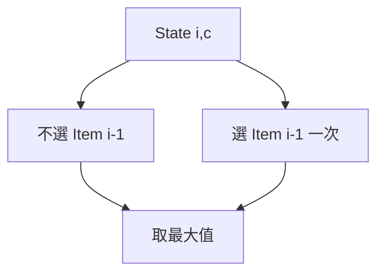
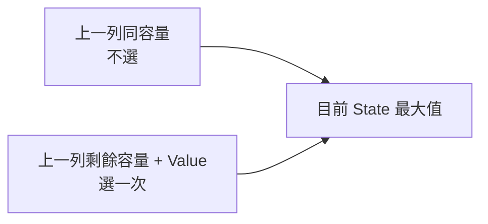
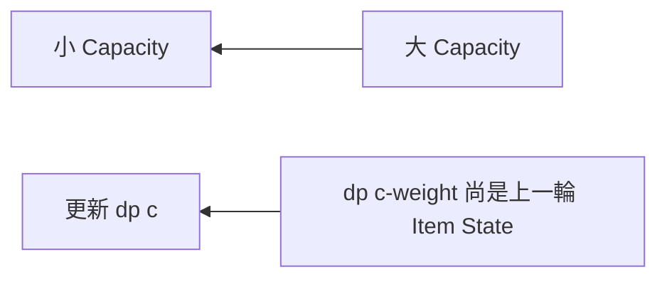
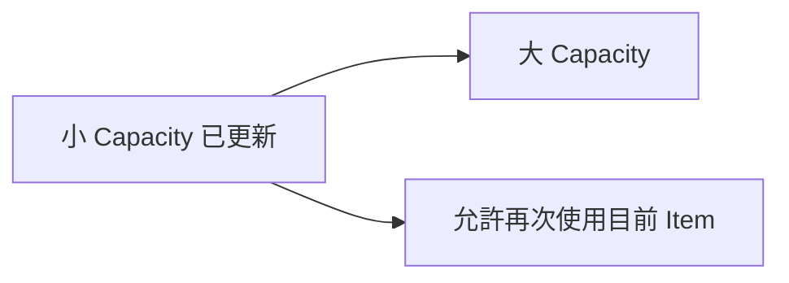
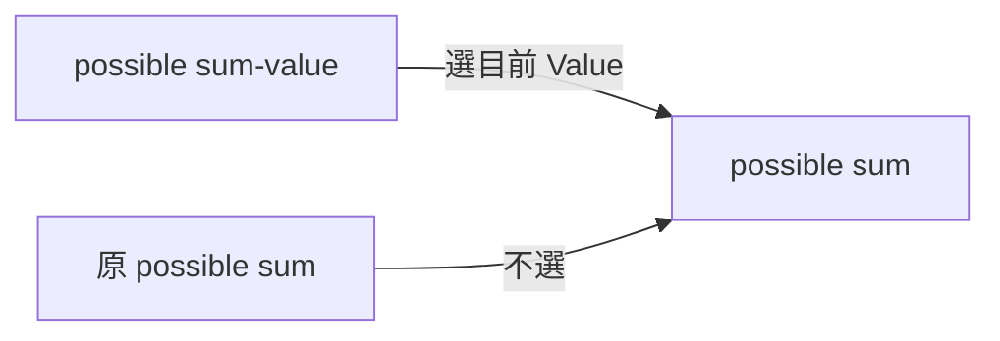
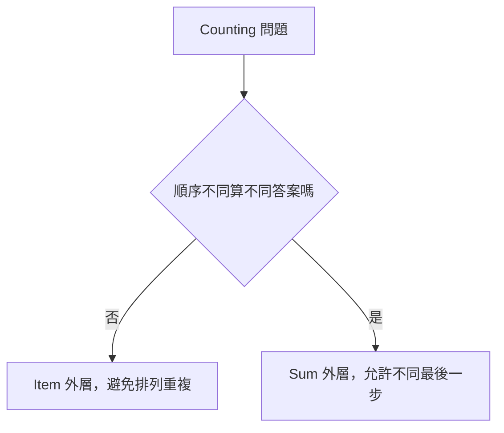
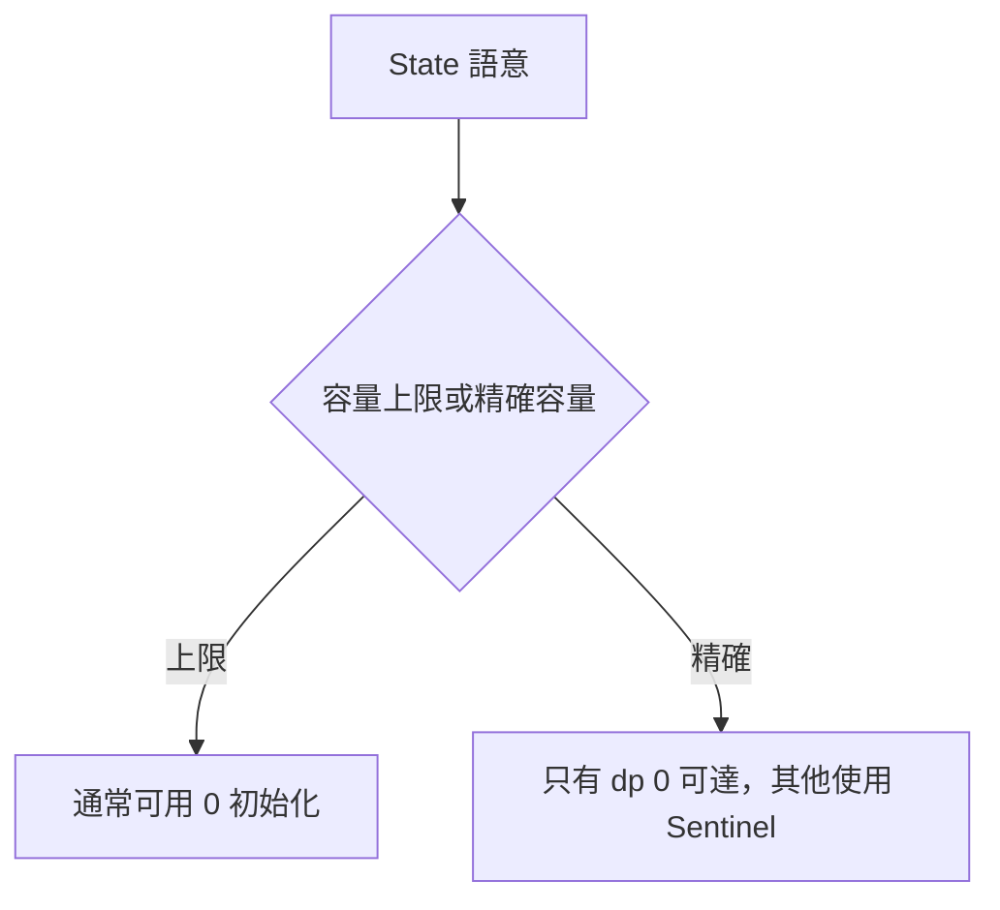

## 第 40 章　Knapsack 背包問題

### 適用範圍

本章介紹 0/1 Knapsack、一維空間改善、容量反向走訪、Unbounded Knapsack、Subset Sum、Counting Knapsack 與題型辨識。

Knapsack 的核心問題是每個 Item 可以使用幾次，以及 `dp[capacity]` 表示「容量上限」還是「精確容量」。走訪方向會直接改變 Item 能否在同一輪重複使用。

### 快速導覽

- [Knapsack State](#401-knapsack-state)
- [0/1 Knapsack](#402-01-knapsack)
- [二維 Transition](#403-二維-transition)
- [一維改善與反向走訪](#404-一維改善與反向走訪)
- [完整案例：0/1 Knapsack](#405-完整案例01-knapsack)
- [Unbounded Knapsack](#406-unbounded-knapsack)
- [Subset Sum](#407-subset-sum)
- [Counting Knapsack](#408-counting-knapsack)
- [精確容量與容量上限](#409-精確容量與容量上限)
- [Reconstruction](#4010-reconstruction)
- [常見問題與判讀](#4011-常見問題與判讀)
- [本章檢查表](#4012-本章檢查表)
- [本章重點](#4013-本章重點)

### 40.1 Knapsack State

0/1 Knapsack 常見二維定義：

```text
dp[i][c] = 只考慮前 i 個 Item，在容量上限 c 下的最大 Value
```

每個 Item 有兩個選擇：

- 不選。
- 若容量足夠，選一次。



State 定義必須說明 Item 範圍與 Capacity 語意，否則 Transition 很容易差一列或重複使用 Item。

### 40.2 0/1 Knapsack

每個 Item 最多選一次。

```text
dp[i][c] = max(
    dp[i-1][c],
    dp[i-1][c-weight] + value
)
```

選或不選都只從上一列 `i-1` 轉移，因此同一 Item 不會重複使用。



### 40.3 二維 Transition

```cpp
long long knapsack01TwoDimensional(
    const std::vector<int>& weight,
    const std::vector<int>& value,
    int capacity)
{
    const int n = static_cast<int>(weight.size());
    std::vector<std::vector<long long>> dp(
        n + 1,
        std::vector<long long>(capacity + 1, 0));

    for (int i = 1; i <= n; ++i)
    {
        for (int c = 0; c <= capacity; ++c)
        {
            dp[i][c] = dp[i - 1][c];

            if (weight[i - 1] <= c)
            {
                dp[i][c] = std::max(
                    dp[i][c],
                    dp[i - 1][c - weight[i - 1]]
                        + value[i - 1]);
            }
        }
    }

    return dp[n][capacity];
}
```

Base Case：沒有 Item 時最大 Value 為 0。此版本假設允許不裝滿容量，而且 Value 的規格使空集合為合法候選。

### 40.4 一維改善與反向走訪

壓縮後：

```text
dp[c] = 已處理 Item 中，容量上限 c 的最大 Value
```

0/1 Knapsack 必須讓 Capacity 由大到小：

```cpp
for (int c = capacity; c >= weight; --c)
{
    dp[c] = std::max(dp[c], dp[c - weight] + value);
}
```



反向走訪確保 `dp[c-weight]` 尚未使用目前 Item。若正向走訪，較小 Capacity 先更新，後方可能再次使用同一 Item，變成 Unbounded 語意。

### 40.5 完整案例：0/1 Knapsack

```cpp
long long knapsack01(
    const std::vector<int>& weight,
    const std::vector<int>& value,
    int capacity)
{
    if (weight.size() != value.size() || capacity < 0)
    {
        return 0;
    }

    std::vector<long long> dp(capacity + 1, 0);

    for (std::size_t i = 0; i < weight.size(); ++i)
    {
        for (int c = capacity; c >= weight[i]; --c)
        {
            dp[c] = std::max(
                dp[c],
                dp[c - weight[i]] + value[i]);
        }
    }

    return dp[capacity];
}
```


Precondition 應要求 Weight 為正。Weight 0 配合正 Value 需要另行定義，尤其在 Unbounded 問題中會造成無限 Value。

### 40.6 Unbounded Knapsack

每個 Item 可使用任意次數。一維 Capacity 應由小到大：

```cpp
for (int c = weight; c <= capacity; ++c)
{
    dp[c] = std::max(dp[c], dp[c - weight] + value);
}
```



正向走訪讓 `dp[c-weight]` 可以包含目前 Item，因此可重複使用。

0/1 與 Unbounded 的 Transition 看似相同，走訪方向卻表達不同使用次數。

### 40.7 Subset Sum

問題：每個數最多選一次，判斷能否組成 Target。

```cpp
bool subsetSum(
    const std::vector<int>& nums,
    int target)
{
    std::vector<bool> possible(target + 1, false);
    possible[0] = true;

    for (int value : nums)
    {
        for (int sum = target; sum >= value; --sum)
        {
            possible[sum] =
                possible[sum] || possible[sum - value];
        }
    }

    return possible[target];
}
```



`possible[0] = true` 代表空集合可形成 Sum 0，是 Transition 的 Identity。

### 40.8 Counting Knapsack

若計算組合數：

```text
count[sum] += count[sum - value]
```

走訪順序還會決定計算的是 Combination 還是 Permutation。

以 Coin Change 為例：

- Item 在外、Sum 正向：通常計算 Combination。
- Sum 在外、Item 在內：通常計算不同順序的 Permutation。



Count 可能快速 Overflow，需依題目使用較寬型別或取模。

### 40.9 精確容量與容量上限

兩種 State 不可混用：

```text
dp[c] = 容量不超過 c 的最佳值
dp[c] = 恰好使用容量 c 的最佳值
```

精確容量版本中，不可達 State 不能初始化為 0，否則會被誤視為合法：

```text
dp[0] = 0
其他 dp[c] = Negative Infinity 或 Unreachable
```



### 40.10 Reconstruction

一維 DP 常只保存最佳值，無法直接知道選了哪些 Item。可使用：

- 二維 DP 反向比較 `dp[i][c]` 與 `dp[i-1][c]`。
- 另存 Decision。
- 保留 Parent Capacity 與 Item，但需小心一維更新覆寫。


### 40.11 常見問題與判讀

| 現象 | 可能原因 | 第一輪檢查 |
|---|---|---|
| 0/1 Item 被重複使用 | Capacity 正向走訪 | 改成反向 |
| Unbounded 只能用一次 | Capacity 反向走訪 | 改成正向 |
| 精確容量出現假答案 | 不可達 State 初始化為 0 | 使用 Sentinel |
| Subset Sum 無法形成 0 | `possible[0]` 未設 True | 設定空集合 Base Case |
| Counting 多算排列 | Loop 順序錯誤 | 先定義 Combination 或 Permutation |
| Value Overflow | 累積型別太小 | 使用 long long 或取模 |
| Weight 0 無限更新 | Unbounded 且正 Value | 檢查 Weight Precondition |
| Reconstruction 失敗 | 空間壓縮丟失 Decision | 保留二維表或 Parent |

### 40.12 本章檢查表

- 我能定義 Item 範圍與 Capacity State。
- 我能寫出 0/1 Knapsack 二維 Transition。
- 我知道一維 0/1 必須反向走訪 Capacity。
- 我知道 Unbounded 通常正向走訪 Capacity。
- 我能使用 Subset Sum 的 Boolean State。
- 我知道 `possible[0]=true` 的意義。
- 我能區分 Combination Count 與 Permutation Count。
- 我能區分容量上限與精確容量。
- 我會為不可達 State 使用正確 Sentinel。
- 我知道空間改善可能使 Reconstruction 更困難。

### 40.13 本章重點

- Knapsack State 必須明確定義 Item 範圍、Capacity 與目標值。
- 0/1 Knapsack 每個 Item 最多一次，一維改善需反向走訪容量。
- Unbounded Knapsack 可重複使用 Item，通常正向走訪容量。
- Subset Sum 是 Boolean 0/1 Knapsack，Sum 0 由空集合形成。
- Counting Knapsack 的 Loop 順序會影響 Combination 與 Permutation 語意。
- 精確容量需要區分不可達與合法值 0。
- 空間改善降低記憶體，但可能丟失 Reconstruction 所需資訊。
